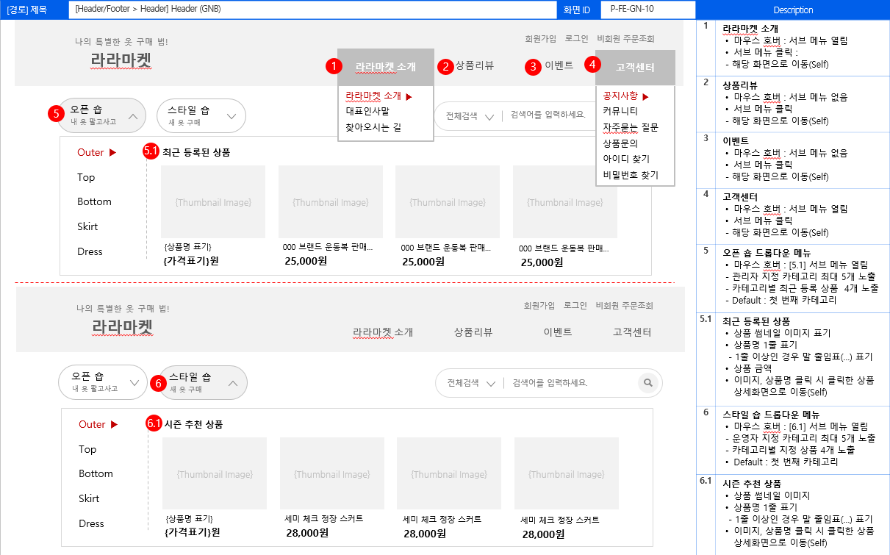

# IT 기획자로 생각 전환하기

## '기획'이란 무엇일까?
### 1. 기획
- 특정한 목적을 설정하고, 그 목적을 실행할 수 있도록 계획하는 것

## IT 기획자는 어떤일을 할까?
- 달성할 목적을 설정하고, 그 목적이 이루어질 수 있도록 연구하고 계획을 세우며 실행하는 사람을 말한다.
- 어떤 사람은 웹/앱 기획을 '계획'이나 '화면 설계'하는 일로 오해하기도 한다.
- 실무자 입장에서 기획업무(목적,계획,실행)을 좀 더 구체적으로 살펴본다면 어떤것들이 있을까?

### 1. 목적
- 사람들에게 필요한 서비스가 무엇인지 고민한다.
- 지금 제공하는 서비스보다 더 나은 서비스는 무엇인지, 이 서비스가 회사에 가져다주는 이익은 무엇인지 등을 고민한다.
- 서비스의 목적을 설정하고 이 서비스가 사람들에게 필요한 이유는 무엇인지, 주 이용자는 누구이며, 업계 경쟁자들은 어떻게 서비스를 하고 있는지 등을 분석하여 서비스의 방향을 찾는다.

### 2. 계획
- 서비스 제공을 위해 필요한 것과 해야 할 것을 나열해보고, 필요한 시간을 가늠한다.
- 목적 설정이 완료되면, 서비스를 어떻게 구현할지 계획을 구체적으로 세운다.
- 웹/앱 기획 단계에서 계획이란 필요한 자원, 업무의 배분과 일정을 순서대로 정리해본다는 의미이다.
- 계획을 다 세우면 서비스 구현을 완료하는 시점과 필요한 예산을 가늠해 볼 수 있다.

### 3. 실행
- 계획한 것을 실행하면서 리스크를 관리한다.
- 실행 단게에서는 회면 기획, 디자인, 퍼블리싱, 개발, 테스트와 품질 보증단계로 진행한다.
- **화면기획단계**: 기능 정의, 정책 정의, 화면 설계를 한다.
- **디자인,퍼블리싱**: 완료한 작업물이 기획 의도에 맞게 구현되었는지 확인하는 업무를 한다. 또한 기획 단계에서 예상하지 못했던 사항에 대책을 마련하고 기획 내용을 교정해간다.

## IT 기획자의 구분과 역할

### 1. 서비스 기획자
- 없던 서비스를 만들거나, 예전부터 있던 서비스이지만 불편한 점을 개선해 사람들에게 더욱 이로운 서비스를 제공하는 기획을 한다.
- IT에서는 일반적으로 웹이나 앱의 서비스 기획을 한다.
#### 서비스 기획자의 업무
1. 세상에 필요한 서비스 생각하기
   - 기업의 전문 분야 내에서 서비스를 고민하기도 하고, 기업이 사업을 확장하는 경우 새로운 분야에서 서비스 아이디어를 찾기도 한다.
   - 이러한 과정에서 같은 업계의 타 서비스를 벤치마킹하기도 하며, 예상 이용자와 인터뷰하기, 아이디어 회의하기 등을 통해 서비스를 구상한다.
2. 서비스 정의하기
   - 제작할 서비스가 무엇일지 정리해야 한다.
   - 앞으로 제작할 서비스는 무엇이고, 이 서비스가 세상에 어떤 변화를 불러오고, 고객에게는 어떤 유익을 주는지 등 기대 효과를 정의하며 정리한다.
3. 수익 모델 설계하기
   - 기획한 서비스로 어떤 이득이 생기는지 생각해야한다.
   - 수익 모델을 만들 때에는 매출뿐 아니라 가입자 수, 방문자 수, 브랜드 인지도를 높여 잠재 고객을 확보할 수 있는 방법이나 지표도 생각해야 한다.
4. 이용 프로세스 설계하기
   - 주요 서비스를 이용하는 프로세스를 대략 설계한다.
   - 서비스의 주요 사항을 이용 흐름에 따라 설계하고, 이용자가 어떤 상황에서 어떤 기능을 이용할지 시나리오까지 함께 설계한다.
5. 프로토타입 설계하기
   - IT의 웹/앱 제작 분야에서 프로토타입이란 실제 서비스를 구현하기 전에 웹이나 앱의 주요 화면을 대략 알아보려고 만든 초안을 말한다.
   - 프로토타입은 앞으로 구현할 웹/앱의 실제 운영 화면에 가까운 디자인을 제공하므로 관계자들이 쉽게 이해할 수 있다.

### 2. 구축 기획자
- 제작할 서비스의 시작부터 끝까지 모든 프로세스와 화면을 설계하는 업무를 한다.

#### 구축 기획자의 업무
1. 서비스 분석 단계 - 요구사항 분석하기
   - 제작할 웹 사이트의 주제와 필요한 기능을 모아 '요구사항'을 정리한다.
   - 의뢰자가 웹 사이트를 만들려고 하는 목적을 이해하고, 의뢰자가 요구하는 사항을 확인하며 웹 사이트의 구조와 필요한 기능을 정리한다.
   - 요구사항 분석을 완료하면 기능 정의서 등의 문서를 작성한다.
   -  문서들을 작성 완료 했다면 웹 사이트에 필요한 화면이 무엇인지 확인할 수 있다.
2. 화면 설계 단계 1
   - 이용자가 웹 사이트에서 특정한 목적을 수행하는 과정과 그 과정에서 발생하는 데이터의 저장, 호출 등을 그림으로 표현한것이다.
   - 이용 프로세스를 토대로 여러 개발자들과 함께 개발에 필요한 사항을 예측해 보면서 누락된 사항은 없는지, 더욱 효과적인 방법은 없는지 등을 논의하며 연구하기도 한다.
3. 화면 설계 단계 2
   - 화면정의서 작성하기
   - 화면 정의서는 웹 사이트를 구축하는 데 중요한 필수 문서로, 화면의 레이아웃과 여러 기능을 설명하는 내용이 담겨 있다.
   - 화면 정의서 작성 일정은 보통 짧게는 2개월 길게는 6개월까지 잡는다.
4. 디자인, 퍼블리싱 단계
   - 화면 정의서를 작성 완료하면 이를 토대로 웹 디자인과 웹 퍼블리싱을 진행한다.
   - 구축 기획자는 웹 디자인과 웹 퍼블리싱의 결과물을 받아 기획 의도에 맞게 완성했는지를 검토한다.
5. 개발,테스트 단계
   - 디자인, 퍼블리싱이 완료되면 본격적으로 개발을 진행하고, 개발을 완료한 후에는 화면 정의서대로 잘 구현했는지, 기능에 오류는 없는지 등을 검수한다.

### 3. 운영 기획자
1. 웹 사이트 운영에 필요한 대부분의 기획 업무 진행하기
   - 웹 사이트 제작 단계에서 발견하지 못한 오류를 수정한다.
   - 주로 실제 이용자가 서비스를 이용하면서 발견한 오류를 운영자가 접수하여 해결한다.
   - 이용자의 이용 형태를 분석하여 문제를 미리 발견하거나 더 편리한 방법을 찾아 웹 사이트를 개선한다.
   - 사업을 확장하거나 신규 서비스가 도출되면 웹 사이트에 새로운 메뉴나 기능을 추가한다.
2. 상품 상세 화면 기획하기
   - 상세 정보 영역 페이지에 게시할 게시물을 기획하는 것을 말한다.
   - 상품 상세 정보를 기획하려면 제품의 특징을 잘 파악해서 적절하게 표현하는것이 중요하다
3. 이벤트 기획하기
   - 기업의 서비스 기획 팀 등에서 이벤트의 목적과 주제를 정하면 운영기획자가 이벤트 기획물을 기획한다.
4. 마케팅 지원하기
   - 웹사이트에 가입한 회원에게 각종 소식을 전달하려고 회원별 메일링,sms,알림톡을 발송한다.

## 웹사이트의 유형별 개념 이해하기
- 상거래 사이트에는 웹 사이트 소개, 회원 가입, 상품 목록, 구매, 결제, 교환/환불, 리뷰, 공지 사항, 문의 등 다양한 기능이 필요하므로 웹 사이트를 설계할 때 이를 응용하여 설계할 수 있기 때문이다.
- 그래도 웹 사이트 기획자라면 유형별로 어떤 특징이 있고, 어떤 개념을 사용하는지 정도는 알고 설계해야 한다.

### 브랜드 홍보형 웹 사이트 - 홈페이지
- 브랜드 홍보형 웹 사이트는 가장 간단하게 구현할 수 있는 유형이다.
- 주문이나 결제 기능도 필요 없고, 관리자 화면도 없거나 아주 단순하기 때문이다.
- 글과 그림/이미지로 필요한 정보를 제공해주면 된다.

- 브랜드 홍보형에서는 웹 사이트의 화면과 구조 설계도 중요하지만, 담을 내용을 기획하는데 더 중점을 두어야 한다.
- 기업의 핵심 가치나 상품의 매력을 소비자에게 설득력 있게 전달하려면 무엇을 어떻게 표현할지 문구와 이미지 하나라도 신중하게 고민해야 한다.

1. 한 화면에 표현할 개념 요약해서 보여주기
    - 소비자에게 10개를 알려 주고 싶은 마음에 한 화면에 10개를 모두 담는다고 해서 소비자가 다 읽는 것은 아니다.
    - 많은 정보를 노출했을 때 오히려 소비자에게 좋지 않은 영향을 줄 수도 있다.
      - **밀러의 법칙** : 보통 사람은 정보를 한 번에 최대 7개 정도밖에 저장할 수 없다.
      - **인지적 구두쇠 현상** : 인간은 기본적으로 깊게 생각하는 것을 싫어해서 선택지가 많으면 선택을 미룬다.
      - **힉의 법칙** : 선택지의 개수가 많아지면 의사결정 시간이 오래 걸린다
    - 한 화면에 많은 정보를 담으면 의도한 효과를 오히려 내지 못하는 경우도 많다.
    - 따라서 소비자에게 알려주고 싶은 사항이 많더라도 중요도를 따져 3 ~ 4개로 정리하는 것이 좋다.

2. 표현 방법 고민하기
   - 같은 내용이라도 어떻게 표현하느냐에 따라 소비자에게 전달되는 느낌이 다르다.

|실용 정보 전달 방식|기대 효과 중심 전달 방식|
|----------------|----------------------|
|Do it웹사이트 기획 입문 실무에 필요한 문서 작성 방법을 모두 담았습니다.   - 기능 정의서 작성 방법  - 정책 정의서 작성 방법  - 이용자 화면 정의서 작성 방법  - 관리자 화면 정의서 작성방법|Do it!웹 사이트 기획입문 책 한권으로 2년차 IT기획자가 되세요!! 지식과 경험을 함께 채워드립니다.|

3. 글의 분위기에 맞게 디자인하기
    - 웹 사이트에서 상품이나 기업을 소개할 때 어떤 분위기를 연출하여 메시지를 전달할 것인가도 중요하다.
    - 단순히 폰트와 몇 가지 디자인 요소만 바꿔도 전달하는 느낌은 달라진다.

- 소비자에게 전달하려는 메시지에 어울리는 디자인을 연출했을 때 전달력은 배가된다.
- 단순히 심미성이 높은 디자인을 추구하기보다 메시지에 어울리는 디자인이 되도록 유도하는 것이 효과적이다.
- 따라서 웹 사이트에 담을 메시지가 정해졌다면 어떻게 표현하면 좋을지 다른 웹사이트를 벤치마킹도 해보면서 표현 방법을 고민해야 한다.

### 쇼핑몰형 웹 사이트 - 이커머스
- 이커머스란 전자상거래를 말한다.
- 우리가 흔히 알고 있는 의류 쇼핑몰을 포함하여 쿠팡, G마켓, 11번가 등 상품을 사고파는 웹 사이트와 같은 앱은 쇼핑몰에서 진화한 형태이다.

- 쇼핑몰은 이용자 화면과 관리자 화면 간의 관계, 상품 결제 후 처리 프로세스 등과 같이 다소 복잡한 기능이 필요하므로 화사 홈페이지나 커뮤니티형 사이트보다 기획과 개발이 난이도가 높다.
- 하지만 쇼핑몰의 복잡한 기능을 잘 이해하면 다른 웹 사이트는 아주 수월하게 기획할 수 있다.
- 따라서 쇼핑몰 구축 업무로 기획자로서의 첫발을 내딛는 경험은 앞으로 성장하는 데 큰 도움을 준다.
- 요즘 쇼핑몰은 이미 개발 완료한 상태로 제공받아 기업의 색깔에 맞게 디자인만 수정하는 기성품 같은 솔루션 형태를 많이 사용한다.
- 그러나 쇼핑몰 솔루션에서 제공하지 않거나 새로운 형식으로 쇼핑몰을 구현한다면 다음 3가지 개념을 머릿속에 갖고 있어야 한다.

1. 상품 등록 구조 설계하기
   - 판매하려는 상품의 특징을 파악하여 상품 등록 구조를 설계한다.
   - 예를 들어 고기를 판매하는 정육 쇼핑몰을 구현한다고 가정해보자.
   - 삼겹살은 그램 단위로 판매하므로 일반 상품처럼 1개, 2개 이런 식으로 판매할 수 없다.
   - 그렇다고 1g을 배송해 줄 수도 없다.
   - 그리고 일반 기성품보다 가격 변동이 심해 오늘과 내일의 가격이 다르므로 상품 가격을 수시로 수정할 때도 있다.
   - 이러한 사항을 체크해 상품을 등록할 때 필요한 기능은 무엇인지 설계해야한다.

|판매 정책|가격 수정기능|선택옵션|
|--------|-------------|------|
|최소 300g이상 구매 100g단위로 추가구매 가능|상품 가격을 일괄 수정할 수 있는 기능 필요|소고기 써는 두께, 파채 등을 서비스로 제공할 무료 옵션 기능 필요 고기 등급,고기 소스 등 유료 옵션 기능 필요|

2. 오프라인의 주문 처리 형태 분석해 프로세스 설계하기
   - 오프라인으로 주문을 접수할 때 어떤 과정을 거쳐 상품을 발송하는지 분석하여, 온라인에서도 같은 과정으로 처리할 수 있도록 설계해야한다.
   - 일반적으로 [주문확인 -> 상품 준비 중 -> 배송 중 -> 배송 완료]의 과정을 거친다.
   - IT업계에서는 상태값이라고 하며, 상품 처리 과정에서 주문받은 상품의 현 단계를 나타낸다.
   - 평소에 상품을 주문하고 배송 현황을 확인할 때 자주 접하는 단어이다.
   - 하지만 모든 쇼핑몰이 프로세스가 같은것은 아니기 때문에 처리 형태를 분석해서 시스템화 하는 기획력이 필요하다.

3. 관리자 화면 설계하기
   - 관리자 화면은 이용자 화면에 노출되는 상품과 배너 등을 관리하거나, 가입된 회원의 목록과 접수된 주문을 확인하거나, 소핑몰에 이용자가 유입되는 통계와 접수된 주문의 주문 일, 월, 연별 매출 현황을 제공한다.
   - 관리자 화면을 기획할 때에는 관리자 화면을 실제로 사용하는 운영진들이 어떤 업무를 하는지 파악해야한다.

### 플랫폼
- 서비스나 물건을 제공하고 싶은 사람과 제공받고 싶은 사람이 만날 때 필요한 온라인 장소를 제공하는 서비스를 플랫폼이라고 한다.
- 이용자(개인-개인,기업-개인,개인-기업)간 정보 교류가 발생하는 구조이며, 운영자는 플랫폼 관리.개선 이용자 간 분쟁을 관리한다.

#### 쿠팡
- 여러 판매자(기업)가 등록한 제품을 소비자가 구매한다.

#### 당근마켓
- 중고 거래 플랫폼이며, 중고 제품 판매자와 구매자의 정보가 주를 이룬다.

#### 배달의 민족
- 음식점에서 배달 음식 정보를 제공하고, 이용자가 이를 보고 주문한다.

#### 잡코리아
- 기업이 채용 공고 정보를 등록하고, 구직자가 이를 보고 입사 지원을 한다.

### 포털사이트
- 포털사이트란 인터넷에서 정보를 얻을 때 거쳐야하는 입구(portal)역할을 하는 사이트를 말한다.
- 네이버나 다음 뿐만 아니라 특정 분야의 전문적인 정보를 대량으로 보유한 경우에도 포털사이트라고한다.
- 다만 특정 분야에 한정되어 있어서 취업 포털 사이트, 음악 포털 사이트처럼 특정 분야의 명칭을 붙인다.
- 포털 사이트를 기획할 때에는 화면 기획보다 서비스 기획이 더 중요하다.
- 포털 사이트를 기획할 기회가 생긴다면 다음의 사항을 유념하자

1. 정보를 어떻게 수집할 것인가?
   - 웹 사이트를 공개한 초기에는 이용자가 등록한 정보가 당연히 없을 수 밖에 없다.
   - 따라서 다른 기업이나 국가에서 제공하는 정보를 계약해서 수집하거나 많은 인력을 고용하여 생성할 수 도 있다.
   - 또한 일반적인 사이트로 운영하다가 정보의 양이 일정 수준까지 모아지면 포털 사이트로 업그레이드하는 방법도 있다.

2. 다른 정보 포털에서 제공하지 않는 정보나 더 우수한 정보를 갖출 수 있는가?
   - 우리가 사용하는 정보 포털 사이트에는 이미 많은 정보가 갖추어져 있다.
   - 하지만 정보 포털 사이트에서 제공하지 않거나, 제공한다 해도 정보가 미진한 분야가 있을 수 있다.
   - 정보 포털 사이트에서는 많은 분야의 정보를 다루지만 한 분야를 깊이 있게 다루는 경우는 많지 않다.
   - 특정 분야에 포털 사이트를 만들고자 한다면, 전문적인 정보나 편리성을 제공해야 이용자의 관심을 얻을 수 있다.

3. 한 번에 모두 개발할 수 있는가?
   - 포털 사이트의 개발량은 홈페이지, 쇼핑몰, 커뮤니티, 동영상, 플랫폼, 검색 등 개별로 존재하는 웹 사이트를 합친 것과 같다.
   - 이렇게 많은 기능을 모두 개발하려면 짧게는 2년, 길게는 4년이 필요하다.
   - 개발 기간이 길어지다보면 트렌드가 바뀌어 과거 기획한 내용이 쓸모 없어져 다시 기획해야 할 수도 있다.
   - 따라서 포털 사이트를 기획할 때는 최소 1년 이내로 출시할 수 있도록 업무 범위를 설정하여 공개하고, 나머지 서비스는 운영해 보면서 단계별로 추가해 가는 것이 좋다.

## 웹 서비스의 구현 과정 파악하기
### 1. 서비스 분석하기
- 앞으로 구현할 서비스를 분석,이해하고 사이트 구조를 설계한다.
- 서비스 분석 단계에서는 구현할 서비스를 구체적으로 이해하여 필요한 화면을 산출하고 웹 사이트의 구조를 설계한다.
- 서비스에 필요한 메뉴를 정의하고, 비슷하거나 연관이 높은 메뉴끼리 모아 그룹을 만드는 것을 말한다.
- 정보 구조 설계를 완료하면 그에 맞게 기능 정의서와 정책 정의서를 작성한다.

### 2. 화면 설계하기
- 화면 구성을 설계하고 디자이너, 퍼블리셔 개발자가 내용을 보며 구현 작업을 할 수 있도록 설계서를 작성하는 일을 말한다.
- 이 문서의 이름은 화면을 정의한다는 뜻에서 '화면 정의서'라고 하며, 회사마다 스토리보드, 회면 기획안, 화면 설계서 등 여러 이름으로 불린다.
- 화면 정의서는 보통 파워포인트로 작성하지만 최근에는 액슈어, 어도비 XD, 피그마 등 프로토타입 툴을 사용해 작업하기도 한다.
- 그화면 설계 단계에서는 서버 개발자가 서비스 기획안과 정보 구조 설계 문서, 기능 정의서의 내용을 토대로 서버와 네트워크를 구성하고, 개발에 필요한 프로그램 설치 및 도메인 연결 등 개발 선행 작업을 하기도 한다.

### 3. 디자인하기
- 기획자가 작성한 화면 정의서를 디자이너가 보고 디자인하는 작업을 말한다.
- 포토샵, 일러스트레이터, 어도비 XD, 피그마 등의 툴을 이용해 퐁트와 화면에 사용할 주요 색상을 선정하고 레이아웃을 디자인한다.
- 실제 사용할 이미지를 넣기도 하고, 버튼과 GNB(Global Navigation Bar)의 색상과 웹 사이트의 분위기를 고려한 폰트 등을 적용해 실제 구성 요소로 화면을 디자인한다.

### 4. 퍼블리싱하기
- 기획자가 작업한 화면 정의서, 디자이너가 작업한 디자인 산출물로 퍼블리셔가 웹 전용 문서로 제작하는 단계
- 이때 HTML, CSS, 제이쿼리등을 활용해 작업한다.
- 우리가 흔히 사용하는 파워포인트와 엑셀 파일이 각각 파워포인트 프로그램과 엑셀 프로그램에서만 열리고 작업하듯이, 웹 문서도 크롬, 엣지 등의 웹 브라우저를 통해서만 볼 수 있다.
- 퍼블리싱 작업을 완성하면 HTML, 자바스크립트에서 지원하는 기능인 드롭다운 메뉴, 체크박스, 라디오 버튼으로 유지, 문자 입력 박스 등이 동작하는 것을 웹 브라우저에서 확인할 수 있다.
- 하지만 아직은 개발을 완료한 상태가 아니므로 입력한 내용을 저장하거나 결제 금액을 계산하는 등 데이터베이스와 연동하거나 연산이 필요한 기능은 작동하지 않는다.

### 5. 개발하기
- 퍼블리셔가 작업한 웹 전용 파일로 화면이 동작할 수 있도록 웹 개발자가 개발하는 작업을 말한다.
- 웹 페이지에 이용자가 입력한 정보를 서버에 저장하고, 이용자가 요청할 때 저장된 정보를 다시 호출하여 보여주기도 한다.

### 6. 테스트하기
- 개발까지 완료한 웹 사이트를 기획 의도에 맞게 제작되었는지 확인하는 작업을 말한다.
- 기획,디자인,퍼블리싱,개발 가운데 원인 발생 단계를 확인해 오류 사항을 수정하고 다시 테스트하는 등의 반복 과정을 거쳐 서비스의 완성도를 높여간다.
  

## 웹 사이트의 구조 설계하기
### 기능의 의미 이해하기
- 기능은 일반적으로 '특정한 동작'을 의미한다.
- 예를 들어 특정 전자제품에서 이용자가 기대하는 동작을 수행하는 것을 기능이라고 한다.
- IT 업계에서는 '기능'을 두 가지로 해석한다.
  - 프로세스
    - 이용자가 특정한 목적을 달성할 때 필요한 화면을 합한것으로 회원 가입 기능, 결제 기능, 게시판 기능 등이 있다.
  - 엘리먼트
    - 화면을 구성하는 여러 요소 가운데 특정 기능을 수행하는 것을 말한다.
    - 에디터 기능, 옵션 기능, 등록 기능 등이 있으며 일반 텍스트는 해당하지 않는다.

#### **1단계 : 프로세스나 정보를 화면 단위로 설계하기**
 - 프로세스나 정보를 여러 화면으로 나누어 구현할 수도 있지만 한 화면에 모두 담을 수도 있다.
 - 프로세스나 정보를 화면 단위로 설계하는 작업에서는 기능의 성격과 이용자의 특성 등을 파악해 화면을 구성해야한다.

1. 프로세스 화면을 여러 화면으로 설계할 경우
    - 게시판 기능을 구현하려면 이용자가 글을 작성하는 '작성'화면, 작성한 글을 차례로 보여주는 '목록'화면, 작성한 글을 보여 주는 '상세'화면, 작성한 글을 수정하는 '수정'화면으로 구분해야한다.
    - 작성 화면과 수정 화면은 화면 구조가 같아서 함께 사용할 수 있으므로 적어도 작성(수정),목록,상세 이렇게 화면 3개가 필요하다.
    - 물론 이 모든 것을 한 화면에 넣어 만들 수도 있다.
    - 댓글기능은 한 화면에 '목록','상세','작성'기능이 모두 들어있다.
    - 하지만 게시판에서는 글을 길게 작성하는 경우가 많으므로 모든 기능을 한 화면에 넣으면 이용하기가 불편하다.
2. 프로세스를 화면 하나로 설계할 경우
    - 여러 기능을 한 화면에 모두 담아야 더 편리한 경우도 있다.
    - 이용자가 여러 정보를 보면서 최종 구매 여부를 결정해야 할 때이다.
    - 이러한 경우에는 이용자의 편의와 이탈을 막기 위해 주문자 정보 입력, 배송지 입력, 결제 방식 선택, 결제 등 여러 기능과 확인할 정보를 한 화면으로 구성할 수 있다.

#### 2단계 : 공통점이 있는 화면은 그룹으로 묶기
- 정리된 화면과 기능을 어떤 기준으로 분류할 것인지를 고민해야 한다.
- 예를 들어 [대표 인사말],[찾아오시는 길],[회사 연혁]화면의 공통점은 모두 기업에 관한 내용이라는 것으로 [회사 소개]라는 메뉴를 만들어 상위 개념으로 묶을 수 있다.

#### 3단계 : 웹 사이트의 구조를 문서로 만들기
- 웹 사이트의 구조를 문서로 만들어 의뢰인, 웹 디자이너, 웹 퍼블리셔, 웹 개발자에게 전달해 그 웹 사이트의 전체 모습이 어떤지, 작업량은 얼마나 되는지 대략 예상할 수 있게 한다.

#### 4단계 : 웹 사이트 맵 만들기
- 웹 사이트의 구조 문서가 작업자가 보는 문서라면, 웹 사이트 맵은 이용자가 보는 문서다.
- 이용자가 원하는 메뉴를 한 번에 찾게 해주는 지도 역할을 하는데, 형태는 웹 사이트의 구조 설계의 약식이라고 생각하면 된다.

## 기획에 필요한 4가지 주요 문서
- 여행을 떠나기 전 우리는 먼저 계획을 세우고 준비한다.
- 이동수단, 숙소, 여행 코스 등 여행을 순조롭게 하려고 미리 준비하는 것이다.
- 웹 사이트를 구현할 때도 준비를 잘 해야 한다.

### 1. 기능 정의서
- 웹 사이트를 제작할 때 필요한 주요 기능을 정리해놓은 문서이다.
- 기능 정의서가 필요한 가장 큰 이유는 구현할 웹 사이트의 규모나 기능을 빠르게 알아보기 위해서이다.

### 기능 정의서를 작성하는 목적
1. 의뢰사와 제작사가 하나의 기능을 서로 다르게 이해하지 않아도 된다.
   - 설명하는 사람과 듣는 사람 사이에 이해하는 정도에 차이가 있을 수 있다.
   - 예를 들어 의뢰자는 시원한 바다를 생각하면서 "시원한 스타일로 해주세요"라고 했는데, 작업자는 시원한 바람이 불어오는 산을 떠올리며 디자인할 수 있다.
   - 이러한 생각의 차이를 좁히기 위해 본 작업, 즉 화면 설계, 디자인, 퍼블리싱, 개발에 들어가기 전에 의뢰자와 작업자의 생각이 일치하는지 점검하는 차원에서 기능 정의서를 작성해야한다.
2. 기능 정의서를 기준으로 비용을 산출한다.
   - 제작사는 의뢰받은 웹 사이트를 만들기 전에 기능의 난이도와 업무량에 따라 제작비를 산출한다.
   - 기능 정의서만으로도 어떤 기능을 구현하고 싶은지, 구현하는 데 난이도는 어느 정도인지, 시간이 얼만만큼 걸리는지 대략알 수 있다.
   - 의뢰자 역시 기능 정의서의 예산을 비교해 보면서 기능 가짓수를 늘리거나 줄이는 등 기능 범위를 재산정 할 수 있다.
3. 작업 기간을 산출해 볼 수 있다.
   - 제작사는 기능 정의서의 내용을 토대로 작업 기간을 가늠할 수 있다.

### 기능 정의서 작성하기
- 기능 정의서를 작성하는 방법은 한 화면의 주요 기능을 하나씩 정리하는 것이다.

1. 기능 코드
   - 기능별로 코드 이름을 부여하면 문서로 의사소통할 때 편리하다.
   - 코드 대신 행 번호나 기능 이름으로 의사소통하기도 한다.
   - 코드 이름은 일반적으로 이용자 화면과 관리자 화면을 구분하고, 각 화면의 메뉴 이름(영문)과 번호를 조합하여 생성한다.

<table border="1">
<tr>
    <td>규칙</td>
    <td>예시 : 이용자(front)/관리자(back) 화면 - 메뉴이름 - 번호</td>
</tr>
<tr>
    <td>예시</td>
    <td>front - join - 01</td>
</tr>
<tr>
    <td>해석</td>
    <td>이용자 화면의 회원 가입 화면에서 첫 번째 기능</td>
</tr>

</table>

2. 뎁스, 기능명
   - 하위 단계가 더 있다면 뎁스2, 뎁스3...이런식으로 추가 작성할 수 있다.

<table border="1">
<tr>
    <td>뎁스</td>
    <td>기능이 위치한 화면의 경로를 뎁스로 작성한다. 웹 사이트의 구조 문서를 기준으로 작성하세요.</td>
</tr>
<tr>
    <td>기능명</td>
    <td>경로에 위치한 화면을 구성하는 기능에 이름을 짓는다. 프로그램과 연결되지 않는 단순 문구는 제외한다.</td>
</tr>
</table>