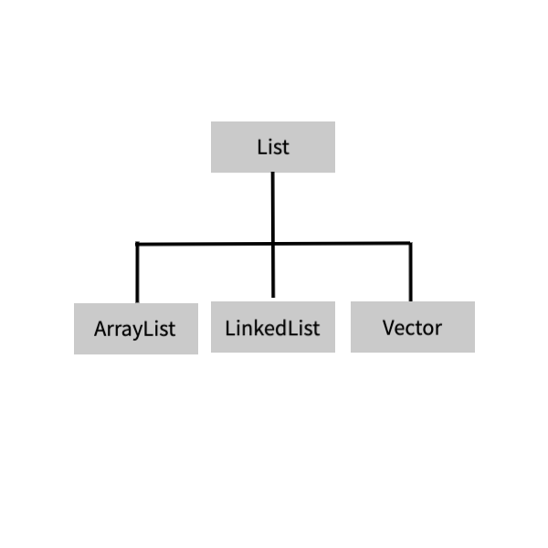
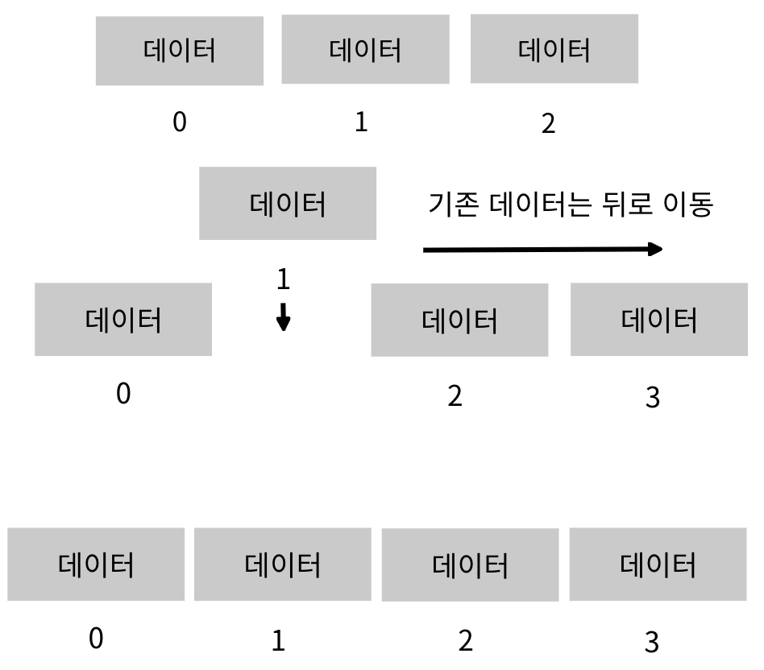
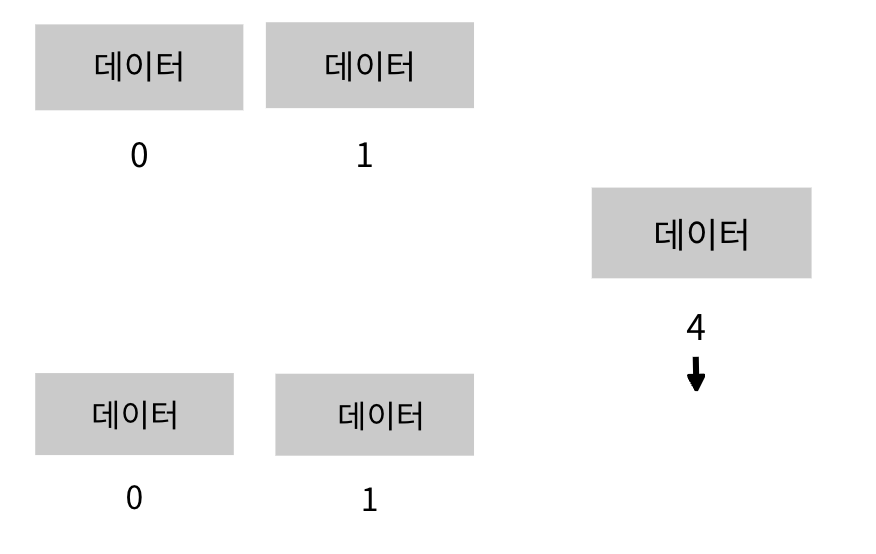
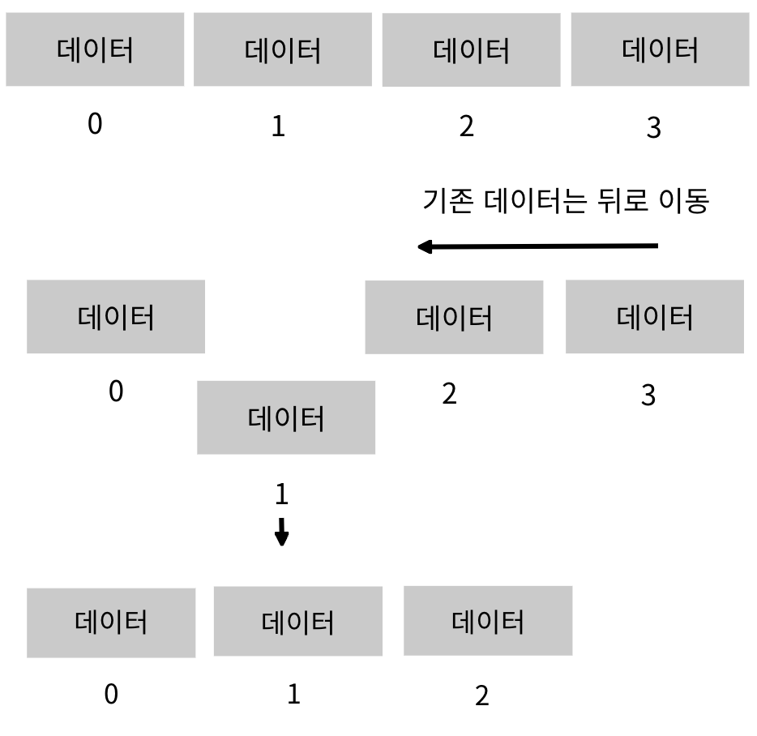
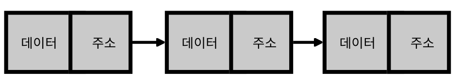

# 컬렉션 프레임워크(Collection FrameWork)
- 배열은 한번 정한 크기를 변경하거나 삭제할 수 없다.
- 또한 별도의 기능이 없기 때문에 직접 index를 이용해 데이터를 저장해야 한다.
- 자바는 이러한 불편함을 해결하기 위해 피룡한 자료구조를 미리 구현하여 java.util 패키지에서 제공하고 있다. 이를 '컬렉션 프레임워크'라고 한다.
- 컬렉션은 기존에 있던 자료구조 List(리스트), Queue(큐), Tree(트리) 등의 자료구조를 의미한다.
- 프레임워크는 클래스와 인터페이스를 묶어 놓은 개념이다.
- 즉, 컬렉션 프레임워크란 기존에 존재했던 자료 구조에 인터페이스로 설계된 기능을 클래스를 통해 제공하여 데이터 관리에 용이한 자료 구조 객체를 구조화한 것


- List와 Set인터페이스는 모두 Collection 인터페이스를 상속받는다.
- Map 인터페이스는 구조상 차이로 별도로 정의된다.

|인터페이스|설명|특징|대표 구현 클래스|
|-----|------|------|-------|
|List|순서가 있는 데이터의 집합|데이터 중복 허용 O| ArrayList,LinkedList|
|Set|순서를 유지하지 않는 데이터의 집합|데이터 중복 허용 X| HashSet,LinkedHashSet|
|Map|키(Key)와 값(Value)의 쌍으로 이루어진 데이터의 집합|순서유지 X, 키 중복 X, 값 중복 O| HashMap,LinkedHashMap,Properties|


## List컬렉션
- List는 배열과 유사한 자료 구조로 중복이 허용되면서 저장 순서가 유지되는 구조를 제공한다.
- 즉 배열처럼 index를 사용해 데이터를 저장하고 찾게 된다.
- 배열과는 다르게 크기의 제한이 없으며 삽입,삭제,변경의 기능이 자유롭다.
- 데이터의 크기를 특정할 수 없는 다량의 데이터를 저장할 때 용이하게 사용할 수 있는 자료구조이다.

<p align="center">

</p>

### List가 제공하는 주요 메서드
|메서드|동작|기능 설명|
|-----|----|----------|
|boolean add(E e)|삽입|데이터를 순차적으로 삽입|
|boolean add(int index,E e)|중간 삽입|원하는 index 위치에 삽입|
|void set(int index,E e)|치환|원하는 index 위치의 값 변경|
|E get(int index)|반환|선택된 index위치의 값 반환|
|E remove(int index)|삭제|선택된 index위치의 값 삭제|
|void clear()|전체삭제|모든 데이터 삭제|
|int size()|크기|저장된 데이터의 개수 반환|
|boolean contains(Object o)|검색|데이터 존재 여부 확인|

## ArrayList
- ArrayList는 가장 많이 사용하는 List인터페이스의 대표적인 구현 클래스이다.
- JDK 1.2부터 제공된 ArrayList는 내부적으로 배열을 이용해 구현되어 배열과의 호환성이 좋은 자료구조이다.

```
List<데이터 타입> list = new ArrayList<데이터 타입>();
```
- JDK 1.7이후부터는 Collection의 선언이 간소화되었습니다.
```
List<데이터 타입> list = new ArrayList<>();
우측의 생성자를 통한 선언시 제네릭을 생략할 수 있다.
```

### ArrayList에 데이터 저장
#### add(E e);
- 기존에 존재하는 마지막 데이터 뒤에 차례대로 삽입된다.
- 삽입시에는 index가 부여되며 배열과 마찬가지로 순차적으로 부여된다.


#### add(int index, E e)
- 원하는 위치에 데이터를 삽입할 수 있다.
- 그러나 연속성이 없어 순서를 부여해 삽입하는 것은 불가능하다.
- 만약 데이터가 3개 들어있는 List가 있다면, 해당 리스트에서 index가 1인, 즉 2번째 위치에 데이터를 삽입할 경우 아래와 같이 진행된다.



- 하지만 추가를 원하는 위치가 연속성이 없는 위치라면 문법적으로 오류가 발생하지 않지만 실행 시 오류가 발생한다.




## ex02_ArrayList패키지 만들기
### Ex01_ArrayList 클래스 정의
```java
package ex02_ArrayList;

import java.util.ArrayList;
import java.util.List;

public class Ex01_ArrayList {
	public static void main(String[] args) {
		//리스트 선언
		List<String> list = new ArrayList<>();
		
		//데이터 삽입
		list.add("딸기");
		list.add("바나나");
		list.add("망고");
		
		//리스트 출력
		System.out.println("리스트 내용1 : " + list);
		
		//3번째 위치에 삽입
		list.add(2,"수박");
		
		System.out.println("리스트 내용2 : " + list);
	}
}
```

## ArrayList 데이터 치환
- List에 저장된 데이터를 변경할 수 있다.
- 변경을 원하는 index위치와 치환할 값 또는 객체를 지정하면 해당 위치의 값이 변경된다.

```java
void set(int index, E value);
```

### Ex02_ArrayList 클래스 정의
```java
package ex02_ArrayList;

import java.util.ArrayList;
import java.util.List;

public class Ex02_ArrayList {
	public static void main(String[] args) {
		//리스트 선언
		List<String> list = new ArrayList<>();
		
		//데이터삽입
		list.add("딸기");
		list.add("바나나");
		list.add("망고");
		
		//리스트 출력
		System.out.println("리스트 내용1 : " + list);

		// 데이터 변환
		list.set(1,"복숭아");
		list.set(0, "딸기");

		System.out.println("리스트 내용2 : " + list);
		
	}
}
```

## ArrayList데이터 삭제
- List의 데이터 삭제는 단지 데이터만 삭제되는 것이 아니라 해당 위치의 공간까지 삭제된다.
- 배열의 경우 공간이 생성되면 삭제할 수 없지만, List는 원하는 위치의 공간을 삭제할 수 있으며 빈 공백을 메우기 위해 뒤의 데이터들이 앞으로 이동한다.



- 데이터를 삭제할 때는 remove()메서드를 이용한다.
- 해당 메서드는 remove(int index)와 remove(Object o)두가지가 있는데 remove(int index)는 index를 이용해 특정 위치의 데이터를 삭제하고 remvoe(Object o)는 저장한 데이터를 삭제한다.

### Ex03_ArrayList클래스 정의
```java
package ex02_ArrayList;

import java.util.ArrayList;
import java.util.List;

public class Ex03_ArrayList {
	public static void main(String[] args) {
		List<Integer> list = new ArrayList<>();
		
		//2의 배수를 넣는다.
		for(int i = 1; i< 10; i++) {
			int temp = 2 * i;
			list.add(temp);
		}
		
		//출력
		System.out.println("리스트의 값 : " + list);
		
		//3번째 인덱스 내용 삭제
		list.remove(3);
		//숫자 타입의 데이터는 객체화 후 삭제
		list.remove(Integer.valueOf(10));
		
		//출력
		System.out.println("리스트의 값 : " + list);
			
	}
}
```

## ArrayList 데이터 얻기
- List에 담긴 값을 가져올 때는 E get(int index)메서드를 이용해 원하는 index위치에 저장되어 있는 값을 출력할 수 있다.

### Ex04_ArrayList클래스 생성하기
```java
package ex02_ArrayList;

import java.util.ArrayList;
import java.util.List;

public class Ex04_ArrayList {
	public static void main(String[] args) {
		List<Integer> list = new ArrayList<>();
		
		//List에 랜덤함수를 이용해 값을 넣는다.
		for(int i = 1; i < 10; i++) {
			int temp = (int)(Math.random() * 30)+1;
			list.add(temp);
		}
		
		System.out.println("전체 데이터 : " + list);
		
		//List에 담긴 데이터 중 짝수만 출력
		System.out.print("짝수 : ");
		for(int i = 0; i < list.size(); i++) {
			//List에서 각 index에 위치하는 값 가져오기
			int value = list.get(i);
			if(value % 2 == 0) {
				System.out.print(value+" ");
			}
		}
	}
}
```
### 향상된 for문을 통해 출력할 수도 있다.
```java
for(int value : list){
	System.out.println("값 : " + value);
}
```
## LinkedList
- 데이터와 다음 데이터의 주소를 가지는 노드(Node)객체가 연결되어 데이터를 저장하는 자료구조이다.
- ArrayList와 마찬가지로 List컬렉션의 구현 클래스이므로 사용할 수 있는 메서드가 대부분 동일하다.
- ArrayList는 배열을 이용해 데이터를 저장하는 반면, LinkedList는 Node라는 객체를 생성하여 인접 데이터를 링크해서 체인처럼 관리한다.



- LinkedList는 node라는 구조를 가진 클래스들이 체인 형식으로 이어져있다.
- 노드는 데이터와 주소를 가지는데, 주소는 다음에 오는 노드의 값을 가지고 있이서 연결 구조를 이룬다.
- 따라서 index가 실제 존재하지는 않지만, 서로 연결되어있기 때문에 순서를 알 수 있다.

### LinkedList의 선언
```java
List<Integer> list = new LinkedList<Integer>();
List<Integer> list = new LinkedList<>();
```
### Ex3_Array클래스 정의
```java
public class Ex3_Array {
	public static void main(String[] args) {	
ArrayList<String> arrName = new ArrayList<String>(); 
ArrayList<Integer> arrAge = new ArrayList<Integer>();

이름이 추가되면 나이도 추가를 해야되고 번거롭다.
저장해야될 정보가 많을수록 ArrayList를 많이 만들어야 한다.
ArrayList에서는 제너릭타입이 지정이 되어있기 때문에 String 타입의 이름과 Integer 타입의 나이를 하나의 ArrayList에 저장하는건 불가능 하다.
제너릭타입을 잘 이용할 수 있다면 자료형의 타입이 다 달라도 하나의 ArrayList에 저장할 수 있게 해주는 기술을 알고있어야 합니다.
arrName.add("홍길동");
arrAge.add(20);	arrName.add("이순신");
arrAge.add(20);	arrName.add("강감찬");
arrAge.add(20);
arrName.add("을지문덕");
arrAge.add(20);
arrName.add("연개소문");
arrAge.add(20);
	System.out.println(list);
	System.out.println("---------------------");
}
}
```
### ex2_ArrayList패키지 생성

### ArrayFriend클래스 정의
```java
public class Ex4_ArrayFriend {
     String name;
     int age;
     char bt;	
}
```

### Ex4_Array클래스 정의
```java
public class Ex4_Array {
	public static void main(String[] args) {	
ArrayList<Ex4_ArrayFriend> list = new ArrayList<Ex4_ArrayFriend>();
제너릭타입에 클래스를 통째로 넣는게 목적이다.

Ex4_ArrayFriend f1 = new Ex4_ArrayFriend();
f1.name = "홍";
f1.age = 20;
f1.bt = 'A';

Ex4_ArrayFriend f2 = new Ex4_ArrayFriend();
f1.name = "김";
f1.age = 25;
f1.bt = 'B';

list.add(f1); //list의 0번방과 f1영역이 주소를 공유한다.
list.add(f2);

System.out.println(list.get(0).name);
System.out.println(list.get(0).age);
System.out.println(list.get(0).bt);

for(int I = 0; I < list.size(); I++) {
    System.out.println(list.get(i).name);
    System.out.println(list.get(i).age);
    System.out.println(list.get(i).bt);
}
	System.out.println("---------------------");
    }
```

### 리스트의 정렬기능.(sort)

#### User클래스 생성 및 내용 추가.
```java
public class User {

	private String name;//이름
	private int no;//일련번호
	
	public String getName() {
		return name;
	}
	public void setName(String name) {
		this.name = name;
	}
	public int getNo() {
		return no;
	}
	public void setNo(int no) {
		this.no = no;
	}
}
```
#### CompareTest클래스 생성 및 내용 추가.
```java
public class CompareTest {

	public static void main(String[] args) {
		//제네릭 타입을 User형으로 갖는 ArrayList생성.
		ArrayList<User> users = new ArrayList<User>();

		User user = new User();
		user.setName("고철수");
		user.setNo(1);
		users.add(user);

		user = new User();
		user.setName("박영희");
		user.setNo(2);
		users.add(user);

		user = new User();
		user.setName("감수왕");
		user.setNo(3);
		users.add(user);

		user = new User();
		user.setName("이사람");
		user.setNo(4);
		users.add(user);

		System.out.println("===== 정렬 하기전 =====");
		for (User temp : users) {
			System.out.print(temp.getNo() + " : ");
			System.out.println(temp.getName());
		}

	//Comparator<T>를 구현하는 클래스를 한 개씩 생성하며 확인
		System.out.printf("\n\n====문자 오름 차순 정렬 ====\n");
		Collections.sort(users, new NameAscCompare());
		for (User temp : users) {
			System.out.print(temp.getNo() + " : ");
			System.out.println(temp.getName());
		}

		System.out.printf("\n\n==== 문자 내림 차순 정렬 ====\n");
		Collections.sort(users, new NameDescCompare());
		for (User temp : users) {
			System.out.print(temp.getNo() + " : ");
			System.out.println(temp.getName());
		}

		Collections.sort(users, new NoAscCompare());
		System.out.printf("\n\n==== 숫자 오름 차순 정렬 ====\n");
		for (User temp : users) {
			System.out.print(temp.getNo() + " : ");
			System.out.println(temp.getName());
		}

		Collections.sort(users, new NoDescCompare());
		System.out.printf("\n\n==== 숫자 내림 차순 정렬 ====\n");
		for (User temp : users) {
			System.out.print(temp.getNo() + " : ");
			System.out.println(temp.getName());
		}
	}//main

	static class NameAscCompare implements Comparator<User> {

		//문자 오름차순(ASC)
		@Override
		public int compare(User o1, User o2) {
		//o1은 홀수번째, o2는 짝수번째 위치의 객체를 나타내는데, 
		//이건 굳이 신경 쓸 필요는 없고 공식대로 코딩해주면 된다.
			return o1.getName().compareTo(o2.getName());
		}
	}

	static class NameDescCompare implements Comparator<User> {

		//문자 내림차순(DESC)
		@Override
		public int compare(User o1, User o2) {
			return o2.getName().compareTo(o1.getName());
		}
	}

	static class NoAscCompare implements Comparator<User> {

		//숫자 오름차순(ASC)
		@Override
		public int compare(User o1, User o2) {	
			return o1.getNo() < o2.getNo() ? 
				-1 : o1.getNo() > o2.getNo() ? 1:0;
		}
	}

	static class NoDescCompare implements Comparator<User> {

		//숫자 내림차순(DESC)
		@Override
		public int compare(User o1, User o2) {
			return o1.getNo() > o2.getNo() ? 
				-1 : o1.getNo() < o2.getNo() ? 1:0;
		}

	}
}//class end
```

## Set
- Set컬렉션은 List컬렉션과는 다르게 객체의 저장 순서를 저장하지 않는다.
- Set컬렉션은 수학의 집합과 유사한 개념을 지니고 있다.
- List컬렉션은 데이터 저장 시 중복을 서용하지만 Set컬렉션은 데이터의 중복을 허용하지 않는다.
- 데이터를 저장할 때 순서, 즉index를 부여하지 않기 때문에 데이터가 입력된 순서대로 출력된다는 보장이 없다.

### Set인터페이스에서 제공하는 메서드
|메서드|기능 설명|
|-----|----------|
|void add(E e)|데이터를 순차적으로 삽입|
|void remove(Object o)|선택된 값 삭제|
|void clear()|모든 데이터 삭제|
|int size()|저장된 데이터의 개수 반환|
|boolean contains(Object o)|데이터 존재 여부 확인|

## HashSet
- HashSet클래스는 Set인터페이스에서 가장 많이 사용되는 클래스로 인터페이스를 상속받아 구현된다.

### Ex1_Set 클래스 정의
```java
public class Ex1_Set {
	public static void main(String[] args){
		
HashSet<String> hs1 = new HashSet<String>();
```
- HashSet 데이터 저장
    - HashSet은 데이터를 저장할 때 순서를 부여하지 않고 데이터의 중복을 허용하지 않는다.
    - 동일한 값, 또는 객체를 허용하지 않는다는 의미이다.
    - 동일한 객체란, 꼭 같은 타입의 객체를 의미하는 것은 아니다.
    - HashSet은 데이터를 객체의 hashCode()값을 호출하여 비교하고
    - 같으면 equals()메서드를 호출하여 다시 비교해 두 객체가 같음을 증명한다.
```java
//set에 데이터를 추가하는법
hs1.add("a");
hs1.add("b");
hs1.add("f");
hs1.add("d");
System.out.println(hs1);	
}

//set에는 중복된 데이터를 추가할 수 없다.
hs1.add("a");
hs1.add("b");

//set에 저장되어 있는 a라는 데이터 제거
hs1.remove("a");

//hs1.removeAll(hs1); --> hs1의 모든 index를 제거
System.out.println("----------------------------------");

//중복이 없기 때문에 난수를 생성해서 넣기가 편하다.
HashSet< Integer > hs2 = new HashSet<Integer>();

while(true) {
      int r = new Random().nextInt(45) + 1;
      hs2.add(r);

     배열이 아니기 때문에 모든 컬렉션 개체는 size()라고 하는 메서드로 방의 개수를 파악
     if( hs2.size() == 6 ) { //size() : set객체의 방 개수
               break;
     }//while 단점 배열처럼 인덱스 번호가 없다. 하나를 골라서 지울수 없다.

     System.out.println(hs2);
    
//Set -> 배열 형태로 변환
   //new Integer[0] <-- 배열의 방 개수를 0으로 잡으면 set이 add해둔 방 개수만큼
   //자동으로 배열의 index가 생성된다.
     Integer[] arr = hs2.toArray( new Integer[0]);
     for(int I = 0; i< arr.length; I++) {
        System.out.println(arr[i] + " ");
    }
}
```
## 반복자(Iterator)
- Iterator<E>는 List컬렉션에서 제공하는 인터페이스로 사전적인 의미로는 '반복하다'라는 뜻을 지니고 있다.
- List 컬렉션의 요소를 순회하여 하나씩 추출하는데 사용한다.
- 반복자라고도 불리는 Iterator객체는 선언된 컬렉션 객체에서 가져와 사용된다.

### Iterator메서드
|메서드|기능 설명|
|-----|------|
|boolean hasNext()|다음에 순회할 데이터 유뮤 확인<br>가져올 객체가 있으면 true,없으면 false를 반환|
|E next()|다음 위치의 데이터로 이동하여 반환|

### Ex1_Iterator
```java
package test;

import java.util.Arrays;
import java.util.Iterator;
import java.util.List;

public class Ex1_Iterator {
	public static void main(String[] args) {
		List<Integer> list = Arrays.asList(1,2,3,4,5,6,7,8,9,10);
		
		Iterator<Integer> iter = list.iterator();
		int count = 0;
		
		while(iter.hasNext()) {
			int val = iter.next();
			System.out.printf("list 데이터 [%d] : %d\n",count++,val);
		}
	}
}
```
### Ex2_Iterator
```java
package test;

import java.util.HashSet;
import java.util.Iterator;
import java.util.Set;

public class Ex2_Iterator {
	public static void main(String[] args) {
		Set<Integer> set = new HashSet<Integer>();
		
		for(int i = 0 ; i <=10; i++) {
			set.add(i);
		}
		
		Iterator<Integer> iter = set.iterator();
		int count = 0;
		
		while(iter.hasNext()) {
			int val = iter.next();
			System.out.printf("set 데이터 [%d] : %d\n",count++,val);
		}
	}
}
```

## TreeSet
- TreeSet은 이진탐색트리 중에서도 성능을 향상시킨 레드-블랙 트리(Red-Black Tree)로 구현되어 있습니다.
- 레드 블랙 트리는  부모노드보다 작은 값을 가지는 노드는 왼쪽 자식으로, 큰 값을 가지는 노드는 오른쪽 자식으로 배치하여
- 데이터의 추가나 삭제 시 트리가 한쪽으로 치우쳐지지 않도록 균형을 맞추어줍니다.


### Ex1_TreeSet
```java
TreeSet<Integer> set1 = new TreeSet<Integer>();//TreeSet생성
TreeSet<Integer> set2 = new TreeSet<>();//new에서 타입 파라미터 생략가능
TreeSet<Integer> set3 = new TreeSet<Integer>(set1);//set1의 모든 값을 가진 TreeSet생성
TreeSet<Integer> set4 = new TreeSet<Integer>(Arrays.asList(1,2,3));//초기값 지정

TreeSet<Integer> set = new TreeSet<Integer>();//TreeSet생성

//TreeSet에 값 추가하기
set.add(7);
set.add(4);
set.add(9);
set.add(1);
set.add(5);

```


```java
//TreeSet값 삭제
TreeSet<Integer> set = new TreeSet<Integer>();//TreeSet생성
set.remove(1);//값 1 제거
set.clear();//모든 값 제거

//TreeSet크기 구하기
TreeSet<Integer> set = new TreeSet<Integer>(Arrays.asList(1,2,3));//초기값 지정
System.out.println(set.size());//크기 : 3

//Tree에 값 출력하기
TreeSet<Integer> set = new TreeSet<Integer>(Arrays.asList(4,2,3));//초기값 지정
System.out.println(set); //전체출력 [2,3,4]
System.out.println(set.first());//최소값 출력
System.out.println(set.last());//최대값 출력
System.out.println(set.higher(3));//입력값보다 큰 데이터중 최소값 출력 없으면 null
System.out.println(set.lower(3));//입력값보다 작은 데이터중 최대값 출력 없으면 null
		
Iterator iter = set.iterator();	// Iterator 사용
while(iter.hasNext()) {//값이 있으면 true 없으면 false
    System.out.println(iter.next());
}
```
-------------------------------------------------------------

HashSet을 이용하여 5 * 5의 랜덤 빙고판 만들기
```java
package test;
class Bingo {
	public static void main(String[] args) {
		HashSet<Integer> set = new HashSet<>();
		int[][] board = new int [5][5];
		for (int i = 0; set.size() < 25; i++) {
			set.add(new Random().nextInt(50) + 1);
		}
		
		List<Integer> list = new ArrayList<Integer>(set);
		Collections.shuffle(list);
		
		Iterator<Integer> iter = list.iterator();
		
		for(int i = 0; i < board.length; i++) {
			for(int j = 0; j< board[i].length; j++) {
				board[i][j] = iter.next();
				System.out.printf("%02d ",board[i][j]);
			}
			System.out.println();
		}
	}
}
```

## Map
- Map은 List,Set과 달리 Map 인터페이스가 별도로 존대하며, 데이터를 List계열의 컬렉션과 다르게 처리한다.
- Map인터페이스는 데이터를 Key(키)와 Value(값)로 구분하여 저장하는 방식(Key-value 방식)을 사용한다.
- 색깔별 열쇠, 자물쇠 비유로 설명
- map구조는 key를 통해서 값을 검색해 내므로 많은 양의 데이터를 조회하는데 있어서 매우 뛰어난 성능을 발휘

## HashMap
- map을 구현하고 있는 자식 클래스에서 가장 많이 사용하는게 hash map이다.

### Ex1_Map클래스 정의
```java
public class MapEx1 {
	public static void main(String[] args) {

		HashMap<Integer , Character> map = new HashMap<Integer , Character>();
		  map.put(1, 'A');	
		  map.put(2, 'B');	
		  map.put(3, 'C'); 
		  // map에 저장되는 value는 중복될 수 있다.
		  map.put(4, 'A');  Value값으로 key값을 찾는건 불가능 하다.

		  //map의 key값은 중복될 수 없다.
		  map.put(1, 'F'); //기존에 같은 이름을 가진 key가 있다면 value를 갱신한다.

		  //key값을 통해 데이터(value)를 삭제하는 방법
		  map.remove(3);
		  System.out.println("map의 사이즈:"+map.size());//map은 .langth가 아닌 .size()를 사용System.out.println(map);  {1=A , 2=B}	

		  char res = map.get(1); //인덱스가 아닌 킷값으로 벨류를 찾는다.
		  System.out.println(res);		
  }
}
```

#### Ex2_Map 클래스 정의
```java
HashMap<String, Float> map = new HashMap<String, Float>();
	map.put("k1", 100.0f);
	map.put("k2", 3.14f);
	map.put("k3", 4.15f);

  알고있으면 도움이 되는 것들 boolean

if(map.containskey("k3")) { k3라는 값을 가진 key가 존재합니까??
    System.out.println("k3라는 key가 존재합니다.");
}

if(map.containsValue(3.14f)) { 3.14라는 값을 가진 Value가 존재합니까??
    System.out.println("map은 3.14값을 가지고 있습니다.");
}

//3.14를 가져와보자
float res = map.get("s2");
System.out.println("res : " + res);
```
#### Ex3_Map 클래스 정의
```java
//id : aaa
//pw : 1111
//아이디가 존재하지 않습니다

//id : lee
//pw : 3333
//비밀번호 불일치

//id : park
//pw : 3333
//로그인 성공!

HashMap<String, Integer> map = new HashMap<String, Integer>();
	map.put("kim", 11111);
  map.put("lee", 2222);
  map.put("park", 3333);

Scanner sc = new Scanner(System.in);

System.out.print("id : ");
String id = sc.next();
System.out.print("pw: ");
int pw = sc.nextInt();

if(!map.containskey(id)) {
     System.out.println("아이디가 존재하지 않습니다")
} else {
     if(map.get(id) != pw){
         System.out.println("비밀번호 불일치");
      }  else {
         System.out.println("로그인 성공!");
      }
}
```
