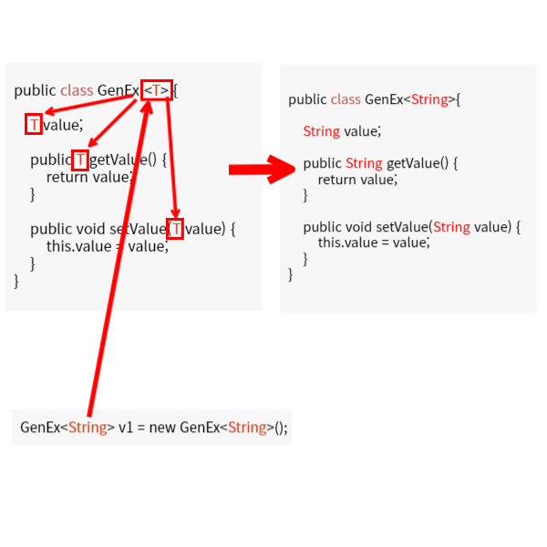

# 제네릭
- JDK 1.5 이전에는 여러 타입을 사용하는 대부분의 클래스나 메서드에서 반환값으로 Object타입을 사용했다.
- 이러한 경우 잘못된 캐스팅으로 인해 런타임 오류가 발생할 가능성이 있다.
- JDK 1.5부터 도입된 제네릭을 사용하면 컴파일할 때 타입이 미리 정해지므로 타입 검사나 변환과 같은 번거로운 작업을 생략할 수 있다.
- 클래스나 메서드 내부에 사용될 데이터 타입의 안정성을 높일 수 있다.
- 자바에서 제네릭(Generics)은 클래스 내부에서 사용할 데이터 타입을 외부에서 지정하는 기법이다.
- 객체별로 다른 타입의 자료가 저장될 수 있도록 한다.

## ex01_generic 패키지 만들기
### DataList 클래스 생성하기
```java
package ex01_generic;

public class DataList {
	private Object[] data;
	private int size;
	private int defaultSize = 10;
	
	public DataList() {
		data = new Object[defaultSize];
	}
	
	public DataList(int size) {
		data = new Object[size];
	}
	
	public void add(Object value) {
		data[size++] = value;
	}
	
	public Object get(int index) {
		return data[index];
	}
	
	public int size() {
		return size;
	}
}
```
- 위 클래스는 데이터를 저장할 수 있는 자료구조이다.
- 이 클래스 내부의 배열 타입은 Object이다.
- Object는 모든 클래스의 최상위 클래스이므로 어떠한 데이터 형태라도 저장이 가능하다.
- 하지만 데이터를 저장한 후 실제 꺼내어 사용하려면 어떤 데이터 타입을 지녔는지 일일히 확인해야 하고, 약속한 데이터가 입력되지 않아 에러가 발생할 수도 있다.

## DataListExample클래스 생성하기
```java
package ex01_generic;

public class DataListExample {
	public static void main(String[] args) {
		DataList list = new DataList();
		
		//정수입력
		list.add(10);
		
		//문자열저장
		list.add("문자열");
		
		//실수저장
		list.add(10.33);
		
		//데이터 출력
		for(int i = 0; i < list.size(); i++) {
			//데이터 가져오기
			Object data = list.get(i);
			
			//저장된 데이터 타입이 어떤타입인지 검사
			if(data instanceof Integer) {
				System.out.println("정수 : " + (int)data);
			} else if(data instanceof Double) {
				System.out.println("실수 : " + (double)data);
			} else if(data instanceof String) {
				System.out.println("문자열 : " + (String)data);
			}
		}
	}
}
```
- DataList를 이용해 데이터를 저장하고 출력을 해봤다.
- 저장 데이터 타입이 Object이므로 어떤 타입의 데이터라도 저장할 수 있지만 데이터를 사용할 때는 타입 변환을 위한 검사를 해야 하는 번거로움이 있다.
- 이때, 제네릭을 사용하면 원하는 데이터 타입을 자유롭게 저장할 수 있다.

## Generic 선언 및 생성
- 제네릭 타입은 타입을 파라미터로 가지는 클래스와 인터페이스를 말한다.
- 클래스 또는 인터페이스 이름 뒤에 <>(다이아몬드 연산자) 기호를 추가하고 안에 식별자 기호를 지정하여 파라미터화 할 수 있다.
- 이것을 마치 메서드가 매개변수를 받아 사용하는 것과 비슷하게 제네릭의 **타입 매개변수(parameter)/타입 변수**라고 부른다.
```java
public class 클래스명<T>{...}
public interface 인터페이스명<T>{...}
```

### 타입 파라미터 기호 네이밍
- 제네릭 기호를 <T>와 같이 써서 표현했지만 사실 식별자 기호는 문법적으로 정해진것은 없다.
- 다만 우리가 for문을 이용할 때 루프 변수를 i로 지정해서 사용하듯이, 제네릭의 표현변수를 T로 표현한다고 보면 된다. 만일 두번째, 세번째 제네릭이 필요하다고 하면 S,U로 이어나간다.
- 명명하고 싶은대로 아무 단어나 넣어도 문제는 없지만, 대중적으로 통하는 통상적인 네이밍이 있으면 개발이 용이해지기 때문에 암묵적인 규칙(convention)이 존재한다.

|타입|설명|
|----|----|
|\<T>|타입(Type)|
|\<E>|요소(Element)|
|\<K>|키(Key)|
|\<V>|값(Value)|
|\<N>|숫자(Number)|

### DataList 코드 수정하기
```java
package ex01_generic;

public class DataList<T> {
	private Object[] data;
	private int size;
	private int defaultSize = 10;
	
	public DataList() {
		data = new Object[defaultSize];
	}
	
	public DataList(int size) {
		data = new Object[size];
	}
	
	public void add(T value) {
		data[size++] = value;
	}
	
	public T get(int index) {
		return (T)data[index];
	}
	
	public int size() {
		return size;
	}
}

```
- 클래스에 제네릭을 부여하게 되면 해당 클래스를 선언할 때 데이터 타입을 부여하게 된다.
- 그러면 객체를 생성할 때 타입이 지정된 부분이 대체되어 해당 클래스는 지정된 객체만을 저장할 수 있게 되고, 따로 타입을 변환할 필요 없이 데이터를 출력할 수 있다.
- 또한, 다른타입의 데이터를 저장하고 싶다면 DataList의 객체를 하나 더 만들고 원하는 타입을 부여한 후 사용하면 된다.

### DataListExample 코드 수정하기
```java
package ex01_generic;

public class DataListExample {
	public static void main(String[] args) {
		// 제네릭 타입은 기본자료형을 인식하지 않음
		// 따라서 int, double등의 기본자료형을 제네릭타입으로 이용하고자 할 때는
		// Integer, Double등의 클래스를 이용해야 한다. 
		DataList<Integer> list = new DataList();
		
		//정수입력
		list.add(10);
		list.add(20);
		list.add(30);
		list.add(40);
		list.add(50);
		
		//문자열저장
		//list.add("문자열");
		
		//실수저장
		//list.add(10.33);
		
		//데이터 출력
		int sum = 0;
		for(int i = 0; i < list.size(); i++) {
			sum += list.get(i);
		}
		System.out.println(sum);
	}
}

```
## ex02_generic패키지 만들기
### GenEx 클래스 정의
```java
public class GenEx<T>{

	T value;

	public T getValue() {
		return value;
	}

	public void setValue(T value) {
		this.value = value;
	}
}
```
### Ex1_Generic클래스 생성
```java
public class Ex2_Generic {
	public static void main(String[] args) {
		GenEx<String> v1 = new GenEx<String>(); 
		
		//T자리에 실제 타입을 지정한다.
		//제네릭의 타입 전파가 행해진다고 보면 된다.
		//<T>부분에서 실행부에서 타입을 받아와 내부에서 T타입으로 지정한 멤버들에게 전파하여
		//타입이 구체적으로 설정되는 것이다. 이를 구체화(Specialization)라고 한다.

		v1.setValue("100");

		System.out.println(v1.getValue());

		//타입 매개변수의 생략
		//jdk 1.7버전 이후부터, new 생성자 부분의 제네릭 타입을 생략할 수 있게 되었다.
		GenEx<Integer> v2 = new GenEx<>();
		v2.setValue(1000);
		System.out.println(v2.getValue()+10);

		GenEx<Character> v3 = new GenEx<Character>();
		v3.setValue('A');
		System.out.println(v3.getValue());

		GenEx<Double> v4 = new GenEx<Double>();
		v4.setValue(3.14);
		System.out.println(v4.getValue());
	}
}
```



## 제네릭 사용시 주의사항
### 1. 제네릭 타입의 객체는 생성할 수 없다.
- 제네릭 타입 자체로 타입을 지정하여 객체를 생성하는 것은 불가능하다.
```java
class Sample<T> {
    public void someMethod() {
        // Type parameter 'T' cannot be instantiated directly
        T t = new T();
    }
}
```
### 2. static 멤버에 제네릭 타입이 올 수 없음
- static 변수의 데이터 타입으로 제네릭 타입 파라미터가 올 수는 없다.
- 왜냐하면 static 멤버는 클래스가 동일하게 공유하는 변수로서 제네릭 객체가 생성되기도 전에 이미 자료 타입이 정해져 있어야 하기 때문이다.

#### 2-1 static 메서드의 반환타입으로 사용이 불가능하다.
```java
class Student<T> {
    private String name;
    private int age = 0;

    // static 메서드의 반환 타입으로 사용 불가
    public static T addAge(int n) {

    }
}
```

#### 2-2 static 메서드의 매개변수의 타입으로 사용이 불가능하다.
```java
class Student<T> {
    private String name;
    private int age = 0;

    // static 메서드의 매개변수 타입으로 사용 불가능
    public static void addAge(T n) {

    }
}
```
### 3. 제네릭으로 배열 선언 주의점
- 기본적으로 제네릭 클래스 자체를 배열로 만들 수는 없다.
```java
class Sample<T> { 
}

public class Main {
    public static void main(String[] args) {
        Sample<Integer>[] arr1 = new Sample<>[10];
    }
}
```
- 또한 제네릭 타입 파라미터에 클래스가 타입으로 온다는 것은, 클래스끼리 상속을 통해 관계를 맺는 객체 지향 프로그래밍의 다형성의 원리가 그대로 적용이 된다는 뜻이다.

### Ex2_Generic클래스 만들기
```java
class Fruit { }
class Apple extends Fruit { }
class Banana extends Fruit { }

class FruitBox<T> {
    List<T> fruits = new ArrayList<>();

    public void add(T fruit) {
        fruits.add(fruit);
    }
}

public class Ex2_Generic {
    public static void main(String[] args) {
        FruitBox<Fruit> box = new FruitBox<>();
        
        // 제네릭 타입은 다형성 원리가 그대로 적용된다.
        box.add(new Fruit());
        box.add(new Apple());
        box.add(new Banana());
    }
}
```

## 멀티타입 파라미터
- 제네릭은 반드시 하나만 사용해야하는 법은 없다. 만일 타입 지정이 여러개 필요한 경우 2개,3개 얼마든지 만들 수 있다.

### Ex3_Generic
```java
import java.util.ArrayList;
import java.util.List;

class Apple {}
class Banana {}

class FruitBox<T, U> {
    List<T> apples = new ArrayList<>();
    List<U> bananas = new ArrayList<>();

    public void add(T apple, U banana) {
        apples.add(apple);
        bananas.add(banana);
    }
}

public class Main {
    public static void main(String[] args) {
    	// 복수 제네릭 타입
        FruitBox<Apple, Banana> box = new FruitBox<>();
        box.add(new Apple(), new Banana());
        box.add(new Apple(), new Banana());
    }
}
```

## 중첩타입 파라미터
- 제네릭 객체를 제네릭 타입 파라미터로 받는 형식도 표현할 수 있다.
- ArrayList 자체도 하나의 타입으로서 제네릭 타입 파라미터가 될 수 있기 때문에 중첩 형식으로 사용할 수 있다.

### Ex4_Generic클래스 생성
```java
public static void main(String[] args) {
    // LinkedList<String>을 원소로서 저장하는 ArrayList
    ArrayList<LinkedList<String>> list = new ArrayList<LinkedList<String>>();

    LinkedList<String> node1 = new LinkedList<>();
    node1.add("aa");
    node1.add("bb");

    LinkedList<String> node2 = new LinkedList<>();
    node2.add("11");
    node2.add("22");

    list.add(node1);
    list.add(node2);
    System.out.println(list);
}
```

## 제네릭 인터페이스
- 인터페이스에도 제네릭을 적용할 수 있다.
- 단, 인터페이스를 구현(implements)한 클래스에서도 오버라이딩한 메서드를 제네릭타입에 맞춰서 똑같이 구현해야 한다.

### Ex5_Generic클래스 생성
```java
interface ISample<T> {
    public void addElement(T t, int index);
    public T getElement(int index);
}

class Sample<T> implements ISample<T> {
    private T[] array;

    public Sample() {
        array = (T[]) new Object[10];
    }

    @Override
    public void addElement(T element, int index) {
        array[index] = element;
    }

    @Override
    public T getElement(int index) {
        return array[index];
    }
}

public class Ex5_Generic{
	public static void main(String[] args) {
    	Sample<String> sample = new Sample<>();
    	sample.addElement("This is string", 5);
    	sample.getElement(5);
	}
}
```

## 제네릭 함수형 인터페이스
- 제네릭 인터페이스가 많이 사용되는 곳이 람다 함수형 인터페이스이다.
- 람다식은 아직 배우지 않았지만 다음에 배울 예정이니 모양만 눈에 익혀두자.

### Ex6_Generic
```java
// 제네릭으로 타입을 받아, 해당 타입의 두 값을 더하는 인터페이스
interface IAdd<T> {
    public T add(T x, T y);
}

public class Ex6_Generic {
    public static void main(String[] args) {
        // 제네릭을 통해 람다 함수의 타입을 결정
        IAdd<Integer> o = (x, y) -> x + y; // 매개변수 x와 y 그리고 반환형 타입이 int형으로 설정된다.
        
        int result = o.add(10, 20);
        System.out.println(result); // 30
    }
}
```

## 제네릭 메서드

### Ex7_Generic 클래스 생성
```java
class FruitBox<T> {

	//1. 아래와 같이 제네릭 클래스에서 제네릭 타입 파라미터를 사용하는 메서드를
	//제네릭 메서드라고 착각하기 쉬운데, 이것은 그냥 타입 파라미터로 타입을 지정한
	//메서드일 뿐이다.
    public T addBox(T x, T y) {
        // ...
    }

	//2. 제네릭 메서드란, 메서드의 선언부에 <T>가 선언된 메서드를 말한다.
	//직접 메서드에 <T>을 설정함으로서 동적으로 타입을 받아와 사용할 수 있는
	//독립적으로 운용 가능한 제네릭 메서드라고 이해하면 된다.
    public static <T> T addBoxStatic(T x, T y) {
        // ...
    }

}

public class Ex7_Generic{
	public static void main(String[] args){
		FruitBox.<Integer>addBoxStatic(1,2);
	}
}
```
### 제네릭 실습
- Gen클래스를 만들어 제네릭 타입T를 갖는 printArr메서드를 생성한다.
- printArr메서드 내부에서 배열을 순차적으로 보여줄수 있게 하는 코드를 작성.
- Main클래스를 만들어 Integer[], Double[], Character[]을 각각 만든 뒤
- Gen클래스의 printArr메서드를 각각 호출하여 배열의 내용을 출력하도록 해보자.

```
결과 :
 1 2 3 4 5  //정수배열 출력
 1.1 2.2 3.3 4.4 5.5 //실수배열 출력
 A B C D E //문자배열 출력
```
### Gen클래스 정의
- 아래의 초록색 <T>는 둘 중에 한 개만 넣어주면 되지만
- 메서드에서 제네릭 타입을 사용할 경우 메서드쪽에 넣어주는 것이 더 좋다.
```java
public class Gen <T> {
	public <T> void printArr(T[] arr){

		for(int i = 0; i < arr.length; i++){
			System.out.print(" " + arr[i]);
		}
		System.out.println();
	}
}
```  
### GenEx클래스 정의
```java
public class GenEx{
	public static void main(String[] args) {
		Gen gen = new Gen();
		
		// 정수형
		Integer[] iArr = {1, 2, 3, 4, 5};

		// 더블형
		Double[] dArr = {1.1, 2.2, 3.3, 4.4, 5.5};

		// Character
		Character[] cArr = {'A', 'B', 'C', 'D', 'E'};

		//제네릭 이용
		//위의 배열들을 int, double, char와 같은 기본자료형으로 만들었다면
		//아래의 메서드에 대입할수 없다.
		//제네릭 타입은 반드시 객체를 처리하록 되어있다.
		gen.printArr(iArr);
		gen.printArr(dArr);
		gen.printArr(cArr);
	}
}
```

## 제네릭 타입 범위 한정하기
- 제네릭에 타입을 지정해줌으로서 클래스의 타입을 컴파일 타임에 정하여 타입 예외에 대한 안정성을 확보하는 것은 좋지만 문제는 너무 자유롭다는 점이다.

### Ex8_Generic
```java
// 숫자만 받아 계산하는 계산기 클래스 모듈
class Calculator<T> {
    void add(T a, T b) {}
    void min(T a, T b) {}
    void mul(T a, T b) {}
    void div(T a, T b) {}
}

public class Main {
    public static void main(String[] args) {
        // 제네릭에 아무 타입이나 모두 할당이 가능
        Calculator<Number> cal1 = new Calculator<>();
        Calculator<Object> cal2 = new Calculator<>();
        Calculator<String> cal3 = new Calculator<>();
        Calculator<Main> cal4 = new Calculator<>();
    }
}
```

## 타입 한정 키워드 extends
### 사용법
```java
<T extends [제한타입]>
```

### Ex8_Generic 수정하기
```java
// 숫자만 받아 계산하는 계산기 클래스 모듈
class Calculator<T extends Number> {
    void add(T a, T b) {}
    void min(T a, T b) {}
    void mul(T a, T b) {}
    void div(T a, T b) {}
}

public class Main {
    public static void main(String[] args) {
        // 제네릭에 아무 타입이나 모두 할당이 가능
        Calculator<Number> cal1 = new Calculator<>();
        Calculator<Object> cal2 = new Calculator<>();
        Calculator<String> cal3 = new Calculator<>();
        Calculator<Main> cal4 = new Calculator<>();
    }
}
```

## 인터페이스 타입 한정
- extends 키워드 다음에 올 타입은 일반 클래스, 추상 클래스, 인터페이스 모두 올 수 있다.

### Ex9_Generic 클래스 생성
```java
interface Readable {
}

// 인터페이스를 구현하는 클래스
public class Student implements Readable {
}
 
// 인터페이스를 Readable를 구현한 클래스만 제네릭 가능
public class School <T extends Readable> {
}

public class Ex9_Generic{
	public static void main(String[] args) {
		// 타입 파라미터에 인터페이스를 구현한 클래스만이 올수 있게 됨	
		School<Student> a = new School<Student>();
	}
}
```

## 다중 타입 한정
- 만일 2개 이상의 타입을 동시에 상속(구현)한 경우로 타입 제한을 하고 싶다면 &연산자를 사용하면 된다.
- 해당 인터페이스들을 동시에 구현한 클래스가 제네릭 타입의 대상이 되게 한다.
- 단, 자바에서는 다중 상속을 지원하지 않기 때문에 클래스로는 다중 extends는 불가능하고 오로지 인터페이스로만이 가능하다.

### Ex10_Generic 클래스 생성
```java
interface Readable {}
interface Closeable {}

class BoxType implements Readable, Closeable {}

class Box<T extends Readable & Closeable> {
    List<T> list = new ArrayList<>();

    public void add(T item) {
        list.add(item);
    }
}

public class Ex10_Generic{
	public static void main(String[] args) {
    // Readable 와 Closeable 를 동시에 구현한 클래스만이 타입 할당이 가능하다
    Box<BoxType> box = new Box<>();

    // 심지어 최상위 Object 클래스여도 할당 불가능하다
    Box<Object> box2 = new Box<>(); // ! Error
	}
}
```

## 재귀적 타입 한정
- 자기 자신이 들어간 표현식을 사용하여 타입 매개변수의 허용 범위를 한정시기키는것을 말한다.
- 실무에선 주로 Comparable 인터페이스와 함께 쓰인다.
```java
<E extends Comparable<E>>
E의 타입 범위를 Comparable<E>로 한정한다는 E를 중첩시킨 표현식
```

### Ex11_Generic 클래스 생성
```java
class Ex11_Generic {
	// 외부로 들어온 타입 E는 Comparable<E>를 구현한 E 객체 이어야 한다.
    public static <E extends Comparable<E>> E max(Collection<E> collection) {
        if(collection.isEmpty()) throw new IllegalArgumentException("컬렉션이 비어 있습니다.");

        E result = null;
        for(E e: collection) {
            if(result == null) {
                result = e;
                continue;
            }

            if(e.compareTo(result) > 0) {
                result = e;
            }
        }

        return result;
    }

	public static void main(String[] args) {
    Collection<Integer> list = Arrays.asList(56, 34, 12, 31, 65, 77, 91, 88);
    System.out.println(Compare.max(list)); // 91
    
    Collection<Number> list2 = Arrays.asList(56, 34, 12, 31, 65, 77, 91, 88);
    System.out.println(Compare.max(list2)); // ! Error - Number 추상 메서드는 Comparable를 구현하지않았기 때문에 불가능
}
}
```

## 제네릭 형변환
### 제네릭 캐스팅 문제
- 배열과 같은 일반적인 변수 타입과 달리 제네릭 서브 타입간에는 형변환이 불가능하다.
- 심지어 대입된 타입이 Object일지라도 말이다.
- 자연스럽게 다형성이 적용될 것이라고 생각할 수 있지만 실상 제네릭은 전달받은 타입으로만 캐스팅이 가능하다.

### 제네릭 타입은 상하관계가 없다.
- 제네릭의 타입 변수(꺾쇠 괄호)끼리는 아무라 상속 관계에 놓인다 한들 캐스팅이 불가능하다.
- 제네릭은 전달받은 타입만으로만 서로 캐스팅이 가능하다.


### Ex12_Generic클래스 생성
```java
package test2;

import java.util.ArrayList;
import java.util.Arrays;
import java.util.List;

public class Ex12_Generic {
	public static void main(String[] args) {
	    List<Integer> lists = new ArrayList<>(Arrays.asList(1, 2, 3));
	    print(lists); // ! 컴파일 에러 발생
	}

	public static void print(List<Object> list) {
	    for (Object e : list) {
	        System.out.println(e);
	    }
	}
}

```
## 제네릭 와일드 카드
- 제네릭 간의 형변환을 성립되게 하기 위해서는 제네릭에서 제공하는 와일드카드 문법을 이용해야 한다.

### 와일드카드 사용법
- \<?> : Unbounded Wildcards(제한 없음)
  - 타입 파라미터를 대치하는 구체적인 타입으로 모든 클래스나 인터페이스 타입이 올 수 있다.
- \<? extends 상위타입> : Upper Bounded Wildcards(상위 클래스 제한)
  - 타입 파라미터를 대치하는 구체적인 타입으로 상위 타입이나 상위 타입의 하위 타입만 올 수 있다.
- \<? super 하위타입> : Lower Bounded Wildcards(하위 클래스 제한)
  - 타입 파라미터를 대치하는 구체적인 타입으로 하위 타입이나 하위 타입의 상위 타입만 올 수 있다.

### Ex13_Generic클래스 생성
```java
package test2;

import java.util.ArrayList;
import java.util.Arrays;
import java.util.List;

public class Test {
	public static void main(String[] args) {
		List<? extends Object> list = new ArrayList<String>();

		List<? super String> list2 = new ArrayList<Object>();
		
		
	    List<Integer> lists = new ArrayList<>(Arrays.asList(1, 2, 3));
	    print(lists); // OK
	}

	// Number와 그 하위 타입(Integer, Double 등) 만을 받는다
	public static void print(List<? extends Number> list) {
	    for (Object e : list) {
	        System.out.println(e);
	    }
	}
}
```