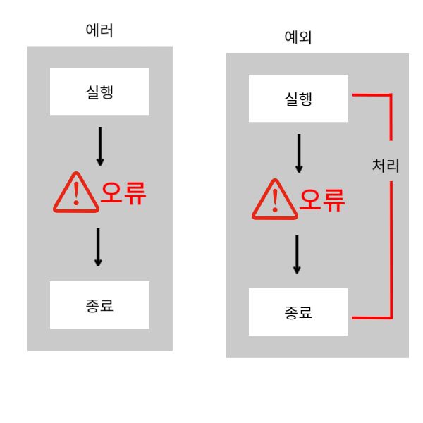

# 예외 처리
## 에러(error)와 예외(exception)
- 자바 프로그램을 실행하다 보면 갑자기 프로그램이 종료되거나, 어떤 원인에 의해 잘못 동작하여 오류 메세지가 나타나는 등 예기치 못한 오류가 발생한다.
- 전자는 우리가 해결할 수 없는 시스템에 에러가 발생해 프로그램이 종료된 경우이며 후자는 프로그램 사용 중 발생한 오류를 개발자가 처리해 메세지가 출력된 경우이다.



## 에러(error)
- 에러는 시스템에 비정상적인 상황이 생겼을 때 발생한다.
- 외부 요인일 수도 있고, 프로그램 구동 중에 발생하는 치명적인 오류일 수도 있다.
- 이러한 에러들은 개발자가 예측하거나 처리할 수 없는 영역이다.

|에러의 종류| 상황 |
|-----------|-------|
|OutOfMemoryError|프로그램 실행 중 메모리 부족|
|IOError|입출력 에러|
|StackOverFlowError|가용 메모리 부족 현상, 재귀 호출 문제시 발생|

## 예외(exception)
- 예외란 대체로 프로그램 구동 중에 나타나는 오류들을 말한다.
- 문법적으로는 문제가 없어보이지만 실제 운영 중에 생기는 문제들이다.
- 예외는 체크 예외(checked exception)와 비체크 예외(uncheked exception)두 가지가 있다.

### 체크 예외
- 자바 소스를 컴파일 하는 과정에서 검사한다.
- 보통 문법적으로 강제하여 예외 처리를 해야 하는 경우
### 비체크 예외
- 컴파일 과정에서 검사하지 않으므로 사용자의 경험이나 테스트로 찾아야 하는 경우

|구분|체크 예외|비체크 예외|
|---|----------|------------|
|처리 여부|문법적으로 예외 처리를 강제함<br>반드시 처리 해야 함|문법적으로 강제하지 않음<br>개발자의 판단에 의해 처리|
|확인 시점| 컴파일 단계| 실행 단계|
|예외 클래스|Runtime Exception을 제외한 모든 예외<br>IOException<br>SQLException등|Runtime Exception의 자식 클래스 모두 포함<br>NullPointerException<br>IndexOutOfBoundsException<br>ClassNotFoundException|


## 예외 클래스
- 자바는 객체 지향언어이다.
- 따라서 프로그램에서 발생하는 예외들은 클래스 형태로 제공된다.


## NullPointerException
- NullPointerException은 자바 프로그램에서 가장 빈번하게 발생하는 실행 예외이다.
- 객체가 제대로 생성되지 않은 상태에서 사용할 경우 발생한다.
- 우리가 객체를 선언하면 객체는 주소를 가지게 되고, 그것을 통해 객체에 접근해 값을 가져온다.
- 객체는 정의되었는데 실제 메모리에 생성되지 않았을 경우 예외가 발생한다.
```java
package test;

public class Test {
	public static void main(String[] args) {
		
		//배열을 변수를 만들기만 하고 선언하지 않
		String[] strArray = null;
		
		//생성되지 않은 배열을 출력하려고 
		System.out.println("strArray[0] = " + strArray[0]);
		
	}
}
```

## NumberForamtException
- NumberFormatException은 잘못된 문자열을 숫자로 형 변환할 때 발생한다.
- 숫자 형태("111")의 문자열은 정수 타입으로 변환할 수 있으나 문자가 포함되거나 실수 형태 ("11.11")의 문자열은 변환할 수 없다.
```java
package test;

public class Test {
	public static void main(String[] args) {
		
		String str01 = "11";
		String str02 = "11.2";
		
		//정수 형태의 문자열을 정수로 변
		int num01 = Integer.parseInt(str01);
		
		System.out.println("String to int : " + num01);
		
		//실수 형태의 문자열을 정수로 변환
		int num02 = Integer.parseInt(str02);
		
		System.out.println("String to int : " + num02);
	}
}
```

## ArrayIndexOutOfBoundsException
- ArrayIndexOutOfBoundsException은 배열에서 인덱스(index) 범위를 초과해 사용할 때 발생한다.
```java
package test;

public class Test {
	public static void main(String[] args) {
		
		int [] arr = {1,6,7,8,10};
		
		System.out.println(arr[6]);
		
	}
}
```

## ArithmeticException
- ArithmeticException은 정수를 0으로 나누려고 할 때 발생한다
```java
package test;

public class Test {
	public static void main(String[] args) {
		
		int result = 10/0;
		
		System.out.println(result);
		
	}
}
```

## 예외 처리 문법
- 예외가 발생했을 때, 어떻게 예외 처리를 하는지 방법에 대해서 알아보자

### 예외처리 과정
1. 코드 진행 중 예외가 발생하면 JVM에게 알린다
2. JVM은 발생한 예외를 분석하여 알맞은 예외 클래스를 생성한다
3. 생성된 예외 객체를 발생한 지점으로 보낸다
4. 예외가 발생한 지점에서 처리하지 않으면 프로그램은 비정상 종료된다.

### try - catch 구문
- 예외를 처리하는 가장 기본 문법은 try - catch문이다.
- 예외가 발생할 가능성이 있는 코드는 try{}안에 작성하고
- catch 메서드는 시스템으로부터 넘어오는 예외 클래스를 받아서 처리한다.
```java
try {
    예외가 발생할 가능성이 있는 코드
} catch (예외 클래스명 e) {
    예외처리 코드
}
```

## Ex1_try_catch
```java
package test;

public class Test {
	public static void main(String[] args) {
		
			int result = 0;
		
		try {
			result = 10/0;
			System.out.println("나누기 결과 : " + result);
			
		} catch (ArithmeticException e) {
			System.out.println("0으로 나누기 할 수 없습니다.");
		}
		System.out.println("프로그램 종료");
		
	}
}
```
## Ex2_try_catch
```java
package test;

import java.util.InputMismatchException;
import java.util.Scanner;

public class Test {
	public static void main(String[] args) {
		
		Scanner sc = new Scanner(System.in);
		try {
			System.out.print("정수를 입력하세요 : ");
			int score = sc.nextInt();
			
			if(score >= 65) {
				System.out.println("합격입니다.");
			}else {
				System.out.println("불합격입니다.");
			}
		} catch (InputMismatchException e) {
			System.out.println("키보드 입력이 잘못되었습니다.");
		}
		
		System.out.println("프로그램 종");
		
	}
}
```
## 다중 catch 사용하기
- 프로그램을 구동할 때 하나의 예외만 발생한다면 처리하기는 어렵지 않다.
- 하지만 try 구문 안에서 예외는 다양하게 발생할 수 있다.
- 만약 기존과 같은 방법으로 처리한다면 하나의 예외를 제외하고는 제대로 처리할 수 없다
- 이때, 다중 catch문을 사용하여 예외별로 예외 처리 코드를 다르게 하여 다양한 예외를 처리할 수 있다.

## Ex3_try_catch
```java
package test;

import java.util.InputMismatchException;
import java.util.Scanner;

public class Test {
	public static void main(String[] args) {
		
		Scanner sc = new Scanner(System.in);
		
		try {
			int [] cards = {4,5,1,2,7,8};
			System.out.print("몇 번째 카드를 뽑으시겠습니까? >>");
			
			int cardIndex = sc.nextInt();
			System.out.println("뽑은 카드 번호는 : " + cards[cardIndex]);
			
		} catch (InputMismatchException e) {
			System.out.println("잘못 입력하셨습니다. 숫자만 가능합니다.");
		} catch (ArrayIndexOutOfBoundsException e) {
			System.out.println("해당 번호의 카드는 없습니다.");
		}
		
		System.out.println("프로그램 종");
		
	}
}
```

## finally
- finally블록은 예외 발생 유무와 상관없이 실행되는 구문이며 생략할 수 있다.
- 예외 처리를 할 때, 예외와 상관없이 반드시 처리해야 하는 구문들을 작성할 때 사용된다.
- 보통 외부 연동이나 예외가 발생해도 정상 종료되어야 할 구문들에서 사용한다.

## Ex4_finally
```java
package test;

import java.util.InputMismatchException;
import java.util.Scanner;

public class Test {
	public static void main(String[] args) {
		
		Scanner sc = new Scanner(System.in);
		
		try {
			System.out.print("점수를 입력하세요 : ");
			int score = sc.nextInt();
			
			if(score >= 60) {
				System.out.println("합격입니다");
			}else {
				System.out.println("불합격입니다.");
			}
			
		} catch (InputMismatchException e) {
			System.out.println("키보드 입력이 올바르지 않습니다.");
		} finally {
			System.out.println("프로그램 종료");
		}	
	}
}
```

## 예외 던지기
- 메서드 내부에서 예외를 처리하지 않고 미룬 후, 해당 메서드를 호출한 쪽에서 예외를 처리하는 방법을 '예외 던지기'라고 한다
- 때로는 직접 처리하는 것보다 해당 메서드를 사용한 곳에서 처리하도록 하는 것이 효율적일 때가 있다

## throws
- 예외 던지기는 throws 키워드를 사용한다.
- 메서드 뒤에 throws 키워드를 사용하여 던지기를 할 예외 객체를 붙여주면 된다.
- 예외 객체는 여러 개를 던질 수 있으며, 여러 개를 던질 시에는 콤마(,)로 구분해서 나열해준다.

## ThrowsExceptionExample
```java
package test;

import java.util.InputMismatchException;
import java.util.Scanner;

public class Test {
	
	//성격 유형 검사를 위한 메서드
	public static void checkYourSelf(Scanner scan) throws InputMismatchException {
		System.out.println("1. 사람과 어울리는 것이 좋다. 2. 혼자 있 것이 좋다.");
		System.out.print("선택 : ");
		int check = scan.nextInt();
		
		//성격 체크 후 출력
		if(check == 1) {
			System.out.println("당신은 ENFP");
		}else {
			System.out.println("당신은 ISFP");
		}
	}
	
	public static void main(String[] args) {
		
		Scanner sc = new Scanner(System.in);
		try {
			System.out.println("==== 성격 유형 검사를 시작합니다. ====");
			
			//메서드 호출
			Test.checkYourSelf(sc);
			
		} catch (InputMismatchException e) {
			System.out.println("키보드 입력이 잘못되었습니다.");
		} finally {
			System.out.println("프로그램 종료");
		}
	}
}
```

## 강제 예외 처리 방법
- 프로그램을 작성하다 보면 코드의 오류로 발생하는 예외도 있지만, 프로그램의 규칙에 위배되어 예외를 발생해야 하는 경우도 있다
- 만약, 프로그램의 규칙에 위배되어 예외를 발생해야 할 경우, 강제로 예외를 발생시킬 수 있다.

## Ex5_try_catch
```java
package test;

import java.util.InputMismatchException;
import java.util.Scanner;

public class Test {

	public static void main(String[] args) {
		Scanner sc = new Scanner(System.in);
		int val = 0;
		
		while(true) {
			try {
				System.out.print("숫자를 입력하세요(0~50) : ");
				val = sc.nextInt();
				
				if(val == -1) {
					break;
				}
				
				if(val < 0 || val > 50) {
					throw new Exception("숫자의 허용범위가 아닙니다.");
					
				}
			} catch (Exception e) {
				sc.nextLine();
				System.out.println("에러 메세지 : " +e.getMessage());
			}
			
			System.out.println("프로그램 종");
			
		}
	}
}
```

## 사용자 정의 예외처리
- 자바가 제공하는 예외 객체 외에도 개발자의 목적에 의해서 예외 객체를 만들 수 있다.
- 자바가 제공하는 예외 객체는 다양하지만 모든 예외를 처리하기는 어렵다.
- 목적에 따라 공통기능을 지니는 예외 처리도 필요하기 때문에 개발자가 직접 예외를 생성하여 처리해야 한다.

### 체크 예외 생성하기
- 체크 예외를 만들고 싶다면 최상위 객체인 Exception을 상속한다.
```java
public class CustomException extends Exception{
	
}
```

### 비체크 예외 생성하기
- 비체크 예외를 만들고 싶을 때는 RuntimeException을 상속한다.
```java
public class CustomException extends RuntimeException{

}
```

## InputErrorException
```java
package test;

import java.util.InputMismatchException;
import java.util.Scanner;

public class Test {

	public static void main(String[] args) {
		Scanner sc = new Scanner(System.in);
			try {
				System.out.print("당신의 나이를 입력하세요 >> ");
				int age = sc.nextInt();
				
				if(age < 0) {
					throw new InputErrorException("입력이 잘못되었습니다.");
				}
				
				if(age > 19) {
					System.out.println("성인입니다.");
				}else if(age > 13) {
					System.out.println("청소년입니다.");
				}else if(age > 6) {
					System.out.println("어린이입니다.");
				}else {
					System.out.println("아동입니다");
				}
			} catch (InputErrorException e) {
				System.out.println(e.getMessage());
			};
	}
}


```

# 기본 API 클래스
- 자바에서 제공하는 API는 프로그램 개발에 자주 사용되는 클래스 및 인터페이스의 모음을 말하며 라이브러리라고도 부릅니다.

## java.lang 패키지
- java.lang 패키지는 자바 프로그램의 기본적인 클래스를 담고 있는 패키지다.
- 가령 우리가 Scanner를 사용하려 한다면 스캐너를 import해줘야 사용할 수 있다.
- 그러나 System, String등과 같은 클래스는 따로 선언 없이 사용이 가능했다.

|클래스|용도|
|----|----|
|Object|자바 클래스의 최상위 클래스로 사용|
|System|시스템의 표준 입력/출력 장치로부터 데이터를 입력받거나 출력하기 위해 사용<br>자바 가상 기계를 종료할 때 사용|
|String|문자열을 저장하고 여러 가지 정보를 얻을 때 사용|
|StringBuffer/StringBuilder| 문자열을 저장하고 내부 문자열을 조작할 때 사용|
|Math|수학 함수를 이용할 때 사용|

## Object클래스
- Object클래스는 자바의 최상위 클래스이다.
- 자바에서 생성되는 모든 클래스는 생성될 때 상속을 하지 않아도 Object를 자동으로 상속받게 되어있다.
- 따라서 클래스를 생성하면 Object가 가지고 있는 여러 메서드를 그대로 사용하거나 Override하여 사용할 수 있다.

|메서드|설명|
|----|----|
|protected Object clone()|객체 자신을 복사한 후 반환|
|boolean equals(Object obj)|다른 객체와 자신이 가진 실제 값을 비교|
|int hashCode()|객체의 hashCode 값을 반환|
|String toString()|객체 자신의 정보를 반환|

## equals()메서드
- 기본 자료형의 데이터들의 동등 비교를 위해서 '==' 비교 연산자를 사용한다.
- 하지만 객체를 동등비교 할 경우, 해당 객체의 값을 비교하는 것이 아니라, 객체가 메모리에 있는 위치를 비교하게 된다.
- 객체의 데이터를 비교할 때는 equals()메서드를 override하여 사용한다.

### Ex1_equals
```java
package test;

public class Test {

	public static void main(String[] args) {
		String str1 = "hello";
		String str2 = "hello";
		String str3 = new String("hello");
		
		//문자열 변수 비교
		System.out.println("str1 vs str2 : " + (str1 == str2));
		System.out.println("str2 vs str3 : " + (str2 == str3));
		
		//각 문자열 변수가 있는 위치의 값을 출력
		//System.identityHashCode() : 객체의 고유한 hashcode를 리턴하는 메서드
		//hashcode()는 다른 객체이지만 주소가 동일한 경우가 있을 수 있다.
		System.out.println("str1 hashCode : " + System.identityHashCode(str1));
		System.out.println("str2 hashCode : " + System.identityHashCode(str2));
		System.out.println("str3 hashCode : " + System.identityHashCode(str3));
	}
}

```

### Ex2_equals
```java
package test;

public class Test {

	public static void main(String[] args) {
		String str1 = "hello";
		String str2 = "hello";
		String str3 = new String("hello");
		
		//문자열 변수 비교
		System.out.println("str1 vs str2 : " + (str1.equals(str3)));
		System.out.println("str2 vs str3 : " + (str2.equals(str3)));
	}
}

```

## toString()메서드
- toString()메서드는 객체의 문자 정보를 반환해주는 메서드이다.
- print()문을 사용해 객체를 줄력할 경우, 해당 메서드가 자동으로 실행되어 객체의 정보를 반환해주고 출력이 된다.
- 따라서 해당 메서드를 재정의해서 사용하면 원하는 객체의 정보를 쉽게 출력할 수 있다.

```java
Object obj = new Object();
System.out.println(obj);
```
- Object객체를 만든 후에 출력문에 그대로 삽입하면 toString()메서드가 자동으로 실행된다.

### Car클래스
```java
package test;

public class Car {
	private String carName;
	private String company;

	public Car(String carName, String company) {
		this.carName = carName;
		this.company = company;
	}

	@Override
	public String toString() {
		String str = "차량 이름 : " + this.carName + ", 제조사 : " + this.company;
		return str;
	}

}
```

### CarMain
```java
package test;

public class CarMain {
	public static void main(String[] args) {
		Car car = new Car("소나타", "현대");
		System.out.println(car);
	}
}
```

## String클래스
- String클래스는 문자열을 처리하는 객체형 데이터 타입이다.
- 일반적으로 기본 데이터 타입들과 마찬가지로 문자열 데이터를 담는 간단한 형식으로 사용하지만
- 문자열츨 차리하기 위한 다양한 기능들을 가지고 있다.
- String객체는 한 번 생성되면 그 값을 읽기만 하고 변경할 수 없다.

|메서드|설명|
|----|----|
|int length()|문자열의 길이를 반환|
|char charAt(int index)|문자열을 하나의 단어 단위로 출력<br>파라미터로는 추출할 문자의 위치를 받는다.|
|int indexOf(String ch)<br>int indexOf(int ch)|문자열에 포함된 단어 또는 문자열의 위치를 앞에서부터 검색했을 때 일치하는 위치의 인덱스 값을 반환(없을 경우 -1을 반환)|
|String replace(변경할 문자, 변경 문자)|단어 또는 문장에 있는 특정 단어를 변경|
|String substring(int beginIndex)|문자열을 원하는 위치에서 자를 때 사용<br>입력된 시작 위치부터 문자열의 마지막까지 반환|
|String substring(int beginIndex,int endIndex)|문자열을 입력된 시작 위치부터 마지막 위치 전까지의 값을 리턴|

### Ex1_String
```java
indexOf, lastIndexOf, charAt, substring, split정도만 설명. api보면서 하면 더 좋겠지만
융통성있게 하자


String str = "Kim Mal Ddong";
System.out.println("문자열 str의 길이 : " + str.length());
		
int index = str.indexOf('k');
System.out.println("맨 처음 문자 k의 위치 : " + index);//대소문자 구별 함
	
index = str.indexOf("Mal");
System.out.println("문자열 Mal의 위치 : " + index);//띄어쓰기 포함
	
index = str.lastIndexOf('n');
System.out.println("마지막 문자 n의 위치 : " + index);
		
char c = str.charAt(4);
System.out.println("추출한 문자 : " + c);
		
String str2 = str.substring(0, str.indexOf('M'));
System.out.println("0번째부터 M앞자리까지 글자 잘라내기 : " + str2);
System.out.println("잘라낸 str2의 길이 : " + str2.length());//길이는 띄어쓰기 포함 1부터 증가

스트링은 아니지만 스트링으로 작성된 숫자형태의 문자열을 실제 정수로 바꿔주는 코드
String number = "1";
System.out.println(Integer.parseInt(number) + 10);

int number = 1;
String s1 = Integer.toString(number);
System.out.println(s1);
		
String arr[] = str.split(" ");//띄어쓰기를 기준으로 분할

for(int i = 0; i < arr.length; i++)
	System.out.println("arr[" + i + "] : " + arr[i]);

//특정문자열을 치환해주는 메서드
//replace(기존문자열, 바꿀문자열);
System.out.println(str.replace("Mal", "Gae"));

//특정문자를 포함하고 있는지 판별
//contains(String str)
System.out.println(str.contains("a"));

//문자열의 길이가 0인경우 true를 반환
//isEmpty();
System.out.println(str.isEmpty());
```

## StringBuffer/StringBuilder
- String클래스는 최초 지정된 문자열 이후에 값이 추가되면 내부적으로 새로운 메모리를 할당해 새롭게 문자열을 등록한다.
- 문자열을 많이 사용할수록 메모리 사용이 늘어나 메모리가 낭비될 수 있다.
- 이런 문제점을 해결하기 위해 가변 속성을 지닌 StringBuffer또는 StringBuilder클래스를 사용한다.
- StringBuffer와 StringBuilder는 내부에 여유 공간을 두기 때문에 문자열을 합칠 때 메모리에 새롭게 생성하는 과정을 String보다 현저히 생략할 수 있다.
- StringBuffer와 StringBuilder는 사용하는 기능에서는 차이가 없으나 StringBuffer의 경우 뒤에서 배울 스레드 환경에서 안정성 기능을 추가로 가지고 있다.
- 스레드 환경이 아닌 경우에는 StringBuilder의 성능이 좋으므로 일반적인 프로그래밍에서는 StringBuilder를 사용하는 것을 권장합니다.

|메서드|설명|
|----|----|
|append(String str)|기존 문자열 뒤에 더하여 반환|
|delete(int start, int end)|시작 위치부터 끝 위치 전까지 삭제|
|insert(int offset, String str)|시작 위치부터 문자열을 삽입|
|reverse()|문자열을 반대로 출력|

### Ex3_StringBuilder
```java
package test;

public class Test {

	public static void main(String[] args) {
		StringBuilder str = new StringBuilder("Hello");
		
		//기존 문자열 뒤에 삽입
		str.append(" World");
		System.out.println(str);
		System.out.println("문자열의 길이 : " + str.length());
		
		//문자열 삭제
		str.delete(0,6);
		System.out.println(str);
		System.out.println("문자열의 길이 : " + str.length());
		
		//원하는 위치에 문자열 삽입
		str.insert(0, "Hello");
		System.out.println(str);
		System.out.println("문자열의 길이 : " + str.length());
		
		//문자를 반대로 출력
		str.reverse();
		System.out.println(str);
		
	}
}
```

## Math클래스
- 수학에서 자주 사용하는 상수들과 함수들을 미리 구현해 놓은 클래스로 자바에서 수학 계산이 필요할 때 주로 사용한다
- 객체를 선언하지 않고 바로 사용할 수 있도록 해당 클래스가 제공하는 모든 메서드는 모두 정적 메서드로 이루어져 있다.

|메서드|설명|
|----|----|
|int abs(int a)<br>double abs(double a)|절대값 계산|
|double ceil(double a)|올림 계산|
|double floor(double a)|버림 계산|
|double round(double a)|반올림 계산|
|int max(int a, int b)<br>double max(double a, double b)|최대값 반환|
|int min(int a, int b)<br>double min(double a, double b)|최소값 반환|
|double random()|난수를 반환|

### Ex1_Math
```java
package test;

public class Test {

	public static void main(String[] args) {
		//올림
		System.out.println("3.51 올림 : " + Math.ceil(3.51));
		
		//내림
		System.out.println("13.61버림 : " + Math.floor(13.61));
		
		//반올림
		System.out.println("12.8 반올림 : " + Math.round(12.8));
		
		//절대값 구하기
		System.out.println("절대값 1 : " + Math.abs(-4.55));
		System.out.println("절대값 2 : " + Math.abs(-50));
		
		//최대값 구하기
		int maxValue = Math.max(30, 60);
		
		//최소값 구하기
		int minValue = Math.min(40, 70);
		
		System.out.println("30, 60 최대값 : " + maxValue);
		System.out.println("40, 70 최소값 : " + minValue);
		
	}
}

```

## Wrapper클래스
- 프로그램에 따라 기본 타입의 데이터를 객체형으로 표현해야 하는 경우가 있다.
- 이를 위해서 자바에서는 기본 자료형을 객체로 다루기 위한 클래스를 제공한다.
- 이를 Wapper클래스라고 부르는데 기본형의 데이터 타입을 클래스로 포장했기 때문이다.
### Ex1_Wrapper
```java
package test;

public class Test {

	public static void main(String[] args) {
		// 정수형 타입 선언
		// 생성자를 통한 선언은 JDK 1.9부터 사용하지 않는 것을 권장
		Integer num01 = new Integer(10);
		Integer num02 = Integer.valueOf(10);
		// 실수형 타입 선언
		Double doubleNum01 = Double.valueOf(30.11);
		// 문자형 타입 선언
		Character ch = Character.valueOf('A');
		System.out.println("정수형1 : " + num01);
		System.out.println("정수형2 : " + num02);
		System.out.println("실수형 : " + doubleNum01);
		System.out.println("문자형 : " + ch);

	}
}

```
## Calendar클래스
- java.util 패키지에 있는 날짜와 시간 정보를 제공해주는 클래스
- 객체를 만들 때 new 키워드를 이용하여 선언하지 않고 생성된 객체를 받아오는 형식으로 선언한다.
```java
Calendar cal = new Calendar(); //에러
Calendar cal = Calendar.getInstance();
```

## Calendar클래스의 속성
- Calendar 클래스에는 여러 가지 상수 필드들이 존재한다.
- 날짜를 표시하기 위해 자주 사용하는 값들을 상수화 하여 관리한다.

|상수|의미|
|----|----|
|YEAR,MONTH,DATE|연도,월(0-11),일(1-31)을 나타내는 상수|
|DAY_OF_MONTH|현재 달의 몇 번째 날인지를 나타내는 상수(1-31)|
|DAY_OF_WEEK|현재 주의 몇 번째 날인지를 나타내는 상수(1-7),1은 일요일을 의미|
|HOUR,MINUTE|시(0-11),분(0-59)을 나타내는 상수|
|SECOND,MILLISECOND|초(0-59)와 1/1000초를 나타내는 상수|
|HOUR_OF_DAY|현재 날의 시각을 의미하는 상수(0-23)|
|AM_PM|HOUR가 정오보다 이전이면 0을, 이후이면 1의 값을 가지는 상수|
|WEEK_OF_MONTH|현재 달의 몇 번째 주인지를 나타내는 상수|
|WEEK_OF_YEAR|현재 해의 몇 번째 주인지를 나타내는 상수|

### Ex1_Calendar 클래스
```java
package test;

import java.util.Calendar;

public class Ex1_Calendar {
	public static void main(String[] args) {
		
		Calendar cal = Calendar.getInstance();
		
		int year = cal.get(Calendar.YEAR);
		int month = cal.get(Calendar.MONTH)+1;
		int day = cal.get(Calendar.DAY_OF_MONTH);
		
		System.out.println("오늘 날짜는 " + year + "년 " + month+"월 " + day+"일 입니다.");
	}
}
```

## Ex2_Calendar클래스
- Calendar클래스를 이용하여 달력만들기
```java
package test;

import java.util.Calendar;
import java.util.Scanner;

public class Ex2_Calendar {
	public static void main(String[] args) {

		Calendar cal = Calendar.getInstance();

		Scanner sc = new Scanner(System.in);

		System.out.println("연도를 입력하세요");
		int year = sc.nextInt();

		System.out.println("월을 입력하세요");
		int month = sc.nextInt();

		// 인자로 전달된 값을 특정 값으로 설정함
		cal.set(year, month - 1, 1);

		System.out.printf("일\t월\t화\t수\t목\t금\t토\n");
		// 달의 마지막 날짜를 구함
		int lastOfDate = cal.getActualMaximum(Calendar.DATE);
		// 지정한 달의 시작하는 요일을 구함
		int week = cal.get(Calendar.DAY_OF_WEEK);

		// 달력 시작 날의 주말 처리
		for (int i = 1; i < week; i++) {
			System.out.println("\t");
		}

		for (int i = 1; i <= lastOfDate; i++) {
			System.out.printf("%d\t", i);

			// 토요일에 날짜를 표시하고 줄 바꿈 하는 코드
			if (week % 7 == 0) {
				System.out.println();
			}
			week++;
		}
	}
}
```
