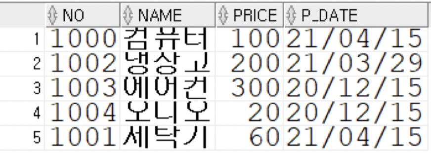
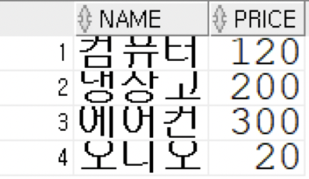

## 1. 데이터베이스 설계 순서로 옳은 것은?
```
1. 요구사항 분석 → 물리적 모델링 → 논리적 모델링 → 개념적 모델링 → 데이터베이스 구현

2. 요구사항 분석 → 개념적 모델링 → 논리적 모델링 → 물리적 모델링 → 데이터베이스 구현

3. 요구사항 분석 → 논리적 모델링 → 개념적 모델링 → 물리적 모델링 → 데이터베이스 구현

4. 요구사항 분석 → 논리적 모델링 → 물리적 모델링 → 개념적 모델링 → 데이터베이스 구현
```
## 2.CD 정보를 데이터베이스에 저장하려고 한다.
- CD는 타이틀, 가격, 장르, 트랙 리스트 등의 정보를 가지고 있다.
- 각 CD는 아티스트가 있으며 아티스트는 여러 CD를 출반한다.
- 트랙은 타이틀, 러닝타임(초)이 있다.

### 개체와 관계
- 개체(Entity)
  - CD : 타이틀, 가격, 장르, 트랙 리스트
  - 아티스트 : 이름, 국적, 데뷔년도
  - 트랙 : 타이틀, 러닝타임
- 관계(Relationship)
  - CD와 아티스트는 N:1(한명의 아티스트는 여러 CD를 낼 수 있다.)
  - CD와 트랙은 1:N(하나의 CD에는 여러 트랙이 포함될 수 있다.)
 
### 테이블로 변환하시오
```
CD 테이블
- TITLE(PK)
- PRICE
- GENRE
- TRACKLIST
- ARTISTNAME(FK)
====================
Artist테이블
- NAME(PK)
- COUNTRY
- DEBUTYEAR
=====================
Track 테이블
- Title(PK)
- RunningTime
- CDTitle(FK)
```

### 테이블을 생성하는 DDL문을 작성하세요
```SQL
CREATE TABLE Artist (
  Name VARCHAR(255) PRIMARY KEY,
    Country VARCHAR(255),
    DebutYear Date
);

CREATE TABLE CD (
  Title VARCHAR(255) PRIMARY KEY,
  Price DECIMAL,
  Genre VARCHAR(100),
  ArtistName VARCHAR(255),
    TrackList VARCHAR(255),
  FOREIGN KEY (ArtistName) REFERENCES Artist(Name)
);

CREATE TABLE Track (
  Title VARCHAR(255) PRIMARY KEY,
  RunningTime INT,
  CDTitle VARCHAR(255),
  FOREIGN KEY (CDTitle) REFERENCES CD(Title)
);
```

## 3. 회사의 정보를 DB에 저장하려고 한다.
1. 회사는 네 개의 부서를 운영한다. 부서는 (부서번호, 부서이름)을 저장한다.
2. 부서는 1명 이상의 직원(직원번호, 직원이름, 직책)을 두고 있다. 각 직원은 하나의 부서에 소속된다.
3. 직원은 부양가족(이름, 나이)이 있을 수 있다.
4. 각 직원은 근무했던 부서에 대한 근무기록(기간)이 있다.

### 1. 물리 모델링 하기
- 부서(Dept)테이블
  - DeptID(PK)
  - DeptName
- 직원(Employee)테이블
  - EmpID(PK)
  - EmpName
  - Position
  - DeptID(FK)
- 부양가족(Dependent)테이블
  - Name
  - Age
  - EmpID(FK)
- 근무기록(WorkRecord)테이블
  - Period
  - EmpID(FK)

## 4. 10번 및 30번 부서에 속하는 모든 사원 중 급여가 1500을 넘는 사원의사원번호,이름 및 급여를 조회하세요

### 풀이
```SQL
SELECT employee_id,first_name,salary FROM employees where department_id in (10, 30) and salary > 1500;
```

## 5. 관리자가 없는 모든 사원의 이름 및 직종을 출력하세요

### 풀이
```SQL
SELECT FIRST_NAME, JOB_ID FROM employees
WHERE MANAGER_ID IS NULL;
```

## 6. 직업이 IT_PROG 또는 SA_MAN 이면서 급여가 1000,3000,5000이 아닌 모든 사원들의 이름, 직종 및 급여를 조회하세요

### 풀이
```SQL
SELECT FIRST_NAME, JOB_ID, SALARY FROM EMPLOYEES
WHERE JOB_ID IN('IT_PROG','SA_MAN') AND SALARY NOT IN(1000,3000,5000);
```

## 7. PRODUCT 테이블에 아래의 데이터(레코드)를 삽입하시오. (10점)
```
1) 모든 칼럼의 타입에 맞는 데이터를 삽입하고, 모든 칼럼에 널 값이 없도록 작성하시오.

2) NO 칼럼의 데이터는 오라클 시퀀스를 활용하여 입력하시오. 시퀀스의 이름이나 속성은 알아서 처리하시오.

3) P_DATE 칼럼의 데이터 중 하나 이상은 반드시 현재 날짜를 호출하는 오라클 함수를 사용하시오.
```



## 8. PRODUCT 테이블에서 다음 조건을 만족하는 데이터의 정보를 수정하시오. (5점)
```
<< 조건 >>

NO 가 1000 인 데이터의 PRICE 를 20만큼 증가시키시오.
```
 ### 풀이
 ```sql
 UPDATE PRODUCT SET PRICE = PRICE + 20 WHERE NO = 1000;
 ```

 

## 9. PRODUCT 테이블에서 다음 조건을 만족하는 데이터를 삭제하시오. (5점)
```
<< 조건 >>

NAME 이 '세탁기' 인 데이터를 모두 삭제하시오.
```

### 풀이
```sql
DELETE FROM PRODUCT WHERE NAME = '세탁기';
```

## 10. PRODUCT 테이블에서 다음과 같이 데이터를 조회하시오.



### 풀이
```sql
SELECT NAME, PRICE FROM PRODUCT;
```

## 11. PRODUCT 테이블에서 다음 조건을 만족하는 데이터를 조회하시오. (5점)
```
<< 조건 >>

모든 레코드와 모든 칼럼을 높은 PRICE가 먼저 나타나도록 정렬하여 조회하시오.
```


