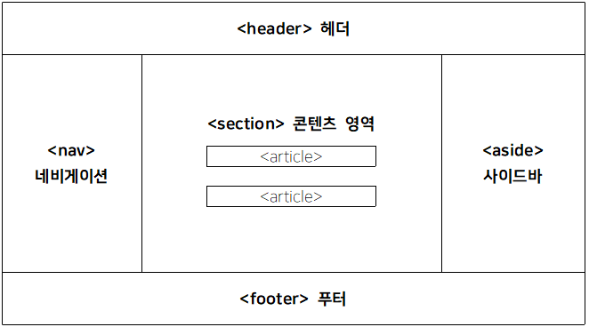

# 실습 환경 구축하기

1. WEB1500 폴더 아래 web 폴더 생성후 안에 util과 work폴더 만들기


2. util 폴더에 eclipse와 tomcat 넣기
  - 이클립스 압축폴더는 지우지말고 갖고 있을 것 이후 과정에서 계속 새로 풀어서 사용할 것이기 때문에


## 톰캣
1. apache.org 사이트로 접속한다.


2. 스크롤을 많이 내리면 T 부분에 톰캣이 있다.


3. 왼쪽에 다운로드 받는 탭이 있고 원하는 버전을 선택한 뒤 운영체제에 맞는 파일을 다운로드 받는다.


## 톰캣의 구조


#### 톰캣 디렉토리 설명

|디렉토리 이름|설명|
|----|---------|
|bin|톰캣을 실행하고, 종료시키는 스크립트 (.bat , .sh 등) 파일이 들어있다.|
|conf|서버 전체 설정파일 폴더 ( server.xml 등 )|
|lib|톰캣구동하는데 필요한 라이브러리(jar)가 들어있다|
|logs|예외 발생 사항 등의 로그 저장|
|temp|임시 저장용 폴더|
|webapps|웹 어플리케이션 폴더|
|work|jsp 파일을 서블릿형태로 변환한 java 파일과 class 파일이 저장|

#### 톰캣 주요 파일들

|파일 이름|설명|
|----|---------|
|context.xml|세션,쿠키 저장 경로 등을 지정하는 설정 파일이다. |
|server.xml|Tomcat의 주 설정 파일로 접근/접속에 관한 설정이 주를 이룬다.|
|web.xml|Tomcat의 환경설정 파일이며 서블릿, 필터, 인코딩 등을 설정할 수 있다.<br>가장 먼저 읽는 파일 DefaultServlet 지정 및 Servlet-mapping|


4. conf폴더의 server.xml을 켜 서버와 관련된 설정을 해주자(메모장으로 열어주자)


5. 주석처리가 되어있지 않는 Connector 부분의 포트번호를 9090으로 바꿔주자
    - 데이터베이스가 8080포트를 차지하게 될 것이므로 최고한 8080,8081은 피해주자.
  


## 이클립스 설정하기

1. 인코딩 타입 설정하기
Window > Preferences


General > Workspace > Text file encoding
한글이 깨지지 않게 설정을 해주자.


General > Web Brower


2. 서버 설정하기

Server > Runtime Environments


톰캣 버전 선택하고 Next 누르기 (수업할 때는 8.5버전을 사용하지만 상황에 따라서 유동적으로 설치한 버전 선택해서 하기)


Browse 눌러서 톰캣이 설치된 경로 잡아주기


bin 폴더가 눈으로 보이는 곳에서 폴더 선택하기(bin 폴더까지 절대로 들어가지 말것!!)


Finish 누르기

3. Web의 인코딩 타입 변경하기

Web > CSS Files


Web > HTML Files


Web > JSP Files


### 프로젝트 생성하기

File > New > Dynamic Web Project


톰캣, 모듈버전(3.1로 잡혀있는지) 확인 후 finish


#### 구조
- 당분간 src는 사용할 일이 없을것이다.


#### html 파일 생성
- WebContent 바로 아래 만들어야 한다. META-INF,WEB-INF아래에 만들지 말것


파일 이름 정하고 finish


## HTML
### 정의
- HTML은 Hyper Text Markup Language의 약자입니다.
- HTML은 웹페이지를 만드는 대표적인 마크업 언어입니다
- HTML은 웹페이지의 구조를 표현합니다.
- HTML은 여러 요소로 구성되어 있습니다
- HTML은 브라우저에 어떻게 내용을 표시할지 알려주는 역할을 합니다.

### 기본 구조


## HTML 주석(Comments)
- 주석은 브라우저에서 출력이 되지 않는 설명문장 입니다. 
- 소스코드에 대한 설명을 할때 사용합니다.
- \<!-- 로 시작해서 --\>로 마무리 합니다.
- 주석은 여러줄 입력 할수 있습니다.

```html
<!-- html 주석
브라우저에서 출력이 되지 않는 문장
소스코드에 대한 설명을 할 때 사용 -->

<!DOCTYPE html> <!-- HTML5 문서임을 선언, 대소문자 구분 없이 정의해도 상관없음 -->
<html lang="en"> <!-- HTML에서 최상위 태그(root태그) -->
<head> <!-- HTML페이지의 meta정보를 포함한다., 초기 페이지 렌더링시에 불러와야 할 외부 링크를 정의(CSS,JS) -->
    <meta charset="UTF-8">
    <meta name="viewport" content="width=device-width, initial-scale=1.0">
    <title>Document</title> <!-- HTML 페이지의 제목, 브라우더 상단의 웹페이지 탭에 제목으로 노출 -->
</head>
<body> <!-- HTML문서에서 실질적으로 보이는 영역을 정의하는 구간
            이미지, 글, 링크, 테이블, 동영상 등등-->
    안녕하세요
</body>
</html>
```

### 설명
- \<!DOCTYPE html\> 
	- HTML5 문서임을 선언합니다. 
	- doctyle에 따라 HTML 종류와 버전이 결정되며 그에 따라 브라우저에서 각 요소 표현 방식이나 호환되는 자바스크립트, CSS 적용 방식이 달라질 수 있습니다.
	- 현재는 거의 모든 브라우저가 HTML5를 지원하므로 HTML5 문서로만 지정해서 사용할 수 있도록 합니다.

	- 문서에서 한번 만 정의되고 페이지의 가장 상단에 위치합니다.
	- DOCTYPE -> doctype과 같이 대소문자 구분 없이 정의해도 인식을 합니다.

- \<head\>~\</head\> 
	- 주로 HTML페이지에서 meta 정보를 포함합니다
	- 예) \<meta charset=’utf-8’\>

	- 또한 초기 페이지 렌더링시에 불러와야 할 외부 링크를 정의합니다.(css, javascript)
	```html
	<link rel="stylesheet" type="text/css" href="style.css">
	<script src="common.js"></script>
	```

- \<body\>~\</body\>
	- HTML문서에서 실질적으로 보이는 영역을 정의하는 구간입니다.
	- 예) 이미지, 본문내용, 링크, 테이블, 제목 등등


## HTML 요소 
- HTML 요소는 일반적으로 태그라는 명칭이 익숙할 수 있습니다.
- HTML 요소는 일반적으로 시작 태그와 닫힘 태그로 정의가 됩니다. 다만 시작 태그와 닫힘태그가 없는 유일한 태그도 있습니다.
```html
   <시작태그 속성1="속성값" ... 속성n="속성값">내용</종료태그>
```
|요소|의미|코드 예|
|----|----|-----|
|태그(tag)|'<'와'>'로 둘러쌓인 문자열 시작태그<br><>와 종료태그</>로 구성|<b>\<title></b>웹문서내용<b>\</title></b>|
|내용(content)|태그로 둘러싸인 문자열|\<title><b>웹문서내용</b>\</title>|
|엘리먼트(element)|태그와 내용을 포함한 전체 문자열<br> HTML문서의 기본 구성 단위<BR>상위 엘리먼트 안에 하위 엘리먼트가 계층적으로 포함될 수 있다.|<b>\<title>웹문서내용\</title></b>|
|속성(attribute)|엘리먼트의 상세한 표현(기능) 설정 사항을 지시<br>시작 태그 안에 사용|\<title <b>color</b>="red"> \</title>|
|속성값(value)|속성값(''또는 ""로 감싸야 함)|\<title color=<b>"red"</b>> \</title>|

## HTML 속성(attributes)
- 모든 HTML 요소들은 속성(attributes)를 가지고 있습니다. 
- 속성(attributes)는 HTML 요소에 대한 추가적인 정보를 제공 합니다.
- 특정 태그에서의 속성이나 사전 정의된 속성은 적용된 기능으로서 추가정보를 활용합니다.

### HTML 속성 예시
- href  - 이동할 페이지 링크를 지정할 수 있습니다.
```html
<a href='https://www.naver.com'>네이버</a>
```

- src - 이미지 경로를 지정할 수 있습니다.
```html

```
- width, height - 요소의 너비, 높이를 지정합니다.
```html

```

- alt -이미지 대체 문구(이미지가 노출이 되지 않는 경우에 대체 노출되는 문구)
```html

```

- style - 요소에 직접 스타일을 지정할 수 있습니다(CSS 인라인 형태)
```html
<p style='color: red;'>빨간색 글씨</p>
```

- lang - 웹페이지의 언어를 선언할 수 있습니다. 다만 <html>태그에만 지정할 수 있습니다.
```html
<html lang="ko">
```

- title - 툴팁 형태로 노출되는 추가 정보를 지정할 수 있습니다.
```html
<p title='툴팁 메세지로 노출됩니다.'>안녕하세요</p>
```

### HTML 속성 권장사항
- 소문자로 사용
- 속성은 소문자, 대문자 상관 없이 인식을 하나 소문자로 쓰는것을 권장합니다(W3C 권장사항)

### HTML 데이터셋 속성
- 커스텀 사용자 속성을 DOM요소에 저장하는데 표준화된 방법을 제공한다.
- 자바에서 변수를 사용하듯이, 일종의 html의 변수 역할 이라고 할 수 있다.

### 데이터셋 사용의 장점
- 고유한 커스텀 값을 지정해 사용할 수 있다.

### 데이터셋 사용법
- 태그 내에 data로 시작하는 키워드를 기재하고, 그 뒤에 하이픈(-)이 조합된 형태로 개발자가 정의하고 싶은 속성명을 기재해주고 속성값을 써주면 사용자 변수가 완성된다.

### 데이터셋 사용 사례
- 버튼에 좋아요의 수를 직접 표현함으로써 보다 직관적이게 된다.
```html
<button data-id="341">좋아요</button>
```
- 데이터셋에 배열, 객체 데이터 저장
- 객체 형태로 된 문자열과 배열 형태로 된 문자열을 노드에 지정하고 이를 자바스크립트로 별도로 파싱 작업을 통해 사용할 수 있다.
```html
<!-- 객체 형태로 된 문자열 데이터셋 -->
<div data-person='{"name": "Chris Coyier", "job": "Web Person"}'></div>

<!-- 배열 형태로 된 문자열 데이터셋 -->
<div data-fruit='["apple", "banana", "melon"]'></div>
```
		
# HTML의 태그들

## \<head> 태그 정리
- 웹 문서의 제목(\<title>)
- CSS의 링크
- 파비콘(favicon),
- 다른 meta 데이터(설명, 작성자, 중요한 키워드와 같은 HTML에 대한 내용)를 포함한다.
- 그 외 script파일을 불러오거나 웹폰트 파일을 불러오는 link

### \<meta>
- html문서에 대한 정보
- 문자 인코딩 및 문서 키워드, 요약 등

### \<title>
- \<title>안의 내용이 웹브라우저의 제목 표시줄에 표시된다
- 페이지를 방문하는 방문자나 검색엔진은 제목 표시줄의 제목을 보고 내용을 예측한다.

### \<link>
- 외부파일을 연결할 때 사용한다.
```html
<link href="/style.css" rel="stylesheet" type="text/css" />
```
- href : 파일의 위치
- rel : 연결할 파일이 stylesheet라는 의미
- type : 스타일시트 코드가 텍스트 파일로된 css유형이라는 의미

### \<style>
- 스타일 정보를 정의할 때 사용하는 태그
#### CSS를 사용할 때 \<link>와 \<style>의 차이
- \<link>는 외부 css파일을 연결할 때, \<style>은 css 설정을 같은 웹페이지 안에서 정의할 때 사용한다.

### \<script>
- src속성을 넣어 외부에 있는 js파일을 불러와 사용할 수 있다.
```html
<script type="text/javascript" src="http://code.jquery.com/jquery-latest.min.js"></script>
```
- 혹은 태그 사이에 자바스크립트 코들르 직접넣어 사용할 수 있다.
```html
<script>
	document.write("Hello World !");
</script>
```

# 글자/폰트 관련 태그

## HTML 헤더(Headings)태그

### 정의
- 헤더는 글의 제목이나 부제목을 표기할 때 사용합니다.
- 태그는 h1~h6까지 있으며, 숫자가 작을수록 크기가 큽니다.

### ex01_header.html 만들기
```html
<!DOCTYPE html>
<html lang="en">
<head>
    <meta charset="UTF-8">
    <meta name="viewport" content="width=device-width, initial-scale=1.0">
    <title>Document</title>
</head>
<body>
    <!-- 헤더 태그 
    글의 제목이나 부제목을 표기할 때 사용
    태그는 h1 ~ h6까지 있으며, 숫자가 작을수록 크기가 크다.-->

    <h1>Heading 1 tag</h1> <!-- h1이 32px, 보통 1에서 3정도 까지 사용한다.-->
    <h2>Heading 2 tag</h2>
    <h3>Heading 3 tag</h3>
    <h4>Heading 4 tag</h4>
    <h5>Heading 5 tag</h5>
    <h6>Heading 6 tag</h6>

    <!-- h1 ~ 6 태그를 단순히 글자 크기를 크게 하거나 강조하는 용도로 사용하지 말것-->
</body>
</html>
```
### 주의사항
- h1~6 태그의 용도로 헤더 태그를 사용하여야 하며 단순히 글자 크기를 크게하거나(font-size) 강조(bold)표기 용도로 사용하지 말아야 합니다.

## HTML Block & Inline 요소
- 모든 HTML 요소들은 각 태그(요소)에 따른 기본 출력 값(display value)를 가지고 있습니다.

- 출력 값은 block과 inline이 있습니다.

### Block-level 요소
- 항상 줄개행을 합니다.
- 공간을 지정할 수 있습니다. 즉, width, height(너비와 높이)를 가질 수 있습니다.(CSS에서 지정)
- 아래 위 또는 왼쪽 오른쪽에 공백(margin)을 지정할 수 있습니다.
- 대표적으로 \<div\> 태그는 block-level 요소 입니다.
- block-level 태그(요소) 
```html
<address>
<article>
<aside>
<blockquote>
<canvas>
<dd>
<div>
<dl>
<dt>
<fieldset>
<figcaption>
<figure>
<footer>
<form>
<h1>
<h6>
<header>
<hr>
<li>
<main>
<nav>
<noscript>
<ol>
<p>
<pre>
<section>
<table>
<tfoot>
<ul>
<video>
```

### Inline-level 요소
- 줄개행을 하지 않습니다.
- 공간을 지정할 수 없습니다. 요소 안에 있는 내용만큼의 공간만 차지합니다.
- 위 아래 공백(margin)을 지정할 수 없으나, 내부 공백(padding)은 지정할 수 있습니다.
- 대표적으로 \<span\>태그는 inline-level 요소 입니다.
```html
<a>
<abbr>
<acronym>
<b>
<bdo>
<big>
<br>
<button>
<cite>
<code>
<dfn>
<em>
<i>

<input>
<kbd>
<label>
<map>
<object>
<output>
<q>
<samp>
<script>
<select>
<small>
<span>
<strong>
<sub>
<sup>
<textarea>
<time>
<tt>
<var>
```

## HTML 문단(Paragrahs) 태그
- 하나의 문단을 표기 표기하는 용도로 사용하며 \<p\>~\</p\> 형태로 사용합니다.
- 문단을 나누는 용도로 사용하는 태그이므로 \<p\> 태그 전 후로 공백이 추가 됩니다.

### ex02_ptag.html
```html
<!DOCTYPE html>
<html lang="en">
<head>
    <meta charset="UTF-8">
    <meta name="viewport" content="width=device-width, initial-scale=1.0">
    <title>Document</title>
</head>
<body>
    <!-- 문단(Paragraph) 태그
    하나의 문단을 표기하는 용도로 사용한다.-->
</body>
    안녕하세요.
    반갑습니다.
    <!-- 띄어쓰기는 최대 1칸씩만 적용 된다.-->
    저       는 홍길동          입니다.
    <p>단락을 구별하는 p태그는 블록요소입니다.</p><p>단락과 단락 사이는 margin이라는 여백을 통해 구별되고 있다.</p>
</html>
```

## HTML 서식(Text Formatting) 태그
- 텍스트 서식을 표현할수 있는 태그

- \<b\>    굵은 텍스트 정의
- \<em\>  강조된 텍스트 정의
- \<i\>     기울임 꼴 텍스트 정의
- \<small\>	더 작은 텍스트 정의
- \<strong\> 중요한 텍스트 정의
- \<sub\>	아래 첨자 텍스트 정의
- \<sup\>	윗 첨자 텍스트 정의
- \<ins\>	첨가 텍스트 정의
- \<del\>	지운 텍스트 정의
- \<mark\>	마킹 / 강조된 텍스트 정의
- \<q> 짧은 인용문을 지정한다.

### ex03_textFormatting.html 만들기
```html
<!DOCTYPE html>
<html lang="en">
<head>
    <meta charset="UTF-8">
    <meta name="viewport" content="width=device-width, initial-scale=1.0">
    <title>Document</title>
</head>
<body>
    <!-- HTML 서식 태그(Text Formatting)-->
    안녕하세요.
    반갑습니다.
    <!-- 띄어쓰기는 최대 1칸씩만 적용 된다.-->
    저       는 홍길동          입니다.

    <!-- b태그 굵은 텍스트 정의-->
    <p><b>단락</b>을 구별하는 p태그는 블록요소입니다.</p>
    <p><strong>단락</strong>과 단락 사이는 margin이라는 여백을 통해 구별되고 있다.</p>
    <p>
        <!-- i태그 텍스트 기울이기-->
        <i>링크태그</i>
        <em>링크태그2</em>
    </p>
    <p>
        <!-- del 태그 취소선-->
        My favorite color is <del>blue</del> red.
    </p>
    <p>
        <!-- small태그 글씨가 작게 나온다.-->
        HTML <small>Small</small> Formatting
    </p>
    <p>
        <!-- mark태그 하이라이트되서 나온다.-->
        HTML <mark>Marked</mark> Formmating
    </p>
    <p>
        <!-- sub태그 글이 아래로 나온다.-->
        This is <sub>subscripted</sub> text
    </p>
    <p>
        <!-- sup태그 글이 위로 나온다.-->
        This is <sup>superscripted</sup> text
    </p>

    <!-- pre태그 태그 내의 내용이 작성된 그대로 브라우저에 표시된다.(공백 개행문자 모두 포함해서)-->
    <pre>
    var myArray = [];
    console.log(myArray.length); //0

    myArray[1000] = true;

    console.log(myArray.length); //1001
    console.log(myArray[0]); //undefined
    </pre>

    <p>
        <a href="#">링크 없음</a>
    </p>

	<p>WWF's goal is to: <q>Build a future where people live in harmony with nature.</q></p>
</body>
</html>
```

## HTML 링크(Links)
### 하이퍼링크란 
- 하이퍼링크는 하이퍼텍스트 문서 안에서 직접 모든 형식의 자료를 연결하고 가리킬 수 있는 참조 고리이다. 이를테면 동영상, 음악, 그림, 프로그램, 파일, 글 등의 특정 위치를 지정할 수 있다. 이는 하이퍼텍스트의 핵심 개념이며, HTML을 비롯한 마크업 언어에서 구현하고 있다. 

- 즉, 하이퍼텍스트 문서는 문서에 다른 문서(다른 HTML)나 이미지, 그림등의 링크를 다수 포함할 수 있고 이동할 수 있는 것을 말하여 그 링크를 하이퍼링크라고 합니다.
 

### href 속성
- \<a\>태그는 하이퍼링크를 정의합니다. a 태그에서 가장 중요한 속성(attribute)는 href 이며 페이지를 이동할 링크(URL)을 지정할 수 있습니다.
```html
<a href='https://www.naver.com'>네이버</a>
```

### 경로
- 절대경로
	- 절대 경로란 특정문서 페이지 또는 이미지등 자원에 접근할 수 있는 전체 URL을 의미 합니다.
	- photo.jpg 파일이 서버에서 /web/public/img/photo.jpg에 위치 해 있다면 \<a href='/web/public/img/photo.jpg'\>사진\</a\>과 같이 표현할 수 있습니다.

- 상대경로
	- 서버에서 /web/public/img/photo.jpg에 위치해 있고 현재 html 경로가 /web/public이라면 \<a href='img/photo.jpg'\> 형태로 표현할 수 있습니다.(현재 경로 기준)

	- 상대경로를 표현하는 방식
	- ./ 현재 파일이 열려 있는 경로
	- ../ 현재 파일이 열려 있는 경로보다 1단계 상위 경로
	- ../../ 현재 파일이 열려 있는 경로보다 2단계 상위 경로


### ex04_linktag.html
```html
<!DOCTYPE html>
<html lang="en">
<head>
    <meta charset="UTF-8">
    <meta name="viewport" content="width=device-width, initial-scale=1.0">
    <title>Document</title>
</head>
<body>
    <!-- a 태그-->
    <p>
        <a href="연결할 링크의 경로">내용</a>
    </p>
    <p>
        <a href="https://www.naver.com">네이버로 이동</a>
    </p>

    <!-- a 태그에서 사용할 수 있는 속성 값
    절대 URL : 웹사이트 URL
    상대 URL : 자신의 위치를 기준으로한 대상의 URL
    # : 실제로는 연결되지 않는, 링크역할만 하도록 만든것-->
    <p>
        <a href="ex01_first.html">첫번째 예제로 이동</a>
    </p>
    <p>
        <a href="#">링크 없음</a>
    </p>
    <p>
        <a href="javascript:alert('Hello')">자바스크립트 코드</a>
    </p>
    <p>
        <a href="경로" title="링크 내용에 대한 설명">타이틀 속성</a>
    </p>
</body>
</html>
```
	
## 미디어 태그(media)

### 이미지(img)태그
- HTML 태그는 웹페이지에서 이미지를 표시하기 위해 사용합니다.

- 프로젝트에 WebContent에 image 폴더 복사해서 넣기


#### 필수 속성
\태그에는 다음 2개의 필수 속성이 있습니다.
- src - 이미지 경로를 지정할수 있습니다.
- alt - 이미지 대체 문구(이미지가 노출이 되지 않는 경우에 대체 노출되는 문구)

#### width, height 속성
- 이미지의 너비와 높이를 지정할 수 있습니다. 다만 이미지의 사이즈는 속성으로 지정하기 보다는 CSS Style로 width, height를 지정하는것이 좋습니다.


### ex05_media.html 생성
```html
<!DOCTYPE html>
<html lang="en">
<head>
    <meta charset="UTF-8">
    <meta name="viewport" content="width=device-width, initial-scale=1.0">
    <title>Document</title>
</head>
<body>
    <!-- img태그 
    웹 페이지에 이미지를 넣을 때 사용 태그 하나당 1개의 이미지를 삽입할 수 있다.
    반드시 src 속성을 사용해서 이미지의 경로를 지정해야 한다.-->

    <!-- 이미지를 직접 다운로드 한 뒤, 파일경로를 삽입-->
    <p>
        
    </p>
    <!-- 이미지의 주소를 붙혀넣기도 가능하다.-->
    <p>
        
    </p>
    <!-- alt 속성 : 이미지가 안나왔을 때 설명해주는 대체 텍스트 추가-->
```
### 오디오태그(audio)
```html
    <!-- audio태그 
    음성파일 삽입
    controls : 음악 재생 도구를 표시할 것인지 지정. 재생 도구의 외관은 브라우저마다 차이가 있다.-->
    <audio src="경로" controls></audio>
```
### 비디오태그(video)
```html
    <!-- video 태그
    영상을 삽입-->
    <video controls>
        <source src="경로">
    </video>
</body>
</html>
```

## HTML 테이블(Tables)
- HTML 테이블은 table, tr, th, td, thead, tbody, tfoot 등으로 구성되어 있으며 
- tr은 데이터의 행 td, 
- th는 데이터의 열로 생각할 수 있습니다.
- th는 테이블 헤더로 테이블 각 열을 대표하는 셀
- 또한 테이블 태그는 thead - 헤더영역, tbody - 본문영역, tfoot - 본문영역으로 구분하여 사용할 수 있습니다.

### ex06_tabletag.html 생성하기
```html
<!DOCTYPE html>
	<html>
		<head>
			<meta charset="UTF-8">
			<title>테이블(표)</title>
		</head>
		
		<body>
			<!-- 1행 1열 -->
			<table border = "1"> <!-- border : 선의 두께 -->
				<tr><!-- 행 -->
					<td>1행 1열</td> <!-- 열 -->
				</tr>
				
				
			</table>
			<hr>
			
			<!-- 1행 2열 -->
			
			<table border = "1"> 
				<tr><!-- 행 -->
					<td>1행 1열</td> 
					<td>1행 2열</td> 
				</tr>	
			</table>
			<hr>
			
			<!-- 2행 1열 -->
			
			<table border = "1"> 
				<tr><!-- 행 -->
					<td>1행 1열</td> <!-- 열 --> 
				</tr>
				<tr><!-- 행 -->
					<td>2행 1열</td>  
				</tr>		
			</table>
			
			<hr>
			
			<table border = "1"> 
				<tr>
					<td>1행 1열</td> 
					<td>1행 2열</td>
				</tr>
				<tr>
					<td>2행 1열</td>
					<td>2행 2열</td>  
				</tr>		
			</table>
		</body>
	</html>
```
- 테이블 열 합치기
```html
<!DOCTYPE html>
	<html>
		<head>
			<meta charset="UTF-8">
			<title>테이블 열 합치기</title>
		</head>
		
		<body>
			<table border = "1">
				<tr>
					<td colspan="3">메뉴판</td>
				</tr>
				
				<tr>
					<td>짜장</td>
					<td>짬뽕</td>
					<td>탕수육</td>
				</tr>
			</table>
		</body>
	</html>
```
- 테이블 행 합치기

```html
<!DOCTYPE html>
	<html>
		<head>
			<meta charset="UTF-8">
			<title>테이블 행 합치기</title>
		</head>
		
		<body>
			<table border="1">
				<tr>
					<td rowspan="2">메뉴판</td>
					<td>짜장</td>
				</tr>
					
					<td>짬뽕</td>
				<tr>
				
				</tr>
			</table>
		</body>
	</html>
```

### thead/tbody/tfoot 요소
- \<thead> 태그는 HTML테이블에서 헤더 콘텐츠(header content)들을 하나의 그룹으로 묶을 때 사용한다.
- \<thead> 요소는 테이블의 각 영역(header,body,footer)을 명시하기 위해 \<tbody>, \<tfoot>요소와 함께 사용된다.
- 기본적으로 웹 페이지의 레이아웃에 전혀 영향을 주지 않지만, 이 요소들의 스타일을 CSS를 사용하여 변경할 수는 있다.
```html
<table>
    <thead>
        <tr>
            <th>출장비 내역</th>
            <th>금액</th>
        </tr>
    </thead>
    <tbody>
        <tr>
            <td>교통비</td>
            <td>45000</td>
        </tr>
    </tbody>
    <tfoot>
        <tr>
            <td>총 합계</td>
            <td>103000</td>
        </tr>
    </tfoot>
</table>
```
## HTML 리스트(Lists)태그

- 순서없는 리스트(Unordered HTML List)
- 순서 없는 리스트는 <ul>태그로 시작하며 리스트 항목들은 \<li\>~\</li\> 태그를 사용합니다.

### ex07_list.html
```html
<!DOCTYPE html>
<html lang="en">
<head>
    <meta charset="UTF-8">
    <meta name="viewport" content="width=device-width, initial-scale=1.0">
    <title>Document</title>
</head>
<body>
    <!-- ul태그(Unordered List)-->
    <ul>
        <li>홍길동</li>
        <li>김길동</li>
        <li>박길동</li>
    </ul>

    <br> <!-- \n 와 같은 역할-->

```

- 리스트 구분 기본 값은 disc로 색이 채워진 둥근 점 모양입니다.
- 리스트 구분 값은 css의 list-style-type으로 지정할 수 있습니다.
	- disc - 기본 값, 채워진 둥근 점
	- circle - 책이 미워진 둥근 점
	- square - 사각형 모양 점
	- none - 구분값 없음

- 적용방식
```html
<ul style="list-style-type:disc 또는 circle, square, none 중 하나 입력">
```

### 순서 있는 리스트(Ordered HTML List)
순서 있는 리스트는 \<ol\>태그로 시작하며 리스트 항목들은 \<li\>~\</li\> 태그를 사용합니다.

- 리스트 구분 값은 순서가 있는 숫자나 문자로 표현이 되며 다음과 같은 타입으로 지정하실 수 있습니다.

- \1 - 기본값이며 숫자 순서로 표시됩니다.
- A - 대문자 알파벳 순서로 표시됩니다.
- a - 소문자 알파벳 순서로 표시됩니다.I - 대문자 로마 숫자 형식으로 표시됩니다.
- i - 소문자 로마 숫자 형식으로 표시됩니다.

- 적용방식
```html
<ol type="1 또는 A, a, I, i 중 하나 입력">
```

- 시작번호 지정할 경우 start="시작번호"로 지정하며 숫자를 변경할 경우 \<li value="변경숫자"\>로 입력합니다.

```html
    <!-- ol태그(Ordered List)
    순서가 있는 리스트
    type 속성
    사용할 수 있는 속성 값
    1 -> 숫자(default)
    a -> 영어 소문자
    A -> 영어 대문자
    i -> 로마숫자 소문자
    I -> 로마숫자 대문자

    start 속성
    중간부터 시작해야 할 때

    reversed 속성
    역순으로 사용-->
    <ol type="I" start="3" reversed>
        <li>물을 끓인다.</li>
        <li>스프를 넣는다.</li>
        <li>면을 넣는다.</li>
    </ol>
</body>
</html>
```

### 깊이가 있는 리스트
### ex08_depthlist.html
```html
<!DOCTYPE html>
<html>
	<head>
		<meta charset="UTF-8">
		<title>깊이를 가지는 목록들</title>
	</head>
	
	<body>
		<ul>
			<li> 
				HTML
				<ul>
					<li>마루치</li>
					<li>아라치</li>
					
					<li>
						파란해골13호
						<ul>
							<li>14호</li>
							<li>15호</li>
						</ul>
					</li>
				</ul>
			</li>
		</ul>
		
		<ol>
			<li>나는 OL이다.</li>
			<li>
				OL의 하위 요소
				<ol>
					<li>날슈</li>
					<li>달하</li>
				</ol>
			</li>
		</ol>
	</body>
</html>
```
### 깊이가 있는 리스트 실습
```html
<!DOCTYPE html>
<html>
	<head>
		<meta charset="UTF-8">
		<title>깊이가 있는 ul 문제</title>
	</head>
	
	<body>
		<ul>
			<li><a href="#">개인뱅킹</a>
				<ul>
					<li><a href="#">조회</a></li>
					<li><a href="#">이체</a></li>
					<li><a href="#">신규/해지</a></li>
					<li><a href="#">공과금/법원</a></li>
					<li><a href="#">뱅킹보안센터</a></li>
				</ul>			
			</li>
			<li><a href="#">자산관리</a>
				<ul>
					<li><a href="#">나의지출</a></li>
					<li><a href="#">이체</a></li>
					<li><a href="#">신규/해지</a></li>
					<li><a href="#">공과금/법원</a></li>
				</ul>
			</li>
			<li><a href="#">예금/신탁</a></li>
			<li><a href="#">대출</a></li>
			<li><a href="#">펀드</a></li>
			<li><a href="#">외환</a></li>
		</ul>
	</body>
</html>
```

### 설명 리스트(Description List)
- 용어에 대한 설명을 위한 구조로 구성되어 있는 리스트 입니다.
- \<dl\>~\</dl\> 태그이며 하나의 행을 구성합니다. 
- 각 행은 \<dt\>~\</dt\>(항목명)
- \<dd\>~\</dd\>(항목 설명)으로 구성되어 있습니다.

### ex9_dscription.html
```html
예)
<!DOCTYPE html>
<html>
	<head>
		<meta charset="UTF-8">
		<title>dl(정의목록)</title>
	</head>
	
	<body>
		<!-- dl은 ul, ol과 같이 목록화 한 내용을 표기하지만
			일반적으로 사전적인 명확한 뜻을 가지고 있는 것들 위주로 사용하는 편(영단어) -->
		<dl>
			<dt>Bear</dt>
			<dd>곰</dd>
			<dd>참다,견디다</dd>
		</dl>
	</body>
</html>
```	
## \<div\>태그
- body 문서 안에서 각 영역의 세션을 구분 정의 한다.
- 구역을 나누는 태그, 가로줄 전체를 차지, 너비가 100%

### ex10_divtag.html
```html
<!DOCTYPE html>
<html>
	<head>
		<meta charset="UTF-8">
		<title>div(영역지정 태그)</title>
	</head>
	
	<body>
		<!-- div : 특정영역별로 묶어서 표시되어야 할 태그들을 하나의 영역으로
			합쳐서 관리할 수 있도록 해 주는 태그 -->
		<div>
			<a href="#">메뉴1</a>
			<a href="#">메뉴2</a>
			<a href="#">메뉴3</a>
		</div>
		
		<div>
			<a href="#">메뉴4</a>
			<a href="#">메뉴5</a>
			<a href="#">메뉴6</a>
		</div>
			<p>나는 p태그다</p>
			<p>나는 p태그다2</p>
	</body>
</html>
```

### \<span\>태그
- 일반적으로 텍스트에 색칠, 크기, 좌우간격을 조절하는데 사용된다.
- inline 요소이다.

### ex12_spantag.html
```html
<p>My mother has <span style="color:blue;font-weight:bold">blue</span> eyes and my father has <span style="color:darkolivegreen;font-weight:bold">dark green</span> eyes.</p>
```

## 시맨틱 태그(Semantic Tag)
- 사람이 이해하기 쉽도록 태그의 이름만 보고도 역할이나 위치를 알 수 있도록 만든 태그들이다.
- 시맨틱 태그가 나오기 이전에는 \<div> 태그로 일일히 위치 범위를 지정하고 각 태그의 class명으로 이 요소의 역할을 명시해야 했지만, semantic태그를 이용하면 태그 이름에서 이 엘리먼트의 위치와 역할을 단번에 알 수 있기 때문에 더 모던하다고 할 수 있다.

### 시맨틱 태그 구성요소

|태그|설명|
|----|-----|
|header|페이지의 머리글, 제목, 로고, 메뉴, 검색 관련, 유틸, 작성자의 이름 등으로 구성|
|nav|페이지의 네비게이션 영역.(사이트 내, 외부로 이동). 메뉴, 목차, 색인 등등|
|main|메인 컨텐츠 영역.<br>문서 내에서 반드시 한 번만 사용<br>다른 header,footer,nav,article,section, aside의 하위로 작성할 수 있다.|
|section|본문의 여러 내용(article)을 포함하는 부분을 의미|
|article|본문의 주 내용이 들어가는 부분을 의미|
|aside|간접 컨텐츠, 보조 컨텐츠를 의미하며, 대체적으로 옆에 위치하는 내용의 부분을 의미|
|footer|하단 바닥글을 의미합니다. 주로 들어가는 정보는 회사정보, 저작권,연락처 등등이 있다.|

### \<header>
- 문서나 특정 섹션(section)의 헤더(header)를 정의할 때 사용한다.
- 헤더(header)는 보통 토입부에 해당하는 컨텐츠나 네비게이션 링크의 집합 등과 같은 정보를 포함하게 된다
```html
<header>
     <h3>날씨 정보</h4>
     <h4>2월 19일</h4>
     <p>- 기상청 제공 -</p>
</header>
```
### \<footer>
- 문서나 특정 섹션(section)의 푸터(footer)를 정의할 때 사용합니다.
푸터(footer)는 보통 <footer> 요소가 포함되어 있는 문서나 섹션에 대한 정보를 포함한다.

### \<address>
- 사이트 제작자 정보, 연락처 정보
- 실제 우편 주소를 넣는 태그는 아니지만 웹사이트와 관련된 주소를 넣을 때 사용.

```html
<footer>
    <p>Copyright © 2018 tcpschool.co.,Ltd. All rights reserved.</p>
    <address>Contact webmaster for more information. 070-1234-5678</address>
</footer>
```

## iframe 태그
- iframe은 inline frame의 줄임말이며, 페이지에 Frame을 넣을 때 사용한다.
- 여러 기업에서 다른 웹사이트에 Banner 혹은 여러 형태의 Plugin을 제공하기 위해 많이 사용되고 있다.
```html
<iframe src="삽입할 페이지 주소" [속성="속성값"]> </iframe>
```

```html
<p>
  <iframe 
      src="https://www.youtube.com/embed/jSJM9iOiQ1g" 
      width="560" 
      height="315" 
      frameborder="0"
      style="border:2px dashed red" 
      allowfullscreen>
   </iframe>
</p>
```
- src="불러올 주소" : 표시할 내용의 경로 URL을 적는다.
- srcdoc="\<p>하이?\</p>" : 직접 태그소스를 iframe으로 표시할 수 있다.
- width : 가로값 설정
- height : 세로값 설정
- frameborder : 프레인 테두리 경계선 유무 속성값은 (0/1) 두가지 이다.