# CSS
- HTML이나 XML과 같은 구조화된 문서(Document)를 화면, 종이 등에 어떻게 렌더링할 것인지를 정의하기 위한 언어이다.
- 즉 CSS는 HTML의 각 요소(element)의 style(design, layout etc)을 정의 하여 화면(Screen) 등에 어떻게 렌더링하면 되는지 브라우저에게 설명하기 위한 언어이다.
- CSS(Cascading Style Sheet)는 HTML과 같은 마크업 언어로 작성된 문서에 색상, 폰트, 각 요소의 위치 변경, 백그라운드 및 간단한 애니메이션(transition) 등의 효과를 주어 보다 보기 좋게 꾸며 주는 역할을 합니다.

## HTML과 CSS
- HTML과 CSS는 각자의 문법을 갖는 별개의 언어이며 HTML은 CSS를 포함할 수 있다.
- 그러나 HTML없이 단독으로 존재하는 CSS는 의미가 없다.

## CSS 기본 문법


### 1. 선택자(Selector)
- CSS를 적용하고자 하는 HTML 요소(element)

### 2. 선언부
- 하나 이상의 선언들을 세미콜론(;)으로 구분하여 포함할 수 있으며, 중괄호({})를 사용하여 전체를 둘러 싼다.
- 각 선언은 CSS 속성명(property)과 속성값(value)을 가지며, 그 둘은 콜론(:)으로 연결된다.
- 이러한 CSS 선언은 언제나 마지막에 세미콜론으로 끝마친다.

## CSS 선언 방식

### 인라인(in-line)방식
- HTML의 각 태그에서 style 속성에 직접 작성하는 방식
```html
<p style="color: red">빨간색</p>
```


### 내장(embaedded)방식
- 같은 HTML 문서에 \<style\> \</style\> 태그 안에 스타일을 적용하는 방식 입니다. 

### embedded.html
```html
<!DOCTYPE html>
	<html>
		<head>
			<meta charset="UTF-8">
			<title>css(스타일시트)</title>
			
			<!-- css를 적용하기 위한 태그 -->
			<style type="text/css">
				/* body안에 존재하는 각각의 태그에게 스타일을 적용 */
            /*태그이름{속성 : 속성값;}*/
            
            /*body에 있는 h1 태그는 모두 색이 바뀌게 된다.*/
				h1{color:red;} 
				h2{color:yellow;}
				h3{color:buttonhighlight;}
            
            /*네이버에 생상표 검색 스크롤 내리면 RGB 코드값이 나온다.
            색깔을 16진수로 표현한것. 빨강 초록 파랑 순서.
            16진수는 0~9 A~F까지로 이루어져있다.*/
				p{color:#ffaaff;} /* #faf;  */ 
			</style>
		</head>
		
		<body>
			<h1 >스타일 연습중1-1</h1>
			<h1>스타일 연습중1-2</h1>
			<h2>스타일 연습중2</h2>
			<h3>스타일 연습중3</h3>
			<p>스타일 연습중4</p>
		</body>
	</html>
```

### 링크(link)방식
- HMTL <link>를 이용하여 외부 문서로 CSS를 불러와 적용하는 방식
```html
<link rel=”stylesheet” type=”text/css” href='css 외부 파일 경로'>
```
### css 폴더 만들고 style.css 파일 만들기
```css
p{color : red;}
```

### link.html
```html
<!DOCTYPE html>
<html lang="en">
<head>
    <meta charset="UTF-8">
    <meta name="viewport" content="width=device-width, initial-scale=1.0">
    <link href="css/style.css" rel="stylesheet" type="text/css">
    <title>Document</title>
</head>
<body>
    <p>외부 스타일시트 적용</p>
</body>
</html>
```

### @import 방식
- @import를 이용하여 외부 문서로 CSS를 불러와 적용하는 방식

### import.html
```html
<!DOCTYPE html>
<html lang="en">
<head>
    <meta charset="UTF-8">
    <meta name="viewport" content="width=device-width, initial-scale=1.0">
    <style>
        @import url(css/style.css);
    </style>
    <title>Document</title>
</head>
<body>
    <p>외부 스타일시트 적용</p>
</body>
</html>
```

## CSS파일을 분리하는 이유
- HTML코드 내부에서 디자인과 관련된 정보를 제거할 수 있다는 점이다.
- HTML코드가 정보의 전달과 웹 페이지의 구조 설계라는 본연의 기능에 집중할 수 있게 되었으므로, 훨씬 읽기 편안한 코드를 작성할 수 있게 되었다.

## CSS 선택자

### HTML 요소 선택자
- CSS를 적용할 대상으로 HTML요소의 이름을 직접 선택하여 사용할 수 있다.
```css
h2 { color: teal; text-decoration: underline; }


<h2>이 부분에 스타일을 적용합니다.</h2>
```
   
### 클래스(class)선택자
- 특정 집단의 여러 요소를 한 번에 선택할 때 사용한다.
- 이런 특정 집단을 묶을 수 있는걸 클래스(class)라고 하며, 같은 클래스 이름을 가진 요소들을 모두 선택해준다.

### class.html
```html
<!DOCTYPE html>
	<html>
		<head>
			<meta charset="UTF-8">
			<title>class를 통한 css 적용</title>
			<style type="text/css">

			.headings {
				color: lime;
				text-decoration: overline;
			}
			.headings2 { 
				color: blue; 
				font-size: 50px; 
			}
			/*h2 태그에서 class가 headings 인것만 적용*/
			h2.headings{
				color : red;
			}

			</style>
		</head>
		
		<body>
			<!-- class의 개념은 똑같은 태그가 있을때 구별하기 위한 식별자가 된다. -->
			<h1>클래스 선택자를 이용한 선택</h1>

			<h2 class="headings">이 부분에 스타일을 적용합니다.</h2>

			<p>클래스 선택자를 이용하여 스타일을 적용할 HTML 요소들을 한 번에 선택할 수 있습니다.</p>

			<h3 class="headings">이 부분에도 같은 스타일을 적용합니다.</h3>

			<h3 class="headings headings2">이 부분에는 다른 스타일과 추가 스타일을 적용합니다.</h3>
		</body>
	</html>
```
      
### 클래스 활용
### ex05_class.html
```html
<!DOCTYPE html>
	<html>
		<head>
			<meta charset="UTF-8">
			<title>일부분 지정 태그(span)를 통한 css변경</title>
			<style type="text/css">
				/* .box라는 이름을 가진 클래스의 자식(내부태그)중 h2태그에게만 속성을 적용  중요!
            			띄어쓰기가 내 안에 있는 자식 요소에 적용되기 때문에 띄어쓰기는 주의해서 써야 한다.*/
				body .box h2{color:aqua;}
				span{color : gray;}
				body div.box h2 span{color : red;};
			</style>
		</head>
		
		<body>
			<div class="box">
				
				<h2>클래스 <span>연습</span>중</h2>
				<h1>클래스 연습중이라고!</h1>
				
				<div class="box">
					<h2>클래스 <span class="span_blue">연습</span>중2</h2>
					
				</div>
			</div>
			
			<h2>클래스 <span class="span_green">연습</span>중3</h2>
		</body>
	</html>
```
### index.html에 class주기
```html
<div>
	<!-- 높이 35px로 하이라이트 이미지 2개 넣기-->
	<div class="highlight">
		<div>
			
		</div>
		<div>
			<!-- window + ; -->
			😎
		</div>
	</div>
	<div class="highlight">
		<div>
			
		</div>
		<div>
			<!-- window + ; -->
			😊
		</div>
	</div>
</div>
```
      
### id
- CSS를 적용할 대상으로 특정 요소를 선택할 때 사용
- 이때 #을 써서 구분해준다.
#### 주의
- HTML과 CSS에서는 하나에 웹 페이지에 속하는 여러 요소에 같은 아이디 이름을 사용해도 문제없이 동작한다.
- 하지만 중복된 아이디를 이용해 자바스크립트 작업을 하게 되면 오류가 발생한다.
- 되도록 하나의 웹 페이지에 속하는 요소에는 다른 아이디 이름을 사용하거나 클래스를 사용하는것이 좋다.
```html
<!DOCTYPE html>
	<html>
		<head>
			<meta charset="UTF-8">
			<title>id를 통한 css적용</title>
			<style type="text/css">
			/* a1이라는 id를 가진 태그로 접근
				클래스 접근은 .
				id 접근은 #
			 */
         
			#a1{ color : red;}
			#a2{ color : blue;}			
			</style>
		</head>
		
		<body>
         
			<!-- id속성은 절대로 중복된 이름으로 작성하지 않는다. 필수! -->
         <!-- 클래스의 경우 디자인을 위해서 만들어졌기 때문에 겹쳐도 상관이 없지만
              id의 경우 나중에 서버로 데이터를 넘겨야 하는 경우도 있기 때문에 혼란을 야기할 수 있다.-->
			<h1 id="a1">아이디 연습중</h1>
			<h1 id="a2">아이디 연습중2</h1>
		</body>
	</html>      
```
### 클래스와 아이디를 구분하는 이유
- HTML의 정보 전달력 향상에 있다.
- 클래스로 정의된 정보는 디자인은 같지만 내용물은 다른 형태로 화면에 여러번 등장할 수 있다.
- 아이디는 문서 내에서 단 한번만 등장한다.
- 따라서 HTML코드를 읽기만 해도 어떤 정보가 반복되는 정보이며 어떤 정보가 단 한 번만 등장하는 유일한 정보인지를 구분지을 수 있다는 장점이 있다.

### 그룹(group)선택자
- 위에서 언급한 여러 선택자를 같이 사용할 때 사용한다.
- 여러 선택자를 쉼표(,)로 구분하여 연결한다.
- 그룹 선택자는 코드를 중복해서 작성하지 않도록 하여 코드를 간결하게 만들어준다.

### group.html
```html
<!DOCTYPE html>
	<html>
		<head>
			<meta charset="UTF-8">
			<title>class를 통한 css 적용</title>
			<style type="text/css">

			h1, h2, p { background-color: lightgray; }

			</style>
		</head>
		
		<body>
			<h1>그룹 선택자를 이용한 선택</h1>

			<h2 class="headings">이 부분에 스타일을 적용합니다.</h2>

			<p>그룹 선택자를 이용하여 여러 선택자를 같이 사용할 수 있다.</p>

			<h3 class="headings">선택하지 않으면 적용되지 않는다.</h3>

		</body>
	</html>
```

### 전체 선택자
- 전체 선택자는 *문자를 사용하여 HTML문서 내의 모든 요소를 선택한다.
```html
<!DOCTYPE html>
	<html>
		<head>
			<meta charset="UTF-8">
			<title>class를 통한 css 적용</title>
			<style type="text/css">

			* { color: teal; text-decoration: underline; }

			div * { color: teal; text-decoration: underline; }

			</style>
		</head>
		
		<body>
			<h1>전체 선택자를 이용한 선택</h1>

			<h2>전체가 선택된다.</h2>

			<p>특정 요소 안의 모든 요소를 선택할수도 있다.</p>
			<div>
				<h3>선택한 요소 안쪽에만 스타일이 적용된다.</h3>
			</div>

		</body>
	</html>
```

### 스타일 적용 우선순위
- 인라인 선언 방식
- 아이디 선택자
- 클래스 선택자
- 태그 선택자
- 전체 선택자

## 테두리(border)
```html
<!DOCTYPE html>
	<html>
	<head>
		<meta charset="UTF-8">
		<title>border(테두리, 선)</title>
		<style type="text/css">
		
		/* border-width: 선 두께
		   border-color: 선 색상 */
			p{ border-width:15px;
			   border-color:blue;}
		
		/* border-style:선의 스타일 */
			.box1{ border-style:none;}
			.box2{ border-style:hidden;}
			.box3{ border-style:dotted;} /* 점선 */
			.box4{ border-style:dashed;} /* 긴 점선 */
			.box5{ border-style:solid;} /* 가장 많이 사용하는 스타일 */
			.box6{ border-style:double;}
			.box7{ border:20px groove red;} /* 두께감을 가지는 테두리 */
			.box8{ border:20px green ridge;}
			.box9{ border-style:inset 20px green;} /* 두께감은 없지만 그림자는 있음 */
			
			.box10{ border:20px outset #F00;} /* 한번에 스타일주기 (두께, 스타일, 색깔)  */
			
			.div1{ border:10px solid #0f0;}
			
			.div2{ border:10px solid red;
				   width:200px;
				   height:100px;}
			/*옆에 공간이 생겨도 요소가 들어올수 없다 왜 block요소니까*/
			
			/* 상,우,하,좌 순으로 각각 다른 두께의 테두리를 주고 싶다면 반드시 border-로 시작하는 속성을 사용해야 한다. */
			.div3{ border-bottom : 10px solid blue;
					border-top : 10px solid green;
					border-left : 10px solid red;}
					
			/*inline태그이기 때문에 원하지 않는 영역까지 침범할 수 있다. */
			span{border : 5px solid #aaf;
				width : 500px;
				height:100px;}
		</style>
	</head>
	
	<body>
		<p class="box1">border테스트 중1</p>
		<p class="box2">border테스트 중2</p>
		<p class="box3">border테스트 중3</p>
		<p class="box4">border테스트 중4</p>
		<p class="box5">border테스트 중5</p>
		<p class="box6">border테스트 중6</p>
		<p class="box7">border테스트 중7</p>
		<p class="box8">border테스트 중8</p>
		<p class="box9">border테스트 중9</p>
		<p class="box10">border테스트 중10</p>
		
		<div class="div1">
			div에 테두리 주기
		</div>
		<div class="div2">
			div에 테두리 주기
		</div>
		<div class="div3">
			div에 테두리 주기
		</div>
		
		<span>hi</span>
		<span>hello</span>
	</body>
	</html>
```


## padding(패딩)
- 내용(content)와 테두리(border) 사이의 간격의 크기를 설정해주는 속성
```html
<!DOCTYPE html>
	<html>
		<head>
		<meta charset="UTF-8">
		<title>padding(안쪽여백)</title>
		<style>
			p{ border:5px solid red;
		 	background:yellow;}
		 	
			.box1{ padding:20px;} /*상자 안에 상,하,좌,우 여백을 준다. */
		 	.box2{ padding:20px 50px;}/* 상하,좌우 적용*/
		 	.box3{ padding:20px 50px 30px;}/*상,좌우,하 적용  */
		 	.box4{ padding:20px 30px 50px 70px;}/*상,우,하,좌 적용 */
		 	/* 0픽셀인 경우 px단위는 생략이 가능하다. */
		 	
		 	/* padding- 방향을 통해 방향별로 패딩을 설정할 수도 있다. */
		 	.box5{ padding-left : 20px;}
		 	/* .box5{ padding-left : 0 0 0 20px;} */
		 		   
		 	
		</style>
		</head>
		
		<body>
			<p class="box1">패딩적용 연습중</p>
			<p class="box2">패딩적용 연습중</p>
			<p class="box3">패딩적용 연습중</p>
			<p class="box4">패딩적용 연습중</p>
			<p class="box5">패딩적용 연습중</p>
		</body>
	</html>
```


- padding을 주다보면 태그의 크기가 커질 수 있다.

## margin(마진)
- 요소 주변 여백을 뜻합니다.
```html
<!DOCTYPE html>
	<html>
		<head>
			<meta charset="UTF-8">
			<title>margin(바깥쪽 여백)</title>
			<style>
				p{border:2px solid red;
				  background: aqua;}
				  
				div{border:2px solid red;}
				
				#box1{ margin:0;}/* 상,하,좌,우 적용 */
				#box2{ margin:20px 50px;} /* 상하,좌우 적용 */
				#box3{ margin:30px 50px 30px;} /*상,좌우,하 적용  */
				#box4{ margin:50px 30px 40px 70px;}
				
				div{ margin: 50px;}
			</style>
		</head>
		
		<body>
			<p id="box1">마진적용 테스트중</p>
			<p id="box2">마진적용 테스트중</p>
			<p id="box3">마진적용 테스트중</p>
			<p id="box4">마진적용 테스트중</p>
			
			<div id="box5">div마진</div>
			<div id="box6">div마진</div>
		</body>
	</html>
```


- margin을 주다보면 태그의 크기가 줄어들 수 있다.

## Font(폰트)
```html
<!DOCTYPE html>
	<html>
		<head>
			<meta charset="UTF-8">
			<title>font</title>
			
			<style>
			.a1{font-size: 30px;} /* 글자 크기 */
			.a2{font-style: italic;} /* 기본값 : normal */
			.a3{font-weight: bold;} /* 기본값 : normal */
			
			/* 글꼴을 여러종류 준비해두고, 브라우저에서 지원한다면 그것을 사용하되, 지원하지 않는다면 가장 표준적인 글꼴인 sans-serif를 사용한다. */
			.a4{font-family: "궁서","굴림",sans-serif;}/* 콤마로 구별하는 스타일 */
			
			/* 폰트에 속성을 한번에 적용하려면 weight,style,size, family 순으로 적용해야 한다!! 순서를 지키지 않으면 속성 적용이 안된다.  */
			.a5{font: bold	/* weight */
					  italic /* style */
					  30px	/* size */
					  "궁서","돋움",sans-serif;} /* family */
					  
			.a6{font-variant: small-caps;}
			</style>
		</head>
		
		<body>
			<p class="a1"> 글자크기</p>
			<p class="a2"> 글자 스타일</p>
			<p class="a3"> 글자 두께</p>
			<p class="a4"> 글꼴 변경</p>
			<p class="a5"> 글꼴 최종</p>
			<p class="a6"> The end</p>
		</body>
	</html>

```


    

## dl CSS 응용 실습
- 아래와 같은 모습 만들어보기


    - 우리가 margin이나 padding을 주지 않아도 어느정도 값을 갖고있는 태그들이 있다.
    


```html
<!DOCTYPE html>
	<html>
		<head>
		<meta charset="UTF-8">
		<title>Insert title here</title>
		<style>
			*{ margin:0; padding:0;} /* *: body안에 있는 모든 태그를 의미한다. */
			
			dl{ width: 650px;
				border: 5px double gray;
				
				/* 상하마진0, 좌우마진 브라우저 자동정렬 -> auto를 사용하려면 반드시 width속성이 적용되어 있어야 한다. */
				margin: 0 auto;}
			
			dt{ padding: 15px 0;
				text-align:center;
				background:#aaf;
				border-bottom:10px solid blue;
				letter-spacing:10px;}/* 자간 */
			
			dd{ padding: 10px 0;
				text-indent:15px;}/*  */
		
			.line{ border-bottom:3px dotted black;}
			
		</style>
		</head>
		
		<body>
			<dl>
				<dt>한국의 속담</dt>
					<dd class="line">
						까마귀 날자 배 떨어진다.
					</dd>
					<dd>
						발없는 말이 천리 간다.
					</dd>
			</dl>
		
		</body>
	</html>
```

## 배경이미지
배포받은 이미지 폴더 넣기

```html
<!DOCTYPE html>
	<html>
		<head>
			<meta charset="UTF-8">
			<title>배경</title>
			<style>
				p{border : 1px solid black;
				  width:300px;
				  height:300px;
				  background:url(image/backgroundImage.gif);} 
				  /* no-repeat(한번만 찍기), 
				     repeat(바둑판)
				     repeat-x(x좌표로 출력)
 				     repeat-y(y좌표로 출력) */
				
			</style>
		</head>
		
		<body>
			<p></p>
		</body>
	</html>
```


```css
p{border : 1px solid black;
  width:300px;
  height:300px;
  background:yellow url(image/backgroundImage.gif) repeat-x;} 
```

  
### 이미지 위치 지정하기
```html
<!DOCTYPE html>
	<html>
		<head>
			<meta charset="UTF-8">
			<title>배경</title>
			<style>
				p{border : 1px solid black;
				  width:300px;
				  height:300px;
				  background:url(image/backgroundImage.gif);} 
				  /* no-repeat(한번만 찍기), 
				     repeat(바둑판)
				     repeat-x(x좌표로 출력)
 				     repeat-y(y좌표로 출력) */
				     
				.b1{ background : url(image/background.jpg) no-repeat right bottom;}
				.b2{ background : url(image/background.jpg) no-repeat 20px 100px;} /* x좌표 y좌표 */
				.b3{ background : url(image/background.jpg) no-repeat center;} /* 중앙배치 */
				.b4{ background : url(image/background.jpg) no-repeat 70% 10%;}
				
			</style>
		</head>
		
		<body>
			<p></p>
			<p class="b1">
			나는 눈이 좋아서 꿈에 눈이 오나봐
			</p>
			<p class="b2">
			나는 눈이 좋아서 꿈에 눈이 오나봐
			</p>
			<p class="b3">
			나는 눈이 좋아서 꿈에 눈이 오나봐
			</p>
			<p class="b4">
			나는 눈이 좋아서 꿈에 눈이 오나봐
			</p>
		</body>
	</html>
```

  
### ul_background
```html
<!DOCTYPE html>
	<html>
		<head>
			<meta charset="UTF-8">
			<title>ul의 CSS 활용</title>
			
			<style>
				.u1 li{ border: 1px solid black;
						list-style:none/* li에 있는 점을 제거*/;
						padding-left : 10px;
						background: url(image/arrow.gif) no-repeat 0 50%;}
						
						
				.u2 li{ background: url(image/arrow.gif) no-repeat 0 50%;
						padding-left: 10px;
						list-style:none;
						margin-left: -10px}
			</style>
			
		</head>
		
		<body>
			<ul class="u1">
				<li>홈</li>
				<li>갤러리</li>
				<li>게시판</li>
				<li>오시는길</li>
			</ul>
			
			<ul class="u2">
				<li>홈</li>
				<li>갤러리</li>
				<li>게시판</li>
				<li>오시는길</li>
			</ul>
		</body>
	</html>
```

  


## display
		
- block : 한 영역을 차지 하는 박스형태를 가지는 성질이다. 그렇기 때문에 기본적으로 block은 width값이 100%이다.
	- block은 height와 width값을 지정할 수 있다.
	- block은 margin과 padding을 지정할 수 있다.
		
- inline : 주로 텍스트를 주입할 때 사용되는 형태이다. 기본적으로 block처럼 width값이 100%가 아닌 컨텐츠 영역만큼 자동으로 잡히게 된다.<br>높이 또한 폰트의 크기만큼 잡힌다.
	- width와 height를 명시할 수 없다.
	- margin은 위아래엔 적용되지 않는다.
	- padding은 좌우 공간과 시각적인 부분이 모두 적용되지만 위아래는 시각적으로는 추가되지만 공간을 차지하지는 않는다.
		
- inline-block : inline-block은 말 그대로 inline의 특징과 block의 특징을 모두 가진 요소이다.
	- 줄바꿈이 이루어지지 않는다.
	- block처럼 width와 height를 지정할 수 있다.
	- 만약 width와 height를 지정하지 않을 경우, inline과 같이 컴텐츠만큼 영역이 잡힌다.
- 블록요소를 인라인 요소로 바꾸고 싶다면 display 속성을 inline으로 주면 된다.
- 인라인요소를 블록 요소로 바꾸고 싶다면 display 속성을 block으로 주면 된다.

	
```html
<!DOCTYPE html>
	<html>
		<head>
			<meta charset="UTF-8">
			<title>인라인 요소 -> 블록 요소</title>
			<style type="text/css">
				img{ display:block;} /* display: block -> 인라인 요소를 블록요소로 바꿈  display: inline -> 블록요소를 인라인요소로 바꿈*/
				span{ display:block;
					  border:1px solid red;}
				
			</style>
		</head>
		
		<body>
			<div> 
				
				<span>이미지1</span>
				<span>웃어요</span>
				<a href="#">링크</a>
			</div>
		</body>
	</html>
```


## block_menu
```html
<!DOCTYPE html>
	<html>
		<head>
			<meta charset="UTF-8">
			<title>스타일 시트를 통한 메뉴 만들기</title>
			
		</head>
		
		<body>
			<div id="box">
				<h1>KOREA IT</h1>
				
				<ul>
					<li><a href="#">COMPANY</a></li>
					<li><a href="#">PRODUCT</a></li>
					<li><a href="#">SERVICE</a></li>
					<li><a href="#">COMMUNITY</a></li>
				</ul>
			</div>
		
		</body>
	</html>
```


점도 제거하고 마우스를 올렸을 때 색깔이 바뀌도록 만들어보자<br>

```html
<!DOCTYPE html>
	<html>
		<head>
			<meta charset="UTF-8">
			<title>스타일 시트를 통한 메뉴 만들기</title>
			
 			<style>
			 *{ margin:0; padding: 0;}
			li{ list-style:none;}
			ul{ width:130px;
				margin-left: 20px}
				
			 a{ 	display:block; /* 글씨의 개수가 다르기 때문에 영역을 통일하기 위해 블록으로 만듦*/
			 	background:#f30;
			 	padding:5px;/*인라인 요소에서 padding값을 잘못주면 영역을 침범한다.*/
				margin:3px 0;
				text-decoration: none; /* a태그 밑줄제거 */
				color:#fff; /*글자색 변경*/
				font-weight:bold;
			 	}
			 
			 /*특정한 상황을 구별해주는 키워드
			    : 가 붙어있으면 가상클래스라고 생각하면 좋다.*/
			 /* a:hover -> a태그에 마우스 오버시 동작 
			 가상클래스 일종의 이벤트 처리 */
			 a:hover{ background:#0c0;
			          color:#f00;
			          text-decoration: underline;}
			 		  
			 		  
			</style>
		</head>
		
		<body>
			<div id="box">
				<h1>KOREA IT</h1>
				
				<ul>
					<li><a href="#">COMPANY</a></li>
					<li><a href="#">PRODUCT</a></li>
					<li><a href="#">SERVICE</a></li>
					<li><a href="#">COMMUNITY</a></li>
				</ul>
			</div>
		
		</body>
	</html>
```


## overflow
```html
<!DOCTYPE html>
	<html>
		<head>
			<meta charset="UTF-8">
			<title>overflow(영역관리)</title>
		<style>
			p{ border: 1px solid black;
			   width: 150px;
			   height:70px;
			   padding:5px;}
			   
			   /* 지정된 영역 안에서만 내용을 표시 */
			.a1{ overflow:hidden;}
			
			   /* 내용의 넘침에 관계없이 무조건 스크롤을 보여준다 */
			.a2{ overflow:scroll;}
			   
			   /* 내용dl 넘칠때만 스크롤을 보여준다 */
			.a3{ overflow:auto;}
			
			/* 기본값 - 내용을 모두 표시 */
			.a4{ overflow:visible ;}
		</style>
		
		</head>
		
		<body>
			<p class="a1">Michaelmas term lately over, and the Lord Chancellor sitting in Lincoln's Inn Hall. Implacable November weather. As much mud in the streets as if the waters had but newly retired from the face of the earth.</p>
			<p class="a2">Michaelmas term lately over, and the Lord Chancellor sitting in Lincoln's Inn Hall. Implacable November weather. As much mud in the streets as if the waters had but newly retired from the face of the earth.</p>
			<p class="a3">Michaelmas term lately over, and the Lord Chancellor sitting in Lincoln's Inn Hall. Implacable November weather. As much mud in the streets as if the waters had but newly retired from the face of the earth.</p>
			<p class="a4">Michaelmas term lately over, and the Lord Chancellor sitting in Lincoln's Inn Hall. Implacable November weather. As much mud in the streets as if the waters had but newly retired from the face of the earth.</p>
		</body>
	</html>
```


## 후손 선택자
```html
<!DOCTYPE html>
	<html>
		<head>
			<meta charset="UTF-8">
			<title>후손선택자</title>
			<style type="text/css">
			/* 공백 기호는 후손선택자로서 해당 아이디를 가지는
			하위 요소들이 모두 영향을 받는다. */
			#header h1{ color:red;}
			#contents h1{ color:blue;}
			</style>
		</head>
		
		<body>
			<div id="header">
				<h1>나는 Header의 자식이오</h1>
				
				<div id="nav">
				<h1>navigation</h1>
				</div>
				
				<div id="nav1">
				<h1>navigation</h1>
				</div>
			</div>
			
			<div id="contents">
				<h1>contents의 자식</h1>
			</div>
		</body>
	</html>
```


## 자식선택자
```html
<!DOCTYPE html>
	<html>
		<head>
			<meta charset="UTF-8">
			<title>자식선택자</title>
			<style type="text/css">
			
			/*  > : 자식선택자는 직계자식에게만 속성을 적용한다. */
			#header > h1{ color:red;}
			#contents > h1{ color:blue;}
			</style>
		</head>
		
		<body>
			<div id="header">
				<h1>Header의 자식</h1>  <!-- header의 직계자식 -->
				
				<div id="nav">
				<h1>navigation</h1>
				</div>
				
				<div id="nav1">
				<h1>navigation</h1>
				</div>
			</div>
			
			<div id="contents">
				<h1>contents의 자식</h1> <!-- contents의 직계자식 -->
			</div>
		</body>
	</html>
```


## 가상클래스
- 제일 위쪽이나 제일 아래쪽에 대해서는 CSS를 적용할 수는 있으나 중간의 요소에는 적용시킬 수 없다는 단점이 있다.
```html
<!DOCTYPE html>
	<html>
		<head>
			<meta charset="UTF-8">
			<title>가상클래스 : first-child</title>
			<style>
				li{list-style:none;}
				li:first-child{ color:red;}/* first-child -> 특정 태그를 골라내는 것 */
				li:last-child{ color:blue;}
			</style>
			
		</head>
		
		<body>
			<ul>
				<li>A</li>
				<li>B</li>
				<li>C</li>
				<li>D</li>
			</ul>
			
			<ul>
				<li>A</li>
				<li>B</li>
				<li>C</li>
				<li>D</li>
			</ul>
		</body>
	</html>
```


## pseudo(슈도)클래스
```html
<!DOCTYPE html>
<html>
	<head>
		<meta charset="UTF-8">
		<title>pseudo(슈도클래스)</title>
		<style>
		li{list-style:none;
			display:inline;}
		
		li:nth-child(odd){ color:red;}/* 홀수번째 태그만 변경 */
		li:nth-child(even){ color:green;}/* 짝수번째 태그만 변경 */
		li:nth-child(4n){ color:blue;}/* 4의배수 태그만 변경 */
		li:nth-child(6){ color:skyblue;
				 background:yellow;}/* 내가 원하는 번호 태그만 변경 */
		</style>
	</head>
	
	<body>
		<ul>
			<li>1</li>
			<li>2</li>
			<li>3</li>
			<li>4</li>
			<li>5</li>
			<li>6</li>
			<li>7</li>
			<li>8</li>
			<li>9</li>
			<li>10</li>
		</ul>
	</body>
</html>
```


## link 가상클래스
```html
<!DOCTYPE html>
<html>
	<head>
		<meta charset="UTF-8">
		<title>a태그의 가상클래스</title>
		<style>
			li{list-style:none;
			   margin:5px 0;}
			 a{ text-decoration: none;
			 	color:gray; }
			 	
			 a:hover {color:orange;
			 		  text-decoration: line-through} /* 마우스를 올렸을때 */
			 
			 /* hover -> active 순서로 작성해야 정상적으로 작동한다. */
			 a:active {color:red;}					 /* 클릭을 했을 때  */
		</style>
	</head>
	
	<body>
		<ul>
			<li><a href="#">홈</a></li>
			<li><a href="#">회원가입</a></li>
			<li><a href="#">사이트맵</a></li>
			<li><a href="#">오시는길</a></li>
		</ul>
	</body>
</html>
```
- 마우스를 올리면 오렌지색으로 바뀜
- 클릭하면 빨간색으로 바뀜


## 속성선택자
- HTML 요소의 속성(attribute) 값에 따라 특정 요소를 선택할 수 있도록 해주는 선택자이다.
- 이 선택자를 사용하면 클래스나 아이디 외에도 요소에 부여된 다양한 속성 값을 기반으로 스타일을 적용할 수 있다.

### 주요 속성 선택자 종류
- [attr] : 해당 속성이 존재하는 모든 요소를 선택합니다.
  - 예: [disabled]는 disabled 속성이 있는 모든 요소를 선택합니다.
- [attr="value"]: 속성 값이 정확하게 "value"와 일치하는 요소를 선택합니다.
  - 예: [type="text"]는 type 속성이 "text"인 요소를 선택합니다.
- [attr~="value"]: 속성 값이 공백으로 구분된 목록 안에 "value"가 포함되어 있는 요소를 선택합니다.
  - 예: [class~="highlight"]는 클래스 목록 중에 "highlight"가 포함된 요소를 선택합니다.
- [attr|="value"]: 속성 값이 "value"로 시작하며, 바로 뒤에 하이픈(-)이 있거나 정확하게 "value"와 일치하는 경우 선택합니다. 주로 언어 코드에 많이 사용됩니다.
  - 예: [lang|="en"]는 "en" 또는 "en-US", "en-GB" 등을 선택합니다.
- [attr^="value"]: 속성 값이 "value"로 시작하는 요소를 선택합니다.
  - 예: [href^="https"]는 href 속성이 "https"로 시작하는 모든 링크를 선택합니다.
- [attr$="value"]: 속성 값이 "value"로 끝나는 요소를 선택합니다.
  - 예: [src$=".png"]는 src 속성이 ".png"로 끝나는 모든 이미지를 선택합니다.
- [attr*="value"]:속성 값 안에 "value"가 포함된 요소를 선택합니다.
  - 예: [title*="sample"]는 title 속성에 "sample"이라는 문자열이 포함된 요소를 선택합니다.

### attribute.html
```html
<!DOCTYPE html>
<html lang="ko">
<head>
  <meta charset="UTF-8">
  <title>속성 선택자 예제</title>
  <style>
    /* disabled 속성이 있는 모든 요소 선택 */
    [disabled] {
      opacity: 0.5;
    }

    /* type 속성이 "text"인 input 요소 선택 */
    input[type="text"] {
      border: 1px solid #333;
      padding: 5px;
    }

    /* class 속성에 "highlight"가 포함된 요소 선택 */
    .box[class~="highlight"] {
      background-color: yellow;
    }

    /* href 속성이 "https"로 시작하는 링크 선택 */
    a[href^="https"] {
      color: green;
    }

    /* src 속성이 ".jpg"로 끝나는 이미지 선택 */
    img[src$=".jpg"] {
      border: 2px solid blue;
    }

    /* title 속성 안에 "example"이 포함된 요소 선택 */
    [title*="example"] {
      font-style: italic;
    }
  </style>
</head>
<body>
  <h1>속성 선택자 예제</h1>

  <input type="text" placeholder="텍스트 입력">
  <input type="text" placeholder="다른 텍스트 입력" disabled>
  
  <div class="box highlight" title="example box">박스 1</div>
  <div class="box" title="another box">박스 2</div>
  
  <p>
    <a href="https://www.example.com">안전한 링크</a>와
    <a href="http://www.example.com">일반 링크</a>
  </p>
  
  
  
</body>
</html>
```

## z-index
```html
<!DOCTYPE html>
<html>
	<head>
		<meta charset="UTF-8">
		<title>z인덱스</title>
		<style type="text/css">
			*{margin:0; padding:0;}
			
			p{ border:1px solid black;
			   width:80px;
			   height:80px;
			   padding:10px;
			   position:absolute;} /* 겹쳐서 표시 하는데 마지막에 만든게 가장 위로 올라온다. */
			
			.box1{ background:yellow;
				   left:100px; top:100px;
				   z-index: 3; } /* 화면에 표시되는 순서를 바꿔준다. z인덱스 값이 클수록 화면 위쪽에 보여진다. */
			.box2{ background:orange;
				   left:120px; top:120px;
				   z-index: 2; }
				   
			.box3{ background:teal;
				   left:140px; top:140px; 
				   z-index: 1;}
			
		</style>
	</head>
	
		<body>
			<p class="box1">박스1</p>
			<p class="box2">박스2</p>
			<p class="box3">박스3</p>
		</body>
</html>
```


## float
- float 프로퍼티는 해당 요소를 다음 요소 위에 떠 있게 한다. 
- 여기서 떠 있다(float)는 의미는 요소가 기본 레이아웃 흐름에서 벗어나 요소의 모서리가 페이지의 왼쪽이나 오른쪽에 이동하는 것이다.
- 보통 레이아웃을 구성할 때 요소를 가로 정렬하기 위해 사용되는 기법이다.
- inherit : 부모 요소에서 상속
- left : 요소를 왼쪽으로 이동시킨다.
- right : 요소를 오른쪽으로 이동시킨다.
- none : 요소를 떠 있게 하지 않는다.(기본값)
```html
<!DOCTYPE html>
<html>
	<head>
		<meta charset="UTF-8">
		<title>float(왼쪽, 오른쪽 정렬)</title>
		
		<style type="text/css">
			
			/* float : 블록요소의 객체를 왼쪽이나 오른쪽으로 나란히 정렬하기 위한 속성
			float은 '부유하다'의 의미를 가지고 있으므로, 부모영역에 영향을 받지 않고 공중에 떠오른 형태가 된다. */

			div.page {
				border: 3px solid #CD5C5C;
				overflow: auto;
			}

			/* float 속성을 사용하면 해당 요소는 일반적인 흐름에서 벗어나게 되어 요소의 부모 요소는 해당 요소의 높이를 인식하지 못하게 되는데, 이 경우 부모 요소에 overflow : hidden 속성을 추가하여 해결할 수 있다. */

			h2 { text-align: center; }

			header { border: 3px solid #FFD700; }

			nav {
				border: 3px solid #FF1493;
				width: 150px;
				float: left; // 네비게이션은 왼쪽 위치
			}

			section {
				border: 3px solid #00BFFF;
				margin-left: 156px;
			}

			footer{ border: 3px solid #00FA9A; }
		</style>
	</head>
	
	<body>
		<h1>float 속성을 이용한 레이아웃</h1>
<div class="page">

    <header>
        <h2>header 영역</h2>
    </header>
    <nav>
        <h2>nav 영역</h2>
        <p>여기에는 보통 메뉴가 들어갑니다.</p>
    </nav>
    <section>
        <h2>section 영역</h2>
        <p>여기에는 페이지에 해당하는 내용이 들어갑니다.<br>
            Lorem ipsum dolor sit amet, consectetur adipiscing elit. Nam ornare sapien suscipit tincidunt ullamcorper. Cras ac sem sed mauris maximus rhoncus vel in metus. Nam pharetra arcu sit amet dolor interdum, eget scelerisque libero finibus. Phasellus quis vulputate ante. Fusce sit amet viverra justo. Donec id elementum mauris. Nam id porttitor nisl, et suscipit nunc. Vestibulum sit amet volutpat quam. Cum sociis natoque penatibus et magnis dis parturient montes, nascetur ridiculus mus. Duis placerat sem eu facilisis ultricies.
        </p>
    </section>
    <footer>
        <h2>footer 영역</h2>
    </footer>
</div>
	</body>
</html>
```


## CSS Flexbox
- 모던 웹을 위하여 제안된 기본 layout보다 더 세련된 방식으로 만들기 위해 나온 방식이다.
- 요소의 사이즈가 불명확하거나 동적으로 변화할 때에도 유연한 레이아웃을 실현할 수 있다.
- 복잡한 레이아웃이라도 적은 코드로 보다 간단하게 표현할 수 있다.

## Flexbox 기본구조
- flex item
  - 복수의 자식 요소
- flex - container
  - 부모 요소

```html

<style>
	.container {
		display: flex;
		margin: 1em 0;
		border: 3px dotted #4a4a4a;
		padding: 0.5em;
	}
	.box {
		background-color: #3f29ef;
		color: white;
		padding: 1em;
		font-size: 2em;
		border: 3px solid white;
	}
</style>
<body>
	<div class="container">
		<div class="box">ITEM1</div>
		<div class="box">ITEM2</div>
		<div class="box">ITEM3</div>
	</div>
</body>
```

### flexbox 설정
- HTML 부모 요소의 display 속성에 flex를 지정한다.(부모 요소가 inline인 경우 inline-flex를 지정한다.)

### flex.html
```html
<!DOCTYPE html>
<html lang="en">
<head>
    <meta charset="UTF-8">
    <meta name="viewport" content="width=device-width, initial-scale=1.0">
    <title>Document</title>
    <style>
        /*나중에 추가하기*/
        section{
            display : flex;
        }

        div{
            width:100px; height : 100px;
            text-align : center;
            color : white;
            border : 2px solid black;
            margin : 10px;
        }

        .a{
            background : yellowgreen;
        }

        .b{
            background : violet;
        }

        .c{
            background: cornflowerblue;
        }
    </style>
</head>
<body>
    <section>
        <div class="a">01</div>
        <div class="b">02</div>
        <div class="c">03</div>
    </section>
</body>
</html>
```

### flexbox의 속성
- flex container에 정의하는 속성
  - 전체적인 정렬이나 흐름에 관련된 속성
- flex item에 정의하는 속성
  - 자식 요소의 크기나 순서에 관련된 속성

### Flex Container 속성
|속성|의미|
|-----|-----|
|display| Flex Container를 정의|
|flex-direction| Flex Items의 주 축(main-axis)을 설정|
|flex-wrap| Flex Items의 여러 줄 묶음(줄 바꿈) 설정|
|flex-flow| flex-direction와 flex-wrap의 단축 속성|
|justify-content| 주 축(main-axis)의 정렬 방법을 설정|
|align-content| 교차 축(cross-axis)의 정렬 방법을 설정(2줄 이상)|
|align-items| 교차 축(cross-axis)에서 Items의 정렬 방법을 설정(1줄)|


### flex-direction
- flex 컨테이너의 주축(main-axis) 방향을 설정한다.
- 주의할 점은, Items 순서를 거꾸로 뒤집거나, 수직으로 설정할 경우, 주 축과 교차축 모두 변하게 된다.
#### flex-direction : row;
- 좌에서 우로 수평 배치된다.(기본값)


#### flex-direction : row-reverse;
- 우에서 좌로 수평 배치된다.

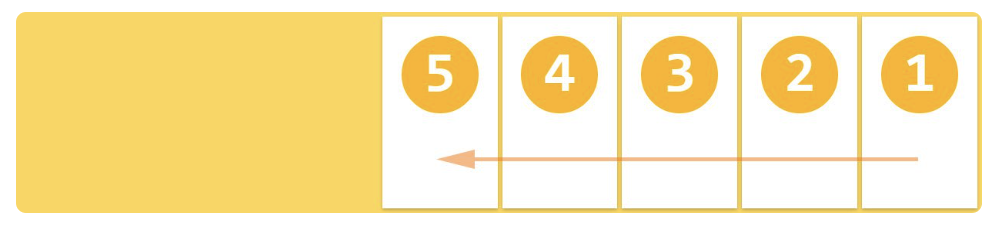

#### flex-direction : column;
- 위에서 아래로 수직 배치된다.

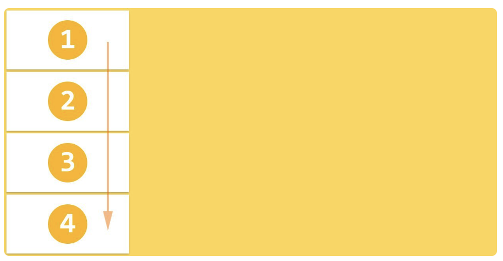
#### flex-direction : column-reverse;
- 아래서 위로 수직 배치된다.

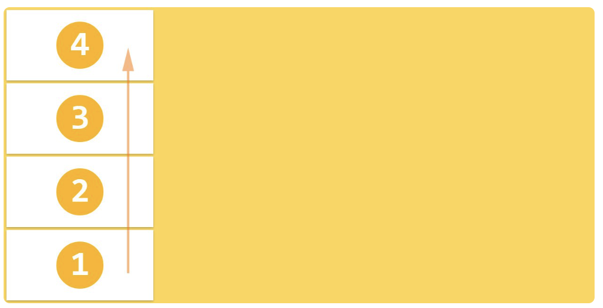

```html
<!DOCTYPE html>
<html lang="en">
<head>
    <meta charset="UTF-8">
    <meta name="viewport" content="width=device-width, initial-scale=1.0">
    <title>Document</title>
    <style>
        /*나중에 추가하기*/
        section{
            display : flex;
            border : 1px dashed black;
        }

        div{
            width:60px; height : 60px;
            text-align : center;
            font-size : 2rem;
            color : white;
            border : 2px solid black;
            margin : 10px;
        }

        div:nth-child(1){
            background : yellowgreen;
        }

        div:nth-child(2){
            background : violet;
        }

        div:nth-child(3){
            background: cornflowerblue;
        }

        .row{
            flex-direction: row;
        }
        .rowReverse{
            flex-direction: row-reverse;
        }
        .column{
            flex-direction: column;
        }
        .columnReverse{
            flex-direction: column-reverse;
        }
    </style>
</head>
<body>
    <h3>row</h3>
    <section class="row">
        <div>01</div>
        <div>02</div>
        <div>03</div>
    </section>
    <h3>row-reverse</h3>
    <section class="rowReverse">
        <div>01</div>
        <div>02</div>
        <div>03</div>
    </section>
    <h3>column</h3>
    <section class="column">
        <div>01</div>
        <div>02</div>
        <div>03</div>
    </section>
    <h3>column-reverse</h3>
    <section class="columnReverse">
        <div>01</div>
        <div>02</div>
        <div>03</div>
    </section>
</body>
</html>
```

### flex-wrap
- flex 컨테이너의 복수 flex item을 1행으로 또는 복수행으로 배치한다.
- flex는 기본적으로 1차원 형태이다.
- flex 컨테이너의 width보다 flex item들의 width의 합계가 더 큰 경우, 한줄로 표현할 것인지, 여러줄로 표현할 것인지를 지정한다.

#### flex-wrap : nowrap;
- item을 개행하지 않고 1행에 배치한다.
- 각 item의 폭은 container에 들어갈 수 있는 크기로 축소된다.

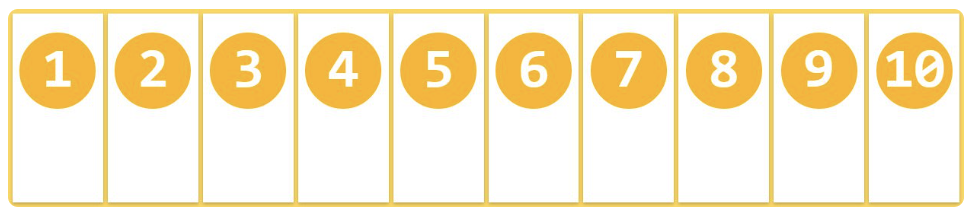

#### flex-wrap : wrap;
- item들의 width합계가 flex 컨테이너의 width보다 큰 경우, item을 복수행에 배치한다.
- 기본적으로 좌에서 우로, 위에서 아래로 배치된다.


#### flex-wrap : wrap-reverse;
- wrap과 동일하나 아래에서 위로 배치된다.

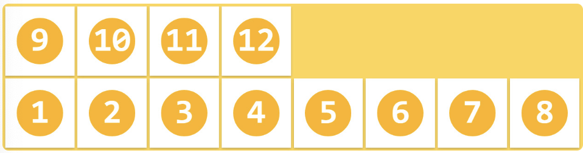


```html
<!DOCTYPE html>
<html lang="en">
<head>
    <meta charset="UTF-8">
    <meta name="viewport" content="width=device-width, initial-scale=1.0">
    <title>Document</title>
    <style>
         section{
            display : flex;
            border : 1px dashed black;
        }

        div{
            width:500px; height : 100px;
            text-align : center;
            font-size : 20px;
            color : white;
            border : 2px solid black;
            margin : 10px;
        }

        div:nth-child(1){
            background : yellowgreen;
        }

        div:nth-child(2){
            background : violet;
        }

        div:nth-child(3){
            background: cornflowerblue;
        }
        div:nth-child(4){
            background : tomato;
        }

        div:nth-child(5){
            background : tan;
        }

        div:nth-child(6){
            background: orange;
        }

        .nowrap{
            flex-wrap : nowrap;
        }

        .wrap{
            flex-wrap : wrap;
        }

        .wrapReverse{
            flex-wrap : wrap-reverse;
        }
    </style>
</head>
<body>
    <h1>nowrap</h1>
    <section class="nowrap">
        <div>01</div>
        <div>02</div>
        <div>03</div>
        <div>04</div>
        <div>05</div>
        <div>06</div>
    </section>

    <h1>wrap</h1>
    <section class="wrap">
        <div>01</div>
        <div>02</div>
        <div>03</div>
        <div>04</div>
        <div>05</div>
        <div>06</div>
    </section>

    <h1>wrap-reverse</h1>
    <section class="wrapReverse">
        <div>01</div>
        <div>02</div>
        <div>03</div>
        <div>04</div>
        <div>05</div>
        <div>06</div>
    </section>
</body>
</html>
```

### flex-flow
- direction과 wrap속성을 설정하기 위한 shorth and이다.

```css
/* flex-flow : direction속성  wrap속성*/
flex-flow : row-reverse wrap;
```


### justify-content
- container의 main axis를 기준으로 item을 수평 정렬한다.

#### justify-content : flex-start;
- 좌측을 기준으로 정렬한다. (기본값)


#### justify-content : flex-end;
- 우측을 기준으로 정렬한다.
- flex-direction:row-reverse와 다른점은 1,2,3,4,5 순서는 그대로인점

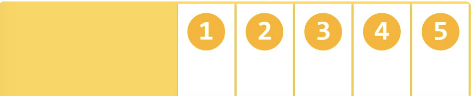

#### justify-content : center;
- 중앙에 정렬한다.


#### justify-content : space-between;
- 첫번째와 마지막 item은 끝에 정렬되고 나머지는 균등한 간격으로 정렬된다.


#### justify-content : sapce-around;
- 모든 item은 균등한 간격으로 정렬된다.

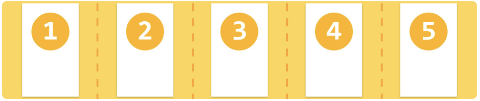;

```html
<!DOCTYPE html>
<html lang="en">
<head>
    <meta charset="UTF-8">
    <meta name="viewport" content="width=device-width, initial-scale=1.0">
    <title>Document</title>
    <style>
        section{ display : flex;}
        div{width : 50px; height : 50px;
        margin : 10px;
        color : white;
        text-align : center;}

        .a{
            background : red;
        }
        .b{
            background : yellow;
        }
        .c{
            background : blue;
        }
        .d{
            background : green;
        }
        .e{
            background : violet;
        }

        .flex-start{
            justify-content: flex-start;
        }
        .center{
            justify-content: center;
        }
        .flex-end{
            justify-content: flex-end;
        }

        .space-between{
            justify-content: space-between;
        }

        .space-around{
            justify-content: space-around;
        }
    </style>
</head>
<body>
    <h1>justify-content와 align-items</h1>
    <hr>
    <p>flex-start</p>
    <section class="flex-start">
        <div class="a">a</div>
        <div class="b">b</div>
        <div class="c">c</div>
        <div class="d">d</div>
        <div class="e">e</div>
    </section>
    <p>flex-end</p>
    <section class="flex-end">
        <div class="a">a</div>
        <div class="b">b</div>
        <div class="c">c</div>
        <div class="d">d</div>
        <div class="e">e</div>
    </section>
    <p>center</p>
    <section class="center">
        <div class="a">a</div>
        <div class="b">b</div>
        <div class="c">c</div>
        <div class="d">d</div>
        <div class="e">e</div>
    </section>
    <p>space-between</p>
    <section class="space-between">
        <div class="a">a</div>
        <div class="b">b</div>
        <div class="c">c</div>
        <div class="d">d</div>
        <div class="e">e</div>
    </section>
    <p>space-around</p>
    <section class="space-around">
        <div class="a">a</div>
        <div class="b">b</div>
        <div class="c">c</div>
        <div class="d">d</div>
        <div class="e">e</div>
    </section>
</body>
</html>
```


### align-content
- cross-axis를 기준으로 item을 수직정렬한다.

#### align-content : stretch;
- 모든 item은 두번째 줄 부터 균등하게 분배된 공간에 정렬된다.

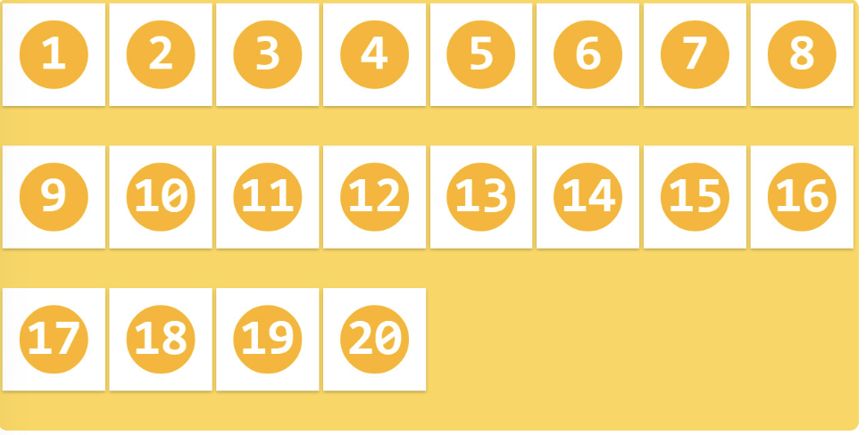

#### align-content : flex-start;
- 모든 item은 flex container의 cross start 기준으로 stack 정렬된다.


#### align-content : flex-end;
- 모든 item은 container의 cross end 기준으로 stack 정렬된다.

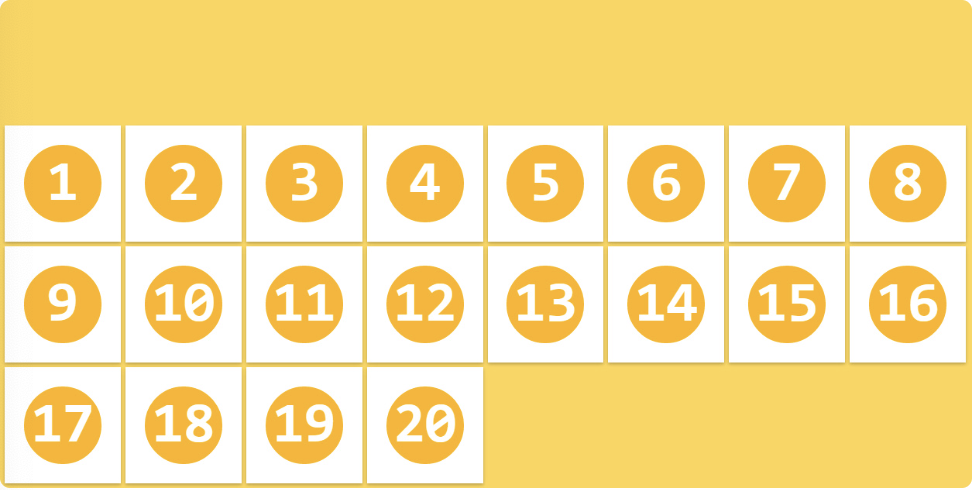

#### align-content : center;
- 모든 item은 container의 cross axis의 중앙에 stack 정렬된다.

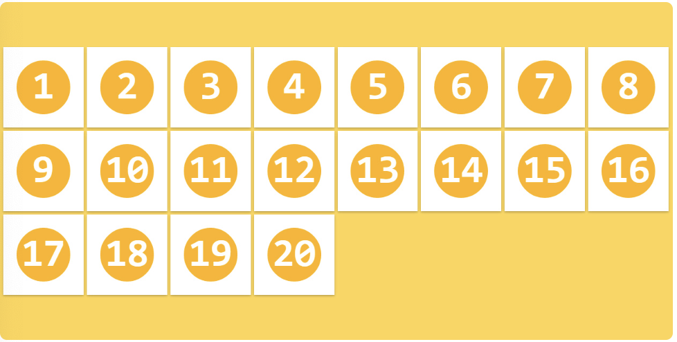

#### align-content : space-between;
- 첫번째 행은 상단에 마지막 행은 바닥에 배치되며, 나머지 행은 균등 분할된 공간에 배치 정렬된다.


#### align-content : space-around;
- 모든 item은 균등 분할된 공간 내에 배치 정렬된다.

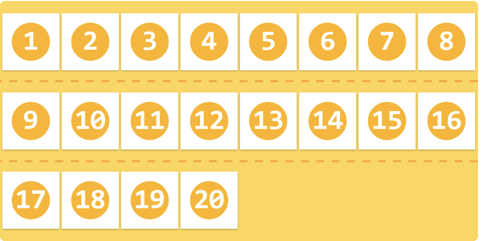

```html
<!DOCTYPE html>
<html lang="en">
<head>
    <meta charset="UTF-8">
    <meta name="viewport" content="width=device-width, initial-scale=1.0">
    <title>Document</title>
    <style>
        section{ display : flex;
        flex-wrap : wrap;
        border : 1px dashed #000;
        width : 100%; height : 300px;}

        div{
            width : 100px;
            color : white;
            text-align : center;
            font-size : 2rem;
            border : 2px solid black;
            margin : 10px;
        }

        .a{
            background : red;
        }
        .b{
            background : yellow;
            color : black;
        }
        .c{
            background : blue;  
        }
        .d{
            background : green;   
        }
        .e{
            background : violet;
        }

        .flex-start{
            align-content : flex-start
        }
        .center{
            align-content : center;
        }
        .flex-end{
           align-content : flex-end;
        }

        .stretch{
            align-content : stretch;
        }

        .space-between{
            align-content : space-between;
        }

        .space-around{
            align-content : space-around;
        }
    </style>
</head>
<body>
    <h1>align-items</h1>
    <hr>
    <p>stretch</p>
    <section class="stretch">
        <div class="a">a</div>
        <div class="b">b</div>
        <div class="c">c</div>
        <div class="d">d</div>
        <div class="e">e</div>
    </section>
    <p>flex-start</p>
    <section class="flex-start">
        <div class="a">a</div>
        <div class="b">b</div>
        <div class="c">c</div>
        <div class="d">d</div>
        <div class="e">e</div>
    </section>
    <p>center</p>
    <section class="center">
        <div class="a">a</div>
        <div class="b">b</div>
        <div class="c">c</div>
        <div class="d">d</div>
        <div class="e">e</div>
    </section>
    <p>flex-end</p>
    <section class="flex-end">
        <div class="a">a</div>
        <div class="b">b</div>
        <div class="c">c</div>
        <div class="d">d</div>
        <div class="e">e</div>
    </section>
    <p>space-between</p>
    <section class="space-between">
        <div class="a">a</div>
        <div class="b">b</div>
        <div class="c">c</div>
        <div class="d">d</div>
        <div class="e">e</div>
    </section>
    <p>space-around</p>
    <section class="space-around">
        <div class="a">a</div>
        <div class="b">b</div>
        <div class="c">c</div>
        <div class="d">d</div>
        <div class="e">e</div>
    </section>
</body>
</html>
```

### align-items
- item을 container의 수직방향으로 정렬한다.(한 줄일 경우)
- align-items 속성은 모든 item에 적용된다.

#### align-items : stretch;
- 모든 item은 container의 높이에 꽉찬 높이를 갖는다.

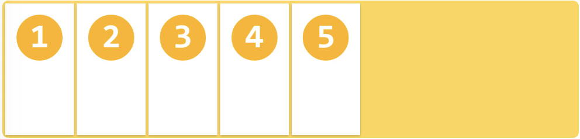

#### align-items : flex-start;
- 모든 item은 container의 cross start 기준으로 정렬된다.

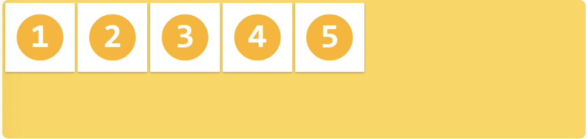

#### align-items : flex-end;
- 모든 itemdms container의 cross end기준으로 정렬된다.

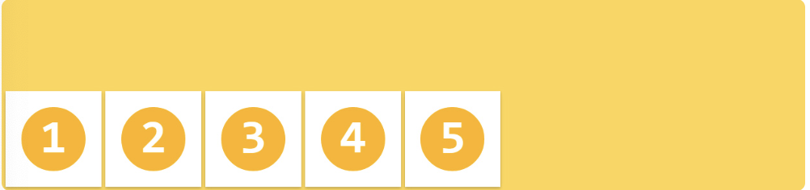

#### align-items : center;
- 모든 item은 container의 cross axis 중앙에 정렬된다.


```html
<!DOCTYPE html>
<html lang="en">
<head>
    <meta charset="UTF-8">
    <meta name="viewport" content="width=device-width, initial-scale=1.0">
    <title>Document</title>
    <style>
        section{ display : flex;}
        div{width : 100px;
        margin : 10px;
        color : white;
        text-align : center;}

        .a{
            background : red;
        }
        .b{
            background : yellow;
            color : black;
            font-size : 36px;
        }
        .c{
            background : blue;
            font-size : 90px;
        }
        .d{
            background : green;
            font-size : 50px;
        }
        .e{
            background : violet;
            font-size : 10px;
        }

        .flex-start{
            align-items : flex-start
        }
        .center{
            align-items : center;
        }
        .flex-end{
           align-items : flex-end;
        }

        .stretch{
            align-items : stretch;
        }

        .baseline{
            align-items : baseline;
        }
    </style>
</head>
<body>
    <h1>align-items</h1>
    <hr>
    <p>stretch</p>
    <section class="stretch">
        <div class="a">a</div>
        <div class="b">b</div>
        <div class="c">c</div>
        <div class="d">d</div>
        <div class="e">e</div>
    </section>
    <p>flex-start</p>
    <section class="flex-start">
        <div class="a">a</div>
        <div class="b">b</div>
        <div class="c">c</div>
        <div class="d">d</div>
        <div class="e">e</div>
    </section>
    <p>center</p>
    <section class="center">
        <div class="a">a</div>
        <div class="b">b</div>
        <div class="c">c</div>
        <div class="d">d</div>
        <div class="e">e</div>
    </section>
    <p>flex-end</p>
    <section class="flex-end">
        <div class="a">a</div>
        <div class="b">b</div>
        <div class="c">c</div>
        <div class="d">d</div>
        <div class="e">e</div>
    </section>
    <p>baseline</p>
    <section class="baseline">
        <div class="a">a</div>
        <div class="b">b</div>
        <div class="c">c</div>
        <div class="d">d</div>
        <div class="e">e</div>
    </section>
</body>
</html>
```

#### align-items : baseline;
- 모든 item은 container의 baseline을 기준으로 정렬된다.
- item 박스의 크기가 제각각 이라해도, 안의 텍스트를 기준으로 맞춘다.


### Flex Item 속성
|속성|의미|
|-----|-----|
|order|Flex Item의 순서를 결정|
|flex-grow|Flex Item의 증가 너비 비율을 설정|
|flex-shrink| Flex Items의 감소 너비 비율을 설정|
|flex-basis|Flex Item의 (공간 배분 전) 기본 너비 설정|
|flex|flex-grow, flex-shrink, flex-basis의 단축 속성|
|align-self|교차 축(cross-axis)에서 Item의 정렬 방법을 설정|


### order
- item의 배치 순서를 지정한다.
- HTML코드를 변경하지 않고 order속성값을 지정하는 것으로 간단히 재배치할 수 있다.
- 기본 배치 순서는 container에 추가된 순서이다. 기본값은 0이다.
```css
.flex-item{
	order : 정수값;
}
```
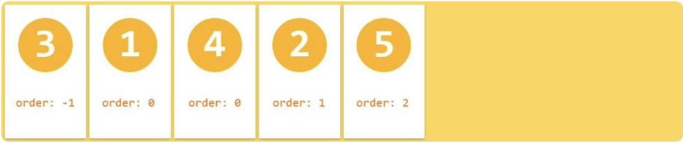

### flex-grow
- item의 너비에 대한 확대 인자를 지정한다.
- 기본값은 0이고 음수값은 무효하다.
- 모든 item이 동일한 grow 속성값을 가디면 모든 itemdms 동일한 너비를 갖는다.


 - 예를 들어 Item이 3개이고 총 너비가 400px, 증가 너비가 각각 1,2,1 이라면,
 - 첫번째 Item은 1, 두번째 Item 은 2, 세번째 Item은 1 비율의 너비를 갖는다.

```html
<!DOCTYPE html>
<html lang="en">
<head>
    <meta charset="UTF-8">
    <meta name="viewport" content="width=device-width, initial-scale=1.0">
    <title>Document</title>
    <style>
        @import url(css/flex_grow.css);
    </style>
</head>
<body>
    EDIT ON
<h1>flex-grow: </h1>

<div class="container container1">
  <div class="item">0</div>
  <div class="item">0</div>
  <div class="item">0</div>
  <div class="item">1</div>
</div>

<div class="container container2">
  <div class="item">1</div>
  <div class="item">3</div>
  <div class="item">1</div>
  <div class="item">0</div>
</div>

<div class="container container3">
  <div class="item">1</div>
  <div class="item">2</div>
  <div class="item">1</div>
  <div class="item">2</div>
</div>
</body>
</html>
```
### flex-shrink
- item의 너비에 대한 축소 인자를 지정한다.
- 기본값은 1이고 음수값은 무효하다.
- 0을 지정하면 축소가 해제되어 원래 너비를 유지한다.

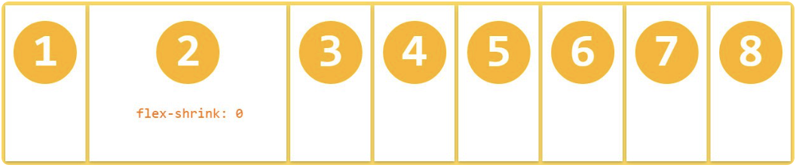

- 계산이 까다롭기 때문에 활용도는 조금 떨어진다. 개념정도만 이해하고 넘어가자.

### flex-basis
- item의 너비 기본값을 px, %등의 단위로 지정한다.
- 기본값은 auto이다.


### flex
- flex-grow, flex-shrink, flex-basis 속성의 단축버전이다.
- 기본값은 0, 1, auto이다.

### align-self
- item을 수직방향으로 정렬한다.
- align-item 속성보다 우선하여 개별 item을 정렬한다.
- 기본값은 auto이다.

```css
.flex-item {
  align-self: auto | flex-start | flex-end | center | baseline | stretch;
}
```
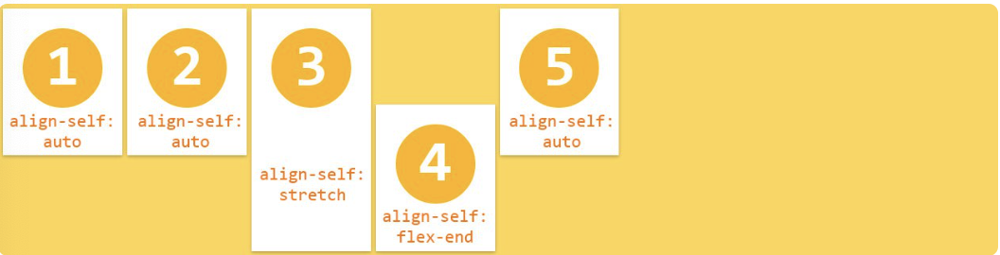

## Grid
- Grid가 나오기 이전에는 float이나 table,flex를 이용해 레이아웃을 구성했다.
- Grid는 핵(Hack)으로 불린 다양한 레이아웃 대체 방식들을 해결하기 위해 만들어진 특별한 CSS 모듈이다.

### Grid용어


#### 그리드 컨테이너
- display : grid로 표기하며 모든 item의 부모 요소이다.
- 컨테이너가 될 요소에게 grid를 주면 그때부터 자식 요소들은 item가 된다.

#### 그리드 아이템
- container의 자식 요소이다.

#### 그리드 라인
- 그리드를 구성하는 분할 선

#### 그리드 트랙
- 두 개의 그리드 라인 사이의 공간.
- 그리드의 열 또는 행으로 볼 수 있다.

#### 그리드 셀
- 그리드의 구성 단위

#### 그리드 영역
- 네 개의 그리드 라인으로 둘러싸인 공간.
- 몇 개의 그리드 셀로 구성된다.

#### 그리드 번호
- Grid라인의 각 번호

#### 그리드 갭
- Grid 셀 사이의 간격

### 그리드 형태의 정의
- grid-template-rows : 트랙 기준으로 크기와 갯수를 정한다.(행)
- grid-template-columns : 트랙 기준으로 크기와 갯수를 정한다.(열)

```html
<!DOCTYPE html>
<html lang="en">
<head>
    <meta charset="UTF-8">
    <meta name="viewport" content="width=device-width, initial-scale=1.0">
    <title>Document</title>
    <style>
        .wrapper{
            display: grid;
            grid-template-columns : 300px 50px 100px; /* 가로길이를 각각 300 50 100 3개로 나눈다. */
	        grid-template-rows : 200px 50px; /* 세로 길이를 200 50 으로 두개로 나눈다. */
			/*repeat() 함수 : repeat(횟수,크기)*/

			/*grid-template-columns: repeat(9, 100px);*/
			/* grid-template-columns: 100px 100px 100px 100px 100px 100px 100px 100px 100px; */

			/*grid-template-columns: repeat(2, 100px 200px 50px);*/
			/* grid-template-columns: 100px 200px 50px 100px 200px 50px; */

			/*minmax 함수*/
			/*grid-template-rows: repeat(3, minmax(100px, auto));
			최소한 100px, 내용이 많아 100px이 넘어가면 알아서 늘어나도록 처리해준다.*/

			/*auto-fill, auto-fit
			column의 개수를 미리 정하지 않고 설정된 너비가 허용하는 한 최대한 셀을 채운다.
			grid-template-columns: repeat(auto-fill, minmax(20%, auto));*/


        }

        div:nth-child(1){
            background: yellowgreen;
        }
        div:nth-child(2){
            background: lightpink;
        }
        div:nth-child(3){
            background: lightsalmon;
        }
        div:nth-child(4){
            background: lightskyblue;
        }
        div:nth-child(5){
            background: tan;
        }
        div:nth-child(6){
            background: peru;
        }

    </style>
</head>
<body>
    <section class="wrapper">
        <div>1</div>
        <div>2</div>
        <div>3</div>
        <div>4</div>
        <div>5</div>
        <div>6</div>
    </section>
</body>
</html>
```
### grid-area
```html
<!DOCTYPE html>
<html lang="en">
<head>
    <meta charset="UTF-8">
    <meta name="viewport" content="width=device-width, initial-scale=1.0">
    <title>Document</title>
    <style>
        
        .wrapper {
            display: grid;
            grid-template-columns: 1fr 4fr 4fr 1fr;
            grid-template-rows: 50px 100px 100px 30px;
            grid-template-areas:
            "header header header header"
            "leftCol midTop midTop rightCol"
            "leftCol midBottom midBottom rightCol"
            "footer footer footer footer";
            grid-gap: 5px;
        }

        .header{
        grid-area: header;
        background-color: LightSeaGreen ;
        }
    
        .leftCol{
        grid-area: leftCol;
        background-color: orange;
        }
        
        .rightCol{
        grid-area: rightCol;
        background-color: lightblue;
        }
        
        .midTop{
        grid-area: midTop;
        background-color: lightgrey;
        }
        
        .midBottom{
        grid-area: midBottom;
        background-color: pink;
        }
        
        .footer{
        grid-area: footer;
        background-color: lightgreen;
        }
    </style>
</head>
<body>
    <div class="wrapper">
        <div class="header">Header</div>
        <div class="leftCol">LeftCol</div>
        <div class="rightCol">RightCol</div>
        <div class="midTop">midTop</div>
        <div class="midBottom">midBottom</div>
        <div class="footer">Footer</div>
      </div>
</body>
</html>
```

## position
- static : 기본적인 위치 지정 방식, 문서의 기본적인 흐름을 따른다.
	- 모든 태그들은 처음에 position : static 상태이다.
	- left, top, right, bottom값이 적용되지 않는다.
	- 찰계대로 왼쪽에서 오른쪽, 위에서 아래로 쌓인다.

- relative : static과 유사하나 원래 위치에서 주어진 값만큼 이동한다.
	- top,right,bottom,left 속성을 사용해 위치 조절이 가능하다.
	- Relative 속성에서 top:5px을 주면 아래로 5px을 이동한다.

- absolute : 기본 흐름을 따르지 않고 부모 요소의 상대적위치로 지정된다.
	- 부모 요소의 포지션이 relative, absolute, fixed인 태그가 있다면 부모 요소의 기준으로 움직인다.
	- 부모 요소의 포지션이 static이라면 body태그를 기준으로 배치된다.
	- 부모요소가 없다면 포지션 문서의 body를 기준으로 배치된다.

- fixed : fixed 포지션은 화면의 스크롤이나 움직임에 관계 없이 화면의 특정 부분에 고정되는 포지션이다.
```html
<!DOCTYPE html>
<html lang="en">
<head>
    <meta charset="UTF-8">
    <meta name="viewport" content="width=device-width, initial-scale=1.0">
    <title>Document</title>
    <style>
        #header{
            display:flex;
            justify-content: center;
            border: 2px solid black;
            width: 1000px;
            margin: 10px auto;
        }

        .menu1{
            display:flex;
            justify-content: flex-end;
        }

        li{
            list-style: none;
          
        }

        .menu2{
            display: flex;
            justify-content: flex-end;
        }

        p{
            margin-left: 10px;
        }

    </style>
</head>
<body>
    <div id="header">
        <p class="logo">
            
        </p>

        <div class="menu_container">
            <ul class = "menu1">
                <li></li>
                <li></li>
                <li></li>
                <li></li>
                <li></li>
                <li></li>
                <li></li>
                <li></li>
                <li></li>
            </ul>

            <ul class="menu2">
                <li></li>
                <li></li>
                <li></li>
                <li></li>
                <li></li>
                <li></li>
                <li></li>
            </ul>
        </div>

        <p></p>
    </div>
</body>
</html>
```


## CSS응용 드롭다운 메뉴 만들어보기
```html
<!DOCTYPE html>
<html lang="ko">
<head>
  <meta charset="UTF-8">
  <title>Flex Menu Example</title>
  <style>
    /* 전체 메뉴를 감싸는 컨테이너 */
    #a1 {
      margin: 10px;
    }

    /* 메인 메뉴(상위 ul)를 Flex 컨테이너로 설정 */
    #menu {
      display: flex;
      list-style: none;
      margin: 0;
      padding: 0;
    }

    /* 상위 메뉴 항목(li) 스타일 */
    #menu > li {
      position: relative; /* 서브 메뉴(.depth_1)의 절대 위치 기준 */
      border-top: 1px solid gray;
      border-bottom: 1px solid gray;
      border-right: 1px solid gray;
    }
    /* 첫 번째 항목에만 왼쪽 테두리 추가 */
    #menu > li:first-child {
      border-left: 1px solid gray;
    }

    /* 상위 메뉴 링크 스타일 */
    #menu > li > a {
      display: block;
      padding: 2px 10px;
      color: blue;
      text-decoration: none;
    }
    /* 상위 메뉴 호버 시 배경/글자색 변경 */
    #menu > li > a:hover {
      background: #999;
      color: #fff;
    }

    /* 서브 메뉴 초기 상태: 숨김 */
    .depth_1 {
      display: none;           /* 처음에는 보이지 않도록 */
      position: absolute;
      top: 100%;               /* 부모 li 바로 아래에 표시 */
      left: 0;                 
      margin: 0;
      padding: 0;
      list-style: none;
      background: #fff;
      flex-direction: row;     /* 가로 나열을 위한 방향 설정 */
      white-space: nowrap;     /* 줄바꿈 없이 한 줄로 표시 */
      /* 
        주의: 여기서 display: flex;를 쓰면 처음부터 보이므로 
        기본값은 none;으로 두고, hover 시점에만 flex로 변경
      */
    }

    /* 상위 메뉴에 마우스를 올리면 서브 메뉴 표시 (가로 배치) */
    #menu > li:hover .depth_1 {
      display: flex;          /* hover 시점에만 flex로 변경 */
    }

    /* 서브 메뉴 li 스타일 */
    .depth_1 li {
      border-top: 1px solid gray;
      border-bottom: 1px solid gray;
      border-right: 1px solid gray;
    }
    /* 서브 메뉴 첫 번째 항목에 왼쪽 테두리 추가 */
    .depth_1 li:first-child {
      border-left: 1px solid gray;
    }

    /* 서브 메뉴 링크 스타일 */
    .depth_1 a {
      display: block;
      padding: 2px 10px;
      color: blue;
      text-decoration: none;
    }
    /* 서브 메뉴 호버 시 배경/글자색 변경 */
    .depth_1 a:hover {
      background: #999;
      color: #fff;
    }
  </style>
</head>
<body>
  <div id="a1">
    <ul id="menu">
      <li>
        <a href="#">HTML</a>
        <!-- 서브 메뉴 (기본적으로 숨김) -->
        <ul class="depth_1">
          <li><a href="#">메뉴1</a></li>
          <li><a href="#">메뉴2</a></li>
          <li><a href="#">메뉴3</a></li>
        </ul>
      </li>
      <li><a href="#">CSS</a></li>
      <li><a href="#">JavaScript</a></li>
      <li><a href="#">JQuery</a></li>
      <li><a href="#">Jsp</a></li>
    </ul>
  </div>
</body>
</html>

```


## 실습
### 1. 로그인 화면 만들어보기
```html
<!DOCTYPE html>
<html lang="ko">
<head>
  <meta charset="UTF-8">
  <meta name="viewport" content="width=device-width, initial-scale=1.0">
  <title>로그인 화면</title>
  <style>
    /* 전체 페이지 설정: 중앙 정렬 및 배경색 */
    body {
      margin: 0;
      padding: 0;
      font-family: Arial, sans-serif;
      background: #f2f2f2;
      display: flex;
      justify-content: center;
      align-items: center;
      height: 100vh;
    }
    
    /* 로그인 컨테이너 설정 */
    .login-container {
      background: #fff;
      padding: 40px;
      border-radius: 8px;
      /* 그림자 제거: box-shadow 속성 삭제 */
      width: 300px;
    }
    
    /* 타이틀 스타일 */
    .login-container h2 {
      text-align: center;
      margin-bottom: 20px;
    }
    
    /* 폼 내부 요소를 세로로 나열 */
    .login-container form {
      display: flex;
      flex-direction: column;
    }
    
    /* 레이블 스타일 */
    .login-container label {
      margin-bottom: 5px;
      font-weight: bold;
    }
    
    /* 입력 필드 스타일 */
    .login-container input {
      padding: 10px;
      margin-bottom: 15px;
      border: 1px solid #ccc;
      border-radius: 4px;
      font-size: 14px;
    }
    
    .login-container input:focus {
      outline: none;
      border-color: #3f29ef;
    }
    
    /* 로그인 버튼 스타일 */
    .login-container button {
      padding: 10px;
      background: #3f29ef;
      color: #fff;
      border: none;
      border-radius: 4px;
      font-size: 16px;
      cursor: pointer;
      /* 트랜지션 제거: transition 속성 삭제 */
    }
    
    .login-container button:hover {
      background: #2e1cb3;
    }
    
    /* 회원가입 링크 스타일 */
    .login-container .signup-link {
      margin-top: 10px;
      text-align: center;
      font-size: 14px;
    }
    
    .login-container .signup-link a {
      color: #3f29ef;
      text-decoration: none;
    }
  </style>
</head>
<body>
  <div class="login-container">
    <h2>로그인</h2>
    <form action="#" method="POST">
      <label for="username">아이디</label>
      <input type="text" id="username" name="username" placeholder="아이디 입력" required>
      
      <label for="password">비밀번호</label>
      <input type="password" id="password" name="password" placeholder="비밀번호 입력" required>
      
      <button type="submit">로그인</button>
    </form>
    <div class="signup-link">
      아직 회원이 아니신가요? <a href="#">회원가입</a>
    </div>
  </div>
</body>
</html>
```