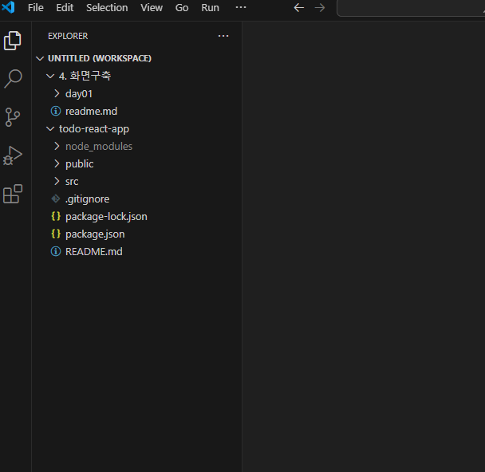

# 프론트엔드개발
- 사용자의 바로 앞에서 사용자와 상호작용하며 애플리케이션 로직을 수행하고 백엔드 서버로 요청을 전달하는 역할을 한다.
- 웹 서비스에서 클라이언트 또는 프론트엔드란 웹 브라우저를 뜻한다.
- 사용자는 자신의 컴퓨터로 브라우저를 실행하고, 브라우저는 인터넷을 이용해 서버에 있는 자원(HTML,JS,CSS)을 사용자의 컴퓨터로 다운로드 후, 브라우저에서 실행시킨다.

## 프론트엔드 개발 환경 설정
### 학습 내용
- 브라우저의 작동 원리
- Node.js
- SPA와 React.js

### 실습 내용
- 브라우저의 개발자 툴
- 프론트엔드 개발 환경 설정(VS Code)
- Node.js 설치
- Npm 실습
- 리액트 애플리케이션 생성 및 실행

## Node.js와 NPM 설치
### Node.js
- Node.js 전까지 자바스크립트는 브라우저 내에서만 실행이 가능했다.
- 자바스크립트를 실행하기 위해서는 브라우저상에서 HTML 렌더링의 일부로 실행하거나, 개발자 창의 자바스크립트 콘솔을 이용해 실행해야 했다.
- Node.js는 자바스크립트를 내 컴퓨터에서 실행할 수 있게 해주는 프로그램이다.

### 자바스크립트를 브라우저 밖에서 사용함으로서 얻는점
- 자바스크립트를 클라이언트 언어뿐만 아니라 서버 언어로도 사용할 수 있다는 뜻이다.
- 우리는 이 자바스크립트로 된 node 서버를 이용해 프론트엔드 서버를 개발한다.
- 우리의 프론트엔드 서버는 요청이 왔을 때, HTML,JS,CSS를 리턴한다.

### NPM(Node Package Manager)
- npm은 nodejs의 패키지 관리 시스템이다.
- 우리는 npm을 이용해 npmjs(https://www.npmjs.com)에서 node.js라이브러리를 설치한다.
- npm은 nodejs를 설치하면 함께 설치된다.
- https://nodejs.org/en/에서 nodejs를 다운로드 후 설치한다.
- 이 책에서 16.14.2 LTS를 다운로드 하여 사용한다.
- 되도록이면 같은 버전을 설치하는 것을 추천한다.

### npm version
- 설치 후 커맨트라인에서 npm version 명령어로 버전 정보를 확인한다.
- 각 버전 정보는 Node.js 버전에 따라 다를 수 있다.
```js
C:\Users\lis74>npm version
{
  npm: '10.5.0',
  node: '20.12.2',
  acorn: '8.11.3',
  ada: '2.7.6',
  ares: '1.27.0',
  base64: '0.5.2',
  brotli: '1.1.0',
  cjs_module_lexer: '1.2.2',
  cldr: '44.1',
  icu: '74.2',
  llhttp: '8.1.2',
  modules: '115',
  napi: '9',
  nghttp2: '1.60.0',
  nghttp3: '0.7.0',
  ngtcp2: '0.8.1',
  openssl: '3.0.13+quic',
  simdutf: '4.0.8',
  tz: '2024a',
  undici: '5.28.4',
  unicode: '15.1',
  uv: '1.46.0',
  uvwasi: '0.0.20',
  v8: '11.3.244.8-node.19',
  zlib: '1.3.0.1-motley-40e35a7'
}
```

## 프로젝트 초기화하기
- Node.js 프로젝트를 초기화 하기 위해서는 npm init을 사용한다.
- 우리는 npm이 아닌 npx라는 툴로 리액트 애플리케이션을 초기화 할것이다.
- npm으로 설치를 하면 설정을 해줘야 할 부분이 많다.

```js
leehj4206@DESKTOP-QBTAA2C MINGW64 /d/develop
$ mkdir test-project

leehj4206@DESKTOP-QBTAA2C MINGW64 /d/develop
$ cd test-project

leehj4206@DESKTOP-QBTAA2C MINGW64 /d/develop/test-project
$ npm init
This utility will walk you through creating a package.json file.
It only covers the most common items, and tries to guess sensible defaults.

See `npm help init` for definitive documentation on these fields
and exactly what they do.

Use `npm install <pkg>` afterwards to install a package and
save it as a dependency in the package.json file.

Press ^C at any time to quit.
package name: (test-project) //프로젝트 이름
version: (1.0.0) //프로젝트 버전
description: test-project //프로젝트 설명
entry point: (index.js) //시작파일
test command: //테스트를 실행할 명령어
git repository: //패키지의 소스 코드 저장소 URL
keywords: //패키지를 설명하는 키워드 리스트. 패키지 검색시 용이하다.
author: //패키지 작성자의 이름
license: (ISC) //패키지 라이센스의 유형
About to write to D:\develop\test-project\package.json:

{
  "name": "test-project",
  "version": "1.0.0",
  "description": "test-project",
  "main": "index.js",
  "scripts": {
    "test": "echo \"Error: no test specified\" && exit 1"
  },
  "author": "",
  "license": "ISC"
}


Is this OK? (yes) yes
```
- Node 프로젝트를 초기화하면 패키지 이름이나, 버전 등 기본적인 정보를 입력해야 한다.
- 모든 정보를 입력하면 마지막에 package.json이라는 파일을 만들어준다.
- package.json에 프로젝트의 메타데이터가 들어간다.

### npm install react
- npm을 이용하여 react를 설치한다.
```js
npm install react
```
- 그러면 해당 패키지는 node_modules 디렉토리 아래에 인스톨된다.
- package.json의 dependencies에 추가된 라이브러리는 이후 프로덕션의 배포에 사용된다.

### 비주얼 스튜디오 코드 설치
- 비주얼 스튜디오 코드를 자바스크립트 IDE로 사용한다.
- https://code.visualstudio.com/download에서 다운로드 받는다.

### 프론트엔드 애플리케이션 생성
- 원하는 디렉토리에 워크스페이스 디렉토리를 생성한다.

```js
mkdir react-workspace
```
- 생성한 디렉토리로 이동한다.
```js
cd react-workspace
```
- npx를 이용하여 리액트앱 생성하기
```js
npx create-react-app todo-react-app
```
- 오류 발생시 아래의 코드를 작성하고 다시 시도해보자
```js
npm uninstall -g create-react-app
npm install -g create-react-app
```

- 설치를 마치면 로그가 폴더의 이동을 제안한다.
```js

...

We suggest that you begin by typing:

  cd todo-react-app
  npm start

Happy hacking!

```

- 폴더를 이동하고 npm start을 이용해 애플리케이션을 실행해보자
```js
cd todo-react-app

npm start

Compiled successfully!

You can now view todo-react-app in the browser.

  Local:            http://localhost:3000
  On Your Network:  http://192.168.55.10:3000

Note that the development build is not optimized.
To create a production build, use npm run build.

webpack compiled successfully
```
- 로그는 브라우저에서 어떻게 애플리케이션을 실행해야 하는지 알려준다.
- todo-react-app은 3000포트에서 실행되고 http://localhost:3000 경로로 들어가면 애플리케이션을 확인할 수 있다.
- react.js는 애플리케이션을 실행하면 자동으로 브라우저를 실행시켜준다.


- 애플리케이션을 실행했다면 react.js의 기본 화면이 브라우저에 뜬다.
- 안뜬다면 http://localhost:3000에 접속해서 애플리케이션의 동작 여부를 확인해보자.

## vscode에서 개발 환경 설정
- 본격적인 개발을 위해 vscode에 Workspace를 만들어보자.
- File > Add folder to Workspace 선택하면 디렉토리를 고를 수 있다.
- todo-react-app을 선택한 후 add를 누른다.

### WorkSpace(작업영역)이란?
- vscode에서 작업하려는 폴더만 열 수 있게 해주는 파일이다.



- 프로젝트 이름 위에 UNTITLED(WORKSPACE)워크스페이스가 생성됐다.
- File > Save Workspace As..를 이용해 워크스페이스를 저장하도록 한다.
- 이 프로젝트에서는 todo-react-app-ws라고 저장했다.

### 리액트 애플리케이션을 설치하면 기본적으로 생성되는 파일들
- package.json
  - 프로젝트의 메타데이터, 사용할 node.js 패키지 목록 등을 포함한다.
  - package.json을 토대로 dependencies 패키지들은 node_modules안에 설치된다.
- package-lock.json
  - 어느 환경에서든 같은 버전의 패키지를 설치하기 위해 각 패키지가 사용할 버전을 고정해놓는다.
  - 보통 이 작업은 npm install 또는 create-react-app명령 시 자동으로 실행된다.

### 라이브러리 버전 맞추기
- package.json에서 dependencies의 버전이 책의 버전과 같도록 수정하자
```js
  "dependencies": {
    "@testing-library/jest-dom": "^5.16.4",
    "@testing-library/react": "^12.1.4",
    "@testing-library/user-event": "^13.5.0",
    "react": "^18.0.0",
    "react-dom": "^18.0.0",
    "react-scripts": "5.0.0",
    "web-vitals": "^2.1.4"
  }
```
- 리액트 애플리케이션이 실행 중이라면 애플리케이션을 종료하고 node_modules와 package-lock.json을 삭제한다.
```js
rm -rf node_modules
rm -rf package-lock.json

터미널에서 안되면 같은 경로로 git bash를 열어서 하면 잘된다.
```
- 삭제를 하는 이유는 package.json에 명시된 패키지의 새버전을 설치하기 위해서이다.
- node_modules에는 이미 설치된 패키지가 존재한다.
- package-lock.json은 패키지의 버전을 고정하기 위한 파일이다. 따라서 package-lock.json을 삭제하면 이 패키지는 다음 설치 시 새 버전을 받아 새 package-lock.json을 생성한다.
- node_modules를 삭제하면 다음 인스톨 시 모든 디펜던시를 다시 설치한다.
- 아래의 코드를 실행에 라이브러리를 설정한 버전으로 다시 받는다.
```js
npm install
```

```
후에 설치할 material-ui이 잘 안되는 경우가 있어서 최신 버전으로 놔둬도 될 거 같다.
```

## public 디렉토리 아래의 파일
### index.html 
- 리액트에서 HTML파일은 index.html 하나밖에 없다.
- 다른 페이지들은 react.js를 통해 생성하고, index.html에 있는 \<div id="root"\>\</div\> 안에 동적으로 렌더링 된다.

### favicon.ico
- 브라우저 탭에 표시되는 아이콘 파일입니다.
- 애플리케이션의 아이콘을 사용자 정의하려면 이 파일을 교체하면 됩니다.

### manifest.json
- 웹 애플리케이션의 메타데이터를 정의하는 파일입니다.
- 애플리케이션의 이름, 아이콘, 색상, 시작 URL 등을 설정할 수 있으며, PWA(Progressive Web App)로 만들기 위한 정보가 포함됩니다.
- 이 파일은 웹 애플리케이션을 홈 화면에 추가하거나 오프라인에서 작동하도록 하는 데 사용됩니다.

### robots.txt
- 웹 크롤러가 애플리케이션의 페이지를 어떻게 크롤링할지 제어하는 파일입니다.
- 검색 엔진 최적화(SEO)와 관련된 설정을 할 수 있습니다. 
- 예를 들어, 특정 페이지나 섹션이 검색 엔진에 의해 인덱싱되지 않도록 할 수 있습니다.

## src 디렉토리 아래의 파일
### index.js
- index.html과 함께 가장 처음으로 실행되는 자바스크립트 코드이다.
- 이 자바스크립트 코드가 리액트 컴포넌트를 root아래에 추가한다.
  
### App.js
- App.js는 기본으로 생성된 리액트 컴포넌트이다.

## material-ui 패키지 설치
- 프론트엔드 애플리케이션을 개발하기 위해 material-ui라는 UI 패키지를 사용할것이다.
- UI를 위한 컴포넌트나 CSS를 작성하지 않아도 된다.

```js
npm install @mui/material @emotion/react @emotion/styled @mui/icons-material
```
###  @mui/material
- Material-UI의 핵심 패키지로, 다양한 리액트 컴포넌트를 제공한다.
- Material Design의 스타일과 원칙을 따르는 UI 컴포넌트를 구현하여, 개발자가 빠르고 쉽게 일관된 디자인의 사용자 인터페이스를 구축할 수 있도록 돕는다.
- 주요 컴포넌트
  - 버튼, 카드, 텍스트 필드, 다이얼로그, 아이콘 버튼 등과 같은 기본 UI 구성 요소를 포함합니다.

### @emotion/react
- 스타일을 정의하고 컴포넌트에 적용할 수 있는 기능을 제공한다.
- Emotion은 CSS-in-JS 솔루션으로, JavaScript 코드 내에서 스타일을 작성하고 적용할 수 있게 해준다.
- 주요 기능
  - css 함수를 사용하여 스타일을 정의하고, styled 함수를 사용하여 스타일드 컴포넌트를 생성한다.

### @emotion/styled
- Emotion 라이브러리의 스타일드 컴포넌트 생성 패키지이다.
- 리액트의 styled-components와 유사하게, 이 패키지는 컴포넌트에 스타일을 적용하기 위해 styled 함수를 제공한다.

### @mui/icons-material
- Material Design 아이콘을 제공하는 패키지다.
- 이 패키지는 Material Design Guidelines에 따라 디자인된 다양한 아이콘들을 리액트 컴포넌트 형태로 제공한다.
- 주요 아이콘
  - 다양한 범주의 아이콘(예: 작업, 경고, 사용자 인터페이스 등)을 포함합니다.


## 브라우저 작동 원리
1. 브라우저의 주소창에 http://app.softwareengineer.com같은 웹 주소를 입력하면, 브라우저는 HTTP GET 요청을 서버로 전송한다. 보통 프론트엔드가 있는 웹서비스의 경우 HTML파일을 결과로 반환한다.
2. HTML을 받은 브라우저는 두 단계를 거쳐 텍스트로 된 HTML을 브라우저에 보여준다.
   1. 파싱 : 렌더링을 위한 전처리 단계이다. 파싱 단계에서 브라우저가 하는일은 크게 세가지가 있다.
      1. 브라우저는 HTML을 트리 자료구조의 형태인 DOM트리로 변환한다.
      2. image,css,script등 다운로드해야 하는 리소스를 다운로드한다. 특히 CSS의 경우 다운로드하고 CSSOM트리로 변환한다.
      3. 다운로드한 자바스크립트를 인터프리트,컴파일,파싱, 실행한다.
   2. 파싱을 마친 후 브라우저는 렌더링에 들어간다.
      1. DOM트리와 CSSOM트리를 합쳐 렌더트리를 만든다.
      2. 트리의 각 노드가 브라우저의 어디에 배치될지, 어떤 크기로 배치될지 레이아웃을 정한다.
      3. 브라우저의 스크린에 렌더트리의 각 노드를 그려준다.

# SPA(Single Page Application)
- 한번 웹 페이지를 로딩하면 유저가 임의로 새로고침을 하지 않는 이상 페이지를 새로 로딩하지 않는 애플리케이션을 의미한다.

# React 컴포넌트
- UI를 구성하는 기본적인 단위이다.
- 컴포넌트는 독립적이고 재사용가능한 UI 조각을 의미하며, 리액트 애플리케이션의 핵심 개념 중 하나이다.
- 컴포넌트는 함수형 또는 클래스형으로 정의할 수 있다.

## 컴포넌트의 특징
### UI 조각
- 컴포넌트는 사용자 인터페이스의 특정 부분을 정의한다.
- 버튼, 입력 필드, 카드, 다이얼로그와 같은 다양한 UI 요소를 컴포넌트로 만들 수 있다.
### 재사용성
- 컴포넌트는 재사용이 가능하여, 같은 코드를 여러 번 작성하지 않고도 동일한 UI 조각을 여러 곳에서 사용할 수 있다.
- 이는 코드 중복을 줄이고, 유지보수를 용이하게 한다.

### 독립성
- 컴포넌트는 독립적으로 동작할 수 있으며, 서로 독립적으로 업데이트된다.
- 이로 인해 애플리케이션의 복잡한 UI를 작은 조각으로 나누어 관리할 수 있다.

## 컴포넌트의 종류
### 1. 함수형 컴포넌트
#### 정의
- 함수형 컴포넌트는 단순한 자바스크립트 함수로, props를 매개변수로 받아 JSX를 반환한다.
#### 특징
- 간단하고, 리액트 훅(예: useState, useEffect)을 사용하여 상태 및 라이프사이클 메서드를 관리할 수 있다.

### 2. 클래스형 컴포넌트
#### 정의
- React.Component를 확장하여 정의하며, render 메서드를 통해 JSX를 반환한다.

#### 특징
- state와 라이프사이클 메서드를 사용하여 복잡한 컴포넌트를 관리할 수 있다.
- 하지만, 함수형 컴포넌트가 도입된 이후에는 함수형 컴포넌트가 더 많이 사용됩니다.

### 3. 컴포넌트의 구성요소
#### props(속성)
- 컴포넌트에 전달되는 데이터이다.
- 부모 컴포넌트에서 자식 컴포넌트로 데이터를 전달할 때 사용된다.
- props는 읽기 전용이며, 자식 컴포넌트에서 수정할 수 없습니다.

#### state(상태)
- 컴포넌트 내부에서 관리하는 데이터로, 컴포넌트의 동작이나 UI를 동적으로 변경할 수 있다.
- 상태는 컴포넌트 내에서 수정 가능하며, 상태가 변경되면 컴포넌트가 다시 렌더링됩니다.

#### render(메서드)
- 클래스형 컴포넌트에서 JSX를 반환하는 메서드이다.
- 함수형 컴포넌트에서는 함수의 반환값으로 JSX를 사용한다.

### App.js
- App.js를 보며 컴포넌트에 대해 분석을 해보자.
```js
import logo from './logo.svg';
import './App.css';

function App() {
  return (
    <div className="App">
      <header className="App-header">
        
        <p>
          Edit <code>src/App.js</code> and save to reload.
        </p>
        <a
          className="App-link"
          href="https://reactjs.org"
          target="_blank"
          rel="noopener noreferrer"
        >
          Learn React
        </a>
      </header>
    </div>
  );
}
//
export default App;

```

## JSX
- React에서 사용하는 문법으로, JavaScript코드 안에 HTML-like 구조를 작성할 수 있게 해준다.
- 리액트 컴포넌트를 작성할 때 매우 유용하며, 가독성을 높이고 코드를 간결하게 작성할 수 있다.
- JSX는 브라우저가 이해할 수 없는 문법이므로 Babel과 같은 도구를 통해 순수 JavaScript코드로 변환한다.

### 문법
- JSX는 HTML과 매우 유사한 문법을 사용한다.
- 컴포넌트의 UI구조를 정의할 때 HTML요소와 속성의 형태를 그대로 유지할 수 있다.
```JSX
const element = <h1>Hello, world!</h1>
```
- JSX 내에서는 JavaScript 표현식을 { }를 사용하여 삽입할 수 있다.
- 이를 통해 동적인 값을 표시하거나 계산된 결과를 렌더링 할 수 있다.
```jsx
const name = 'Jhon'
const element = <h1>Hello, {name}!</h1>;
```
- HTML 속성처럼 컴포넌트에 props를 전달할 수 있다.
- 문자열 값을 전달할 때는 큰따옴표로 묶는다.
- 숫자나 표현식의 경우 중괄호를 사용한다.

```jsx
function App() {
  return <Counter count={10} />;
}

//함수나 이벤트 핸들러를 속성으로 전달할 때는 중괄호({})를 사용합니다. 
//함수가 호출되는 시점에 따라 다양한 동작을 구현할 수 있다.
function App() {
  function handleClick() {
    alert('Button clicked!');
  }

  return <Button onClick={handleClick} />;
}

//객체를 속성으로 전달할 때는 중괄호({})를 사용하여 객체 리터럴을 전달합니다. 
//객체는 스타일을 적용하거나 복잡한 데이터를 전달할 때 유용합니다.
function App() {
  const boxStyle = {
    width: '100px',
    height: '100px',
    backgroundColor: 'lightblue',
    border: '1px solid black'
  };

  return <Box style={boxStyle} />;
}

// && 연산자를 이용한 조건부 렌더링
// 첫번째 피연산자의 결과가 true일 경우, <Component />가 렌더링됩니다.
function WelcomeMessage(props) {
  return (
    <div>
      {props.isLoggedIn && <p>Welcome back!</p>}
    </div>
  );
}

function App() {
  return <WelcomeMessage isLoggedIn={true} />;
}
```

## export
- 컴포넌트를 다른 파일에서 사용할 수 있도록 내보는데 사용된다.
- 리액트 애플리케이션에서 모듈화는 중요한 개념으로, 각 파일이 독립적으로 작성되고, 필요한 곳에서 불러와 재사용될 수 있게 해준다.

### 1. 기본 내보내기(Default Export)
- 기본 내보내기를 사용하면, 모듈에서 하나의 기본 값을 내보낼 수 있다.
- default 키워드를 사용하여 내보내며, 이 모듈을 가져올 때는 임의의 이름으로 가져올 수 있다.

```js
// Greeting.js
import React from 'react';

function Greeting(props) {
  return <h1>Hello, {props.name}!</h1>;
}

export default Greeting;

//이렇게 작성해도 된다.
export default function Greeting(props) {
  return <h1>Hello, {props.name}!</h1>;
}


// App.js
//기본 내보내기는 중괄호 없이 가져올 수 있다.
import Greeting from './Greeting';

function App() {
  return <Greeting name="John" />;
}

export default App;
```

### 2. 명명된 내보내기(Named Export)
- 명명된 내보내기를 사용하면, 모듈에서 여러 값을 내보낼 수 있다.
- 각 값은 고유한 이름을 가지며, 이를 가져올 때도 이름을 정확히 일치시켜야 한다.

```js
// Greeting.js
import React from 'react';

export function Greeting(props) {
  return <h1>Hello, {props.name}!</h1>;
}

export function Farewell(props) {
  return <h1>Goodbye, {props.name}!</h1>;
}

// App.js
//명명된 내보내기는 중괄호를 사용해야한다.
import { Greeting, Farewell } from './Greeting';

function App() {
  return (
    <div>
      <Greeting name="John" />
      <Farewell name="John" />
    </div>
  );
}

export default App;
```

### index.js의 App렌더링
```js
import React from 'react';//리액트를 사용하기 위해 import
import ReactDOM from 'react-dom/client';// 리액트 DOM을 사용하기 위해 import
import './index.css';// css import
import App from './App'; //App 컴포넌트 import
import reportWebVitals from './reportWebVitals';

//HTML 파일의 id="root"인 요소를 찾고, 이 요소를 리액트 루트로 설정한다.

//ReactDOM.createRoot는 새로운 리액트 18의 루트 API를 사용하여 이 DOM 요소에 리액트 컴포넌트를 렌더링한다.
const root = ReactDOM.createRoot(document.getElementById('root'));

//root.render(<React.StrictMode><App /></React.StrictMode>); : App 컴포넌트를 렌더링한다.
root.render(
  //React.StrictMode는 개발 모드에서만 활성화되는 도구로, 애플리케이션의 잠재적인 문제를 식별하고 경고를 제공하여 개발 중에 코드의 품질을 높이는 데 도움을 준다.
  <React.StrictMode>
    <App />
  </React.StrictMode>
);

reportWebVitals();
```
### 컴포넌트 사용하는법
1. import를 이용해 App컴포넌트를 불러온다.
2. <컴포넌트 이름 />을 이용해 컴포넌트를 사용한다.