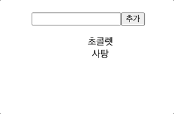
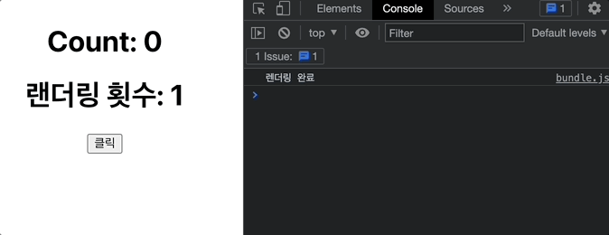

## 1. useState()를 사용하여 다음과 같은 결과가 출력되도록 해보시오.



- src에 Sol1.js 컴포넌트로 만든다.
### 풀이
```js
import React, {useState} from 'react';

function Sol1(){
    const [ eating, SetEating] = useState(['초콜릿','사탕'])
    const[value, SetValue] = useState("");

    const inputHandler = (e) => {
        SetValue(e.target.value)
    }

    const clickHandler = () => {
        SetEating(prev => [value, ...prev])
    }
    return (
        <div>
            <input onChange={inputHandler} type="text"/>
            <buttont onClick={clickHandler}>추가</buttont>
            <ul>
                {eating.map((item,idx) =>(
                    <li key={idx}>{item}</li>
                ))}
            </ul>
        </div>
    )
}

export default Sol1;
```

## 2. useEffect()를 이용하여 다음과 같은 결과를 출력하는 코드를 작성하세요.


```
<<조건>>
- '렌더링 완료' 최초 한번만 출력
- 버튼 클릭 시, 콘솔에 "count 값이 바뀜" 출력
- text 입력 시, 콘솔에 "input 값이 바뀜" 출력
```
- src에 Sol2.js 컴포넌트로 만든다.
### 풀이
```js
import React, {useEffect, useState} from 'react'

function Sol2(){
    const [count, setCount] = useState(0)
    const [text, setText] = useState("");

    const inputHandler = (e) => {
        console.log('input 값이 바뀜')
        setText(e.target.value)
    }

    const countHandler = () => {
        console.log("count값이 바뀜")
        setCount(count + 1)
    }

    useEffect(() => {
        console.log("렌더링 완료")
    },[])

    return(
        <div>
            <h3>{count}<h3>
            <button onClick={countHandler}> + 1 </button>
            <hr/>
            <input onChange={inputHandler} type="text"/>
            <h3>{text}</h3>
        <div>
    );
}

export default Sol2
```

## 3. useEffect()를 사용하여 렌더링 횟수를 출력하는 프로그램을 만들어보세요.



- src에 Sol3.js 컴포넌트로 만든다.
### 풀이
```js
import React, {useEffect, useState} from 'react'

function Sol2(){
    const [count, setCount] = useState(0)
    const [renderCount, setRenderCount] = useState(0);

    const clickHandler = () => {
        setCount(count + 1)
    }

    useEffect(() => {
        setRenderCount(renderCount + 1);
        console.log("렌더링 완료")
    },[count])

    return(
        <div>
            <h1>Count : {count}</h1>
            <h1>렌더링 횟수 : {renderCount}</h1>
            <button onClick={clickhandler}>클릭</button>
        <div>
    );
}

export default Sol3
```
