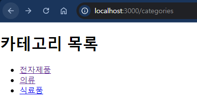
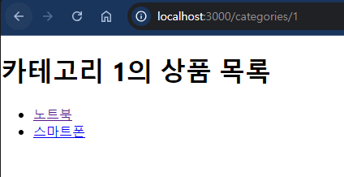
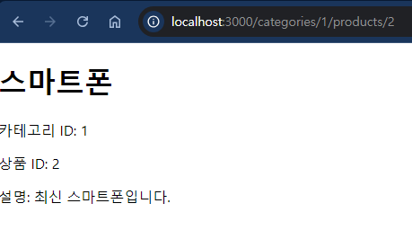

## 상품 카테고리와 상품 상세 페이지를 구현해보자.
- 카테고리별 상품들이 나오게 만들어보세요
```js
<<조건>>
- 카테고리 경로: /categories/:categoryId
- 상품 상세 경로: /categories/:categoryId/products/:productId
- App.js에 컴포넌트 라우트를 설정하세요
- 데이터는 다음을 사용합니다.

- 카테고리
const categories = [
{ id: 1, name: '전자제품' },
{ id: 2, name: '의류' },
{ id: 3, name: '식료품' },
];

- 카테고리별 상품
const products = [
{ id: 1, name: '노트북', categoryId: '1' },
{ id: 2, name: '스마트폰', categoryId: '1' },
{ id: 3, name: '셔츠', categoryId: '2' },
{ id: 4, name: '청바지', categoryId: '2' },
{ id: 5, name: '사과', categoryId: '3' },
{ id: 6, name: '우유', categoryId: '3' },
];

- 상품 상세 정보를 담은 배열
const p_detail = [
{ id: 1, name: '노트북', description: '최신형 노트북입니다.', categoryId: '1' },
{ id: 2, name: '스마트폰', description: '최신 스마트폰입니다.', categoryId: '1' },
{ id: 3, name: '셔츠', description: '멋진 셔츠입니다.', categoryId: '2' },
{ id: 4, name: '청바지', description: '편안한 청바지입니다.', categoryId: '2' },
{ id: 5, name: '사과', description: '신선한 사과입니다.', categoryId: '3' },
{ id: 6, name: '우유', description: '신선한 우유입니다.', categoryId: '3' },
];
```
### 결과 예
- 브라우저에서 /categories로 접속하면 카테고리 목록이 표시된다.


- 카테고리를 클릭하면 해당 카테고리의 상품 목록이 표시된다. 예: /categories/1


- 상품을 클릭하면 해당 상품의 상세 정보가 표시된다. 예: /categories/1/products/2




### 풀이
- App.js
```js
// App.js

import React from 'react';
import { Routes, Route } from 'react-router-dom';
import Categories from './Categories';
import Products from './Products';
import ProductDetail from './ProductDetail';

function App() {
  return (
    <Routes>
      <Route path="/categories" element={<Categories />} />
      <Route path="/categories/:categoryId" element={<Products />} />
      <Route path="/categories/:categoryId/products/:productId" element={<ProductDetail />} />
    </Routes>
  );
}

export default App;
```
- Categories.js
```js
// Categories.js

import React from 'react';
import { Link } from 'react-router-dom';

function Categories() {
  const categories = [
    { id: 1, name: '전자제품' },
    { id: 2, name: '의류' },
    { id: 3, name: '식료품' },
  ];

  return (
    <div>
      <h1>카테고리 목록</h1>
      <ul>
        {categories.map(category => (
          <li key={category.id}>
            <Link to={`/categories/${category.id}`}>{category.name}</Link>
          </li>
        ))}
      </ul>
    </div>
  );
}

export default Categories;
```
- Products.js
```js
// Products.js

import React from 'react';
import { useParams, Link } from 'react-router-dom';

function Products() {
  const { categoryId } = useParams();

  // 실제로는 서버에서 카테고리 ID에 따른 상품 목록을 가져와야 한다.
  // 여기서는 예시를 위해 하드코딩한다.
  const products = [
    { id: 1, name: '노트북', categoryId: '1' },
    { id: 2, name: '스마트폰', categoryId: '1' },
    { id: 3, name: '셔츠', categoryId: '2' },
    { id: 4, name: '청바지', categoryId: '2' },
    { id: 5, name: '사과', categoryId: '3' },
    { id: 6, name: '우유', categoryId: '3' },
  ];

  const filteredProducts = products.filter(product => product.categoryId === categoryId);

  return (
    <div>
      <h1>카테고리 {categoryId}의 상품 목록</h1>
      <ul>
        {filteredProducts.map(product => (
          <li key={product.id}>
            <Link to={`/categories/${categoryId}/products/${product.id}`}>{product.name}</Link>
          </li>
        ))}
      </ul>
    </div>
  );
}

export default Products;
```
- ProductDetail.js
```js
// ProductDetail.js

import React from 'react';
import { useParams } from 'react-router-dom';

function ProductDetail() {
  const { categoryId, productId } = useParams();

  // 상품 상세 정보를 담은 배열
  const p_detail = [
    { id: 1, name: '노트북', description: '최신형 노트북입니다.', categoryId: '1' },
    { id: 2, name: '스마트폰', description: '최신 스마트폰입니다.', categoryId: '1' },
    { id: 3, name: '셔츠', description: '멋진 셔츠입니다.', categoryId: '2' },
    { id: 4, name: '청바지', description: '편안한 청바지입니다.', categoryId: '2' },
    { id: 5, name: '사과', description: '신선한 사과입니다.', categoryId: '3' },
    { id: 6, name: '우유', description: '신선한 우유입니다.', categoryId: '3' },
  ];

  const product = p_detail.find(
    item => item.id === Number(productId) && item.categoryId === categoryId
  );

  if (!product) {
    return <div>상품을 찾을 수 없습니다.</div>;
  }

  return (
    <div>
      <h1>{product.name}</h1>
      <p>카테고리 ID: {categoryId}</p>
      <p>상품 ID: {productId}</p>
      <p>설명: {product.description}</p>
    </div>
  );
}

export default ProductDetail;
```


## URL 파라미터를 사용하여 다국어 지원을 위한 경로를 만들어보자.
- 경로 예시: /:lang/home
lang 파라미터로 언어 코드를 받아서 해당 언어에 맞는 내용을 보여준다.

### 결과 확인
```
- 브라우저에서 /ko/home으로 접속하면 한국어 페이지가 표시된다.
- /en/home으로 접속하면 영어 페이지가 표시된다.
- /jp/home으로 접속하면 일본어 페이지가 표시된다.
- 지원하지 않는 언어 코드로 접속하면 오류 메시지가 표시된다.
```

### 풀이
- index.js
```js
import React from 'react';
import ReactDOM from 'react-dom/client';
import './index.css';
import App from './App';
import reportWebVitals from './reportWebVitals';
import {BrowserRouter} from 'react-router-dom'

const root = ReactDOM.createRoot(document.getElementById('root'));
root.render(
  <BrowserRouter>
    <App />
  </BrowserRouter>
);

// If you want to start measuring performance in your app, pass a function
// to log results (for example: reportWebVitals(console.log))
// or send to an analytics endpoint. Learn more: https://bit.ly/CRA-vitals
reportWebVitals();
```
- App.js
```js

import React from 'react';
import { Routes, Route } from 'react-router-dom';
import Home from './Home';

function App() {
  return (
    <Routes>
      <Route path="/:lang/home" element={<Home />} />
    </Routes>
  );
}

export default App;
```
- Home.js
```js
import React from 'react';
import { useParams } from 'react-router-dom';

function Home() {
  const { lang } = useParams();

  const content = {
    ko: {
      greeting: '안녕하세요!',
      description: '이것은 한국어 페이지입니다.',
    },
    en: {
      greeting: 'Hello!',
      description: 'This is an English page.',
    },
    jp: {
      greeting: 'こんにちは！',
      description: 'これは日本語のページです。',
    },
  };

  const languageContent = content[lang];

  if (!languageContent) {
    return <div>지원하지 않는 언어입니다.</div>;
  }

  return (
    <div>
      <h1>{languageContent.greeting}</h1>
      <p>{languageContent.description}</p>
    </div>
  );
}

export default Home;
```