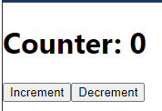

## Redux
- 상태 관리 라이브러리로, 애플리케이션의 전역 상태를 관리하는데 도움을 준다.
- 복잡한 리액트 애플리케이션에서는 여러 컴포넌트 간의 상태 공유가 어렵기 때문에, Redux를 사용하여 중앙 집중화된 스토어를 통해 상태를 효율적으로 관리할 수 있다.
- Redux는 주로 리액트와 함께 사용되지만, 다른 라이브러리나 프레임워크와도 함께 사용할 수 있다.

## Redux의 핵심 개념
### 스토어(Store)
- 애플리케이션의 전역 상태를 저장하는 곳이다.
- **createStore** 함수를 사용하여 스토어를 생성하고, 이 스토어는 애플리케이션 전반에서 상태를 유지하고 관리하는 역할을 한다.
### 액션(Action)
- 상태를 변경하기 위해 발생시키는 이벤트를 의미한다.
- 액션은 객체 형태로 { type: 'ACTION_TYPE', payload: 데이터 }의 구조를 가진다.
  - type 필드는 액션의 종류를 나타낸다.
  - payload는 해당 액션과 함께 전달할 추가 데이터를 나타낸다.
```jsx

```
### 리듀서(Reducer)
- 상태를 변경하는 순수 함수이다.
```js
※순수함수
주어진 입력만을 사용하여 결과를 도출하고, 함수 외부의 상태나 변수에 의존하지 않으며, 부작용(side effect)을 일으키지 않는 함수다.
동일한 입력값에 대해 항상 동일한 결과를 반환한다는 특징이 있어. 이를 통해 예측 가능한 동작과 함수의 테스트 용이성을 제공한다.

순수 함수의 주요 특징
동일한 입력에 대한 동일한 출력
- 입력 값이 같으면 항상 동일한 결과를 반환한다.

function add(a, b) {
  return a + b;
}

add(2, 3); // 항상 5를 반환

외부 상태에 의존하지 않음
- 함수는 함수 내부의 로컬 변수와 입력 값만 사용하며, 외부의 변수나 상태를 변경하거나 의존하지 않는다.

let externalValue = 10;

function multiply(a) {
  return a * 2;
}

multiply(5); // 외부 값인 externalValue와는 무관하게 작동

부작용이 없음
- 함수가 외부의 상태나 변수에 영향을 주지 않으며, 입력 값만 처리하고 반환한다.

let count = 0;

function increaseCount() {
  count++; // 전역 상태를 변경하는 부작용이 발생함 -> 순수 함수가 아님
}

```
- 현재 상태와 액션을 인자로 받아 새로운 상태를 반환한다.
- 이 과정에서 상태를 직접 수정하지 않고, 항상 새로운 상태 객체를 반환하는 것이 중요하다.
### 디스패치(Dispatch)
- 액션을 스토어에 전달하는 메서드이다.
- 컴포넌트에서 디스패치를 통해 액션을 발생시키고, 리듀서가 상태를 업데이트하도록 한다.

## Redux의 필요성
- Redux를 사용하면 상태를 중앙에서 관리하여 컴포넌트 간의 의존성을 줄이고, 상태 관리가 보다 예측 가능하고 유지보수하기 쉬워진다.

## Redux 동작 원리
### 1. 스토어 생성: 애플리케이션의 상태를 보관할 스토어를 생성한다.
### 2. 액션 디스패치: 사용자 인터랙션이나 기타 이벤트에 따라 액션을 디스패치한다.
### 3. 리듀서 호출: 디스패치된 액션을 리듀서가 받아 새로운 상태를 계산한다.
### 4. 상태 업데이트: 스토어의 상태가 업데이트되고, 이를 구독하고 있는 컴포넌트들이 리렌더링된다.

## Context API vs Redux
### Redux를 선택할 때
- 애플리케이션의 상태 관리가 복잡하거나 규모가 큰 경우
- 상태 변경 로직을 명확하게 분리하고 싶을 때
- 강력한 디버깅 도구와 미들웨어를 활용하고 싶을 때

### Context API를 선택할 때
- 상태 관리가 비교적 간단하고 작은 규모의 프로젝트일 때
- 추가적인 라이브러리 설치 없이 빠르게 전역 상태를 관리하고 싶을 때
- 성능 최적화가 크게 필요하지 않은 경우

## Redux 설치
```js
npm install redux react-redux
```

### react-redux 패키지
- React 애플리케이션에서 Redux를 쉽게 사용할 수 있도록 돕는 바인딩 라이브러리이다.
```
※ 바인딩 라이브러리
두 개 이상의 시스템이나 라이브러리 간의 연결을 원활하게 해주는 역할을 하는 소프트웨어이다.
서로 다른 기술이나 API를 사용하는 시스템이 함께 동작하도록 돕는 것
```
#### Provider 컴포넌트
- 애플리케이션 전체에 스토어를 제공한다.
- 최상위 컴포넌트를 감싸서 모든 자식 컴포넌트가 Redux 스토어에 접근할 수 있게 해준다.

#### userSelector
- Redux 스토어에서 상태를 선택하고 React 컴포넌트에서 사용할 수 있게 한다.
- useSelector를 사용하면 스토어의 특정 상태를 선택해서 가져올 수 있다.

#### useDispatch
- 액션을 디스패치하는 함수로, 컴포넌트에서 액션을 발생시켜 상태를 변경할 수 있게 한다.

## Redux 실습

### action.js
```jsx
// actions.js
// 액션(Action): 상태를 변경하는 이벤트

// 'INCREMENT'라는 타입의 액션을 반환하는 함수
export const increment = () => ({
  type: 'INCREMENT', // 액션의 타입을 'INCREMENT'로 정의. 
  // 이 액션은 리듀서에서 상태를 증가시키기 위한 신호로 사용됨
});

// 'DECREMENT'라는 타입의 액션을 반환하는 함수
export const decrement = () => ({
  type: 'DECREMENT', // 액션의 타입을 'DECREMENT'로 정의. 
  // 이 액션은 리듀서에서 상태를 감소시키기 위한 신호로 사용됨
});
```
- increment와 decrement 함수는 각각 액션 객체를 반환하는 함수이다.
- 이 함수들은 단순히 특정 **타입(type)**을 가진 객체를 반환하는데, 이 객체는 Redux 리듀서에서 상태를 변경하기 위한 신호로 사용된다.
- type은 Redux 리듀서가 상태를 어떻게 변경할지 결정하는 기준이 된다.
- 액션은 상태 변경을 트리거하기 위한 이벤트로, increment는 상태를 증가시키고 decrement는 상태를 감소시키는 역할을 한다는 점에서 중요한 이벤트로 사용된다.
### reducer.js
```jsx
// reducer.js
// 리듀서(Reducer): 액션에 따라 상태를 변경하는 순수 함수

// 초기 상태(initialState)를 정의함.
// count는 0으로 초기화됨.
const initialState = {
  count: 0,
};

// counterReducer는 현재 상태(state)와 액션(action)을 인자로 받아 새로운 상태를 반환하는 함수다.

// state가 undefined일 경우, initialState를 기본 값으로 사용함.
const counterReducer = (state = initialState, action) => {
  // 액션의 타입에 따라 상태를 변경하기 위한 switch문을 사용함.
  switch (action.type) {
    // 'INCREMENT' 액션일 경우, count 값을 1 증가시킨 새로운 상태를 반환함.
    case 'INCREMENT':
      return {
        ...state, // 기존 상태를 복사하고
        count: state.count + 1, // count 값을 1 증가시킴
      };
    
    // 'DECREMENT' 액션일 경우, count 값을 1 감소시킨 새로운 상태를 반환함.
    case 'DECREMENT':
      return {
        ...state, // 기존 상태를 복사하고
        count: state.count - 1, // count 값을 1 감소시킴
      };
    
    // 액션 타입이 매치되지 않을 경우, 현재 상태를 그대로 반환함.
    default:
      return state; // 상태 변경 없이 현재 상태를 반환함
  }
};

// counterReducer를 export하여 다른 파일에서 사용할 수 있게 함.
export default counterReducer;
```
#### 리듀서의 기본 구조
- reducer는 두 가지 인자를 가지는 함수이다.
1. 현재 상태(state)
    - 리듀서가 관리하는 현재 상태. 
    - 리듀서가 처음 호출될 때 초기 상태가 설정된다.
2. 액션(action)
    - 상태를 변경할 이벤트. 액션 객체는 최소한 type 속성을 가지며, 상태를 어떻게 변경할지 리듀서에게 알려준다.
#### 리듀서의 역할
- 액션의 타입에 따라 상태를 변경하고, 새로운 상태 객체를 반환해. 중요한 점은 상태를 직접 변경하는 것이 아니라, 새로운 상태 객체를 반환함으로써 **불변성(immutability)**을 유지한다는 것이다.
- 리듀서는 액션에 의해 트리거되며, 주어진 상태와 액션을 바탕으로 새로운 상태를 계산한다.
```js
※ ...state의 의미
스프레드 연산자는 객체의 모든 속성을 얕게 복사하는 역할을 한다.

const state = { count: 0, user: { name: 'John' } };

// 스프레드 연산자를 사용하여 기존 상태를 복사하고, count 값을 1 증가시킨 새로운 객체를 반환함
const newState = {
  ...state, // 기존 상태 { count: 0, user: { name: 'John' } }를 복사
  count: state.count + 1, // count 값을 0에서 1로 변경
};

console.log(newState); // { count: 1, user: { name: 'John' } }

상태 불변성 유지
Redux에서는 상태를 직접 변경하는 대신, 불변성을 유지하면서 새로운 상태 객체를 반환하는 것이 중요하다.
직접 상태를 변경하지 않고 새로운 객체를 반환함으로써, 과거 상태를 유지하고, 변경 사항을 추적할 수 있어.
```


### store.js
```jsx
// store.js


// 스토어(Store): 애플리케이션의 상태를 저장하는 객체
// Redux에서 스토어를 생성하기 위한 createStore 함수를 import 함
import { createStore } from 'redux';

// 리듀서(reducer)를 import 함. 
// 이 리듀서는 애플리케이션의 상태 변경 로직을 정의한 함수임
import counterReducer from './reducer';

// createStore 함수를 호출하여 스토어를 생성함
// counterReducer를 스토어에 인자로 전달하여 상태 변경 로직을 정의한다.
// 스토어는 애플리케이션 전체의 상태를 관리하고, 
// 액션이 발생하면 리듀서를 통해 상태를 업데이트함
const store = createStore(counterReducer);

// store 객체를 export하여 애플리케이션에서 사용할 수 있도록 함
export default store;
```

### App.js
```jsx
// App.js
import React from 'react';
// Redux와 React를 연결하는 데 필요한 Provider, useDispatch, useSelector를 가져옴
import { Provider, useDispatch, useSelector } from 'react-redux'; 

// Redux 스토어를 가져옴. 이 스토어는 전역 상태를 관리함
import store from './store'; 

// increment와 decrement 액션 생성 함수(action creator)를 가져옴. 
// 이 함수들은 상태를 변경하는 액션을 디스패치하기 위해 사용됨
import { increment, decrement } from './actions'; 

function Counter() {
  // useSelector: Redux 스토어에서 상태를 읽어오는 Hook
  // 스토어의 상태 중 count 값을 선택해서 가져옴
  const count = useSelector((state) => state.count);
  
  // useDispatch: Redux 스토어에 액션을 보낼 수 있는 Hook
  // 이 Hook을 사용해 액션을 디스패치할 수 있음
  const dispatch = useDispatch();

  return (
    <div>
      {/* 현재 상태인 count 값을 화면에 출력함 */}
      <h1>Counter: {count}</h1>
      
      {/* Increment 버튼을 클릭하면 increment 액션을 디스패치함 */}
      <button onClick={() => dispatch(increment())}>Increment</button>

      {/* Decrement 버튼을 클릭하면 decrement 액션을 디스패치함 */}
      <button onClick={() => dispatch(decrement())}>Decrement</button>
    </div>
  );
}

function App() {
  return (
    {/* Provider: Redux 스토어를 애플리케이션 전체에 제공함 */}
    {/* Provider 안에 있는 모든 컴포넌트는 Redux 스토어에 접근할 수 있음 */}
    <Provider store={store}> 
    {/* Counter 컴포넌트는 Redux 스토어에서 상태를 읽고, 액션을 디스패치할 수 있음 */}
      <Counter />   
    </Provider>
  );
}

export default App; 
```

## Redux의 실행 흐름
### 1. 컴포넌트 렌더링 및 상태 표시
- 애플리케이션이 처음 렌더링될 때, useSelector 훅을 통해 Redux 스토어에서 현재 상태(count)를 읽어오고, 이 값을 Counter 컴포넌트에서 화면에 표시한다.

```js
const count = useSelector((state) => state.count);
```

- 여기서 state.count는 Redux 스토어에서 관리하는 상태 객체의 일부이다.
- useSelector는 스토어에서 상태를 구독(subscribe)하고, 상태가 변경될 때마다 컴포넌트를 다시 렌더링한다.
- 이때 화면에는 현재 카운터의 값이 표시된다.



### 2. 사용자 입력에 따른 액션 디스패치
- 사용자가 Increment 또는 Decrement 버튼을 클릭하면, 해당 버튼의 onClick 핸들러가 실행된다. 
- 이 핸들러는 useDispatch를 통해 가져온 디스패치 함수를 사용하여 Redux 스토어에 액션을 전달한다.
```html
<button onClick={() => dispatch(increment())}>Increment</button>
```
- 예를 들어, Increment 버튼을 클릭하면 dispatch(increment())가 호출된다.
여기서 increment()는 { type: 'INCREMENT' }라는 액션 객체를 반환하고, 이 객체는 스토어로 전달된다.
- 디스패치(dispatch)는 액션을 Redux 스토어에 전달하는 함수이다.
- 이 함수는 Redux 내부적으로 리듀서가 액션을 처리하도록 호출해서 실행시킨다

### 3. 리듀서가 액션을 처리
- 디스패치된 액션은 리듀서로 전달되고, 리듀서는 현재 상태와 전달된 액션을 바탕으로 새로운 상태를 반환하게 된다.

```js
function counterReducer(state = initialState, action) {
  switch (action.type) {
    case 'INCREMENT':
      return { ...state, count: state.count + 1 };
    case 'DECREMENT':
      return { ...state, count: state.count - 1 };
    default:
      return state;
  }
}
```
- 리듀서는 액션의 type을 확인하고, 해당 타입에 맞춰 상태를 업데이트하여 새로운 상태 객체를 반환한다. 
- 여기서 중요한 것은, 상태를 직접 수정하지 않고 불변성을 유지하며 새로운 객체를 반환한다는 점이다.

### 4. 상태 업데이트 및 컴포넌트 리렌더링
- 리듀서가 반환한 새로운 상태는 Redux 스토어에 저장되고, 그 상태가 변경되면 useSelector로 상태를 구독하고 있던 컴포넌트가 자동으로 다시 렌더링된다.
- 이렇게 새로운 상태가 컴포넌트로 전달되면서 화면이 업데이트되고, 변경된 count 값이 화면에 표시된다.
