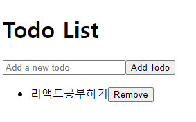
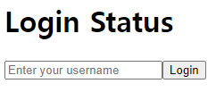
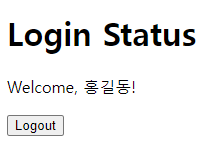
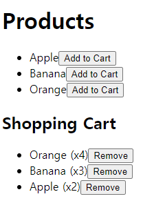

## 1. Todo 리스트 관리하기
- Redux를 사용하여 Todo 리스트를 관리하는 리듀서를 작성하라.
- 각 Todo 항목은 id와 text 속성을 가진 객체로 구성된다.
- 사용자는 새로운 Todo 항목을 추가할 수 있으며, 특정 Todo 항목을 삭제할 수 있어야 한다.
```
<<조건>>
1. ADD_TODO 액션으로 새로운 Todo 항목을 추가한다.
2. REMOVE_TODO 액션으로 특정 Todo 항목을 삭제한다.
3. 각 Todo 항목은 고유한 id를 가져야 한다.
4. App.js에서 UI를 다음과 같이 구성한다.
```


### actions.js
```jsx
// actions.js
export const addTodo = (id, text) => ({
    type: 'ADD_TODO',
    id,
    text,
  });
  
  export const removeTodo = (id) => ({
    type: 'REMOVE_TODO',
    id,
  });
  ```
  ### reducer.js
  ```jsx
  // reducer.js
const initialState = {
    todos: [],
  };
  
  function todoReducer(state = initialState, action) {
    switch (action.type) {
      case 'ADD_TODO':
        return {
          ...state,
          todos: [...state.todos, { id: action.id, text: action.text }],
        };
      case 'REMOVE_TODO':
        return {
          ...state,
          todos: state.todos.filter(todo => todo.id !== action.id),
        };
      default:
        return state;
    }
  }
  
  export default todoReducer;
  ```

  ### store.js
  ```jsx
  // store.js
import { createStore } from 'redux';
import todoReducer from './reducer';

const store = createStore(todoReducer);

export default store;
```
### App.js
```jsx
// App.js
import React, { useState } from 'react';
import { useDispatch, useSelector } from 'react-redux'; // Redux와 React 연결을 위한 Hook
import { addTodo, removeTodo } from './todo/actions'; // 액션 생성 함수 불러오기

function TodoApp() {
  const [input, setInput] = useState(''); // 입력값을 관리하는 로컬 상태
  const todos = useSelector((state) => state.todos); // Redux에서 todos 상태를 가져옴
  const dispatch = useDispatch(); // 액션을 디스패치하는 함수 가져오기

  const handleAddTodo = () => {
    if (input.trim()) {
      dispatch(addTodo(Date.now(), input)); // 새로운 Todo를 추가 (id는 현재 시간으로 고유값 생성)
      setInput(''); // 입력창 비우기
    }
  };

  const handleRemoveTodo = (id) => {
    dispatch(removeTodo(id)); // Todo를 삭제
  };

  return (
    <div>
      <h1>Todo List</h1>
      <input
        type="text"
        value={input}
        onChange={(e) => setInput(e.target.value)}
        placeholder="Add a new todo"
      />
      <button onClick={handleAddTodo}>Add Todo</button>

      <ul>
        {todos.map((todo) => (
          <li key={todo.id}>
            {todo.text} 
            <button onClick={() => handleRemoveTodo(todo.id)}>Remove</button>
          </li>
        ))}
      </ul>
    </div>
  );
}

export default TodoApp;
```

### index.js
```jsx
// index.js
import React from 'react';
import ReactDOM from 'react-dom';
import { Provider } from 'react-redux'; // Redux 스토어를 React 애플리케이션에 연결하기 위해 사용
import store from './todo/store'; // Redux 스토어 불러오기
import TodoApp from './App'; // TodoApp 컴포넌트 불러오기
import reportWebVitals from './reportWebVitals';

const root = ReactDOM.createRoot(document.getElementById('root'));
root.render(
  <Provider store={store}> 
    <TodoApp />
  </Provider>
);

// If you want to start measuring performance in your app, pass a function
// to log results (for example: reportWebVitals(console.log))
// or send to an analytics endpoint. Learn more: https://bit.ly/CRA-vitals
reportWebVitals();
```

## 2. 로그인 상태 관리하기
- Redux를 사용하여 로그인 상태를 관리하라.
- 사용자가 로그인하면 isLoggedIn 값을 true로 설정하고, 로그아웃하면 이를 false로 설정해야 한다. 
- 사용자의 이름은 useState에 저장하고, 로그아웃 시 이름을 빈 문자열로 초기화해야 한다.

```
<<조건>>
1. LOGIN 액션을 통해 사용자의 로그인 상태를 true로 설정하고, 사용자 이름을 저장한다.
2. LOGOUT 액션을 통해 로그아웃 상태를 false로 설정하고, 사용자 이름을 빈 문자열로 초기화한다.
```


### 로그인 전
- 사용자는 input 필드에 사용자명을 입력하고, Login 버튼을 눌러 로그인할 수 있다.
- 사용자명이 입력되고 로그인 버튼을 누르면 Redux 스토어에 로그인 상태가 저장되고, isLoggedIn: true로 설정된다.



### 로그인 후
- 사용자가 Logout 버튼을 누르면, isLoggedIn 상태가 false로 바뀌며 다시 로그인 화면이 나타난다.
### actions.js
```jsx
// actions.js
export const login = (username) => ({
  type: 'LOGIN',
  username,
});

export const logout = () => ({
  type: 'LOGOUT',
});
```

### reducer.js
```jsx
// reducer.js
const initialState = {
  isLoggedIn: false,
  username: '',
};

function authReducer(state = initialState, action) {
  switch (action.type) {
    case 'LOGIN':
      return {
        ...state,
        isLoggedIn: true,
        username: action.username,
      };
    case 'LOGOUT':
      return {
        ...state,
        isLoggedIn: false,
        username: '',
      };
    default:
      return state;
  }
}

export default authReducer;
```
### store.js
```jsx
// store.js
import { createStore } from 'redux';
import authReducer from './reducer';

const store = createStore(authReducer);

export default store;
```

### App.js
```jsx
// App.js
import React, { useState } from 'react';
import { useDispatch, useSelector } from 'react-redux'; // Redux 관련 훅을 불러옴
import { login, logout } from './actions'; // 액션 생성 함수 불러오기

function AuthApp() {
  const [usernameInput, setUsernameInput] = useState(''); // 입력 필드 상태
  const { isLoggedIn, username } = useSelector((state) => state); // Redux 상태에서 로그인 정보 가져오기
  const dispatch = useDispatch(); // 액션을 디스패치하기 위한 훅

  const handleLogin = () => {
    if (usernameInput.trim()) {
      dispatch(login(usernameInput)); // 로그인 액션 디스패치
      setUsernameInput(''); // 입력 필드 초기화
    }
  };

  const handleLogout = () => {
    dispatch(logout()); // 로그아웃 액션 디스패치
  };

  return (
    <div>
      <h1>Login Status</h1>
      {isLoggedIn ? (
        <div>
          <p>Welcome, {username}!</p>
          <button onClick={handleLogout}>Logout</button>
        </div>
      ) : (
        <div>
          <input
            type="text"
            value={usernameInput}
            onChange={(e) => setUsernameInput(e.target.value)}
            placeholder="Enter your username"
          />
          <button onClick={handleLogin}>Login</button>
        </div>
      )}
    </div>
  );
}

export default AuthApp;
```

### index.js
```jsx
// index.js
import React from 'react';
import ReactDOM from 'react-dom';
import { Provider } from 'react-redux'; // Redux 스토어를 React 앱에 연결하기 위해 사용
import store from './store'; // Redux 스토어 불러오기
import AuthApp from './App'; // AuthApp 컴포넌트 불러오기

ReactDOM.render(
  <Provider store={store}> 
    <AuthApp />
  </Provider>,
  document.getElementById('root')
);
```

## 3. 쇼핑카트 관리하기
- Redux를 사용하여 쇼핑카트를 관리하라.
- 사용자는 제품을 쇼핑카트에 추가하거나, 쇼핑카트에서 제거할 수 있다.
- 각 제품은 id, name, quantity 속성을 가지며, 제품이 추가될 때마다 수량(quantity)이 증가해야 한다.
```js
<<조건>>
1. ADD_TO_CART 액션으로 제품을 쇼핑카트에 추가한다. 이미 카트에 있는 제품일 경우 수량을 증가시킨다.
2. REMOVE_FROM_CART 액션으로 특정 제품을 카트에서 제거한다.

//제품 데이터
const products = [
    { id: 1, name: 'Apple' },
    { id: 2, name: 'Banana' },
    { id: 3, name: 'Orange' },
];
```


### 상품 목록
- 사용자는 애플, 바나나, 오렌지와 같은 상품을 화면에서 볼 수 있다. 
- 각 상품 옆에는 "Add to Cart" 버튼이 있으며, 버튼을 클릭하면 해당 상품이 쇼핑카트에 추가된다.
### 쇼핑카트
- 쇼핑카트에는 추가된 상품과 해당 상품의 수량이 표시된다. 
- 같은 상품을 여러 번 추가하면 수량이 증가하며, 각 상품 옆에는 "Remove" 버튼이 있어 이를 클릭하면 해당 상품이 카트에서 제거된다.

### 빈 카트
- 카트가 비어 있을 경우 Your cart is empty라는 메시지가 표시된다.

### actions.js
```jsx
// actions.js
export const addToCart = (id, name) => ({
  type: 'ADD_TO_CART',
  id,
  name,
});

export const removeFromCart = (id) => ({
  type: 'REMOVE_FROM_CART',
  id,
});
```

### reducer.js
```jsx
// reducer.js
const initialState = {
  cart: [],
};

function cartReducer(state = initialState, action) {
  switch (action.type) {
    case 'ADD_TO_CART':
      const existingProduct = state.cart.find(item => item.id === action.id);
      if (existingProduct) {
        // 제품이 이미 카트에 있으면 수량 증가
        return {
          ...state,
          cart: state.cart.map(item =>
            item.id === action.id
              ? { ...item, quantity: item.quantity + 1 }
              : item
          ),
        };
      } else {
        // 제품이 없으면 새로 추가
        return {
          ...state,
          cart: [...state.cart, { id: action.id, name: action.name, quantity: 1 }],
        };
      }
    case 'REMOVE_FROM_CART':
      return {
        ...state,
        cart: state.cart.filter(item => item.id !== action.id),
      };
    default:
      return state;
  }
}

export default cartReducer;
```

### store.js
```jsx
// store.js
import { createStore } from 'redux';
import cartReducer from './reducer';

const store = createStore(cartReducer);

export default store;
```

### App.js
```jsx
// App.js
import React from 'react';
import { useDispatch, useSelector } from 'react-redux'; // Redux 관련 훅을 불러옴
import { addToCart, removeFromCart } from './actions'; // 액션 생성 함수 불러오기

function ShopApp() {
  const products = [
    { id: 1, name: 'Apple' },
    { id: 2, name: 'Banana' },
    { id: 3, name: 'Orange' },
  ]; // 상품 목록을 미리 정의
  const cart = useSelector((state) => state.cart); // Redux에서 쇼핑카트 상태를 가져옴
  const dispatch = useDispatch(); // 액션을 디스패치하기 위한 훅

  const handleAddToCart = (id, name) => {
    dispatch(addToCart(id, name)); // 제품을 카트에 추가
  };

  const handleRemoveFromCart = (id) => {
    dispatch(removeFromCart(id)); // 제품을 카트에서 제거
  };

  return (
    <div>
      <h1>Products</h1>
      <ul>
        {products.map(product => (
          <li key={product.id}>
            {product.name}
            <button onClick={() => handleAddToCart(product.id, product.name)}>
              Add to Cart
            </button>
          </li>
        ))}
      </ul>

      <h2>Shopping Cart</h2>
      {cart.length === 0 ? (
        <p>Your cart is empty</p>
      ) : (
        <ul>
          {cart.map(item => (
            <li key={item.id}>
              {item.name} (x{item.quantity})
              <button onClick={() => handleRemoveFromCart(item.id)}>
                Remove
              </button>
            </li>
          ))}
        </ul>
      )}
    </div>
  );
}

export default ShopApp;
```

### index.js
```jsx
// index.js
import React from 'react';
import ReactDOM from 'react-dom';
import { Provider } from 'react-redux'; // Redux 스토어를 React 앱에 연결하기 위해 사용
import store from './store'; // Redux 스토어 불러오기
import ShopApp from './App'; // ShopApp 컴포넌트 불러오기

ReactDOM.render(
  <Provider store={store}> 
    <ShopApp />
  </Provider>,
  document.getElementById('root')
);
```

