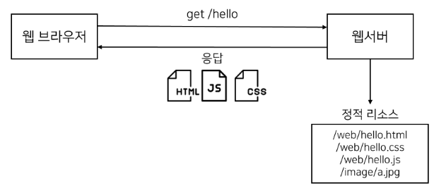

# 배경지식
- 프로젝트에 들어가기 앞서 반드시 알아야 하는 기술들이 몇가지 있다.
  
## HTTP(HyperText Transfer Protocol)
- 웹에서 클라이언트와 서버 간에 데이터를 주고받기 위한 프로토콜이다.
- 많은 웹 기반 애플리케이션이 HTTP를 이용하고, 우리 프로젝트도 HTTP로 서버와 클라이언트 간에 통신을 할 것이다.

### HyperText
- 다른 문서로 향하는 링크가 있는 텍스트
- 문서를 하이퍼텍스트로 만들기 위해서 HTML(HyperTextMarkupLanguage)를 사용한다.
### Transfer Protocol
- 통신을 하기 위한 규약이다.

## 웹 서비스에서 HTTP를 어떤식으로 사용하는가?

- 사용자는 브라우저(크롬,사파리,엣지 등)을 통해 서버에 HTTP요청(Request)를 전송할 수 있다.
- 브라우저의 주소창에 URL을 치고 엔터를 누르면 브라우저는 HTTP GET 요청을 해당 URL서버로 전송한다.
- 그리고 그 결과인 HTTP응답(Response)을 브라우저에 렌더링한다.

### HTTP요청
- HTTP 요청에는 송신자의 다양한 정보가 담겨있다.
```
GET /api/users?id=123 HTTP/1.1
Host: www.example.com
User-Agent: Mozilla/5.0 (Windows NT 10.0; Win64; x64) AppleWebKit/537.36 (KHTML, like Gecko) Chrome/85.0.4183.102 Safari/537.36
Accept: text/html,application/xhtml+xml,application/xml;q=0.9,image/avif,image/webp,image/apng,*/*;q=0.8
Connection: keep-alive
```
- 송신자는 www.example.com으로 GET 요청을 전송하려고 한다.
- 프로토콜의 버전은 HTTP 1.1버전이다.
- 운영체제는 위도우10이고 요청 당시 크롬을 사용했다.

### 요청메서드
- 위 요청에서 주목해야 할 부분은 요청메서드이다.
- HTTP요청(Request)에는 GET,POST,PUT,DELETE와 같은 메서드를 지정할 수 있다.
- 이러한 메서드는 호스트에게 지정한 리소스에 어떤 작업을 하소깊은지 알려주는 역할을 한다.

| HTTP Method | Description                                                | Use Case Examples                                      |
|-------------|------------------------------------------------------------|--------------------------------------------------------|
| GET         | 서버에서 리소스를 요청할 때 사용                           | 데이터 조회 (예: 사용자 정보 가져오기)                  |
| POST        | 서버에 데이터를 전송할 때 사용                             | 데이터 생성 (예: 새로운 게시글 작성)                    |
| PUT         | 서버의 기존 리소스를 업데이트할 때 사용                    | 데이터 수정 (예: 사용자 정보 수정)                      |
| DELETE      | 서버의 리소스를 삭제할 때 사용                             | 데이터 삭제 (예: 게시글 삭제)                           |
| PATCH       | 리소스의 일부를 업데이트할 때 사용                        | 데이터 일부 수정 (예: 특정 필드만 업데이트)             |
| OPTIONS     | 서버가 지원하는 HTTP 메서드 확인                           | CORS 설정 확인 및 사전 검사                             |
| HEAD        | GET과 동일하지만 응답 본문 없이 헤더 정보만 받음            | 리소스의 존재 여부 확인, 메타데이터 조회               |
| CONNECT     | 서버에 터널을 설정해 SSL 등과 같은 프로토콜을 사용         | 프록시 서버를 통한 터널링                              |
| TRACE       | 요청이 서버까지 가는 경로를 추적                           | 네트워크 진단 및 디버깅                                 |

- 비록 HTTP 메서드가 이런 기능을 한다고 하지만 실제 기능은 전적으로 API를 개발하는 개발자에게 달려있다.
- 예를 들어 POST메서드이지만 개발자는 리소스에게 어떤 작업도 하지 않고 그냥 반환하도록 API를 작성할 수 있다.
- DELETE메서드에 아무것도 삭제하지 않는 API를 구현해 사용할 수도 있다.
- 요지는, 표에서 HTTP 메서드 '기능'의 이미란 '이런 기능을 위한 API에 사용하는게 좋다'의 뜻이다.
- GET메서드로 지정했으니 마법처럼 리소스가 반환되는 것이 아니다.
- 각 메서드에 연결되는 API는 개발자가 작성해야 하는 것이다.

## HTTP응답
- 요청과 마찬가지로 응답도 여러가지 정보를 담고 있다.
```
HTTP/1.1 200 OK
Date: Tue, 24 Sep 2024 11:00:00 GMT
Content-Type: text/html; charset=UTF-8
Content-Length: 4576
Connection: keep-alive

<html lang="en">
</html>
```
### HTTP/1.1 200 OK
- 요청이 성공적으로 처리되었음을 의미하는 상태 코드.

#### 상태코드
| 상태 코드 | 이름                            | 설명                                                       |
|-----------|---------------------------------|------------------------------------------------------------|
| 200       | OK                              | 요청이 성공적으로 처리되었음을 의미                           |
| 201       | Created                         | 요청이 성공했으며, 새로운 리소스가 생성됨                      |
| 204       | No Content                      | 요청이 성공했으나 반환할 콘텐츠가 없음                        |
| 301       | Moved Permanently               | 요청한 리소스가 영구적으로 다른 위치로 이동했음을 의미         |
| 302       | Found                           | 요청한 리소스가 일시적으로 다른 위치에 있음을 의미            |
| 400       | Bad Request                     | 요청이 잘못되어 서버가 이해할 수 없음                         |
| 401       | Unauthorized                    | 인증이 필요함을 나타냄                                       |
| 403       | Forbidden                       | 서버가 요청을 거부함                                          |
| 404       | Not Found                       | 요청한 리소스를 찾을 수 없음                                  |
| 500       | Internal Server Error           | 서버에서 처리 중 오류가 발생함                                |
| 502       | Bad Gateway                     | 서버가 게이트웨이 또는 프록시로부터 잘못된 응답을 받음        |
| 503       | Service Unavailable             | 서버가 요청을 처리할 수 없음 (과부하 또는 유지 보수 상태)      |
### Date
- 서버가 응답을 보낸 시간.
### Content-Type
- 응답의 미디어 타입을 의미한다.
- 다양한 종류의 타입을 가지고 있다.

#### 콘텐츠 유형의 종류
| Content-Type               | 설명                                                   | 예시                                    |
|----------------------------|--------------------------------------------------------|-----------------------------------------|
| text/html                   | HTML 문서                                              | 웹 페이지 콘텐츠 (HTML 파일)            |
| text/plain                  | 일반 텍스트 파일                                       | 단순 텍스트 파일                       |
| application/json            | JSON 데이터                                            | API 응답, JSON 형식 데이터              |
| application/xml             | XML 데이터                                             | XML 형식의 API 응답 또는 데이터         |
| application/javascript      | JavaScript 파일                                        | 웹 페이지에서 사용하는 자바스크립트 코드|
| application/x-www-form-urlencoded | 폼 데이터 (키-값 쌍)로 인코딩된 데이터                   | HTML 폼 제출 시 주로 사용               |
| multipart/form-data         | 파일 업로드를 포함한 폼 데이터                         | 파일 업로드와 함께 전송되는 데이터      |
| image/png                   | PNG 이미지                                             | PNG 포맷의 이미지 파일                 |
| image/jpeg                  | JPEG 이미지                                            | JPEG 포맷의 이미지 파일                |
| image/gif                   | GIF 이미지                                             | GIF 포맷의 이미지 파일                 |
| audio/mpeg                  | MPEG 오디오 파일                                       | MP3 파일                               |
| video/mp4                   | MP4 비디오 파일                                        | MP4 비디오 파일                        |
| application/pdf             | PDF 문서                                               | PDF 파일                               |
| application/zip             | ZIP 압축 파일                                          | ZIP 압축된 파일                        |

### Content-Length 
- 응답 본문의 길이 (바이트 단위).
### Connection
#### keep-alive (연결 유지)
- 클라이언트가 서버와의 연결을 유지하려고 할 때 사용된다.
- 기본적으로 HTTP/1.1에서 연결을 끊지 않고 여러 요청과 응답을 같은 연결을 통해 주고받는다.
- 장점: 여러 요청을 할 때 매번 새로운 연결을 생성하지 않아도 되므로 성능이 향상된다. 
- 특히, 웹 페이지를 로드할 때 여러 리소스(HTML, CSS, 이미지 등)를 한꺼번에 요청할 때 유용하다.
#### close (연결 종료)
- 요청과 응답이 끝난 후 연결을 즉시 닫겠다는 의미다.
- HTTP/1.0에서는 기본적으로 각 요청마다 연결을 닫는다.
- 장점: 서버 리소스를 절약할 수 있으나, 매번 새로운 연결을 생성해야 하므로 성능이 떨어질 수 있다.

### Response Body

- **Response Body**는 HTTP 응답의 일부로, 클라이언트가 요청한 리소스나 데이터를 포함하는 본문이다. 
- 서버가 요청을 처리한 후 클라이언트에게 반환하는 실제 콘텐츠가 이 부분에 담긴다.

#### Response Body의 주요 특징:
- **데이터 포맷**: 
   - Response Body에는 다양한 형식의 데이터가 포함될 수 있다. 서버는 클라이언트의 요청에 따라 적절한 포맷으로 데이터를 제공한다. 
     - **HTML**: 웹 페이지 렌더링을 위한 HTML 문서
     - **JSON**: API 응답에서 자주 사용하는 데이터 형식
     - **XML**: 구조화된 데이터 전송에 사용
     - **Plain Text**: 단순 텍스트 데이터
     - **이미지, 동영상**: 바이너리 파일 형식

### JSON이란?

- **JSON**(JavaScript Object Notation)은 데이터를 저장하고 전송하는 데 사용되는 경량의 데이터 교환 형식이다.
- 사람과 기계 모두 읽고 쓰기 쉽도록 설계되었으며, 주로 웹에서 클라이언트와 서버 간의 데이터 교환 형식으로 많이 사용된다.

#### JSON의 주요 특징:
1. **텍스트 기반**: 
   - JSON은 텍스트로 구성되어 있으며, 사람이 읽기 쉬운 구조를 갖는다. 
   - 주로 데이터를 네트워크를 통해 전송하거나 파일로 저장하는 데 적합하다.

2. **언어 독립적**:
   - JSON은 특정 프로그래밍 언어에 종속되지 않는다. 
   - 대부분의 프로그래밍 언어에서 JSON을 쉽게 파싱하거나 생성할 수 있는 라이브러리를 제공한다.

3. **키-값 쌍**:
   - JSON 데이터는 **키-값 쌍**의 구조로 이루어진다. 
   - 각 키는 문자열로 나타내고, 값은 다양한 자료형(문자열, 숫자, 배열, 객체 등)이 될 수 있다.

4. **데이터 구조 표현**:
   - JSON은 객체, 배열, 숫자, 문자열, `true`, `false`, `null`과 같은 자료형을 표현할 수 있어, 복잡한 데이터 구조를 직관적으로 표현할 수 있다.

#### JSON의 기본 구조:
1. **객체(Object)**:
   - 중괄호 `{}`로 감싸며, 여러 개의 키-값 쌍을 포함할 수 있다.
   ```json
   {
       "name": "John",
       "age": 30,
       "city": "New York"
   }
   ```

#### JSON의 장점
1. **경량**: 
   - 데이터의 표현이 간결하여 네트워크를 통해 데이터를 효율적으로 전송할 수 있다.
2. **호환성**: 
   - 대부분의 프로그래밍 언어에서 JSON을 지원하며, 데이터를 쉽게 파싱하고 생성할 수 있다.
3. **가독성**: 
   - 사람이 읽고 쓰기 쉬운 구조로 되어 있어, 디버깅과 유지보수에 유리하다.

## 직렬화와 역직렬화
- 언어와 아키텍처가 서로 다른 APP1과 APP2이 있다고 할 때 데이터를 전송하려면 둘 다 이해할 수 있는 형태로 변환해야 한다.
### 직렬화
- 메모리상의 객체를 특정 포맷(JSON,XML,바이너리 등)으로 변환하는것을 말한다.
- 이렇게 변환된 데이터를 파일로 저장하거나 네트워크를 통해 전송할 수 있다.

#### 직렬화의 목적
1. **데이터 저장**: 
   - 데이터를 파일로 저장하거나 데이터베이스에 기록하기 위해 사용된다.
2. **데이터 전송**: 
   - 네트워크를 통해 다른 애플리케이션이나 시스템으로 데이터를 전송할 때 사용된다. 

### 역직렬화
- 직렬화된 데이터를 다시 원래의 객체나 데이터 구조로 복원하는 과정이다.
- 전송된 후 이를 다시 사용할 수 있는 객체로 복구할 때 사용된다.

## 서버란?
- 서버란 프로그램이다.
- 이 프로그램은 지정된 포트, 예를 들어 8080포트에 소켓을 열고 클라이언트가 연결할 때까지 무한히 대기하며 기다린다.
- 그러다가 클라이언트가 연결하면 해당 클라이언트 소켓에서 요청을 받아와 수행하고 응답을 작성해 전달한다.

## 정적 웹 서버
- HTTP서버 중에서도 리소스 파일을 반환하는 서버를 의미한다.



- 예를 들어 호스트는 8080에서 실행한다고 가정을 해보자
- localhost:8080/hello HTTP 요청을 서버로 보내면 정적 웹 서버인 이 서버는 지정된 디렉토리 경로에서 hello.html을 찾아서 HTTP응답 바디에 넣어 전송한다.
- 이 때 서버는 해당 HTML 파일에 아무 작업도 하지 않고, 파일을 있는 그대로 반환한다.
- 그래서 정적(static)웹 서버인 것이다.
- 이런 정적 웹 서버의 예로 아파치나 Nginx등이 있다.

### 정적 웹 서버 종류

| 웹 서버         | 특징                                                      | 주요 용도                                               | 장점                         |
|-----------------|-----------------------------------------------------------|--------------------------------------------------------|------------------------------|
| **Nginx**       | 고성능 정적 웹 서버이자 리버스 프록시 서버로 자주 사용됨    | 대규모 트래픽 처리, 정적 파일 제공                      | 빠르고 병렬 처리에 강함       |
| **Apache**      | 널리 사용되는 웹 서버로, 정적 및 동적 콘텐츠 제공 가능       | 정적 및 동적 웹 애플리케이션 구동                       | 유연한 설정과 모듈 확장성     |
| **Lighttpd**    | 경량 웹 서버로, 리소스가 적은 환경에서 적합                  | 메모리 사용량이 적고 정적 파일 제공에 적합              | 가볍고 빠름                   |
| **GitHub Pages**| GitHub에서 제공하는 무료 정적 웹 호스팅 서비스               | 개인 프로젝트, 블로그 호스팅                            | 무료, GitHub과 연동 가능      |
| **Netlify**     | 정적 사이트를 간편하게 배포할 수 있는 클라우드 호스팅 서비스  | Jamstack 웹사이트와 정적 파일 호스팅                    | 간편한 배포와 CI/CD 제공      |
| **Vercel**      | Next.js와 통합된 정적 사이트 호스팅 플랫폼                  | 정적 및 동적 사이트 배포, 자동 배포                     | 간편한 정적 사이트 호스팅     |
| **Amazon S3**   | AWS에서 제공하는 객체 스토리지 서비스                       | 대규모 정적 파일 저장 및 제공, 정적 웹사이트 호스팅      | 무제한 용량, 높은 가용성       |
| **Caddy**       | 자동으로 HTTPS를 제공하는 간단한 웹 서버                    | HTTPS 지원이 필요한 정적 웹 호스팅                      | 설정 간단, 기본 보안 강화     |
| **Python SimpleHTTPServer** | 파이썬에서 제공하는 간단한 웹 서버                   | 로컬 개발 환경에서 정적 파일 테스트                     | 간편한 사용법                 |
| **Node.js `http-server`**   | Node.js의 간단한 정적 파일 제공 패키지            | Node.js 환경에서 빠르게 정적 파일 서빙                  | 빠르고 설치 간편               |

### 요약:
- **Nginx**, **Apache**: 성능과 확장성에 강점이 있는 정적 웹 서버.
- **GitHub Pages**, **Netlify**, **Vercel**: 간단한 정적 웹사이트를 쉽게 배포할 수 있는 서비스.
- **Amazon S3**: 대규모 정적 파일 저장 및 제공에 적합.
- **Lighttpd**, **Caddy**, **Python SimpleHTTPServer**, **Node.js `http-server`**: 경량 웹 서버 또는 간단한 로컬 테스트용 서버.

### 웹 서버의 사용
- 아파치나 Nginx를 설치한 후 지정된 경로에 원하는 리소스 파일을 저장하면 해당 리소스는 자동으로 웹 서버로 접근할 수 있게 된다.
- 서버를 설치 및 설정하고 원하는 리소스를 경로에 지정하는 것 말고는 개발자가 따로 할 일이 없다.

## 동적 웹 서버란?

- 클라이언트의 요청에 따라 **실시간으로 데이터를 처리하고 응답**하는 서버다. 
- 요청에 맞게 데이터를 생성하거나 수정하여 클라이언트에게 맞춤형 콘텐츠를 제공할 수 있으며, 서버 측 언어(예: PHP, Node.js, Python 등)와 데이터베이스를 사용해 데이터를 처리한다.

### 동적 웹 서버의 주요 특징
1. **실시간 데이터 처리**: 요청이 들어올 때마다 데이터를 처리해 맞춤형 페이지나 응답을 제공함.
2. **서버 측 처리**: 클라이언트의 요청을 서버에서 처리한 후 결과를 반환함.
3. **데이터베이스와의 상호작용**: 클라이언트 요청에 따라 데이터베이스에서 데이터를 읽고 쓰는 작업을 수행.
4. **동적 콘텐츠 생성**: HTML, JSON 등 요청마다 다른 데이터를 동적으로 생성하여 제공함.

### 동적 웹 서버의 동작 흐름
1. **클라이언트 요청**: 브라우저에서 서버로 HTTP 요청 전송.
2. **서버 측 처리**: 서버에서 스크립트 실행 및 데이터베이스 연동.
3. **데이터베이스 연동**: 필요한 데이터를 데이터베이스에서 조회 또는 저장.
4. **동적 콘텐츠 생성**: 요청에 맞는 동적인 콘텐츠 생성.
5. **클라이언트 응답**: 클라이언트에게 동적 데이터를 반환하여 화면에 렌더링.

### 동적 웹 서버의 예
- **Node.js**: 자바스크립트를 사용해 비동기 방식으로 동적 콘텐츠를 처리.
- **PHP**: 서버 측 스크립트 언어로, 워드프레스 같은 CMS에서 사용.
- **Python (Django, Flask)**: 파이썬 기반 웹 프레임워크로, 데이터베이스와의 연동이 강력함.
- **Ruby on Rails**: Ruby 언어 기반으로 MVC 구조를 사용한 동적 웹 애플리케이션 구축.
- **ASP.NET**: C#과 같은 언어를 사용해 동적 콘텐츠 제공.

### 동적 웹 서버의 장점
- **개별 사용자 맞춤형 콘텐츠 제공**: 사용자 맞춤형 데이터 제공 가능.
- **실시간 데이터 처리**: 클라이언트의 요청에 따라 실시간으로 데이터 처리.
- **복잡한 애플리케이션 구축 가능**: 로그인 시스템, 데이터 조회/입력 등 복잡한 기능 구현 가능.

### 동적 웹 서버의 단점
- **복잡성**: 설정과 관리가 정적 웹 서버보다 복잡함.
- **성능 부담**: 요청마다 데이터를 처리하므로 트래픽이 많으면 성능에 부담이 갈 수 있음.
- **보안 문제**: 실시간 처리 과정에서 해킹 시도를 막기 위한 보안 관리가 중요함.

## 요약:
동적 웹 서버는 실시간으로 데이터를 처리해 클라이언트에게 맞춤형 콘텐츠를 제공하는 서버다. 서버 측 스크립트와 데이터베이스를 이용해 요청에 따라 동적인 데이터를 생성하며, Node.js, PHP, Python, Ruby on Rails 등 다양한 기술로 구현할 수 있다.


- uid=Alice라는 매개변수와 값을 보낸다.
- 이를 확인한 서버는 요청과 매개변수에 맞는 작업을 수행한 후 그 자리에서 HTML파일을 구성하거나, 템플릿 HTML파일에서 적절한 값을 대체하는 방식으로 HTML을 구성해 반환한다.
- 클라이언트가 누군지, 어떤 매개변수를 보내는지에 따라 같은 요청이라도 다른 응답을 받을 수 있다.

#### 백엔드 개발자가 해야 하는 일
- 각 요청과 매개변수에 따라 해야 하는 로직을 작성해야 한다.
- 로직은 비즈니스 요구사항에 따라 계속 변할 수 있다.

## 자바 서블릿 컨테이너/엔진

- **자바 서블릿 컨테이너(Java Servlet Container)** 또는 **서블릿 엔진(Servlet Engine)**은 자바 웹 애플리케이션에서 동적으로 생성된 콘텐츠를 처리하는 서버 프로그램이다.
- 클라이언트로부터 HTTP 요청을 받아 서블릿으로 처리하고, 그 결과를 클라이언트에게 응답하는 역할을 수행한다.
- 개발자들은 서블릿 엔진을 설치한 후, 서블릿 엔진에게 본인이 개발한 비즈니스 로직,즉 클래스 파일과 해당 클래스 파일을 어느 요청에서 실행해야 하는지 알려줘야 한다.
- 이때 우리는 서블릿 엔진이 이해할 수 있는 형태로 클래스 파일을 작성해야 한다.

### Javax.servlet.httpHttpServlet
- 서블릿 엔진이 이해할 수 있는 클래스는 Javax.servlet.httpHttpServlet를 상속받는 서브클래스를 의미한다.
- 우리는 HttpServlet을 상속받는 클래스를 작성해 특정 형식에 맞춰 압축해 전달한다.
- 이렇게 개발자는 서블릿 엔진을 이용해 서버를 처음부터 구현하지 않고도 각기 다른 비즈니스 로직을 구현하고 배포할 수 있다.

### 대표적인 서블릿 컨테이너:
1. **Apache Tomcat**:
   - 오픈 소스 서블릿 컨테이너로, 서블릿과 JSP를 처리하는 가장 널리 사용되는 서버.

2. **Jetty**:
   - 경량화된 서블릿 컨테이너로, 개발 환경에서 자주 사용되며 임베디드 서버로 통합하기 좋음.

3. **WildFly (JBoss)**:
   - JBoss 기반의 Java EE 애플리케이션 서버로, 엔터프라이즈급 기능을 제공.

4. **GlassFish**:
   - 오라클이 제공하는 Java EE 애플리케이션 서버로, Java EE 표준 스펙을 지원.

5. **IBM WebSphere**:
   - IBM의 상용 Java EE 애플리케이션 서버로, 대규모 기업 환경에서 사용.

### 서블릿 컨테이너와 웹 서버의 차이:
- **서블릿 컨테이너**는 자바로 작성된 동적 콘텐츠(서블릿, JSP)를 처리하고, HTTP 요청을 처리할 수 있는 자바 기반 서버다.
- **웹 서버**는 정적 콘텐츠(HTML, CSS, 이미지 등)를 처리하는 데 중점을 둔 서버이며, 정적 파일을 클라이언트에 전달하는 역할을 한다.
- 서블릿 컨테이너는 웹 서버와 통합되어 동작할 수 있으며, 웹 서버가 HTTP 요청을 받으면 이를 서블릿 컨테이너로 전달하여 동적 처리를 맡긴다.

### 요약:
- **자바 서블릿 컨테이너**는 클라이언트의 HTTP 요청을 받아 서블릿을 통해 동적인 콘텐츠를 생성하고 응답을 반환하는 역할을 한다. 
- Tomcat, Jetty, WildFly와 같은 다양한 서블릿 컨테이너가 있으며, 이들은 서블릿의 생명 주기, 멀티스레드 처리, 요청 매핑 등을 관리한다. 
- 정적 파일을 처리하는 웹 서버와 달리, 서블릿 컨테이너는 동적 콘텐츠를 생성하고 복잡한 비즈니스 로직을 처리하는 데 중점을 둔다.

# 백엔드 개발
- 백엔드 개발을 위해 스프링부트, 그래들, 롬복,포스트맨, REST, 레이어드 아키텍처 등의 유무형의 도구를 사용할 것이다.

## 스프링부트 (Spring Boot)
- **스프링 부트**는 스프링 프레임워크 기반의 애플리케이션을 빠르고 쉽게 개발할 수 있도록 도와주는 프레임워크다. 
- 스프링 부트는 복잡한 설정을 최소화하고, 기본적인 설정을 자동으로 처리하며, 내장 웹 서버(Tomcat 등)를 제공하여 독립 실행 가능한 애플리케이션을 만들 수 있다. 

### 스프링 부트의 특징
- **자동 설정**: 많은 설정을 자동으로 처리하여 개발 생산성을 높인다.
- **내장 서버**: Tomcat, Jetty 등 내장 웹 서버를 지원하여 애플리케이션을 쉽게 실행할 수 있다.
- **독립 실행 가능한 JAR 파일**: 별도의 외부 서버 설정 없이 애플리케이션을 패키징할 수 있다.

## 그래들 (Gradle)
- 자바, 스프링 등의 프로젝트에서 빌드 자동화 도구로 사용된다. 
- Gradle은 빌드 스크립트에 의한 의존성 관리, 테스트, 패키징 등을 자동화하는 데 중점을 둔다. 
- Groovy 또는 Kotlin DSL을 사용하여 빌드 스크립트를 작성할 수 있다. 

### 그래들의 기능
- **의존성 관리**: 프로젝트에 필요한 라이브러리를 자동으로 다운로드하고 관리.
- **빌드 자동화**: 컴파일, 테스트, 배포, 패키징 같은 일련의 작업을 자동화.
- **유연성**: 다양한 언어와 플랫폼을 지원하며, 사용자 정의 빌드 작업을 쉽게 작성할 수 있음.

## 롬복 (Lombok)
- 자바 애플리케이션 개발 시 자주 사용되는 코드(예: Getter, Setter, ToString, Equals, HashCode 메서드 등)를 자동으로 생성해주는 라이브러리다. 
- 롬복은 애노테이션을 사용해 코드 중복을 줄이고, 가독성을 높여준다.
- **@Getter/@Setter**: 클래스의 필드에 대한 getter/setter 메서드를 자동 생성.
- **@ToString**: 객체의 toString() 메서드를 자동으로 생성.
- **@EqualsAndHashCode**: equals()와 hashCode() 메서드를 자동 생성.
- **@Data**: @Getter, @Setter, @ToString, @EqualsAndHashCode 등을 한 번에 생성.
- **@Builder**: 객체를 빌더 패턴으로 생성하는 메서드 자동 생성.

## 포스트맨 (Postman)
- API를 테스트하고 개발하는 데 사용되는 도구다. 
- 주로 RESTful API의 요청과 응답을 테스트하는데 유용하다

### 포스트맨의 주요 기능
- **API 요청 테스트**: HTTP 요청(GET, POST, PUT, DELETE 등)을 쉽게 만들고 응답을 확인할 수 있다.
- **컬렉션 관리**: 여러 API 요청을 모아 컬렉션으로 관리하여 테스트 시나리오를 쉽게 구성할 수 있다.
- **자동화 테스트**: API 요청의 결과를 자동화 테스트로 설정할 수 있다.
- **환경 관리**: 서로 다른 환경(개발, 스테이징, 프로덕션 등)에 맞춘 변수 설정을 지원.

## REST (Representational State Transfer)

**REST**는 웹 서비스 아키텍처 스타일로, 주로 HTTP 프로토콜을 통해 자원을 주고받는 방식을 정의한다. RESTful 시스템에서는 다음과 같은 원칙을 따른다:
- **리소스 기반**: URI는 자원을 나타내며, 각 자원은 고유한 URI를 가진다.
- **HTTP 메서드 사용**: CRUD 작업에 맞춰 GET(조회), POST(생성), PUT(수정), DELETE(삭제) 등의 메서드를 사용.
- **무상태성**: 서버는 클라이언트의 상태를 저장하지 않고, 각 요청이 독립적이다.
- **캐시 가능**: 클라이언트는 서버 응답을 캐시할 수 있어, 성능을 향상시킬 수 있다.

## 레이어드 아키텍처 (Layered Architecture)
- 애플리케이션을 서로 독립적인 계층으로 나누어 설계하는 방식으로, 각 레이어가 특정한 역할을 수행하며 서로 간에 느슨한 결합을 유지하는 것을 목표로 한다. 


### 레이어드 아키텍처의 구성
1. **프레젠테이션 계층 (Presentation Layer)**:
   - 사용자와 상호작용하는 계층으로, UI를 처리하며 클라이언트 요청을 처리하고 응답을 반환.
   - 예: 웹 페이지, API 엔드포인트
2. **비즈니스 계층 (Business Layer)**:
   - 비즈니스 로직을 처리하는 계층으로, 도메인 모델을 관리하고 애플리케이션의 핵심 로직을 담당.
   - 예: 서비스 클래스
3. **영속성 계층 (Persistence Layer)**:
   - 데이터베이스와 상호작용하는 계층으로, 데이터를 저장하고 조회하는 기능을 담당.
   - 예: 리포지토리, DAO
4. **데이터베이스 계층 (Database Layer)**:
   - 실제 데이터베이스를 관리하는 계층으로, 데이터를 저장하는 물리적 DBMS.
   - 예: MySQL, PostgreSQL, MongoDB

 ## Todo 서비스 만들기
 - todo 생성, todo 검색, todo 수정, todo 삭제 라는 네가지 기능을 제공할 것이다.
 - 생성,검색,수정,삭제 네 가지 기본 기능을 CRUD(Create,Read,Update,Delete)라고 한다.
 - 이 기능들을 REST API 형태로 구현하고, 그 과정에서 아키텍쳐 디자인, 패턴, JPA에 대해 공부해보자.


## Amazon Corretto 설치하기
- 아마존에서 배포하는 JDK이다.
- 무료이며 상업적으로 사용 가능하고, 이후 일래스틱 빈스톡을 이용해 배포할 때 일래스틱 빈스톡 환경에서도 같은 배포본을 사용하기 때문이다.
- 책에서는 11버전을 받았으나 17버전을 사용해보자.

https://docs.aws.amazon.com/corretto/latest/corretto-17-ug/downloads-list.html

### 일래스틱 빈스톡 (Elastic Beanstalk)
- 아마존 웹 서비스(AWS)에서 제공하는 **플랫폼 서비스(PaaS)**로, 애플리케이션을 쉽게 배포하고 관리할 수 있도록 도와준다. 
- 사용자는 애플리케이션 코드를 업로드하면, Elastic Beanstalk이 자동으로 필요한 인프라(서버, 네트워크, 데이터베이스 등)를 설정하고 애플리케이션을 배포한다.

### 주요 특징:
1. **자동 인프라 관리**:
   - 사용자가 애플리케이션을 업로드하면 Elastic Beanstalk이 EC2 인스턴스, 로드 밸런서, 오토스케일링, 데이터베이스 설정 등을 자동으로 처리해준다. 사용자는 인프라 관리에 신경 쓰지 않고 애플리케이션 코드에만 집중할 수 있다.
   
2. **지원하는 언어 및 플랫폼**:
   - 다양한 언어와 플랫폼을 지원한다. 
   - 대표적으로 **Java, Node.js, Python, Ruby, Go, .NET** 등을 사용할 수 있다.
   
3. **자동화된 배포 및 스케일링**:
   - 애플리케이션의 트래픽 변화에 맞춰 자동으로 스케일링을 관리한다. 
   - 트래픽이 늘어나면 더 많은 EC2 인스턴스를 추가하고, 트래픽이 줄어들면 인스턴스 수를 줄이는 방식으로 리소스를 효율적으로 사용한다.
   
4. **모니터링 및 로깅**:
   - 애플리케이션 성능을 모니터링하고, 문제가 발생했을 때 경고를 제공한다. 

5. **커스텀 설정**:
   - 기본적으로 많은 설정을 자동으로 처리하지만, 사용자는 필요에 따라 EC2 인스턴스의 유형, 데이터베이스 설정, 네트워크 구성을 커스텀할 수 있다.

### Elastic Beanstalk의 장점:
- **쉬운 배포**: 애플리케이션 코드를 업로드하는 것만으로 복잡한 인프라 구성을 자동으로 처리.
- **자동 스케일링**: 트래픽 변화에 따라 리소스를 자동으로 확장 또는 축소.
- **관리 간소화**: 인프라, 네트워크, 로드 밸런싱, 데이터베이스 등을 직접 관리할 필요가 없다.
- **광범위한 언어 지원**: Java, Node.js, Python, Ruby 등 다양한 언어를 지원.

### Elastic Beanstalk의 단점:
- **제한된 제어권**: 많은 작업이 자동으로 이루어지지만, 세부적인 설정을 직접 제어하는 데는 한계가 있을 수 있다.
- **복잡한 애플리케이션 관리**: 매우 복잡한 애플리케이션이나 대규모 엔터프라이즈 애플리케이션의 경우 커스텀 설정이 필요할 수 있다.

### Elastic Beanstalk을 사용해야 하는 이유:
- 애플리케이션 개발에 집중할 수 있도록 인프라 설정과 관리를 자동화해주는 서비스로, 빠르고 간편하게 애플리케이션을 클라우드 환경에 배포하고자 할 때 적합하다. 
- 특히 개발자가 인프라 관리에 익숙하지 않거나, 서버 관리보다는 애플리케이션 코드에 집중하고 싶은 경우에 유용하다.

## 버전 확인하기
- cmd 또는 파워셀을 열어 자바 설치 여부를 확인한다.
```js
Microsoft Windows [Version 10.0.19045.4894]
(c) Microsoft Corporation. All rights reserved.

C:\Users\lis74>java -version
openjdk version "17.0.12" 2024-07-16 LTS
OpenJDK Runtime Environment Corretto-17.0.12.7.1 (build 17.0.12+7-LTS)
OpenJDK 64-Bit Server VM Corretto-17.0.12.7.1 (build 17.0.12+7-LTS, mixed mode, sharing)
```

## 이클립스 설치
- 책에서는 어떤 버전을 사용하라고 명시가 되어있지는 않았기 때문에 24-06 버전을 사용해보자

https://www.eclipse.org/downloads/packages/release/2024-06/r


- Eclipse IDE for Java Developer를 다운받는다.

## 스프링 프레임워크와 의존성 주입

### 스프링
- 자바 플랫폼을 위한 오픈 소스 애플리케이션 프레임워크로, 주로 **엔터프라이즈급** 애플리케이션을 개발하는 데 사용된다. 
- 스프링 프레임워크는 다양한 기능을 제공하여 자바 애플리케이션의 개발을 쉽게 하고, 유지 보수성을 향상시킨다. 
```
※ 오픈소스
소스코드가 공개돼 있다는 뜻이다.

※ 프레임워크
개발자들이 확장해서 사용할 수 있는 코드를 뜻한다.
- 확장해서 사용한다는 것은 프레임워크가 제공하는 클래스나 라이브러리를 사용하거나, 프레임워크가 제공하는 클래스나 인터페이스를 상속 및 구현해 우리 코드를 프레임워크의 일부로 실행하는것을 의미한다.
```
### 스프링의 주요 목표 
- **경량성**, **유연성**, **확장성**을 제공하는 것이다.


## 스프링 프레임워크에서 제공하는 주요 서브 프레임워크
- 모듈화된 구조로 다양한 기능을 제공하는 서브 프레임워크들을 포함하고 있다. 
- 각각 특정한 기능을 담당하며, 필요에 따라 독립적으로 또는 함께 사용할 수 있다. 

### 1. **스프링 코어 (Spring Core)**
- **설명**: 스프링의 핵심 모듈로, **의존성 주입(DI)**과 **제어의 역전(IoC)**을 지원한다. 스프링의 기본적인 애플리케이션 구성을 위한 모듈이다.
- **주요 기능**: 빈(bean) 설정 및 관리, 의존성 주입, IoC 컨테이너 관리.

### 2. **스프링 AOP (Aspect-Oriented Programming)**
- **설명**: **관점 지향 프로그래밍**을 지원하는 모듈로, 공통적으로 적용되는 관심사를 분리하여 코드 중복을 줄이고 유지보수성을 높인다.
- **주요 기능**: 로깅, 보안, 트랜잭션 관리, 예외 처리 등 공통 로직의 분리.

### 3. 스프링 ORM (Spring ORM)
- **설명**: 스프링 프레임워크에서 **객체와 관계형 데이터베이스 간의 매핑(ORM)**을 지원하는 모듈이다. 
- 스프링 ORM은 자바 객체와 데이터베이스 테이블 간의 상호작용을 간소화하고, 데이터베이스 연동에 필요한 복잡한 코드를 줄여준다. 
- 다양한 ORM 프레임워크를 지원하며, 스프링의 트랜잭션 관리와 통합되어 데이터베이스 작업을 효율적으로 처리할 수 있다.

### 주요 특징:
- **ORM 프레임워크 통합**: 스프링은 **Hibernate**, **JPA(Java Persistence API)**, **MyBatis** 등의 ORM 프레임워크를 지원하며, 스프링의 트랜잭션 관리 기능과 쉽게 연동할 수 있다.
- **추상화된 데이터 액세스**: 스프링 ORM을 사용하면 데이터베이스와의 직접적인 상호작용이 아니라 객체 지향적 코드로 데이터를 관리할 수 있다.
- **선언적 트랜잭션 관리**: 스프링의 `@Transactional` 애노테이션을 사용하여 데이터베이스 작업에서 발생하는 트랜잭션을 쉽게 관리할 수 있다.
- **데이터베이스 독립성**: ORM을 사용하면 특정 데이터베이스에 의존하지 않고 애플리케이션을 설계할 수 있다.

### 스프링 ORM의 장점:
- 데이터베이스 연동 코드가 간결해지고 유지보수가 쉬워진다.
- 트랜잭션 관리와 같은 부가적인 기능이 자동으로 처리된다.
- JPA나 Hibernate와 같은 ORM 프레임워크를 쉽게 통합하여 사용할 수 있다.

### 4. **스프링 Web (Spring Web)**

- **스프링 Web**은 **스프링 MVC** 패턴을 기반으로 웹 애플리케이션을 개발하는 데 사용된다. 
- HTML 페이지를 렌더링하고, 클라이언트 요청을 처리하여 동적인 웹 페이지를 생성하는 것을 목표로 한다. 
- 주로 서버 측에서 **HTML, JSP, Thymeleaf** 등의 템플릿을 사용해 사용자에게 페이지를 렌더링하는 **전통적인 웹 애플리케이션**에 적합하다.

#### 주요 특징:
- **MVC 아키텍처 지원**: Model, View, Controller로 애플리케이션을 구성하여 비즈니스 로직과 프레젠테이션을 분리한다.
- **동적 콘텐츠 생성**: 서버 측에서 HTML, JSP, Thymeleaf 등을 렌더링해 클라이언트에게 동적 페이지를 제공한다.
- **폼 데이터 처리**: 사용자로부터 받은 폼 데이터를 처리하고, 그 결과를 클라이언트에게 전달하는데 사용된다.
  
#### 스프링 Web의 주요 사용 사례:
- HTML 기반 웹 페이지를 렌더링하는 전통적인 웹 애플리케이션 개발.
- 서버에서 템플릿 엔진(Thymeleaf, JSP 등)을 사용하여 동적 웹 페이지를 생성.

### 5. **스프링 MVC (Spring Web MVC)**
- **설명**: **MVC 패턴**을 기반으로 웹 애플리케이션을 개발할 수 있도록 지원하는 모듈이다. 프론트엔드와 백엔드 간의 HTTP 요청 및 응답 처리를 담당한다.
- **주요 기능**: RESTful 웹 서비스, 데이터 바인딩, 폼 처리, API 개발.

### 6. **스프링 시큐리티 (Spring Security)**
- **설명**: 애플리케이션의 **인증** 및 **권한 부여**를 관리하는 모듈로, 보안 기능을 쉽게 구현할 수 있도록 한다.
- **주요 기능**: 사용자 인증, 권한 부여, 세션 관리, CSRF 보호, 암호화 기능 등.

### 7. **스프링 부트 (Spring Boot)**
- **설명**: 스프링 애플리케이션을 간편하게 설정하고 실행할 수 있도록 도와주는 프레임워크다. 내장 서버(Tomcat, Jetty 등)를 제공하여 빠르게 독립 실행형 애플리케이션을 개발할 수 있다.
- **주요 기능**: 자동 설정, 내장 웹 서버, 간편한 프로젝트 설정 및 빌드.


### 요약:
스프링 프레임워크는 다양한 서브 프레임워크들을 제공하여 개발자가 필요한 기능만 선택적으로 사용할 수 있다. 이 서브 프레임워크들은 웹 애플리케이션 개발, 데이터 접근, 보안, 트랜잭션 관리, 클라우드, 배치 처리 등 다양한 기능을 지원한다. 각 서브 프레임워크는 스프링의 **DI**와 **IoC**를 기반으로 통합되어, 확장성과 유연성을 제공한다.
