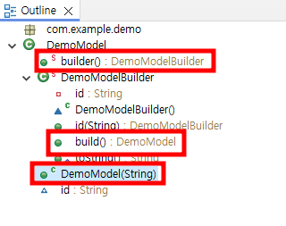
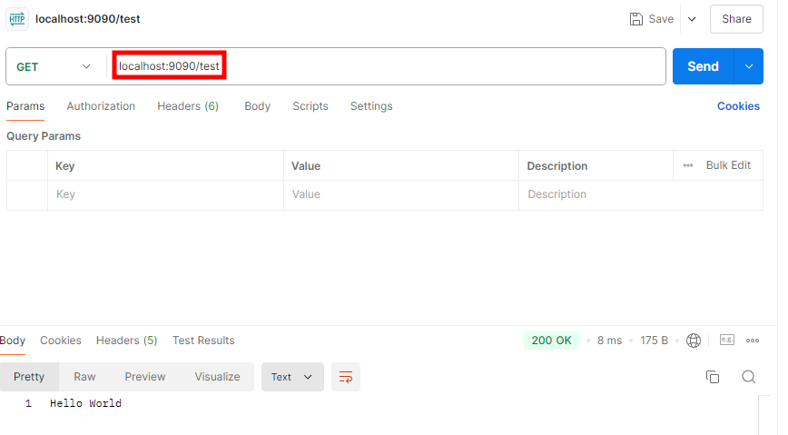
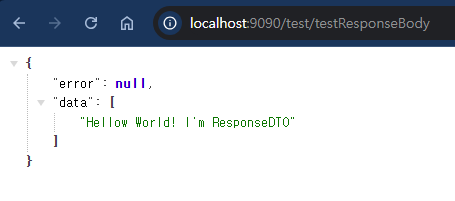

# Gradle
- **Gradle**은 자바, 코틀린, 그루비(Groovy) 등 다양한 프로그래밍 언어를 지원하는 **빌드 자동화 도구**이다. 
- Gradle은 의존성 관리, 테스트 실행, 배포, 패키징 등의 빌드 작업을 자동화하며, **유연성**과 **확장성**을 중시한다.
- 특히 **멀티 프로젝트 빌드**와 **병렬 빌드**에 강력한 성능을 발휘하며, 자바 기반 프로젝트에서는 Maven이나 Ant의 대안으로 많이 사용된다.

### Gradle의 주요 특징

1. **의존성 관리**:
   - Gradle은 Maven Central, JCenter, Ivy 같은 **의존성 저장소**에서 외부 라이브러리를 쉽게 가져와 사용할 수 있도록 도와준다.
   - 이를 통해 개발자는 필요한 라이브러리를 직접 다운로드하지 않고, 빌드 시 자동으로 라이브러리를 다운로드하고 관리할 수 있다.

2. **DSL (Domain-Specific Language)**:
   - Gradle은 빌드 스크립트를 작성할 때 **그루비(Groovy)** 또는 **코틀린(Kotlin)** 기반의 DSL을 사용한다. 
   - 이 DSL을 사용해 빌드 로직을 간결하고 유연하게 작성할 수 있다.
   - `build.gradle` 파일에 그루비 기반으로 빌드 설정을 작성하거나, `build.gradle.kts` 파일에 코틀린 기반으로 작성할 수 있다.

3. **멀티 프로젝트 빌드**:
   - Gradle은 여러 프로젝트를 하나로 묶어 **멀티 프로젝트 빌드**를 지원합니다. 
   - 대규모 애플리케이션 개발 시 여러 모듈을 독립적으로 빌드하면서, 이들 간의 의존성을 쉽게 관리할 수 있다.

4. **병렬 빌드**:
   - Gradle은 **병렬 빌드**를 지원하여 여러 작업을 동시에 처리할 수 있습니다. 이를 통해 빌드 시간을 크게 단축할 수 있습니다.

5. **플러그인 시스템**:
   - Gradle은 다양한 **플러그인**을 제공하여 빌드 작업을 확장할 수 있습니다. 특히 자바, 스프링 부트, 안드로이드 개발에서 유용한 플러그인이 많이 사용됩니다.
   - 예: `java` 플러그인, `application` 플러그인, `spring-boot` 플러그인, `kotlin` 플러그인 등.

6. **유연성**:
   - Gradle은 빌드 과정을 매우 세밀하게 제어할 수 있는 유연성을 제공합니다. 필요한 경우 Ant와 같은 다른 빌드 도구와 함께 사용할 수도 있습니다.


## **`build.gradle`**
- 프로젝트의 주요 빌드 설정을 정의하는 파일입니다. 여기에 의존성, 플러그인, 태스크(작업) 등을 정의할 수 있습니다.

### plugins
- Gradle에서 빌드 작업을 확장하고 자동화할 수 있도록 해주는 기능이다.
- 플러그인을 통해 다양한 기능을 추가할 수 있는데, 프로젝트에 필요한 빌드 작업이나 설정을 플러그인을 통해 쉽게 적용할 수 있다.
- 여러 작업을 미리 정의해둔 기능 모음이라고 생각하면 된다.
```groovy
plugins {
	id 'java' //자바 프로젝트에서 필수적인 빌드 작업들을 제공하는 플러그인이다.자바 코드를 컴파일하고, 테스트 코드를 실행하며, JAR 파일을 생성하는 작업을 자동으로 처리해준다.
	id 'org.springframework.boot' version '3.2.10'//스프링 부트 관련 종속성을 관리하고, 스프링 부트 애플리케이션을 패키징하거나 실행하는 데 필요한 작업들을 자동으로 제공해준다.
	id 'io.spring.dependency-management' version '1.1.6'//라이브러리나 플러그인의 의존성 버전을 쉽게 관리하고, 중복된 의존성이나 버전 충돌 문제를 방지해준다.
}
```
### group
- 프로젝트의 그룹 ID를 설정한다.

### version
- 프로젝트 버전을 설정한다.
- SNAPSHOT은 아직 완성되지 않은 버전이라는 의미로 자주 사용된다.
```groovy
group = 'com.example'
version = '0.0.1-SNAPSHOT'
```
### 자바 버전 설정(toolchain)
- 자바 버전 17을 사용하도록 설정하는 부분이다. 
- Gradle은 toolchain을 통해 명시적으로 자바 버전을 관리할 수 있다. 
- 이 설정을 통해 자바 17 버전의 컴파일러와 런타임 환경에서 프로젝트가 빌드되도록 한다.
```groovy
java {
	toolchain {
		languageVersion = JavaLanguageVersion.of(17)
	}
}
```
### Configuration 설정
- 이 설정은 컴파일할 때만 사용되는 의존성 설정이다.
```groovy
configurations {
	compileOnly {
		extendsFrom annotationProcessor
	}
}
```

### 저장소 설정
- Gradle이 라이브러리를 다운로드 하는 곳을 레포지토리라고 한다.
- Maven Central을 주로 사용한다.
- 메이븐센트럴은 https://mvnrepository.com/repos/central이다.

```groovy
repositories {
	mavenCentral()
}
```
### 의존성 설정
- implementation: 프로젝트에서 런타임에 사용될 라이브러리를 정의한다.
    - spring-boot-starter-data-jpa: 스프링 부트에서 JPA(자바 퍼시스턴스 API)를 사용하기 위한 의존성이다.
    - spring-boot-starter-web: 웹 애플리케이션 개발을 위한 의존성이다. REST API, 웹 MVC 등을 지원한다.
    - com.google.guava:guava: 구글의 유명한 라이브러리인 Guava를 추가했다. 주로 컬렉션, 문자열 처리 등의 유틸리티 기능을 제공한다.
- compileOnly: 컴파일 시에만 필요한 라이브러리이다. 주로 애노테이션 프로세서를 사용하지만, 런타임에는 포함되지 않는다.
    - org.projectlombok:lombok: Lombok은 자바 코드에서 반복적인 Getter, Setter, 생성자 등을 자동으로 생성해주는 라이브러리이다. 컴파일 시에만 필요하다.
- runtimeOnly: 런타임에만 필요한 라이브러리를 정의한다.
    - com.h2database:h2: 내장형 데이터베이스 H2를 런타임에서 사용할 수 있도록 설정한다. 주로 테스트 환경이나 간단한 애플리케이션에서 사용된다.
- annotationProcessor: 컴파일 타임에 애노테이션을 처리하는 라이브러리다. Lombok 같은 애노테이션 프로세서를 등록하는 곳이다.

- testImplementation: 테스트 코드를 실행할 때 필요한 라이브러리이다.
    - spring-boot-starter-test: 스프링 부트에서 JUnit과 같은 테스트 기능을 제공하는 의존성이다.
- testRuntimeOnly: 테스트 환경에서만 사용할 수 있는 라이브러리이다.
    - junit-platform-launcher: JUnit 테스트 실행기이다.
```groovy
dependencies {
	implementation 'org.springframework.boot:spring-boot-starter-data-jpa'
	implementation 'org.springframework.boot:spring-boot-starter-web'
	compileOnly 'org.projectlombok:lombok'
	runtimeOnly 'com.h2database:h2'
	annotationProcessor 'org.projectlombok:lombok'
	testImplementation 'org.springframework.boot:spring-boot-starter-test'
	testRuntimeOnly 'org.junit.platform:junit-platform-launcher'
	// https://mvnrepository.com/artifact/com.google.guava/guava
	implementation group: 'com.google.guava', name: 'guava', version: '33.3.1-jre'
	
}
```
### 테스트 설정
- 테스트 설정
- JUnit 플랫폼을 사용해 테스트를 실행하도록 설정한다.
```groovy
tasks.named('test') {
	useJUnitPlatform()
}
```

## 디펜던시에 라이브러리 추가해보기
- Guava라이브러리 추가하기

### mvnrepository
- https://mvnrepository.com/로 이동해서 guava를 검색한다.


- 원하는 버전을 선택한다.
- 어떤 버전을 골라야할지 모르겠다면 이용자가 많은 버전을 사용하자.


- Gradle을 선택하고 아래코드를 누르면 클립보드에 복사가 된다.


- Gradle.build 파일의 dependencies부분에 붙혀넣기를 한다.

```groovy
dependencies {
	implementation 'org.springframework.boot:spring-boot-starter-data-jpa'
	implementation 'org.springframework.boot:spring-boot-starter-web'
	compileOnly 'org.projectlombok:lombok'
	runtimeOnly 'com.h2database:h2'
	annotationProcessor 'org.projectlombok:lombok'
	testImplementation 'org.springframework.boot:spring-boot-starter-test'
	testRuntimeOnly 'org.junit.platform:junit-platform-launcher'

	// https://mvnrepository.com/artifact/com.google.guava/guava
	implementation group: 'com.google.guava', name: 'guava', version: '31.1-jre'
}
```

## 롬복(Lombok)
- 롬복을 사용하면 더 이상 getter/setter, builder, constructor를 작성하는 데 시간을 소모할 피룡가 없다.
- 롬복이 제공하는 어노테이션 프로세서가 getter,setter,builder,constructor 프로젝트 컴파일 시 관련 코드를 자동으로 작성해준다.
- 따라서 롬복을 사용하면 코드의 양을 줄이고 개발 시간도 단축할 수 있다.
- 이클립스에서 롬복을 사용하려면 jar파일을 이용해 플러그인을 설치해야 한다.

### 이클립스에 롬복 설치
- 메이븐 레포지토리(https://mvnrepository.com/)에서 원하는 버전의 Jar를 받아온다.


- 다운로드가 완료되면 cmd를 열어 Jar파일이 다운로드된 디렉토리로 이동한 후 다음의 명령어로 롬복을 설치한다.

```
java -jar lombok-1.18.30.jar
```


- 롬복이 자동으로 이클립스를 찾지 못한다면 왼쪽 아래 버튼을 눌러 이클립스 실행파일을 찾아준다.


- 오른쪽 아래 install/update버튼을 눌러 설치를 진행하면 끝난다.


- Quit installer 버튼을 누른후 이클립스를 껐다가 재시작한다.

- build.gradle 파일에서 롬복이 잘 추가됐는지 확인한다.
```
annotationProcessor 'org.projectlombok:lombok'
compileOnly 'org.projectlombok:lombok'
```
- Help > About Eclipse IDE로 들어가 About 하단에서 Lombok 설치 여부를 확인한다.


### DemoModel.java파일 생성하기
```java
package com.example.demo;

import lombok.Builder;
import lombok.NonNull;
import lombok.RequiredArgsConstructor;

@Builder
@RequiredArgsConstructor
public class DemoModel {

	@NonNull
	String id;
}
```
- outline탭에 다음과 같이 나오면 롬복이 잘 적용이 된것이다.



### 만약 적용이 잘 안될 시
- 프로젝트 우클릭 > Properties > Java Compiler > Annotation Processing
- Enable project specific settings 체크하고 저장하기

## 포스트맨 API 테스트
- REST API는 크게 나눠 URI, HTTP메섣, 요청 매개변수 또는 요청바디로 구분도는데, 이를 브라우저에서 테스팅하는 것에는 한계가 있다.
- 테스트를 한다고 임시로 프론트엔드 UI를 만드는 것은 지속가능한 방법이 아니다.
- 사용이 간편하고 직관적인 GUI를 제공하는 포스트맨이라는 프로그램을 사용한다.
- 포스트맨을 사용하면 간단히 RESTful API를 테스트 할 수 있다.
- 또 테스트를 저장해 API 스모크 테스팅 용으로 사용할 수 있다.

### 포스트맨 설치하기
- https://www.postman.com/downloads/에서 다운후 설치해보자.

- +버튼을 누르면 새요청을 작성할 수 있다.
- 우리의 부트 어플리케이션을 실행한 후 포스트맨을 이용해 localhost:9090을 요청하고 결과를 보자.

# 백엔드 서비스 아키텍처

## 레이어드 아키텍처 패턴
- 애플리케이션을 구성하는 요소들을 수평으로 나눠 관리하는 것이다.


- 레이어로 나눈다는 것은 메서드를 클래스 또는 인터페이스로 쪼개는 것이다.
- 이 레이어는 작게는 클래스를 여러 레이어로 나누는 것부터 아주 다른 애플리케이션으로 분리하는 경우까지 범위가 다양하다.
- 레이어 사이에는 계층이 있다.
- 레이어는 자기보다 한 단계 하위의 레이어만 사용한다.
- 중간 레이어를 섞어 사용하는 경우도 있지만 기본적안 레이어드 아키텍처에서는 상위 레이어가 자신의 바로 하위 레이어를 사용한다.

```java
public class TodoService{
    public List<Todo> getTodos(String userId){
        List<Todo> todos = new ArrayList<>();

        //... 비즈니스로직

        return todos;
    }
}

public class WebController{

    private TodoService todoService;

    public String getTodos(Request request){
        if(request.userId == null){
            JSONObject json = new JSONObject();
            json.put("error","missing user id");
            return json.toString();
        }

        //서비스레이어
        List<Todo> todos = todoService.getTodos(request.userId);

        return this.getResponse(todos);
    }

}
```

## 모델,엔티티,DTO


- 보통 자바로 된 비즈니스 애플리케이션의 클래스는 두 가지 종류로 나눌 수 있다.
- 첫 번재는 일을 하는 클래스, 즉 기능을 수행하는 클래스이다.
- 두 번재는 데이터를 담는 클래스이다.
- 일을 하는 클래스는 컨트롤러,서비스,퍼시스턴스 처럼 로직을 수행하는 클래스이다.
- 우리는 대부분의 시간을 컨트롤러, 서비스, 퍼시스선스 로직을 구현하는데 사용한다.
- 데이터를 담는 클래스란 말 그대로 데이터만 가지고 있는 클래스이다.
- 위 예제에서  TodoService는 List를 반환한다.
- 이는 Todo객체를 담고있는 리스트이다.
- Todo객체는 기능이 없고 DB에서 반환된 정보를 갖고 있을 뿐이다.
- 이렇게 아무 기능 없이 DB에서 반환된 데이터를 담기 위한 클래스를 엔티티,모델, DTO라고 부른다.
- 이름에 큰 의미를 둘 필요는 없고 무엇을 위한 클래스인지가 중요하다.

## 모델과 엔티티
- 모델은 데이터를 담는 역할과 DB의 테이블과 스키마를 표현하는 두 역할을 한다.
- com.example.demo아래 model 패키지를 생성한다.
- 패키지 아래 TodoEntity클래스를 생성한다.

```java
package com.example.demo.model;

import lombok.AllArgsConstructor;
import lombok.Builder;
import lombok.Data;
import lombok.NoArgsConstructor;

@Builder
@NoArgsConstructor
@AllArgsConstructor
@Data
public class TodoEntity {
	private String id; //이 객체의 id
	private String userId;//이 객체를 생성한 유저의 아이디
	private String title;//Todo 타이틀 예)운동 하기
	private boolean done;//true - todo를 완료한 경우(checked)
}

```
### @Builder
- 객체 생성을 위한 디자인 패턴 중 하나이다.
- 롬복이 제공하는 @Builder 어노테이션을 사용하면 우리가 Builder클래스를 따로 개발하지 않고도 Builder패턴을 사용해 객체를 생성할 수 있다.

```java
TodoEntity todo = TodoEntity.builder()
                .id("t-10328373")
                .userId("developer")
                .title("Implement Model")
                .build()
```

### @NoArgsConstructor
- 매개변수가 없는 생성자를 구현해준다.

```java
public TodoEntity(){

}
```

### @AllArgsConstructor
- 클래스의 모든 멤버를 매개변수로받는 생성자를 구현해준다.

```java
public TodoEntity(String id, String userId, String title, boolean done){
    this.id = id;
    this.userId = userId;
    this.title = title;
    this.done = done;
}
```

### @Data
- 멤버 변수의 Setter와 Getter 메서드를 구현해준다.
```java
public String getId() {
		return id;
	}
	public void setId(String id) {
		this.id = id;
	}
	public String getUserId() {
		return userId;
	}
	public void setUserId(String userId) {
		this.userId = userId;
	}
	public String getTitle() {
		return title;
	}
	public void setTitle(String title) {
		this.title = title;
	}
	public boolean isDone() {
		return done;
	}
	public void setDone(boolean done) {
		this.done = done;
	}
```

## DTO(Data Transition Object)
- 서비스가 요청을 처리하고 클라이언트로 반환할 때, 모델 자체를 그래도 반환하는 경우는 별로 없다.
- 보통은 데이터를 전달하기 위해 사용하는 객체인 DTO로 변환해 반환한다.

### DTO로 변환하여 반환하는 이유
1. 비즈니스 로직을 캡슐화 하기 위함이다.
    - 대부분의 회사들은 외부인이 자사의 DB의 스키마를 아는 것을 원치 않는다.
    - 이때 DTO처럼 다른 객체로 바꿔 반환하면 외부 사용자에게 서비스 내부의 로직, DB 구조등을 숨길 수 있다.
2. 클라이언트가 필요한 정보를 모델이 전부 포함하지 않는 경우가 많다.
   - 대표적으로 에러 메시지가 있다.
   - 만약 서비스 실행 도중 유저 에러가 나면 이 에러 메시지를 어디에 포함해야 하는가?
   - 모델은 서비스 로직과는 관련이 없기 때문에 모델에 담기는 애매하다.
   - 이런 경우 DTO에 에러 메시지 필드를 선언하고 DTO에 포함하면 된다.

### com.example.demo아래에 dto패키지 생성하기
- 패키지 아래 TodoDTO클래스를 생성한다.
```java
package com.example.demo.dto;

import com.example.demo.model.TodoEntity;

import lombok.AllArgsConstructor;
import lombok.Builder;
import lombok.Data;
import lombok.NoArgsConstructor;

@Builder
@NoArgsConstructor
@AllArgsConstructor
@Data
public class TodoDTO {
	private String id;
	private String title;
	private boolean done;
	
	public TodoDTO(final TodoEntity entity) {
		this.id = entity.getId();
		this.title = entity.getTitle();
		this.done = entity.isDone();
	}
	
}
```
- TodoDTO에는 userId가 없다.
- 이 프로젝트에서는 이후 스프링 시큐리티를 이용해 인증을 구현한다.
- 따라서 유저가 자기 아이디를 넘겨주지 않아도 인증이 가능하다.
- userId는 애플리케이션과 DB에서 사용자를 구별하기 위한 고유 식별자로 사용하기 때문에 숨길 수 있다면 숨기는 것이 보안상 맞다.
- 따라서 DTO에서는 userId를 포함하지 않았다.

### ResponseDTO 클래스 생성하기
- http응답으로 사용할 DTO를 만들어보자

```java
package com.example.demo.dto;

import java.util.List;

import lombok.AllArgsConstructor;
import lombok.Builder;
import lombok.Data;
import lombok.NoArgsConstructor;

@Builder
@NoArgsConstructor
@AllArgsConstructor
@Data
public class ResponseDTO<T> {

	private String error;
	private List<T> data;
}
```
- TodoDTO 뿐만 아니라 이후 다른 모델의 DTO도 ResponseDTO를 이용해 반환할 수 있도록 제네릭을 사용했다.
- 이 프로젝트의 경우는 Todo객체를 하나만 반환하기 보다는 리스트를 반환하는 경우가 많으므로 리스트로 반환하도록 구성을 했다.

## REST API
-  REST(Representational State Transfer) 아키텍처를 기반으로 하는 API(Application Programming Interface)다.
-  REST API는 클라이언트와 서버 간의 상호작용을 HTTP 프로토콜을 사용해 설계한 웹 서비스 인터페이스로, 데이터를 쉽게 주고받을 수 있게 해준다.
-  REST API는 웹 애플리케이션, 모바일 앱, 마이크로서비스 등 다양한 시스템 간의 통신을 위한 표준으로 널리 사용된다.
- REST 아키텍처 스타일은 6가지 제약조건으로 구성된다.
- 이 가이드를 따르는 API를 RESTful API라고 한다.

## REST API의 주요 개념
### 클라이언트-서버
- 리소스를 관리하는 서버가 존재하고, 다수의 클라이언트가 리소스를 소비하기 위해 네트워크를 통해 서버에 접근하는구조
### 상태가 없는(Stateless)
- 클라이언트가 서버에 요청을 보낼 때, 이전 요청의 영향을 받지 않음을 의미한다.
- 예를들어 /login으로 로그인 요청을 보내고, 로그인이 되어 다음 페이지인 /page로 넘어갔다고 치자.
- /page로 리소스를 불러올 때, 이전 요청에서 login한 사실을 서버가 알고 있어야 한다면 그것은 Stateful 상태가 된다.
- Stateless상태를 유지하려면 서버는 그 사실을 몰라야 한다.
- 그렇기 때문에 로그인 상태를 유지하지 못하므로 요청을 보낼때마다 로그인 정보를 함께 보내야 한다.
- http는 기본적으로 Stateless 프로토콜이다.
### 캐시 가능한 데이터
- 서버에서 리소스를 반환할 때 캐시가 가능한지 아닌지 명시할 수 있어야 한다.
- http에서는 cache-control이라는 헤더에 리소스의 캐시 여부를 명시할 수 있다.
```
※캐시
- 데이터를 빠르게 접근하기 위해 메모리나 디스크에 저장해두는 일종의 임시 저장소
- 캐시는 자주 사용되는 데이터를 임시로 저장해두고, 필요할 때 빠르게 가져다 사용할 수 있는 메커니즘이다.
```
### 일관적인 인터페이스
- 시스템 또는 애플리케이션의 리소스에 접근하기 위한 인터페이스가 일관적이어야 한다는 뜻이다.

#### HTTP메서드 사용의 일관성
- GET: 리소스를 조회할 때 사용한다.
- POST: 새로운 리소스를 생성할 때 사용한다.
- PUT: 기존 리소스를 업데이트할 때 사용한다.
- DELETE: 리소스를 삭제할 때 사용한다.
```HTML
GET    /users         # 모든 사용자 목록 조회
GET    /users/{id}    # 특정 사용자 조회
POST   /users         # 새로운 사용자 생성
PUT    /users/{id}    # 사용자 정보 업데이트
DELETE /users/{id}    # 사용자 삭제

GET    /posts         # 모든 게시물 조회
GET    /posts/{id}    # 특정 게시물 조회
POST   /posts         # 새로운 게시물 생성
PUT    /posts/{id}    # 게시물 업데이트
DELETE /posts/{id}    # 게시물 삭제
```
- 이렇게 설계하면 API 사용자들이 다양한 리소스와 상호작용 할 때 동일한 패턴을 예상할 수 있다.

#### URI 구조의 일관성
- URI 경로를 일관되게 설계하는 것도 중요하다. 
- 리소스의 이름은 복수형으로 일관되게 사용하고, 리소스 간 관계를 표현할 때도 규칙적으로 작성해야 한다.
```
GET /users/{userId}/posts         # 특정 사용자의 게시물 목록 조회
POST /users/{userId}/posts        # 특정 사용자에게 새로운 게시물 생성
GET /users/{userId}/posts/{postId}  # 특정 사용자의 특정 게시물 조회
```

#### 응답 형식의 일관성
- 모든 API의 응답 형식도 일관되게 설계해야 한다.
- 예를 들어, 성공 시 HTTP 상태 코드와 JSON 형식의 응답을 동일하게 유지하는 게 좋다.
```
{
  "status": "success",
  "data": {
    "id": 1,
    "name": "John Doe",
    "email": "john@example.com"
  }
}
```
- 에러가 발생한 경우도 일관된 형식으로 제공한다.
```
{
  "status": "error",
  "message": "User not found"
}
```

### 레이어 시스템
- 클라이언트가 서버에 요청을 날릴 때, 여러 개의 레이어로 된 서버를 거칠 수 있다.
- 클라이언트는 여러 레이어를 인지하지 않고, 최종 서버에서 오는 응답만 신경 쓰게 된다. 
- 클라이언트는 프록시, 캐시, 게이트웨이 등을 거치더라도 서버로부터 오는 결과만 받으면 된다.
- 서버 측에서는 각 레이어가 독립적으로 동작하며, 각각의 레이어가 맡은 역할을 수행해 확장성, 보안성, 성능 최적화가 가능하다.

```html
1. 클라이언트(웹 브라우저)가 웹 페이지를 요청한다.
2. 서버는 HTML, CSS뿐만 아니라 자바스크립트 파일을 전송한다.
3. 클라이언트는 자바스크립트 코드를 실행하여 사용자 상호작용을 처리하거나, 페이지를 동적으로 업데이트한다.

<!DOCTYPE html>
<html>
<head>
    <title>Code on Demand Example</title>
</head>
<body>
    <h1>Hello World</h1>
    <button id="updateButton">Update Text</button>
    <script>
        document.getElementById('updateButton').onclick = function() {
            document.querySelector('h1').innerText = 'Text Updated!';
        }
    </script>
</body>
</html>

```


### 코드-온-디맨드(선택사항)
- 서버가 클라이언트에게 실행 가능한 코드를 전송하고, 클라이언트가 해당 코드를 실행할 수 있도록 하는 개념이다.


## 컨트롤러 레이어 : 스프링 REST API 컨트롤러
- HTTP는 GET/POST/PUT/DELETE/OPTIONS 등과 같은 메서드와 URI를 이용해 서버에 HTTP요청을 보낼 수 있다.
- 그렇다면 서버는 이 요청을 받은 후 어떻게 처리해야 할까?

- 다음과 같은 요청이 들어왔다고 가정해보자.
```
GET /test HTTP/1.1
Host : localhost:8080
Content-Type: application/json
Content-Length : 17
{
	"id"123
}
```
- localhost:8080에게 http GET메서드를 이용해 test라는 리소스를 요청한다는 뜻이다.
- 서버는 자기 주소를 제외한 /{리소스}부분을 이해하고, 또 이 요청이 어떤 HTTP메서드를 이용했는지 알아야 한다.
- 그 후 해당 리소스의 HTTP메서드에 연결된 메서드를 실행해야 한다.

### 스프링 부트 스타터 웹
- Spring Boot 프로젝트에서 웹 애플리케이션 개발을 쉽게 할 수 있도록 도와주는 의존성 패키지다. 
- Spring Boot에서 제공하는 다양한 "스타터" 중 하나로, REST API, 웹 애플리케이션, MVC 패턴 등을 빠르고 간편하게 개발할 수 있게 해준다.

### 주요 기능
1. 내장된 톰캣 서버
	- 톰캣(Tomcat)은 스프링 부트에서 기본적으로 포함된 서블릿 컨테이너로, 개발자가 별도의 서버 설정 없이 애플리케이션을 실행할 수 있게 해준다.
	- 내장된 톰캣 서버가 자동으로 포함되어 jar 파일로 패키징된 애플리케이션을 쉽게 실행할 수 있다.
2. Spring MVC
   - Spring MVC를 기본적으로 지원한다.
   - 이걸 통해 HTTP 요청을 처리하고, 클라이언트에게 응답을 반환하는 구조를 쉽게 구현할 수 있다.
   - Spring MVC는 주로 컨트롤러(@Controller, @RestController), 모델(데이터를 다루는 객체), 뷰(View)(HTML, JSON 등의 출력 형식)로 구성된다.
3. RESTful API
	- @RestController, @RequestMapping 같은 애노테이션을 사용해서 간단하게 REST 엔드포인트를 정의할 수 있다.
	- JSON, XML 같은 형식으로 데이터를 주고받는 API 서버를 빠르게 만들 수 있다.
4. 의존성 자동 설정
	- 웹 애플리케이션을 개발하기 위한 필수 의존성을 모두 포함하고 있다. 
	- 예를 들어, spring-web, spring-webmvc, jackson(JSON 변환) 등 웹 개발에 필요한 라이브러리들이 자동으로 포함된다.
	- 개발자는 별도로 각 라이브러리를 설정할 필요 없이, 스타터 의존성을 추가하는 것만으로도 웹 프로젝트를 바로 시작할 수 있다.
5. Jackson 통합
	- Jackson은 Java 객체를 JSON으로 변환하고, 그 반대로도 변환할 수 있는 라이브러리다. 
	- Spring Boot Starter Web은 Jackson을 기본적으로 포함하여, REST API에서 쉽게 JSON 데이터 처리를 할 수 있도록 도와준다.

## com.example.demo.controller 패키지 생성하기
- 컨트롤러 실습을 위한 TestController 클래스 생성하기
```java
package com.example.demo.controller;

import org.springframework.web.bind.annotation.RequestMapping;
import org.springframework.web.bind.annotation.RestController;

@RestController
@RequestMapping("test")//리소스
public class TestController {

}
```
## @RestController
1. REST API 개발에 최적화
   - 웹 페이지가 아닌 데이터를 반환하는 컨트롤러로 사용된다.
   - HTML 같은 뷰 페이지를 반환하는 대신, JSON이나 XML 형식의 데이터를 반환하는 RESTful API를 제공하는 데 적합하다.
2. @Controller와 @ResponseBody의 결합
   - @RestController는 **@Controller**와 **@ResponseBody**의 결합이다. 
   - 즉, 클래스에 @RestController를 붙이면 모든 메서드에 자동으로 **@ResponseBody**가 적용된다.
   - **@ResponseBody**는 메서드의 반환 값을 HTTP 응답 바디로 직렬화해 클라이언트에게 전달한다. 
   - 따라서 데이터를 JSON, XML 형식으로 변환해 반환한다.

## @ResponseBody
- 컨트롤러 메서드의 반환 값을 HTTP 응답의 바디에 직접 포함시키는 데 사용된다.
-  뷰(HTML 파일) 같은 템플릿을 반환하지 않고, 주로 JSON 또는 XML 같은 데이터를 클라이언트에게 직접 반환하는 데 사용된다.

### 주요기능
1. 데이터 직접 반환
   - HTTP 응답 바디로 직렬화해서 클라이언트에 전송한다. 
   - 반환되는 데이터는 보통 JSON 형식으로 변환된다.
   - 주로 REST API에서 데이터를 클라이언트에 반환할 때 사용되며, JSON 또는 XML 형식의 응답을 쉽게 처리할 수 있다.
2. 자동직렬화
   - 스프링은 내부적으로 Jackson 라이브러리를 사용해 자바 객체를 JSON으로 변환한다.
   - 메서드에서 자바 객체를 반환하면 스프링은 이를 JSON으로 자동 직렬화하여 클라이언트에게 전송한다.
   - 별도의 변환 작업 없이 자바 객체를 반환하면 스프링이 알아서 JSON 응답으로 만들어준다.

## @GetMapping
- 스프링 프레임워크에서 HTTP GET 요청을 처리하기 위한 애노테이션이다.
- 특정 URL 경로로 들어오는 GET 요청을 처리하고, 그 요청에 대한 응답을 반환하는 데 사용된다.

#### 주요 기능
1. HTTP GET 요청 처리
   - **@GetMapping**은 HTTP GET 요청을 처리하는 데 사용된다
   - GET 요청은 주로 데이터를 조회하는 용도로 사용되며, 서버에서 데이터를 가져와 클라이언트에 반환하는 역할을 한다.
   - 예를 들어, 브라우저에서 URL을 입력하고 엔터를 누르면, 브라우저는 서버에 GET 요청을 보내 해당 URL에 해당하는 자원을 요청하게 된다.
2. 간편한 URL 매핑
	- @GetMapping 애노테이션은 특정 URL 경로와 컨트롤러의 메서드를 쉽게 매핑시켜준다. 
	- 이렇게 하면 해당 URL로 들어오는 GET 요청이 해당 메서드에 의해 처리된다.


- 포스트맨을 이용해 테스팅 하면 HTTP Method를 확실히 구분할 수 있다.



## @GetMapping에 경로 지정하기
```java
package com.example.demo.controller;

import org.springframework.web.bind.annotation.GetMapping;
import org.springframework.web.bind.annotation.RequestMapping;
import org.springframework.web.bind.annotation.RestController;

@RestController
@RequestMapping("test")//리소스
public class TestController {

	@GetMapping("/testGetMapping")
	public String testController() {
		return "Hello World testGetMapping";
	}
}
```
- /test/testGetMapping가 메서드에 연결되야 한다는 사실을 안다.


### @RequestMapping이 없는 경우
```java
package com.example.demo.controller;

import org.springframework.web.bind.annotation.GetMapping;
import org.springframework.web.bind.annotation.RequestMapping;
import org.springframework.web.bind.annotation.RestController;

@RestController
public class TestController {

	@GetMapping("/testGetMapping")
	public String testController() {
		return "Hello World testGetMapping";
	}
}
```
- localhost:9090/testGetMapping으로 접근하면 된다.

## @PathVariable
- 스프링 프레임워크에서 URL 경로의 일부를 변수로 사용할 수 있도록 지원하는 애노테이션이다.
- 주로 RESTful API에서 사용되며, URL에 포함된 값을 동적으로 받아와 메서드의 매개변수로 사용할 수 있게 해준다.

### 주요기능
1. 동적 경로 처리
   - URL 경로의 일부분을 변수로 받아올 수 있어서 동적 URL을 처리할 수 있다. 예를 들어, /users/1과 같은 경로에서 1을 변수로 받아서 해당 사용자에 대한 정보를 처리할 수 있다.
   - 이를 통해 RESTful API 설계에서 리소스 식별자(ID) 같은 정보를 URL 경로에 포함시켜 처리할 수 있다.
2. 매개변수와 URL 매핑
   - 컨트롤러 메서드의 매개변수에 @PathVariable을 붙여 URL 경로와 일치하는 값을 받아올 수 있다. 이는 GET, POST, PUT, DELETE 등의 요청에서 유용하게 사용된다.

### 사용방법
- 기본 사용방법
```java
import org.springframework.web.bind.annotation.GetMapping;
import org.springframework.web.bind.annotation.PathVariable;
import org.springframework.web.bind.annotation.RestController;

@RestController
public class UserController {

    @GetMapping("/users/{id}")//{id}가 경로변수로 동작한다.
	//@PathVariable("id")는 {id} 부분을 받아서 메서드의 매개변수 userId에 할당한다.
	//예를 들어, GET /users/5 요청을 보내면, userId에 5가 할당되고 "User ID: 5"라는 응답을 반환한다.
    public String getUserById(@PathVariable("id") Long userId) {
        return "User ID: " + userId;
    }
}
```
- @PathVariable과 여러 경로 변수 사용
```java
import org.springframework.web.bind.annotation.GetMapping;
import org.springframework.web.bind.annotation.PathVariable;
import org.springframework.web.bind.annotation.RestController;

@RestController
public class OrderController {

    @GetMapping("/users/{userId}/orders/{orderId}")
    public String getOrderByUserAndOrderId(@PathVariable("userId") Long userId,
                                           @PathVariable("orderId") Long orderId) {
        return "User ID: " + userId + ", Order ID: " + orderId;
    }
}

```
- 예를 들어, GET /users/1/orders/100 요청을 보내면 **"User ID: 1, Order ID: 100"**이라는 응답이 반환된다.

### 주요 속성
- value: 경로 변수의 이름을 지정한다. 
  - 만약 메서드 매개변수 이름과 경로 변수 이름이 동일하면 생략할 수 있다.
- required: 기본값은 true이며, 경로 변수 값이 반드시 있어야 한다는 의미다. 
  - 단, @PathVariable은 경로에 있는 값을 매핑하는 것이므로, 일반적으로 required = false를 잘 사용하지 않는다.
```java
//이 경우 @PathVariable("id")에서 value 속성을 생략할 수 있다. 
//메서드 매개변수 이름과 경로 변수 이름이 동일하기 때문에 스프링이 자동으로 매핑한다.

@GetMapping("/users/{id}")
public String getUserById(@PathVariable(required=false) Long id) {
    return "User ID: " + id;
}
```

## TestController에 코드 추가하기
```java
package com.example.demo.controller;

import org.springframework.web.bind.annotation.GetMapping;
import org.springframework.web.bind.annotation.PathVariable;
import org.springframework.web.bind.annotation.RequestMapping;
import org.springframework.web.bind.annotation.RestController;

@RestController
@RequestMapping("test")
public class TestController {

	@GetMapping("/testGetMapping")
	public String testControllerWithPath() {
		return "Hello World testGetMapping";
	}
	
	@GetMapping("/{id}")
	public String testControllerWidthPathVariables(@PathVariable(required=false)int id) {
		return "Hello world! ID"+id;
	}
}
```
- 이제 localhost:9090/test/123 같은 요청을 날릴 수 있다.


## @RequestParam
-  HTTP 요청의 쿼리 파라미터나 폼 데이터를 처리하기 위해 사용되는 애노테이션이다.
-  클라이언트가 서버에 요청을 보낼 때, URL 뒤에 붙이는 쿼리 스트링이나 폼 데이터를 받아서 메서드의 파라미터로 전달할 수 있게 해준다.

### 주요기능
1. 쿼리 파라미터 처리
	- @RequestParam은 URL 뒤에 붙는 쿼리 파라미터(예: ?key=value)를 메서드의 파라미터로 매핑할 수 있게 해준다.
	- 클라이언트가 요청을 보낼 때 특정 데이터를 쿼리 스트링으로 전달하면, 해당 데이터를 서버에서 쉽게 처리할 수 있다.
2. 폼 데이터 처리
	- POST 요청의 폼 데이터도 @RequestParam을 통해 처리할 수 있다. 
	- 사용자가 폼을 통해 입력한 데이터를 서버에서 받는 방식이다.
### 사용방법
#### 1. 기본 사용법 (쿼리 파라미터)
```java
import org.springframework.web.bind.annotation.GetMapping;
import org.springframework.web.bind.annotation.RequestParam;
import org.springframework.web.bind.annotation.RestController;

@RestController
public class UserController {

    @GetMapping("/users")
    public String getUserById(@RequestParam("id") Long userId) {
        return "User ID: " + userId;
    }
}
```
- 클라이언트가 GET /users?id=1로 요청을 보낼 때, 쿼리 파라미터 id 값을 받아서 userId 변수에 할당한다.
- 예를 들어, GET /users?id=1 요청을 보내면 "User ID: 1"이라는 응답이 반환된다.

#### 2. 기본값 설정
- @RequestParam의 파라미터가 선택적일 때, 기본값을 설정할 수 있다.
- 클라이언트가 해당 파라미터를 생략했을 때 기본값이 적용된다.
```java
@GetMapping("/users")
public String getUserById(@RequestParam(value = "id", defaultValue = "0") Long userId) {
    return "User ID: " + userId;
}
```
- defaultValue를 사용하면, 파라미터가 제공되지 않았을 때 기본값이 사용된다.
- 이 예시에서는 GET /users로 요청할 때, 기본값인 0이 userId에 할당된다.

#### 3. 파라미터가 필수인지 설정(required)
- 기본적으로 @RequestParam은 필수다.
- 쿼리 파라미터가 포함되지 않으면 400 Bad Request 오류가 발생한다. 
- 하지만 required = false로 설정하면 해당 파라미터가 선택적으로 처리된다.
```java
@GetMapping("/users")
public String getUserById(@RequestParam(value = "id", required = false) Long userId) {
    if (userId == null) {
        return "No user ID provided";
    }
    return "User ID: " + userId;
}
```
- required = false로 설정하면, 파라미터가 제공되지 않아도 오류가 발생하지 않는다.
- 이 경우 userId가 null이 될 수 있다.
#### 4. 여러 파라미터 처리
```java
@GetMapping("/search")
public String search(@RequestParam("query") String query, 
                     @RequestParam("page") int page) {
    return "Search query: " + query + ", Page: " + page;
}
```
- GET /search?query=spring&page=2로 요청을 보내면 "Search query: spring, Page: 2"라는 응답이 반환된다.

#### 5. 폼 데이터 처리(POST요청)
- @RequestParam은 GET 요청뿐만 아니라 POST 요청에서 폼 데이터를 처리하는 데도 사용할 수 있다.
- 이 경우, 클라이언트가 HTML 폼을 통해 입력한 데이터를 서버에서 받을 수 있다.
```java
import org.springframework.web.bind.annotation.PostMapping;
import org.springframework.web.bind.annotation.RequestParam;
import org.springframework.web.bind.annotation.RestController;

@RestController
public class FormController {

    @PostMapping("/submitForm")
    public String submitForm(@RequestParam("name") String name, 
                             @RequestParam("email") String email) {
        return "Form submitted: Name = " + name + ", Email = " + email;
    }
}
```
- 클라이언트가 POST 요청을 통해 name과 email을 보내면, 서버는 해당 데이터를 @RequestParam을 통해 받아 처리할 수 있다.

### 주요 속성
- required: 파라미터의 필수 여부를 지정한다. 
  - 기본값은 true로, 필수 파라미터가 제공되지 않으면 오류가 발생한다
  - required = false로 설정하면 선택적으로 받을 수 있다.

- defaultValue: 파라미터가 제공되지 않을 때 사용할 기본값을 지정한다
  - 기본값이 설정된 경우 required = false로 처리된다.

## @RequestParam과 @PathVariable의 차이점
### @RequestParam 
- 주로 쿼리 파라미터(URL의 ? 뒤에 오는 값)를 처리한다. 
- 또한, POST 요청에서 폼 데이터도 처리할 수 있다.
- 예: /users?id=1
### @PathVariable
- URL 경로의 일부로 전달되는 변수를 처리한다. 
- 주로 RESTful API에서 리소스를 식별하기 위해 사용된다.
- 예: /users/1

## TestController에 코드 추가하기
```java
package com.example.demo.controller;

import org.springframework.web.bind.annotation.GetMapping;
import org.springframework.web.bind.annotation.PathVariable;
import org.springframework.web.bind.annotation.RequestMapping;
import org.springframework.web.bind.annotation.RequestParam;
import org.springframework.web.bind.annotation.RestController;

@RestController
@RequestMapping("test")
public class TestController {

	@GetMapping("/testGetMapping")
	public String testControllerWithPath() {
		return "Hello World testGetMapping";
	}
	
	@GetMapping("/{id}")
	public String testControllerWidthPathVariables(@PathVariable(required=false)int id) {
		return "Hello world! ID"+id;
	}
	
	@GetMapping("/testRequestParam")
	public String testControllerRequestParam(@RequestParam(required=false)int id) {
		return "Hello World! ID" + id;
	}
}
```

## @RequestBody
- HTTP 요청의 본문(body)에 담긴 데이터를 자바 객체로 변환하여 컨트롤러 메서드의 매개변수로 전달하는 데 사용하는 애노테이션이다. 
- 주로 POST, PUT, PATCH 요청에서 사용되며, 클라이언트가 전송한 JSON, XML, 또는 폼 데이터 등을 자바 객체로 변환하는 역할을 한다.

### 주요기능
1. HTTP 요청 본문 처리
   - @RequestBody는 클라이언트가 보낸 HTTP 요청의 본문을 읽어와 이를 자바 객체로 변환한다.
   - 요청 본문은 주로 JSON이나 XML 형식으로 보내지며, 스프링이 이를 자동으로 역직렬화(deserialize)하여 자바 객체로 변환한다.
2. JSON ↔ 자바 객체 변환
   - 스프링은 Jackson 라이브러리를 사용하여 JSON 데이터를 자동으로 자바 객체로 변환할 수 있다. 
   - 클라이언트가 JSON 데이터를 전송하면, @RequestBody가 이 데이터를 자바 객체로 변환하고, 그 객체를 메서드의 인자로 전달한다.

## TestRequestBodyDTO 생성하기
```java
package com.example.demo.dto;

import lombok.Data;

@Data
public class TestRequestBodyDTO {

	private int id;
	private String message;
}
```

## TestController에 코드 추가하기
```java
package com.example.demo.controller;

import org.springframework.web.bind.annotation.GetMapping;
import org.springframework.web.bind.annotation.PathVariable;
import org.springframework.web.bind.annotation.RequestBody;
import org.springframework.web.bind.annotation.RequestMapping;
import org.springframework.web.bind.annotation.RequestParam;
import org.springframework.web.bind.annotation.RestController;

import com.example.demo.dto.TestRequestBodyDTO;

@RestController
@RequestMapping("test")
public class TestController {

	@GetMapping("/testGetMapping")
	public String testControllerWithPath() {
		return "Hello World testGetMapping";
	}
	
	@GetMapping("/{id}")
	public String testControllerWidthPathVariables(@PathVariable(required=false)int id) {
		return "Hello world! ID"+id;
	}
	
	@GetMapping("/testRequestParam")
	public String testControllerRequestParam(@RequestParam(required=false)int id) {
		return "Hello World! ID" + id;
	}
	
	@GetMapping("/testRequestBody")
    //@RequestBody TestRequestBodyDTO testRequestBodyDTO
    //RequestBody로 날아오는 JSON을 TestRequestBody객체로 변환해서 가져와라
    //날아오는 JSON의 형식은 TestRequestBody의 형태와 같아야 할 것이다.
	public String testControllerRequestBody(@RequestBody TestRequestBodyDTO testRequestBodyDTO) {
		return "Hello World! ID"+testRequestBodyDTO.getId() + " Message : " + testRequestBodyDTO.getMessage();
	}
}
```
- 포스트맨에서 요청을 던져볼 수 있다.


- Body탭을 클릭하고 raw를 체크합니다.
- 아래 json형태의 데이터를 요청합니다.
- localhost:9090/test/testRequestBody로 요청하고 결과를 확인합니다.


## @ResponseBody
- 컨트롤러 메서드의 반환 값을 HTTP 응답의 본문(body)에 직접 포함시킬 때 사용된다.
- 뷰(HTML) 같은 템플릿을 반환하는 대신, 주로 JSON, XML, 문자열과 같은 데이터를 클라이언트에게 반환하는 데 사용된다.
## TestController에 코드 추가하기
```java
package com.example.demo.controller;

import java.util.ArrayList;
import java.util.List;

import org.springframework.web.bind.annotation.GetMapping;
import org.springframework.web.bind.annotation.PathVariable;
import org.springframework.web.bind.annotation.RequestBody;
import org.springframework.web.bind.annotation.RequestMapping;
import org.springframework.web.bind.annotation.RequestParam;
import org.springframework.web.bind.annotation.RestController;

import com.example.demo.dto.ResponseDTO;
import com.example.demo.dto.TestRequestBodyDTO;

@RestController
@RequestMapping("test")
public class TestController {

	@GetMapping("/testGetMapping")
	public String testControllerWithPath() {
		return "Hello World testGetMapping";
	}
	
	@GetMapping("/{id}")
	public String testControllerWidthPathVariables(@PathVariable(required=false)int id) {
		return "Hello world! ID"+id;
	}
	
	@GetMapping("/testRequestParam")
	public String testControllerRequestParam(@RequestParam(required=false)int id) {
		return "Hello World! ID" + id;
	}
	
	@GetMapping("/testRequestBody")
	public String testControllerRequestBody(@RequestBody TestRequestBodyDTO testRequestBodyDTO) {
		return "Hello World! ID"+testRequestBodyDTO.getId() + " Message : " + testRequestBodyDTO.getMessage();
	}
	
	@GetMapping("/testResponseBody")
	public ResponseDTO<String> testControllerResponseBody(){
		List<String> list = new ArrayList<>();
		list.add("Hellow World! I'm ResponseDTO");
		ResponseDTO<String>response = ResponseDTO.<String>builder().data(list).build();
		return response;
	}
}
```
- 컴파일 후에 localhost:9090/test/testResponseBody를 요청하면 다음과 같은JSON이 반환된다.




## ResponseEntity
- 스프링 프레임워크에서 제공하는 클래스로 HTTP 응답을 보다 세밀하게 제어할 수 있는 방법을 제공한다.
- HTTP 상태 코드, 헤더, 그리고 응답 본문을 포함한 전체 HTTP 응답을 구성할 수 있으며, 주로 REST API에서 많이 사용된다.

### 주요기능
1. HTTP 상태 코드 제어
   - ResponseEntity를 사용하면 클라이언트에 응답할 때, HTTP 상태 코드를 명시적으로 설정할 수 있다. 
   - 예를 들어, 200 OK, 201 Created, 404 Not Found, 500 Internal Server Error 등의 상태 코드를 쉽게 설정할 수 있다.
2. HTTP 헤더 제어
   - 응답에 HTTP 헤더를 추가하거나 수정할 수 있다. 
   - 이를 통해 캐시 제어, 인증 정보, 콘텐츠 타입 등을 제어할 수 있다.
3. 응답 본문 제어
   - ResponseEntity는 응답 본문(body)에 객체나 JSON 데이터를 포함할 수 있다. 
   - 이 객체는 스프링에서 JSON 또는 XML로 직렬화되어 클라이언트에게 반환된다.
### 주요 메서드
- ResponseEntity.ok(): 200 OK 상태 코드로 응답하는 빌더 메서드.

- ResponseEntity.status(HttpStatus status): 특정 상태 코드를 반환하는 빌더 메서드.

- ResponseEntity.noContent(): 204 No Content 응답을 반환하는 메서드.

- ResponseEntity.badRequest(): 400 Bad Request 응답을 반환하는 메서드.

- ResponseEntity.notFound(): 404 Not Found 응답을 반환하는 메서드.
```
우리가 작성할 컨트롤러는 모두 ResponseEntity를 반환할 예정이다.
```

## TestController에 코드 작성하기
```java
package com.example.demo.controller;

import java.util.ArrayList;
import java.util.List;

import org.springframework.http.ResponseEntity;
import org.springframework.web.bind.annotation.GetMapping;
import org.springframework.web.bind.annotation.PathVariable;
import org.springframework.web.bind.annotation.RequestBody;
import org.springframework.web.bind.annotation.RequestMapping;
import org.springframework.web.bind.annotation.RequestParam;
import org.springframework.web.bind.annotation.RestController;

import com.example.demo.dto.ResponseDTO;
import com.example.demo.dto.TestRequestBodyDTO;

@RestController
@RequestMapping("test")
public class TestController {

	@GetMapping("/testGetMapping")
	public String testControllerWithPath() {
		return "Hello World testGetMapping";
	}
	
	@GetMapping("/{id}")
	public String testControllerWidthPathVariables(@PathVariable(required=false)int id) {
		return "Hello world! ID"+id;
	}
	
	@GetMapping("/testRequestParam")
	public String testControllerRequestParam(@RequestParam(required=false)int id) {
		return "Hello World! ID" + id;
	}
	
	@GetMapping("/testRequestBody")
	public String testControllerRequestBody(@RequestBody TestRequestBodyDTO testRequestBodyDTO) {
		return "Hello World! ID"+testRequestBodyDTO.getId() + " Message : " + testRequestBodyDTO.getMessage();
	}
	
	@GetMapping("/testResponseBody")
	public ResponseDTO<String> testControllerResponseBody(){
		List<String> list = new ArrayList<>();
		list.add("Hellow World! I'm ResponseDTO");
		ResponseDTO<String>response = ResponseDTO.<String>builder().data(list).build();
		return response;
	}
	
	@GetMapping("/testResponseEntity")
	public ResponseEntity<?> testControllerResponseEntity(){
		List<String> list = new ArrayList<>();
		list.add("Hellow World! I'm ResponseEntity. And you got 400");
		ResponseDTO<String>response = ResponseDTO.<String>builder().data(list).build();
		//http status를 400으로 설정
		return ResponseEntity.badRequest().body(response);
	}
}
```


- 포스트맨에서 확인을 해보면 400Bad Request가 반환된 것을 확인할 수 있다.
- RequestEntity를 반환하는것과 ResponseDTO를 반환하는 것을 비교했을 때 차이가 없다.
- 단지 헤더와 HTTP Status를 조작할 수 있다는 점이 다르다.

```java
정상적으로 응답을 반환한다면
return ResponseEntity.ok().body(response);
```

## TodoController클래스 생성하기
```java
package com.example.demo.controller;

import org.springframework.web.bind.annotation.RequestMapping;
import org.springframework.web.bind.annotation.RestController;

@RestController
@RequestMapping("todo")
public class TodoController {

}
```