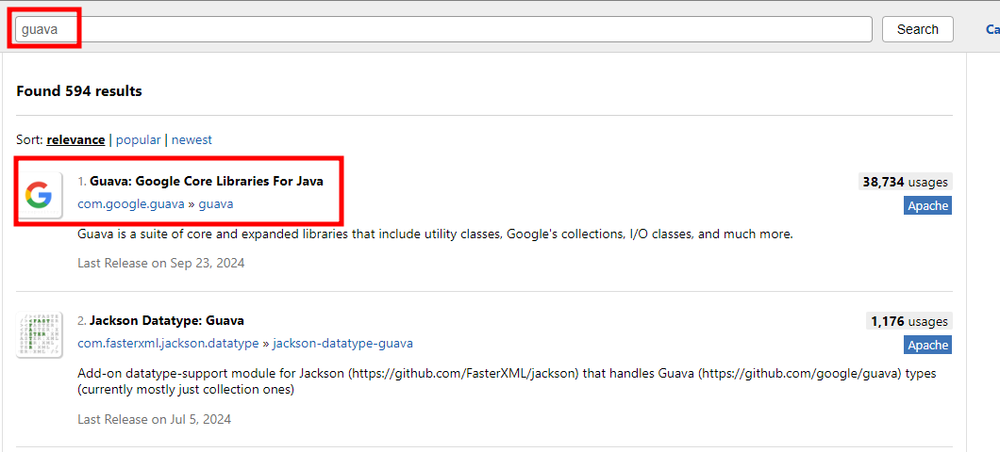
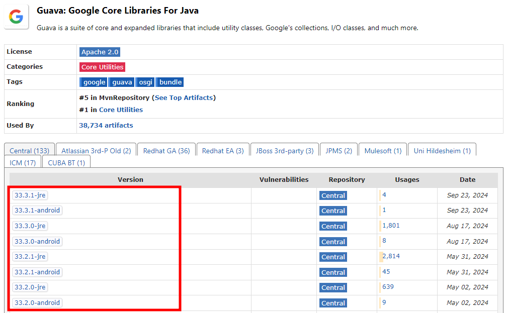
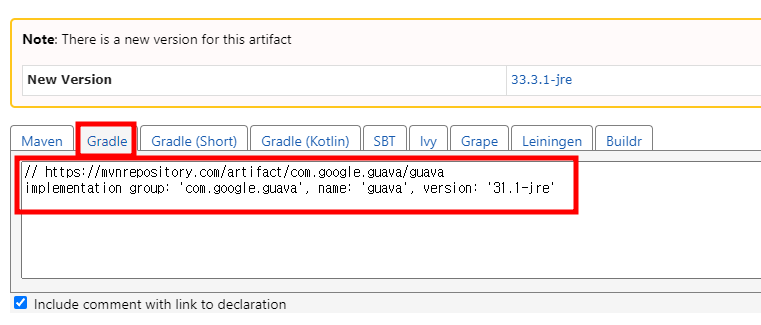
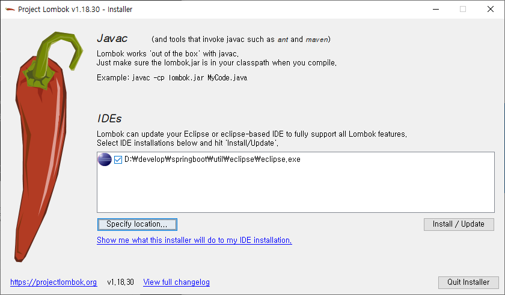
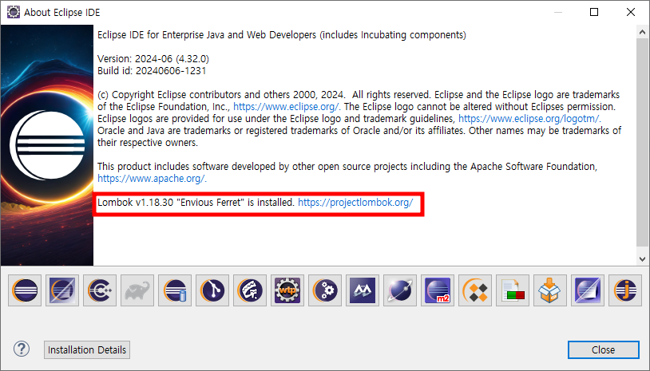
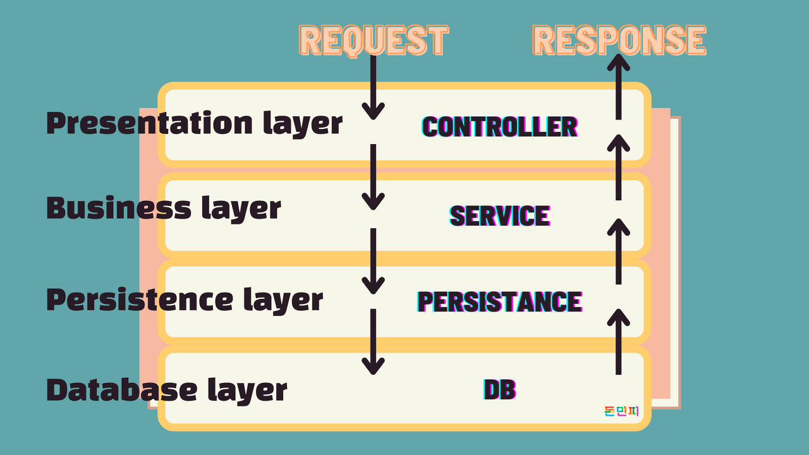
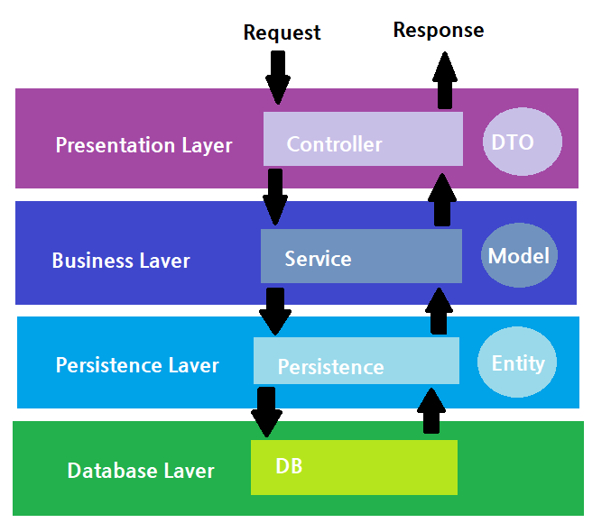

# Gradle
- **Gradle**은 자바, 코틀린, 그루비(Groovy) 등 다양한 프로그래밍 언어를 지원하는 **빌드 자동화 도구**이다. 
- Gradle은 의존성 관리, 테스트 실행, 배포, 패키징 등의 빌드 작업을 자동화하며, **유연성**과 **확장성**을 중시한다.
- 특히 **멀티 프로젝트 빌드**와 **병렬 빌드**에 강력한 성능을 발휘하며, 자바 기반 프로젝트에서는 Maven이나 Ant의 대안으로 많이 사용된다.

### Gradle의 주요 특징

1. **의존성 관리**:
   - Gradle은 Maven Central, JCenter, Ivy 같은 **의존성 저장소**에서 외부 라이브러리를 쉽게 가져와 사용할 수 있도록 도와준다.
   - 이를 통해 개발자는 필요한 라이브러리를 직접 다운로드하지 않고, 빌드 시 자동으로 라이브러리를 다운로드하고 관리할 수 있다.

2. **DSL (Domain-Specific Language)**:
   - Gradle은 빌드 스크립트를 작성할 때 **그루비(Groovy)** 또는 **코틀린(Kotlin)** 기반의 DSL을 사용한다. 
   - 이 DSL을 사용해 빌드 로직을 간결하고 유연하게 작성할 수 있다.
   - `build.gradle` 파일에 그루비 기반으로 빌드 설정을 작성하거나, `build.gradle.kts` 파일에 코틀린 기반으로 작성할 수 있다.

3. **멀티 프로젝트 빌드**:
   - Gradle은 여러 프로젝트를 하나로 묶어 **멀티 프로젝트 빌드**를 지원합니다. 
   - 대규모 애플리케이션 개발 시 여러 모듈을 독립적으로 빌드하면서, 이들 간의 의존성을 쉽게 관리할 수 있다.

4. **병렬 빌드**:
   - Gradle은 **병렬 빌드**를 지원하여 여러 작업을 동시에 처리할 수 있습니다. 이를 통해 빌드 시간을 크게 단축할 수 있습니다.

5. **플러그인 시스템**:
   - Gradle은 다양한 **플러그인**을 제공하여 빌드 작업을 확장할 수 있습니다. 특히 자바, 스프링 부트, 안드로이드 개발에서 유용한 플러그인이 많이 사용됩니다.
   - 예: `java` 플러그인, `application` 플러그인, `spring-boot` 플러그인, `kotlin` 플러그인 등.

6. **유연성**:
   - Gradle은 빌드 과정을 매우 세밀하게 제어할 수 있는 유연성을 제공합니다. 필요한 경우 Ant와 같은 다른 빌드 도구와 함께 사용할 수도 있습니다.


## **`build.gradle`**
- 프로젝트의 주요 빌드 설정을 정의하는 파일입니다. 여기에 의존성, 플러그인, 태스크(작업) 등을 정의할 수 있습니다.

### plugins
- Gradle에서 빌드 작업을 확장하고 자동화할 수 있도록 해주는 기능이다.
- 플러그인을 통해 다양한 기능을 추가할 수 있는데, 프로젝트에 필요한 빌드 작업이나 설정을 플러그인을 통해 쉽게 적용할 수 있다.
- 여러 작업을 미리 정의해둔 기능 모음이라고 생각하면 된다.
```groovy
plugins {
	id 'java' //자바 프로젝트에서 필수적인 빌드 작업들을 제공하는 플러그인이다.자바 코드를 컴파일하고, 테스트 코드를 실행하며, JAR 파일을 생성하는 작업을 자동으로 처리해준다.
	id 'org.springframework.boot' version '3.2.10'//스프링 부트 관련 종속성을 관리하고, 스프링 부트 애플리케이션을 패키징하거나 실행하는 데 필요한 작업들을 자동으로 제공해준다.
	id 'io.spring.dependency-management' version '1.1.6'//라이브러리나 플러그인의 의존성 버전을 쉽게 관리하고, 중복된 의존성이나 버전 충돌 문제를 방지해준다.
}
```
### group
- 프로젝트의 그룹 ID를 설정한다.

### version
- 프로젝트 버전을 설정한다.
- SNAPSHOT은 아직 완성되지 않은 버전이라는 의미로 자주 사용된다.
```groovy
group = 'com.example'
version = '0.0.1-SNAPSHOT'
```
### 자바 버전 설정(toolchain)
- 자바 버전 17을 사용하도록 설정하는 부분이다. 
- Gradle은 toolchain을 통해 명시적으로 자바 버전을 관리할 수 있다. 
- 이 설정을 통해 자바 17 버전의 컴파일러와 런타임 환경에서 프로젝트가 빌드되도록 한다.
```groovy
java {
	toolchain {
		languageVersion = JavaLanguageVersion.of(17)
	}
}
```
### Configuration 설정
- 이 설정은 컴파일할 때만 사용되는 의존성 설정이다.
```groovy
configurations {
	compileOnly {
		extendsFrom annotationProcessor
	}
}
```

### 저장소 설정
- Gradle이 라이브러리를 다운로드 하는 곳을 레포지토리라고 한다.
- Maven Central을 주로 사용한다.
- 메이븐센트럴은 https://mvnrepository.com/repos/central이다.

```groovy
repositories {
	mavenCentral()
}
```
### 의존성 설정
- implementation: 프로젝트에서 런타임에 사용될 라이브러리를 정의한다.
    - spring-boot-starter-data-jpa: 스프링 부트에서 JPA(자바 퍼시스턴스 API)를 사용하기 위한 의존성이다.
    - spring-boot-starter-web: 웹 애플리케이션 개발을 위한 의존성이다. REST API, 웹 MVC 등을 지원한다.
    - com.google.guava:guava: 구글의 유명한 라이브러리인 Guava를 추가했다. 주로 컬렉션, 문자열 처리 등의 유틸리티 기능을 제공한다.
- compileOnly: 컴파일 시에만 필요한 라이브러리이다. 주로 애노테이션 프로세서를 사용하지만, 런타임에는 포함되지 않는다.
    - org.projectlombok:lombok: Lombok은 자바 코드에서 반복적인 Getter, Setter, 생성자 등을 자동으로 생성해주는 라이브러리이다. 컴파일 시에만 필요하다.
- runtimeOnly: 런타임에만 필요한 라이브러리를 정의한다.
    - com.h2database:h2: 내장형 데이터베이스 H2를 런타임에서 사용할 수 있도록 설정한다. 주로 테스트 환경이나 간단한 애플리케이션에서 사용된다.
- annotationProcessor: 컴파일 타임에 애노테이션을 처리하는 라이브러리다. Lombok 같은 애노테이션 프로세서를 등록하는 곳이다.

- testImplementation: 테스트 코드를 실행할 때 필요한 라이브러리이다.
    - spring-boot-starter-test: 스프링 부트에서 JUnit과 같은 테스트 기능을 제공하는 의존성이다.
- testRuntimeOnly: 테스트 환경에서만 사용할 수 있는 라이브러리이다.
    - junit-platform-launcher: JUnit 테스트 실행기이다.
```groovy
dependencies {
	implementation 'org.springframework.boot:spring-boot-starter-data-jpa'
	implementation 'org.springframework.boot:spring-boot-starter-web'
	compileOnly 'org.projectlombok:lombok'
	runtimeOnly 'com.h2database:h2'
	annotationProcessor 'org.projectlombok:lombok'
	testImplementation 'org.springframework.boot:spring-boot-starter-test'
	testRuntimeOnly 'org.junit.platform:junit-platform-launcher'
	// https://mvnrepository.com/artifact/com.google.guava/guava
	implementation group: 'com.google.guava', name: 'guava', version: '33.3.1-jre'
	
}
```
### 테스트 설정
- 테스트 설정
- JUnit 플랫폼을 사용해 테스트를 실행하도록 설정한다.
```groovy
tasks.named('test') {
	useJUnitPlatform()
}
```

## 디펜던시에 라이브러리 추가해보기
- Guava라이브러리 추가하기

### mvnrepository
- https://mvnrepository.com/로 이동해서 guava를 검색한다.



- 원하는 버전을 선택한다.
- 어떤 버전을 골라야할지 모르겠다면 이용자가 많은 버전을 사용하자.



- Gradle을 선택하고 아래코드를 누르면 클립보드에 복사가 된다.



- Gradle.build 파일의 dependencies부분에 붙혀넣기를 한다.

```groovy
dependencies {
	implementation 'org.springframework.boot:spring-boot-starter-data-jpa'
	implementation 'org.springframework.boot:spring-boot-starter-web'
	compileOnly 'org.projectlombok:lombok'
	runtimeOnly 'com.h2database:h2'
	annotationProcessor 'org.projectlombok:lombok'
	testImplementation 'org.springframework.boot:spring-boot-starter-test'
	testRuntimeOnly 'org.junit.platform:junit-platform-launcher'

	// https://mvnrepository.com/artifact/com.google.guava/guava
	implementation group: 'com.google.guava', name: 'guava', version: '31.1-jre'
}
```

## 롬복(Lombok)
- 롬복을 사용하면 더 이상 getter/setter, builder, constructor를 작성하는 데 시간을 소모할 피룡가 없다.
- 롬복이 제공하는 어노테이션 프로세서가 getter,setter,builder,constructor 프로젝트 컴파일 시 관련 코드를 자동으로 작성해준다.
- 따라서 롬복을 사용하면 코드의 양을 줄이고 개발 시간도 단축할 수 있다.
- 이클립스에서 롬복을 사용하려면 jar파일을 이용해 플러그인을 설치해야 한다.

### 이클립스에 롬복 설치
- 메이븐 레포지토리(https://mvnrepository.com/)에서 원하는 버전의 Jar를 받아온다.


- 다운로드가 완료되면 cmd를 열어 Jar파일이 다운로드된 디렉토리로 이동한 후 다음의 명령어로 롬복을 설치한다.

```
java -jar lombok-1.18.30.jar
```


- 롬복이 자동으로 이클립스를 찾지 못한다면 왼쪽 아래 버튼을 눌러 이클립스 실행파일을 찾아준다.



- 오른쪽 아래 install/update버튼을 눌러 설치를 진행하면 끝난다.


- Quit installer 버튼을 누른후 이클립스를 껐다가 재시작한다.

- build.gradle 파일에서 롬복이 잘 추가됐는지 확인한다.
```
annotationProcessor 'org.projectlombok:lombok'
compileOnly 'org.projectlombok:lombok'
```
- Help > About Eclipse IDE로 들어가 About 하단에서 Lombok 설치 여부를 확인한다.



### DemoModel.java파일 생성하기
```java
package com.example.demo;

import lombok.Builder;
import lombok.NonNull;
import lombok.RequiredArgsConstructor;

@Builder
@RequiredArgsConstructor
public class DemoModel {

	@NonNull
	String id;
}
```
- outline탭에 다음과 같이 나오면 롬복이 잘 적용이 된것이다.


### 만약 적용이 잘 안될 시
- 프로젝트 우클릭 > Properties > Java Compiler > Annotation Processing
- Enable project specific settings 체크하고 저장하기

## 포스트맨 API 테스트
- REST API는 크게 나눠 URI, HTTP메섣, 요청 매개변수 또는 요청바디로 구분도는데, 이를 브라우저에서 테스팅하는 것에는 한계가 있다.
- 테스트를 한다고 임시로 프론트엔드 UI를 만드는 것은 지속가능한 방법이 아니다.
- 사용이 간편하고 직관적인 GUI를 제공하는 포스트맨이라는 프로그램을 사용한다.
- 포스트맨을 사용하면 간단히 RESTful API를 테스트 할 수 있다.
- 또 테스트를 저장해 API 스모크 테스팅 용으로 사용할 수 있다.

### 포스트맨 설치하기
- https://www.postman.com/downloads/에서 다운후 설치해보자.

- +버튼을 누르면 새요청을 작성할 수 있다.
- 우리의 부트 어플리케이션을 실행한 후 포스트맨을 이용해 localhost:9090을 요청하고 결과를 보자.

# 백엔드 서비스 아키텍처

## 레이어드 아키텍처 패턴
- 애플리케이션을 구성하는 요소들을 수평으로 나눠 관리하는 것이다.



- 레이어로 나눈다는 것은 메서드를 클래스 또는 인터페이스로 쪼개는 것이다.
- 이 레이어는 작게는 클래스를 여러 레이어로 나누는 것부터 아주 다른 애플리케이션으로 분리하는 경우까지 범위가 다양하다.
- 레이어 사이에는 계층이 있다.
- 레이어는 자기보다 한 단계 하위의 레이어만 사용한다.
- 중간 레이어를 섞어 사용하는 경우도 있지만 기본적안 레이어드 아키텍처에서는 상위 레이어가 자신의 바로 하위 레이어를 사용한다.

```java
public class TodoService{
    public List<Todo> getTodos(String userId){
        List<Todo> todos = new ArrayList<>();

        //... 비즈니스로직

        return todos;
    }
}

public class WebController{

    private TodoService todoService;

    public String getTodos(Request request){
        if(request.userId == null){
            JSONObject json = new JSONObject();
            json.put("error","missing user id");
            return json.toString();
        }

        //서비스레이어
        List<Todo> todos = todoService.getTodos(request.userId);

        return this.getResponse(todos);
    }

}
```

## 모델,엔티티,DTO



- 보통 자바로 된 비즈니스 애플리케이션의 클래스는 두 가지 종류로 나눌 수 있다.
- 첫 번재는 일을 하는 클래스, 즉 기능을 수행하는 클래스이다.
- 두 번재는 데이터를 담는 클래스이다.
- 일을 하는 클래스는 컨트롤러,서비스,퍼시스턴스 처럼 로직을 수행하는 클래스이다.
- 우리는 대부분의 시간을 컨트롤러, 서비스, 퍼시스선스 로직을 구현하는데 사용한다.
- 데이터를 담는 클래스란 말 그대로 데이터만 가지고 있는 클래스이다.
- 위 예제에서  TodoService는 List를 반환한다.
- 이는 Todo객체를 담고있는 리스트이다.
- Todo객체는 기능이 없고 DB에서 반환된 정보를 갖고 있을 뿐이다.
- 이렇게 아무 기능 없이 DB에서 반환된 데이터를 담기 위한 클래스를 엔티티,모델, DTO라고 부른다.
- 이름에 큰 의미를 둘 필요는 없고 무엇을 위한 클래스인지가 중요하다.

## 모델과 엔티티
- 모델은 데이터를 담는 역할과 DB의 테이블과 스키마를 표현하는 두 역할을 한다.
- com.example.demo아래 model 패키지를 생성한다.
- 패키지 아래 TodoEntity클래스를 생성한다.

```java
package com.example.demo.model;

import lombok.AllArgsConstructor;
import lombok.Builder;
import lombok.Data;
import lombok.NoArgsConstructor;

@Builder
@NoArgsConstructor
@AllArgsConstructor
@Data
public class TodoEntity {
	private String id; //이 객체의 id
	private String userId;//이 객체를 생성한 유저의 아이디
	private String title;//Todo 타이틀 예)운동 하기
	private boolean done;//true - todo를 완료한 경우(checked)
}

```
### @Builder
- 객체 생성을 위한 디자인 패턴 중 하나이다.
- 롬복이 제공하는 @Builder 어노테이션을 사용하면 우리가 Builder클래스를 따로 개발하지 않고도 Builder패턴을 사용해 객체를 생성할 수 있다.

```java
TodoEntity todo = TodoEntity.builder()
                .id("t-10328373")
                .userId("developer")
                .title("Implement Model")
                .build()
```

### @NoArgsConstructor
- 매개변수가 없는 생성자를 구현해준다.

```java
public TodoEntity(){

}
```

### @AllArgsConstructor
- 클래스의 모든 멤버를 매개변수로받는 생성자를 구현해준다.

```java
public TodoEntity(String id, String userId, String title, boolean done){
    this.id = id;
    this.userId = userId;
    this.title = title;
    this.done = done;
}
```

### @Data
- 멤버 변수의 Setter와 Getter 메서드를 구현해준다.
```java
public String getId() {
		return id;
	}
	public void setId(String id) {
		this.id = id;
	}
	public String getUserId() {
		return userId;
	}
	public void setUserId(String userId) {
		this.userId = userId;
	}
	public String getTitle() {
		return title;
	}
	public void setTitle(String title) {
		this.title = title;
	}
	public boolean isDone() {
		return done;
	}
	public void setDone(boolean done) {
		this.done = done;
	}
```

## DTO(Data Transition Object)
- 서비스가 요청을 처리하고 클라이언트로 반환할 때, 모델 자체를 그래도 반환하는 경우는 별로 없다.
- 보통은 데이터를 전달하기 위해 사용하는 객체인 DTO로 변환해 반환한다.

### DTO로 변환하여 반환하는 이유
1. 비즈니스 로직을 캡슐화 하기 위함이다.
    - 대부분의 회사들은 외부인이 자사의 DB의 스키마를 아는 것을 원치 않는다.
    - 이때 DTO처럼 다른 객체로 바꿔 반환하면 외부 사용자에게 서비스 내부의 로직, DB 구조등을 숨길 수 있다.
2. 클라이언트가 필요한 정보를 모델이 전부 포함하지 않는 경우가 많다.
   - 대표적으로 에러 메시지가 있다.
   - 만약 서비스 실행 도중 유저 에러가 나면 이 에러 메시지를 어디에 포함해야 하는가?
   - 모델은 서비스 로직과는 관련이 없기 때문에 모델에 담기는 애매하다.
   - 이런 경우 DTO에 에러 메시지 필드를 선언하고 DTO에 포함하면 된다.

### com.example.demo아래에 dto패키지 생성하기
- 패키지 아래 TodoDTO클래스를 생성한다.
```java
package com.example.demo.dto;

import com.example.demo.model.TodoEntity;

import lombok.AllArgsConstructor;
import lombok.Builder;
import lombok.Data;
import lombok.NoArgsConstructor;

@Builder
@NoArgsConstructor
@AllArgsConstructor
@Data
public class TodoDTO {
	private String id;
	private String title;
	private boolean done;
	
	public TodoDTO(final TodoEntity entity) {
		this.id = entity.getId();
		this.title = entity.getTitle();
		this.done = entity.isDone();
	}
	
}
```
- TodoDTO에는 userId가 없다.
- 이 프로젝트에서는 이후 스프링 시큐리티를 이용해 인증을 구현한다.
- 따라서 유저가 자기 아이디를 넘겨주지 않아도 인증이 가능하다.
- userId는 애플리케이션과 DB에서 사용자를 구별하기 위한 고유 식별자로 사용하기 때문에 숨길 수 있다면 숨기는 것이 보안상 맞다.
- 따라서 DTO에서는 userId를 포함하지 않았다.

### ResponseDTO 클래스 생성하기
- http응답으로 사용할 DTO를 만들어보자

```java
package com.example.demo.dto;

import java.util.List;

import lombok.AllArgsConstructor;
import lombok.Builder;
import lombok.Data;
import lombok.NoArgsConstructor;

@Builder
@NoArgsConstructor
@AllArgsConstructor
@Data
public class ResponseDTO<T> {

	private String error;
	private List<T> data;
}
```
- TodoDTO 뿐만 아니라 이후 다른 모델의 DTO도 ResponseDTO를 이용해 반환할 수 있도록 제네릭을 사용했다.
- 이 프로젝트의 경우는 Todo객체를 하나만 반환하기 보다는 리스트를 반환하는 경우가 많으므로 리스트로 반환하도록 구성을 했다.


## REST 아키텍처
- 클라이언트가 우리 서비스를 이용하려면 어떤 형식으로 요청을 보내고 응답을 받는지에 대한 이야기이다.
- 클라이언트는 정해진 메서드로 우리 서비스를 이용할 예정이다.
- REST 아키텍처 스타일을 따라 설계하고 구현된 서비스를 RESTful 서비스라고 한다.
```
- 스프링은 우리가 레이어드 아키텍처 패턴이나 REST 아키텍처 스타일을 이용하는데 도움을 주는 어노테이션을 제공한다.
- 우리는 이 어노테이션을 이용해 테스팅용 API를 구현하고, 전체적인 틀을 이해한 후 본격적으로 Todo 서비스를 만들어보자.
```