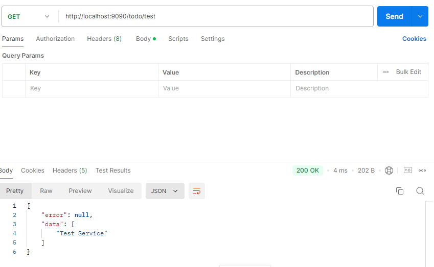

# 서비스 레이어
 - 서비스레이어는 컨트롤러와 퍼시스턴스 사이에서 비즈니스 로직을 수행하는 역할을 한다.
 - HTTP와 긴밀히 연결된 컨느롤러에서 분리돼 있고, 또 데이터베이스와 긴밀히 연관된 퍼시스턴스와도 분리되어 있다.
 - 따라서 서비스 레이어에서는 우리가 개발하고자 하는 로직에 집중할 수 있다.

## com.example.demo.service 패키지 생성하기
- TodoService클래스 만들기

## @Service
- 스프링 프레임워크에서 제공하는 애노테이션 중 하나로, **서비스 레이어(Service Layer)**에 사용되는 클래스를 명시할 때 사용된다.
- 이 애노테이션을 사용하면 스프링이 해당 클래스를 **스프링 컨테이너에서 관리하는 빈(bean)**으로 등록하고, 비즈니스 로직을 처리하는 역할을 맡는다.

### 주요기능과 역할
1. 비즈니스 로직을 담당하는 클래스 표시
   - @Service는 주로 비즈니스 로직을 처리하는 클래스에 붙인다. 
   - 이 클래스는 데이터 액세스, 계산, 트랜잭션 처리 등의 주요 작업을 수행한다.
   - 서비스 레이어는 **컨트롤러(프레젠테이션 레이어)**와 퍼시스턴스(영속 레이어) 간의 중간 계층으로, 복잡한 비즈니스 규칙을 처리하는 데 사용된다.

2. 스프링 빈으로 등록
    - @Service 애노테이션이 붙은 클래스는 **스프링 빈(Bean)**으로 등록되어 **DI(Dependency Injection, 의존성 주입)**를 통해 다른 클래스에서 주입(injection)될 수 있다.
    - 즉, 스프링은 애플리케이션이 실행될 때 이 클래스의 객체를 생성하고 관리하며, 다른 컴포넌트에서 필요할 때 자동으로 주입해준다.

3. 계층 구조의 명확성
   - @Service는 계층화된 아키텍처에서 서비스 레이어의 역할을 명확하게 구분하는 데 도움을 준다. 
   - 이를 통해 각 레이어의 책임을 분리하고, 코드의 가독성과 유지보수성을 향상시킨다.
   - 스프링은 @Service, @Repository, @Controller 등을 통해 각 클래스가 어떤 역할을 하는지 직관적으로 알 수 있게 해준다.

```java
package com.example.demo.service;

import org.springframework.stereotype.Service;

@Service
public class TodoService {

	public String testService() {
		return "Test Service";
	}
}
```
- 서비스를 만들었으니, 이 서비스를 사용하기 위해 TodoController에 추가해주자.

## TodoContoller클래스에 코드 추가하기
```java
package com.example.demo.controller;

import java.util.ArrayList;
import java.util.List;

import org.springframework.beans.factory.annotation.Autowired;
import org.springframework.http.ResponseEntity;
import org.springframework.web.bind.annotation.GetMapping;
import org.springframework.web.bind.annotation.RequestMapping;
import org.springframework.web.bind.annotation.RestController;

import com.example.demo.dto.ResponseDTO;
import com.example.demo.service.TodoService;

@RestController
@RequestMapping("todo")
public class TodoController {

	@Autowired
	private TodoService service;
	
	@GetMapping("/test")
	public ResponseEntity<?> testTodo(){
		String str = service.testService();//테스트 서비스 사용
		List<String> list = new ArrayList<>();
		list.add(str);
		ResponseDTO<String>response = ResponseDTO.<String>builder().data(list).build();
		return ResponseEntity.ok().body(response);
		
	}
}
```
- 애플리케이션을 재시작하고 포스트맨을 이용해 GET localhost:9090/todo/test 요청을 보내보자
- "Test Service"를 담은 ResponseDTO가 반환되는 모습을 볼 수 있다.



## 퍼시스턴스 레이어 : 스프링 데이터 JPA
- 우리 애플리케이션은 Todo 아이템을 DB에 저장해야 한다.
### 관계형 데이터베이스를 자바와 연결하려면 어떻게 해야하는가?
1. DBMS를 설치해야 한다. 
   - MYSQL이라면 Workbench같은 MySQL 클라이언트를 설치한다.
   - 클라이언트는 데이터베이스에 연결하는 작업을 도와준다.
   - 클라이언트를 이용해 데이터베이스에 연결되면 쿼리를 작성한다.
```sql
create table if not exists Todo(
    id varchar2(100) NOT NULL PRIMARY KEY,
    userId varchar2(100) NOT NULL,
    title varchar2(100) NOT NULL,
    done boolean DEFAULT false
)
```
2. 테이블을 생성하고 아이템을 몇 개 넣었다고 가정하자.
    - 우리는 이후 아이템을 검색하기 위해 SELECT쿼리를 날린다.
```SQL
SELECT id, title, done
FROM Todo
WHERE id="ff80808177"
```
3. 쿼리를 날리면 조건에 맞는 결과가 반환된다
4. 우리는 이렇게 반환된 결과를 자바 애플리케이션 내에서 사용해야 한다.
5. 이뿐만 아니라 테이블을 생성하는 것도, 테이블에 엔트리를 추가하는것도, 수정, 삭제하는것도 다 웹 서비스의 일부로 동작해야 한다.
6. JDBC드라이버를 통해 자바와 연결을 한다.

```JAVA
String sqlSelectAllTodos="SELECT * FROM Todo where USER_ID= "+request.getUserId();
String connectionUrl="jdbc:mysql://mydb:3306/todo";
try{
    //1.데이터베이스에 연결
    Connection conn = DriverManager.getConnection(connectionUrl, "username","password");
    //2. SQL쿼리 준비
    PreparedStatement ps = conn.preparedStatement(sqlSelectAllTodos);
    //3. 쿼리 실행
    ResultSet rs = ps.executeQuery();

    //결과를 객체로 파싱
    while(rs.next()){
        long id = rs.getString("id");
        String title = rs.getString("title");
        Boolean isDone = rs.getBoolean("done");

        todos.add(new Todo(id,title,isDone));
    } catch(SQLException e){
        //handle the exception
    }
}
```
- Connection을 이용해 데이터베이스에 연결하고 쿼리문을 ResultSet클레스에 결과를 담아온다.
- 그리고 While문 내부에서 ResultSet을 Todo객체로 바꾼다.
- 이 일련의 작업을 ORM(Object-Relation-Mapping)이라고 한다.
7. 테이블을 자바 내에서 사용하기 위해 이 작업을 엔티티마다 해야한다. 보통 테이블 하나마다 그에 상응하는 엔티티클래스가 존재한다.
8. 또 이런 작업을 집중적으로 해주는 DAO클래스를 작성해야 한다.
9. 시간이 흐르면서 반복작업을 줄이기 위해 Hibernate와 같은 ORM프레임워크가 나왔고, 더 나아가 JPA같은 도구들이 개발됐다.

## 데이터베이스와 스프링 데이터 JPA 설정
1. 데이터베이스에 연결하기 위해서는 데이터베이스가 필요하다.
2. 우리는 프로젝트를 생성할 때 H2를 추가했었다.

## H2 데이터베이스 관리 시스템
- 자바 기반의 **경량형 관계형 데이터베이스 관리 시스템(RDBMS)**이다.
- 주로 개발 및 테스트 환경에서 사용되며, 메모리 기반 데이터베이스나 디스크 기반 데이터베이스로 구성할 수 있다.
- H2는 오픈 소스로 제공되며, 빠르고 가벼운 성능 때문에 애플리케이션 개발 시 간편하게 데이터베이스를 설정하고 사용할 수 있다.

### 주요 특징
1. 메모리 기반과 디스크 기반 지원
   1. 메모리 기반 데이터베이스: 애플리케이션이 실행되는 동안에만 데이터베이스가 유지되며, 애플리케이션이 종료되면 데이터가 사라진다. 
      1. 개발 및 테스트에 유용하다.
   2. 디스크 기반 데이터베이스: 데이터가 영구적으로 저장되며, 애플리케이션이 종료되어도 데이터를 유지한다.

2. 자바 기반
   1. H2는 자바로 작성된 데이터베이스 엔진으로, 자바 애플리케이션과의 통합이 매우 용이하다. 
   2. JAR 파일로 제공되며, 자바 애플리케이션에서 쉽게 임베드할 수 있다.
3. SQL 표준 지원
   1. H2는 표준 SQL을 지원하므로, 다른 데이터베이스 시스템(MySQL, PostgreSQL 등)에서 사용되는 SQL 문을 대부분 동일하게 사용할 수 있다.

4. 내장형 및 서버 모드
   1. 내장형 모드: H2 데이터베이스를 애플리케이션 내부에 임베드하여 사용할 수 있다. 
        - 이 모드에서는 애플리케이션 내에서만 데이터베이스에 접근 가능하다.
   2. 서버 모드: H2를 독립된 데이터베이스 서버로 설정하여 네트워크를 통해 여러 클라이언트가 접근할 수 있게 할 수 있다.

5. 간편한 설정 및 사용
   1. 설정이 매우 간단하며, 스프링 부트와 같은 프레임워크에서 별도의 설정 없이도 인메모리 데이터베이스로 바로 사용할 수 있다.
   2. 웹 기반의 H2 콘솔(http://localhost:9090/h2-console에 접속하면, SQL 쿼리를 직접 실행하거나 데이터를 조회할 수 있다.)을 제공하여, 브라우저를 통해 데이터베이스에 쉽게 접근하고 SQL 쿼리를 실행할 수 있다.

6. 빠른 성능
   1. H2는 메모리 기반으로 동작할 때 매우 빠른 성능을 제공하며, 디스크 기반에서도 경량화된 구조로 효율적인 성능을 제공한다.

## Hibernate
- Java 기반의 ORM(Object-Relational Mapping) 프레임워크로, 객체지향 프로그래밍 언어인 자바에서 데이터베이스를 다룰 때 객체와 관계형 데이터베이스 간의 매핑을 자동으로 처리해주는 도구다.
- 이를 통해 개발자는 SQL을 직접 작성할 필요 없이, 자바 객체를 통해 데이터베이스 작업을 쉽게 수행할 수 있다.

### 주요 기능과 개념
1. HQL(Hibernate Query Language)
   - Hibernate는 SQL을 직접 사용하지 않고, HQL이라는 Hibernate 전용 쿼리 언어를 제공한다. 
   - HQL은 SQL과 유사하지만, 테이블이 아니라 객체를 대상으로 쿼리를 작성한다.
   - 예를 들어, HQL에서 FROM User WHERE id = 1이라고 작성하면, Hibernate는 이를 SQL로 변환하여 SELECT * FROM users WHERE id = 1과 같은 SQL을 실행한다.
2. 자동 테이블 생성 및 관리
   - Hibernate는 애플리케이션 실행 시 자바 엔티티 클래스와 대응하는 데이터베이스 테이블을 자동으로 생성하거나 업데이트할 수 있다.
   - Hibernate가 제공하는 DDL(Data Definition Language) 기능을 통해 이루어진다.
   - 설정에 따라 테이블 생성, 수정, 삭제 등 다양한 작업을 자동으로 처리할 수 있다.

### 장점
1. 생산성 향상
    - 개발자가 SQL 쿼리를 직접 작성하지 않고 객체 지향 방식으로 데이터베이스를 다룰 수 있게 하여, 개발 시간을 단축하고 코드의 가독성을 높여준다.
2. 데이터베이스 독립성
    - 데이터베이스에 의존하지 않고 동작하기 때문에, 데이터베이스 독립적으로 사용할 수 있다.
    - 애플리케이션이 MySQL에서 Oracle로 변경되더라도 별도의 SQL 수정 없이 쉽게 전환할 수 있다.
3. 자동화된 테이블 관리
    - 애플리케이션의 엔티티 클래스를 분석하여 데이터베이스의 테이블을 자동으로 생성, 업데이트, 삭제할 수 있다.
    - 개발자는 데이터베이스 스키마를 관리하는 수고를 덜 수 있다.
4. 복잡한 관계 매핑 지원
    - 1대1(One-to-One), 1대N(One-to-Many), **N대M(Many-to-Many)**와 같은 복잡한 엔티티 간의 관계를 쉽게 매핑할 수 있도록 한다.

### 단점
1. 학습 곡선
    - 복잡한 쿼리나 성능 최적화를 위한 설정은 처음 사용자가 이해하기 어려울 수 있다.
2. 성능 문제
    - 잘못된 설정이나 비효율적인 지연 로딩 사용은 성능 문제를 일으킬 수 있다.
    - SQL을 자동으로 생성하지만, 이를 충분히 이해하지 않고 사용할 경우 예상치 못한 성능 저하가 발생할 수 있다.
3. ORM과 SQL 간의 불일치
    - 객체 지향적인 자바의 모델링 방식과 데이터베이스의 관계형 모델링 방식은 서로 다르다.
    - 복잡한 관계의 매핑에서는 여전히 ORM과 SQL 간의 불일치 문제가 존재할 수 있다.

## JPA(Java Persistence API)
- 자바에서 객체와 관계형 데이터베이스 간의 데이터를 매핑(ORM: Object-Relational Mapping)하기 위한 표준 API다.
- JPA는 자바 객체를 데이터베이스의 테이블과 매핑하고, 데이터베이스의 데이터를 자바 객체로 변환하여 쉽게 다룰 수 있게 해준다.
- 이를 통해 개발자는 데이터베이스의 세부 사항에 구애받지 않고 객체 지향적으로 데이터베이스를 처리할 수 있다.

### 주요 개념
1. ORM(Object-Relation Mapping)
    - JPA는 자바 객체와 데이터베이스의 테이블을 매핑한다.
    - JPA 자체는 인터페이스와 명세만 제공하며, 실제 기능을 수행하는 구현체는 포함되어 있지 않다.
    - 자바 객체를 데이터베이스의 테이블로, 객체의 필드를 테이블의 컬럼으로 매핑함으로써, 객체 지향적인 방식으로 데이터베이스 작업을 수행할 수 있다.
    - 예를 들어, 데이터베이스의 사용자 테이블을 User 객체와 매핑할 수 있으며, 데이터베이스에 쿼리를 작성하지 않고도 자바 코드로 데이터를 처리할 수 있다.
2. Persistence Context
    - JPA에서 엔티티(Entity) 객체를 관리하는 일종의 캐시 역할을 한다.
    - 이 컨텍스트를 통해 엔티티 객체를 추적하고, 변경된 내용을 자동으로 데이터베이스에 반영한다.
    - JPA는 객체를 영속성 컨텍스트에서 관리하고, 이를 통해 트랜잭션 내에서 데이터베이스 작업을 처리한다.
3. Entity
   - JPA에서 관리되는 자바 객체를 **엔티티(Entity)**라고 한다.
   - 엔티티 클래스는 데이터베이스의 테이블과 매핑되며, 객체의 속성은 테이블의 컬럼과 매핑된다.
   - 엔티티 클래스는 @Entity 애노테이션을 통해 정의된다.

## Spring DAta JPA
-  Spring Data JPA는 데이터베이스 작업을 더 쉽게 할 수 있도록 돕는 Spring Framework의 모듈이다.
-  Hibernate를 기반으로 사용하며, 데이터베이스 작업을 자동화하고, 데이터 액세스 로직을 단순화하는 데 중점을 둔다.
- Spring Data JPA는 Repository 패턴을 기반으로 하여, 데이터베이스와 상호작용할 때 개발자가 반복적으로 작성해야 하는 코드들을 자동으로 처리해준다.

```java
※ Repository 패턴 예시

//UserRepository는 사용자 데이터를 처리하는 Repository 인터페이스다.
//여기서 데이터베이스에 직접 접근하는 코드를 작성하지 않고, 데이터를 저장, 조회, 삭제하는 기능만 정의하고 있다.
public interface UserRepository {
    User findById(Long id);
    List<User> findAll();
    User save(User user);
    void deleteById(Long id);
}

//UserRepository 인터페이스를 구현하는 구현 클래스다.
//여기서 데이터를 저장하거나 조회하는 로직을 캡슐화한다.
import java.util.HashMap;
import java.util.List;
import java.util.ArrayList;
import java.util.Map;

public class UserRepositoryImpl implements UserRepository {
    private Map<Long, User> database = new HashMap<>();

    @Override
    public User findById(Long id) {
        return database.get(id);
    }

    @Override
    public List<User> findAll() {
        return new ArrayList<>(database.values());
    }

    @Override
    public User save(User user) {
        database.put(user.getId(), user);
        return user;
    }

    @Override
    public void deleteById(Long id) {
        database.remove(id);
    }
}
```

### 주요특징
1. Repository 기반 데이터 액세스
    - Spring Data JPA는 Repository 인터페이스를 기반으로 데이터베이스에 접근한다. 
    - 이 인터페이스를 확장함으로써 복잡한 데이터 액세스 코드를 작성하지 않고도 CRUD(Create, Read, Update, Delete) 작업을 자동으로 처리할 수 있다.
2. 자동화된 CRUD 작업
    - Spring Data JPA는 기본적인 CRUD 메서드를 자동으로 제공한다. 
    - JPA 인터페이스(JpaRepository)에서 제공하는 추상메서드들을 구현클래스에 Override할 필요없이 기본적인 데이터 베이스 작업을 처리할 수 있다.
    - #### JPARepository에서 제공하는 메서드
      - save(): 엔티티를 저장하거나 업데이트한다.
      - findById(): 기본 키를 사용해 엔티티를 조회한다.
      - deleteById(): 기본 키를 사용해 엔티티를 삭제한다.
      - findAll(): 모든 엔티티를 조회한다.
3. 쿼리 메서드(Query Method)
    - JPA 쿼리 메서드를 작성할 때 메서드 이름만으로 SQL 쿼리를 자동 생성할 수 있다. 
    - 메서드 이름을 분석하여 해당 메서드에 맞는 SQL 문을 실행한다.
    - 예를 들어, findByUsername(String username) 메서드는 자동으로 SELECT * FROM User WHERE username = ? 쿼리를 실행한다.

## TodoEntity클래스 수정하기
- 보통 데이터베이스 테이블마다 그에 상응하는 엔티티클래스가 존재한다고 했다.
- 우리 프로젝트에서는  Todo테이블에 상응하는 TodoEntity가 존재한다.
- 하나의 엔티티 객체는 데이터베이스 테이블의 한 행에 해당한다.
- 엔티티 클래스는 클래스 그 자체가 테이블을 정의해야 한다.
- ORM이 어떤 엔티티를 보고 어떤 테이블의 어떤 필드에 매핑해야 하는지 알 수 있어야 한다는 뜻이다.
- 또 어떤 필드가 기본키인지, 외래키인지 구분할 수 있어야 한다.
- 이런 데이터베이스 테이블 스키마에 대한 정보는 javax.persistence가 제공하는 JPA 관련 어노테이션을 사영혼다.

### 주의할 점
1. 클래스에는 매개변수가 없는 생성자가 필요하다.
2. Getter/Setter가 필요하다.
3. 세번째는 기본키를 지정해줘야 한다.


```java
package com.example.demo.model;

//이전 (JPA 2.x 버전까지): javax.persistence.Entity
//현재 (JPA 3.0 버전 이후): jakarta.persistence.Entity
import jakarta.persistence.Entity;
import lombok.AllArgsConstructor;
import lombok.Builder;
import lombok.Data;
import lombok.NoArgsConstructor;

@Builder
@NoArgsConstructor
@AllArgsConstructor
@Data
//자바 클래스를 엔티티로 지정하기 위해 사용한다.
//이름을 부여하고 싶다면 @Entity("TodoEntity") 처럼 매개변수를 넣을 수 있다.
@Entity

@Table(name="Todo")
public class TodoEntity {
    @Id/
	//@GeneratedValue(generator="system-uuid")
	//id값을 자동으로 생성해 넣어준다. system-uuid는 @GenericGenerator의 이름이다
	@GeneratedValue(generator="system-uuid")
	//@GenericGenerator
	//Hibernate가 제공하는 기본 Generator가 아닌 나만의 Generator를 사용하고 싶을 때 사용한다.
	@GenericGenerator(name="system-uuid", strategy="uuid")
	private String id; //이 객체의 id
	private String userId;//이 객체를 생성한 유저의 아이디
	private String title;//Todo 타이틀 예)운동 하기
	private boolean done;//true - todo를 완료한 경우(checked)	
}
```


## @Entity
- 테이블이름을 지정하기 위해 @Table 어노테이션을 사용한다.
- 이 엔티티는 데이터베이스의 Todo테이블에 매핑된다는 뜻이다.
- 만약 @Table을 추가하지 않거나, 추가해도 name을 명시하지 않는다면 @Entity의 이름을 테이블로 간주한다.
- 만약 @Entity에 이름을 지정하지 않는 경우 클래스의 이름을 테이블 이름으로 간주한다.

### 테이블이 자동으로 생성되는 원리
1. Hibernate가 엔티티 분석
    - 애플리케이션이 실행되면, Hibernate가 @Entity 어노테이션이 붙은 모든 클래스를 자동으로 검색하고 분석한다.
    - JPA는 각 엔티티 클래스의 필드, 애노테이션, 타입 등을 바탕으로 SQL DDL(데이터 정의 언어) 명령어를 생성하여 데이터베이스 테이블을 정의한다.
2. Hibernate가 테이블 생성
    - Hibernate는 이러한 정보를 바탕으로 **CREATE TABLE**과 같은 SQL 명령어를 생성하고, 데이터베이스에 테이블을 자동으로 생성한다.
3. spring.jpa.hibernate.ddl-auto 설정
    - Spring Boot와 같은 프레임워크에서는 **spring.jpa.hibernate.ddl-auto**라는 설정을 통해 테이블을 자동 생성, 업데이트 또는 삭제할 수 있다.
    - 이 설정이 없으면 Hibernate는 애플리케이션 실행 시 엔티티에 해당하는 테이블을 자동으로 생성하거나 업데이트한다.
<br>

- 이 기본 동작으로 인해, @Entity만 붙여도 데이터베이스에 대응하는 테이블이 자동 생성되는 것이다.

## @Id
- 기본키가 될 필드에 지정한다.

## @GeneratedValue(generator="system-uuid")
- @GeneratedValue는 JPA에서 기본 키 값을 자동으로 생성할 때 사용되는 어노테이션이다.
- generator="system-uuid"는 특정 키 생성 전략을 참조하겠다는 의미로, 주로 Hibernate에서 제공하는 커스텀 생성 전략을 사용할 때 사용된다.
- **@GeneratedValue**는 기본 키 값을 자동으로 생성하도록 하고, generator 속성은 커스텀 생성기를 참조하게 한다.
- 이 경우, **"system-uuid"**라는 이름의 생성기를 사용하여 UUID를 기본 키로 자동 생성하는 것이다.
## @GenericGenerator(name="system-uuid", strategy="uuid")
- **"system-uuid"**라는 이름의 커스텀 생성기를 정의하고, 그 생성 전략으로 UUID를 사용하도록 설정한다.
- 이로 인해, UUID 형식의 고유한 식별자가 기본 키로 자동 생성된다.

### UUID 생성방식
- Hibernate는 이 설정을 통해 UUID 4 방식을 사용하여 랜덤 UUID를 생성한다.
- 이는 128비트 크기의 고유 식별자로, 각 엔티티가 고유한 식별자를 가질 수 있게 해준다.
```
550e8400-e29b-41d4-a716-446655440000
```


# com.example.demo.persistence 패키지 생성하기
- 영속계층을 관리하기 위한 패키지를 생성한다.

## TodoRepository인터페이스 생성하기
```java
package com.example.demo.persistence;

import org.springframework.data.jpa.repository.JpaRepository;
import org.springframework.stereotype.Repository;

import com.example.demo.model.TodoEntity;

@Repository
public interface TodoRepository extends JpaRepository<TodoEntity, String>{

}

```

## @Repository
- 이 애노테이션은 주로 데이터베이스와 상호작용하는 클래스에서 사용되며, CRUD(Create, Read, Update, Delete)와 같은 데이터베이스 작업을 처리하는 데 사용된다.
- @Repository가 붙은 클래스는 자동으로 **Spring의 빈(bean)**으로 등록된다.
- 이 빈은 애플리케이션의 다른 계층(서비스 계층 등)에서 주입받아 사용할 수 있다.
- JpaRepository를 상속받는것과 같이 Spring Data JPA를 사용할 때는 @Repository는 자동으로 적용되기 때문에 생략할 수 있다.

## JpaRepository<T, ID>
- Spring Data JPA에서 제공하는 기본 인터페이스로, **JPA(Java Persistence API)**를 사용하여 데이터베이스 작업을 쉽게 처리할 수 있도록 도와주는 역할을 한다.
- 이 인터페이스는 CRUD(Create, Read, Update, Delete) 기능과 페이징, 정렬 같은 데이터 처리 기능을 기본적으로 제공한다.
- 데이터베이스와 상호작용하는 데 필요한 대부분의 작업을 자동으로 처리해준다.
- T는 엔티티 클래스(즉, 데이터베이스 테이블과 매핑되는 클래스)를 의미한다.
- ID는 엔티티 클래스의 기본 키 타입을 의미한다.

### 주요 메서드
- save(S entity) : 엔티티를 데이터베이스에 저장하거나 업데이트한다.
- findById(ID id): 기본 키를 이용하여 엔티티를 조회한다.
- findAll(): 데이터베이스의 모든 엔티티를 조회한다.
- deleteById(ID id): 기본 키를 이용하여 엔티티를 삭제한다.

## TodoService클래스에 의존성 주입하기
- TodoService클래스에서 TodoRepository인터페이스 의존성 주입하기

```java
package com.example.demo.service;

import org.springframework.beans.factory.annotation.Autowired;
import org.springframework.stereotype.Service;

import com.example.demo.model.TodoEntity;
import com.example.demo.persistence.TodoRepository;

@Service
public class TodoService {
	
	@Autowired
	private TodoRepository repository;

	public String testService() {
		//엔티티 생성
		TodoEntity entity = TodoEntity.builder().title("My first todo item").build();
		//TodoEntity 저장
		repository.save(entity);
		//TodoEntity 검색
        //findById(entity.getId()) : SELECT * FROM Todo WHERE id = ?;
		TodoEntity savedEntity = repository.findById(entity.getId()).get();
		return  savedEntity.getTitle();
	}
}
```
## Optional<T>
- findById()의 반환형이다.
- **Optional<T>**는 Java 8에 도입된 클래스로, null 값을 안전하게 처리하기 위해 사용된다.
- findById() 메서드는 조회 결과가 존재할 수도 있고, 존재하지 않을 수도 있기 때문에, null을 반환하는 대신 Optional을 사용하여 결과를 감싸서 반환한다.
- **Optional<T>**는 해당 엔티티가 존재하는지 여부를 확인하고, 존재하면 그 값을 반환하며, 존재하지 않을 경우에 대해 추가적인 처리를 할 수 있는 다양한 메서드를 제공한다.

### Optional<T>의 주요 메서드
1. isPresent() : 반환된 Optional 객체 안에 값이 존재하면 true, 존재하지 않으면 false를 반환한다.
```java
if (optionalTodo.isPresent()) {
    // 엔티티가 존재할 때 처리
}
```
2. get() : Optional 안에 값이 존재할 때, 그 값을 반환한다. 만약 값이 없는데 get()을 호출하면 NoSuchElementException이 발생할 수 있다.
```java
TodoEntity todo = optionalTodo.get();  // 값이 있을 때만 호출 가능
```
3. orElse(T other): 값이 존재하지 않을 때, 기본값을 반환한다.
```java
TodoEntity todo = optionalTodo.orElse(new TodoEntity());  // 없으면 새로운 엔티티 반환
```
4. orElseThrow(Supplier<? extends X> exceptionSupplier): 값이 없을 때, 예외를 던집니다.
```java
TodoEntity todo = optionalTodo.orElseThrow(() -> new RuntimeException("Todo not found"));
```
### 반환형이 Optional인 이유
- findById() 메서드의 반환형이 Optional<T>인 이유는 조회하려는 ID가 존재하지 않을 수 있기 때문이다.
- 데이터베이스에서 해당 ID로 엔티티를 찾을 수 없는 경우에도 Optional을 사용하면 null 값 처리로 인해 발생할 수 있는 **NullPointerException**을 방지할 수 있다.

## 테스트하기
- 수정된 서비스를 실행하고 포스트맨을 이용해 GET localhost:9090/todo/test 요청을 날려 보면 다음과 같은 응답을 돌려받는다.
```js
{
    "error":null,
    "data":[
        "My first todo item"
    ]
}
```

## 기본 쿼리와 작성 방법
- 기본적인 쿼리가 이는 쿼리는 어떻게 작성해야 할까?

## TodoRepository인터페이스에 추상메서드 추가하기
```java
package com.example.demo.persistence;

import java.util.List;

import org.springframework.data.jpa.repository.JpaRepository;
import org.springframework.stereotype.Repository;

import com.example.demo.model.TodoEntity;

@Repository
public interface TodoRepository extends JpaRepository<TodoEntity, String>{

    @Query("SELECT t FROM TodoEntity t where t.userId=?1")
	List<TodoEntity> findByUserIdQuery(String userId);
}
```
- 이 메서드를 작성하면 Spring Data JPA가  메서드의 이름을 파싱해서 SELECT * FROM Todo WHERE userid=?1"와 같은 쿼리를 작성해 실행한다.
- 메서드의 이름은 쿼리, 매개변수는 쿼리의 Where문에 들어갈 값을 의미한다.
- 더 복잡한 쿼리는 @Query어노테이션을 이용해 지정할 수 있다.

### JPQL (Java Persistence Query Language)
- JPA에서 사용하는 객체지향 쿼리 언어이다.
- 데이터베이스 테이블이 아닌 JPA 엔티티 객체를 대상으로 CRUD(생성, 조회, 수정, 삭제) 작업을 수행하는 쿼리를 작성할 수 있도록 설계되었다.

### JPQL의 특징
1. 객체 지향적
    - JPQL은 데이터베이스 테이블 대신 JPA 엔티티 객체를 대상으로 쿼리를 실행합니다.
    - 테이블 이름이나 컬럼 대신 **엔티티 클래스 이름과 필드를 사용**하여 쿼리를 작성한다.
    - 이 때문에, JPQL 쿼리는 데이터베이스 독립적이며, 데이터베이스의 스키마에 의존하지 않는다.
2. SQL과 유사한 구문
    - JPQL은 SQL과 매우 유사한 문법을 사용하지만, 엔티티 객체를 다룬다는 점에서 차이가 있다.
    - 예를 들어, SQL에서 SELECT * FROM users는 JPQL에서는 SELECT u FROM User u로 표현된다. 
    - 여기서 User는 데이터베이스 테이블이 아닌 엔티티 클래스를 의미한다.

