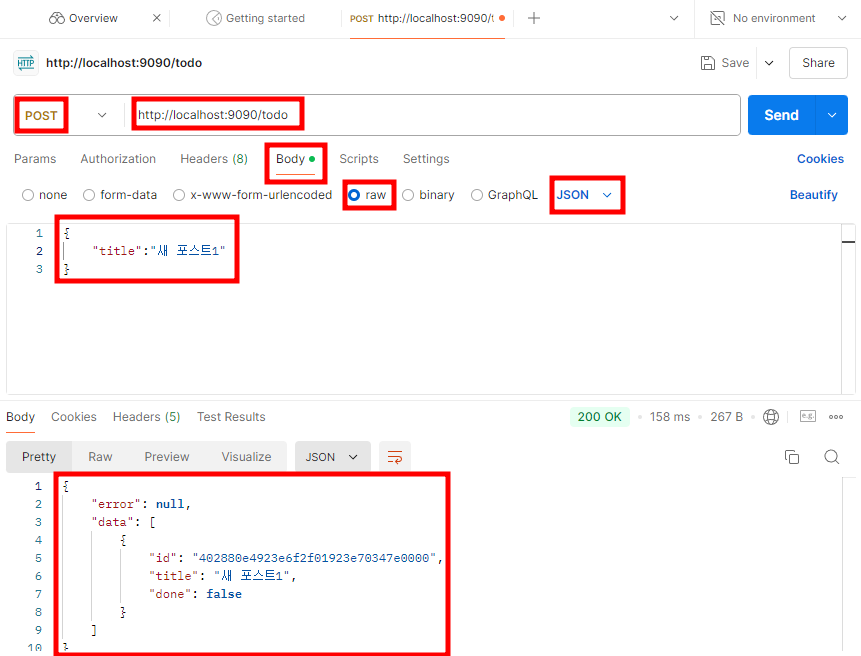
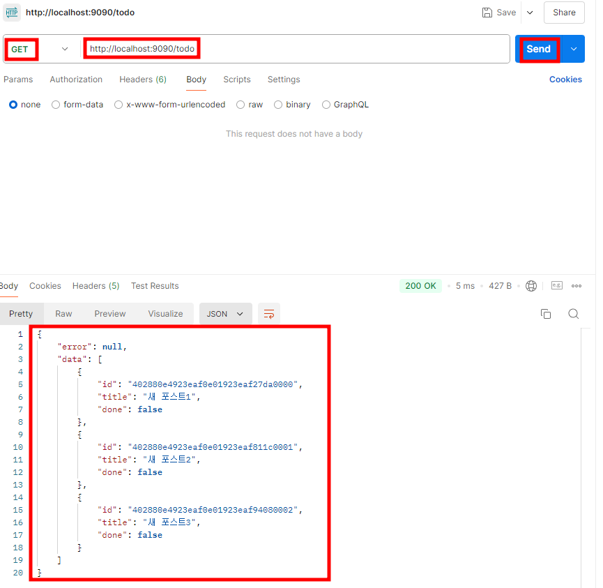
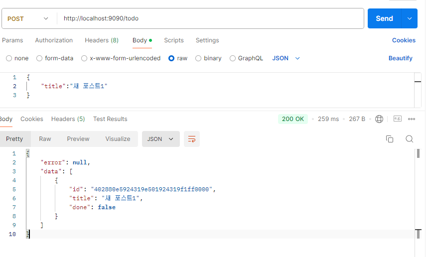
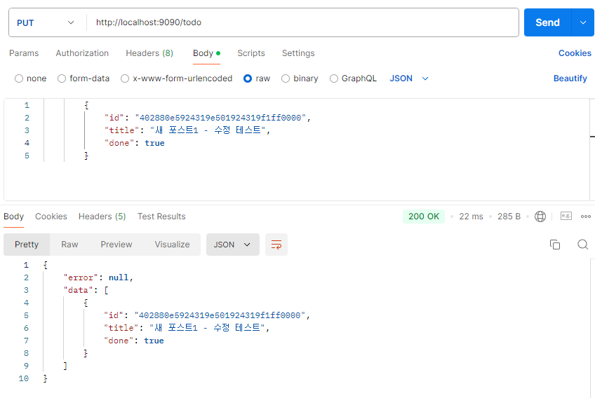

# Todo서비스 만들기
- 스프링과 JPA를 기반으로 생성,검색,수정,삭제 API를 만들어보자.
- 각 기능별 작성 순서는 다음과 같다.
```
영속레이어 > 서비스레이어 > 표현레이어
```


## 로그
- 소프트웨어 시스템이나 애플리케이션에서 동작 상태나 이벤트가 발생했을 때, 그 내용을 기록한 정보다.
- 개발자, 운영자, 또는 시스템이 해당 애플리케이션의 상태를 파악하거나 문제 해결을 위해 사용한다.
- 주로 애플리케이션의 실행 흐름, 오류 또는 성능 문제를 추적하고 분석하는 데 매우 중요한 도구다.

### 로그의 주요 목적
1. 디버깅
    - 애플리케이션에서 발생한 문제나 버그를 추적하고 원인을 파악하기 위해 사용된다. 
    - 디버깅 시 로그를 통해 애플리케이션이 어떤 작업을 하고 있었는지, 어떤 오류가 발생했는지를 알 수 있다.
2. 모니터링
    - 애플리케이션이 예상대로 작동하는지 확인하고, 시스템 성능을 모니터링하기 위해 사용된다. 
    - 예를 들어, 응답 속도, 메모리 사용량 등을 로그로 기록하여 애플리케이션의 성능을 분석할 수 있다.
3. 문제 해결
    - 애플리케이션에서 예상치 못한 상황이 발생했을 때, 로그를 통해 그 문제를 해결하는 데 필요한 정보를 얻을 수 있다. 
    - 특히, 시스템이 갑작스럽게 중단되거나 성능 저하가 발생했을 때, 그 원인을 파악하는 데 중요한 역할을 한다.
4. 보안 감사
    - 애플리케이션에 대한 보안 감사 및 추적을 위해 사용된다. 
    - 시스템에 대한 접근 시도나 비정상적인 활동을 로그로 기록하여, 보안 위협을 감지하고 대응할 수 있다.

### 로그의 주요 구성 요소
1. 타임스탬프 : 로그가 기록된 시간. 이는 이벤트가 발생한 시점을 추적하는 데 매우 중요하다.
2. 로그 레벨(Log Level) : 로그의 중요도를 나타내며, 보통 아래와 같은 레벨이 사용된다.
   1. TRACE: 가장 낮은 수준의 로그. 아주 상세한 디버깅 정보.
   2. DEBUG: 개발 과정에서 주로 사용되는 디버깅 정보.
   3. INFO: 시스템의 정상적인 동작을 나타내는 정보.
   4. WARN: 예상치 못한 상황이 발생했지만, 시스템이 정상적으로 동작하는 경우.
   5. ERROR: 오류가 발생했으며, 시스템이 정상적으로 동작하지 않는 경우.
   6. FATAL: 매우 심각한 오류로, 시스템이 더 이상 동작할 수 없는 경우.
3. 메시지 : 로그에 기록된 이벤트에 대한 설명. 어떤 일이 일어났는지 명확하게 기술한다.
4. 이벤트 소스 : 로그가 기록된 위치, 예를 들어 특정 클래스, 메서드, 또는 모듈

## Slf4j(Simple Logging Facade for Java)
- Java 애플리케이션에서 사용하는 로깅 프레임워크에 대한 통합된 인터페이스를 제공하는 로그 추상화 라이브러리다.
- SLF4J는 로그를 작성하는 표준 인터페이스를 제공하고, 실제로 로그를 기록하는 것은 Logback, Log4j 같은 다른 로깅 프레임워크가 담당하는 방식이다.

### SLF4J가 필요한 이유
- 과거에는 애플리케이션에서 로그를 기록하기 위해 다양한 로깅 프레임워크가 사용되었다.
- 이들은 각각 고유한 API를 가지고 있어서, 만약 다른 로깅 프레임워크로 교체하려면 코드를 전부 수정해야 했다.
- SLF4J는 여러 로깅 프레임워크에 대한 추상화 레이어를 제공해 개발자는 한 가지 방식으로 로그를 작성하고, 나중에 어떤 로깅 프레임워크를 사용할 지결정 할 수 있게 되었다.

### SLF4J의 역할
1. 로깅 프레임워크의 추상화
    - 개발자가 SLF4J API를 사용하여 로그를 기록하면, SLF4J가 이를 구체적인 로깅 프레임워크에 전달한다.
    - 스프링은 기본적으로 Logback 라이브러리를 사용한다.
2. 호환성 유지
    - SLF4J 덕분에 애플리케이션의 로깅 구현체를 변경할 때 기존 코드를 수정할 필요 없이 로깅 라이브러리만 바꿔서 사용할 수 있다.

## TodoService에 코드 추가하기
- TodoService클래스에 @Slf4j 어노테이션 추가하기
```java

@Slf4j
@Service
public class TodoService {
	
	@Autowired
	private TodoRepository repository;

	public String testService() {
		... 중략
	}
}
```

## Create Todo구현
- Todo 아이템을 생성하는 기능을 구현해보자
  
## 영속레이어의 구현
- TodoRepository는 JpaRepository를 상속하므로 JpaRepository가 제공하는 다양한 메서드를 사용할 수 있다.
- 엔티티를 저장하기 위해 save()메서드를 사용하고, 새 Todo 리스트를 반환하기 위해 findByUserId()메서드를 사용한다.

## 서비스레이어 구현
- TodoService클래스에 Todo아이템을 생성하기 위한 비즈니스로직을 작성한다.
- create()메서드를 작성한다.
### create 메서드의 구성
- 검증
  - 넘어온 엔티티가 유효한지 검사하는 로직
  - 이 부분은 코드가 더 커지면 TodoValidator 클래스로 분리시킬 수 있다.
- save()
  - 엔티티를 데이터베이스에 저장한다.
  - 로그를 남긴다.
- findByUserId()
  - 저장된 엔티티를 포함하는 새 리스트를 반환한다.

```java
package com.example.demo.service;

import java.util.List;

import org.springframework.beans.factory.annotation.Autowired;
import org.springframework.stereotype.Service;

import com.example.demo.model.TodoEntity;
import com.example.demo.persistence.TodoRepository;

import lombok.extern.slf4j.Slf4j;

@Slf4j
@Service
public class TodoService {
	
	@Autowired
	private TodoRepository repository;

	public String testService() {
		...
	}
	
	
	public List<TodoEntity> create(TodoEntity entity){
		//매개변수로 넘어온 Entity가 유효한지 검사한다.
		if(entity == null) {
			log.warn("Entity cannot be null.");
			throw new RuntimeException("Entity cannot be null");
		}
		
		if(entity.getUserId() == null) {
			log.warn("Unknown user");
			throw new RuntimeException("Unknown user");
		}
		
		repository.save(entity);
		
        //{}는 SLF4J에서 제공하는 플레이스홀더로, 두 번째 매개변수로 전달된 entity.getId() 값이 여기에 대입되어 출력된다.
		log.info("Entity Id : {} is saved",entity.getId());
		
		return repository.findByUserId(entity.getUserId());
	}
}
```
- 유효성 검사의 경우 다른 메서드에서도 쓰일 예정이므로 private method로 리팩토링한다.

```java
package com.example.demo.service;

import java.util.List;

import org.springframework.beans.factory.annotation.Autowired;
import org.springframework.stereotype.Service;

import com.example.demo.model.TodoEntity;
import com.example.demo.persistence.TodoRepository;

import lombok.extern.slf4j.Slf4j;

@Slf4j
@Service
public class TodoService {
	
	@Autowired
	private TodoRepository repository;

	public String testService() {
		//엔티티 생성
		TodoEntity entity = TodoEntity.builder().title("My first todo item").build();
		//TodoEntity 저장
		repository.save(entity);
		//TodoEntity 검색
		TodoEntity savedEntity = repository.findById(entity.getId()).get();
		return  savedEntity.getTitle();
	}
	
	
	public List<TodoEntity> create(TodoEntity entity){
		//매개변수로 넘어온 Entity가 유효한지 검사한다.
		validate(entity);
		
		//Spring Data JPA의 리포지토리 메서드로, 전달된 entity를 데이터베이스에 저장한다.
		//이 메서드는 JPA에서 제공하는 CRUD 기능 중 하나로, 기본적으로 엔티티가 데이터베이스에 존재하지 않으면 INSERT, 존재하면 UPDATE 쿼리를 실행한다.
		repository.save(entity);
		
		//여기서 SLF4J의 플레이스홀더 {}가 사용되어, 로그 메시지에 엔티티의 ID가 삽입한다.
		log.info("Entity Id : {} is saved",entity.getId());
		
		//특정 사용자 ID에 속한 모든 TodoEntity 목록을 반환한다.
		return repository.findByUserId(entity.getUserId());
	}
	
	
	private void validate(TodoEntity entity) {
		//전달된 TodoEntity가 null인지 확인합니다. 만약 null이면 RuntimeException을 발생시키고, 경고 로그를 기록한다.
		if(entity == null) {
			log.warn("Entity cannot be null.");
			throw new RuntimeException("Entity cannot be null");
		}
		
		//TodoEntity 객체가 userId를 가지고 있는지 확인한다.
		if(entity.getUserId() == null) {
			log.warn("Unknown user");
			throw new RuntimeException("Unknown user");
		}
	}	
}
```

## 컨트롤러 구현
- HTTP응답을 반환할 때, 비즈니스 로직을 캡슐화하거나 추가적인 정보를 함께 반환하기 위해 DTO를 사용했었다.
- 컨트롤러는 유저에게서 TodoDTO를 바디로 넘겨받고, 이를 TodoEntity로 변환해 저장해야한다.
- 그 다음 TodoService의 create()이 반환하는 TodoEntity를 TodoDTO로 변환헤 반환해야 한다.

### 클라이언트로부터 요청을 받았을 때
```
Request     >      TodoController        > TodoService
                 TodoDTO > TodoEntity
```

### 클라이언트에게 응답을 보낼 때
```
Response    <      TodoController        < TodoService
                 TodoDTO < TodoEntity
```


## TodoEntity클래스에 코드 작성하기
- DTO를 Entity로 변환하기 위한 코드 작성하기
```java
package com.example.demo.dto;

import com.example.demo.model.TodoEntity;

import lombok.AllArgsConstructor;
import lombok.Builder;
import lombok.Data;
import lombok.NoArgsConstructor;

@Builder
@NoArgsConstructor
@AllArgsConstructor
@Data
public class TodoDTO {
	private String id;
	private String title;
	private boolean done;
	
	public TodoDTO(final TodoEntity entity) {
		this.id = entity.getId();
		this.title = entity.getTitle();
		this.done = entity.isDone();
	}
	
	public static TodoEntity toEntity(TodoDTO dto) {
		return TodoEntity.builder()
				.id(dto.getId())
				.title(dto.getTitle())
				.done(dto.isDone())
				.build();
	}
}
```

## Controller에 코드 추가하기
```java
package com.example.demo.controller;

import java.util.ArrayList;
import java.util.List;
import java.util.stream.Collectors;

import org.springframework.beans.factory.annotation.Autowired;
import org.springframework.http.ResponseEntity;
import org.springframework.web.bind.annotation.GetMapping;
import org.springframework.web.bind.annotation.PostMapping;
import org.springframework.web.bind.annotation.RequestBody;
import org.springframework.web.bind.annotation.RequestMapping;
import org.springframework.web.bind.annotation.RestController;

import com.example.demo.dto.ResponseDTO;
import com.example.demo.dto.TodoDTO;
import com.example.demo.model.TodoEntity;
import com.example.demo.service.TodoService;

@RestController
@RequestMapping("todo")
public class TodoController {

	@Autowired
	private TodoService service;
	
	@GetMapping("/test")
	public ResponseEntity<?> testTodo(){
		String str = service.testService();//테스트 서비스 사용
		List<String> list = new ArrayList<>();
		list.add(str);
		ResponseDTO<String>response = ResponseDTO.<String>builder().data(list).build();
		return ResponseEntity.ok().body(response);
	}
	
	@PostMapping
	public ResponseEntity<?> createTodo(@RequestBody TodoDTO dto){
		try {
			String tempraryUserId = "temporary-user"; //임시 유저id
			
			//TodoDTO객체를 TodoEntity객체로 변환한다.
			TodoEntity entity = TodoDTO.toEntity(dto);
			System.out.println(entity);
			
			//id 값을 명시적으로 null로 설정하여, 엔티티가 새로운 데이터임을 보장합니다.
			entity.setId(null);
			
			//임시 유저id를 설정해준다. 이 부분은 4장 인증과 인가에서 수정할 예정이다.
			//지금은 인증과 인가 기능이 없으므로 한 유저(temporary-user)만 로그인 없이 사용 가능한
			//애플리케이션인 셈이다.
			entity.setUserId(tempraryUserId);
			
			//서비스 레이어의 create 메서드를 호출하여, TodoEntity를 데이터베이스에 저장하는 작업을 수행한다.
			//이 메서드는 저장된 TodoEntity 객체들을 저장한 리스트를 반환한다.
			List<TodoEntity> entities = service.create(entity);
			
			//자바 스트림을 이용해 반환된 엔티디 리스트를 TodoDTO리스트로 변환한다.
            //entities.stream().map(TodoDTO::new): TodoEntity 객체의 리스트를 TodoDTO 리스트로 변환하는 과정이다.
            //.collect(Collectors.toList()): 스트림으로 변환된 객체들을 리스트로 다시 수집한다.
			List<TodoDTO> dtos = entities.stream().map(TodoDTO::new).collect(Collectors.toList());
			
			//변환된 TodoDTO 리스트를 이용해 ResponseDTO를 초기화한다.
            //builder() 패턴을 사용하여 ResponseDTO 객체를 생성한다.
			ResponseDTO<TodoDTO> response = ResponseDTO.<TodoDTO>builder().data(dtos).build();
			
			//ResponseDTO를 반환한다.
			return ResponseEntity.ok().body(response);
		} catch (Exception e) {
			// 혹시 예외가 나는 경우 dto 대신 error에 메시지를 넣어 반환한다.
			String error = e.getMessage();
			
			//에러 메시지를 포함한 ResponseDTO 객체를 생성한다.
			ResponseDTO<TodoDTO> response = ResponseDTO.<TodoDTO>builder().error(error).build();
			
			//ResponseEntity.badRequest(): 400 Bad Request 상태 코드를 가진 응답을 반환한다.
			//이는 클라이언트가 잘못된 요청을 했음을 나타낸다.
			return ResponseEntity.badRequest().body(response);
		}
	}
}
```
- IDE의 메인메서드를 실행시키고 포스트맨을 이용해 HTTP POST localhost:9090/todo 요청을 작성한다.



- Body탭을 누르고, raw버튼을 선택 후 Text를 Json으로 바꾼다.
- 아래와 같은 데이터를 작성하여 요청한다.

```json
{
    "title":"새 포스트 1"
}
```
- 결과
- id는 자동생성되므로 예제와 다를 수 있다.
```json
{
    "error": null,
    "data": [
        {
            "id": "402880e4923e6f2f01923e70347e0000",
            "title": "새 포스트1",
            "done": false
        }
    ]
}
```

# Todo 리스트를 검색하는 기능

## Retrieve Todo구현
- Todo 리스트를 검색하기 위한 리포지터리, 서비스, 컨트롤러를 구현해보자

## 영속레이어 구현
- 마찬가지로 TodoRepository를 사용한다.
- createTodo에서 했던 것처럼 새 Todo 리스트 반환을 위해 findByUserId()메서드를 사용하자

## 서비스레이어 구현
- repository의 findByUserId()를 이용해 TodoService에 retrieve메서드를 작성하자.
```java
package com.example.demo.service;

import java.util.List;

import org.springframework.beans.factory.annotation.Autowired;
import org.springframework.stereotype.Service;

import com.example.demo.model.TodoEntity;
import com.example.demo.persistence.TodoRepository;

import lombok.extern.slf4j.Slf4j;

@Slf4j
@Service
public class TodoService {
	
	@Autowired
	private TodoRepository repository;

	public String testService() {
		... 
	}
	
	
	public List<TodoEntity> create(TodoEntity entity){
        ...
	}
	/////////////////////작성하기////////////////////////////
	public List<TodoEntity> retrieve(String userId){
		return repository.findByUserId(userId);
	}
	/////////////////////작성하기////////////////////////////
	
	private void validate(TodoEntity entity) {
        ...
	}	
}
```
## 표현계층 구현
- TodoController에 GET요청으로 retrieveTodoList()메서드를 작성한다.
```java
package com.example.demo.controller;

import java.util.ArrayList;
import java.util.List;
import java.util.stream.Collectors;

import org.springframework.beans.factory.annotation.Autowired;
import org.springframework.http.ResponseEntity;
import org.springframework.web.bind.annotation.GetMapping;
import org.springframework.web.bind.annotation.PostMapping;
import org.springframework.web.bind.annotation.RequestBody;
import org.springframework.web.bind.annotation.RequestMapping;
import org.springframework.web.bind.annotation.RestController;

import com.example.demo.dto.ResponseDTO;
import com.example.demo.dto.TodoDTO;
import com.example.demo.model.TodoEntity;
import com.example.demo.service.TodoService;

@RestController
@RequestMapping("todo")
public class TodoController {

	@Autowired
	private TodoService service;
	
	@GetMapping("/test")
	public ResponseEntity<?> testTodo(){
		String str = service.testService();//테스트 서비스 사용
		List<String> list = new ArrayList<>();
		list.add(str);
		ResponseDTO<String>response = ResponseDTO.<String>builder().data(list).build();
		return ResponseEntity.ok().body(response);
	}
	
	@PostMapping
	public ResponseEntity<?> createTodo(@RequestBody TodoDTO dto){
		...
	}
	
	public ResponseEntity<?> retrieveTodoList(){
		String temporaryUserId = "temporary-user";
		
		//서비스레이어의 retrieve메서드를 이용해 Todo리스트를 반환받아 entities에 저장한다.
		List<TodoEntity> entities = service.retrieve(temporaryUserId);
		
		//자바 스트림을 이용해 반환된 엔티티 리스트를 TodoDTO 리스트로 변환한다.
		List<TodoDTO> dtos = entities.stream().map(TodoDTO::new).collect(Collectors.toList());
		
		//변환된 TodoDTO 리스트를 이용해 ResponseDTO를 초기화한다.
		ResponseDTO<TodoDTO> response = ResponseDTO.<TodoDTO>builder().data(dtos).build();
		
		return ResponseEntity.ok().body(response);
	}	
}
```

## 테스팅
- 프로그램을 재시작하고 포스트맨에서 테스트를 해보자.
- H2 데이터베이스를 사용하고 있으니 이전에 생성했던 Todo 아이템은 없어졌다.
- HTTP POST메서드로 새 Todo 아이템을 생성한 후, HTTP GET메서드로 리스트를 받아보자.



- 마찬가지로 JSON 형태의 HTTP응답이 반환된 것을 확인할 수 있다.


## Update Todo 구현
- Todo를 업데이트 하는 기능을 만들어보자

## 영속계층
- TodoRepository를 사용한다.
- 업데이트 하기 위해 save(), findByUserId()를 사용한다.

## 서비스계층
- TodoService에 update메서드를 작성하자

```java
package com.example.demo.service;

import java.util.List;
import java.util.Optional;

import org.springframework.beans.factory.annotation.Autowired;
import org.springframework.stereotype.Service;

import com.example.demo.model.TodoEntity;
import com.example.demo.persistence.TodoRepository;

import lombok.extern.slf4j.Slf4j;

@Slf4j
@Service
public class TodoService {
	
	@Autowired
	private TodoRepository repository;

	public String testService() {
		...
	}
	
	
	public List<TodoEntity> create(TodoEntity entity){
		...
	}
	///////////////////////코드 추가//////////////////////////////////
	public List<TodoEntity> update(TodoEntity entity){
		//저장할 엔티티가 유효한지 확인한다.
		validate(entity);
		
		//넘겨받은 엔티티 id를 이용해 TodoEntity를 가져온다.
		//존재하지 않는 엔티티는 업데이트 할 수 없기 때문이다.
		Optional<TodoEntity> original = repository.findById(entity.getId());
		
		original.ifPresent(todo -> {
			//반환된 TodoEntity가 존재하면 값을 새 Entity값으로 덮어씌운다.
			todo.setTitle(entity.getTitle());
			todo.setDone(entity.isDone());
			
			//데이터베이스에 새 값을 저장한다.
			repository.save(todo);
		});
		
		return retrieve(entity.getUserId());
	}
	///////////////////////코드 추가//////////////////////////////////
	
	private void validate(TodoEntity entity) {
		...
}

```

## 표현계층
- TodoController에 PUT 요청을 하는 updateTodo메서드를 작성한다.

```java
package com.example.demo.controller;

import java.util.ArrayList;
import java.util.List;
import java.util.stream.Collectors;

import org.springframework.beans.factory.annotation.Autowired;
import org.springframework.http.ResponseEntity;
import org.springframework.web.bind.annotation.GetMapping;
import org.springframework.web.bind.annotation.PostMapping;
import org.springframework.web.bind.annotation.PutMapping;
import org.springframework.web.bind.annotation.RequestBody;
import org.springframework.web.bind.annotation.RequestMapping;
import org.springframework.web.bind.annotation.RestController;
import org.springframework.web.service.annotation.PutExchange;

import com.example.demo.dto.ResponseDTO;
import com.example.demo.dto.TodoDTO;
import com.example.demo.model.TodoEntity;
import com.example.demo.service.TodoService;

@RestController
@RequestMapping("todo")
public class TodoController {

	@Autowired
	private TodoService service;
	
	@GetMapping("/test")
	public ResponseEntity<?> testTodo(){
		...
	}
	
	@PostMapping
	public ResponseEntity<?> createTodo(@RequestBody TodoDTO dto){
		...
	}
	
	@GetMapping
	public ResponseEntity<?> retrieveTodoList(){
		...
	}	
	
	@PutMapping
	public ResponseEntity<?> updateTodo(@RequestBody TodoDTO dto){
		String temporaryUserId = "temporary-user";
		
		//dto를 Entity로 변환한다.
		TodoEntity entity = TodoDTO.toEntity(dto);
		
		entity.setUserId(temporaryUserId);
		
		//서비스레이어의 update메서드를 이용해 entity를 업데이트한다.
		List<TodoEntity> entities = service.update(entity);
		
		//자바 스트림을 이용해 반환된 엔티티 리스트를 TodoDTO 리스트로 변환한다.
		List<TodoDTO> dtos = entities.stream().map(TodoDTO::new).collect(Collectors.toList());
		
		//변환된 TodoDTO 리스트를 이용해 ResponseDTO를 초기화한다.
		ResponseDTO<TodoDTO> response = ResponseDTO.<TodoDTO>builder().data(dtos).build();
		
		return ResponseEntity.ok().body(response);
	}
}
```
- 프로그램을 재시작하고 포스트맨에서 테스팅을 해보자
- h2 데이터베이스를 사용하고 있으니 이전에 생성했던 Todo 아이템은 없어졌다.
- POST메서드로 새 Todo아이템을 생성하자



- put 메서드로 Todo아이템을 수정해보자



## Delete Todo 구현
- Todo를 삭제하기 위한 기능을 구현해보자

## 영속 계층
- TodoRepository를 사용한다.
- 삭제 후 상태를 조회하기 위해 delete(), findByuserId()메서드를 사용한다.

## 서비스 계층
- delete기능을 구현하기 위해 TodoService에 delete메서드 작성하기

```java
public List<TodoEntity> delete(TodoEntity entity){
	//저장할 엔티티가 유효한지 확인한다.
	validate(entity);
	
	try {
		//엔티티를 삭제한다.
		repository.delete(entity);
	} catch (Exception e) {
		// 예외 발생 시 id와 exception을 로깅한다.
		log.error("error deleting entity ",entity.getId(),e);
		
		//컨트롤러로 exception을 날린다. 데이터베이스 내부 로직을 캡슐화 하기 위해 e를 반환하지 않고 새로 exception 객체를 반환한다.
		throw new RuntimeException("error deleting entity "+entity.getId());
	}
	
	return retrieve(entity.getUserId());
}
```

## 표현 계층
- TodoController에 DELETE메서드를 사용하는 deleeTodo메서드를 만든다.

```java
@DeleteMapping
public ResponseEntity<?> deleteTodo(@RequestBody TodoDTO dto){
	try {
		
		String tempraryUserId = "temporary-user"; //임시 유저id
		
		//TodoDTO객체를 TodoEntity객체로 변환한다.
		TodoEntity entity = TodoDTO.toEntity(dto);
	
		
		//임시 유저id를 설정해준다. 이 부분은 4장 인증과 인가에서 수정할 예정이다.
		//지금은 인증과 인가 기능이 없으므로 한 유저(temporary-user)만 로그인 없이 사용 가능한
		//애플리케이션인 셈이다.
		entity.setUserId(tempraryUserId);
		
		//서비스 레이어의 create 메서드를 호출하여, TodoEntity를 데이터베이스에 저장하는 작업을 수행한다.
		//이 메서드는 저장된 TodoEntity 객체들을 저장한 리스트를 반환한다.
		List<TodoEntity> entities = service.delete(entity);
		
		//자바 스트림을 이용해 반환된 엔티디 리스트를 TodoDTO리스트로 변환한다.
		List<TodoDTO> dtos = entities.stream().map(TodoDTO::new).collect(Collectors.toList());
		
		//변환된 TodoDTO 리스트를 이용해 ResponseDTO를 초기화한다.
		ResponseDTO<TodoDTO> response = ResponseDTO.<TodoDTO>builder().data(dtos).build();
		
		//ResponseDTO를 반환한다.
		return ResponseEntity.ok().body(response);
	} catch (Exception e) {
		// 혹시 예외가 나는 경우 dto 대신 error에 메시지를 넣어 반환한다.
		String error = e.getMessage();
		
		//에러 메시지를 포함한 ResponseDTO 객체를 생성한다.
		ResponseDTO<TodoDTO> response = ResponseDTO.<TodoDTO>builder().error(error).build();
		
		//ResponseEntity.badRequest(): 400 Bad Request 상태 코드를 가진 응답을 반환한다.
		//이는 클라이언트가 잘못된 요청을 했음을 나타낸다.
		return ResponseEntity.badRequest().body(response);
	}
}
```