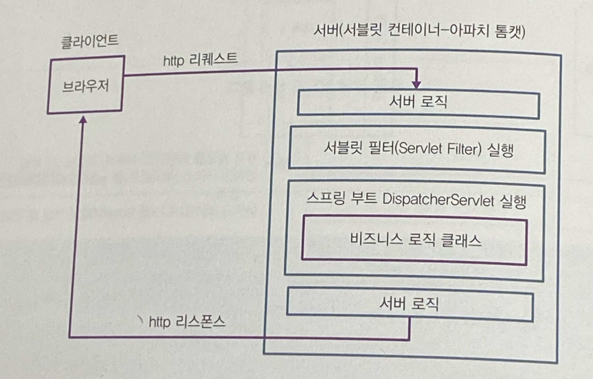
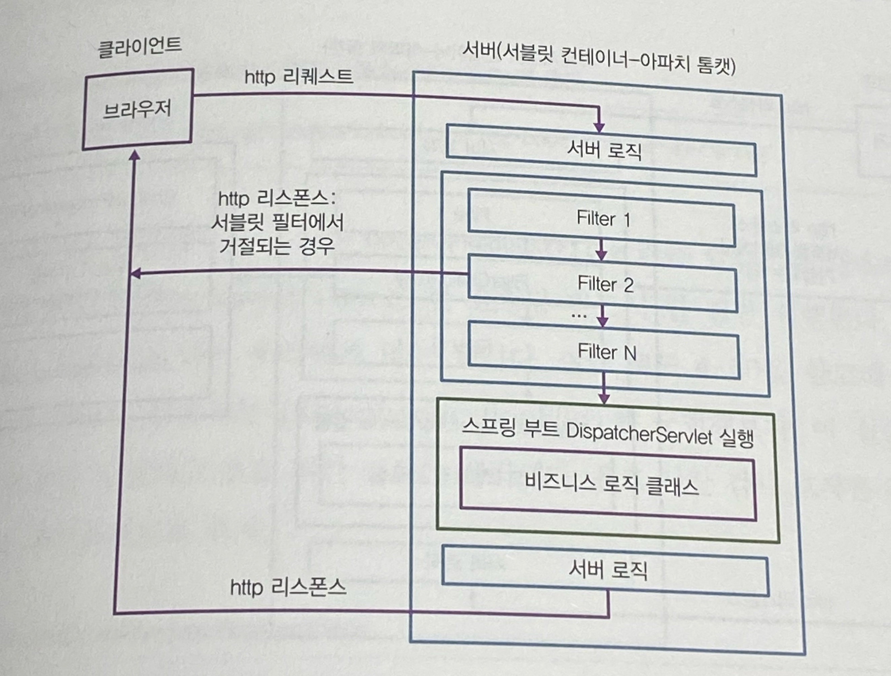
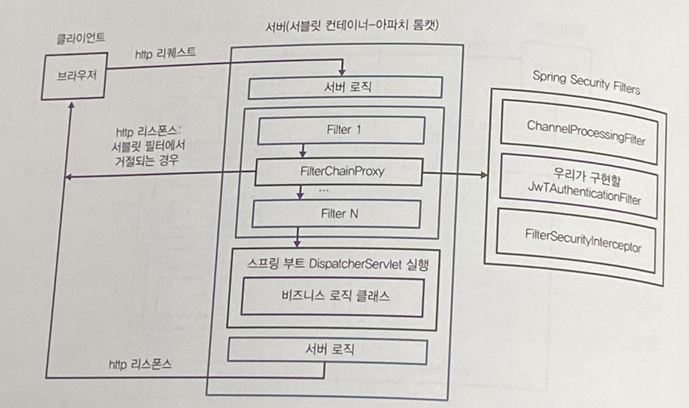
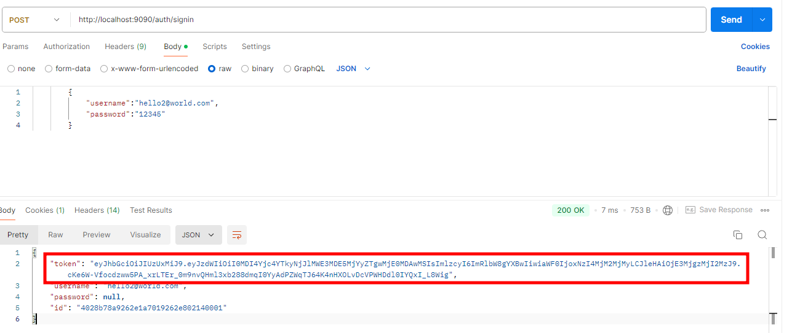
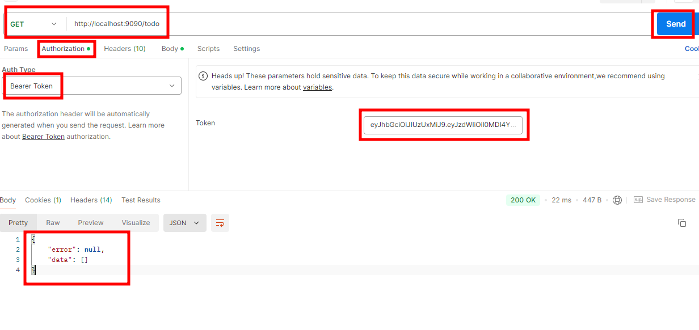
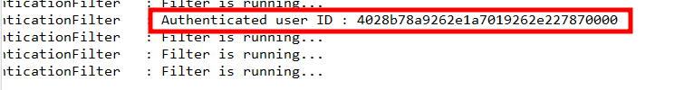

# 스프링 시큐리티 통합
- 사용자에 관련된 클래스들은 로그인 여부를 저장하지 않는다는 점 때문에 불완전하다.
- 스프링 시큐리티와 JWT 토큰을 이용해 해결할 것이다.

## 로그인 유지 구현
- 모든 API 요청에 토큰을 보내는 것이다.
- 그러면 각 API는 맨 처음 토큰을 확인함으로써 접근을 허용 또는 거부하는 코드를 실행할 것이다.
- 문제는 모든 API가 이 작업을 해야 한다는 것이다.
- createTodo, getTodo, updateTodo, deleteTodo 총 네 개의 API가 존재한다.
- 50개가 넘는 API를 관리한다고 생각하면 코드를 50번 반복해야 한다는 뜻이다.
- 우리는 스프링 시큐리티를 이용해 코드를 한번만 작성하고, 이 코드가 모든 API를 수행하기 바로 전에 실행되도록 설정하고 구현할 것이다.

## JWT 생성 및 반환 구현
- 유저 정보를 바탕으로 헤더와 페이로드를 작성하고 전자 서명을 한 후 토큰을 반환할것이다.
- 구현을 위해서 JWT관련 라이브러리를 디펜던시에 추가해야 한다.
- build.gradle의 dependencies 부분에 Jjwt라이브러리를 추가해주자.

```groovy
	// https://mvnrepository.com/artifact/io.jsonwebtoken/jjwt-api
	implementation group: 'io.jsonwebtoken', name: 'jjwt-api', version: '0.11.5'
	// https://mvnrepository.com/artifact/io.jsonwebtoken/jjwt-impl
	runtimeOnly group: 'io.jsonwebtoken', name: 'jjwt-impl', version: '0.11.5'
	// https://mvnrepository.com/artifact/io.jsonwebtoken/jjwt-gson
	implementation group: 'io.jsonwebtoken', name: 'jjwt-gson', version: '0.11.5'
```

### com.example.demo.security패키지 만들기
- security패키지에서 인증과 인가를 위한 모든 클래스를 관리할 것이다.
- TokenProvider클래스를 만들어 유저 정보를 받아 JWT를 생성하자.
```java
package com.example.demo.security;

import java.time.Instant;
import java.time.temporal.ChronoUnit;
import java.util.Date;

import org.springframework.stereotype.Service;

import com.example.demo.model.UserEntity;

import io.jsonwebtoken.Claims;
import io.jsonwebtoken.Jwts;
import io.jsonwebtoken.SignatureAlgorithm;
import lombok.extern.slf4j.Slf4j;

@Slf4j
@Service
public class TokenProvider {
	private static final String SECRET_KEY = "eyJhbGciOiJIUzUxMiJ9eyJSb2xlIjoiQWRtaW4iLCJJc3N1ZXIiOiJJc3N1ZXIiLCJVc2VybmFtZSI6IkphdmFJblVzZSIsImV4cCI6MTcyNzk3NzQ2OSwiaWF0IjoxNzI3OTc3NDY5fQ3WUk1X983GsejnQZJSNQKjZBfBeSzOK4cAxpndz0G3pSItFPDiDVnSfD0ZsQzVCSkSMKQozyMVDjt9VYTcJw";

	public String create(UserEntity userEntity) {
		// 기한 지금으로부터 1일로 설정
		Date expiryDate = Date.from(
						Instant.now()
						.plus(1, ChronoUnit.DAYS));

		/*
		{ // header
		  "alg":"HS512"
		}.
		{ // payload
		  "sub":"40288093784915d201784916a40c0001",
		  "iss": "demo app",
		  "iat":1595733657,
		  "exp":1596597657
		}.
		// SECRET_KEY를 이용해 서명한 부분
		Nn4d1MOVLZg79sfFACTIpCPKqWmpZMZQsbNrXdJJNWkRv50_l7bPLQPwhMobT4vBOG6Q3JYjhDrKFlBSaUxZOg
		 */
		// JWT Token 생성
		return Jwts.builder()
						// header에 들어갈 내용 및 서명을 하기 위한 SECRET_KEY
						.signWith(SignatureAlgorithm.HS512, SECRET_KEY)
						// payload에 들어갈 내용
						.setSubject(userEntity.getId()) // sub
						.setIssuer("demo app") // iss
						.setIssuedAt(new Date()) // iat
						.setExpiration(expiryDate) // exp
						.compact();
	}

	public String validateAndGetUserId(String token) {
		// parseClaimsJws메서드가 Base 64로 디코딩 및 파싱.
		// 즉, 헤더와 페이로드를 setSigningKey로 넘어온 시크릿을 이용 해 서명 후, token의 서명 과 비교.
		// 위조되지 않았다면 페이로드(Claims) 리턴
		// 그 중 우리는 userId가 필요하므로 getBody를 부른다.
		Claims claims = Jwts.parser()
						.setSigningKey(SECRET_KEY)
						.parseClaimsJws(token)
						.getBody();

		return claims.getSubject();
	}
}
```
- create()는 JWT라이브러리를 이용해 JWT토큰을 생성한다.
- 토큰을 생성하는 과정에서 우리가 임의로 지정한 SECRET_KEY를 개인키로 사용한다.
- 두 번째 메서드 validateAndGetUserId()는 토큰을 디코딩, 파싱 및 위조여부를 확인한다.
- 이후 우리가 원하는 유저의 아이디를 반환한다.
- 라이브러리 덕에 우리가 굳이 JSON을 생성, 서명, 인코딩, 디코딩, 파싱하는 작업을 하지 않아도 된다.
- TokenProvider를 작성했다면, 이제 로그인 부분에서 TokenProvider를 이용해 토큰을 생성 후 UserDTO에 이를 반환해야 한다.

## UserController에 코드 수정하기
```java
package com.example.demo.controller;

@Slf4j
@RestController
@RequestMapping("/auth")
public class UserController {

	@Autowired
	private UserService userService;

///////////////////Token Provider 주입////////////////
	@Autowired
	private TokenProvider tokenProvider;
///////////////////Token Provider 주입////////////////


	@PostMapping("/signup")
	public ResponseEntity<?> registerUser(@RequestBody UserDTO userDTO) {
		try {
			// 리퀘스트를 이용해 저장할 유저 만들기
			UserEntity user = UserEntity.builder()
							.email(userDTO.getEmail())
							.username(userDTO.getUsername())
							.password(passwordEncoder.encode(userDTO.getPassword()))
							.build();
			// 서비스를 이용해 리파지토리에 유저 저장
			UserEntity registeredUser = userService.create(user);
			UserDTO responseUserDTO = UserDTO.builder()
							.email(registeredUser.getEmail())
							.id(registeredUser.getId())
							.username(registeredUser.getUsername())
							.build();
			// 유저 정보는 항상 하나이므로 그냥 리스트로 만들어야하는 ResponseDTO를 사용하지 않고 그냥 UserDTO 리턴.
			return ResponseEntity.ok(responseUserDTO);
		} catch (Exception e) {
			// 예외가 나는 경우 bad 리스폰스 리턴.
			ResponseDTO responseDTO = ResponseDTO.builder().error(e.getMessage()).build();
			return ResponseEntity
							.badRequest()
							.body(responseDTO);
		}
	}

	@PostMapping("/signin")
	public ResponseEntity<?> authenticate(@RequestBody UserDTO userDTO) {
		UserEntity user = userService.getByCredentials(
						userDTO.getUsername(),
						userDTO.getPassword());

		if(user != null) {
			///////////////////토큰 생성////////////////
			final String token = tokenProvider.create(user);
         ///////////////////토큰 생성////////////////
			final UserDTO responseUserDTO = UserDTO.builder()
							.username(user.getUsername())
							.id(user.getId())
                     //////토큰 주입///////
							.token(token)
                     //////토큰 주입///////
							.build();
			return ResponseEntity.ok().body(responseUserDTO);
		} else {
			ResponseDTO responseDTO = ResponseDTO.builder()
							.error("Login failed.")
							.build();
			return ResponseEntity
							.badRequest()
							.body(responseDTO);
		}
	}
}
```
- 포스트맨을 켜고 회원가입을 한후 로그인을 해서 token필드가 반환되는지 확인해보자.

# 스프링 시큐리티(Spring Security)

- 스프링 시큐리티는 스프링 기반 애플리케이션에서 **인증**(Authentication)과 **인가**(Authorization)를 처리하기 위한 강력한 보안 프레임워크다. 
- 스프링 애플리케이션에서 보안과 관련된 다양한 요구 사항을 손쉽게 구현할 수 있도록 돕는다.

## 주요 개념

1. **인증(Authentication)**
   - 사용자가 누구인지 확인하는 과정.
   - 사용자가 애플리케이션에 접근할 때 제공한 자격 증명(예: 사용자명, 비밀번호)을 확인하여 신원을 검증하는 단계.
   
2. **인가(Authorization)**
   - 인증된 사용자가 어떤 리소스에 접근할 수 있는지 결정하는 과정.
   - 사용자에게 주어진 역할(Role)과 권한(Authority)에 따라 리소스에 대한 접근 권한을 부여한다.

3. **필터 기반 아키텍처**
   - 스프링 시큐리티는 필터 체인을 기반으로 동작한다.
   - HTTP 요청이 들어오면 여러 보안 필터들이 순차적으로 실행되어 요청을 처리하고, 보안 관련 로직을 적용한다.

## 스프링 시큐리티와 서블릿 필터
- API가 실행될 때마다 사용자를 인증해주는 부분을 구현해야 한다.
- 스프링 시큐리티를 이용해서 해결한다고 했는데 어떤원리로 해결을 해주는걸까?
- HTTP 요청과 응답을 가로채어, 요청이 컨트롤러에 도달하기 전 또는 응답이 클라이언트에 전달되기 전에 필요한 전처리 또는 후처리를 수행하는 데 사용된다. 
- 주로 보안, 로깅, 인증, 인코딩 설정, 데이터 압축 등의 작업을 처리하는 데 유용하다.
- 우리는 서블릿 필터를 구현하고 서블릿 필터를 서블릿 컨테이너가 실행하도록 설정해주기만 하면 된다.



### 서블릿 필터예제
```java
package com.example.demo.security;

//서블릿 필터란 HttpFilter또는 Filter를 상속하는 클래스이다.
// HttpFilter 클래스를 상속받아 서블릿 필터 구현
public class ExampleServletFilter extends HttpFilter {

    // TokenProvider 객체를 이용해 토큰을 검증하고 사용자 정보를 가져오는 역할
    private TokenProvider tokenProvider;

    // 필터의 주요 로직을 처리하는 메서드로, 요청이 필터를 거칠 때마다 실행됨
    @Override
    protected void doFilter(HttpServletRequest request, HttpServletResponse response, FilterChain chain)
            throws IOException, ServletException {
        try {
            // HTTP 요청에서 Bearer 토큰을 파싱하여 가져옴
            final String token = parseBearerToken(request);
            
            // 토큰이 존재하고 값이 유효할 때
            if (token != null && !token.equalsIgnoreCase("null")) {
                // 토큰을 검증하여 사용자 ID를 가져옴 (유효하지 않은 토큰일 경우 예외 발생)
                String userId = tokenProvider.validateAndGetUserId(token);
                
                // 사용자 인증 후, 필터 체인의 다음 필터를 실행 (인증된 사용자 요청 처리)
                chain.doFilter(request, response);
            }
        } catch (Exception e) {
            // 예외가 발생하면 HTTP 응답을 403 Forbidden으로 설정
            response.setStatus(HttpServletResponse.SC_FORBIDDEN);
        }
    }

    // Authorization 헤더에서 Bearer 토큰을 파싱하는 메서드
    private String parseBearerToken(HttpServletRequest request) {
        // HTTP 요청의 헤더에서 Authorization 값을 가져옴
        String bearerToken = request.getHeader("Authorization");
        
        // Bearer 토큰 형식일 경우에만 토큰 값을 반환
        if (StringUtils.hasText(bearerToken) && bearerToken.startsWith("Bearer ")) {
            return bearerToken.substring(7); // 'Bearer ' 문자열을 제거하고 토큰만 반환
        }
        return null; // Bearer 토큰이 없을 경우 null 반환
    }
}
```
- 이렇게 필터를 구현하고 나면 서블릿 컨테이너(톰캣)가 ExampleServletFilter를 사용하도록 어딘가에 설정해야 한다.
```xml
<filter>
	<filter-name>ExampleServletFilter</filter-name>
	<filter-class>com.example.demo.security.ExampleServletFilter </filter-class>
</filter>

<filter-mapping>
	<filter-name>ExampleServletFilter</filter-name>
	<url-pattern>/todo</url-pattern>
</filter-mapping>
```
- 스프링부트를 사용하지 않는 웹 서비스의 경우 web.xml과 같은 설정 파일에 이 필터를 어느 경로(/todo)에 적용해야 하는지 알려줘야 한다.
- 서블릿 컨테이너가 서블릿 필터 실행시 xml에 설정된 필터를 실행시켜준다.

- 서블릿 필터가 꼭 한 개일 필요는 없다.
- 걸러내고 싶은 모든 것을 하나의 클래스에 담으면 그 크기가 매우 커질것이다.
- 그래서 기능에 따라 다른 서블릿 필터를 작성할 수 있고 이 서블릿 필터들을 FilterChain을 이용해 연쇄적으로 순서대로 실행할 수 있다.
- doFilter()메서드가 다음으로 부를 필터를 FilterChain안에 갖고 있어 다음 필터를 실행할 수 있다.



- 스프링 시큐리티 프로젝트를 추가하면 스프링 시큐리티가 FilterChainProxy라는 필터를 서블릿 필터에 끼워넣어준다.
- FilterChainProxy클래스 안에는 내부적으로 필터를 실행시키는데 이 필터들이 스프링이 관리하는 스프링 빈 필터다.
- Filter를 만들기 위해 HttpFilter 대신 OncePerRequestFilter를 상속한다.
- web.xml이 없기 때문에 WebSecurityConfigurerAdapter클래스를 상속해 필터를 설정한다.

## JWT를 이용한 인증 구현
- 스프링 시큐리티를 사용해서 본격적으로 구현을 해보자.

### 1. 스프링 시큐리티 의존성 추가하기
```groovy
// https://mvnrepository.com/artifact/org.springframework.boot/spring-boot-starter-security
implementation group: 'org.springframework.boot', name: 'spring-boot-starter-security', version: '3.2.4'
```

### 2. JwtAuthenticationFilter 클래스 만들기
- com.example.demo.security에 만들기
```java
package com.example.demo.security;

import java.io.IOException;

import org.springframework.beans.factory.annotation.Autowired;
import org.springframework.security.authentication.AbstractAuthenticationToken;
import org.springframework.security.authentication.UsernamePasswordAuthenticationToken;
import org.springframework.security.core.authority.AuthorityUtils;
import org.springframework.security.core.context.SecurityContext;
import org.springframework.security.core.context.SecurityContextHolder;
import org.springframework.security.web.authentication.WebAuthenticationDetailsSource;
import org.springframework.stereotype.Component;
import org.springframework.util.StringUtils;
import org.springframework.web.filter.OncePerRequestFilter;

import jakarta.servlet.FilterChain;
import jakarta.servlet.ServletException;
import jakarta.servlet.http.HttpServletRequest;
import jakarta.servlet.http.HttpServletResponse;
import lombok.extern.slf4j.Slf4j;

@Slf4j
@Component
public class JwtAuthenticationFilter extends OncePerRequestFilter{

	@Autowired
	private TokenProvider tokenProvider;
	
	
	//doFilterInternal() : 스프링 시큐리티의 OncePerRequestFilter를 상속받은 메서드로, 한 요청에 대해 한 번만 실행되도록 보장된다.
	@Override
	protected void doFilterInternal(HttpServletRequest request, HttpServletResponse response, FilterChain filterChain)
			throws ServletException, IOException {
		try {
			//parseBearerToken 메서드:
			//HTTP 요청 헤더에서 Authorization 값을 가져와 Bearer 토큰 형식인지 확인한 후, 토큰 값을 반환한다.
			//토큰이 없거나 유효하지 않으면 null을 반환한다.
			String token = parseBearerToken(request);
			log.info("Filter is running...");

			//토큰 검사하기. JWT이므로 인가 서버에 요청하지 않고도 검증 가능.
			if(token != null && !token.equalsIgnoreCase("null")) {

				//userId 가져오기. 위조된 경우 예외처리한다.
				//TokenProvider에서 토큰을 검증하고 userId를 가져옴
				String userId = tokenProvider.validateAndGetUserId(token);
				log.info("Authenticated user ID : " + userId);

				//사용자 인증 완료 후, SecurityContext에 인증 정보를 등록
				//인증 완료; SecurityContextHolder에 등록해야 인증된 사용자라고 생각한다.

				//AbstractAuthenticationToken :스프링 시큐리티에서 인증된 사용자 정보를 표현하는 Authentication 객체의 추상 클래스다.
				//인증된 사용자와 그 사용자의 **권한 정보(Authorities)**를 담는 역할을 한다.

				//UsernamePasswordAuthenticationToken
				//사용자 이름과 비밀번호를 사용하여 인증을 처리할 때 사용하는 구현 클래스다.
				AbstractAuthenticationToken authentication = new UsernamePasswordAuthenticationToken(userId, 
																									null,
																									AuthorityUtils.NO_AUTHORITIES// 현재 권한 정보는 제공하지 않음
																									);

				//WebAuthenticationDetailsSource: 스프링 시큐리티에서 제공하는 클래스다. 
				//HttpServletRequest 객체로부터 인증 세부 정보(Authentication Details)를 생성하는 역할을 한다.

				//buildDetails(request) 메서드는 HttpServletRequest 객체에서 인증과 관련된 추가적인 정보를 추출해 WebAuthenticationDetails 객체를 생성한다.
				//일반적으로 사용자의 세션 ID, 클라이언트 IP 주소 등의 메타데이터를 포함한다.
				authentication.setDetails(new WebAuthenticationDetailsSource().buildDetails(request));

				// SecurityContext를 생성하고 인증된 정보를 저장
				//SecurityContextHolder는 스프링 시큐리티에서 사용자의 인증 정보와 보안 컨텍스트를 관리하는 중심 클래스다.
				// 애플리케이션 내에서 현재 인증된 사용자의 정보를 저장하고 제공하는 역할을 한다.
				SecurityContext securityContext = SecurityContextHolder.createEmptyContext();

				//securityContext.setAuthentication(authentication)
				//현재 요청에 대한 인증 정보를 SecurityContext에 저장하여 스프링 시큐리티가 
				//해당 사용자를 인증된 사용자로 인식하게 하는 메서드다.
				securityContext.setAuthentication(authentication);

				//인증을 완료한 후, 이 메서드를 사용하여 인증된 사용자 정보를 저장할 수 있다.
				SecurityContextHolder.setContext(securityContext);
			}
		} catch (Exception e) {
			logger.error("Could not set user authentication in security context", e);
		}
		filterChain.doFilter(request, response);
	}
	
	private String parseBearerToken(HttpServletRequest request) {
		//Http 요청의 헤더를 파싱해 Barer 토큰을 반환한다.
		String bearerToken = request.getHeader("Authorization");
		
		// Bearer 토큰 형식일 경우 토큰 값만 반환
		if(StringUtils.hasText(bearerToken) && bearerToken.startsWith("Bearer ")) {
			return bearerToken.substring(7);
		}
		return null;
	}

}
```
- OncePerRequestFilter를 상속한다는 점, doFilterInternal를 오버라이딩을 한다는 점 이외에는 위의 예제와 다른점이 없다.

# 스프링부트 시큐리티를 이용한 토큰 인증 과정
- 스프링부트 시큐리티를 사용하여 **JWT(JSON Web Token)** 기반의 토큰 인증을 처리하는 과정은 다음과 같다

## 1. 사용자 로그인 (토큰 발급)
- **클라이언트**가 사용자 이름과 비밀번호를 포함한 인증 요청을 서버로 보낸다. (예: `/login` 엔드포인트)
- 서버는 **사용자 정보**를 검증하고, 인증 성공 시 **JWT 토큰**을 발급한다.
- 이 JWT 토큰은 인증된 사용자임을 나타내며, **Access Token**으로 클라이언트에게 반환된다.

## 2. 클라이언트가 요청에 토큰 포함
- 이후 클라이언트는 보호된 자원에 접근하기 위해 HTTP 요청의 **Authorization 헤더**에 발급받은 JWT 토큰을 포함한다.
- 요청 예시:
    ```http
    GET /api/protected-resource
    Authorization: Bearer <JWT 토큰>
    ```

## 3. JWT 인증 필터에서 요청 가로채기
- **스프링 시큐리티**는 요청이 들어올 때 필터 체인을 통해 요청을 처리한다.
- **`JwtAuthenticationFilter`** 같은 커스텀 필터를 사용하여 **Authorization 헤더**에서 JWT 토큰을 추출하고 검증한다:
    ```java
    String token = request.getHeader("Authorization");
    if (token != null && token.startsWith("Bearer ")) {
        token = token.substring(7);
    }
    ```

## 4. JWT 토큰 검증
- 필터에서 추출한 토큰을 **`TokenProvider`** 같은 클래스를 사용해 검증한다.
- 이 과정에서 다음 사항을 확인한다
  - 토큰의 서명이 올바른지
  - 토큰이 만료되지 않았는지
  - 토큰의 사용자 정보가 유효한지
- 유효하지 않으면 **401 Unauthorized** 응답을 반환한다.

## 5. 사용자 인증 정보 설정
- 토큰이 유효하면, 토큰에서 **사용자 ID**나 **이름**을 추출하여 스프링 시큐리티의 **`SecurityContext`**에 인증 정보를 설정한다:
    ```java
    Authentication authentication = new UsernamePasswordAuthenticationToken(userId, null, authorities);
    SecurityContextHolder.getContext().setAuthentication(authentication);
    ```

## 6. 보안 컨텍스트를 통해 권한 확인
- 스프링 시큐리티는 **`SecurityContextHolder`**에 저장된 인증 정보를 사용해 사용자가 요청한 자원에 접근할 수 있는 권한이 있는지 확인한다.
- 필요한 권한이 없으면 **403 Forbidden** 응답을 반환한다.

## 7. 요청 처리 후 응답 반환
- 모든 검증이 완료되면 스프링 시큐리티는 요청을 **컨트롤러**로 전달하여 비즈니스 로직을 처리한다.
- 컨트롤러가 요청을 처리하고, 결과를 클라이언트에 반환한다.

---

## 전체 흐름 요약

1. **클라이언트 로그인**: 사용자 정보로 로그인 후, 서버가 **JWT 토큰**을 발급한다.
2. **JWT 토큰 포함 요청**: 클라이언트가 **JWT 토큰**을 포함한 요청을 보낸다.
3. **JWT 필터에서 요청 가로채기**: 스프링 시큐리티의 **필터**가 요청을 가로채서 JWT 토큰을 검증한다.
4. **JWT 검증**: 서버에서 토큰의 유효성을 확인하고, 서명과 만료 여부 등을 검증한다.
5. **사용자 인증 정보 설정**: 토큰이 유효하면 **사용자 정보**를 추출하고, 스프링 시큐리티의 **SecurityContext**에 인증 정보를 설정한다.
6. **권한 확인**: 설정된 인증 정보를 통해 사용자의 권한을 확인한다.
7. **요청 처리 후 응답**: 권한이 확인되면 요청을 처리하고, 결과를 클라이언트에 반환한다.

# 스프링 시큐리티 설정
- 이제 우리가 작성한 서블릿 필터를 스프링 시큐리티에게 사용하라고 알려줘야 한다.
- com.example.demo.config패키지에 WebSecurityConfig클래스 생성하기

```java
package com.example.demo.config;

import java.util.Arrays;

import org.springframework.beans.factory.annotation.Autowired;
import org.springframework.context.annotation.Bean;
import org.springframework.context.annotation.Configuration;
import org.springframework.security.config.annotation.web.builders.HttpSecurity;
import org.springframework.security.config.annotation.web.configuration.EnableWebSecurity;
import org.springframework.security.config.http.SessionCreationPolicy;
import org.springframework.security.web.DefaultSecurityFilterChain;
import org.springframework.security.web.authentication.UsernamePasswordAuthenticationFilter;
import org.springframework.web.cors.CorsConfiguration;
import org.springframework.web.cors.CorsConfigurationSource;
import org.springframework.web.cors.UrlBasedCorsConfigurationSource;

import com.example.demo.security.JwtAuthenticationFilter;

@Configuration
@EnableWebSecurity
public class WebSecurityConfig {
   
   @Autowired
   private JwtAuthenticationFilter jwtAuthenticationFilter;
   
   @Bean
   protected DefaultSecurityFilterChain securityFilterChain(
         HttpSecurity http) throws Exception {

      http
         .cors(corsConfigurer -> corsConfigurer.configurationSource(corsConfigurationSource()))
         .csrf(csrfConfigurer -> csrfConfigurer.disable())
         .httpBasic(httpBasicConfigurer -> httpBasicConfigurer.disable())
         .sessionManagement(sessionManagementConfigurer ->
               sessionManagementConfigurer.sessionCreationPolicy(SessionCreationPolicy.STATELESS)
           )
         
         .authorizeHttpRequests(authorizeRequestsConfigurer -> 
            authorizeRequestsConfigurer
            .requestMatchers("/", "/auth/**").permitAll()
            .anyRequest().authenticated()
         );

      http.addFilterBefore(jwtAuthenticationFilter, UsernamePasswordAuthenticationFilter.class);

      return http.build();
   }

	//CORS오류가 발생할 시 WebMvcConfig를 삭제하고 아래에 직접 Bean으로 만들기
   @Bean
   public CorsConfigurationSource corsConfigurationSource() {
      CorsConfiguration configuration = new CorsConfiguration();
      configuration.setAllowedOrigins(Arrays.asList("http://localhost:3000")); // 프론트엔드 주소
      configuration.setAllowedMethods(Arrays.asList("GET", "POST", "PUT", "DELETE", "OPTIONS"));
      configuration.setAllowedHeaders(Arrays.asList("*"));
      configuration.setAllowCredentials(true);
      
      UrlBasedCorsConfigurationSource source = new UrlBasedCorsConfigurationSource();
      source.registerCorsConfiguration("/**", configuration);
      return source;
   }
}
```
- HttpSecurity는 시큐리티 설정을 위한 객체이다.
- 빌더 패턴을 사용해 cors, csrf, httpbasic, session, authorizeRequest 등 다양한 설정을 할 수 있다.
- 우리는 web.xml이 없기 때문에 HttpSecurity를 이용해 시큐리티 관련 설정을 하는 것이다.

## 테스팅
- 포스트맨을 이용해 회원가입 후 로그인 요청을 날려보자.
- 로그인 하면 응답에 토큰이 함게 오는것을 확인할 수 있다.

/img/회원추가.png)



- 이 토큰을 복사해놓는다.
- /todo에 GET 요청을 작성하면서 토큰을 전달한다.
- 포스트맨 주소창 아래에서 Authorization을 선택하고 바로 아래 타입에서 Bearer Token을 선택한다.
- Bearer Token을 선택하면 오른쪽에 토큰을 입력할 수 있는 창이 나온다.
- 여기에 복사한 토큰을 넣고 send를 눌렀을 때 error와 data가 날아오면 정상적으로 인증된 것이다.


- 정확하게 보는법은 이클립스에서 로그를 보면 알 수 있다.



- 토큰의 맨 마지막에 아무 문자열이나 넣고 다시 요청을 보내보자.
- status 부번에서 403 Forbidden이 반환되는 것을 확인할 수 있다.


- 현재 Todo 컨트롤러는 모두 디폴트로 "Temporary-user"아이디를 사용하고 있다.
- 이제 토큰에서 가져온 사용자 아이디로 Todo 컨트롤러에서 올바른 사용자를 지정해주자.

## TodoController에서 인증된 유저 사용하기
- 각 메서드들이 인증된 유저 아이디를 사용할 수 있도록 각 메서드에 userId 매개변수를 추가해주자.

```java
package com.example.demo.controller;

import com.example.demo.dto.ResponseDTO;
import com.example.demo.dto.TodoDTO;
import com.example.demo.model.TodoEntity;
import com.example.demo.service.TodoService;
import org.springframework.beans.factory.annotation.Autowired;
import org.springframework.http.ResponseEntity;
import org.springframework.security.core.annotation.AuthenticationPrincipal;
import org.springframework.web.bind.annotation.DeleteMapping;
import org.springframework.web.bind.annotation.GetMapping;
import org.springframework.web.bind.annotation.PostMapping;
import org.springframework.web.bind.annotation.PutMapping;
import org.springframework.web.bind.annotation.RequestBody;
import org.springframework.web.bind.annotation.RequestMapping;
import org.springframework.web.bind.annotation.RestController;

import java.util.ArrayList;
import java.util.List;
import java.util.stream.Collectors;

@RestController
@RequestMapping("todo")
public class TodoController {

	@Autowired
	private TodoService service;

	@GetMapping("/test")
	public ResponseEntity<?> testTodo() {
		String str = service.testService(); // 테스트 서비스 사용
		List<String> list = new ArrayList<>();
		list.add(str);
		ResponseDTO<String> response = ResponseDTO.<String>builder().data(list).build();
		// ResponseEntity.ok(response) 를 사용해도 상관 없음
		return ResponseEntity.ok().body(response);
	}

	@PostMapping
	public ResponseEntity<?> createTodo(@AuthenticationPrincipal String userId, @RequestBody TodoDTO dto) {
		try {

			// (1) TodoEntity로 변환한다.
			TodoEntity entity = TodoDTO.toEntity(dto);

			// (2) id를 null로 초기화 한다. 생성 당시에는 id가 없어야 하기 때문이다.
			entity.setId(null);

			// (3) 임시 유저 아이디를 설정 해 준다. 이 부분은 4장 인증과 인가에서 수정 할 예정이다. 지금은 인증과 인가 기능이 없으므로 한 유저(temporary-user)만 로그인 없이 사용 가능한 어플리케이션인 셈이다
			entity.setUserId(userId);

			// (4) 서비스를 이용해 Todo엔티티를 생성한다.
			List<TodoEntity> entities = service.create(entity);

			// (5) 자바 스트림을 이용해 리턴된 엔티티 리스트를 TodoDTO리스트로 변환한다.

			List<TodoDTO> dtos = entities.stream().map(TodoDTO::new).collect(Collectors.toList());

			// (6) 변환된 TodoDTO리스트를 이용해ResponseDTO를 초기화한다.
			ResponseDTO<TodoDTO> response = ResponseDTO.<TodoDTO>builder().data(dtos).build();

			// (7) ResponseDTO를 리턴한다.
			return ResponseEntity.ok().body(response);
		} catch (Exception e) {
			// (8) 혹시 예외가 나는 경우 dto대신 error에 메시지를 넣어 리턴한다.

			String error = e.getMessage();
			ResponseDTO<TodoDTO> response = ResponseDTO.<TodoDTO>builder().error(error).build();
			return ResponseEntity.badRequest().body(response);
		}
	}

	@GetMapping
	public ResponseEntity<?> retrieveTodoList(@AuthenticationPrincipal String userId) {
		
		// (1) 서비스 메서드의 retrieve메서드를 사용해 Todo리스트를 가져온다
		List<TodoEntity> entities = service.retrieve(userId);

		// (2) 자바 스트림을 이용해 리턴된 엔티티 리스트를 TodoDTO리스트로 변환한다.
		List<TodoDTO> dtos = entities.stream().map(TodoDTO::new).collect(Collectors.toList());

		// (6) 변환된 TodoDTO리스트를 이용해ResponseDTO를 초기화한다.
		ResponseDTO<TodoDTO> response = ResponseDTO.<TodoDTO>builder().data(dtos).build();

		// (7) ResponseDTO를 리턴한다.
		return ResponseEntity.ok().body(response);
	}


	@PutMapping
	public ResponseEntity<?> updateTodo(@AuthenticationPrincipal String userId,@RequestBody TodoDTO dto) {
		

		// (1) dto를 entity로 변환한다.
		TodoEntity entity = TodoDTO.toEntity(dto);

		// (2) id를 temporaryUserId로 초기화 한다. 여기는 4장 인증과 인가에서 수정 할 예정이다.
		entity.setUserId(userId);

		// (3) 서비스를 이용해 entity를 업데이트 한다.
		List<TodoEntity> entities = service.update(entity);

		// (4) 자바 스트림을 이용해 리턴된 엔티티 리스트를 TodoDTO리스트로 변환한다.
		List<TodoDTO> dtos = entities.stream().map(TodoDTO::new).collect(Collectors.toList());

		// (5) 변환된 TodoDTO리스트를 이용해ResponseDTO를 초기화한다.
		ResponseDTO<TodoDTO> response = ResponseDTO.<TodoDTO>builder().data(dtos).build();

		// (6) ResponseDTO를 리턴한다.
		return ResponseEntity.ok().body(response);
	}

	@DeleteMapping
	public ResponseEntity<?> deleteTodo(@AuthenticationPrincipal String userId, @RequestBody TodoDTO dto) {
		try {

			// (1) TodoEntity로 변환한다.
			TodoEntity entity = TodoDTO.toEntity(dto);

			// (2) 임시 유저 아이디를 설정 해 준다. 이 부분은 4장 인증과 인가에서 수정 할 예정이다. 지금은 인증과 인가 기능이 없으므로 한 유저(temporary-user)만 로그인 없이 사용 가능한 어플리케이션인 셈이다
			entity.setUserId(userId);

			// (3) 서비스를 이용해 entity를 삭제 한다.
			List<TodoEntity> entities = service.delete(entity);

			// (4) 자바 스트림을 이용해 리턴된 엔티티 리스트를 TodoDTO리스트로 변환한다.
			List<TodoDTO> dtos = entities.stream().map(TodoDTO::new).collect(Collectors.toList());

			// (5) 변환된 TodoDTO리스트를 이용해ResponseDTO를 초기화한다.
			ResponseDTO<TodoDTO> response = ResponseDTO.<TodoDTO>builder().data(dtos).build();

			// (6) ResponseDTO를 리턴한다.
			return ResponseEntity.ok().body(response);
		} catch (Exception e) {
			// (8) 혹시 예외가 나는 경우 dto대신 error에 메시지를 넣어 리턴한다.
			String error = e.getMessage();
			ResponseDTO<TodoDTO> response = ResponseDTO.<TodoDTO>builder().error(error).build();
			return ResponseEntity.badRequest().body(response);
		}
	}

}
```

## @AuthenticationPrincipal
- 스프링 시큐리티에서 사용자의 Principal 객체를 컨트롤러 메서드의 파라미터로 주입하기 위해 사용된다.

### Principal
- **Principal**은 스프링 시큐리티에서 현재 인증된 사용자를 나타내는 객체
- 주로 **SecurityContextHolder**에 저장된 Authentication 객체를 통해 접근할 수 있다.
- Authentication 객체의 getPrincipal() 메서드는 인증된 사용자의 정보를 담고 있으며, 이 정보는 @AuthenticationPrincipal 어노테이션을 통해 컨트롤러 메서드에 자동으로 주입된다.

### 주된 역할
1. 현재 인증된 사용자의 정보를 가져옴
	- @AuthenticationPrincipal을 사용하면 **SecurityContext**에 저장된 인증된 사용자의 정보를 쉽게 가져올 수 있다.
	- 이 정보는 보통 사용자 이름, 이메일, ID, 권한 정보 등을 포함한다.
2. 간편한 주입
	- 직접적으로 **SecurityContextHolder**에서 Authentication 객체를 가져오는 번거로운 과정 없이, 어노테이션 하나로 해당 정보를 메서드 파라미터에 자동으로 주입받을 수 있다.

```java
AbstractAuthenticationToken authentication = new UsernamePasswordAuthenticationToken(
    userId, //인증된 사용자의 정보(Principal)로, @AuthenticationPrincipal을 통해 접근할 수 있는 주체(Principal) 역할을 한다.
    null, //JWT 기반 인증에서는 비밀번호와 같은 자격 증명을 더 이상 사용하지 않기 때문에 null로 설정된다.
    AuthorityUtils.NO_AUTHORITIES//사용자의 권한(Authorities)을 설정하는 부분이지만, 여기서는 권한이 없음을 나타낸다.
);

authentication.setDetails(new WebAuthenticationDetailsSource().buildDetails(request));
//setDetails()는 인증 객체에 추가적인 요청 관련 세부 정보(예: IP 주소, 세션 ID 등)를 설정한다.
//new WebAuthenticationDetailsSource().buildDetails(request)는 현재 HTTP 요청의 세부 정보를 추출하여 설정한다.

SecurityContext securityContext = SecurityContextHolder.createEmptyContext();
//SecurityContext는 스프링 시큐리티의 보안 컨텍스트로, 현재 요청에 대한 인증 정보를 관리하는 역할을 한다.
//SecurityContextHolder.createEmptyContext()는 빈 보안 컨텍스트를 생성한다.

securityContext.setAuthentication(authentication);
SecurityContextHolder.setContext(securityContext);
//securityContext.setAuthentication(authentication)는 생성된 SecurityContext에 인증된 사용자 정보(Authentication 객체)를 설정한다.
//SecurityContextHolder.setContext(securityContext)는 이 컨텍스트를 현재 스레드와 연관된 전역 보안 컨텍스트로 설정한다.
```
- 이 과정이 끝나면, 스프링 시큐리티는 현재 요청을 인증된 사용자로 간주하고, 이후에 @AuthenticationPrincipal을 사용해 인증된 사용자 정보를 가져올 수 있다.

## 테스팅
- 사용자 두 명이 독립적으로 애플리케이션을 사용할 수 있는지 확인해보자

### 1. 계정 2개 생성하기
- 첫 번째 사용자로 hello@world.com
- 두 번째 사용자로 hello2@world.com을 생성한다.

### 2. 각 사용자별로 Todo 추가하기
- 첫 번째 사용자로 로그인한 후 토큰을 복사한다.
- 그리고 /todo에 POST메서드를 사용해 TODO 리스트를 하나 추가해보자.
- 두 번째 사용자도 위와 같이 반복한다.
- 첫번째 사용자가 추가한 Todo 아이템은 보이지 않는 것을 알 수 있다.

## 패스워드 암호화
- 패스워드 암호화 부분은 스프링 시큐리티가 제공하는 BCryptPasswordEncoder를 사용한다.
- UserService를 수정하자

```java
package com.example.demo.service;

import lombok.extern.slf4j.Slf4j;

@Service // 이 클래스가 스프링의 서비스 계층에 속하는 빈(Bean)임을 나타낸다.
@Slf4j // Lombok을 사용하여 로깅 기능을 자동으로 추가한다. log 객체를 통해 로그를 기록할 수 있다.
public class UserService {

    @Autowired // 스프링이 UserRepository 타입의 빈을 자동으로 주입해준다.
    private UserRepository repository; // UserRepository를 통해 데이터베이스에 접근하는 역할을 한다.

    public UserEntity create(UserEntity userEntity) {
		... 중략
    }
 
    // 주어진 username과 password로 UserEntity를 조회한다.
    public UserEntity getByCredentials(String username, String password, final PasswordEncoder encoder) {
    	final UserEntity originalUser = repository.findByUsername(username);
    	//matches메서드를 이용해 패스워드가 같은지 확인
    	if(originalUser != null && encoder.matches(password, originalUser.getPassword())) {
    		return originalUser;
    	}
        // UserRepository의 findByUsernameAndPassword 메서드를 사용하여 유저 정보를 조회한다.
        return null;
    }
}
```
- 보통 암호화된 패스워드를 비교해야 하는 경우, 사용자에게 받은 패스워드를 같은 방법으로 암호화한 후, 그 결과를 데이터베이스의 값과 비교하는것이 자연스러운 흐름이다.
- 하지만 BCryptPasswordEncoder는 같은 값을 인코딩 할 때마다 다른 값이 나온다.
- 패스워드에 랜덤하게 의미 없는 값을 붙여 결과를 생성하기 때문이다.
- 이런 의미없는 값을 보안용어로 Salt라고 하고, Salt를 붙여 인코딩하는 것을 Salting이라고 한다.
- 따라서 사용자에게 받은 패스워드를 인코딩해도 데이터베이스에 저장된 패스워드와는 다를 확률이 높다.
- 대신 BCryptPasswordEncoder는 두 값이 일치하는지 여부를 알려주는 matcher()메서드를 제공한다.
- 이 메서드는 Salt를 고려해 두 값을 비교해준다.

### UserController수정하기
```java
package com.example.demo.controller;

import org.springframework.beans.factory.annotation.Autowired;
import org.springframework.http.ResponseEntity;
import org.springframework.security.crypto.bcrypt.BCryptPasswordEncoder;
import org.springframework.security.crypto.password.PasswordEncoder;
import org.springframework.web.bind.annotation.PostMapping;
import org.springframework.web.bind.annotation.RequestBody;
import org.springframework.web.bind.annotation.RequestMapping;
import org.springframework.web.bind.annotation.RestController;

import com.example.demo.dto.ResponseDTO;
import com.example.demo.dto.UserDTO;
import com.example.demo.model.UserEntity;
import com.example.demo.security.TokenProvider;
import com.example.demo.service.UserService;

import lombok.extern.slf4j.Slf4j;

@Slf4j
@RestController
@RequestMapping("/auth")
public class UserController {

	... 중략
	
	private PasswordEncoder passwordEncoder = new BCryptPasswordEncoder();


		... 중략
	

	@PostMapping("/signin")
	public ResponseEntity<?> authenticate(@RequestBody UserDTO userDTO) {
		UserEntity user = userService.getByCredentials(
						userDTO.getUsername(),
						userDTO.getPassword(),
						passwordEncoder);

		... 중략
	}
}
```