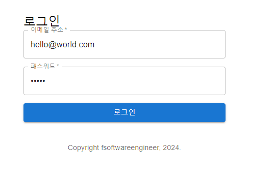
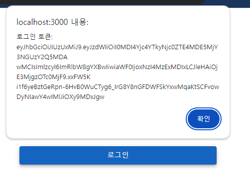

# 인증프론트엔드통합
- 백엔드 서비스에 인증과 인가를 구현하고 나서 프론트앤드 애플리케이션을 다시 시작해보면 동작하지 않을 것이다.
- 백엔드가 인증을 하기 시작했기 때문이다.
- 애플리케이션을 정상적으로 사용하기 위해선 프론트엔드에도 인증을 구현해줘야 한다.

## 로그인, 회원가입
- 프론트엔드 애플리케이션은 이제부터 백엔드에 HTTP요청을 보냈을 때, 403이 날아오면 토큰을 어딘가에 저장해놓고 로그인 페이지로 리다이렉트 해야 한다.
- 저장해놓은 토큰을 Http요청을 보낼 때마다 헤더에 Bearer 토큰으로 지정해줘야 한다.
 
### 라우팅
- 우리가 리액트에서 사용하는 라우팅은 서버-사이드 라우팅이 아닌 클라이언트-사이드 라우팅이다.
- 클라이언트-사이드 라우팅은 서버로 어떠한 요청도 날리지 않는다.

### 우리 프로그램에 적용시키기
1. http://localhost:3000에 접속하면 프론트엔드 서버가 리액트 애플리케이션을 반환한다.
   1. 이 애플리케이션은 앞으로 브라우저에서 필요한 모든 리소스(html,css,js)를 갖고있다.
2. http://localhost:3000/login을 주소창에 치면 리액트 라우터가 가로챈다.
3. 리액트 라우터의 로직은 URL을 해석해 Login 컴포넌트를 렌더링한다.
4. Login 페이지를 가져오는 두 번째 요청은 클라이언트-사이드이기 때문에 인터넷이 끊기더라도 실행된다.

### 로그인 컴포넌트
- 라우팅을 테스팅 하기 위해 src폴더에 기능이 없는 Login.js를 추가한다.
```js
import React from "react";

const Login = () => {
    return(
        <p> 로그인 페이지</p>
    )
}
export default Login;
```

### AppRouter 컴포넌트
- AppRouter.js에 모든 라우팅 규칙을 작성한다.
```js
import React from "react";
import "./index.css";
import App from "./App";
import Login from "./Login";
import {BrowerRouter, Routes, Route} from "react-router-dom";
import {Typography,Box} from "@mui/material";

function Copyright(){
    return(
        <Typography variant="body2" color="textSecondary" align="center">
            {"Copyright "}
            fsoftwareengineer, {new Date().getFullYear()}
            {"."}
        </Typography>
    );
}

function AppRouter(){
    return(
        <div>
            <BrowerRouter>
                <Routes>
                    <Route path="/" element={<App />}>
                    <Route path="login" element={<Login />}>
                </Routes>
            </BrowerRouter>
            <Box mt={5}>
                <Copyright />
            </Box>
        </div>
    )
}
```

### \<BrowerRouter\>
- 브라우저가 관리하는 히스토리를 사용해 브라우저와 리액트 사이의 URL을 동기화 하므로 뒤로가기가 잘 작동한다.

### \<Routes\>와 \<Route\>
- \<Route\>는 실제 경로를 지정해주기 위한 컴포넌트이다.
  - 예를 들어 http://localhost:3000/login 경로는 Login컴포넌트를 렌더링하기 위해 \<Route path="login" element={\<Login />}같이 선언했다.
- \<Routes\>는 \<Route\>를 관리하고 실제로 가장 적합한 \<Route\>를 찾아주는 컴포넌트다.
- URL경로가 바뀌는 경우, \<Routes\>컴포넌트가 자신에게 등록된 모든 \<Route\>컴포넌트를 검토하고 가장 적합한 \<Route\>를 찾는다.

### index.js 수정하기
- 기존에는 ReactDOM에 App 컴포넌트를 넘겨줬다. 
- 하지만 이제는 경로에 따라 실행되는 컴포넌트가 다르므로 그 정보를 갖고 있는 AppRouter를 가장 먼저 렌더링해야한다.
- index.js로 가서 가장 처음 렌더링되는 컴포넌트가 AppRouter컴포넌트가 되도록 수정한다.
```js
import React from 'react';
import './index.css';
import AppRouter from './AppRouter';
import reportWebVitals from './reportWebVitals';

const root = ReactDOM.createRoot(document.getElementById('root'));
root.render(
  <React.StrictMode>
    <AppRouter tab="home"/>
  </React.StrictMode>
);

// If you want to start measuring performance in your app, pass a function
// to log results (for example: reportWebVitals(console.log))
// or send to an analytics endpoint. Learn more: https://bit.ly/CRA-vitals
reportWebVitals();
```
- 프론트엔드를 재시작 한 후 http://localhost:3000/login페이지로 들어가보자
- 로그인 페이지 하고 문구가 뜬다면 라우팅이 제대로 동작하는 것이다.

### 접근 거부시 로그인 페이지로 라우팅하기
- 접근 거부를 받는 경우 /login으로 라우팅 하는 코드를 작성해보자.
- 우리는 http://localhost:9090/todo에게 요청을 했을 때 거부를 받을 수 있다.
- App.js의 useEffect 또는 add,delete,update를 확인해보면 API콜을 위해 ApiService의 call메서드를 사용하는 것을 알 수 있다.
- 또한 HTTP메서드의 종류에 상관 없이 로그인 하지 않은 경우 로그인 페이지로 리다이렉트 해야한다.
- 따라서 리다이렉트하는 로직을 ApiService의 어딘가에 추가해야 한다.

### ApiService.js 수정하기
- call메서드는 결국 axios메서드를 호출한다.
- axios를 이용하면 API콜을 한 후 .then을 이용해 HTTP응답을 받아올 수 있다.
- 받아온 응답의 Status가 200이면 요청이 잘 수행된 것이다.
- Status값이 403이라면 인증에 실패해 접근이 거부된 것이다.
- 따라서 Status가 403인경우 login화면으로 리다이렉트해주는 로직을 작성해야 한다.

```js
export async function call(api,method,request){

    //기본 옵션 설정
    let options = {
        url : API_BASE_URL + api,
        method : method,
        headers:"Content-Type":"application/json",
    }

    //request가 존재하는 경우 : POST,PUT,DELETE와 같은 GET 이외의 요청일 때
    //요청 본문에 데이터를 담아 보낸다.
    if(request){
        //객체 형태로 전달된 데이터를 JSON문자열로 변환하여 서버에 전송한다.
        options.data = JSON.stringify(request);
    }

    //axios(option) : 앞서 설정한 option 객체를 사용하여 axios로 Http요청을 보낸다.
    return await axios(options)//포스트맨에 GET localhost:9090/todo
    //요청이 성공적으로 처리된 경우 실행되는 코드
    .then(response => {
            return response.data;
    })
    //요청 중에 오류가 발생한 경우 실행되는 코드
    .catch(error => {
        //에러가 발생하면, 이를 console.log로 출력하여 디버깅하거나 문제를 파악할 수 있도록 한다.
        //상태코드가 403일때 login으로 리다이렉트
        if(error.status === 403){
            window.location.href="/login";
        }
    })
}//call
```

## 로그인 페이지 
### 로그인을 위한 API 서비스 메서드 작성
- 로그인 API 서비스는 /auth/signin이었다.
- 이경로를 이용해 로그인하는 메서드를 AppService.js에 작성한다.
```js
... 중략

export function siginin(userDTO){
    return call("/auth/signin", "POST", userDTO)
        .then(response => {
            console.log("response : " + response);
            alert("로그인 토큰: " + response.token);
        })
}
```
### Login 컴포넌트 수정하기
- Login 컴포넌트는 이메일과 패스워드를 받는 input필드, 로그인 버튼으로 이루어져 있다.
- 사용자가 이메일과 패스워드를 입력한 후 로그인 버튼을 누르면 백엔드의 /auth/signin으로 요청이 전달된다.
```js
import React from "react";
import { Container, Grid, Typography, TextField, Button } from "@mui/material"; // Material UI 컴포넌트들
import { signin } from "./service/ApiService"; // 로그인 API 호출 함수

function Login() {
    // 폼 제출 시 호출되는 함수
    const handleSubmit = (event) => {
        event.preventDefault(); // 페이지가 새로고침되지 않도록 기본 동작을 막음
        const data = new FormData(event.target); // 제출된 폼 데이터 가져옴
        const username = data.get("username"); // username 필드 값 가져오기
        const password = data.get("password"); // password 필드 값 가져오기
        console.log(username); // 콘솔에 이메일 출력 (디버깅용)
        console.log(password); // 콘솔에 비밀번호 출력 (디버깅용)
        // ApiService의 signin 메서드를 사용해 로그인 요청을 서버에 보냄
        signin({ username: username, password: password });
    };

    // 컴포넌트의 렌더링 부분
    return (
        <Container component="main" maxWidth="xs" style={{ marginTop: "8%" }}>
            <Grid container spacing={2}>
                <Grid item xs={12}>
                    <Typography component="h1" variant="h5">
                        로그인
                    </Typography>
                </Grid>
            </Grid>
            {/* 폼을 제출하면 handleSubmit 함수가 실행됨 */}
            <form noValidate onSubmit={handleSubmit}>
                <Grid container spacing={2}>
                    {/* 이메일 입력 필드 */}
                    <Grid item xs={12}>
                        <TextField
                            variant="outlined"
                            required
                            fullWidth
                            id="username"
                            label="이메일 주소"
                            name="username"
                            autoComplete="username" // 브라우저가 자동완성할 때 사용할 값
                        />
                    </Grid>
                    {/* 비밀번호 입력 필드 */}
                    <Grid item xs={12}>
                        <TextField
                            variant="outlined"
                            required
                            fullWidth
                            name="password"
                            label="패스워드"
                            type="password" // 비밀번호 입력 시 문자가 가려짐
                            id="password"
                            autoComplete="current-password" // 브라우저 자동완성 사용
                        />
                    </Grid>
                    {/* 제출 버튼 */}
                    <Grid item xs={12}>
                        <Button
                            type="submit"
                            fullWidth
                            variant="contained"
                            color="primary"
                        >
                            로그인
                        </Button>
                    </Grid>
                </Grid>
            </form>
        </Container>
    );
}

export default Login;

```
- 포스트맨을 이용해 새 유저를 만든 후 우리가 만든 페이지에서 로그인을 시도해보자



- 로그인에 성공하는 경우 alert메시지에 토큰이 기록되는 것을 확인할 수 있다.



## 로그인 성공
- 성공적으로 로그인 한 경우 Todo 리스트가 있는 화면으로 돌아가야 한다.
- 따라서 토큰이 존재하는 경우 Todo 리스트 화면인 http://localhost:3000/으로 돌아가는 로직을 작성해야 한다.
- 로그인을 인터페이스를 제공하고 토큰을 받을 경우 메인페이지로 가기로 했다.
- 하지만 메인페이지로 가면 엑세스 토큰을 같이 보내는것이 아니기 때문에 정상적으로 나오지 않는다.
- 이 상황을 해결하기 위해 우리는 어딘가에 엑세스 토큰을 저장하고 백엔드 서비스에 HTTP 요청을 보낼 때 이 토큰을 요청에 동봉해야 한다.
  
## 웹 스토리지
- 웹 스토리지는 데이터를 브라우저에 영구적 또는 일시적으로 저장할 수 있게 하며, 서버와의 통신 없이 클라이언트에서 데이터를 저장하고 읽어올 수 있다.

### 웹 스토리지의 종류
1. 세션 스토리지
    - 데이터 영구성 데이터를 브라우저에 영구적으로 저장한다.
    - 사용자가 브라우저를 닫고 다시 열어도 데이터가 유지된다.
    - 로컬 스토리지에 저장된 데이터는 사용자가 명시적으로 삭제하지 않는 한 계속 남아 있습니다.
    - 사용 예시: 로그인 상태 유지, 테마 설정, 브라우저 탭 간의 데이터 공유 등.
2. 로컬 스토리지
    - 데이터를 브라우저 세션 동안만 저장하며, 세션이 종료(브라우저 탭이 닫힘)되면 데이터가 사라진다.
    - 세션 스토리지는 각 탭이나 창에서 독립적으로 동작하므로, 동일한 웹페이지라도 다른 탭에서는 서로 다른 세션 스토리지를 가진다.

### 주요 특징
1. 영구 저장(로컬 스토리지) 또는 일시적 저장(세션 스토리지)
    - 데이터를 명시적으로 삭제하지 않는 한, 브라우저를 닫아도 데이터가 계속 남아 있다.
    - 세션 스토리지와 달리 세션 종료 후에도 데이터가 유지된다.

2. 키-값 쌍 저장
   - 데이터를 문자열 형태의 키-값 쌍으로 저장한다.
   - 데이터를 저장할 때 문자열로 변환하여 저장해야 하며, 객체를 저장하려면 JSON 형식으로 변환해야한다.

3. 브라우저와 도메인별 저장소
    - 로컬 스토리지는 각 브라우저와 도메인별로 저장된다.
    - 즉, 서로 다른 도메인에서는 같은 브라우저를 사용하더라도 로컬 스토리지에 접근할 수 없습니다.

4. 용량 제한
    - 일반적으로 브라우저마다 로컬 스토리지 용량은 약 5MB 정도로 제한된다.

1. 보안: 
    - 로컬 스토리지는 클라이언트 측에서만 접근할 수 있기 때문에 민감한 정보(예: 비밀번호, 토큰)를 저장할 때 주의해야 한다.
    - 자바스크립트를 통해서만 접근할 수 있으므로, 악성 스크립트에 의해 데이터가 노출될 위험이 있다.
    - HTTPS를 사용하여 통신을 보호하는 것이 중요하다.


따라서 사용자가 브라우저를 재시작 할 때마다 로그인 하게 하고 싶으면 세션 스토리지를, 브라우저를 재시작해도 로그인 상태를 유지하고 싶으면 로컬 스토리지를 사용하면된다.<br>

### 개발자 도구의 콘솔에 스토리지 실습하기
- 브라우저를 열고 콘솔에 다음의 코드를 차례로 작성한다.
```js
localStorage.setItem('hello','world') //hello가 key, world가 value로 저장된다.
localStorage.getItem('hello')// key에 해당하는 value를 가져온다.
localStorage
```
- 로컬 스토리지는 도메인(주소 경로)마다 따로 저장된다.
- 따라서 다른 도메인의 자바스크립트는 다른 도메인의 로컬 스토리지를 알지 못한다.

## 엑세스 토큰 저장
- 로그인시 받은 토큰을 로컬 스토리지에 저장하자.
- 백엔드에 API콜을 할 때마다 로컬 스토리지에서 엑세스 토큰을 불러와 헤더에 추가한다.

### 로그인시 받은 토큰을 로컬 스토리지에 저장하자.
- ApiService에 코드 수정하기
```js
export function signin(userDTO){
    return call("/auth/signin", "POST", userDTO)
        .then(response => {
            console.log(response)
            if(response.token){
                //로컬 스토리지에 토큰 저장
                localStorage.setItem("ACCESS_TOKEN",response.token);
                //token이 존재할 경우 Todo화면으로 리다이렉트
                window.location.href="/";
            } else {
                window.location.href="/login";
            }
        })
}
```
### 모든 API의 헤더에 엑세스 토큰을 추가하는 부분을 구현한다.
- 로그인에 관련되지 않은 모든 API콜은 call메서드를 통해 이뤄진다.
- 따라서 반복을 피하기 위해 call에 토큰이 존재하는 경우 헤더에 추가하는 로직을 작성한다.
- ApiService에 코드 추가하기
```js
export async function call(api,method,request){

    let headers = new Headers({
        "Content-Type":"application/json"
    })
    //로컬 스토리지에서 ACCESS TOKEN 가져오기
    const accessToken = localStorage.getItem("ACCESS_TOKEN");
    if(accessToken && accessToken !== null){
        headers.append("Authorization","Bearer "+accessToken);
    }

    //기본 옵션 설정
    let options = {
        headers:headers,
        url : API_BASE_URL + api,
        method : method
    }

    //request가 존재하는 경우 : POST,PUT,DELETE와 같은 GET 이외의 요청일 때
    //요청 본문에 데이터를 담아 보낸다.
    if(request){
        //객체 형태로 전달된 데이터를 JSON문자열로 변환하여 서버에 전송한다.
        options.data = JSON.stringify(request);
    }

    //axios(option) : 앞서 설정한 option 객체를 사용하여 axios로 Http요청을 보낸다.
    return await axios(options)//포스트맨에 GET localhost:9090/todo
    //요청이 성공적으로 처리된 경우 실행되는 코드
    .then(response => {
            return response.data;
    })
    //요청 중에 오류가 발생한 경우 실행되는 코드
    .catch(error => {
        //에러가 발생하면, 이를 console.log로 출력하여 디버깅하거나 문제를 파악할 수 있도록 한다.
        //상태코드가 403일때 login으로 리다이렉트
        if(error.status === 403){
            window.location.href="/login";
        }
    })
}//call
```