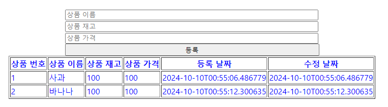
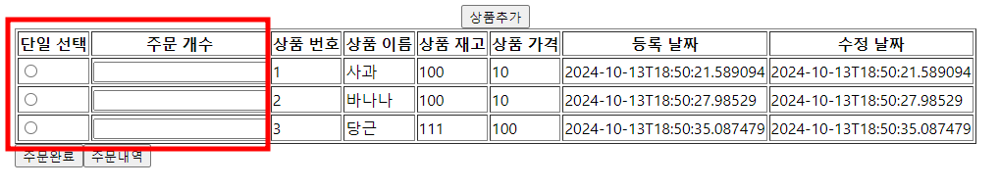
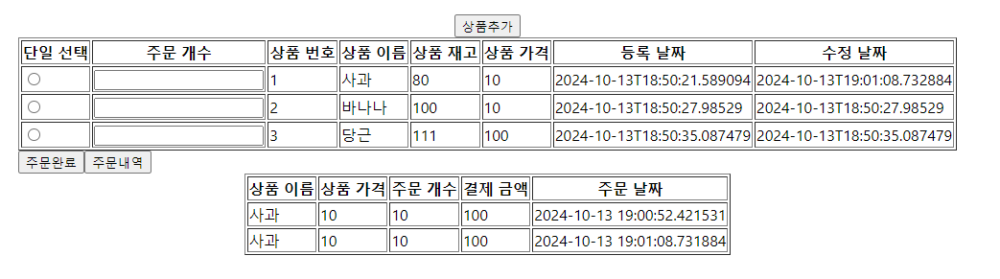

# 상품관리 서비스 만들기
- 상품과 주문에 대한 관리를 할 수 있는 서비스를 만들어보자

## 상품추가,조회 만들기
- 스프링부트 프로젝트 만들기
- Group : com.korea
- Artifact : product
### 필요 의존성
- Spring web
- H2
- lombok
- JPA

## Entity 만들기
- com.korea.product.model 패키지 생성하기
- ProductEntity클래스 생성하기
### 속성
- 상품id (primary key)
- 상품이름
- 상품재고
- 상품가격
- 등록날짜
- 수정날짜
- 
```java
package com.korea.product.model;

@Builder
@NoArgsConstructor
@AllArgsConstructor
@Data
@Entity
@Table(name = "Product")
public class ProductEntity {
    @Id
    @GeneratedValue(strategy = GenerationType.AUTO)
	private int productId;
	private String productName;
	private int productStock;
	private int productPrice;
	
	@CreationTimestamp//Insert 쿼리가 발생할 때 현재 시간 값을 적용시켜준다.
	private LocalDateTime registerDate;
	
	@UpdateTimestamp//Update 쿼리가 발생했을 때 현재 시간 값을 적용시켜준다.
	private LocalDateTime updateDate;

}

```
## DTO 만들기
- com.korea.product.dto 패키지 만들기
- ProductDTO 클래스 만들기
```java
package com.korea.product.dto;

@Data
@Builder
@NoArgsConstructor
@AllArgsConstructor
public class ProductDTO {
	
	private int productId;
	private String productName;
	private int productStock;
	private int productPrice;
	private String registerDate;
	private String updateDate;
	
    // Entity -> DTO 변환
    public ProductDTO(ProductEntity entity) {
        this.productId = entity.getProductId();
        this.productName = entity.getProductName();
        this.productStock = entity.getProductStock();
        this.productPrice = entity.getProductStock();
        this.registerDate = entity.getRegisterDate();
        this.updateDate = entity.getUpdateDate();
    }

    // DTO -> Entity 변환
    public static ProductEntity toEntity(ProductDTO dto) {
        return ProductEntity.builder()
                .productId(dto.getProductId())
                .productName(dto.getProductName())
                .productStock(dto.getProductStock())
                .productPrice(dto.getProductPrice())
                .registerDate(dto.getRegisterDate())
                .updateDate(dto.getUpdateDate())
                .build();
    }
}
```

## ResponseDTO 만들기
- 클라이언트와 데이터를 직접적으로 주고받기 위한 ResponseDTO클래스 만들기
```java
package com.example.demo.dto;

@Builder
@NoArgsConstructor
@AllArgsConstructor
@Data
public class ResponseDTO<T> {
	private String error;
	private List<T> data;
}

```
# 영속계층 만들기
## Repository 만들기
- com.korea.product.persistence 패키지 생성하기
- ProductRepository 인터페이스 생성하기
```java
package com.korea.product.persistence;

import org.springframework.data.jpa.repository.JpaRepository;
import org.springframework.stereotype.Repository;
import com.korea.product.model.ProductEntity;

@Repository
public interface ProductRepository extends JpaRepository<ProductEntity, Integer>{

}
```

# 서비스계층 만들기
## Service 만들기
- com.korea.product.service 패키지 생성하기
- ProductService 클래스 생성하기
- ProductRepository 주입하기
```java
@Service
@RequiredArgsConstructor
public class ProductService {

	private final ProductRepository p_repository;
}
```

# 표현계층 만들기
## Controller 만들기
- com.korea.product.controller 패키지 생성하기
- ProductController 클래스 생성하기
- ProductService 주입하기
```java
package com.korea.product.controller;

import org.springframework.web.bind.annotation.RestController;

import com.korea.product.service.ProductService;

import lombok.RequiredArgsConstructor;

@RestController
@RequiredArgsConstructor
public class ProductController {

	private final ProductService p_service;
}
```

## 모든 상품 조회하기
- 데이터베이스에 들어있는 모든 상품을 조회하시오
- 메서드명 : findAll();
### ProductService
```java
package com.korea.product.service;

import java.util.List;

import org.springframework.stereotype.Service;

import com.korea.product.model.ProductEntity;
import com.korea.product.persistence.ProductRepository;

import lombok.RequiredArgsConstructor;

@Service
@RequiredArgsConstructor
public class ProductService {

	private final ProductRepository p_repository;
	
	public List<ProductEntity> findAll() {
		return p_repository.findAll();
	}
}
```

### ProductController
- HTTP메서드 : GET
- 메서드명 : productList
```java
package com.korea.product.controller;

@RestController
@RequiredArgsConstructor
@RequestMapping("product")
public class ProductController {

	private final ProductService p_service;
	
	//조회하기
	@GetMapping
	public ResponseEntity<?> productList() {
		List<ProductEntity> entities = p_service.findAll();
		List<ProductDTO> dtos = entities.stream().map(ProductDTO::new).collect(Collectors.toList());
		ResponseDTO<ProductDTO> response = ResponseDTO.<ProductDTO>builder().data(dtos).build();
		return ResponseEntity.ok().body(response);
	}
}
```
- 포스트맨을 이용하여 결과를 확인해보세요
```json
{
    "error": null,
    "data": []
}
```
## 상품 추가하기
- db에 상품 추가하기
### ProductService
- 메서드명 : create
```java
//상품 추가하기
public List<ProductEntity> create(final ProductEntity entity) {
    // Validations
    validate(entity);

    p_repository.save(entity);
    return p_repository.findAll();
}

private void validate(final ProductEntity entity) {
    if(entity == null) {
        throw new RuntimeException("Entity cannot be null.");
    }
}
```

### ProductController
- HTTP메서드 : POST
- 메서드명 : createProduct
```java
@PostMapping
public ResponseEntity<?> createProduct(@RequestBody ProductDTO dto) {
    try {

        ProductEntity entity = ProductDTO.toEntity(dto);
        List<ProductEntity> entities = p_service.create(entity);
        List<ProductDTO> dtos = entities.stream().map(ProductDTO::new).collect(Collectors.toList());
        ResponseDTO<ProductDTO> response = ResponseDTO.<ProductDTO>builder().data(dtos).build();
        return ResponseEntity.ok().body(response);
    } catch (Exception e) {
        String error = e.getMessage();
        ResponseDTO<ProductDTO> response = ResponseDTO.<ProductDTO>builder().error(error).build();
        return ResponseEntity.badRequest().body(response);
    }
}
```

## 상품 정보 볼 수 있는 화면 만들기
- product-react-app 생성하기

### src에 p_info.js 만들기
- 백엔드에 axios로 백엔드에 데이터를 요청하고 받아와서 화면에 출력하기
- ApiService파일의 call메서드를 사용해도 좋습니다.
- 다음 이미지와 같이 만들어보세요


```js
import React from 'react';
import { useState,useEffect } from 'react';
import {p_info} from './css/p_info'
import { call } from './service/ApiService';

function P_info(){

    //상품정보를 가지고 있는 state
    const [items, setItems] = useState([])

    useEffect(() => {
        //백엔드에게 요청하기
        call("/product", "GET")//이제는 /Todo에 접근하려면 토큰인증이 필요하다.
          .then(result => {
            setItems(result.data);
          })
        
    }, [])

    let productItems = items.length > 0 && (
        <table border="1">
        <tr>
            <th>상품 번호</th>
            <th>상품 이름</th>
            <th>상품 재고</th>
            <th>상품 가격</th>
            <th>등록 날짜</th>
            <th>수정 날짜</th>
        </tr>
        {items.map((item) => (
        <tr>
            <td>{item.productId}</td>
            <td>{item.productName}</td>
            <td>{item.productStock}</td>
            <td>{item.productPrice}</td>
            <td>{item.registerDate}</td>
            <td>{item.updateDate}</td>
        </tr>
        ))}
        </table>
      );

    return(
        <div>
            <button type="button">상품추가</button>
            {productItems}
        </div>
    );
}

export default P_info;
```

### css폴더 만들고 styles.css파일 만들기
- 테이블에 스타일을 주자
```css
.container{
    height: 100vh;
    color: blue;
    border : 5px solid blue;
    display: flex;
    justify-content: center;  /* 수평 가운데 정렬 */
    align-items: center;      /* 수직 가운데 정렬 */
    flex-direction: column;  /* 세로 방향 정렬 */
};

table{
    color: blue;
    size: 24px;
    text-align: center;
    background: #f0f0f0;
}
```

## 상품추가창 만들기
- 상품 추가 버튼을 누르면 상품을 추가하는 창이 뜨도록 만드세요
- 내용을 입력하고 등록버튼을 누르면 상품을 DB에 등록하세요



```jsx
import React from 'react';
import { useState,useEffect } from 'react';
import './css/styles.css'
import { call } from './service/ApiService';
import AddProduct from './AddProduct';

function P_info(){

    //상품정보를 가지고 있는 state
    const [items, setItems] = useState([])

    //추가창을 띄우는 state
    const [open, setOpen] = useState(true);

    useEffect(() => {
        //백엔드에게 요청하기
        call("/product", "GET")//이제는 /Todo에 접근하려면 토큰인증이 필요하다.
          .then(result => {
            setItems(result.data);
          })
        
    }, [])


    //onButtonClick함수 작성
    const onButtonClick = ()=>{
        setOpen(false);
    }

    ...중략
    //버튼
    let addProduct = <button type="button" onClick={onButtonClick}>상품추가</button>

    //추가창
    let addProductScreen = <AddProduct />

    let addButton = addProduct;

    //open이 false가 되면 상품추가 창을 연다.
    if(!open){
    addButton = addProductScreen;
    }


    return(
        <div className='container'>
            {addButton}
            {productItems}
        </div>
    );
}

export default P_info;
```

### AddProduct.js생성하기
- 버튼을 누르면 DB로 내용이 넘어가 추가가 됩니다.
- 추가가 되면 모든 목록이 조회가 됩니다.
- 등록이 되면 추가창의 모든 내용을 비우고 닫습니다.


```js
import React from 'react';
import { useState} from 'react';

function AddProduct(props){

    //상품의 정보를 저장할 수 있는 state
    const [product, setProduct] = useState({productName : "",productStock:0,productPrice:0});

    const {productName,productStock,productPrice} = product;

    let addItem = props.addItem;

    const onChange = (e) => {    
        const { value, name } = e.target; // 우선 e.target 에서 name 과 value 를 추출    
        setProduct({      
            ...product, // 기존의 input 객체를 복사한 뒤      
            [name]: value // name 키를 가진 값을 value 로 설정    
            });  
        };

    const onButtonClick = ()=>{
        console.log(product);
        addItem(product);
        resetFields();
        props.setOpen(true);
    }

    // 입력 필드 초기화 함수
    const resetFields = () => {
        setProduct({ productName: "", productStock: 0, productPrice: 0 });
    };


    return(
        <div className="register-wrap" style={{width:'500px'}}>
			<div><input style={{width: '98%'}} value={productName} onChange={onChange} name='productName' placeholder='상품 이름'/></div>
			<div><input style={{width: '98%'}} value={productStock} onChange={onChange} name='productStock' placeholder='상품 재고'/></div>
			<div><input style={{width: '98%'}} value={productPrice} onChange={onChange} name='productPrice' placeholder='상품 가격'/></div>
			<input type="button" value="등록" onClick={onButtonClick} style={{width:'100%'}} />
		</div>
    )
}

export default AddProduct;
```

## 주문기능 만들기

### 1. 주문내역 조회
### OrderEntity만들기
- com.korea.product.model 패키지에 OrderEntity클래스 만들기
- productId가 PK와 FK로 연결되어있다.
- 라디오버튼을 만들고 주문할 개수를 입력할 수 있게 한다.
- 개수를 입력하고 주문버튼을 누르면 주문테이블에 등록이 되게 한다.

### 속성
- 주문번호
- 상품번호
- 주문개수
- 주문날짜

```java
package com.korea.product.model;

@Builder
@NoArgsConstructor
@AllArgsConstructor
@Data
@Entity
@Table(name = "Order")
public class OrderEntity {
    @Id
    @GeneratedValue(strategy = GenerationType.AUTO)
	private int orderId;
    
    // ProductEntity와 다대일 관계 설정
    @ManyToOne
    @JoinColumn(name = "productId", nullable = false)
    private ProductEntity product;

	private int productCount;
	
	@CreationTimestamp
	private String orderDate;
}
```

### OrderDTO만들기
- 주문 내역을 조회할 때 총 결제금액을 보여줄것이다.
- 총 결제금액을 담는 필드를 가진 OrderDTO를 만들자
```java
package com.korea.product.dto;

@Builder
@Data
@NoArgsConstructor
@AllArgsConstructor
public class OrderDTO {

	private int orderId;//주문번호
	private int productId;//상품 번호
	private String productName;//상품 이름
	private int productCount;//주문 개수
	private int productPrice;//상품 가격
	private int totalPrice; //결제 금액
	private String orderDate; //주문날짜
	
	public static List<OrderDTO> toListOrderDTO(List<Object[]> list) {
		//Object[] 데이터를 OrderDTO로 변환
		//Object -> Integer -> int (언박싱)
		return list.stream().map(result -> OrderDTO.builder()
							.orderId((int)result[0])
							.productName((String)result[1])
							.productCount((int)result[2])
							.productPrice((int)result[3])
							.totalPrice((int)result[4])
							.orderDate((String)result[5])
							.build()).collect(Collectors.toList());	
	}	
}
```

### OrderRepository만들기
- 모든 주문내역을 조회하는 쿼리를 만들어보자
- 총 결제내역(주문개수 x 상품의 가격)도 조회가 되야 한다.
```java
package com.korea.product.persistence;

@Repository
public interface OrderRepository extends JpaRepository<OrderEntity, Integer> {

    @Query("SELECT o.orderId, o.product.productName, o.productCount, o.product.productPrice, (o.productCount * o.product.productPrice) AS totalPrice " +
           "FROM OrderEntity o")
    List<Object[]> findAllOrderTotalPrices();
}
```
### 자동으로 조인이 이루어지는 이유
- @ManyToOne으로 설정된 관계 매핑 덕분에, OrderEntity에서 product 필드를 통해 ProductEntity를 참조할 수 있다.
- JPA는 JPQL 쿼리를 분석하고, OrderEntity에서 ProductEntity와의 관계가 설정된 것을 감지하면 자동으로 SQL 조인을 생성한다.
- 위 쿼리문에서는 **o.product**를 통해 자동으로 ProductEntity와 조인이 이루어지기 때문에, JOIN을 명시적으로 쓰지 않아도 JPA는 적절한 SQL 조인 쿼리를 생성합니다.

### OrderService만들기
- 쿼리의 결과를 DTO로 변환한다.
```java
package com.korea.product.service;

@Service
public class OrderService {

	@Autowired
    private OrderRepository orderRepository;

	//주문내역 조회하기
    public List<OrderDTO> getAllOrderTotalPrices() {
        // JPQL 쿼리로 반환된 List<Object[]> 데이터를 받아옴
        List<Object[]> results = orderRepository.findAllOrderTotalPrices();
        
        // Object[] 데이터를 OrderDTO로 변환
        return results.stream()
                .map(result -> OrderDTO.builder()
                        .orderId(((int) result[0])) // orderId
                        .productName((String) result[1]) // productName
                        .productCount(((int) result[2]))// productCount
                        .productPrice(((int) result[3]))// productPrice
                        .totalPrice(((int) result[4])) // totalPrice
                        .orderDate(((String) result[5]))// orderDate 변환
                        .build())
                .collect(Collectors.toList());
    }
}

```
### 명시적으로 형변환이 필요한 이유
- List는 Object[]를 요소로서 가지고 있다.
- 그러므로 result에서는 하나의 Object[]배열을 꺼내게 된다.
- Object를 int로 직접 변환할 수 없기 때문에 Integer로 변환한후 언박싱이 이루어진다.
- (Object) -> (Integer) -> (int)

### OrderController생성하기
```java
package com.korea.product.controller;

@RestController
@RequestMapping("orders")
public class OrderController {

    @Autowired
    private OrderService orderService;

	@GetMapping("total")
	public ResponseEntity<?> getAllOrderTotals(){
		List<OrderDTO> list = orderService.getAllOrderTotalPrices();
		ResponseDTO<OrderDTO> response = ResponseDTO.<OrderDTO>builder().data(list).build();
		return ResponseEntity.ok().body(response);
	}
}
```

## 주문하기 기능
- 고객에게 어떤 제품을 몇개 구매할것인지 전달받아 주문내역을 db에 기록해보자

### OrderService에 코드 추가하기
- 주문내역을 DB에 추가하고 주문내역을 반환합니다.
```java
package com.korea.product.service;

@Service
public class OrderService {

	@Autowired
    private OrderRepository orderRepository;
	
	@Autowired
	private ProductRepository productRepository;

	//주문내역 조회하기
    public List<OrderDTO> getAllOrderTotalPrices() {
        // JPQL 쿼리로 반환된 List<Object[]> 데이터를 받아옴
        List<Object[]> results = orderRepository.findAllOrderTotalPrices();
        
        // Object[] 데이터를 OrderDTO로 변환
        return results.stream()
                .map(result -> OrderDTO.builder()
                        .orderId((int) result[0]) // orderId
                        .productName((String) result[1])// productName
                        .productCount((int) result[2])  // productCount
                        .productPrice((int) result[3]) // productPrice
                        .totalPrice((int) result[4]) // totalPrice
                        .orderDate((String) result[5]) // orderDate 변환
                        .build())
                .collect(Collectors.toList());
    }
    
	//주문하기 기능
	public List<ProductDTO> save(OrderDTO dto){
		//productId와 productCount
		
		//상품 존재여부를 확인
		//SELECT * FROM PRODUCT;
		Optional<ProductEntity> option = productRepository.findById(dto.getProductId());
		ProductEntity productEntity;
		
		//상품이 조회가 되면
		if(option.isPresent()) {
			//엔티티를 저장
			productEntity = option.get();
		} else {
			//IllegalArgumentException : 잘못된 또는 부적절한 인수가 메서드에 전달됐을 때
			//발생하는 예외
			throw new IllegalArgumentException("상품을 찾을 수 없다");
		}
		
		//재고확인
		if(productEntity.getProductStock() < dto.getProductCount()) {
			throw new RuntimeException("재고가 부족합니다. 현재 재고 : " + productEntity.getProductStock());
		}
		
		//주문하기
		OrderEntity order = OrderEntity.builder()
								.product(productEntity)
								.productCount(dto.getProductCount())
								.build();
		
		//DB에 주문내역 저장하기
		orderRepository.save(order);
		
		//재고 감소
		productEntity.setProductStock(productEntity.getProductStock() - dto.getProductCount());
		
		//db에 수정된 재고로 업데이트
		productRepository.save(productEntity);
		
		List<ProductDTO> dtos = productRepository.findAll().stream()
									.map(entity ->new ProductDTO(entity))
									.collect(Collectors.toList());
		
		return dtos;
}
```

### OrderController에 코드 추가하기
- HTTP메서드 : post
- 메서드명 : saveOrder
```java
package com.korea.product.controller;

@RestController
@RequestMapping("orders")
public class OrderController {

    @Autowired
    private OrderService orderService;

    @GetMapping
    public ResponseEntity<?>  getAllOrderTotals() {
    	List<OrderDTO> list = orderService.getAllOrderTotalPrices();
    	System.out.println(list);
    	ResponseDTO<OrderDTO> response = ResponseDTO.<OrderDTO>builder().data(list).build();
        return ResponseEntity.ok().body(response); 
    }
    
    //상품id, 주문개수
	@PostMapping
	public ResponseEntity<?> saveOrder(@RequestBody OrderDTO dto){
		List<ProductDTO> list = orderService.save(dto);
		ResponseDTO<ProductDTO> response = ResponseDTO.<ProductDTO>builder().data(list).build();
		return ResponseEntity.ok().body(response);
	}
}
```
- 포스트맨에 주문을 하고 결과를 확인해보자
```json
{
    "productId":1,
    "productCount":10
}
```

## 리액트에 주문하기 기능 만들기
- 각 행에 라디오버튼과 입력필드를 추가한다.
- 라디오버튼을 누른 행만 입력필드를 활성화 한다.
- 입력필드에 주문개수를 적고 주문하기를 누르면 주문을 한다.

### p_info에 코드 추가하기
```js
//라디오버튼의 index를 저장하는 state
const[selectedIndex, setSelectedIndex] = useState(null);

//주문개수를 저장하는 state
const [orderCount, setOrderCount] = useState(''); 

//클릭한 라디오버튼의 index
const handleRadioChange = (index) => {
    setSelectedIndex(index);
};

//상품 조회
    let productItems = items.length > 0 && (
        <div>
            <table border="1">
            <thead>
            <tr>
                <th>단일 선택</th>
                <th>주문 개수</th>
                <th>상품 번호</th>
                <th>상품 이름</th>
                <th>상품 재고</th>
                <th>상품 가격</th>
                <th>등록 날짜</th>
                <th>수정 날짜</th>
            </tr>
            </thead>
            <tbody>
            {items.map((item,index) => (
            <tr key={item.productId}>
                <td><input type="radio" name="productId" onChange={() => handleRadioChange(index+1)}
                  checked={selectedIndex === index+1}/></td>
                <td><input 
                       type="number"
                       value={selectedIndex === index + 1 ? orderCount : ''}
                       onChange={handleOrderCountChange}
                       readOnly={selectedIndex !== index + 1} /></td>
                <td>{item.productId}</td>
                <td>{item.productName}</td>
                <td>{item.productStock}</td>
                <td>{item.productPrice}</td>
                <td>{item.registerDate}</td>
                <td>{item.updateDate}</td>
            </tr>
            ))}
            </tbody>
            </table>
            <button type="button" id="order-done">주문 완료</button><button type="button" onClick="location.href='/order/list'">주문내역</button>
        </div>
      );
```
- map() 함수는 콜백 함수를 인자로 받으며, 콜백 함수는 다음과 같은 두 가지 매개변수를 기본적으로 제공한다
1. 첫 번째 매개변수 (요소): 배열의 현재 요소.
2. 두 번째 매개변수 (인덱스): 배열에서 현재 요소의 인덱스.



## 리액트에 주문내역 출력하기
- 주문내역 버튼을 누르면 주문창 아래 주문내역이 나오도록 만들어보자
- src에 order_info.js 만들기
```js
import React from 'react';
import {useState,useEffect} from 'react';
import { call } from '../service/ApiService';

function OrderInfo() {
    //주문내역을 저장할 state
    const [orderList, setOrderList] = useState([]);

    useEffect(() => {
        call("/orders/total", "GET")
        .then(result => {
            setOrderList(result.data);
        })
    },[])

  return (
    <div id="container">
      <table border="1">
        <thead>
          <tr>
            <th>상품 이름</th>
            <th>상품 가격</th>
            <th>주문 개수</th>
            <th>결제 금액</th>
            <th>주문 날짜</th>
          </tr>
        </thead>
        <tbody>
          {orderList.map((order) => (
            <tr key={order.orderId}>
              <td>{order.productName}</td>
              <td>{order.productPrice}</td>
              <td>{order.productCount}</td>
              <td>{order.totalPrice}</td>
              <td>{order.orderDate}</td>
            </tr>
          ))}
        </tbody>
      </table>
    </div>
  );
}

export default OrderInfo;
```

### p_info에 import 하고 렌더링하기
- p_info에 코드 추가하기
```js
import React from 'react';
import { useState,useEffect } from 'react';
import './css/styles.css'
import { call } from './service/ApiService';
import AddProduct from './AddProduct';
import OrderInfo from './order_info';

function P_info(){

    //상품정보를 가지고 있는 state
    const [items, setItems] = useState([])

    //추가창을 띄우는 state
    const [open, setOpen] = useState(true);

    //라디오버튼의 index를 저장하는 state
    const[selectedIndex, setSelectedIndex] = useState(null);

    //주문개수를 저장하는 state
    const [orderCount, setOrderCount] = useState('');  
    
    // 주문 내역을 렌더링할지 여부를 제어하는 state
    const [showOrderInfo, setShowOrderInfo] = useState(false);

    //조회
    useEffect(() => {
        call("/product", "GET")
          .then(result => {
            setItems(result.data);
          })
        
    }, [])

    //상품추가 창 띄우는 함수
    const onButtonClick = ()=>{
        setOpen(false);
    }

    //상품추가 기능
    const addItem = (item) => {
    call("/product", "POST", item)
        .then(result => setItems(result.data))
    }

    //클릭한 라디오버튼의 index
    const handleRadioChange = (index) => {
        setSelectedIndex(index);
        setOrderCount(''); // 라디오 버튼 선택 시 주문 개수를 초기화
    };

    console.log("누른 라디오버튼 : "+selectedIndex);

    // 주문 개수 변경 시 호출되는 함수
    const handleOrderCountChange = (event) => {
        setOrderCount(event.target.value);
    };

    //주문하기
    const orderProduct = () => {
        // 주문하기 전에 유효성 검사를 수행
        if (selectedIndex && orderCount > 0 && items[selectedIndex - 1]) {
            const orderData = {
              productId: items[selectedIndex- 1].productId, // productId는 선택된 인덱스에서 가져옴
              productCount: parseInt(orderCount)
            };
        call("/orders", "POST", orderData)
        .then(result => setItems(result.data))
        }else {
            alert("상품을 선택하고 주문 개수를 입력하세요.");
        }
    }
    
    // 주문 내역 버튼 클릭 시 호출되는 함수
    const showOrderDetails = () => {
        setShowOrderInfo(!showOrderInfo);  // 주문 내역을 렌더링하도록 상태 업데이트
    };


    //상품 조회
    let productItems = items.length > 0 && (
        <div>
            <table border="1">
            <thead>
            <tr>
                <th>단일 선택</th>
                <th>주문 개수</th>
                <th>상품 번호</th>
                <th>상품 이름</th>
                <th>상품 재고</th>
                <th>상품 가격</th>
                <th>등록 날짜</th>
                <th>수정 날짜</th>
            </tr>
            </thead>
            <tbody>
            {items.map((item,index) => (
            <tr key={item.productId}>
                <td><input type="radio" name="productId" onChange={() => handleRadioChange(index+1)}
                  checked={selectedIndex === index+1}/></td>
                <td><input 
                       type="number"
                       value={selectedIndex === index + 1 ? orderCount : ''}
                       onChange={handleOrderCountChange}
                       readOnly={selectedIndex !== index + 1} /></td>
                <td>{item.productId}</td>
                <td>{item.productName}</td>
                <td>{item.productStock}</td>
                <td>{item.productPrice}</td>
                <td>{item.registerDate}</td>
                <td>{item.updateDate}</td>
            </tr>
            ))}
            </tbody>
            </table>
            <button type="button" onClick={orderProduct}>주문 완료</button><button type="button" onClick={showOrderDetails}>주문내역</button>
        </div>
      );


    //상품추가 버튼
    let addProductButton = <button type="button" onClick={onButtonClick}>상품추가</button>;
    
    let addProduct = addProductButton;

    if(open){
        addProduct = <AddProduct setItems={setItems} setOpen={setOpen} />
    }

    //open이 false가 되면 상품추가 창을 연다.
    if(!open){
    addButton = addProductScreen;
    }


    return(
        <div className='container'>
            {addButton}
            {productItems}
            {showOrderInfo && <OrderInfo />} {/* showOrderInfo가 참일때 주문 내역을 렌더링 */}
        </div>
    );
}

export default P_info;
```




