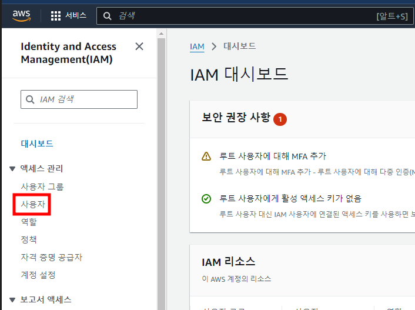
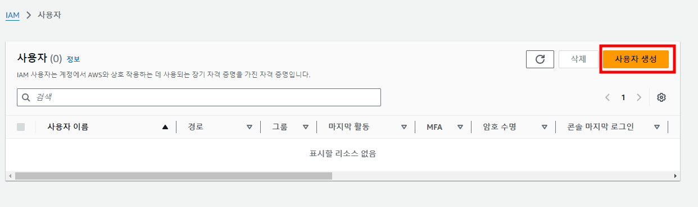
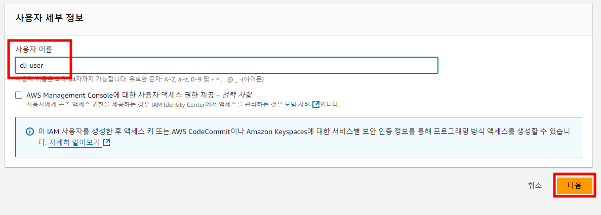
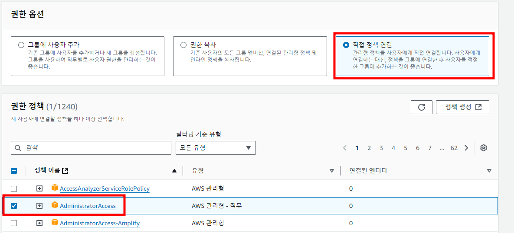
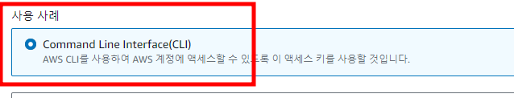
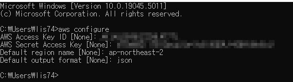
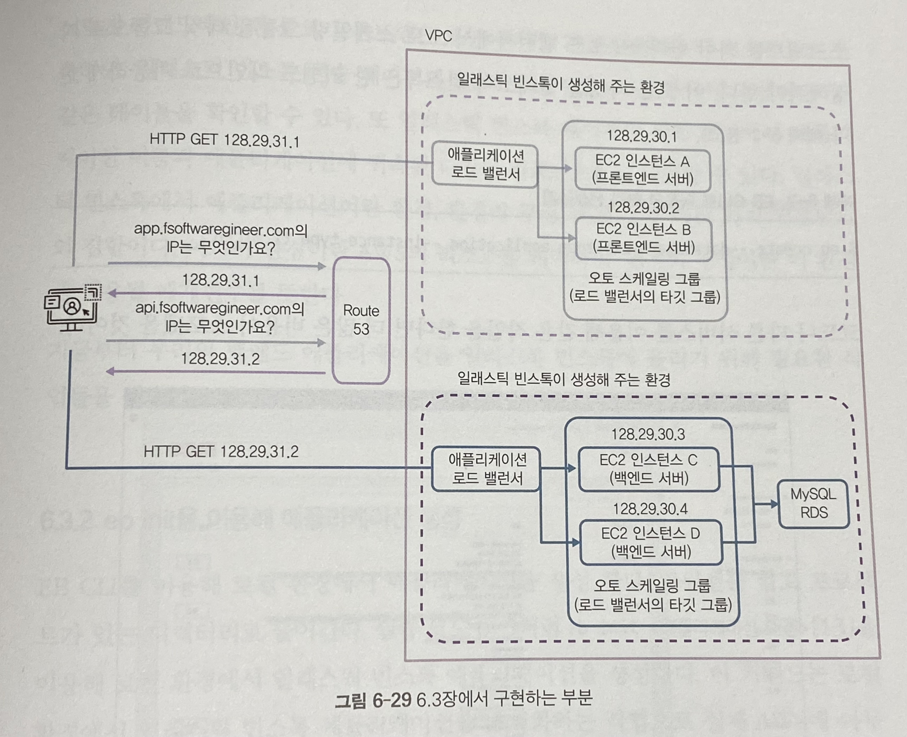
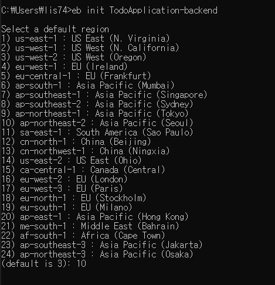
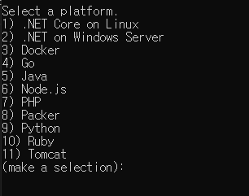
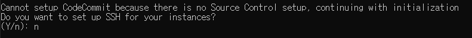

# 프로덕션 배포
- 현재 우리의 프로젝트는 로컬호스트에서만 실행을 시켰다.
- 다른 사람들이 24시간 사용하기 위해서는 하루 종일 실행시켜줄 서버가 필요하다.
- 우리 컴퓨터를 절대 끄지 않고 애플리케이션 서버로만 가동시킨다면 서버로 사용할 수도 있다.
- 하지만 우리는 웹 서핑, 게임, 문서 작성 등 다양한 용도로 컴퓨터를 사용한다.
- 따라서 서버로 사용하기에는 적합하지 않다
- 하지만 서버 전용 컴퓨터는 100만원 이상이다.
- 또는 서버를 빌려주는 회사에 의탁해 매달 비용을 지불한다면 한달에 몇 십만원은 사용해야 한다.
- 적어도 한 개의 애플리케이션 서버와 한 개의 데이터베이스 서버가 필요하다.
- 서버 이외에도 네트워크 관련 장비와 구축비용, 또 이를 구축하고 운영하기 위한 인건비를 포함하면 애플리케이션을 서비스 하는데 자본이 적지 않게 필요하다.
- 클라우드 컴퓨팅 서비스를 이용하면 이렇게 서비스를 구축하고 운영하기 위한 비용을 절약할 수 있다.

# 클라우드 컴퓨팅 서비스란?

- 클라우드 컴퓨팅은 인터넷을 통해 서버, 저장 공간, 데이터베이스, 네트워크, 소프트웨어 등을 제공하는 서비스다.
- 예전에는 컴퓨터에 필요한 프로그램이나 파일을 직접 설치하고 저장해야 했지만, 이제는 클라우드를 통해 인터넷만 있으면 언제 어디서나 데이터를 저장하거나 프로그램을 사용할 수 있다.

## 클라우드 컴퓨팅 서비스의 종류

1. **IaaS (Infrastructure as a Service)**  
   **IaaS**는 서버, 네트워크, 저장 공간 같은 기본적인 컴퓨터 자원을 인터넷을 통해 빌려주는 서비스다. 
   예시: **AWS(아마존 웹 서비스)**, **Google Cloud**  
   - 사용자가 필요한 서버를 빌리고 그 위에 운영체제를 설치하거나 설정할 수 있다.
   - 서버를 물리적으로 사지 않고 빌려서 사용하므로 비용이 절감된다.

2. **PaaS (Platform as a Service)**  
   **PaaS**는 애플리케이션을 만들고 배포할 수 있는 플랫폼을 제공하는 서비스입니다.  
   예시: **Heroku**, **Google App Engine**  
   - 개발자가 애플리케이션을 쉽게 개발하고 배포할 수 있도록 도와줌
   - 서버 설정, 네트워크 관리 등을 신경 쓰지 않고 개발에만 집중할 수 있다.

3. **SaaS (Software as a Service)**  
   **SaaS**는 인터넷을 통해 소프트웨어를 제공하는 서비스입니다.  
   예시: **Google Docs**, **Dropbox**, **Slack**  
   - 소프트웨어를 다운로드하지 않고, 웹 브라우저를 통해 바로 사용 가능
   - 예를 들어, 구글 드라이브에 파일을 저장하고 언제 어디서나 열어볼 수 있다.

### 클라우드 컴퓨팅 서비스의 장점

- **비용 절감**: 필요한 만큼만 자원을 빌려 쓸 수 있기 때문에 물리적인 장비를 사지 않아도 된다.
- **확장성**: 사용량에 따라 자원을 쉽게 늘리거나 줄일 수 있다.
- **접근성**: 인터넷만 있으면 언제 어디서든 데이터를 저장하고 프로그램을 사용할 수 있다.
- **안전성**: 클라우드는 데이터를 안전하게 보관하고 백업해주는 기능이 있어 데이터를 잃어버릴 위험이 줄어든다.

### 클라우드 컴퓨팅 서비스가 중요한 이유

- 데이터를 클라우드에 저장하면, 컴퓨터나 스마트폰에 문제가 생겨도 데이터를 잃어버리지 않다.
- 기업들은 더 많은 컴퓨터와 서버를 직접 관리할 필요 없이 클라우드를 통해 손쉽게 자원을 관리할 수 있다.
- 언제 어디서나 파일에 접근하고 작업할 수 있어 더 효율적으로 일할 수 있다.

## 실습 주의점
- AWS 계정을 생성하면 1년간 Free-Tier 사용권이 주어진다.
- 특정 리소스에 한해 무료로 사용할 수 있다.
- 우리가 무료로 사용할 리소스는 EC2와 S3이다.
- Free-Tier로 EC2를 가동하면 한달에 대략 2~3만원이 든다.
- localhost나 ip가 아닌 도메인을 살 때 2~3만원이 든다.
- DNS레코드 사용비용 (5~6천원)
- 로드 밸런서 비용 약 2만원/달을 지불해야 한다.
- 이는 서버를 한달 내내 운영했을 때의 비용이다.
- 실제로 테스팅만 하는 데는 도메인 비용과 DNS비용, 로드 밸런서 비용을 함해 2~3만원이 채 들지 않는다.
- 또 도메인과 DNS레코드 사용은 필수가 아니다.
- 실습 후 반드시 AWS의 모든 리소스를 삭제하고 정리해야 한다.
- 그렇지 않으면 사용하지 않았음에도 비용을 지불해야 할 수 있다.

## 서비스 아키텍처
- 서비스를 배포하기에 앞서, 프로덕션 환경을 어떻게 구성할지 생각을 해봐야 한다.


### 프로덕션 과정
1. 누군가 우리 서비스의 프론트엔드 주소(app.fsoftwareengineer.com)을 브라우저에 치고 들어온다.
2. 프론트엔드 서버에 연결된 애플리케이션 로드 밸런서를 거쳐 로드 밸런서에 연결된 오토 스케일링 그룹 내의 EC2 인스턴스 중 하나에 트래픽이 전달된다.
3. EC2 인스턴스 내부에서 실행 중인 우리 프론트엔드 애플리케이션이 브라우저에서 동작할 리액트.js 애플리케이션을 반환한다.
4. 유저는 우리의 프론트엔드 앱 메인 화면을 보고 아이디와 비밀번호를 입력한 후 로그인 버튼을 누른다.
5. 이번에는 백엔드 서버의 애플리케이션 로드 밸런서를 통해 백엔드 애플리케이션에 전달된다
6. 백엔드 애플리케이션은 MySQL서버와 통신해 적절한 데이터를 주고받는다.

## EC2(Amazon Elastic Compute Cloud)란?
- AWS(Amazon Web Services)에서 제공하는 클라우드 기반의 가상 서버 서비스다.
- 아마존으로부터 컴퓨터를 한 대 빌리는거라고 생각하면된다.
- EC2를 사용하면 물리적인 서버를 구매할 필요 없이, 필요에 따라 가상 서버를 생성하고 관리할 수 있다. 
- 이를 통해 유연하고 확장 가능한 컴퓨팅 환경을 제공받을 수 있다.

### EC2의 주요 특징

1. **확장성**  
   EC2 인스턴스(가상 서버)는 사용자가 필요할 때 쉽게 크기를 확장하거나 축소할 수 있다. 갑작스러운 트래픽 증가에도 빠르게 대응할 수 있도록 서버를 추가하거나 줄일 수 있다.

2. **다양한 인스턴스 타입**  
   EC2는 다양한 용도에 맞는 여러 인스턴스 타입을 제공한다. 예를 들어, 고성능 연산이 필요한 애플리케이션, 메모리 집중형 작업, 또는 일반적인 웹 서버 운영 등 목적에 맞게 인스턴스를 선택할 수 있다.

3. **비용 절감**  
   사용자는 EC2 인스턴스를 필요한 시간 동안만 사용하고, 사용한 만큼만 비용을 지불하면 된다. 예약 인스턴스나 스팟 인스턴스를 이용하면 추가적인 비용 절감이 가능하다.

4. **탄력성(Elasticity)**  
   필요에 따라 서버를 자동으로 추가하거나 제거할 수 있다. 이를 통해 트래픽 변화에 유연하게 대응할 수 있다.

5. **안정성**  
   AWS의 글로벌 인프라를 기반으로, EC2는 높은 가용성과 신뢰성을 제공한다. 서버 장애 발생 시 자동으로 복구하거나 대체 인스턴스를 띄울 수 있다.

6. **보안**  
   EC2는 네트워크 접근 제어, 방화벽 설정, 데이터 암호화 등의 보안 기능을 제공하여 안전하게 서버를 운영할 수 있게 한다.

### EC2 서버에 접근
- 로컬 환경에서 애플리케이션을 실행했을 때는, localhost:9090이나 localhost:3000등으로 애플리케이션에 접근했다.
- EC2에서 애플리케이션을 실행하는 경우 EC2의 IP나 EC2가 제공하는 퍼블릭 도메인을 이용해 애플리케이션에 접근할 수 있다.


- 각 서버는 IP 주소를 가지고 있고, 각 애플리케이션은 기본 포트인 80번 포트에서 실행된다고 가정하자.
```
※ 80번 포트
HTTP(HyperText Transfer Protocol)의 기본 포트다.
웹 브라우저가 HTTP로 웹 서버에 접속할 때, 특별히 다른 포트를 지정하지 않으면 기본적으로 80번 포트를 사용한다. 
만약 HTTPS(보안이 강화된 HTTP)를 사용할 경우에는 443번 포트를 사용한다.
```
- 우리는 localhost:8080/todo 대신 128.29.30.2/todo를 이용해 REST API를 사용할 수 있다.
- 하지만 우리가 네이버나 구글을 사용할 때 IP를 적지 않기 때문에 DNS가 필요하다.

## DNS(Domain Name System)
- 사람이 읽기 쉬운 도메인 이름(예: www.example.com)을 컴퓨터가 이해할 수 있는 IP 주소(예: 192.168.1.1)로 변환해 주는 시스템이다.
- 인터넷에서 웹사이트에 접속할 때 도메인 이름을 입력하면, DNS가 해당 도메인에 연결된 IP 주소를 찾아주는 역할을 한다.
- 이를 통해 사용자는 복잡한 숫자(IP 주소)를 외울 필요 없이, 쉽게 웹사이트에 접속할 수 있다.
- DNS에 도메인 이름을 물어보고 IP를 가져와 통신하는 작업은 브라우저가 대신 해준다.
- 우리 컴퓨터는 IP말고도 DNS서버 IP를 가지고 있다.
- 이 IP는 인터넷 서비스 제공자(ISP -Internet Service Provider sk,kt,lg)회사들이 제공해준다.
- ISP의 DNS 서버에 우리가 원하는 주소가 없으면 다른 여러 DNS 서버들에게 물어봐 최종적으로 우리가 원하는 주소를 받아온다.
- 여러 다른 DNS 서버들 중 하나가 바로 라우트 53이다.

## Amazon Route 53
- **Amazon Route 53**은 **AWS(Amazon Web Services)**에서 제공하는 클라우드 기반의 DNS(Domain Name System) 웹 서비스다. 
- 쉽게 말해, 인터넷에서 도메인 이름을 IP 주소로 변환해주는 역할을 한다. 
- 웹사이트에 접속할 때, 사용자는 도메인 이름을 입력하지만, 컴퓨터는 IP 주소를 통해 통신을 한다. 
- Route 53은 이 도메인 이름과 IP 주소를 연결해주는 서비스다.

### Route 53의 이름 의미
Route 53의 이름은 두 가지 의미를 가지고 있다
1. **Route**: 트래픽을 어디로 보낼지 결정하는 '라우팅' 기능을 말한다.
2. **53**: DNS가 기본적으로 사용하는 네트워크 포트 번호가 53번이기 때문에 Route 53이라고 부른다.


- app.fsoftwareengineer.com을 우리가 지정한 IP에 매핑할 수 있다.
- 그 IP는 EC2의 IP가 될 수 있다.
- 이렇게 하면 app.fsoftwareengineer.com로 접속할 때마다 애플리케이션이 실행중인 EC2로 라우팅 될 것이다.

## 애플리케이션 로드 밸런서


- 서버 하나로 서비스를 운영하고 있다고 생각을 해보자
- 프론트엔드 서비스만 운영을 한다고 생각을 했을 때 우리 프론트엔드 서버는 EC2에서 실행중이고 1초에 백만 개의 요청을 처리할 수 있다고 가정하자.
- 어느날 서비스가 성장해 1초에 2백만 개의 요청을 받기 시작했다.
- 서버를 증설해야 한다는 뜻이다.
- 서버를 증설하기 위해 EC2를 하나더 실행시킨다.
- 기존의 인스턴스를 A, 새 인스턴스를 B라고한다.
- app.fsoftwareengineer.com으로 접근 하면 어디와 연결되어 있는가?
- 인스턴스 A에 연결되어 있기 때문에  B는 아무도 접근할 수 없다.
- 트래픽을 A와 B에 적절히 분배하려면 두 인스턴스가 공유하는 IP가 필요하다.


### 로드밸런서
- 여러 대의 서버로 트래픽을 분산시키는 장치다. 
- 이를 통해, 많은 사용자가 한꺼번에 웹사이트나 애플리케이션에 접속해도 특정 서버에만 부담이 가지 않게 도와준다. 
- 쉽게 말해, 트래픽을 여러 서버로 나눠서 웹사이트가 더 빠르고 안정적으로 동작하도록 해주는 장치라고 생각하면 된다.

### 이름의 의미
- 로드
  - 트래픽을 의미한다.
- 밸런서
  - 균형을 잡아준다는 뜻이다.

- 로드밸런서에는 많은 기능이 있지만 기본적으로는 트래픽을 서버에 적절히 분배하는 역할을 한다.
- 이 로드 밸런서로 우리 AWS의 애플리케이션 로드 밸런서를 사용한다.
- 애플리케이션 로드 밸런서는 HTTP/HTTPS 요청을 연결된 서버로 분배한다.

## 오토 스케일링 그룹
- AWS 애플리케이션 로드 밸런서에 두 개의 인스턴스가 연결돼 있다고 가정하자.
- 이렇게 연결된 인스턴스들은 AWS에서는 타깃 그룹이라고 한다.
- 이제 서버도 증설을 했음에도 둘 중 하나가 다운되었을 때 로드 밸런서는 자동으로 남아있는 인스턴스에 트래픽을 준다.
- 우리는 중단된 인스턴스를 다시 켜줄 필요가 있다.

### 오토 스케일링 그룹(Auto Scaling Group)
- 클라우드 환경에서 서버의 수를 자동으로 늘리거나 줄여주는 기능이다. 
- 쉽게 말해, 서버가 필요한 만큼 자동으로 늘어나거나 줄어들게 해주는 시스템이라고 생각하면 된다. 
- 이를 통해 서버가 과부하로 인해 느려지거나, 트래픽이 줄어들었을 때 불필요한 자원을 낭비하지 않도록 관리할 수 있다.

### 오토 스케일링 그룹의 주요 설정 요소
- **최소, 최대, 원하는 인스턴스 수**  
   - **최소(min) 인스턴스 수**: 절대로 그 이하로 줄지 않는 최소 서버 수를 의미한다.
   - **최대(max) 인스턴스 수**: 그 이상으로 늘어나지 않는 최대 서버 수를 의미한다.
   - **원하는(desired) 인스턴스 수**: 현재 트래픽 상황에서 유지하고 싶은 서버 수를 의미한다.

### ASG 예시
- 적정 인스턴스가 2이고 최소 인스턴스도 2라고 해보자.
- 1개의 인스턴스가 다운되면 로드 밸런서가 ASG에게 '이 인스턴스가 다운됐다'하고 알려줄 수 있다.
- 그러면 ASG는 그 인스턴스를 제고하고 새 인스턴스를 실행시킨다.
- 또 트래픽의 변동에 따라 자동으로 스케일인(자동으로 서버 증설) 또는 스케일 아웃(자동으로 서버 수축)하도록 설정할 수 있다.

## VPC(가상 사설 클라우드, Virtual Private Cloud)
- 사용자가 클라우드 상에서 자신의 독립적인 가상 네트워크를 설정할 수 있는 기능이다. 
- 쉽게 말해, **인터넷상의 나만의 네트워크 공간**을 만드는 것이라고 생각하면 된다.
- 가상 네트워크라는 것은 특별한 네트워크 설정을 하지 않는 이상 이 네트워크 안에서 생성되는 EC2는 외부에서 접근하지 못한다는 뜻이다.
- VPC 안에서는 원하는 대로 서버와 네트워크 설정을 하고, 다른 사람과 격리된 안전한 환경에서 작업을 할 수 있다.

## 서브넷
- **VPC 안에서 더 작은 네트워크 영역**을 나눈 것이다.
- 예를 들어, VPC가 큰 집이라면 서브넷은 집 안의 여러 방처럼 구분된 공간이라고 생각하면 된다.
- 서브넷을 나누는 이유는 서버나 애플리케이션의 역할에 따라 네트워크를 분리하고, 더 효율적이고 안전하게 관리하기 위해서다.
- 우리는 VPC의 서브넷 내에 EC2 서버를 생성한다.
- 우리는 AWS가 제공하는 디폴트 VPC와 서브넷을 사용할 예정이므로 VPC나 서브넷에 대해 자세하게 알지 못해도 진행하는데 문제는 없다.

## Elastic Beanstalk(일래스틱 빈스톡)
- **애플리케이션을 쉽게 배포하고 관리**할 수 있도록 도와준다. 
- 쉽게 말해, 일래스틱 빈스톡을 사용하면 **복잡한 서버 설정이나 네트워크 관리 없이** 웹 애플리케이션을 빠르고 쉽게 실행할 수 있게 도와주는 서비스다.
- 우리는 위에 설명한 환경 구축을 대신 해 주는 서비스가 바로 AWS 일래스틱 빈스톡이다.


- 우리는 일래스틱 빈스톡에게 필요한 리소스들을 알려준다.
- 로드 밸런서, 최소 인스턴스 갯수, 오토 스케일링 그룹, RDS(데이터베이스), 그리고 EC2 환경을 구축하고 EC2에 우리 애플리케이션을 실행한다.

## AWS CLI와 EB CLI 설치

### AWS의 리소스에 접근하는 방법
1. AWS 콘솔을 통해 접근할 수 있다.
   - AWS 콘솔은 https://console.aws.amazon.com을 통해 접근할 수 있고 GUI기반으로 동작한다.
2. 두 번째 방법은 AWS CLI를 이용하는 방법이다.
    - CLI를 이용하면 터미널이나 파워셀에서 명령어를 이용해 AWS 리소스에 접근할 수 있다.
3. 세 번째 방법은 AWS SDK를 이용하는 것이다.
    - AWS SDK는 라이브러리다.


## AWS 계정생성
- https://portal.aws.amazon.com/billing/signup#/start에서 AWS 계정을 생성하자.
- 계정을 생성하는 과정에서 신용카드 정보를 입력해야 하는데, 신용카드 확인 차원에서 1달러를 출금 후 재입금 하니 유의하도록 하자.
- 회원가입을 완료하면 https://console.aws.amazon.com로 들어가 AWS 콘솔로 로그인한다.

## 파이썬 설치
- AWS CLI와 EB CLI는 파이썬 기반으로 작동한다.
- 따라서 파이썬이 설치돼 있지 않다면 파이썬을 먼저 설치해야 한다.
- 파워셸 또는 터미널에서 python --version로 파이썬이 설치돼있는지 확인하자

### 파이썬 설치
```
https://www.python.org/downloads/windows/
```
- 설치시 Add python.exe to PATH 체크하기
- pip --version을 이용해 pip가 설치되었는지도 확인한다.

## AWS CLI 설치
- https://awscli.amazonawa.com/AWSCLIV2.msi 에서 AWS CLI를 다운받아 설치한다.

### AWS CLI 설정
- AWS 콘솔(https://console.aws.amazon.com)에 로그인한 후 IAM으로 들어간다.


- 우리가 콘솔로 접근하기 위해 로그인을 했지만 보통 IT기업은 여러 명의 엔지니어가 협업해 서비스를 운영한다.
- 그 모든 엔지니어가 같은 CLI 계정, 게다가 그냥 계정도 아닌 루트(어드민)계정을 사용하는 것은 보안에 취약하다.
- 따라서 AWS는 IAM(Identity and Access Management)라는 툴을 제공해, 사람마다 역할마다 다른 접근 권한을 줄 수 있도록 한다.
- 이때 사람에게는 아이디와 비밀번호를, 사람이 아닌 프로그램에게는 액세스 키와 비밀 액세스 키를 따로따로 제공할 수 있다.
- AWS CLI는 프로그램이므로 지금부터 AWS CLI가 사용할 액세스 키와 비밀 액세스 키를 발급해주자.



- IAM을 선택해 들어간 후 왼쪽 메뉴에서 사용자를 클릭한다.



- 사용자 추가 버튼을 눌러 사용자를 추가해준다.



- 사용자 추가 페이지에서 원하는 사용자 이름을 입력하고 다음을 누른다.



- 기존 정책 직접 연결을 누른 후 AdministratorAccess를 선택한다.
```
※ AdministratorAccess정책
모든 AWS 리소스에 대해 모든 권한을 준다는 뜻이다.
```
- 사용자 생성을 클릭한다.


- aws-cli에서 사용할 액세스 키를 만들어보자



- 맨 아래 체크박스를 체크하고 다음으로 넘어간다.

- 태그는 따로 설정할것이 없으니 넘어가고 액세스 키를 생성한다.
- 생성한 액세스키와 비밀 액세스키는 메모장에 저장을 해놓는다.
- cmd를 열어 aws configure를 입력한다.



### Default region name
- AWS에는 리전이라는 개념이 있다.
- AWS 데이터센터가 있는 장소를 말한다.
- 서비스를 실제로 사용할 사용자와 서비스가 호스팅되고 있는 데이터 센터가 가까울수록 네트워크 대기 시간이 짧아진다.
- 한국에 거주할 확률이 높다면 ap-northeast-2를 선택하면 된다.

## pip를 이용해 EB CLI 설치
- AWS CLI는 AWS의 모든 서비스를 위한 CLI이다.
- 따라서 AWS CLI를 사용하면 EC2, 로드밸런서, 오토 스케일링 그룹, 라우트 53, 다이나모 디비 등등 AWS의모든 서비스를 사용할 수 있다.
- 반면 우리가 지금 설치할 EB CLI는 일래스틱 빈스톡만을 위한 CLI이다.
- 일래스틱 빈스톡의 환경을 구축하고 설정할 수 있다.

```
pip install awsebcli --upgrade --user
```

### EB-CLI 환경변수 설정하기
- Path로 들어가서 아래의 문구를 추가한다.
```
%USERPROFILE%\AppData\Roaming\Python\Python313\Scripts
```
- cmd에서 환경변수가 잘 적용됐는지 확인한다.
```
C:\Users\lis74>eb --version
EB CLI 3.21.0 (Python 3.13.0 (tags/v3.13.0:60403a5, Oct  7 2024, 09:38:07) [MSC v.1941 64 bit (AMD64)])
```

## AWS 일래스틱 빈스톡을 이용한 백엔드 배포



- 이전에도 설명했지만 일래스틱 빈스톡으로 이용하면 애플리케이션 로드 밸런서, 오토 스케일링 그룹, RDS, EC2 등을 따로따로 설정하지 않아도 된다.
- 예를 들어 우리 백엔드 애플리케이션의 경우 RDS에 MySQL를 데이터베이스로 두며, 서버는 로드 밸런서에 오토 스케일링 그룹을 연결하는 형태이다.
- 따라서 첫 번째로 데이터베이스 설정을 해야 한다. 그 후, 오토 스케일링 그룹을 생성하고 오토 스케일링 그룹 내에서 실행되는 EC2 인스턴스들이 애플리케이션을 실행할 수 있도록 스크립트를 짜야한다.
- 또 로드밸런서에서 오토 스케일링 그룹을 타깃 그룹으로 지정해줘야 한다.
- 이 모든 과정을 일래스틱 빈스톡은 한 커맨드 라인으로 가능하게 한다.

### eb init을 이용해 애플리케이션 생성
- EB CLI를 이용해 로컬 환경에서 애플리케이션을 생성한다.
- cmd를 열고 프로젝트가 있는 디렉터리로 이동한다.
- eb init <애플리케이션 이름>을 이용해 로컬 환경에서 일래스틱 빈스톡 애플리케이션을 생성한다.
- 이 커맨드는 로컬 환경에서 일래스틱 빈스톡 애플리케이션을 초기화하는 작업으로 실제 AWS에 아무 작업도 하지 않는다.

```
D:\develop\springboot\work>eb init TodoApplication-backend
```


- 일래스틱 빈스톡이 어느 리전에 이 애플리케이션의 환경을 생성해야 하는지 물어보는 것이다.
- 이후 생성되는 모든 리소스는 지금 선택하는 리전에 생성된다.


- 이 애플리케이션이 사용할 플랫폼을 선택하는 것이다.
- 애플리케이션의 플랫폼이란 서버, 미들웨어, 운영체제등을 말한다.
- 우리는 리눅스에서 자바8 애플리케이션을 실행시키기 위해 Java를 선택한다.
- 그 다음 자바의 버전과 자바가 실행될 운영체제를 선택한다
- 우리는 아마존 리눅스 위에서 도는 Correto 11을 선택한다.


- 일래스틱 빈스톡을 이용해 생성된 EC2에 접근하기 위해 SSH를 설정할 것인지 묻는 내용이다.
- 우리는 설정하지 않으므로 n을 입력한다.

```
※SSH
네트워크 상에서 두 컴퓨터 간의 안전한 통신을 가능하게 해주는 프로토콜이다.
주로 원격 시스템에 접속하거나, 명령을 실행하거나, 파일을 안전하게 전송할 때 사용된다.
```
- 설정을 완료하면 디렉터리에 .elasticbeanstalk디렉터리가 생성된다. .elasticbeanstalk디렉터리 안에는 config.yml 파일이 생성되는데 이 파일에 방금 설정한 항목들이 나열돼있다.

### 백엔드 애플리케이션 설정
- 이제 백엔드 애플리케이션을 배포하기 위한 사전 작업을 해야한다.
- 사전 작업은 애플리케이션 프로퍼티 파일을 개발용과 배포용으로 분리해주는 작업이다.

### application-prod.yaml
- src/main/resources 아래에 application-prod.yaml과 application-dev.yaml을 생성한다.
- 자동생성된 application-properties.yml은 삭제한다.

```yaml
server:
  port : 5000
spring:
  jpa:
    database: MYSQL
    show-sql: true
    database-platform: org.hibernate.dialect.MySQL8Dialect
    hibernate:
      ddl-auto: update
  datasource:
    url: jdbc:mysql://${rds.hostname}:${rds.port}/${rds.db.name}
    username: ${rds.username}
    password: ${rds.password}
```

### server 설정
- 일래스틱 빈스톡은 기본적으로 애플리케이션이 5000포트를 사용한다고생각한다.
- 일래스틱 빈스톡의 설정을 바꿔줄 수도 있지만 우리는 그냥 애플리케이션이 5000번 포트에서 실행하도록 설정하자

### jpa 설정
- database: MYSQL : 데이터베이스 MySQL 사용
- show-sql: true : jpa가 실행한 sql쿼리를 보여 줄 지 여부.
- database-platform: org.hibernate.dialect.MySQL8Dialect : database-platform으로 MySQL8Dialect을 사용한다.
  - MySQL8Dialect : 자바의 데이터 형과 데이터베이스의 데이터형을 매핑해주는 라이브러리이다.
  - String을 Varchar로 매핑해주거나, Integer를 bigint로 매핑해준다.
  - 또 @Id, @GeneratedValue 등 각종 어노테이션을 데이터베이스 키워드로 전환해주는 등 자바와 데이터베이스 사이에서 다리 역할을 한다.
- hibernate: ddl-auto: update : ddl은 테이블 생성과 관련된 쿼리를 의미한다.
- ddl-auto는 애플리케이션 시작 시 데이터베이스 테이블을 어떻게 하겠냐에 대한 이야기다.
- datasource: url: jdbc:mysql://${rds.hostname}:${rds.port}/${rds.db.name} : 데이터베이스 URL을 의미한다.
- 일래스틱 빈스톡이 만들어주므로 값을 지정해 줄 수 있도록 위와 같이 쓴다.