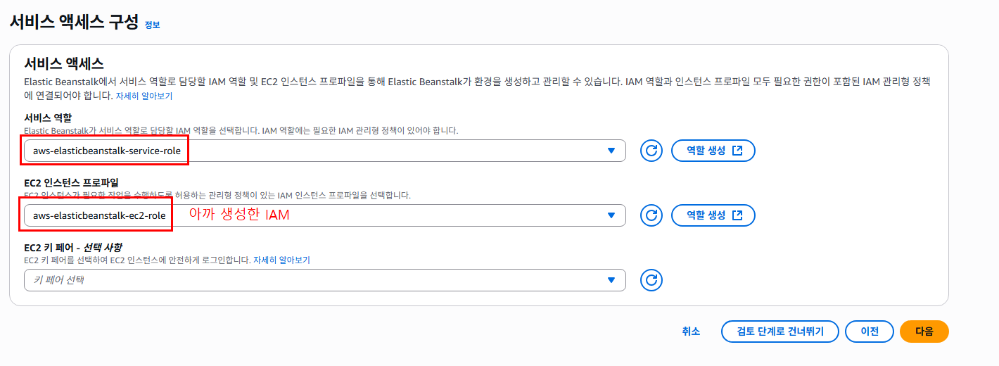
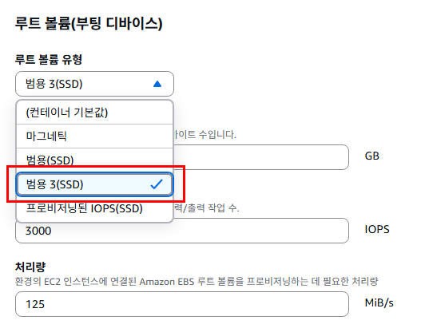
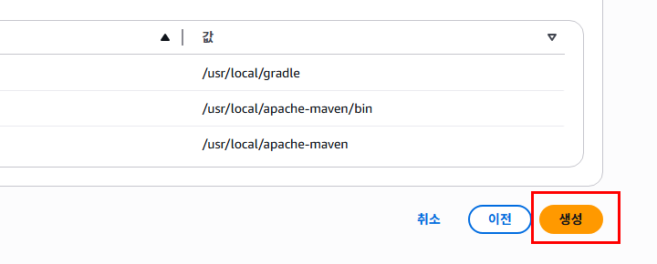
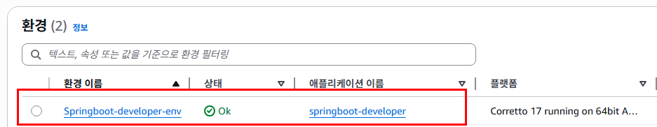

# 프로덕션 배포
- 현재 우리의 프로젝트는 로컬호스트에서만 실행을 시켰다.
- 다른 사람들이 24시간 사용하기 위해서는 하루 종일 실행시켜줄 서버가 필요하다.
- 우리 컴퓨터를 절대 끄지 않고 애플리케이션 서버로만 가동시킨다면 서버로 사용할 수도 있다.
- 하지만 우리는 웹 서핑, 게임, 문서 작성 등 다양한 용도로 컴퓨터를 사용한다.
- 따라서 서버로 사용하기에는 적합하지 않다
- 하지만 서버 전용 컴퓨터는 100만원 이상이다.
- 또는 서버를 빌려주는 회사에 의탁해 매달 비용을 지불한다면 한달에 몇 십만원은 사용해야 한다.
- 적어도 한 개의 애플리케이션 서버와 한 개의 데이터베이스 서버가 필요하다.
- 서버 이외에도 네트워크 관련 장비와 구축비용, 또 이를 구축하고 운영하기 위한 인건비를 포함하면 애플리케이션을 서비스 하는데 자본이 적지 않게 필요하다.
- 클라우드 컴퓨팅 서비스를 이용하면 이렇게 서비스를 구축하고 운영하기 위한 비용을 절약할 수 있다.

# 클라우드 컴퓨팅 서비스란?

- 클라우드 컴퓨팅은 인터넷을 통해 서버, 저장 공간, 데이터베이스, 네트워크, 소프트웨어 등을 제공하는 서비스다.
- 예전에는 컴퓨터에 필요한 프로그램이나 파일을 직접 설치하고 저장해야 했지만, 이제는 클라우드를 통해 인터넷만 있으면 언제 어디서나 데이터를 저장하거나 프로그램을 사용할 수 있다.

## 클라우드 컴퓨팅 서비스의 종류

1. **IaaS (Infrastructure as a Service)**  
   **IaaS**는 서버, 네트워크, 저장 공간 같은 기본적인 컴퓨터 자원을 인터넷을 통해 빌려주는 서비스다. 
   예시: **AWS(아마존 웹 서비스)**, **Google Cloud**  
   - 사용자가 필요한 서버를 빌리고 그 위에 운영체제를 설치하거나 설정할 수 있다.
   - 서버를 물리적으로 사지 않고 빌려서 사용하므로 비용이 절감된다.

2. **PaaS (Platform as a Service)**  
   **PaaS**는 애플리케이션을 만들고 배포할 수 있는 플랫폼을 제공하는 서비스입니다.  
   예시: **Heroku**, **Google App Engine**  
   - 개발자가 애플리케이션을 쉽게 개발하고 배포할 수 있도록 도와줌
   - 서버 설정, 네트워크 관리 등을 신경 쓰지 않고 개발에만 집중할 수 있다.

3. **SaaS (Software as a Service)**  
   **SaaS**는 인터넷을 통해 소프트웨어를 제공하는 서비스입니다.  
   예시: **Google Docs**, **Dropbox**, **Slack**  
   - 소프트웨어를 다운로드하지 않고, 웹 브라우저를 통해 바로 사용 가능
   - 예를 들어, 구글 드라이브에 파일을 저장하고 언제 어디서나 열어볼 수 있다.

### 클라우드 컴퓨팅 서비스의 장점

- **비용 절감**: 필요한 만큼만 자원을 빌려 쓸 수 있기 때문에 물리적인 장비를 사지 않아도 된다.
- **확장성**: 사용량에 따라 자원을 쉽게 늘리거나 줄일 수 있다.
- **접근성**: 인터넷만 있으면 언제 어디서든 데이터를 저장하고 프로그램을 사용할 수 있다.
- **안전성**: 클라우드는 데이터를 안전하게 보관하고 백업해주는 기능이 있어 데이터를 잃어버릴 위험이 줄어든다.

### 클라우드 컴퓨팅 서비스가 중요한 이유

- 데이터를 클라우드에 저장하면, 컴퓨터나 스마트폰에 문제가 생겨도 데이터를 잃어버리지 않다.
- 기업들은 더 많은 컴퓨터와 서버를 직접 관리할 필요 없이 클라우드를 통해 손쉽게 자원을 관리할 수 있다.
- 언제 어디서나 파일에 접근하고 작업할 수 있어 더 효율적으로 일할 수 있다.

## 실습 주의점
- AWS 계정을 생성하면 1년간 Free-Tier 사용권이 주어진다.
- 특정 리소스에 한해 무료로 사용할 수 있다.
- 우리가 무료로 사용할 리소스는 EC2와 S3이다.
- Free-Tier로 EC2를 가동하면 한달에 대략 2~3만원이 든다.
- localhost나 ip가 아닌 도메인을 살 때 2~3만원이 든다.
- DNS레코드 사용비용 (5~6천원)
- 로드 밸런서 비용 약 2만원/달을 지불해야 한다.
- 이는 서버를 한달 내내 운영했을 때의 비용이다.
- 실제로 테스팅만 하는 데는 도메인 비용과 DNS비용, 로드 밸런서 비용을 포함해 2~3만원이 채 들지 않는다.
- 또 도메인과 DNS레코드 사용은 필수가 아니다.
- 실습 후 반드시 AWS의 모든 리소스를 삭제하고 정리해야 한다.
- 그렇지 않으면 사용하지 않았음에도 비용을 지불해야 할 수 있다.

## 서비스 아키텍처
- 서비스를 배포하기에 앞서, 프로덕션 환경을 어떻게 구성할지 생각을 해봐야 한다.


### 프로덕션 과정
1. 누군가 우리 서비스의 프론트엔드 주소(app.fsoftwareengineer.com)을 브라우저에 치고 들어온다.
2. 프론트엔드 서버에 연결된 애플리케이션 로드 밸런서를 거쳐 로드 밸런서에 연결된 오토 스케일링 그룹 내의 EC2 인스턴스 중 하나에 트래픽이 전달된다.
3. EC2 인스턴스 내부에서 실행 중인 우리 프론트엔드 애플리케이션이 브라우저에서 동작할 리액트.js 애플리케이션을 반환한다.
4. 유저는 우리의 프론트엔드 앱 메인 화면을 보고 아이디와 비밀번호를 입력한 후 로그인 버튼을 누른다.
5. 이번에는 백엔드 서버의 애플리케이션 로드 밸런서를 통해 백엔드 애플리케이션에 전달된다
6. 백엔드 애플리케이션은 MySQL서버와 통신해 적절한 데이터를 주고받는다.

## EC2(Amazon Elastic Compute Cloud)란?
- AWS(Amazon Web Services)에서 제공하는 클라우드 기반의 가상 서버 서비스다.
- 아마존으로부터 컴퓨터를 한 대 빌리는거라고 생각하면된다.
- EC2를 사용하면 물리적인 서버를 구매할 필요 없이, 필요에 따라 가상 서버를 생성하고 관리할 수 있다. 
- 이를 통해 유연하고 확장 가능한 컴퓨팅 환경을 제공받을 수 있다.

### EC2의 주요 특징

1. **확장성**  
   EC2 인스턴스(가상 서버)는 사용자가 필요할 때 쉽게 크기를 확장하거나 축소할 수 있다. 갑작스러운 트래픽 증가에도 빠르게 대응할 수 있도록 서버를 추가하거나 줄일 수 있다.

2. **다양한 인스턴스 타입**  
   EC2는 다양한 용도에 맞는 여러 인스턴스 타입을 제공한다. 예를 들어, 고성능 연산이 필요한 애플리케이션, 메모리 집중형 작업, 또는 일반적인 웹 서버 운영 등 목적에 맞게 인스턴스를 선택할 수 있다.

3. **비용 절감**  
   사용자는 EC2 인스턴스를 필요한 시간 동안만 사용하고, 사용한 만큼만 비용을 지불하면 된다. 예약 인스턴스나 스팟 인스턴스를 이용하면 추가적인 비용 절감이 가능하다.

4. **탄력성(Elasticity)**  
   필요에 따라 서버를 자동으로 추가하거나 제거할 수 있다. 이를 통해 트래픽 변화에 유연하게 대응할 수 있다.

5. **안정성**  
   AWS의 글로벌 인프라를 기반으로, EC2는 높은 가용성과 신뢰성을 제공한다. 서버 장애 발생 시 자동으로 복구하거나 대체 인스턴스를 띄울 수 있다.

6. **보안**  
   EC2는 네트워크 접근 제어, 방화벽 설정, 데이터 암호화 등의 보안 기능을 제공하여 안전하게 서버를 운영할 수 있게 한다.

### EC2 서버에 접근
- 로컬 환경에서 애플리케이션을 실행했을 때는, localhost:9090이나 localhost:3000등으로 애플리케이션에 접근했다.
- EC2에서 애플리케이션을 실행하는 경우 EC2의 IP나 EC2가 제공하는 퍼블릭 도메인을 이용해 애플리케이션에 접근할 수 있다.


- 각 서버는 IP 주소를 가지고 있고, 각 애플리케이션은 기본 포트인 80번 포트에서 실행된다고 가정하자.
```
※ 80번 포트
HTTP(HyperText Transfer Protocol)의 기본 포트다.
웹 브라우저가 HTTP로 웹 서버에 접속할 때, 특별히 다른 포트를 지정하지 않으면 기본적으로 80번 포트를 사용한다. 
만약 HTTPS(보안이 강화된 HTTP)를 사용할 경우에는 443번 포트를 사용한다.
```
- 우리는 localhost:8080/todo 대신 128.29.30.2/todo를 이용해 REST API를 사용할 수 있다.
- 하지만 우리가 네이버나 구글을 사용할 때 IP를 적지 않기 때문에 DNS가 필요하다.

## DNS(Domain Name System)
- 사람이 읽기 쉬운 도메인 이름(예: www.example.com)을 컴퓨터가 이해할 수 있는 IP 주소(예: 192.168.1.1)로 변환해 주는 시스템이다.
- 인터넷에서 웹사이트에 접속할 때 도메인 이름을 입력하면, DNS가 해당 도메인에 연결된 IP 주소를 찾아주는 역할을 한다.
- 이를 통해 사용자는 복잡한 숫자(IP 주소)를 외울 필요 없이, 쉽게 웹사이트에 접속할 수 있다.
- DNS에 도메인 이름을 물어보고 IP를 가져와 통신하는 작업은 브라우저가 대신 해준다.
- 우리 컴퓨터는 IP말고도 DNS서버 IP를 가지고 있다.
- 이 IP는 인터넷 서비스 제공자(ISP -Internet Service Provider sk,kt,lg)회사들이 제공해준다.
- ISP의 DNS 서버에 우리가 원하는 주소가 없으면 다른 여러 DNS 서버들에게 물어봐 최종적으로 우리가 원하는 주소를 받아온다.
- 여러 다른 DNS 서버들 중 하나가 바로 라우트 53이다.

## Amazon Route 53
- **Amazon Route 53**은 **AWS(Amazon Web Services)**에서 제공하는 클라우드 기반의 DNS(Domain Name System) 웹 서비스다. 
- 쉽게 말해, 인터넷에서 도메인 이름을 IP 주소로 변환해주는 역할을 한다. 
- 웹사이트에 접속할 때, 사용자는 도메인 이름을 입력하지만, 컴퓨터는 IP 주소를 통해 통신을 한다. 
- Route 53은 이 도메인 이름과 IP 주소를 연결해주는 서비스다.

### Route 53의 이름 의미
- Route 53의 이름은 두 가지 의미를 가지고 있다
1. **Route**: 트래픽을 어디로 보낼지 결정하는 '라우팅' 기능을 말한다.
2. **53**: DNS가 기본적으로 사용하는 네트워크 포트 번호가 53번이기 때문에 Route 53이라고 부른다.


- app.fsoftwareengineer.com을 우리가 지정한 IP에 매핑할 수 있다.
- 그 IP는 EC2의 IP가 될 수 있다.
- 이렇게 하면 app.fsoftwareengineer.com로 접속할 때마다 애플리케이션이 실행중인 EC2로 라우팅 될 것이다.

## 애플리케이션 로드 밸런서


- 서버 하나로 서비스를 운영하고 있다고 생각을 해보자
- 프론트엔드 서비스만 운영을 한다고 생각을 했을 때 우리 프론트엔드 서버는 EC2에서 실행중이고 1초에 백만 개의 요청을 처리할 수 있다고 가정하자.
- 어느날 서비스가 성장해 1초에 2백만 개의 요청을 받기 시작했다.
- 서버를 증설해야 한다는 뜻이다.
- 서버를 증설하기 위해 EC2를 하나더 실행시킨다.
- 기존의 인스턴스를 A, 새 인스턴스를 B라고한다.
- app.fsoftwareengineer.com으로 접근 하면 어디와 연결되어 있는가?
- 인스턴스 A에 연결되어 있기 때문에  B는 아무도 접근할 수 없다.
- 트래픽을 A와 B에 적절히 분배하려면 두 인스턴스가 공유하는 IP가 필요하다.


### 로드밸런서
- 여러 대의 서버로 트래픽을 분산시키는 장치다. 
- 이를 통해, 많은 사용자가 한꺼번에 웹사이트나 애플리케이션에 접속해도 특정 서버에만 부담이 가지 않게 도와준다. 
- 쉽게 말해, 트래픽을 여러 서버로 나눠서 웹사이트가 더 빠르고 안정적으로 동작하도록 해주는 장치라고 생각하면 된다.

### 이름의 의미
- 로드
  - 트래픽을 의미한다.
- 밸런서
  - 균형을 잡아준다는 뜻이다.

- 로드밸런서에는 많은 기능이 있지만 기본적으로는 트래픽을 서버에 적절히 분배하는 역할을 한다.
- 이 로드 밸런서로 우리 AWS의 애플리케이션 로드 밸런서를 사용한다.
- 애플리케이션 로드 밸런서는 HTTP/HTTPS 요청을 연결된 서버로 분배한다.

## 오토 스케일링 그룹
- AWS 애플리케이션 로드 밸런서에 두 개의 인스턴스가 연결돼 있다고 가정하자.
- 이렇게 연결된 인스턴스들은 AWS에서는 타깃 그룹이라고 한다.
- 이제 서버도 증설을 했음에도 둘 중 하나가 다운되었을 때 로드 밸런서는 자동으로 남아있는 인스턴스에 트래픽을 준다.
- 우리는 중단된 인스턴스를 다시 켜줄 필요가 있다.

### 오토 스케일링 그룹(Auto Scaling Group)
- 클라우드 환경에서 서버의 수를 자동으로 늘리거나 줄여주는 기능이다. 
- 쉽게 말해, 서버가 필요한 만큼 자동으로 늘어나거나 줄어들게 해주는 시스템이라고 생각하면 된다. 
- 이를 통해 서버가 과부하로 인해 느려지거나, 트래픽이 줄어들었을 때 불필요한 자원을 낭비하지 않도록 관리할 수 있다.

### 오토 스케일링 그룹의 주요 설정 요소
- **최소, 최대, 원하는 인스턴스 수**  
   - **최소(min) 인스턴스 수**: 절대로 그 이하로 줄지 않는 최소 서버 수를 의미한다.
   - **최대(max) 인스턴스 수**: 그 이상으로 늘어나지 않는 최대 서버 수를 의미한다.
   - **원하는(desired) 인스턴스 수**: 현재 트래픽 상황에서 유지하고 싶은 서버 수를 의미한다.

### ASG 예시
- 적정 인스턴스가 2이고 최소 인스턴스도 2라고 해보자.
- 1개의 인스턴스가 다운되면 로드 밸런서가 ASG에게 '이 인스턴스가 다운됐다'하고 알려줄 수 있다.
- 그러면 ASG는 그 인스턴스를 제고하고 새 인스턴스를 실행시킨다.
- 또 트래픽의 변동에 따라 자동으로 스케일인(자동으로 서버 증설) 또는 스케일 아웃(자동으로 서버 수축)하도록 설정할 수 있다.

## VPC(가상 사설 클라우드, Virtual Private Cloud)
- 사용자가 클라우드 상에서 자신의 독립적인 가상 네트워크를 설정할 수 있는 기능이다. 
- 쉽게 말해, **인터넷상의 나만의 네트워크 공간**을 만드는 것이라고 생각하면 된다.
- 가상 네트워크라는 것은 특별한 네트워크 설정을 하지 않는 이상 이 네트워크 안에서 생성되는 EC2는 외부에서 접근하지 못한다는 뜻이다.
- VPC 안에서는 원하는 대로 서버와 네트워크 설정을 하고, 다른 사람과 격리된 안전한 환경에서 작업을 할 수 있다.

## 서브넷
- **VPC 안에서 더 작은 네트워크 영역**을 나눈 것이다.
- 예를 들어, VPC가 큰 집이라면 서브넷은 집 안의 여러 방처럼 구분된 공간이라고 생각하면 된다.
- 서브넷을 나누는 이유는 서버나 애플리케이션의 역할에 따라 네트워크를 분리하고, 더 효율적이고 안전하게 관리하기 위해서다.
- 우리는 VPC의 서브넷 내에 EC2 서버를 생성한다.
- 우리는 AWS가 제공하는 디폴트 VPC와 서브넷을 사용할 예정이므로 VPC나 서브넷에 대해 자세하게 알지 못해도 진행하는데 문제는 없다.

## Elastic Beanstalk(일래스틱 빈스톡)
### 정의
- 웹 애플리케이션을 쉽게 배포하고 관리할 수 있는 플랫폼이다. 
- **애플리케이션을 쉽게 배포하고 관리**할 수 있도록 도와준다. 
- 쉽게 말해, 일래스틱 빈스톡을 사용하면 **복잡한 서버 설정이나 네트워크 관리 없이** 웹 애플리케이션을 빠르고 쉽게 실행할 수 있게 도와주는 서비스다.
- 우리는 위에 설명한 환경 구축을 대신 해 주는 서비스가 바로 AWS 일래스틱 빈스톡이다.


- 우리는 일래스틱 빈스톡에게 필요한 리소스들을 알려준다.
- 로드 밸런서, 최소 인스턴스 갯수, 오토 스케일링 그룹, RDS(데이터베이스), 그리고 EC2 환경을 구축하고 EC2에 우리 애플리케이션을 실행한다.

### 흐름
1. 코드 준비: 개발자가 애플리케이션 코드를 작성한다.
2. 코드 업로드: Elastic Beanstalk에 코드를 업로드한다.
3. 자동 배포: Elastic Beanstalk가 서버와 네트워크 설정을 자동으로 해주고 애플리케이션을 실행시킨다.
4. 애플리케이션 실행: 애플리케이션이 실행되면 웹사이트나 서비스를 이용할 수 있게 된다.

## Elastic Beanstalk로 서버 구축하기

### 1. 지역을 서울로 설정한다.
우리가 살고 있는 위치에서 가까울수록 응답 속도 등이 빠르므로 지역을 서울로 설정한다.

### 2. IAM
- IAM(Identity and Access Management)은 AWS에서 보안과 권한을 관리하는 서비스다.
- AWS에서 누가 무엇을 할 수 있는지를 결정하는 도구라고 생각하면 된다.
- 일래스틱 빈스톡 서비스에 부여할 역할을 IAM에서 만들어야 한다.


- 역할 -> 역할 생성을 누른다.


- 신뢰할 수 있는 엔티티 유형에는 [AWS 서비스]를 선택
- 사용 사례 항목은 EC2로 선택한다.
- 그리고 다음을 클릭한다.


- 3개의 권한을 검색하여 체크하고 다음을 누른다.
  - AWSElasticBeanstalkMulticontainerDocker
  - AWSElasticBeanstalkWebTier
  - AWSElasticBeanstalkWorkerTier
- 역할 이름은 [aws-elasticbeanstalk-ec2-role]로 적고, 신뢰할 수 있는 엔티티와 권한이 잘 추가되었는지 확인한 후에 [역할생성]버튼을 눌러 역할을 생성한다.


### 3. Elastic Beanstalk로 이동한다.


- [환경->환경생성]을 누른 다음 '환경 구성' 화면이 나타나면 다음과 같이 입력한다.
  - 애플리케이션 이름 : springboot-developer
  - 플랫폼: Java(Corretto 17)


- 다음을 누르고 넘어가서 서비스 액세스 구성은 아래와 같이 선택한다.


- 역할 이름을 지정하고 오른쪽 아래 역할 생성을 누른다.



- 왼쪽에 4단계로 눌러 넘어갑니다.


- 루트볼륨을 기본값에서 범용3으로 바꾼다.



- 스크롤을 쭉 내리고 검토 단계로 건너뛰기를 누른다.
- 맨 아래 제출을 누르고 마무리한다.



- 생성 요청한 웹 앱을 사용할 준비가 되기까지 잠시 기다린다.
- 프로젝트 생성이 완료되면 화면이 전환된다.
- 왼쪽에 [환경]탭을 눌러 일래스틱 빈스토크 환경목록을 본다.
- 환경 목록에 방금 생성한 환경의 상태가 OK로 보이는지 확인하고 URL을 클릭해 해당 URL에 잘 접속이 되는지 확인해보자




- 다음과 같은 화면이 나왔다면 성공한 것이다.


## 일래스틱 빈스톡에서 RDS생성하기
- 이제 클라우드에 올릴 데이터베이스를 생성해보자

### 1. 환경 설정 메뉴에 들어가기
- 일래스틱빈스톡의 대시보드에서 왼쪽에[환경] 메뉴를 누르고 방금 만들어 놓은 환경이름을 클릭한다.
- 왼쪽 메뉴에서 [구성]을 누른다.
- 네트워킹 및 데이터베이스 메뉴에서 [편집]을 눌러 데이터베이스 설정을 추가한다.


- 스크롤을 아래로 내려 데이터베이스를 활성화 하고 데이터베이스 엔진으로는 [mysql]을 선택한다.
- 용량은 프리티어를 지원하는 [db.t3.micro]를 선택한다.
- 사용자의 이름과 암호를 채운 다음 [적용]버튼을 눌러 데이터베이스를 생성한다.

※ 비밀번호는 8자 이상이어야 한다.


- 데이터베이스가 얼마나 생성되었는지 상태를 확인하기 위해 검색 창에 RDS를 검색하여 들어간다.
- [데이터베이스 -> <DB식별자>]를 눌러 상태를 확인해보자


- DB 식별자가 사용가능 이어야 볼 수 있다.
- 생성중이면 기다리자.
- DB 식별자를 누르면 생성된 데이터베이스의 정보를 확인할 수 있다.
- 특히 엔드포인트 정보는 RDS로 연결할 때 사용한다.
- 엔드포인트는 미리 복사를 해두자.


- 데이터베이스 생성 후 애플리케이션도 생성한 데이터베이스를 사용하게 변경해보자.
- AWS 일래스틱 빈스톡에서 만들었던 환경으로 이동한 다음 [구성]을 누르고 업데이트 및 로깅에서 [편집]을 선택해 데이터베이스의 정보를 입력한 다음[적용]버튼을 눌러 마무리한다.


|이름|값|
|----|----|
|SPRING_DATASOURCE_URL|jdbc:mysql://엔드포인트입력/ebdb|
|SPRING_DATASOURCE_USERNAME|RDS생성할 때 썼던 아이디|
|SPRING_DATASOURCE_PASSWORD|RDS생성할 때 썼던 비밀번호|

## 로컬에서 RDS 연결하기
- 지금까지 로컬에서 사용하던 H2 대신에 AWS의 RDS를 사용해보자.
- 로컬에서 동작하는 H2와 달리 RDS는 클라우드 위에 띄워져 있기 때문에 로컬에서 접속하려면 몇가지 설정을 해줘야 한다.

### 1. VPC 보안 그룹 링크로 이동한다.
- RDS의 데이터베이스로 이동하여 DB식별자를 누르고 VPC 보안 그룹 링크로 이동한다.

### 2. 인바운드 규칙 설정
- 보안 그룹 ID를 누르고 인바운드 규칙 탭을 눌러 이동한 뒤 편집버튼을 누른다.


### 3. 규칙 추가하기
1. 규칙 추가를 누른다.
2. 유형은 MYSQL/Aurora
3. 소스는 내IP를 선택하고 저장을 누른다.
- 이렇게 하면 로컬에서 일래스틱 빈스토크 데이터베이스에 접근할 수 있다.


### 4. application.yml 파일 만들기
- src/main/resources에 application.yml만들고 코드 추가하기
```yml
server:
  port: 5000
spring:
  jpa:
    show-sql: true
    database-platform: org.hibernate.dialect.MySQL8Dialect
    hibernate:
      ddl-auto: update
  datasource:
    url: jdbc:mysql://본인엔드포인트:3306/ebdb?useSSL=false&allowPublicKeyRetrieval=true&serverTimezone=UTC
    username: testpm
    password: 11111111
```
1. server: port: 5000
- 설명:
  - 애플리케이션이 실행될 때 사용할 서버 포트를 5000번으로 설정한다.
  - 기본적으로 Spring Boot 애플리케이션은 8080번 포트를 사용하지만, 이 설정을 통해 5000번 포트를 사용하도록 변경된다.
2. spring: jpa: show-sql: true
- 설명:
   - JPA(자바 영속성 API)에서 실행되는 SQL 쿼리를 콘솔에 출력하도록 설정한다.
- 역할:
   - 개발자가 디버깅하거나 SQL 쿼리를 확인할 때 유용하며, 모든 SQL 쿼리가 콘솔에 출력된다.
3. spring: jpa: database-platform: org.hibernate.dialect.MySQL8Dialect
- 설명:
   - Hibernate에서 사용할 데이터베이스의 **방언(dialect)**을 MySQL 8.x 버전에 맞게 지정한다.
- 역할:
   - Hibernate가 MySQL 8 버전에서 최적화된 SQL을 생성하도록 도와줌.
4. spring: jpa: hibernate: ddl-auto: update
- 설명:
   - 애플리케이션이 시작될 때 데이터베이스 스키마(테이블 구조)를 자동으로 업데이트하는 설정임.
- 역할:
   - 엔티티(Entity) 변경 사항을 반영하여 기존 테이블 구조를 자동으로 업데이트하며, 데이터 손실 없이 테이블을 수정한다.
5. spring: datasource: url: jdbc:mysql://본인엔드포인트:3306/ebdb?useSSL=false&allowPublicKeyRetrieval=true&serverTimezone=UTC
- 설명:
   - MySQL 데이터베이스의 연결 URL을 지정한다.
   - 본인엔드포인트는 실제 MySQL 서버의 엔드포인트로 변경해야 하며, ebdb는 데이터베이스 이름임.
   - useSSL=false: SSL 연결을 사용하지 않도록 설정한다. SSL은 데이터 전송을 암호화하지만, 여기서는 사용하지 않는다.
   - allowPublicKeyRetrieval=true: MySQL 8.x 버전에서 암호화된 키를 사용하여 인증하는 옵션임.
   - serverTimezone=UTC: 서버의 시간대를 UTC로 설정하여, 애플리케이션과 데이터베이스 간의 시간대 차이를 맞춤.
6. spring: datasource: username: testpm
- 설명:
   - MySQL 데이터베이스에 접근할 때 사용할 사용자 이름을 지정한다.
   - 여기서는 testpm이라는 사용자 이름을 사용하여 데이터베이스에 접근한다.
7. spring: datasource: password: 11111111
- 설명:
   - MySQL 데이터베이스에 접근할 때 사용할 비밀번호를 지정한다.
   - 비밀번호는 11111111로 설정되어 있다.

### 6. MySQL 드라이버 설치하기
- build.gradle에 MySQL을 사용하기 위한 드라이버 의존성을 추가한다.
```groovy
// https://mvnrepository.com/artifact/mysql/mysql-connector-java
implementation 'mysql:mysql-connector-java:8.0.33'
```

- 백엔드 서버와 프론트엔드 서버를 모두 열고 잘 작동을 하는지 확인해보자

## 스프링부트 프로젝트 배포하기

### 1. HealthController 만들기
- AWS로드 밸런서는 기본 경로인 "/"에 HTTP 요청을 보내 애플리케이션이 동작하는지 확인한다.
- 일래스틱 빈스톡은 이를 기반으로 애플리케이션이 실행 중인 상태인지, 주의가 필요한 상태인지 확인해준다.
```java
package com.example.demo.controller;

import org.springframework.web.bind.annotation.GetMapping;
import org.springframework.web.bind.annotation.RestController;

@RestController
public class HealthController {

	@GetMapping("/")
	public String healthCheck() {
		return "The service is up and running...";
	}
}
```
### 2.  gradle로 build하기
- 프로젝트의 root폴더에 gradlew로 프로젝트를 .jar형식으로 만들어야 한다.


- powershell을 열고 demo의 root폴더로 이동한다.

※ 여러분이 만드신 프로젝트의 경로로 이동하면 됩니다.


- ./gradlew build로 프로젝트를 빌드합니다.
```
※ Slf4j 관련 에러가 일어날 수도 있습니다.
- 다음의 의존성을 build.gradle에 추가합니다.
// Test용 Lombok 추가
testCompileOnly 'org.projectlombok:lombok:1.18.24'
testAnnotationProcessor 'org.projectlombok:lombok:1.18.24'

※테스트 관련 에러가 일어날 때
- src/test/main의 DemoApplicationTests클래스를 전부 주석처리 해본다.
```


- build/libs 폴더에 빌드된 파일이 들어있습니다.


#### 스프링부트 프로젝트를 Gradle로 빌드하면 `build/libs` 폴더에 두 개의 JAR 파일이 생성된다.

- `demo-0.0.1-SNAPSHOT.jar`
- `demo-0.0.1-SNAPSHOT-plain.jar`

#### 1. `demo-0.0.1-SNAPSHOT.jar`

**실행 가능한(executable) Spring Boot 애플리케이션 JAR**

- **용도**: 실제 서비스 배포 및 실행 시 사용하는 JAR
- **특징**:
  - 내장 톰캣(Tomcat) 포함
  - 모든 의존성 라이브러리 포함
  - 자체 실행 가능 (`java -jar` 명령어로 실행)

#### 2. `demo-0.0.1-SNAPSHOT-plain.jar`

**실행 불가능한 일반 JAR (의존성 없음)**

- **용도**: 순수 Java 클래스만 포함된 JAR로, 외부에서 classpath 설정 후 사용하는 경우
- **특징**:
  - 내장 서버 미포함
  - 외부 라이브러리 미포함
  - 실행하려면 classpath 설정 필요


- 우리가 만든 일래스틱 빈스톡 환경에 들어가 업로드및배포를 누른다.


- 파일선택을 누르고 우리가 만든 파일을 선택하고 배포를 누릅니다.


- 도메인 주소를 눌러 배포가 잘됐는지 실행해보면 된다.


### 3. 포스트맨에서 계정생성 API 테스트하기


## 프론트엔드 통합 테스팅
- 각각의 API 동작 여부를 포스트맨을 이용해 확인했으므로 이제 프론트엔드와 통합을 해보자.
- 통합을 위해 프론트엔드의 api-config.js의 경로를 변경한다.

```js
let backendHost;
const hostname = window && window.location && window.location.hostname;

if(hostname === "localhost"){
    backendHost = "일래스틱빈스톡도메인";
}

export const API_BASE_URL = `${backendHost}`
```
- 수정을 마친 후 npm start를 이용해 프론트엔드 애플리케이션을 재시작하고 엔드포인트가 동작하는지 확인한다.


- 개발자 도구의 Network탭에서 우리의 백엔드로 요청을 보낸것을 확인해보자.
- 로그인 후 프로트엔드와 백엔드가 잘 통합돼 돌아가는지 확인해보자


## AWS 일래스틱 빈스톡을 이용한 프론트엔드 배포


### 1. 접속주소 수정하기
```JS
let backendHost;
const hostname = window && window.location && window.location.hostname;

if(hostname === "localhost"){
    backendHost = "http://localhost:5000";
} else {
    backendHost = "일래스틱빈스톡도메인";
}

export const API_BASE_URL = `${backendHost}`
```
- npm run build를 통해 소스 코드를 빌드한다.
```js
npm run build
```
- build 폴더를 압축한다.

### 2. 일래스틱 빈스톡 생성하기
- 백엔드를 배포하기 위해 만들었던것 처럼 일래스틱빈스톡을 하나 더 만든다.
- 환경이름 : TodoApplication-frontend-env
- 플랫폼 : Node.js
- 플랫폼 브랜치 : Node.js 18

#### 다른것들은 설정할 필요가 없다.

### 3. 업로드 및 배포
#### Pocfile
```
web: node index.js
```
#### index.js
```js
//React 정적 웹사이트를 ElasticBeanStalk같은 Node.js 환경에서 배포하기 위한 서버코드
const express = require('express'); //Express모듈을 불러와서 express라는 이름으로 사용하겠다.
const path = require('path');//파일 경로나 디렉토리 경로를 OS에 맞게 안전하게 조합할 수 있게 해준다.

const app = express(); //express 객체 생성하기 get(), use(), listen()메서드를 사용할 수 있게 해준다.
const port = process.env.PORT || 8080; //설정한 포트가 있으면 사용하고 아니면 8080을 사용해라

app.use(express.static(path.join(__dirname, 'build')));
//build/ 폴더안의 정적파일들을 자동으로 서빙

app.get('*', (req, res) => {
    res.sendFile(path.join(__dirname, 'build', 'index.html'));
});
//사용자가 어떤 경로로 들어와도 index.html을 리턴
//React Router같은 SPA(Single Page Application)는 브라우저 URL로 라우팅을 해야하기 때문에, 서버는 항상
//index.html을 리턴해야한다.

app.listen(port, () => {
    console.log(`Server running at http://127.0.0.1:${port}/`);
});
//실제 서버를 지정한 포트에서 실행
```
#### package.json
```json
{
  "name": "react-eb-app",
  "version": "1.0.0",
  "description": "React app with Express for Elastic Beanstalk",
  "main": "index.js",
  "scripts": {
    "start": "node index.js"
  },
  "dependencies": {
    "express": "^4.18.2"
  }
}

- "start" 스크립트는 npm start로 실행됨
- express 의존성은 EB가 npm install 해서 설치
```
#### .platform\nginx\conf.d\elasticbeanstalk\00_application.conf
- build 폴더 안에 .platform\nginx\conf.d\elasticbeanstalk\폴더를 만든다.
- 00_application.conf파일에는 다음과 같은 코드를 작성한다.

```conf
server {
    listen 80;
    root /var/app/current;

    location / {
        index index.html;
        try_files $uri $uri/ /index.html;
    }

    location ~* \.(js|css|html)$ {
        add_header Cache-Control "no-cache, no-store, must-revalidate";
    }
}
```


- 3개의 파일과 폴더를 압축하여 업로드 한다.


- 도메인을 누르고 회원가입,로그인, Todo 추가하기 기능이 잘 동작하는지 확인해보자

## CI/CD
- 우리가 서비스를 배포하고 운영하던 중 코드를 변경할 일이 생기면 어떻게 해야할까?
1. 코드를 수정하고, 로컬 환경에서 테스트를 진행한다.
2. 빌드가 잘 되는지 확인한다.
3. 그 다음에 jar파일을 생성해 복사를 진행한다.
4. AWS에 접속해서 복사한 jar파일을 업로드해 새 배포 버전을 제공한다.
- 프로젝트의 규모가 커지게 되면 이 작업은 굉장히 힘들어진다.
- 이 때 도입하는것이 CI/CD이다.
- 이 방법을 도입하면 빌드부터 배포까지의 과정을 자동화 할 수 있고, 잘 되는지 모니터링 할 수 있다.

## CI(Continuous Integration)
- 한글로 직역을 하자면 지속적인 통합을 의미한다.
- 개발자를 위해 빌드와 테스트를 자동화하는 과정이다.
- CI는 변경 사항을 자동으로 테스트해 애플리케이션에 문제가 없다는것을 보장한다.
- 그리고 정기적으로 빌드하고, 테스트하므로 여러 명이 동시에 작업을 하는 경우 충돌을 방지하고 모니터링 할 수 있다.
- 코드 변경 사항이 코드 저장소에 업로드되면 CI를 시작하고, CI 도중에 문제가 생기면 실패하므로 코드의 오류도 쉽게 파악할 수 있다.

## CD(Continuous Deployment)
- 배포 준비가 된 코드를 자동으로 서버에 배포하는 작업을 자동화 한다.
- CI가 통과되면 개발자가 수작업으로 코드를 배포하지 않아도 자동으로 배포하니 매우 편리해진다.
- CD는 지속적인 제공의 continuous Delivery라는 의미도 가진다.

## git과 github
- git은 코드를 저장하고 관리할 수 있는 시스템이다.
- 이 시스템을 이용하면 같은 파일을 여러 명이 동시에 작업할 수 있다.
- github는 git과 연동해 작업한 코드를 저장할 수 있는 서비스이다.
- 이 두 서비스를 이용해 CI/CD작업을 구현해보자.

## git설치하기
- http://git-scm.com/download/win 에 접속한 뒤 [Click to download]를 눌러 깃을 설치해보자.
- 설치는 기본값을 그대로 두고 설치를 하면 된다.

### 버전확인하기
```
git --version
git version 2.44.0.windows.1
```
- 버전이 출력된다면 제대로 설치가 된것이다.

### 깃허브와 연동하기
- git을 github와 연동하려면 github회원 가입을 하고 git초기설정을 해야한다.
- github에 접속해서 회원 가입을 한 다음 git config 명령어를 사용해 github에 가입한 사용자 이름과 이메일 주소를 설정한다.
- 여기서 설정한 정보로 커밋할 때마다 이 정보를 사용한다.

```
C:\Users\lis74>git config --global user.name "깃허브 닉네임"

C:\Users\lis74>git config --global user.email "깃허브이메일"
```

### SSH 설정하기

# SSH (Secure Shell)란?

- SSH(Secure Shell)는 네트워크를 통해 안전하게 원격 시스템에 접속할 수 있도록 해주는 프로토콜이다. 
- SSH는 주로 원격 서버에 로그인하거나 명령어를 실행할 때 사용되며, 안전한 데이터 전송과 인증을 제공한다. 
- SSH는 암호화된 통신 채널을 통해 데이터를 주고받기 때문에, 민감한 정보를 안전하게 보호할 수 있다.

## 주요 기능

- **암호화된 통신**: SSH는 데이터가 전송되는 동안 제3자가 이를 가로채더라도 내용을 확인할 수 없도록 암호화된 통신을 제공한다.
- **원격 접속**: SSH를 통해 사용자는 네트워크 상의 다른 컴퓨터에 원격으로 접속하여 명령어를 실행하거나 파일을 관리할 수 있다.
- **인증**: SSH는 비밀번호 인증 또는 공개 키 기반 인증(Public Key Authentication)을 통해 사용자 인증을 제공한다.
- **포트 포워딩**: SSH는 포트 포워딩(Port Forwarding)을 통해 다른 네트워크 서비스에 대한 보안 통신 채널을 생성할 수 있다.

## SSH 작동 원리

1. **클라이언트와 서버 간의 연결**: SSH 클라이언트(예: `ssh` 명령어를 사용한 터미널)가 서버에 연결 요청을 보내면, 서버는 클라이언트에게 자신의 공개 키(Public Key)를 보낸다.
2. **클라이언트 인증**: 클라이언트는 서버의 공개 키를 사용해 암호화된 데이터를 전송하고, 서버는 자신의 개인 키(Private Key)로 이를 해독해 클라이언트의 정당성을 확인한다.
3. **암호화된 통신**: 연결이 성공하면, 클라이언트와 서버 간의 통신은 암호화된 채널을 통해 이루어진다.

- git을 SSH로 접속하기 위해 인증 정보를 등록해야 한다.
- PC마다 별도의 SSH키를 등록해야 한다.
- 터미널을 열고 SSH키를 생성하는 명령어를 입력한다.
- 질문에는 모두 기본값을 사용하도록 아무것도 입력하지 않고 ENTER를 누른다.

```
- SSH키 생성
ssh-keygen -t rsa -C "github메일주소"
```

- 생성 완료 메시지가 뜨면 기본경로인 ./ssh/id_rsa에 pub파일이 생긴다.
- 파일을 열어 값을 복사하고 이를 github에 등록해준다.
- ssh키가 저장되어 있는 위치로 이동한 다음 pub파일을 메모장으로 열어준다.
- 그 뒤 나오는 내용을 전체 복사한다.


### github에 ssh키 넣기
- github 홈페이지에 접속한 다음 프로필 사진을 누르고 [Setting]메뉴에 들어간다.
- 그 다음 왼쪽 하단에 있는 [SSH and GPC keys]를 선택하고 [New SSH Key]를 눌러 새로운 키를 등록한다.
- Title에 추가할 SSH 키 이름을 적고 복사해뒀던 SSH키를 붙여넣어준다.
- 그 뒤 [Add SSH Key]버튼을 눌러 SSH키를 추가한다.
-  name
   - AWS_ACCESS_KEY_ID
   - 발급받은 키
- name
  - AWS_SECRET_ACCESS_KEY
  - 발급받은 비밀키
  


### github 레포지토리 만들고 코드 푸시하기
- github action을 사용하려면 repository에 지금까지 작업한 코드를 업로드 해야한다.
- github에 코드를 업로드 하는 행위를 push라고 부른다.


- 레포지터리가 생성되면 SSH로 접근할 수 있는 레포지토리 주소도 알려주기 위해 복사한다.


- 우리가 작업한 프로젝트에서 git bash here로 연다
- git init으로 폴더를 git저장소로 만든다.


```
$ git init
Initialized empty Git repository in D:/develop/springboot/work/demo/.git/
```
- 빈 깃 저장소를 다시 초기화했습니다 라는 문구가 나오면 제대로 실행이 된것이다.
- 이 폴더에 코드의 변경 내역(버전)관리를 위한 정보를 저장한다.
- 이 폴더를 실수로 지우면 우리의 버전 관리 내역이 모두 사라지므로 주의해야 한다.

### git과 github연결하기
- github의 레포지토리와 로컬의 git 저장소를 연결하기 위해 remote 명령어를 사용한다.
- 쉽게 말해 로컬의 깃 저장소의 이력과 파일을 모두 깃허브에 업로드하기 위해 이 둘을 연결한다고 생각하면 된다.
```
git remote add origin https://github.com/to7485/springboot-developer.git

$ git add .
$ git commit -m "project init"
$ git branch -M main
$ git push origin main
```
- github에 접속해서 리포지토리를 확인하면 커밋할 때 적었던 메시지와 함게 코드들이 업로드된 것을 확인할 수 있다.

## Github Action

### 1. GithubAction의 개념
- github에서 제공하는 서비스이다.
- **CI/CD(지속적 통합/지속적 배포)**를 자동화하는 도구로, GitHub 저장소 내에서 직접 실행되는 워크플로우 자동화 기능이다.
- repository에 특정 이벤트가 발생하면 특정 작업을 하거나, 주기적으로 특정 작업을 반복할 수 있게 한다.
- 누군가 코드를 작성해 github에 업데이트 하면 해당 코드에 문제가 없는지 자동으로 코드를 빌드, 테스트 한 이후 배포까지 할 수 있다.

### 2. 주요기능
1. 코드를 푸시하면 자동으로 빌드 / 테스트 / 배포
2. GitHub 저장소와 통합돼 손쉽게 자동화
3. 리눅스, macOS, Windows 환경에서 실행 가능
4. 오픈소스 액션들을 공유하는 Marketplace 존재

### 3. 워크플로우(Workflow)
- Github 저장소 안에서 자동으로 실행되는 CI/CD 자동화 절차 전체를 정의한 YML 파일이다.
- .github/workflows/ 폴더에 위치한다.

```yaml
.your-project/
└── .github/
    └── workflows/
        └── ci.yml ← 이 파일이 워크플로우
```

#### 기본구조
```yaml
name: CI   # 워크플로우 이름

on:        # 언제 실행할지 (트리거)
  push:
    branches: [ main ]

jobs:      # 실제 실행할 작업 목록
  ...

```

#### 주요 구성 요소
| 항목     | 설명                                           |
| ------ | -------------------------------------------- |
| `name` | 워크플로우 이름 (선택 사항)                             |
| `on`   | 트리거 이벤트 설정 (push, pull\_request, schedule 등) |
| `jobs` | 실행할 Job들을 정의하는 영역                            |

### 4. Event
- Workflow를 Trigger(실행)하는 특정 활동이나 규칙

| 예시                   | 설명                 |
| -------------------- | ------------------ |
| `push:`              | 특정 브랜치에 push될 때 실행 |
| `pull_request:`      | PR 생성/수정 시 실행      |
| `schedule:`          | 일정 시간마다 실행 (cron)  |
| `workflow_dispatch:` | 수동 실행 버튼 활성화       |

#### 예시
```yaml
on:
  push:
    branches: [ main, develop ]

# 또는
on:
  workflow_dispatch:  # 수동 실행
```

### 4. jobs
- 하나 이상의 step으로 구성된 실행단위이다.
- 가상 환경의 인스턴스에서 실행된다.

#### 구조예시
```yaml
jobs:
  build:                # Job 이름(임의로지음)
    runs-on: ubuntu-latest   # 실행 환경
    steps:
      - run: echo "Hello"
```

#### 주요 구성요소
| 항목        | 설명                           |
| --------- | ---------------------------- |
| `runs-on` | 이 Job을 어떤 운영체제 환경에서 실행할지 지정  |
| `steps`   | Job 내에서 실행할 작업 단계 목록         |
| `needs`   | 다른 Job이 끝난 뒤 실행되도록 의존성 설정 가능 |

#### 지원하는 운영체제 목록
| 값                                  | 설명                    |
| ---------------------------------- | --------------------- |
| `ubuntu-latest`                    | 최신 우분투 리눅스 (가장 많이 사용) |
| `ubuntu-22.04`, `ubuntu-20.04`     | 특정 우분투 버전             |
| `windows-latest`                   | 최신 윈도우 환경             |
| `windows-2022`, `windows-2019`     | 특정 윈도우 버전             |
| `macos-latest`                     | 최신 macOS 환경           |
| `macos-14`, `macos-13`, `macos-12` | 특정 macOS 버전           |


### 5. steps
- job 안에서 실행되는 구체적인 단일 작업이다.
- 셀 명령어를 실행하거나, 외부 액션을 사용할 수 있다.

#### 구조예시
```yaml
steps:
  - uses: actions/checkout@v3  # 외부 액션 사용
  - run: echo "Hello"          # 셸 명령 실행
```

#### 주요 키워드
| 키워드    | 설명                                        |
| ------ | ----------------------------------------- |
| `name` | 해당 step의 이름 (로그에 표시됨)                     |
| `uses` | 공개된 GitHub 액션을 사용 (예: `actions/checkout`) |
| `run`  | 직접 셸 명령어 실행 (예: `npm install`)            |
| `with` | `uses` 사용 시 옵션 파라미터 전달                    |
| `env`  | 환경변수 설정                                   |

#### uses
- GithubActions Marketplace에 등록된 재사용가능한 액션을 사용하는 방법이다.
```yaml
uses: <OWNER>/<REPO>@<VERSION>

예시 : uses: actions/checkout@v3

```

#### 자주 사용하는 액션 목록
| 액션                                          | 설명                         |
| ------------------------------------------- | -------------------------- |
| `actions/checkout@v3`                       | 현재 GitHub 리포지토리의 코드를 클론    |
| `actions/setup-java@v3`                     | Java 환경 구성                 |
| `actions/setup-node@v4`                     | Node.js 환경 구성              |
| `actions/cache@v3`                          | 디스크 캐싱                     |
| `actions/upload-artifact@v4`                | 빌드 결과 업로드                  |
| `actions/download-artifact@v4`              | 업로드한 아티팩트 다운로드             |
| `docker/build-push-action@v5`               | Docker 이미지 빌드 및 푸시         |
| `JamesIves/github-pages-deploy-action@v4`   | GitHub Pages에 정적 사이트 배포    |
| `google-github-actions/deploy-appengine@v1` | GCP App Engine 배포          |
| `peaceiris/actions-gh-pages@v3`             | GitHub Pages 배포용 (React 등) |


## github action 스크립트 작성하기, CI
- github action 스크립트를 작성해 CI를 구현해보자.

### 1. 프로젝트의 root폴더에 .github디렉터리만들기
- 그 안에 workflows 디렉터리를 다시 만들고 ci.yml파일을 생성해 다음 스크립트를 작성한다.
```yml
# 워크플로우의 이름을 CI로 설정
name: CI

#2. 워크플로가 시작될 조건 지정
# main 브랜치에 push 될 때 워크플로우가 실행됨
on:
  push:
    branches: [ main ]

jobs: 
  build:  
    runs-on: ubuntu-latest 

    
    steps: 
      - uses: actions/checkout@v3 
      - uses: actions/setup-java@v3 
        with:
          distribution: 'corretto' 
          java-version: '17'

      - name: Grant execute permission for gradlew
        run: chmod +x gradlew

      - name: Build with Gradle
        run: ./gradlew clean build
```

### name: Grant execute permission for gradlew
- gradlew 파일에 실행 권한을 부여하는 단계이다.
- Linux 환경에서는 실행 파일에 실행 권한을 부여해야만 해당 파일을 실행할 수 있다. 
- 이 단계는 chmod +x 명령어를 통해 gradlew 파일에 실행 권한을 부여한다.

### name: Build with Gradle
- Gradle을 사용해 빌드를 실행하는 단계이다.
- 이 단계에서 ./gradlew clean build 명령어를 실행하여 프로젝트를 빌드한다.
- clean 명령은 기존 빌드 결과물을 삭제하고, build 명령은 새롭게 프로젝트를 빌드하는 과정이다.

### 파일올리기
- 추가된 파일을 원격 저장소에 올리기 위해 커밋,푸시를 진행하고 깃허브 리포지터리의 [Action]메뉴에 들어가 CI가 실행되는 것을 확인한다.

```
git add .
git commit -m "CI 추가"
git push origin main
```


- 이 화면이 보이고 워크플로가 성공적으로 동작하면 초록색 체크 모양으로 표시가 된다.

## github action 스크립트 작성하기, CD
- 현재 프로젝트에서 빌드를 진행하면 총 두개의 jar파일이 생긴다
- 하나는 일반 jar파일이고, 다른 하나는 plain이라는 접미사가 붙은 jar파일이다.
- 이 jar파일은 플레인 아카이브라고 하며 애플리케이션 실행에 필요한 의존성을 포함하지 않고 소스 코드의 클래스 파일과 리소스만 포함한다.
- 따라서 플레인 아카이브만으로는 서비스를 실행할 수 없으므로 빌드 시에 일반 jar파일만 생성하도록 gradle파일을 변경하자.

```
jar{
   enable = false
}
```
### ci.yml 파일이름 변경하기
- ci.yml파일 이름을 cicd.yml로 변경하고 다음 코드를 추가한다.
```yml
#1. 깃허브 액션 이름 변경
name: CICD


on:
  push:
    branches: [ main ]

jobs:
  build:
    runs-on: ubuntu-latest

    
    steps:
      - uses: actions/checkout@v3

      - uses: actions/setup-java@v3
        with:
          distribution: 'corretto'
          java-version: '17'

      - name: Grant execute permission for gradlew
        run: chmod +x gradlew

      - name: Build with Gradle
        run: ./gradlew clean build

      #2. 현재 시간 가져오기
      - name: Get current time
        uses: josStorer/get-current-time@v2.0.2
        id: current-time
        with:
          format: YYYY-MM-DDTHH-mm-ss
          utcOffset: "+09:00"

      - name: Set artifact
        run: echo "artifact=$(ls ./build/libs)" >> $GITHUB_ENV

      - name: Beanstalk Deploy
        uses: einaregilsson/beanstalk-deploy@v20
        with:
          aws_access_key: ${{ secrets.AWS_ACCESS_KEY_ID }}
          aws_secret_key: ${{ secrets.AWS_SECRET_ACCESS_KEY }}
          application_name: springboot-developer2
          environment_name: Springboot-developer2-env
          version_label: github-action-${{steps.current-time.outputs.formattedTime}}
          region: ap-northeast-2
          deployment_package: ./build/libs/${{env.artifact}}
```

### josStorer/get-current-time@v2.0.2
- 현재 시간을 특정 형식(YYYY-MM-DDTHH-mm-ss)으로 가져온다.
- utcOffset 값이 +09:00으로 설정되어 있어 한국 표준시(KST) 기준으로 시간을 가져온다.
- id: current-time: 이 단계의 출력값을 이후 단계에서 steps.current-time.outputs.formattedTime으로 참조할 수 있게 한다.
- format: 가져올 시간의 형식을 지정한다. 여기서는 YYYY-MM-DDTHH-mm-ss 형식으로 설정.
- utcOffset: 시간대를 +09:00으로 설정하여 한국 시간 기준으로 시간을 가져온다.

### name: Set artifact
- 빌드된 파일을 저장하고 환경 변수를 설정하는 단계이다.
- 빌드 디렉토리(./build/libs/)에서 생성된 아티팩트 파일의 이름을 가져와 GitHub Actions 환경 변수(GITHUB_ENV)로 설정한다.
- ls ./build/libs: ./build/libs/ 디렉토리의 파일 목록을 나열한다. 여기서 아티팩트 파일(빌드된 .jar 파일)을 가져온다.
- echo "artifact=$(ls ./build/libs)" >> $GITHUB_ENV: 아티팩트 파일명을 환경 변수로 설정한다.

### name: Beanstalk Deploy
- AWS Elastic Beanstalk에 애플리케이션을 배포하는 단계이다.
- einaregilsson/beanstalk-deploy@v20 액션을 사용해 AWS Elastic Beanstalk에 배포한다.
- **aws_access_key / aws_secret_key**: AWS 액세스 키와 시크릿 키를 GitHub Secrets에서 가져온다. 
  - AWS 리소스에 접근하기 위한 인증 정보이다.
- **application_name: spring-boot-developer2**: 배포할 Elastic Beanstalk 애플리케이션의 이름이다.
- **environment_name: Springboot-developer2-env**: 배포할 Elastic Beanstalk 환경의 이름이다.
- **version_label: github-action-${{steps.current-time.outputs.formattedTime}}**: 배포 버전 라벨을 현재 시간을 포함한 형식으로 설정한다.
- github-action-YYYY-MM-DDTHH-mm-ss 형식의 버전 라벨을 생성한다.
- **region**: ap-northeast-2: 배포할 AWS 리전으로 ap-northeast-2(서울 리전)을 사용한다.
- **deployment_package: ./build/libs/${{env.artifact}}**: 빌드된 아티팩트 파일을 Elastic Beanstalk에 배포한다. 
  - 위에서 설정한 환경 변수 artifact를 사용해 아티팩트 파일 경로를 지정한다.

### 권한 부여하기
- AWS에 접속한 뒤 IAM을 검색해 사용자를 추가한다.


- 사용자 이름은 github-action으로 지정한다.


- [직접 정책 연결]을 선책한 뒤 AdministratorAccess-AWSElasticBeanstalk를 검색해 선택한다.


- 이 권한은 빈스토크를 사용하기 위해 필요한 모든 관리 권한을 사용자에게 제공하는 권한이다.

### 액세스키 생성하기
- 사용자 생성을 마치고 github-action 사용자를 눌러 액세스 키를 만든다.


- [액세스 키 만들기] 버튼을 누르고 [서드 파티 서비스]를 선택하고 [다음]을 누르고 '설명 태그 값'을 github-action으로 액세스 키를 만들자.


### 액세스키 저장하기
- 액세스키는 화면에서 딱 한 번 확인할 수 있다.
- 값을 미리 복사하거나 [.csv 파일 다운로드]를 눌러 보관하자.


### 복사한 값 등록하기
- github 리포지토리에 접속한 뒤 [settings -> Secrets and variables -> Actions]순서로 메뉴에 들어간다.
- 그 이후에 [New repository secrets]버튼을 눌러 새로운 비밀키를 각각 등록한다.


### 커밋과 푸시하기
- cd가 정상적으로 작동하는 것을 확인하기 위해 커밋과 푸시를 차례대로 수행하고 확인한다.
- 깃허브 액션이 성공하는것을 확인할 수 있다.
- 실제로 배포가 되었는지 확인하기 위해 빈스토크의 최근 배포 날짜와 시간을 확인해보자
- 앞으로 작업을 한 뒤 리포지터리에 업로드하면 깃허브 액션이 빌드를 자동으로 실행하고, 빌드에 성공하면 새 버전을 빈스토크에 배포한다.


