## Route53 도메인 설정
- 인증과 인가를 구현할 때, JWT는 반드시 HTTPS와 사용해야 한다고 했다.
- HTTPS 인증서를 받기 위해 필요한 절차를 학습해보자.

### 도메인 구매
- AWS콘솔에서 Route53으로 들어간다.
- 도메인과 호스팅 관리를 도와주는 서비스이다.


- 대시보드의 도메인 등록을 선택하고 시작하기를 누른다.

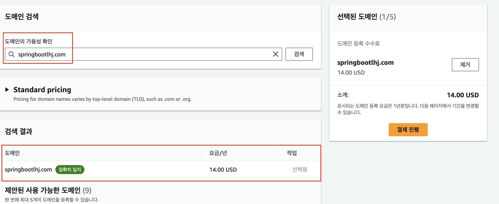

- 사용하고 싶은 도메인을기입한 후 검색을 누른다.
- 아래 사용하고 싶은 도메인을 선택하고 결제를 진행합니다.
- 본인의 연락처를 기입한 후 계속을 누른다.
- 다음으로 넘어가 연락처 정보를 확인한 후 결제한다.
- 도메인 이름에 따라 가격이 달라질 수 있음을 유의하자
- 도메인을 구매하면 입력한 이메일로 확인 메일이 전송된다.
- 확인 이메일의 링크를 눌러야 도메인이 활성화되니 반드시 활성화 링크를 누르자.

### 다른 사이트를 통한 구매
- https://www.gabia.com 에서도 원하는 도메인을 검색하고 구매할 수 있다.


- 원하는 도메인을 선택하고 신청하기를 누릅니다.


- 전화번호와 주소만 입력한 후 결제하기로 넘어갑니다.


### 호스팅 영역 생성
- 도메인을 생성했으면 이 도메인을 위한 호스팅 영역을 생성한다.
- 호스팅 영역에서는 서브 도메인을 생성한다.
- Route 53의 왼쪽 탭에서 호스팅 영역을 누른다.


- 이전에 산 도메인 이름을 기입하고 호스팅 생성영역을 누른다.
- 생성된 호스트 영역으로 들어가면 두 개의 기본 레코드가 추가돼있다.


### Host Zone(호스트 영역)
- 호스트 영역은 DNS영역파일이다.
- DNS영역을 생성하는 이유는 여러 개의 레코드를 한 곳에서 관리하기 위함이다.

### 레코드(Record)
- 레코드는 쉽게 말하면 이름과 IP를 연결해 놓은 파일 또는 엔트리이다.
- 레모드에는 종류가 여러 개 있는데 호스트 영역을 생성하면 일단 SOA와 NS가 하나씩 생긴다.
#### SOA(Start Of Authority)레코드
- 이 영역을 관리하는 관리자의 정보를 가지고 있는 레코드

#### NS(Name Server)레코드
- 해당 도메인의 IP를 물어볼 서버들을 가지고 있다.

### A레코드
- 해당 도메인을 특정 IP 또는 다른 도메인으로 연결하는 레코드이다.

### 가비아 네임서버 설정하기
- 가비아에 로그인 한 후 My가비아탭으로 이동합니다.
- 가운데 도메인을 눌러 이동합니다.


- 구매한 도메인의 관리버튼을 누릅니다.


- 네임서버의 설정 버튼을 누릅니다.

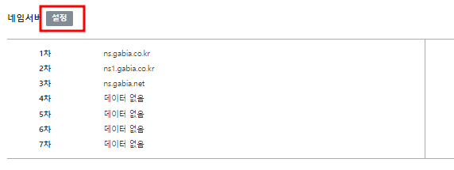

- route 53에서 등록한 레코드에서 만들어진 트래픽 라우터 대상을 4개 모두 복사한다.


- 가비아에서 네임서버 설정부분에 차례대로 넣되 마지막 .은 빼고 넣어야 한다.


- 모두 적은 뒤 적용 버튼을 누른다.

### 서브 도메인 만들기
- A레코드를 이용하여 백엔드와 프론트엔드에 서브 도메인을 만들어 연결해주자
- route 53 > 내가 만든 호스팅 영역으로 이동한다.
- 오른쪽 위 레코드 생성 버튼을 누른다.
- 서브도메인 앞에 붙이기 위한 레코드 이름을 설정합니다.
    - 여기서는 예시로 다음과 같이 작성합니다.(꼭 똑같이 작성해야 하는건 아니다.)
    - 프론트엔드에 app.자기도메인
    - 백엔드에서는 api.자기도메인

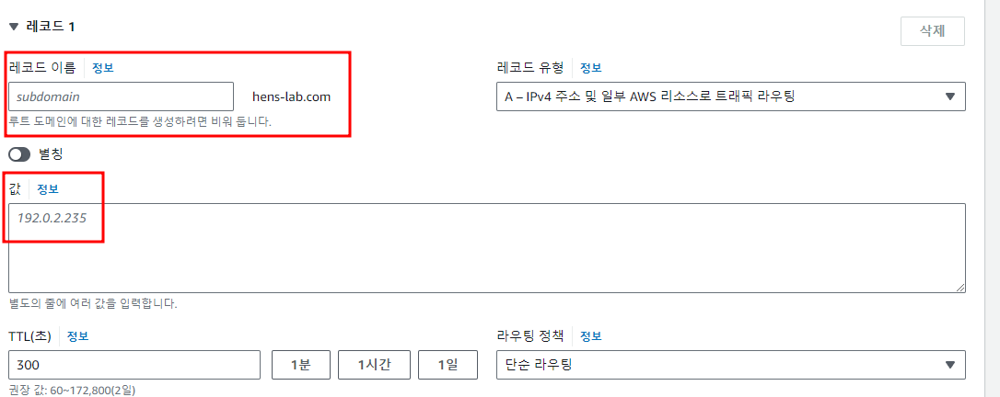

#### 값 설정하기
- 레코드를 생성할 때 값에는 로드밸런서나 IP주소를 넣어줘야 한다.
- EC2 > 인스턴스로 이동해 인스턴스ID를 클릭한다.
- IPv4 주소를 복사해 붙혀넣자


```
이렇게 프론트엔드와 백엔드를 연결하는 두 개의 서브 도메인을 만든다.
하지만 연결이 되고 적용되기 까지 24 ~ 48시간이 걸릴 수 있다.
```


### 백엔드에 요청하는 코드 수정하기
- React에서 스프링부트에 요청하는 주소를 우리가 연결한 서브 도메인 주소로 바꾸자.
- 주소가 담겨있는 api-config.js를 수정하가
```js
let backendHost;

const hostname = window && window.location && window.location.hostname;

if (hostname === "localhost") {
  backendHost = "http://localhost:8080";
} else {
  backendHost = "http://api.<설정한도메인>";
}

export const API_BASE_URL = `${backendHost}`; 
```
- npm run build를 하여 eb에 다시 배포를 진행합니다.

### CORS 문제 수정하기
- WebSecurityConfig클래스에 프론트에서 들어오는 요청 허가하기

```java
configuration.setAllowedOrigins(Arrays.asList(
          "http://localhost:3000",
    		  "http://app.hens-lab.com",
    		  "https://app.hens-lab.com"));
```
- 브라우저에 http://app.본인도메인을 입력하면 접속할 수 있다.


## 로드밸런서 설정하기
### 로드밸런서란?
- 서버에 대한 네트워크 트래픽을 효율적으로 분산시켜 여러 서버로 나누어 처리하는 장치 또는 소프트웨어다.
- 로드밸런서를 사용하면 트래픽 부하를 분산시켜 각 서버에 가해지는 부담을 줄이고, 서버가 과부하로 인해 다운되는 것을 방지하여 애플리케이션의 성능과 가용성을 높일 수 있다.
### AWS Elastic Load Balancer(ELB)
- AWS에서 제공하는 로드밸런싱 서비스로, EC2 인스턴스 간 트래픽을 자동으로 분산시킨다.
- AWS ELB는 여러 유형의 로드밸런서를 제공한다.
#### ELB의 종류
- Application Load Balancer(ALB) : L7 로드밸런서로, HTTP 및 HTTPS 트래픽을 처리하며, 애플리케이션 기반 라우팅을 지원한다.
- Network Load Balancer(LAB) : L4 로드밸런서로, TCP 트래픽을 처리하며 대량의 트래픽을 빠르게 분산할 수 있다.
- Classic Load Balancer (CLB): L4 및 L7 로드밸런싱 기능을 제공하지만, 새로운 기능 지원이 제한된다.
```
※ OSI 7계층
- 네트워크 통신 과정을 7개의 계층으로 나눈 모델로, 컴퓨터 네트워크에서 통신이 이루어지는 방식과 각 단계의 역할을 명확히 하기 위해서 설계되었다.
- 각 계층은 독립적이면서도 상호 작용하며, 데이터가 한 계층에서 다른 계층으로 이동하면서 구체적인 통신 기능을 수행한다.
- 각 계층을 L1, L2, L3 이런 식으로 줄여서 부르기도 한다.
- L1: 물리 계층(Physical Layer) 물리적 매체를 통해 비트 전송
- L2: 데이터 링크 계층(Data Link Layer) 프레임 단위의 데이터 전송
- L3: 네트워크 계층(Network Layer) IP 주소 기반 경로 설정 및 라우팅
- L4: 전송 계층(Transport Layer) 신뢰성 있는 전송, 오류 검출, 포트 기반 통신
- L5: 세션 계층(Session Layer) 세션 관리, 대화 제어, 데이터 동기화
- L6: 프레젠테이션 계층(Presentation Layer) 데이터 암호화/복호화, 데이터 형식 변환
- L7: 응용 계층(Application Layer) 사용자와 네트워크 간 인터페이스 제공
```
### Target Group
- 로드밸런서가 트래픽을 분산시킬 대상을 정의하는 그룹이다.
- 로드밸런서에 연결된 인스턴스, 컨테이너, IP 주소 등의 리소스를 그룹으로 묶어 관리하며, 이를 통해 로드밸런서는 트래픽을 효율적으로 분배할 수 있다.

### Target
- 로드밸런서가 트래픽을 보내는 대상이다.
- AWS에서는 여러 종류의 리소스를 타겟으로 사용할 수 있다.
- EC2 인스턴스, Lambda 함수, 컨테이너, IP 주소 등이 타겟이 될 수 있다.

### 타겟그룹 만들기
- [EC2]로 이동하여 왼쪽 아래 [대상그룹]을 클릭한다.


- 대상 유형 선택은 [인스턴스]를 선택한다.
- 대상 그룹 이름을 작성하고 다음으로 넘어간다.


- 라우팅 하려고 하는 인스턴스를 선택한 후 포트를 설정하고 아래에 보류 중인 것으로 포함을 누른다.

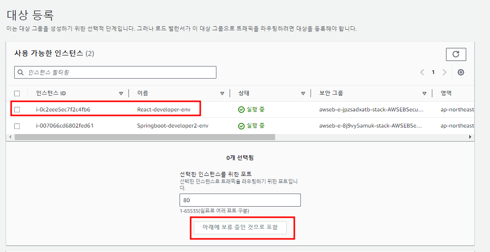

- 대상그룹 생성을 누른다.

### Health Check
- Target Group은 각 타겟의 상태를 모니터링할 수 있는 헬스 체크 기능을 제공한다.
- 헬스 체크를 통해 타겟이 정상인지 여부를 판단하고, 트래픽을 정상적인 타겟에만 전달한다.
- 헬스 체크는 주로 HTTP(S) 요청을 통해 진행되며, 설정된 기준에 따라 헬스 체크에 통과하지 못한 타겟은 트래픽 분배에서 제외된다.


### 2. 인스턴스에 요청이 들어오도록 설정
- EC2 > 보안그룹 > 타겟의 보안그룹 ID로 이동한다.
- 인바운드 규칙 편집을 누른다.
- HTTP와 HTTPS에 대한 인바운드 규칙을 추가해준다.
- 소스는 Anywhere-Ipv4로 한다.
- 그리고 규칙 저장을 누른다.


#### 인바운드 규칙
- 네트워크 보안에서 특정 인프라나 시스템으로 들어오는 트래픽을 제어하는 규칙을 말한다.
- 주로 방화벽이나 보안 그룹 설정에서 사용되며, 허용 또는 차단할 트래픽을 정의하는데 활용한다.
- AWS EC2 인스턴스나 네트워크 장비에서 인바운드 규칙을 설정할 때 고려하는 항목
  - 소스(Source) : 어떤 IP 주소 또는 IP 범위에서 오는 트래픽을 허용할지 결정한다.
  - 프로토콜(Protocol) : 허용할 트래픽의 프로토콜을 설정한다. 일반적으로 많이 사용하는 프로토콜로는 TCP, UDP, ICMP등이 있다.
  - 포트(Port) : 특정 애플리케이션이 사용하는 포트를 지정하여 해당 포트로 접근하는 트래픽을 허용하거나 차단할 수 있다. HTTP는 80, HTTPS는 433을 사용한다.


### 3. 로드밸런서 생성하기
- [EC2]의 왼쪽 아래 [로드밸런서]탭으로 이동한다.
- 오른쪽 위에 로드 밸런서 생성 버튼을 누른다.


- Application Load Balancer를 생성한다.

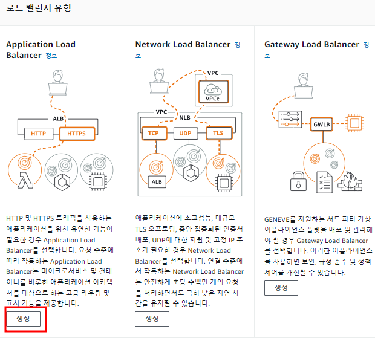

- 로드밸런서의 이름을 설정한다.
- 본인이 알아보기 쉽게 정하면 된다
- 예시
  - frontend-lb
  - backend-lb

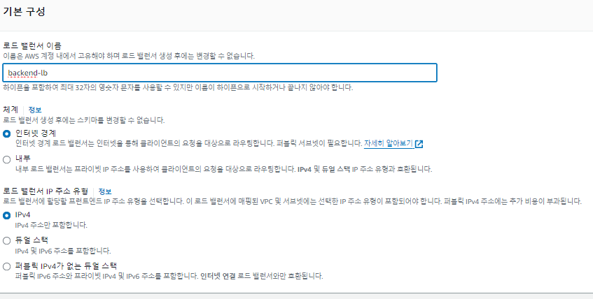

- VPC는 기본값을 사용한다.
- 가용영역은 인스턴스가 만들어진 영역을 보고 고르면 된다.
- 2개를 고르라고 하기 때문에 2개를 골라준다.

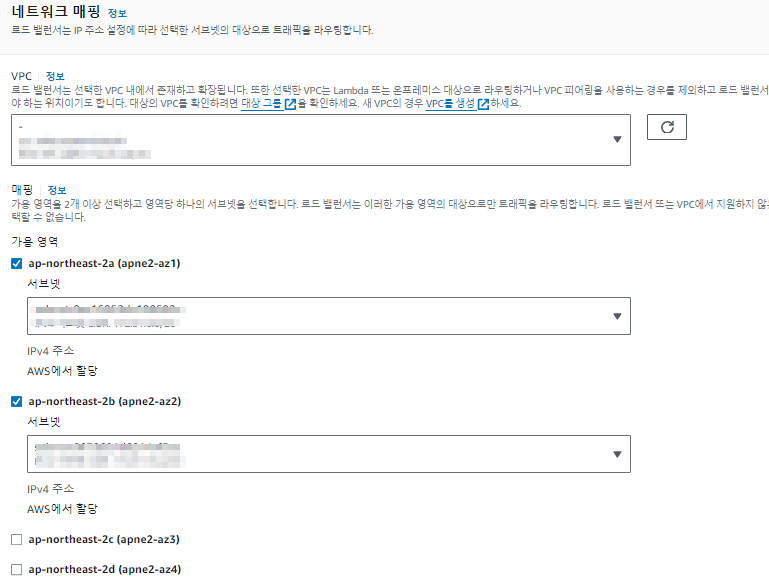

- 리스너 및 라우팅
- 타겟으로 80번 포트로 전달할 것이다.

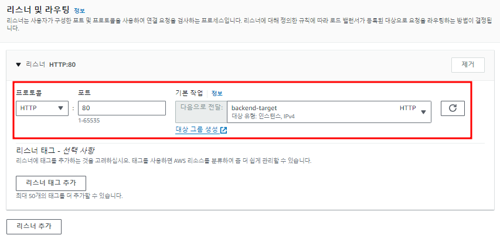

- 로드밸런서 생성 버튼을 누른다.

### 도메인에 로드밸런서를 연결한다.
- [Route53] > 호스팅영역으로 가서 본인이 설정한 도메인으로 들어간다.
- A레코드를 누르고 레코드 편집을 누른다.
- 별칭을 활성화 하고 엔드포인트에 [Application/Classic Load Balancer]에 대한 별칭을 선택한다.
- 리전은 로드밸런서를 만든 리전을 선택한다.
- 우리가 만든 로드밸런서를 선택한다.


## HTTPS사용하기

### HTTPS
- HTTP에 SSL(Secure Sockets Layer)를 추가한 프로토콜로, 데이터를 암호화하여 안전하게 통신을 할 수 있도록 만든다.
- HTTPS를 사용하려면 서버가 SSL/TLS 인증서를 설치해야 한다.
- 인증서는 신뢰할 수 있는 인증 기관(CA, Certificate Authority)이 발급하며, 해당 서버가 실제로 그 주체가 맞는지 증명해준다.
- 인증서를 통해 클라이언트는 서버가 신뢰할 수 있는 대상인지 확인한 후 통신을 시작할 수 있다.

### SSL
- HTTPS에서 보안을 제공하는 초기 기술로, 웹 서버와 브라우저 간의 통신을 암호화한다.

### 리액트 api-config.js 수정하기
```js
let backendHost;

const hostname = window && window.location && window.location.hostname;

if(hostname === "localhost"){
    backendHost = "http://localhost:5000";
}else {
    backendHost = "https://api.hens-lab.com";
  }

export const API_BASE_URL = `${backendHost}`
```

### 백엔드/프론트엔드 AWS Certificate Manager를 이용한 https설정
- 콘솔에 certificate manager를 입력하고 이동한다.
- 인증서 요청 버튼을 누른다.


- 퍼블릭 인증서 요청을 통해 요청을 시도한다.


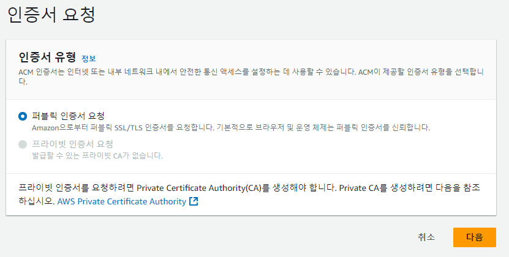


- 도메인 이름에 가비아에서 구매한 도메인을 입력해준다.
- 프론트와 백엔드에 할당한 서브 도메인에 모두 적용을 시켜주기위해 [*.도메인] 형식으로 적는다.
- 나머지는 수정할 것이 없고 요청 버튼을 누른다.


- 검증 대기중 / 아니요/ 부적격이 뜨면 정상이다.


### 백엔드 애플리케이션 HTTPS 설정
- [EC2] > [로드밸런서]로 이동하여 백엔드에서 사용하는 로드밸런서를 클릭하고 리스너 추가를 누른다.
  
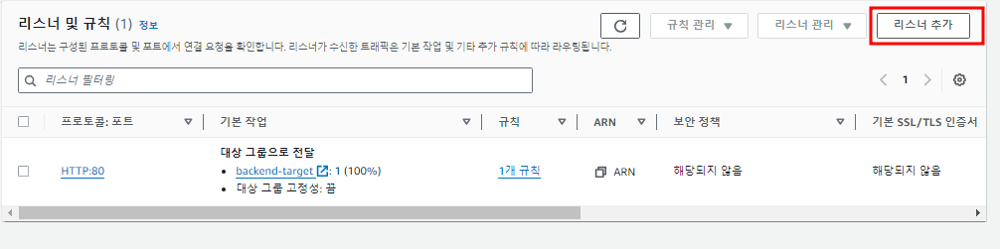

- 프로토콜 : https
- 포트 : 443
- 대상그룹 : 본인의 백엔드 타겟
- 추가를 누릅니다.

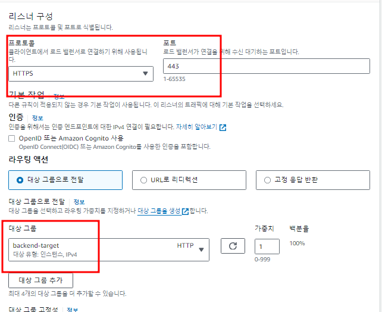

### 프론트엔드 애플리케이션 HTTPS 설정
- [EC2] > [로드밸런서]로 이동하여 프론트엔드에서 사용하는 로드밸런서를 클릭하고 리스너 추가를 누른다.

- 프로토콜 : https
- 포트 : 443
- 대상그룹 : 본인의 프론트엔드 타겟
- 추가를 누릅니다.

### VPC의 보안그룹 설정하기
- 로드밸런서에 443포트가 접속할수 있도록 하자
- [EC2] >[보안그룹]으로 들어가 VPC보안그룹 ID를 누른다.

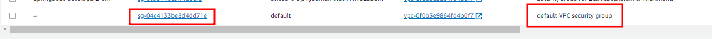

- 인바운드 규칙 편집을 누르고 HTTPS를 추가해준다.
- 규칙저장을 한다.

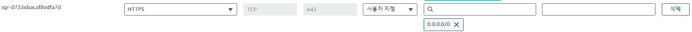

### 브라우저에서 확인하기
- 브라우저에 https://app.도메인 을 입력하고 잘 출력되는지 확인해보자.

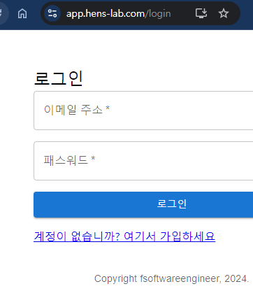

## 타 애플리케이션과 어떻게 통합할까??
- 우리의 Todo 애플리케이션을 깃허브의 이슈 기능을 연결한다고 가정해보자.
- 타 애플리케이션을 통합하는 기능은 어떻게 구현해야 할까?
- 가장 간단한 방법은 사용자에게서 깃허브의 아이디와 비밀번호를 받는것이다.
- 사용자가 공유 기능을 최초로 사용할 때, 사용자의 깃허브 아이디와 비밀번호를 입력받고 이를 데이터베이스에 저장한다.
- 이후 사용자가 공유 기능을 사용할 때마다 데이터베이스에 저장된 아이디와 비밀번호로 깃허브에 로그인해 이슈를 가져오는 것이다.
- 하지만 이 방법은 정보가 애플리케이션에 안전하게 저장되는지, 계정 정보를 이용해 다른 정보를 빼가지 않을지  신뢰하기 힘들다.
- 만약 100개의 애플리케이션에 아이디와 비밀번호를 제공했다고 가정했을 때, 한 애플리케이션을 더 이상 사용하고 싶지 않고 이 애플리케이션이 더 이상 내 깃허브에 접근하지 않았으면 좋겠다.
- 비밀번호를 바꿔버리게 되면 나머지 99개의 애플리케이션에서도 사용을 못하게 될 것이다.

## OAuth 2.0
- OAuth 2.0은 다양한 서비스와 애플리케이션 간에 안전하게 자원을 공유할 수 있도록 만들어진 인증 및 권한 부여 프로토콜이다.
- 서드파티 어플리케이션이 자기 자신 또는 리소스 오너를 대신해 HTTP 서비스에 제한된 액세스를 제공하도록 해주는 인가 프레임워크이다.
- 주로 클라이언트 애플리케이션이 사용자 데이터를 요청할 때 사용되며, 사용자가 직접 자격 증명을 제공하지 않아도 타사 서비스에 안전하게 접근할 수 있게 해준다.
- 많은 소셜미디어 플랫폼이 OAuth 2.0 프레임워크를 구현하고 있고, 우리는 비밀번호 대신 OAuth 2.0를 사용해 사용자의 정보에 액세스한다.

### 서드파티 어플리케이션
- 다른 회사나 개발자가 만든 애플리케이션
- 서비스에 대해 사용자가 자신의 계정 정보나 데이터를 공유하거나 통합할 수 있도록 만든 애플리케이션을 의미한다.
- OAuth2에서는 우리의 Todo어플리케이션이 서드파티 어플리케이션이다.

### 리소스
- Todo 어플리케이션은 사용자의 계정 정보를 사용하고자 한다.
- '사용자 정보'가 리소스가 된다.

### 리소스 오너
- 리소스를 가지고 있는 사람 즉, 사용자를 의미한다.

### 제한된 액세스
- '비밀번호'를 이용한 접근과 완전 반대되는 개념이다.
- 서드파티 어플리케이션이 리소스 오너가 허락한 리소스에만 접근할 수 있도록 하겠다는 것이다.
- 예를 들어 사용자는 우리 어플리케이션이 사용자 아이디와 이름만 접근하도록 허락할 수 있다.
- 이 경우 우리 어플리케이션은 사용자의 깃허브 소스 코드나 다른 개인정보에는 접근할 수 없다.

## OAuth 2.0의 주요 개념
1. **리소스 소유자(Resource Owner)**: 자신의 자원에 대한 접근 권한을 가지고 있는 주체, 보통 사용자입니다.
   
2. **클라이언트(Client)**: 리소스 소유자의 데이터를 사용하고자 하는 애플리케이션입니다. 이 클라이언트는 리소스 서버에 직접 접근하지 않고, OAuth 2.0을 통해 인증 및 권한 부여 과정을 거친 후 데이터를 얻습니다.

3. **인증 서버(Authorization Server)**: 리소스 소유자의 동의를 얻고, 액세스 토큰을 발급하는 서버입니다. OAuth 인증 서버는 클라이언트가 적절한 권한을 가졌는지 확인한 뒤 토큰을 발급합니다.

4. **리소스 서버(Resource Server)**: 보호된 리소스를 제공하는 서버입니다. 예를 들어, 사용자의 개인 정보를 저장하고 있는 서버가 해당됩니다. 클라이언트는 액세스 토큰을 통해 이 서버에 접근할 수 있습니다.

5. **액세스 토큰(Access Token)**: 인증 서버에서 발급하는 토큰으로, 클라이언트가 리소스 서버에 요청할 때 이를 사용해 인증을 받습니다. 이 토큰은 유효 기간이 있으며, 권한 범위(scope)를 나타냅니다.

## OAuth 2.0의 흐름

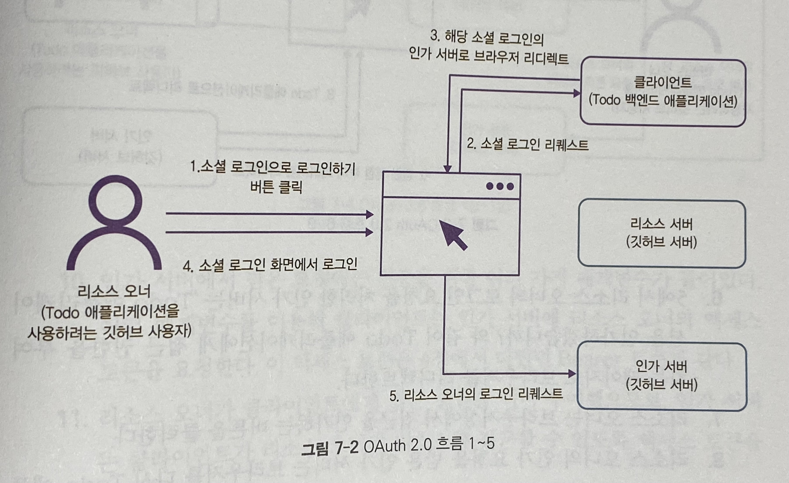

1. 사용자는 Todo 어플리케이션의 브라우저 화면상에서 '깃허브로 로그인하기'같은 버튼을 클릭한다.
2. 이 버튼은 Todo백엔드에게 소셜 로그인 요청을 보낸다.
3. 백엔드는 지정한 소셜 로그인 리소스 서버에 해당하는 인가 페이지로 브라우저를 리다이렉트한다. 이 시점에서 사용자는 더이상 우리 어플리케이션의 화면이 아닌 소셜 로그인의 리소스의 인가 페이지를 보게된다. 이 예제에서는 깃허브의 로그인 페이지가 이에 해당한다.
4. 소셜 로그인의 로그인 화면에서 리소스 오너가 로그인한다.
5. 소셜 로그인의 인가 서버로 로그인 요청이 된다.

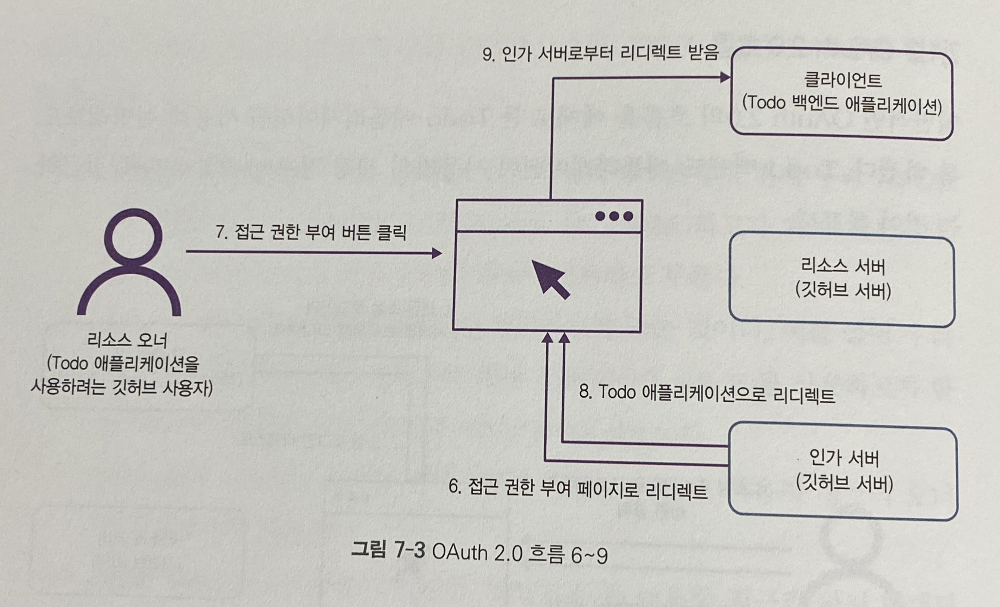

6. 5에서 리소스 오너의 로그인 요청을 처리한 인가 서버는 'Todo 어플리케이션을 인가하겠습니까?'와 같이 Todo 어플리케이션에게 접근 권한을 부여하는 페이지로 브라우저를 리다이렉트한다.
7. 리소스 오너는 브라우저상에서 접근을 인가하는 버튼을 클릭한다.
8. 리소스 오너의 인가 요청을 받은 인가 서버는 브라우저를 다시 Todo어플리케이션 페이지로 리다이렉트한다. 이때, 인가 서버는 어떤 URL로 리다이렉트해야 하는지 미리 알고 있다.
9. 클라이언트인 Todo 애플리케이션은 인가 서버에서 받은 요청을 이용해 액세스 토큰을 받을 준비를 한다.

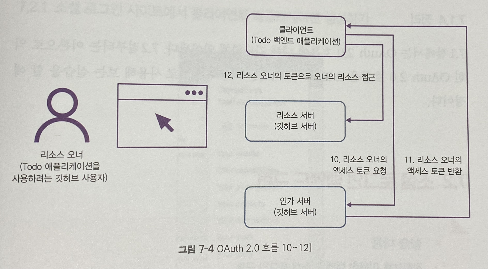

10. 인가 서버에서 받은 요청에는 인증을 위한 여러가지 매개변수가 들어있다. 이런 매개변수를 이용해 클라이언트는 인가 서버에 리소스 오너의 액세스 토큰을 요청한다. 이 액세스 토큰은 Bearer토큰과 같다.
11. 리소스 오너가 클라이언트에게 접근 권한을 이미 부여했으므로, 인가 서버는 클라이언트가 리소스 오너의 리소스를 접근할 수 있도록 액세스 토큰을 반환한다.
12. 액세스 토큰을 받은 클라이언트는 이제 토큰을 이용해 리소스 오너의 리소스에 접근할 수 있다.

※ 주의
- 리소스 서버 또는 리소스 인가 서버는 클라이언트 어플리케이션을 미리 알고있어야 한다. 다시말해, 클라이언트 어플리케이션은 이미 리소스 서버 또는 인가 서버에 등록된 어플리케이션이다.
- 그렇지 않으면 리소스 서버 및 인가 서버의 어떤 API요청도 할 수 없다.
- 클라이언트 어플리케이션이 리소스/인가 서버에 등록 당시 콜백URL을 지정한다.

## 소셜 로그인 백엔드 구현
- 깃허브를 이용해 소셜 로그인을 구현해보자
- 소셜 로그인이란 SSO(Single-Sign-On)의 일종으로 소셜 네트워크의 계정을 이용해 다른 어플리케이션의 계정을 생성하는 기능이다.
- SSO란 하나의 아이디를 이용해 여러개의 독립된 어플리케이션에 로그인할 수 있는 인증 메커니즘을 의미한다.
- 예를 들어 깃허브 아이디로 여러 다른 어플리케이션에 로그인 할 수 있다는 점에서 소셜 로그인은 SSO의 일종이다.
- 그리고 이 소셜 로그인을 구현하는 방법 중 하나가 바로 OAuth2다.

## 소셜 로그인 사이트에서 클라이언트 어플리케이션 생성하기.
- 깃허브에 로그인 한후 오른쪽 위 아이콘을 누른다.
- [Setting] > [Developer Setting]을 클릭해서 들어간다.
- [OAuth Apps] > [New OAuth app]을 선택한다.
- 우리의 어플리케이션을 등록하기 위한 작업이다.

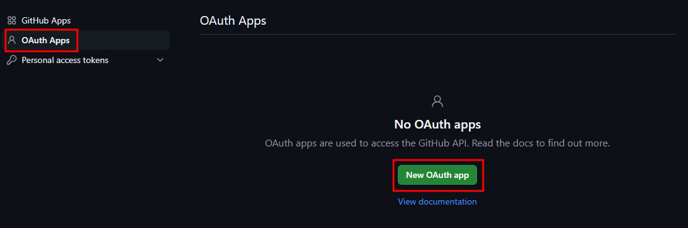

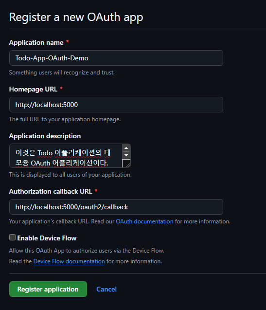

### Homepage URL
- Todo 백엔드 어플리케이션

### Authorization callback URL
- 백엔드 어플리케이션에 존재할 콜백 포인트이다.
- 콜백 포인트를 http://localhost:5000/oauth2/callback으로 설정하자.

**작성 후 Register application을 클릭하자.**

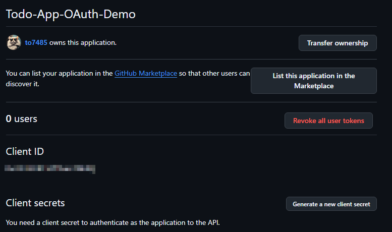

- Client ID를 반드시 메모해놓자.
- Generate a new client secret를 클릭해 시크릿을 발행한 후 메모해놓자.
- 리소스 오너의 액세스 토큰을 요청할 때, 리소스 오너의 리소스를 요청할 때 우리 어플리케이션은 Client ID와 Secret을 이용해야 한다.

## OAuth2.0 라이브러리 추가
```groovy
// https://mvnrepository.com/artifact/org.springframework.security/spring-security-oauth2-client
	implementation group: 'org.springframework.security', name: 'spring-security-oauth2-client', version: '6.3.1'
```

## application-dev.yml에 OAuth2.0설정
```yml
spring:
  security:
    oauth2:
      client:
        registration:
          github:
            clientId: <CLIENT_ID>
            clientSecret: <CLIENT_SECRET>
            redirectUri: "{baseUrl}/oauth2/callback/{registrationId}"
            scope:
              - user:email
              - read:user
    provider:
      github:
        authorization-uri: https://github.com/login/oauth/authorize
```

## Todo 백엔드 OAuth 2.0 엔드포인트 설정
- 백엔드에서 소셜 로그인 요청을 받기 위한 엔드포인트를 설정해야한다.
- 이 설정은 WebSecurityConfig에서 스프링 시큐리티가 제공하는 메서드를 이용하면된다.

```java
package com.example.demo.config;

import com.example.demo.security.JwtAuthenticationFilter;

@Configuration
@EnableWebSecurity
public class WebSecurityConfig {
   
   @Autowired
   private JwtAuthenticationFilter jwtAuthenticationFilter;
   
   @Bean
   protected DefaultSecurityFilterChain securityFilterChain(
         HttpSecurity http) throws Exception {

      http
         .cors(corsConfigurer -> corsConfigurer.configurationSource(corsConfigurationSource()))
         .csrf(csrfConfigurer -> csrfConfigurer.disable())
         .httpBasic(httpBasicConfigurer -> httpBasicConfigurer.disable())
         .sessionManagement(sessionManagementConfigurer ->
               sessionManagementConfigurer.sessionCreationPolicy(SessionCreationPolicy.STATELESS)
           )
         
         .authorizeHttpRequests(authorizeRequestsConfigurer -> 
            authorizeRequestsConfigurer
            /////////////추가//////////////////
            .requestMatchers("/", "/auth/**","/oauth2/**").permitAll()// /oauth2경로도 인증없이 허용
            /////////////추가//////////////////
            .anyRequest().authenticated()
         )
         /////////////추가//////////////////
         .oauth2Login();//oauth2 로그인 설정
         /////////////추가//////////////////

      http.addFilterBefore(jwtAuthenticationFilter, UsernamePasswordAuthenticationFilter.class);

      return http.build();
   }

   @Bean
   public CorsConfigurationSource corsConfigurationSource() {
      CorsConfiguration configuration = new CorsConfiguration();
      //React 애플리케이션이 실행되는 출처에서 오는 요청을 허용
      configuration.setAllowedOrigins(Arrays.asList("http://localhost:3000",
    		  "http://app.hens-lab.com",
    		  "https://app.hens-lab.com"));
      //HTTP메서드 허용
      configuration.setAllowedMethods(Arrays.asList("GET", "POST", "PUT", "DELETE", "OPTIONS"));
      //모든 헤더를 허용
      configuration.setAllowedHeaders(Arrays.asList("*"));
      //쿠키나 인증 정보를 포함한 요청을 허용
      configuration.setAllowCredentials(true);
      
      //모든 경로에 대해 CORS설정을 적용
      UrlBasedCorsConfigurationSource source = new UrlBasedCorsConfigurationSource();
      source.registerCorsConfiguration("/**", configuration);
      return source;
   }
}
```
### 어플리케이션 실행
- gradle을 이용하여 어플리케이션을 실행할 수 있다.
```groovy
./gradlew bootRun --args='--spring.profiles.active=dev --server.port=5000'
```
- 브라우저상에서 http://localhost:5000/oauth2/authorization/github 를 치고 들어가보면 깃허브의 로그인 화면으로 리다이렉트되는 것을 확인할 수 있다.

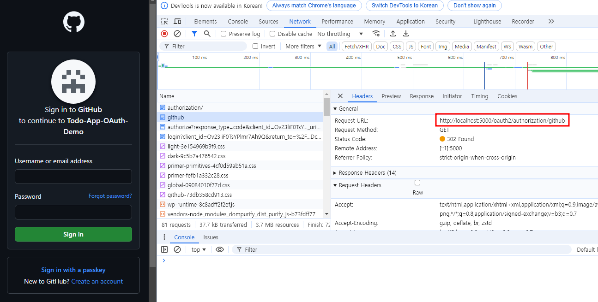

- 개발자도구를 확인해보면 리다이렉트가 여러 번 일어났다는 것을 확인할 수 있다.
- 첫번째로 http://localhost:5000/oauth2/authorization/github로 들어갔을 때 백엔드는 브라우저를 https://github.com/login/oauth/authorize로 리다이렉트한다.
- 사용자가 로그인하지 않은 상태이므로 깃허브는 이를 다시 https://github.com/login로 리다이렉트한다.

- 현재 소셜로그인 요청과 리다이렉트 부분을 구현한셈이다.
- 어느 엔드포인트를 사용할 것인지, 어디로 콜백할 건지만 알려주면 나머지는 스프링 시큐리티 OAuth 2.0라이브러리가 해결해준다.
- authorize 요청을 클릭하면 백엔드가 리다이렉트 당시 어떤 쿼리를 매개변수에 추가했는지 알 수 있다.
- client_id,scope,redirect_uri를 확인해보자.
- 이 매개변수의 값들은 우리가 설정한 application-dev.yml파일에서 온것이다.
- 이처럼 클라이언트 어플리케이션은 쿼리 매개변수를 이용해 깃허브의 인가 서버에게 자신이 어떤 클라이언트인지 어디로 리다이렉트 해야 하는지 어떤 리소스에 접근이 필요한 것인지 알려주는것이다.

### 로그인해보기
- 로그인을 하고 나서 Authorize를 누르면 인가가 된다.
- http://localhost:5000/oauth2/callback/github로 리다이렉트하려고 했으나 페이지가 존재하지 않아 HTTP 404를 반환한다.

### WebSecurityConfig 코드 추가하기
```java
.oauth2Login()
.redirectionEndpoint()
.baseUri("/oauth2/callback/*");
```
- http://localhost:5000/oauth2/callback/*으로 들어오는 요청을 redirectionEndpoint에 설정된 곳으로 리다이렉트하라는 뜻이다.
- redirectionEndpoint에 아무 주소도 넣지 않았다면 베이스 URL인 http://localhost:5000으로 리다이렉트한다.

## 소셜 로그인 후 자동으로 회원가입
- 사용자가 깃허브로 로그인을 하면 백엔드가 액세스 토큰을 요청해 사용자의 액세스 토큰을 발행하고, 액세스 토큰을 이용해 사용자의 게정 정보를 가져오는 것이다.
- 깃허브가 콜백 엔드포인트 요청을 보낼 때, 해당 사용자의 계정이 이미 있는지 확인하고 없다면 새로 생성해주는 부분을 구현해보자.

### application-dev.yml에 코드 추가하기
```yml
provider:
  github:
    authorization-uri: https://github.com/login/oauth/authorize
    token-uri: https://github.com/login/oauth/access_token
    user-info-uri: https://api.github.com/user
```

### token-uri
- 깃허브에 액세스 가능한 액세스 토큰을 받아오기위한 주소

### user-info-uri
- 유저의 정보를 가져오기 위한 주소이다.


- 유저의 정보를 가져오기 위해서는 액세스 토큰이 필요하므로 우리는 token-uri를 이용해 먼저 액세스 토큰을 받은 후, user-info-uri로 사용자의 정보를 요청할 때 토큰을 함께 보낸다.

### OAuthUserServiceImpl클래스 생성하기
```java
package com.example.demo.security;

import org.springframework.beans.factory.annotation.Autowired;
import org.springframework.security.oauth2.client.userinfo.DefaultOAuth2UserService;
import org.springframework.security.oauth2.client.userinfo.OAuth2UserRequest;
import org.springframework.security.oauth2.core.OAuth2AuthenticationException;
import org.springframework.security.oauth2.core.user.OAuth2User;
import org.springframework.stereotype.Service;

import com.example.demo.model.UserEntity;
import com.example.demo.persistence.UserRepository;
import com.fasterxml.jackson.databind.ObjectMapper;

import lombok.extern.slf4j.Slf4j;

//DefaultOAuth2UserService
//시큐리티에서 기본으로 제공하는 OAuth2로그인시 사용자의 정보를 처리하는 서비스 클래스이다.
//OAuth2 인증이 성공하면 스프링 시큐리티는 이 클래스를 이용해 OAuth2 제공자(github)로부터 
//사용자의 정보를 가져오고, 이를 기반으로 어플리케이션에서 인증된 사용자 객체를 생성한다.
@Slf4j
@Service
public class OAuthUserServiceImpl extends DefaultOAuth2UserService {

   @Autowired
   private UserRepository userRepository;
   
   public OAuthUserServiceImpl() {
      super();
   }
   
   @Override
   public OAuth2User loadUser(OAuth2UserRequest userRequest) throws OAuth2AuthenticationException {
      // DefaultOAuth2UserService의 기존 loadUser를 호출한다.
      //이 메서드가 user-info-uri를 이용해 사용자 정보를 가져오는 부분이다.
      final OAuth2User oAuth2User = super.loadUser(userRequest);
      try {
         log.info("OAuth2User attributes {} ",new ObjectMapper().writeValueAsString(oAuth2User.getAttributes()));
      } catch (Exception e) {
         // TODO: handle exception
      }
      
      //login필드를 가져온다.
      final String username = (String)oAuth2User.getAttributes().get("login");
      //현재 사용자가 어떤 OAuth2 제공자를 통해 로그인했는지 이름을 반환한다.
      final String authProvider = userRequest.getClientRegistration().getClientName();
      
      UserEntity userEntity = null;
      
      //유저가 존재하지 않으면 새로 생성한다.
      if(userRepository.existsByUsername(username) == false) {
         userEntity = UserEntity.builder()
                     .username(username)
                     .authProvider(authProvider)
                     .build();
         
         //내용을 넣은 userEntity객체를 db에 저장
         userEntity = userRepository.save(userEntity);
      }
      
      log.info("Successfully pulled user info username {} authProvider {}",username,authProvider);
      return oAuth2User;
   }
}
```

- 각 소셜 로그인 제공자가 반환하는 유저 정보, 즉 attributes에 들어 있는 내용은 제공자마다 각각 다를것이다.
- email을 아이디로 사용하는 제공자는 email필드가 있을것이고, 깃허브의 경우에는 login필드가 존재한다.
- 따라서 여러 소셜 로그인과 통합하려면 이부분을 알맞게 파싱해야 한다.

### WebSecurityConfig클래스에 메서드 추가하기
```java
package com.example.demo.config;

import java.util.Arrays;

import org.springframework.beans.factory.annotation.Autowired;
import org.springframework.context.annotation.Bean;
import org.springframework.context.annotation.Configuration;
import org.springframework.security.config.annotation.web.builders.HttpSecurity;
import org.springframework.security.config.annotation.web.configuration.EnableWebSecurity;
import org.springframework.security.config.http.SessionCreationPolicy;
import org.springframework.security.web.DefaultSecurityFilterChain;
import org.springframework.security.web.authentication.UsernamePasswordAuthenticationFilter;
import org.springframework.web.cors.CorsConfiguration;
import org.springframework.web.cors.CorsConfigurationSource;
import org.springframework.web.cors.UrlBasedCorsConfigurationSource;

import com.example.demo.security.JwtAuthenticationFilter;
import com.example.demo.security.OAuthSuccessHandler;
import com.example.demo.security.OAuthUserServiceImpl;

@Configuration
@EnableWebSecurity
public class WebSecurityConfig {
   
   @Autowired
   private JwtAuthenticationFilter jwtAuthenticationFilter;
   
   @Autowired
   private OAuthUserServiceImpl oAuthUserService;
   
   @Autowired
   private OAuthSuccessHandler oAuthSuccessHandler;
   
   @Bean
   protected DefaultSecurityFilterChain securityFilterChain(
         HttpSecurity http) throws Exception {

      http
         .cors(corsConfigurer -> corsConfigurer.configurationSource(corsConfigurationSource()))
         .csrf(csrfConfigurer -> csrfConfigurer.disable())
         .httpBasic(httpBasicConfigurer -> httpBasicConfigurer.disable())
         .sessionManagement(sessionManagementConfigurer ->
               sessionManagementConfigurer.sessionCreationPolicy(SessionCreationPolicy.STATELESS)
           )
         
         .authorizeHttpRequests(authorizeRequestsConfigurer -> 
            authorizeRequestsConfigurer
            .requestMatchers("/", "/auth/**","/oauth2/**").permitAll()
            .anyRequest().authenticated()
         )
         .oauth2Login()//oauth2Login 활성화
         .redirectionEndpoint() //아무 주소도 넣지 않았다면 베이스 URL인 http://localhost:5000으로 리다이렉트한다.
         .baseUri("/oauth2/callback/*")//인증이 성공하면 리다이렉트할 엔드포인트의 URI
         .and()
         //OAuth2 제공자로부터 사용자 정보를 가져올 때 사용하는 엔드포인트를 설정한다.
         //이 부분은 OAuth2 인증이 성공한 후, 사용자 프로필 데이터를 가져오는 역할
         .userInfoEndpoint()
         //사용자 정보를 처리하는 서비스를 지정하는 메서드 
         .userService(oAuthUserService)

      http.addFilterBefore(jwtAuthenticationFilter, UsernamePasswordAuthenticationFilter.class);

      return http.build();
   }

   @Bean
   public CorsConfigurationSource corsConfigurationSource() {
      CorsConfiguration configuration = new CorsConfiguration();
      //React 애플리케이션이 실행되는 출처에서 오는 요청을 허용
      configuration.setAllowedOrigins(Arrays.asList("localhost:3000"
            ,"http://app.hens-lab.com"
            ,"https://app.hens-lab.com"));
      //HTTP메서드 허용
      configuration.setAllowedMethods(Arrays.asList("GET", "POST", "PUT", "DELETE", "OPTIONS"));
      //모든 헤더를 허용
      configuration.setAllowedHeaders(Arrays.asList("*"));
      //쿠키나 인증 정보를 포함한 요청을 허용
      configuration.setAllowCredentials(true);
      
      //모든 경로에 대해 CORS설정을 적용
      UrlBasedCorsConfigurationSource source = new UrlBasedCorsConfigurationSource();
      source.registerCorsConfiguration("/**", configuration);
      return source;
   }
}
```
- 어플리케이션을 재시작 후  http://localhost:5000/oauth2/authorization/github 에 접속해보자.
- 다음과 같이 사용자 정보가 반환된 것을 확인할 수 있다.
```
2024-10-22T15:46:25.517+09:00  INFO 12320 --- [io-5000-exec-10] c.e.demo.security.OAuthUserServiceImpl   : Successfully pulled user info username to7485 authProvider GitHub
```

- 지금까지 액세스 토큰을 요청하고 리소스를 접근해서 가져오는 부분까지 작성을 해봤다.
- 우리가 직접 만들기보다는 스프링 시큐리티가 제공하는 라이브러리를 사용한 것이다.
- 여기에 더 나아가 우리는 사용자가 존재하지 않는 경우 새 사용자를 만드는 부분까지 구현했다.

## Todo 어플리케이션 토큰 발행
- 소셜 로그인을 이용한 회원가입 부분을 마쳤으니 로그인 후 토큰을 발행하는 부분을 구현해보자.
- 토큰 발행 부분은 소셜 로그인을 이용한 인증이 완료된 다음 즉, OAuth2.0을 이용한 인증이 모두 끝난 다음 발행해야 한다.
- 따라서 우리는 OAuth 2.0 흐름이 성공적으로 끝난 후 부르는 OAuthSuccessHandler 내부에서 토큰을 생성하고 반환하도록 만들어보자.

### OAuthSuccessHandler 구현하기
```java
package com.example.demo.security;

import java.io.IOException;

import org.springframework.security.core.Authentication;
import org.springframework.security.web.authentication.SimpleUrlAuthenticationSuccessHandler;
import org.springframework.stereotype.Component;

import jakarta.servlet.ServletException;
import jakarta.servlet.http.HttpServletRequest;
import jakarta.servlet.http.HttpServletResponse;
import lombok.AllArgsConstructor;
import lombok.extern.slf4j.Slf4j;


//SimpleUrlAuthenticationSuccessHandler
//인증 성공 후 사용자를 처리하는 데 사용되는 클래스

@Slf4j
@Component
@AllArgsConstructor
public class OAuthSuccessHandler extends SimpleUrlAuthenticationSuccessHandler{
   //토큰을 생성하고,반환하는 기능
   @Override
   public void onAuthenticationSuccess(HttpServletRequest request, HttpServletResponse response,
         Authentication authentication) throws IOException, ServletException {
      
      TokenProvider tokenProvider = new TokenProvider();
      String token = tokenProvider.create(authentication);
      
      response.getWriter().write(token);
      log.info("token {}",token);
   }
}
```
- tokenProvider의 create메서드의 매개변수는 UserEntity타입의 객체를 받게 되어있다.
- Authentication을 받을 수 있도록 오버로딩해보자

### TokenProvider클래스 수정하기
```java
package com.example.demo.security;

import java.time.Instant;
import java.time.temporal.ChronoUnit;
import java.util.Date;

import org.springframework.security.core.Authentication;
import org.springframework.security.oauth2.core.user.OAuth2User;
import org.springframework.stereotype.Service;

import com.example.demo.model.UserEntity;

import io.jsonwebtoken.Claims;
import io.jsonwebtoken.Jwts;
import io.jsonwebtoken.SignatureAlgorithm;
import lombok.extern.slf4j.Slf4j;

//이 TokenProvider 클래스의 역할은 유저의 정보를 받아서 토큰(JWT)을 생성하기
@Service 
@Slf4j //로그를 찍기위한 어노테이션
public class TokenProvider {
   
   private static final String SECRET_KEY = "eyJhbGciOiJIUzUxMiJ9eyJSb2xlIjoiQWRtaW4iLCJJc3N1ZXIiOiJJc3N1ZXIiLCJVc2VybmFtZSI6IkphdmFJblVzZSIsImV4cCI6MTcyNzk3NzQ2OSwiaWF0IjoxNzI3OTc3NDY5fQ3WUk1X983GsejnQZJSNQKjZBfBeSzOK4cAxpndz0G3pSItFPDiDVnSfD0ZsQzVCSkSMKQozyMVDjt9VYTcJw"; 
   
   
   //토큰을 생성하는 create 메서드
   public String create(UserEntity userEntity) {
      
      //토큰의 유효날짜를 1일로 정함
      //기한 지금(Instant.now())으로부터 1일(plus(1,ChronoUnit.DAYS))로 설정
      //Date.from() : Instant 객체를 Date 객체로 변환하는 메서드
      //Instant.now() : 현재 기준의 시간을 날짜와 시간을 초 단위로 표현
      //plus(1,ChronoUnit.DAYS) : Instant 객체에 하루를 더하는 동작
      Date expiryDate = Date.from(Instant.now().plus(1,ChronoUnit.DAYS));
      
      /*
       *{//header
       * "alg" : "HS512"
       * }.{//payload
       * "sub" : "~~~~~",
       * "iss" : "demp app",
       * "iat" : ~~~~~~,
       * "exp" : ~~~~~~
       * }.
       * */
      //SECRET_KEY 를 이용해 서명한 부분
      //XXXXXXXXXXXXXXXX
//      return null;
      
      //JWT 토큰 생성
      return Jwts.builder()
            .signWith(SignatureAlgorithm.HS512,SECRET_KEY)
            .setSubject(userEntity.getId())
            .setIssuer("demo app") //토큰 발행 주체
            .setIssuedAt(new Date()) //토큰 발행 날짜
            .setExpiration(expiryDate) // exp
            .compact(); //토큰을 . 으로 구분된 하나의 문자열로 만들어준다
            
      
   }
   
   //토큰을 생성하는 create 메서드
   //Authentication
   //어플리케이션 내에서 사용자가 누구인지와 그 사용자가 권한을 가졌는지 여부를 나타내는 객체
   //Principal : 사용자를 나타내는 정보, 보통 사용자 ID 또는 사용자 객체가 들어간다.
   public String create(Authentication authentication) {
   Date expiryDate = Date.from(Instant.now().plus(1,ChronoUnit.DAYS));
         
   //JWT 토큰 생성
   return Jwts.builder()
         .signWith(SignatureAlgorithm.HS512,SECRET_KEY)
         .setSubject(userPrincipal.getName())//id가 반환됨
         .setIssuer("demo app") //토큰 발행 주체
         .setIssuedAt(new Date()) //토큰 발행 날짜
         .setExpiration(expiryDate) // exp
         .compact();
               
   }
   //토큰을 받아서 검증을 하는 메서드
   public String validateAndeGetUserId(String token) {
      Claims claims = Jwts.parser()
            //토큰을 생성할 때 사용했던 서명키
            .setSigningKey(SECRET_KEY)
            //JWT 토큰을 파싱하고, 서명을 검증한다.
            //이 메서드는 토큰이 유효한지 확인하고, 올바른 서명으로
            //서명이 되었는지 검증한다.
            //서명이 유효하지 않거나 토큰이 만료된 경우, 예외가 발생
            .parseClaimsJws(token)
            //페이로드 부분을 반환한다.
            //여기에는 주체, 발행자, 만료시간, 발행시간 등
            //여러가지 필드가 있을 수 있다.
            .getBody();
      
      //getSubject()
      //claims객체에서 주체를 가져온다.
      //주로 사용자의 id나 이름같은 식별자를 나타낸다.
      //이 값은 JWT를 발급할 때 설정된 것이다.
      return claims.getSubject();
      
   }
}
```
- 하지만 authentication에는 UserEntity의 id가 없다.
- 이를 해결하기 위해 OAuth2User를 구현하는 새 클래스를 작성해야 한다.
- 이 클래스는 OAuth2User와 UserEntity사이의 다리 같은 역할을 한다.
### ApplicationOAuth2User클래스 만들기
```java
package com.example.demo.security;

import java.util.Collection;
import java.util.Collections;
import java.util.Map;

import org.springframework.security.core.GrantedAuthority;
import org.springframework.security.core.authority.SimpleGrantedAuthority;
import org.springframework.security.oauth2.core.user.OAuth2User;

public class ApplicationOAuth2User implements OAuth2User {

   private String id;
   private Collection<? extends GrantedAuthority> authorities;
   private Map<String, Object> attributes;
   
   public ApplicationOAuth2User(String id, Map<String, Object> attributes) {
      this.id = id;
      this.attributes = attributes;
      this.authorities = Collections.singletonList(new SimpleGrantedAuthority("ROLE_USER"));
    
   }

   @Override
   public Map<String, Object> getAttributes() {
      return this.attributes;
   }

   @Override
   public Collection<? extends GrantedAuthority> getAuthorities() {
      return this.authorities;
   }

   @Override
   public String getName() {
      return this.id; //name대신 id를 반환한다.
   }
}
```

### OAuth2User
- OAuth 2.0 로그인 과정을 처리할 때 사용하는 인터페이스다. 
- 애플리케이션이 외부 인증 제공자(Google, Facebook, GitHub 등)를 통해 사용자 인증을 처리할 때, 해당 사용자 정보를 나타내는 역할을 한다.
- OAuth2User 인터페이스는 OAuth 2.0을 통해 로그인한 사용자의 프로필 정보와 권한을 제공하는데 주로 사용된다.
- 사용자가 인증 제공자에서 로그인한 후, 스프링 시큐리티는 OAuth2User 객체를 생성하여 애플리케이션에 전달하고, 이를 통해 로그인된 사용자의 정보를 다룬다.

### 주요 메서드
- Map<String, Object> getAttributes(): 외부 인증 제공자로부터 받은 사용자 속성 정보를 반환한다. 이 속성 정보는 인증 제공자에 따라 다를 수 있다.
  - 예: Google OAuth2.0에서 제공하는 getAttributes() 값은 sub, name, email과 같은 필드를 포함할 수 있다.
- String getName(): 사용자의 고유 식별자를 반환한다. 이 식별자는 인증 제공자로부터 제공되며, 주로 사용자를 고유하게 식별하는 용도로 사용된다.
  - 예: Google OAuth2.0에서는 sub(subject)가 이 역할을 할 수 있다.
- Collection<? extends GrantedAuthority> getAuthorities(): 사용자가 가진 권한을 반환한다. 이 권한 정보는 스프링 시큐리티의 권한 관리를 통해 사용된다.

### SimpleGrantedAuthority
- 스프링 시큐리티에서 제공하는 클래스이며, **사용자 권한(Authority)**을 나타낸다.
- 이 클래스는 `GrantedAuthority` 인터페이스를 구현한 것으로, 사용자가 어떤 권한을 가지고 있는지 표현한다.
- `"ROLE_USER"`는 사용자가 부여받는 권한의 이름으로, 스프링 시큐리티에서는 권한 이름이 보통 `"ROLE_"`로 시작합니다. 이는 스프링 시큐리티에서 권한과 구분자 역할을 한다.

#### 권한의 의미
- **`ROLE_USER`**: 
  - 권한 이름이 `"ROLE_"`로 시작하는 것은 스프링 시큐리티의 권장 관례입니다. 일반적으로 시스템에서 특정 역할(Role)을 부여하는 구조로 사용된다.
  - `"ROLE_USER"`는 보통 일반 사용자를 나타내는 권한입니다. 예를 들어, 로그인한 사용자가 기본적으로 애플리케이션에서 접근할 수 있는 리소스나 기능이 있다면, 그 사용자는 `"ROLE_USER"` 권한을 부여받는다.

### Collections.singletonList():
 - 이 메서드는 Java에서 제공하는 유틸리티 메서드로, 단 하나의 요소를 가진 불변 리스트(immutable list)를 생성한다.
 - 즉, 여기서는 "ROLE_USER" 권한을 나타내는 하나의 `SimpleGrantedAuthority` 객체를 포함한 리스트를 생성하는 것이다.
 - 생성된 리스트는 수정할 수 없으며, 오직 읽기 전용 리스트로 사용된다.
 - 이 방법을 사용하면 권한이 단일 항목(즉, "ROLE_USER")만 있는 경우 간단하고 효율적으로 리스트를 생성할 수 있다.

- OAuthUserServiceImpl로 돌아가 OAuth2User대신 ApplicationOAuth2User를 반환한다.
- 그러면 SuccessHandler에서도 getName()를 호출할 때 id를 넘겨받을 수 있다.

### OAuthUserServiceImpl 수정하기
```java
  log.info("Successfully pulled user info username {} authProvider {}",username,authProvider);
  return new ApplicationOAuth2User(userEntity.getId(), oAuth2User.getAttributes());
  }
}
```
### TokenProvider에 코드 수정하기
```java
   public String create(Authentication authentication) {
   //OAuth2.0 인증을 통해 로그인한 사람의 정보를 나타낸다.
   ////////////////추가/////////////////////////////
   ApplicationOAuth2User userPrincipal = (ApplicationOAuth2User)authentication.getPrincipal();
    ////////////////추가/////////////////////////////
   Date expiryDate = Date.from(Instant.now().plus(1,ChronoUnit.DAYS));
         
   //JWT 토큰 생성
   return Jwts.builder()
         .signWith(SignatureAlgorithm.HS512,SECRET_KEY)
         .setSubject(userPrincipal.getName())//id가 반환됨
         .setIssuer("demo app") //토큰 발행 주체
         .setIssuedAt(new Date()) //토큰 발행 날짜
         .setExpiration(expiryDate) // exp
         .compact();
               
   }
```

### WebSecurityConfig에 코드 추가하기
```java
package com.example.demo.config;

   
   @Autowired
   private OAuthSuccessHandler oAuthSuccessHandler;
   
   ...중략
   
         .oauth2Login()//oauth2Login 활성화
         .redirectionEndpoint() //아무 주소도 넣지 않았다면 베이스 URL인 http://localhost:5000으로 리다이렉트한다.
         .baseUri("/oauth2/callback/*")//인증이 성공하면 리다이렉트할 엔드포인트의 URI
         .and()
         //OAuth2 제공자로부터 사용자 정보를 가져올 때 사용하는 엔드포인트를 설정한다.
         //이 부분은 OAuth2 인증이 성공한 후, 사용자 프로필 데이터를 가져오는 역할
         .userInfoEndpoint()
         //사용자 정보를 처리하는 서비스를 지정하는 메서드 
         .userService(oAuthUserService)
         .and()
         .successHandler(oAuthSuccessHandler);//oauth2 인증이 성공한 뒤 실행될 동작을 정의하는메서드

      http.addFilterBefore(jwtAuthenticationFilter, UsernamePasswordAuthenticationFilter.class);

      return http.build();
   }
```
- http://localhost:5000/oauth2/authorization/github 로 다시 접근해보면 리다이렉션 대신 토큰이 반환되는 것을 확인할 수 있다.

## 소셜 로그인 프론트엔드 구현
- 위에서 깃허브 애플리케이션을 등록할 때 백엔드 주소를 넣어줬고, 모든 인증 및 인가 작업은 백엔드에서 일어났다.
- 이는 사용자가 궁극적으로 로그인해야 하는 시스템이 백엔드이기 때문이다.
- 하지만 사용자 입장에서는 그렇지 않다.
- 실제 사용자는 프론트엔드를 통해 상호작용을 한다.
- 따라서 우리는 프론트엔드에서 사용자가 소셜 로그인을 시작할 수 있는 방법을 제공해야 한다.
- 또한 백엔드에서 인증을 마친 후 다시 프론트엔드로 돌아가 사용자가 어플리케이션을 사용할 수 있도록 해야 한다.

### 백엔드 AuthenticationEntryPoint설정
- 백엔드와 프론트엔드를 모두 실행하고 개발자 툴의 네트워크 탭을 켠 후 http://localhost:3000으로 들어가보자.

- 프론트엔드에서 http://localhost:3000으로 들어가면 리액트가 http://localhost:5000/todo를 호출해 사용자의 Todo 리스트를 가지고 온다.
- 이때 헤더에 Bearer토큰을 함께 보내 사용자를 인증한다.
- 만약 토큰이 없다면 인증은 실패하고 HTTP상태코드로 403이 반환된다
- 그러면 리액트는 로그인 페이지로 리다이렉트한다.
- 하지만 시큐리티가 제멋대로 302를 리다이렉트 하기 때문에 로그인 페이지로 갈 수 없다.
- 우리는 여전히 인증 실패시 상태 코드로 403을 받고 로그인 화면으로 리다이렉트 하고싶다.
- 그리고 그 로그인 화면에서 사용자가 소셜로그인을 할지 이메일로그인을 할지 결정하게 하고 싶다.
- AuthenticationEntryPoint를 이용하면 OAuth 2.0 흐름으로 넘어가는 기본 설정을 바꿀 수 있다.

### WebSecurityConfig에 코드 추가하기
```java
... 중략
.successHandler(oAuthSuccessHandler)
.and()
.exceptionHandling()
.authenticationEntryPoint(new Http403ForbiddenEntryPoint()); // Http403ForbiddenEntryPoint 추가
```
- 위 코드를 추가하고 어플리케이션을 다시 시작해본다.
- 프론트엔드로 들어가보면 인증에 실패해 로그인 화면으로 돌아가는것을 확인할 수 있다.

## 소셜 로그인 엔드포인트 추가
- 지금까지는 테스팅을 위해 기본으로 제공되던 http://localhost:5000/oauth2/authorization/github를 사용했지만 이 경로는 원하는 경로로 설정이 가능하다.
- 이 엔드포인트를 http://localhost:5000/auth/authorize/{provider}라고 하자.
- {provider}에는 어떤 소셜 로그인 제공자라도 들어갈 수 있다.

### WebSecurityConfig에 코드 추가하기
```java
...중략
.oauth2Login()
.redirectionEndpoint()
.baseUri("/oauth2/callback/*")
.and()
.authorizationEndpoint()
.baseUri("/auth/authorize") // OAuth 2.0 흐름 시작을 위한 엔드포인트 추가
...중략
```
- /auth/authorize를 authorizationEndpoint의 baseUri로 지정해주자.
- 어플리케이션을 재시작한 후 http://localhost:5000/auth/authorize/github로 들어가보면 http://localhost:5000/oauth2/authorization/github와 동일한 흐름으로 리다이렉션이 이루어지는 것을 확인할 수 있다.

## 소셜 로그인 기능 추가
- 이제 프론트엔드의 기능을 마저 추가하도로고 하자.
- 로그인 화면에서 깃허브로 로그인 하기 버튼을 추가하고 사용자가 버튼을 클릭하면 /auth/authorize/github로 리다이렉션 해주면된다.
- 프론트엔드의 Login.js파일을 수정해주자.

### Login.js파일 수정하기
```js
<Grid item xs={12}>
  <Button type="submit" fullWidth variant="contained" color="primary">
    로그인
  </Button>
</Grid>
<Grid item xs={12}>
  <Button fullWidth variant="contained" style={{backgroundColor: '#000'}}>
    깃허브로 로그인하기
  </Button>
</Grid>
<Grid item>
  <Link to="/signup" variant="body2">
  계정이 없습니까? 여기서 가입 하세요.
  </Link>
</Grid>
```
- 이때 Button에 `type=submit` 속성이 없도록 주의하자ㅏ.
- Submit타입의 버튼으로 설정하면 submitHandler가 실행될 수도 있다.
- 그 대신 handlerSocialLogin이라는 함수를 만들고 해당 함수를 깃허브 로그인하기 버튼에 추가해야 한다.
### handlSocialLogin함수 추가하기
```js
const handleSocialLogin = (provider) => {
  console.log(provider);
}

...중략

<Button onClick={() => handleSocialLogin("github")} fullWidth variant="contained" style={{backgroundColor: '#000'}}>
  깃허브로 로그인하기
</Button>
```
- 추가한 함수를 버튼의 onClick에 연결한다.
- handleSocialLogin함수 내부를 구현하기 위해 socialLogin이라는 함수를 ApiService.js에 추가하자.
이 함수는 백엔드의 /auth/authorize/github로 브라우저를 리다이렉트해준다.

### ApiService에 socialLogin API 추가
```js
export function socialLogin(provider) {
  window.location.href= API_BASE_URL + "/auth/authorize/"+provider;
}
```
### handleSocialLogin함수에 추가하기
```js
import{signin, socialLogin} from "./service/ApiService'

const handleSocialLogin = (provider) => {
  socialLogin(provider);
}
```
- 프론트엔드 페이지로 돌아가 깃허브 로그인하기를 누르면 깃허브 로그인 페이지로 리다이렉트 되는 것을 확인할 수 있다.

## 프론트엔드로 Bearer 토큰 전달하기
- 리다이렉트된 깃허브 로그인 페이지에서 로그인해보자.
- 토큰을 반환하고 끝이 아니라 백엔드는 로그인이 완료된 프론트엔드 페이지, 즉 Todo리스트 페이지로 리다이렉트 해야한다.
- 토큰을 반환하는 곳은 OAuthSuccessHandler였다.

### OAuthSuccessHandler 함수 수정하기
```java
@Override
public void onAuthenticationSuccess(HttpServletRequest request, HttpServletResponse response, Authentication authentication) throws IOException {
  log.info("auth succeeded");
  TokenProvider tokenProvider = new TokenProvider();
  String token = tokenProvider.create(authentication);

  log.info("token {}", token);
  response.sendRedirect("http://localhost:3000");
}
```
- HTTP response에 토큰을 넘기는 대신 sendRedirect를 이용해 프론트엔로 리다이렉트하자.
- 하지만 이렇게 리다이렉트를 하면 토큰을 전달할 수 없다.
- 따라서 프론트엔드는 백엔드가 리다이렉트 하면서 전달하는 토큰을 받아주는 기능이 필요하다.
- 이 기능을 위해 sociallogin이라는 페이지를 만들기로 하자.

```java
@Override
public void onAuthenticationSuccess(HttpServletRequest request, HttpServletResponse response, Authentication authentication) throws IOException {
  log.info("auth succeeded");
  TokenProvider tokenProvider = new TokenProvider();
  String token = tokenProvider.create(authentication);

  log.info("token {}", token);
  response.sendRedirect("http://localhost:3000/sociallogin?token="+token);
}
```

### SocialLogin페이지 구현
```js
import React from "react";
import { Navigate } from "react-router-dom";

const SocialLogin = (props) => {
  const getUrlParameter = (name) => { // 쿼리 파라미터에서 값을 추출 해 주는 함수
    let search = window.location.search;
    let params = new URLSearchParams(search);
    return params.get(name);
  };

  const token = getUrlParameter("token");

  console.log("토큰 파싱: " + token);

  if (token) {
    console.log("로컬스토리지에 토큰 저장" + token);
    localStorage.setItem("ACCESS_TOKEN", token);
    return (
      <Navigate
        to={{
          pathname: "/",
          state: { from: props.location },
        }}
      />
    );
  } else {
    return (
      <Navigate
        to={{
          pathname: "/login",
          state: { from: props.location },
        }}
      />
    );
  }
};

export default SocialLogin;
```

### AppRouter에 라우팅해주기
```js
 <Route path="/" element={<App />} />
<Route path="login" element={<Login />} />
<Route path="signup" element={<SignUp />} />
<Route path="sociallogin" element={<SocialLogin />} />
```
- socialLogin으로 향하는 경로를 추가한 후 백엔드와 프론트엔드 어플리케이션을 재시작하자.
- 로그인 후 Todo 화면으로 넘어가는 것을 확인할 수 있다.

