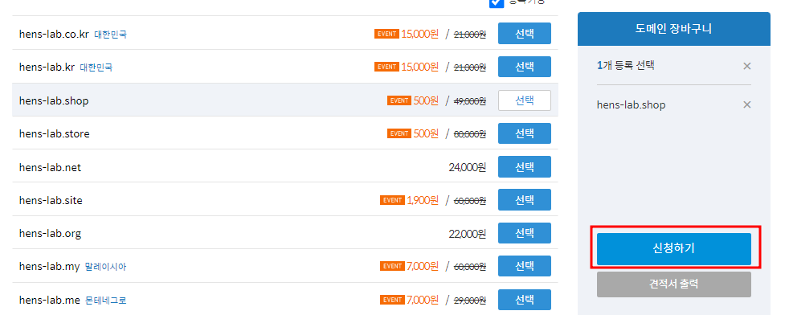
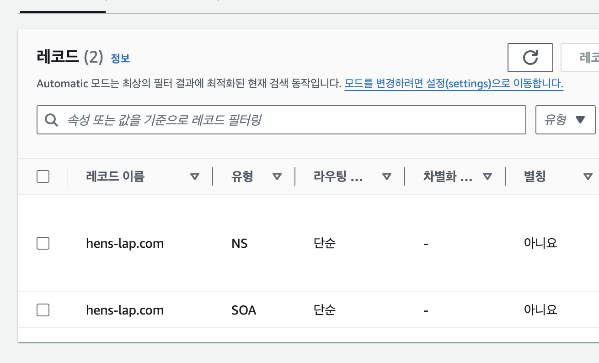
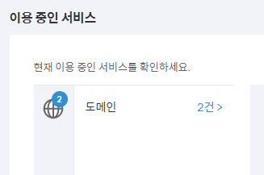
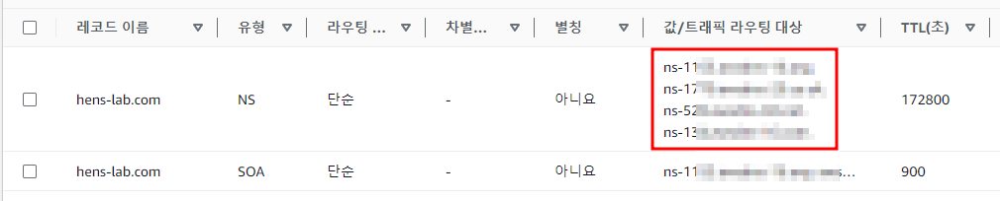
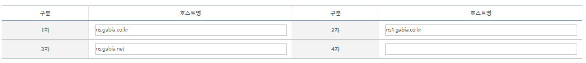
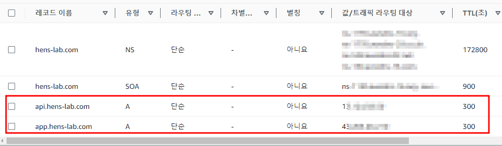

## Route53 도메인 설정
- 인증과 인가를 구현할 때, JWT는 반드시 HTTPS와 사용해야 한다고 했다.
- HTTPS 인증서를 받기 위해 필요한 절차를 학습해보자.

### 도메인 구매
- AWS콘솔에서 Route53으로 들어간다.
- 도메인과 호스팅 관리를 도와주는 서비스이다.


- 대시보드의 도메인 등록을 선택하고 시작하기를 누른다.


- 사용하고 싶은 도메인을기입한 후 검색을 누른다.
- 아래 사용하고 싶은 도메인을 선택하고 결제를 진행합니다.
- 본인의 연락처를 기입한 후 계속을 누른다.
- 다음으로 넘어가 연락처 정보를 확인한 후 결제한다.
- 도메인 이름에 따라 가격이 달라질 수 있음을 유의하자
- 도메인을 구매하면 입력한 이메일로 확인 메일이 전송된다.
- 확인 이메일의 링크를 눌러야 도메인이 활성화되니 반드시 활성화 링크를 누르자.

### 다른 사이트를 통한 구매
- https://www.gabia.com 에서도 원하는 도메인을 검색하고 구매할 수 있다.


- 원하는 도메인을 선택하고 신청하기를 누릅니다.



- 전화번호와 주소만 입력한 후 결제하기로 넘어갑니다.


### 호스팅 영역 생성
- 도메인을 생성했으면 이 도메인을 위한 호스팅 영역을 생성한다.
- 호스팅 영역에서는 서브 도메인을 생성한다.
- Route 53의 왼쪽 탭에서 호스팅 영역을 누른다.


- 이전에 산 도메인 이름을 기입하고 호스팅 생성영역을 누른다.
- 생성된 호스트 영역으로 들어가면 두 개의 기본 레코드가 추가돼있다.




### Host Zone(호스트 영역)
- 호스트 영역은 DNS영역파일이다.
- DNS영역을 생성하는 이유는 여러 개의 레코드를 한 곳에서 관리하기 위함이다.

### 레코드(Record)
- 레코드는 쉽게 말하면 이름과 IP를 연결해 놓은 파일 또는 엔트리이다.
- 레모드에는 종류가 여러 개 있는데 호스트 영역을 생성하면 일단 SOA와 NS가 하나씩 생긴다.
#### SOA(Start Of Authority)레코드
- 이 영역을 관리하는 관리자의 정보를 가지고 있는 레코드

#### NS(Name Server)레코드
- 해당 도메인의 IP를 물어볼 서버들을 가지고 있다.

### A레코드
- 해당 도메인을 특정 IP 또는 다른 도메인으로 연결하는 레코드이다.

### 가비아 네임서버 설정하기
- 가비아에 로그인 한 후 My가비아탭으로 이동합니다.
- 가운데 도메인을 눌러 이동합니다.



- 구매한 도메인의 관리버튼을 누릅니다.


- 네임서버의 설정 버튼을 누릅니다.


- route 53에서 등록한 레코드에서 만들어진 트래픽 라우터 대상을 4개 모두 복사한다.



- 가비아에서 네임서버 설정부분에 차례대로 넣되 마지막 .은 빼고 넣어야 한다.



- 모두 적은 뒤 적용 버튼을 누른다.

### 서브 도메인 만들기
- A레코드를 이용하여 백엔드와 프론트엔드에 서브 도메인을 만들어 연결해주자
- route 53 > 내가 만든 호스팅 영역으로 이동한다.
- 오른쪽 위 레코드 생성 버튼을 누른다.
- 서브도메인 앞에 붙이기 위한 레코드 이름을 설정합니다.
    - 여기서는 예시로 다음과 같이 작성합니다.(꼭 똑같이 작성해야 하는건 아니다.)
    - 프론트엔드에 app.자기도메인
    - 백엔드에서는 api.자기도메인


#### 값 설정하기
- 레코드를 생성할 때 값에는 로드밸런서나 IP주소를 넣어줘야 한다.
- EC2 > 인스턴스로 이동해 인스턴스ID를 클릭한다.
- IPv4 주소를 복사해 붙혀넣자


```
이렇게 프론트엔드와 백엔드를 연결하는 두 개의 서브 도메인을 만든다.
하지만 연결이 되고 적용되기 까지 24 ~ 48시간이 걸릴 수 있다.
```



### 백엔드에 요청하는 코드 수정하기
- React에서 스프링부트에 요청하는 주소를 우리가 연결한 서브 도메인 주소로 바꾸자.
- 주소가 담겨있는 api-config.js를 수정하가
```js
let backendHost;

const hostname = window && window.location && window.location.hostname;

if (hostname === "localhost") {
  backendHost = "http://localhost:8080";
} else {
  backendHost = "https://api.fsoftwareengineer.com";
}

export const API_BASE_URL = `${backendHost}`;
```


