# 리액트 네이티브란?
- 2015년 3월에 페이스북에 의해 공개된 오픈소스 프로젝트로, 사용자 인터페이스를 만드는 리액트에 기반을 두고 제작되었다.
- 하지만 리액트와 달리 웹 브라우저가 아닌, ios와 안드로이드에서 동작하는 네이티브 모바일 어플리케이션을 만드는 자바스크립트 프레임워크이다.
- 현재 페이스북, 인스타그램, 핀터레스트, 월마트 등이 리액트 네이티브를 이용해서 개발되었으며, 리액트 네이티브 쇼케이스에서 대표적인 어플리케이션을 확인할 수 있다.
- 리액트 네이티브 쇼케이스 https://reactnative.dev/showcase.html
## 장점과 단점
- 리액트 네이티브가 출시되면서 오브젝티브-C 또는 자바를 사용하여 개발하지 않아도 웹 개발자가 익숙한 기술을 이용하여 모바일 개발을 통해 어플리케이션을 출시할 수 있는 기회를 얻게 되었다.
- 특히 리액트에 익숙한 개발자라면 조금 더 수월하게 리액트 네이티브를 익힐 수 있다.
### 장점
1. 작성된 코드 대부분 플랫폼간 공유가 가능해서 두 플랫폼을 동시에 개발할 수 있다는 것이다.
   -  특히 모바일 개발에 대한 지식이 없어도 자바스크립트만 알고 있으면 쉽게 시작할 수 있으며, 작성된 구성 요소들이 재사용 가능하다는 것은 리액트 네이티브가 갖고 있는 큰 장점이다.
2.  변경된 코드를 저장하기만 해도 자동으로 변경된 내용이 적용된 화면을 확인할 수 있는 fast refresh기능을 제공하고 있다.
   - 이 기능 덕분에 매번 수정하고 새로고침하는 번거로운 작업이 생략되고 즉각적인 수정 내용확인이 가능하다는 장점이 있다.
3. 작성된 코드에 따라 각 플랫폼에서 그에 알맞은 네이티브 엘리먼트로 전환되기 때문에 성능 저하 없이 개발이 가능하다.

### 단점
1. 네이티브 코드로 전환되는 장점은 있지만, 네이티브의 새로운 기능을 사용하는 데 오래걸린다.
   - 안드로이드나 ios에서 업데이트를 통해 새로운 API를 제공하더라도 리액트 네이티브가 이를 지원하기까지는 시간이 걸린다.
2. 유지보수가 어렵다
   - 개발 단계에서 문제가 생겼을 때 문제의 종류에 따라 원인을 찾고 문제를 해결하는 데 많은 시간이 걸린다.
3. 잦은 업데이트
   - 잦은 업데이트를 통해 버그를 수정하고 기능을 추가해주는 부분은 긍정적이지만, 너무 잦은 업데이트는 오히려 개발에 방해가 된다.
   - 또한 리액트를 사용하는 리액트 네이티브의 특성상 리액트의 버전 변화에 따라 리액트 네이티브에도 많은 변화가 생길 수 있다.

## 리액트 네이티브의 동작 방식

### 브릿지
- 리액트 네이티브에는 자바스크립트 코드를 이용해 네이티브 계층과 통신할 수 있도록 연겨하는 역할을 하는 브릿지가 있다.
- JavaScript와 네이티브 코드(Android의 Java/Kotlin, iOS의 Objective-C/Swift) 간의 통신을 가능하게 하는 핵심 아키텍처다.
- 리액트 네이티브의 핵심은 JavaScript 코드가 네이티브 모듈이나 네이티브 UI 컴포넌트와 상호작용할 수 있도록 연결해 주는 브릿지 구조에 있다.

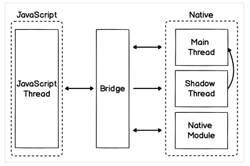

#### 주요 특징
1. **비동기적 통신**
   - 브릿지는 자바스크립트 스레드에서 정보를 받아 네이티브로 전달한다.
   - 자바스크립트 스레드는 자바스크립트 코드가 실행되는 장소이며 보통 리액트 코드로 구성되어 있다.
   - JavaScript와 네이티브 코드는 서로 독립된 스레드에서 실행되며, 두 환경 간의 통신은 비동기적으로 이루어진다. 
   - 이를 통해 각자 별개의 이벤트 루프에서 작업을 수행할 수 있으며, UI의 반응성을 유지할 수 있다.

2. **직렬화된 메시지**  
   - JavaScript에서 네이티브로의 호출(또는 그 반대의 경우)은 JSON 형식의 메시지로 직렬화된다. 
   - 이렇게 직렬화된 데이터를 브릿지를 통해 네이티브 환경으로 보내면, 네이티브 쪽에서는 메시지를 파싱해 실제 네이티브 코드가 실행된다.

3. **커스텀 네이티브 모듈 구현 가능**  
   - 브릿지를 사용하여 자바스크립트 코드에서 접근할 수 있는 네이티브 모듈을 직접 만들어 리액트 네이티브에 연결할 수 있다. 
   - 이를 통해 플랫폼 별로 고유한 기능(카메라 접근, GPS, Bluetooth 등)을 JavaScript로 제어할 수 있다.


### 가상DOM
- **가상 DOM(Virtual DOM)**은 JavaScript 객체 형태로 메모리에 저장되는 가상화된 DOM 구조로, 실제 DOM을 변경하기 전 상태를 메모리에 미리 반영하여 UI 업데이트 성능을 최적화하는 기법이다. 
- 가상 DOM은 리액트(React)와 같은 프레임워크에서 사용되며, 변화가 발생할 때마다 실제 DOM을 직접 조작하지 않고 가상 DOM을 통해 효율적으로 UI를 갱신할 수 있도록 돕는다.


#### 데이터가 변했을 때 화면이 다시 그려지는 과정은 다음과 같다.
1. 데이터에 변화가 있다.
2. 변화된 데이터를 이용하여 가상 DOM을 그린다.
3. 가상 DOM과 실제 DOM을 비교하여 차이점을 확인한다.
4. 차이점이 있는 부분만 실제 DOM에 적용하여 그린다.

- 여기서 실제 DOM은 우리가 보는 화면에 나타나는 DOM이고, 가상 DOM은 화며에 보이지 않지만 비교를 위해 존재하는 DOM이라고 생각하면된다.


#### 장점
- **성능 향상**  
  실제 DOM 조작은 느리고, 특히 복잡한 UI에서는 성능 저하를 유발할 수 있다. 가상 DOM을 통해 변경 사항만을 효율적으로 적용함으로써, UI 업데이트를 빠르게 처리할 수 있다.

- **추상화**  
  가상 DOM은 리액트가 네이티브 브라우저 DOM API에 의존하지 않도록 해주며, 다양한 환경에서 동일한 렌더링 결과를 제공하도록 한다.

- **개발 편의성**  
  개발자는 상태 변화에 따라 UI를 다시 그리는 과정에 대해 신경 쓰지 않고, 리액트가 알아서 최적의 방식으로 변경 사항을 반영하도록 할 수 있다.

#### 단점
- **초기 렌더링 비용**  
  가상 DOM 자체가 메모리에 생성되고, 상태가 변할 때마다 가상 DOM 트리를 다시 생성하므로 초기 렌더링이나 대규모 애플리케이션에서는 메모리와 CPU 사용이 늘어날 수 있다.

- **복잡한 Diffing 비용**  
  리액트의 Diffing 알고리즘은 효율적이지만, DOM 트리가 복잡해질수록 성능 저하가 발생할 수 있다. 이러한 경우 **Reconciliation 최적화**나 **React.memo** 등의 성능 최적화 기법이 필요하다.

`가상 DOM은 리액트의 성능 최적화에 핵심적인 역할을 하며, 변경된 부분만 실제 DOM에 반영함으로써 효율적인 UI 업데이트를 가능하게 하는 기술이다.`<br>
`이를 통해 개발자는 UI 업데이트 로직을 간단히 관리할 수 있으며, 리액트가 변화에 따라 효율적인 방식으로 DOM을 업데이트하도록 할 수 있다.`

### JSX
- 자바스크립트 라이브러리에서 화면을 구성할 때 사용하는 특별한 문법이다. 
- 쉽게 말해, **HTML처럼 생긴 자바스크립트**라고 생각하면 된다. 
- JSX를 사용하면 웹 페이지의 구조를 마치 HTML을 쓰는 것처럼 편리하게 작성할 수 있다.
- 자바스크립트 코드 안에서 UI작업을 할 때 가독성에 도움을 주는 등 여러 가지 장점이 있으며 리액트에서 많이 사용되고 있다.
- JSX를 사용하면 HTML 태그와 자바스크립트 코드를 하나의 파일에서 함께 작성할 수 있어서, 웹 화면을 구성하는 코드를 간단하고 깔끔하게 만들 수 있다. 
- 이렇게 작성된 코드는 웹 브라우저가 이해할 수 있도록 자바스크립트 코드로 변환되어 사용된다.

```JS
function formatName(user){
   return user.firstName + ' '+ user.lastName;
}

const User = {
   firstName : 'Beomjun',
   lastName : 'kim'
};

const element = <h1>hello, {formatName(user)}!</h1>
```
- JSX로 작성된 코드는 나중에 바벨(Babel)을 사용하여 자바스크립트로 변환된다.
- 위 코드를 변환하면 다음과 같은 자바스크립트 코드로 변경할 수 있다.

```JS
function formatName(user){
   return user.firstName + ' '+ user.lastName;
}

const User = {
   firstName : 'Beomjun',
   lastName : 'kim'
};

const element = /*#_PURE_*#/ React.createElement(
'h1',
null,
'Hello, ',
formatName(user),
'!'
)
```
- JSX로 작성된 코드의 가독성이 더 뛰어난 것을 알 수 있다.
- JSX는 가독성 뿐만 아니라 오류 검사에도 장점이 있다.
- 예를들어 위의 코드에서 h1태그를 닫지 않은 경우 바벨이 코드를 변환하는 과정에서 이 부분을 감지하고 알려준다.

# 개발환경 준비하기
- 리액트 네이티브는 맥, 윈도우, 리눅스 환경에서 개발이 가능하다.
- 맥 환경에서는 IOS,안드로이그 개발이 모두 가능하지만, 윈도우와 리눅스 환경에서는 안드로이드 개발만 가능하다.

## Node.js 설치
- https://nodejs.org/ko
- Node.js를 설치하면 노드 패키지 매니저인 npm도 같이 설치된다.
- 우리는 npm을 통해 전 세계 수 많은 개발자들이 만든 패키지를 설치하고 사용할 수 있다.

`Nodejs는 장기적으로 안정적인 지원을 제공하는 LTS(Long Term Support)버전을 매년 10월경에 변경하고 있다.`

- Node.js 웹사이트에서 LTS 버전을 다운로드 받아 설치를 진행하자
- 최신버전을 받아서 사용하자.

## Python 설치
- 리액트 네이티브는 빌드할 때 파이썬이 필요하다.
- 책에서는 파이썬2가 필요하다고 되어있지만 현재 기본적인 기능들은 파이썬3도 지원을 한다.

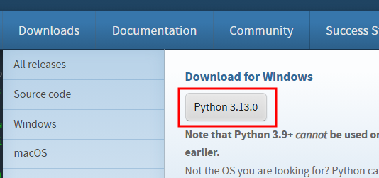


## JDK 설치
- 안드로이드 개발을 위한 자바를 사용하기 위해 JDK를 설치해야한다.
- JDK를 설치하면 환경변수를 설정한다.

## 안드로이드 스튜디오 설치
- https://bit.ly/android-ide-download
- 안드로이드 스튜디오는 안드로이드 개발을 위한 공식 IDE이다.
- 안드로이드 스튜디오 다운로드 페이지로 가면 현재 접속한 운영 체제에 알맞은 스튜디오가 다운로드 되도록 나타난다.
- 만약 환경과 맞지 않거나 다른 파일을 확인하고 싶은 경우, DOWNLOAD OPTIONS를 클릭해 다른 플랫폼에서 사용 가능한 안드로이드 스튜디오를 확인해보자.
- 안드로이드 스튜디오 설치가 완료되면 안드로이드 스튜디오를 실행한 후 설정을 진행하자.


- custom을 고르고 next를 누른다.


- SDK Components Setup 화면이 나타난다.
- 다음의 목록들을 선택하고 진행한다.
- Android SDK
- Performance (intel HAXM)
- Android Virtual Device

### 안드로이드 SDK란?
- **안드로이드 앱을 개발하는 데 필요한 기본적인 구성 요소들을 모아놓은 도구 세트**다. 
- 이를 통해 개발자가 안드로이드 앱을 쉽게 만들고 테스트해 볼 수 있다. 
- 만약 SDK가 없다면, 안드로이드 앱의 기능을 하나하나 직접 만들어야 하기 때문에 개발이 매우 어려워진다.

### 안드로이드 SDK에 포함된 것들
안드로이드 SDK에는 앱 개발에 필수적인 다음과 같은 도구들이 포함되어 있다

1. **안드로이드 플랫폼**  
   - 안드로이드가 실행되는 환경을 제공하여, 앱이 안드로이드 기기에서 작동할 수 있도록 한다.

2. **에뮬레이터(Emulator)**  
   - 실제 안드로이드 기기 없이도 컴퓨터에서 안드로이드 기기처럼 앱을 테스트해 볼 수 있는 가상의 안드로이드 장치다.

3. **빌드 도구(Build Tools)**  
   - 개발한 앱을 실행 가능한 형태로 만들기 위해 필요한 도구로, 앱이 완성되면 이를 패키지로 만들어 설치할 수 있게 한다.

4. **디버깅 도구(Debugging Tools)**  
   - 앱을 실행해 보면서 오류를 찾아 수정할 수 있도록 돕는 도구로, 앱이 제대로 작동하는지 확인할 때 사용된다.

5. **기타 라이브러리와 API**  
   - 안드로이드 앱에서 자주 사용하는 기능들(예: 카메라, 위치 정보 등)을 쉽게 추가할 수 있게 도와주는 코드 묶음이 포함되어 있다.

### 왜 SDK가 필요한가?
- 안드로이드 앱을 개발할 때, SDK는 **개발자가 안드로이드 환경에서 앱을 만들고 테스트할 수 있도록 기본적인 도구와 환경을 제공**한다. 
- 예를 들어, 앱을 개발할 때 버튼, 텍스트 상자, 이미지 등 안드로이드에서 제공하는 기본적인 화면 요소들을 사용할 수 있도록 하고, 컴퓨터에서 앱을 미리 실행해 볼 수 있는 에뮬레이터를 통해 쉽게 테스트할 수 있게 해준다.

### 안드로이드 스튜디오에서 SDK 설정
- 안드로이드 스튜디오를 설치할 때 SDK도 함께 설치되며, 이를 통해 안드로이드 앱을 만들고 테스트할 수 있는 환경이 준비된다. 
- SDK가 없으면 안드로이드 앱 개발을 시작할 수 없으므로, 안드로이드 스튜디오 설치 과정에서 SDK가 자동으로 설치되거나, 설치 후 별도로 설정할 수 있게 되어 있다.

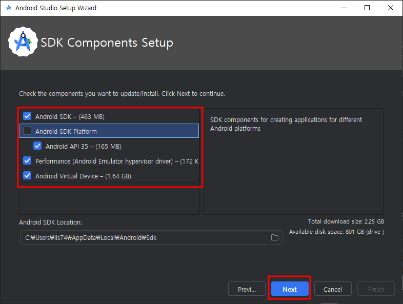

- 나머지 설정은 기본 설정을 유지한 채로 진행한다.
- 설정이 완료되면 SDK Manager로 이동해서 추가 설치를 진행한다.

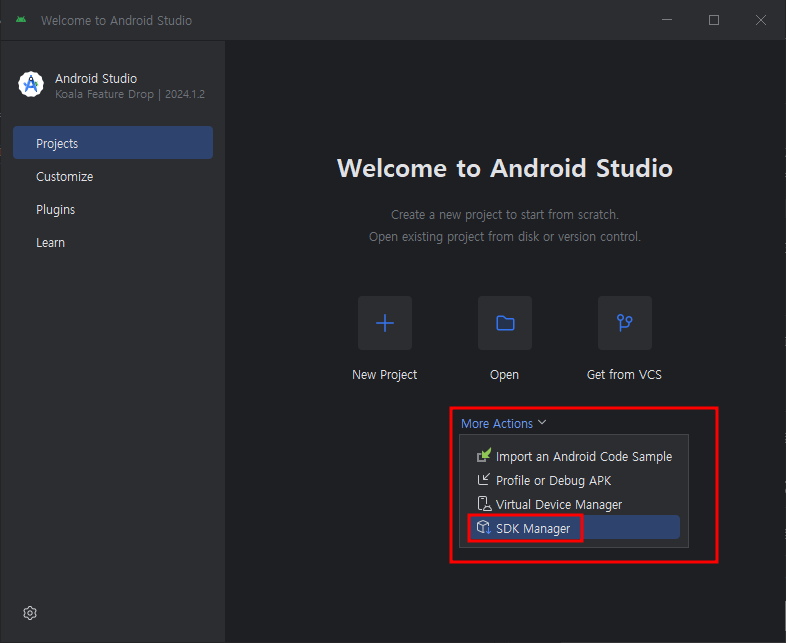

- SDK Manager에서 SDK-Platform탭의 오른쪽 하단에 있는 Show Package Details를 클릭하고 필요한 항목들을 선택해서 설치하자.
- Android SDK Platform 29
- Intel x86 Atom_64 System Image 또는 Google APIs intel x86 Atom System Image

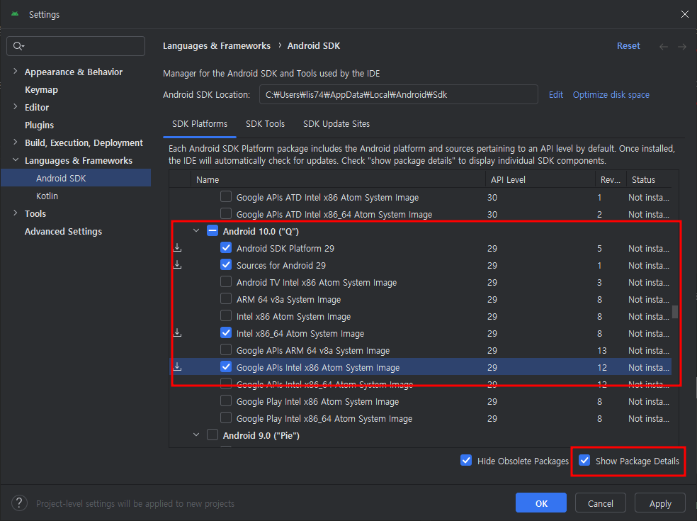

- SDK Tools 탭에서도 Show Package Details를 클릭해서 Android SDK Build-Tools 29.0.2를 선택하고 설치하자.

## 안드로이드 스튜디오 환경변수 설정하기
- 환경 변수를 검색한다.

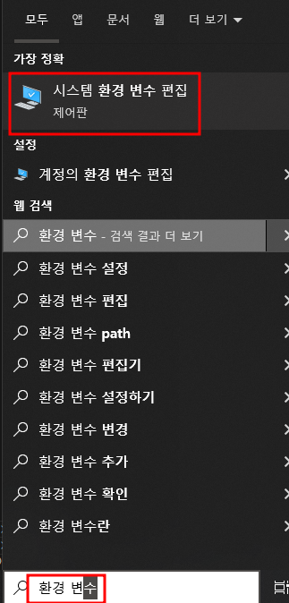


- 변수 이름 : ANDROID_HOME
- 변수 값 : C:\Users\사용자\AppData\Local\Android\Sdk

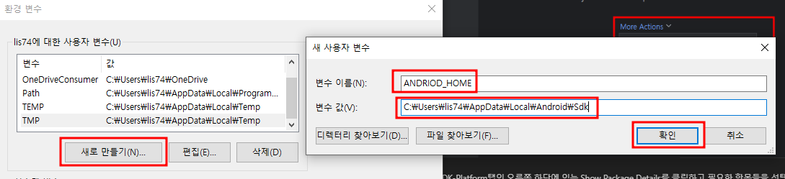

- 변수 추가가 완료되면 시스템 변수에 있는 Path를 편집한다.

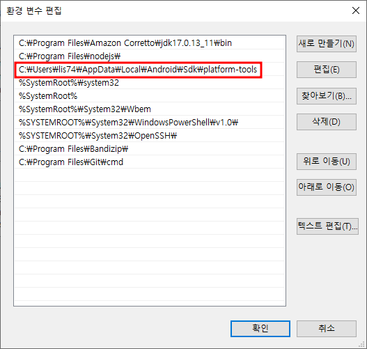

- 환경 변수 설정이 완료되면 프롬프트 창에서 확인할 수 있다.
```
C:\Users\lis74>adb --version
Android Debug Bridge version 1.0.41
Version 35.0.2-12147458
Installed as C:\Users\lis74\AppData\Local\Android\Sdk\platform-tools\adb.exe
Running on Windows 10.0.19045
```

## 에뮬레이터
- **안드로이드 에뮬레이터**는 **컴퓨터에서 가상의 안드로이드 스마트폰을 만들어 앱을 테스트할 수 있게 해주는 프로그램**이다. 
- 안드로이드 휴대폰을 사용하는 것처럼 컴퓨터 화면에서 스마트폰을 작동할 수 있도록 해주는 도구라고 생각하면 된다. 
- 에뮬레이터 덕분에 실제 기기가 없어도 컴퓨터에서 앱이 어떻게 작동하는지 확인할 수 있다.

### 안드로이드 에뮬레이터의 주요 개념과 기능

1. **가상의 안드로이드 기기**
   - 에뮬레이터는 안드로이드 휴대폰이나 태블릿을 가상으로 만들어주기 때문에, 화면에서 가상의 스마트폰을 보면서 앱을 테스트할 수 있다.
   - 여러 기기 모델이나 화면 크기, 안드로이드 버전 등을 설정할 수 있어서 다양한 기기에서 앱이 어떻게 작동하는지 확인할 수 있다.

2. **앱 테스트에 유용**
   - 에뮬레이터는 개발 중인 앱을 바로 실행해 볼 수 있어서, 오류를 빠르게 수정하거나 디자인을 조정할 때 매우 유용하다.
   - 예를 들어, 앱에 새로운 기능을 추가하고 나서 그 기능이 제대로 작동하는지 에뮬레이터에서 확인할 수 있다.

3. **다양한 기기 환경 설정 가능**
   - 에뮬레이터는 가상의 기기이기 때문에 다양한 설정을 쉽게 바꿀 수 있다. 안드로이드 버전(예: Android 10, Android 11)이나 화면 크기, 해상도 등을 변경해 다양한 환경에서 테스트할 수 있다.
   - 이 기능을 통해 사용자가 어떤 기기를 사용하더라도 앱이 잘 작동하는지 확인할 수 있다.

4. **사용법**
   - 안드로이드 스튜디오에서 제공하는 에뮬레이터는 프로그램 설치 후 설정을 통해 간단히 실행할 수 있다.
   - 앱을 개발한 후 에뮬레이터에서 실행해 보면, 컴퓨터 화면에 가상의 스마트폰이 나타나며 그 안에서 앱이 작동하게 된다.

### 에뮬레이터의 장점

- **비용 절약**: 여러 종류의 실제 안드로이드 기기를 구매할 필요 없이, 다양한 기기 환경에서 앱을 테스트할 수 있다.
- **편리함**: 앱을 코드로 수정한 후 바로 에뮬레이터에서 실행해 볼 수 있어 빠르게 오류를 수정하고 기능을 테스트할 수 있다.
- **다양한 테스트 가능**: 기기마다 다른 화면 크기, 해상도, 안드로이드 버전 등을 에뮬레이터로 설정할 수 있어, 여러 상황에서 앱이 잘 작동하는지 확인할 수 있다.

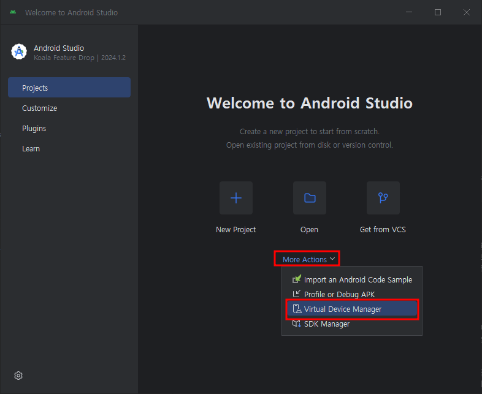

- + 버튼을 누른다.

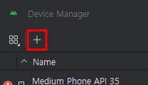

- 기기를 선택하는 화면에서 테스트를 진행하고 싶은 기기를 선택할 수 있다.
- 픽셀3를 선택하고 앞으로 안드로이드 테스트를 진행하는데 사용하자.


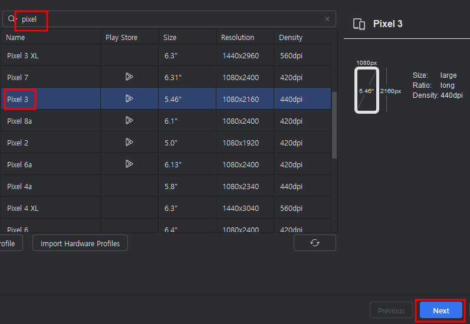

- 안드로이드 이미지 선택 화면에서는 x86 Images 탭을 선택하고 앞서 설치한 이미지를 선택한 후 진행한다.

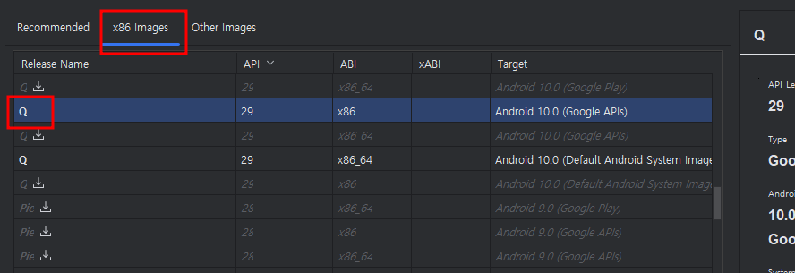

- 모든 선택이 완료되면 AVD Manager 화면에서 방금 추가한 이미지가 목록에 추가된 것을 확인할 수 있다.
- 항목을 더블클릭 하거나 항목의 오른쪽 끝 Actions에 있는 녹색 시작 버튼을 클릭해 에뮬레이터를 실행해보자.


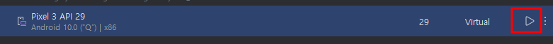


## 에디터 설치
- 리액트 네이티브의 코드를 작성할 VSCODE를 설치하자.
- https://code.visualstudio.com/

## 리액트네이티브 프로젝트 만들기
- 리액트 네이티브 프로젝트를 생성하는 방법에는 두 가지가 있다.
1. Expo를 사용하는 방법
2. 리액트 네이티브 CLI를 사용하는 방법

### Expo
- **Expo(엑스포)**는 **리액트 네이티브로 모바일 앱을 더 쉽게 만들고 테스트할 수 있도록 도와주는 도구**다. 
- 보통 리액트 네이티브로 앱을 개발할 때는 여러 가지 복잡한 설정을 해야 하지만, Expo를 사용하면 이 과정을 훨씬 간단하게 만들 수 있다. 
- 초보 개발자도 빠르게 앱을 만들어보고 실행해 볼 수 있어서 많이 사용된다.

### Expo의 주요 특징

1. **간편한 설치와 시작**
   - Expo를 사용하면 리액트 네이티브 프로젝트를 쉽게 시작할 수 있다. 
   - 별도의 복잡한 환경 설정이 필요하지 않아 빠르게 앱을 만들고 실행할 수 있다.

2. **에뮬레이터 없이 실제 기기에서 테스트 가능**
   - Expo는 **스마트폰에 설치할 수 있는 Expo Go 앱**을 제공한다. 
   - 이 앱을 통해 개발 중인 리액트 네이티브 앱을 바로 스마트폰에서 테스트할 수 있다.
   - 컴퓨터에서 앱 코드를 작성하고 Expo를 통해 QR 코드를 스캔하면, 스마트폰에서 개발 중인 앱이 즉시 실행된다.

3. **미리 만들어진 기능들**
   - Expo는 카메라, 위치 정보, 센서와 같은 스마트폰의 여러 기능을 쉽게 사용할 수 있는 코드를 제공한다.
   - 예를 들어, "카메라 기능을 앱에 추가하고 싶다"라고 할 때, Expo에서 제공하는 카메라 기능 코드를 사용하면 별다른 추가 설정 없이 앱에서 카메라 기능을 사용할 수 있다.

4. **자동 업데이트**
   - 앱에 변경 사항이 생기면 Expo가 자동으로 반영해 주기 때문에, 개발자는 컴퓨터에서 코드를 수정한 후 즉시 변경된 내용을 스마트폰에서 확인할 수 있다.

### Expo로 리액트 네이티브 프로젝트 시작하기
- Expo는 리액트 네이티브를 처음 시작하는 사람도 접근하기 편하게 되어있으며 최종적으로 완성된 프로젝트를 쉽게 배포 및 관리할 수 있도록 다양한 기능을 제공한다.
- 아이폰과 안드로이드 폰이 있으면 Xcode, 안드로이드 스튜디오 없이도 해당 플랫폼의 테스트를 진행하며 개발할 수 있다.
- 리액트 네이티브 웹을 지원하며 iOS, 안드로이드뿐만 아니라 웹도 함께 개발할 수 있다.

### Expo의 주요 단점

1. **사용할 수 있는 기능에 제한이 있음**
   - Expo는 카메라, 위치 정보, 센서 같은 일반적인 기능을 쉽게 추가할 수 있는 도구를 제공하지만, 더 복잡하거나 특수한 기능을 추가하는 데는 제한이 있다.
   - 예를 들어, 앱에서 특별한 블루투스 기능이나 맞춤 설정한 네이티브 기능을 추가해야 하는 경우, Expo에서는 이런 기능을 직접 구현하기 어렵다.

2. **앱 용량이 커질 수 있음**
   - Expo는 다양한 기능을 미리 포함하고 있어서, 개발자가 특정 기능을 사용하지 않아도 앱에 여러 기능이 포함된다. 
   - 그 결과로 앱의 용량이 커질 수 있다. 앱 크기가 커지면 사용자 입장에서 설치할 때 더 많은 저장 공간을 차지하게 되어 불편할 수 있다.

1. **네이티브 코드 수정 불가능**
   - Expo에서는 **네이티브 코드**(안드로이드의 Java/Kotlin 코드나 iOS의 Swift/Objective-C 코드)를 직접 수정할 수 없다. 
   - 네이티브 코드를 수정해야 할 때는 Expo를 사용하는 대신 리액트 네이티브 CLI로 직접 프로젝트를 생성해야 한다.
   - 네이티브 코드 수정을 통해 맞춤형 기능을 추가하려는 경우, Expo는 적합하지 않다.

2. **앱 빌드와 배포에 제한 사항이 있음**
   - Expo는 앱을 빌드하고 배포하는 과정도 쉽게 해주지만, Expo에서 제공하는 방식 외에 다른 방식을 적용하기 어렵다.
   - 앱을 구글 플레이스토어나 애플 앱스토어에 올릴 때 Expo만의 방식으로 배포하게 되며, 앱 출시 후에도 Expo의 규칙에 따라 빌드와 업데이트를 관리해야 한다.

3. **Eject 필요**  
   - 만약 Expo에서 지원하지 않는 특정 기능이 필요해져서 네이티브 코드를 추가해야 할 때, "Eject"라는 과정을 거쳐 Expo를 벗어나야 한다.
   - **Eject**는 말 그대로 Expo에서 나와 리액트 네이티브 CLI로 프로젝트를 전환하는 것인데, 이를 수행하면 Expo의 편리한 기능들을 더 이상 사용할 수 없게 된다. Expo를 떠난 이후에는 모든 설정을 직접 해야 하므로, 처음부터 리액트 네이티브 CLI로 프로젝트를 시작하는 것과 비슷해진다.

### Expo를 이용하여 리액트 네이티브 프로잭트 생성하기
- Expo를 이용하려면 npm을 이용해 expo-cli를 설치해야 한다.
- 터미널 또는 명령 프롬프트에서 다음 명령어로 expo-cli를 설치한다.

####  **Expo CLI 설치**  
- 컴퓨터의 명령어 도구에서 아래 명령어를 입력하여 Expo CLI(명령어 도구)를 설치한다:
```bash
npm install -g expo-cli
```
- 설치가 완료되면 다음 명령어로 Expo 프로젝트를 생성한다.
```bash
expo init my-first-expo
```
- Expo 프로젝트를 생성하는 명령어를 입력하면 다음과 같은 화면이 나오면서 어떤 프로젝트를 생성할지 선택지를 제공한다.
- 이 책에서는 항상 첫 번째 선택지인 blank를 선택한다.


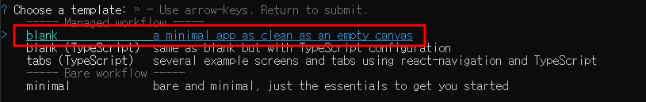

### Expo 프로젝트 실행
- 프로젝트 생성이 완료되면 생성된 프로젝트 폴더로 이동해서 프로젝트를 실행한다.
```bash
cd my-first-expo
npm expo start
```

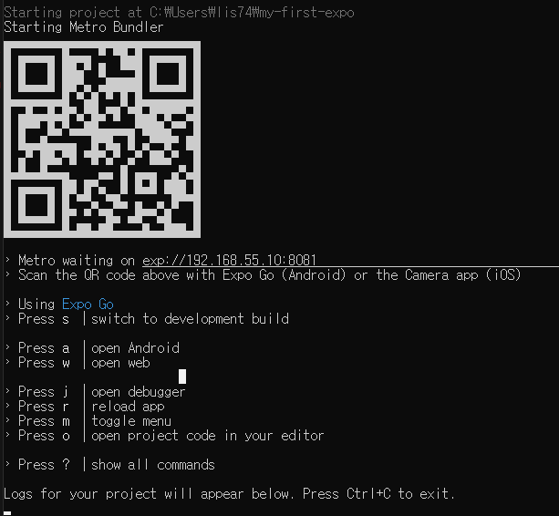

## 실제 휴대폰에서 Expo 실행하기
- 구글 플레이 스토어와 앱 스토어에서 Expo 애플리케이션을 다운받아 설치한다.
- 설치 완료 후 Expo 프로젝트를 실행한 터미널이나 명령 프롬프트에 있는 QR코드를 촬영하면 실제 기기에서 Expo프로젝트를 실행할 수 있다.
- 안드로이드폰은 Expo 애플리케이션의 Scan QR Code를 이용하고, 아이폰은 기본 카메라 어플을 사용하면 된다.
- 실제 기기를 사용하는 경우 기기를 흔들면 Expo 프로젝트의 메뉴가 열린다.

## 시뮬레이터에서 확인하기
- 안드로이드 스튜디오에서 에뮬레이터를 작동시킨 후 터미널이나 프롬프트에서 a를 눌러서 애플리케이션을 실행할 수 있다.
- 가상 기기로 진행하는 경우 Control + M을 이용해서 메뉴를 열 수 있다.

## 로그 확인하기
- 생성된 프로젝트의 App.js의 파일을 다음과 같이 수정해보자
```jsx
export default function App() {
  console.log('Expo DevTools Log Test')
  return (
    ...
  );
}
```
- Expo프로젝트를 실행시킨 터미널 또는 명령 프롬프트에서 로그 확인이 가능하다는 것을 알 수 있다.

## 내보내기
- Expo 프로젝트의 장점을 수용하기 위해 Expo 프로젝트로 시작했지만, 프로젝트의 상황에 따라 네이티브 모듈을 건드리거나 기타 다른 이유 때문에 CLI 프로젝트로 변경해야 하는 상황이 발생할 수 있다.
- 이 경우 eject 명령어를 이용하면 해결할 수 있다.
- eject 명령어를 실행하면 Expo프로젝트가 감추고 있던 것들이 드러나며, 리액트 네이티브 CLI 프로젝트로 시작한 것처럼 프로젝트가 변경되고 Expo 프로젝트에 있던 제약들도 없어진다.
- 하지만 다시 Expo 프로젝트로 돌아올 수 없다.

### 리액트 네이티브 CLI
- 리액트 CLI의 장점은 Expo의 단점이다.
- 즉 Expo와 반대로 리액트 네이티브 CLI에서는 필요한 기능이 있을 경우 모듈을 직접 만들어서 사용할 수 있다.
- 하지만 Expo에 비해 배포가 불편하고 리액트 네이티브를 처음 다루는 이용자에게 더 어렵게 느껴질 수 있다.

### 프로젝트 생성
- 책에 있는 명령어로는 작동을 안할 수 있다.
- 노드 최신버전을 설치한 후 다음의 명령어로 실행한다.
```bash
npx @react-native-community/cli init MyFirstCLI
```

### 프로젝트 실행
- 프로젝트 생성이 완료되면 폴더로 이동해서 프로젝트를 실행해본다.
```
cd MyFirstCLI
npm run ios
npm run android
```
- 리액트 네잍티브가 실행되면서 터미널 혹은 프롬프트 창 하나가 추가로 열리고 Metro가 실행되는것을 볼 수 있다.

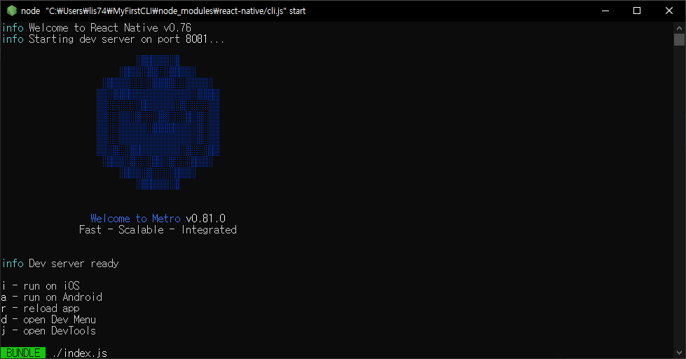

### Metro란?
- **Metro**는 **React Native** 개발 환경에서 중요한 역할을 하는 **번들러**다. 
- 쉽게 말해, Metro는 리액트 네이티브 앱을 개발할 때 필요한 **코드를 모아서 하나로 묶어주는 도구**라고 할 수 있다.

---

### 번들러는 무엇일까?

- 번들러는 여러 파일로 나뉘어 있는 코드들을 모아 하나의 파일이나 작은 묶음으로 만들어주는 역할을 한다. 
- 이 과정은 **웹브라우저나 모바일 앱에서 코드를 더 쉽게 읽고, 빠르게 실행**할 수 있도록 돕는다. 여러 개의 코드 파일을 계속 불러오면 앱이 느려질 수 있는데, 번들링을 하면 한 번에 필요한 코드를 가져와서 로딩 속도가 빨라지는 것이다.

### Metro의 역할

1. **코드를 읽고 묶음으로 만들기**  
   Metro는 개발자가 작성한 코드와 앱에서 필요한 외부 라이브러리(자바스크립트 코드들)를 모아서 하나의 묶음으로 만든다. 이 덕분에 앱이 빨리 실행될 수 있다.

2. **앱을 빠르게 업데이트**  
   Metro는 코드를 실시간으로 감시하면서, 개발자가 코드를 수정하면 바로 반영할 수 있도록 돕는다. 이 기능을 **핫 리로딩** 또는 **패스트 리프레시**라고 부른다. 덕분에 앱을 처음부터 다시 실행하지 않아도, 수정된 부분만 바로 반영돼 빠르게 확인할 수 있다.

3. **코드 최적화**  
   Metro는 앱이 더 효율적으로 작동할 수 있도록, 코드에서 불필요한 부분을 제거하고 필요한 코드만 남겨둔다.

### Metro와 리액트 네이티브의 관계

- 리액트 네이티브 앱을 처음 실행하면, Metro가 자동으로 실행되면서 앱에 필요한 자바스크립트 파일들을 준비해준다. 
- 앱이 실행 중일 때 Metro가 계속 코드를 확인해 수정된 부분을 반영해 주기 때문에, 개발자는 더 편리하게 코드를 실시간으로 수정하면서 결과를 볼 수 있다.


