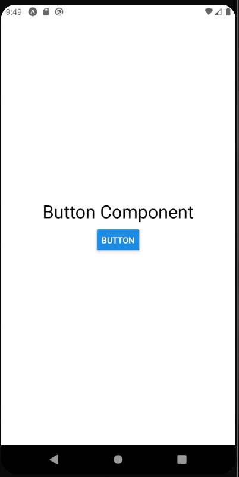
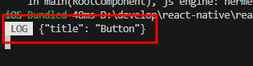
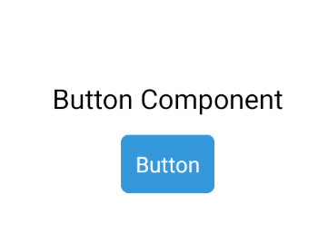
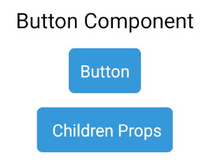
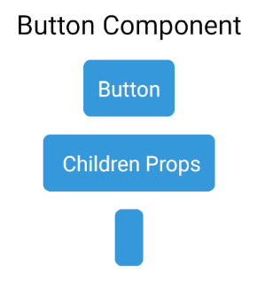

# 컴포넌트
- 컴포넌트는 재사용할 수 있는 조립 블록으로 화면에 나타나는 UI 요소라고 생각하면된다.

## 프로젝트 생성하기
- 실습을 위해 다음의 명령어를 사용하여 react-native-component라는 이름의 프로젝트를 생성한다.
```
expo init react-native-component
```

## JSX
- react-native-component 프로젝트의 App.js파일을 확인해보면 다음과 같은 코드를 확인할 수 있다. 

```js
import { StatusBar } from 'expo-status-bar';
import { StyleSheet, Text, View } from 'react-native';

export default function App() {
  return (
    <View style={styles.container}>
      <Text>Open up App.js to start working on your app!</Text>
      <StatusBar style="auto" />
    </View>
  );
}

const styles = StyleSheet.create({
  container: {
    flex: 1,
    backgroundColor: '#fff',
    alignItems: 'center',
    justifyContent: 'center',
  },
});
```
- 자바스크립트 파일임에도 불구하고 HTML을 작성한것같은 코드들이 보인다.

### JSX의 기본 개념
- JSX는 리액트와 리액트 네이티브에서 화면을 만들 때 사용하는 문법인데, 쉽게 말해서 JavaScript와 HTML을 합친 형태라고 보면 된다.
- 객체 생성과 함수 호출을 위한 문법적 편의를 제공하기 위해 만들어진 확장 기능으로 리액트 프로젝트에서 사용된다.
- JSX는 가독성이 높고 작성하기도 쉬울 뿐만 아니라, XML과 유사하다는 점에서 중첩된 구조를 잘 나타낼 수 있다는 장점이 있다.
- 리액트 네이티브는 JSX문법을 사용하여 코드가 작성되므로 꼭 필요한 JSX 문법에 대해 알아보자

### 하나의 부모
- JSX에서는 여러 개의 요소를 표현할 경우 반드시 하나의 부모로 감싸야 한다.
- App.js파일을 수정해보자
```jsx
export default function App() {
  return (
      <Text>Open up App.js to start working on your app!</Text>
      <StatusBar style="auto" />
  );
}
```
- 에러가 나타나는것을 확인할 수 있다.
- JSX에서는 앞의 코드처럼 여러 개의 요소를 반환하는 경우에도 반드시 하나의 부모로 나머지 요소들을 감싸서 반환해야 한다.
```JSX
export default function App() {
  return (
    <View style={styles.container}>
      <Text>Open up App.js to start working on your app!</Text>
      <StatusBar style="auto" />
    </View>
  );
}
```
- View는 UI를 구성하는 가장 기본적인 요소로 웹 프로그래밍에서 \<div>와 비슷한 역할을 하는 컴포넌트이다.
- 컴포넌트를 반환할 때 View 컴포넌트처럼 특정 역할을 하는 컴포넌트로 감싸지 않고 여러 개의 컴포넌트를 반환하고 싶은 경우 Fragment 컴포넌트를 사용한다.

```jsx
import { Fragment } from 'react';

export default function App() {
  return (
    <Fragment>
      <Text>Open up App.js to start working on your app!</Text>
      <StatusBar style="auto" />
    </Fragment>
  );
}
```
- Fragment 컴포넌트를 사용하기 위해 import를 이용하여 불러오고 View 컴포넌트 대신 Fragment컴포넌트를 사용했다.
- 결과를 보면 기존의 View 컴포넌트에 적용된 스타일이 없어졌기 때문에 모습은 조금 바뀌었지만 오류 없이 정상적으로 동작하는 것을 확인할 수 있다.
- Fragment 컴포넌트는 단축 문법을 제공한다.
```jsx
import { Fragment } from 'react';

export default function App() {
  return (
    <>
      <Text>Open up App.js to start working on your app!</Text>
      <StatusBar style="auto" />
    </>
  );
}
```
### JSX 표현식 규칙
- 중괄호 {} 안에 JavaScript 표현식을 사용할 수 있다.
- 숫자, 문자열, 함수 호출, 배열 등을 중괄호 {} 안에 넣어 JSX 내에서 자유롭게 사용할 수 있다.

### 태그의 닫힘 규칙
- JSX에서 모든 태그는 반드시 닫혀야 한다.
-  img나 input 같은 HTML에서는 자주 단독으로 쓰는 태그도 JSX에서는 \와 같이 끝에 /을 붙여서 닫아야 오류가 발생하지 않는다.
```JSX
<Image source={{ uri: 'https://example.com/image.png' }} style={{ width: 100, height: 100 }} />
```


### 자바스크립트 변수
- JSX는 내부에서 자바스크립트의 변수를 전달하여 이용할 수 있다.
- App.js 파일을 수정해보자
```jsx
export default function App() {
  const name = "Gil-Dong";
  return (
    <View style={styles.container}>
      <Text style={styles.text}>My name is {name}</Text>
      <StatusBar style="auto" />
    </View>
  );
}
```


### 자바스크립트 조건문
- 개발을 하다보면 자바스크립트의 변수를 이용해서 화면을 나타내는 것뿐만 아니라, 특정 조건에 따라 나타나는 요소를 다르게 하고싶은 경우가 있다.
- JSX에서도 자바스크립트의 조건문을 이용하여 상황에 따른 요소를 출력할 수 있다.
- 다만 제약이 약간 있으므로 복잡한 조건인 경우 JSX 밖에서 조건에 따른 값을 설정하고 JSX내에서 사용하는 조건문에서는 최대한 간단하게 작성하는 것이 코드를 조금 더 깔끔하게 작성할 수 있다.

#### if 조건문
- JSX 내부에서는 if문을 사용할 수 있기는 하지만, if문을 즉시실행함수 형태로 작성해야 한다.
```jsx
export default function App() {
  const name = "Mal-Dong";
  return (
    <View style={styles.container}>
      <Text style={styles.text}>
        {(()=>{
          if(name ==='Hanbit') return 'My name is Hanbit';
          else if(name === 'Gil-Dong') return 'My name is Gil-Dong';
          else return 'My name is React Native';
        })()}
        </Text>
      <StatusBar style="auto" />
    </View>
  );
}
```
- name 변수의 값에 따라 출력되는 내용이 달라진다.

### 삼항연산자
- JSX는 내부에서 if 조건문 외에도 삼항 연산자를 사용할 수 있다.
- App.js파일을 수정해보자
```jsx
export default function App() {
  const name = "Gil-Dong";
  return (
    <View style={styles.container}>
      <Text style={styles.text}>
        My name is {name === 'Gil-Dong' ? 'Gil-Dong Hong' : 'React-native'}
        </Text>
      <StatusBar style="auto" />
    </View>
  );
}
```
- name 변수의 값을 변경하면서 결과를 확인하면 삼항연산자 규칙에 따라 값이 바뀌는걸 볼 수 있다.

### AND 연산자와 OR연산자
- AND연산자와 OR 연산자를 잘 이용하면 특정 조건에 따라 컴포넌트의 렌더링 여부를 결정하도록 코드를 구성할 수 있다.
```JSX
import { StatusBar } from 'expo-status-bar';
import { StyleSheet, Text, View } from 'react-native';

export default function App() {
  const name = "Gil-Dong";
  return (
    <View style={styles.container}>
      {name === 'Gil-Dong' &&(
        <Text style={styles.text}> My name is Gil-Dong</Text>
      )}
      {name !== 'Gil-Dong' &&(
        <Text style={styles.text}> My name is not Gil-Dong</Text>
      )}
      <StatusBar style="auto" />
    </View>
  );
```
- AND 연산자 앞의 조건이 참일 때 뒤의 내용이 렌더링 되고, 거짓인 경우 나타나지 않는다.
```jsx
<Text>{name || "Default Name"}</Text>
```
- OR연산자는 AND연산자와 반대로 앞의 조건이 거짓인 경우 내용이 나타나고, 조건이 참인 경우 나타나지 않는다.


### null과 undefined
- 조건에 따라 출력하는 값을 변경하다 보면 컴포넌트가 null이나 undefined를 반환하는 경우가 있다.
- JSX의 경우 null은 허용하지만 undefined는 오류가 발생하는데 주의해야 한다.
- App.js파일을 수정해보자
```jsx
export default function App() {
  return null;
}
```
- 하지만 undefined를 반환하는 코드는 오류 메시지가 나타난다.
```jsx
export default function App() {
  return undefined;
}
```
- undefined가 반환되는 상황에서는 화면이 나타나지 않는 것이 아니라 오류가 발생하기 때문에 코드 작성시 신경 써야 한다.

### 주석
- JSX에서의 주석은 자바스크립트에서의 주석과 약간 차이가 있다.
- 단, 태그 안에서 주석을 사용할 때는 자바스크립트처럼 //나 /**/주석을 사용할 수 있다.
```jsx
export default function App() {
  const name = "Mal-Dong";
  return (
    <View style={styles.container}>
      {/* <Text style={styles.text}>Comment</Text> */}
      <Text //Comment
      >
        Comment
      </Text>
      <StatusBar style="auto" />
    </View>
  );
}
```

### 스타일링
- JSX의 각 요소에 스타일을 적용하는 방법은 다양하다
- 자세한 내용은 4장에서 하고, 여기서는 인라인 스타일링에 대해 알아보자
- JSX에서는 HTML과 달리 style에 문자열로 입력하는 것이 아니라 객체 형태로 입력해야 한다.
- 그리고 background-color처럼 하이픈(-)으로 연결된 이름은 하이픈을 제거하고 카멜 표기법으로 backgroundColor처럼 작성해야 한다.
```jsx
export default function App() {
  const name = "Mal-Dong";
  return (
    <View style={{flex:1,
      backgroundColor:'#fff',
      alignItems: 'center',
      justifyContent: 'center'
    }}>
      <Text>Open up App.js to start working on your app!</Text>
      <StatusBar style="auto" />
    </View>
  );
}
```

## 컴포넌트
- 재사용이 가능한 조립 믈록으로 화면에 나타나는 UI 요소이다.
- 우리가 지금까지 봤던 App.js 파일도 App이라는 컴포넌트이다.
- 컴포넌트는 단순히 UI역할만 하는 것이 아니라 부모로부터 받은 속성(props)이나 자신의 상태(state)에 따라 표현이 달라지고 다양한 기능을 수행한다.
- 리액트 네이티브는 데이터와 UI 요소의 집합체라고 할 수 있는 컴포넌트를 이용하여 화면을 구성한다.

## 컴포넌트의 특징
### 독립적
- 포넌트는 다른 코드와 독립적으로 동작한다.
- 한 곳에서 수정해도 다른 부분에 영향을 주지 않는다.
### 재사용 가능
- 한 번 작성한 컴포넌트를 여러 곳에서 사용할 수 있다. 
- 예를 들어, 앱에서 같은 스타일의 버튼이 필요하다면 버튼 컴포넌트를 만들어 원하는 곳에서 재사용할 수 있다.


```jsx
import React from 'react';
import { View } from 'react-native';
import MyComponent from './MyComponent'; // 작성한 컴포넌트를 불러옴

export default function App() {
  return (
    <View>
      <MyComponent />
      <MyComponent />
    </View>
  );
}
```
## 컴포넌트의 장점
### 유지보수가 용이하다
- 화면의 각 부분을 작은 컴포넌트로 분리하여 만들기 때문에 필요한 부분만 수정할 수 있다.
### 재사용 가능하다
- 반복적으로 사용하는 요소를 컴포넌트로 만들어서 여러 곳에서 재사용할 수 있다.
### 가독성 증가
- 코드가 잘게 나누어지기 때문에 이해하기 쉽고 코드 관리가 수월하다.

### 내장 컴포넌트
- 리액트 네이티브에서는 다양한 내장 컴포넌트들이 제공된다.
<br>https://reactnative.dev/docs/components-and-apis


### View와 Text
#### View
- 가장 기본적인 레이아웃 컴포넌트로, HTML의 \<div>와 유사한 역할을 한다.
- 화면에 여러 요소를 그룹화하거나 레이아웃을 구성할 때 사용된다.
####  Text
- 텍스트를 표시할 때 사용하는 컴포넌트다. 
- HTML의 \<p>, \<span>과 비슷하며, React Native에서 텍스트를 표시할 때 필수적으로 사용된다.
```jsx
import React from 'react';
import { View, Text, StyleSheet } from 'react-native';

export default function App() {
  return (
    <View style={styles.container}>
      <Text>Hello from View Component!</Text>
    </View>
  );
}

const styles = StyleSheet.create({
  container: {
    flex: 1,
    backgroundColor: '#f5f5f5',
    alignItems: 'center',
    justifyContent: 'center',
  },
});
```

### Button 컴포넌트
- https://reactnative.dev/docs/button
- Button 컴포넌트의 문서를 확인해보면 설명과 사용 예제가 있다.
- 그리고 설정할 수 있는 속성들의 목록과 각 속성들의 설명을 볼 수 있다.
- 다른 컴포넌트들에도 이와 같이 자세한 예제와 설정 가능한 속성에 대한 설명이 있으므로 컴포넌트 사용 시 참고 할 수 있다.
- Button 컴포넌트를 사용하고 title과 onPress 속성을 지정해보자
- title 속성은 버튼 내부에 출력되는 텍스트이며, onPress 속성에는 버튼이 눌렸을 때 호출되는 함수를 지정할 수 있다.
- src 폴더를 생성하고 그 안에 App 컴포넌트를 작성할 App.js파일을 생성한다.
```jsx
import React from "react";
import { View, Text, Button } from "react-native";

const App = () => {
    return(
        <View
            style={{
                flex:1,
                backgroundColor:'#fff',
                alignItems: 'center',
                justifyContent: 'center'
            }}
        >
            <Text style={{fontSize:30, marginBottom:10}}>Button Component</Text>
            <Button title="button" onPress={()=> alert('Click!!')}/>
        </View>
    )
}

export default App;
```
- 버튼에 출력될 텍스트는 title 속성을 이용해서 button이라고 지정하고, 버튼을 클릭했을 때 Click!!이라는 확인 창이 나타나도록 onPress 속성에 함수를 지정했다.
- 작성이 완료되면 루트 디렉터리에 있는 App.js파일을 수정해 앞에서 작성한 App컴포넌트를 사용하도록 수정한다.
```js
import { StatusBar } from 'expo-status-bar';
import { StyleSheet, Text, View } from 'react-native';
import App from './src/App';

export default App;
```
- 에뮬레이터에 다음과 같이 반영된 모습을 볼 수 있다.



- 그런데 안드로이드와 ios에서의 버튼의 모습이 다른것을 볼 수 있다.
- Button  컴포넌트의 문서에서 color 속성을 확인해보면 원인을 알 수 있다.
https://reactnative.dev/docs/button#color<br>
- Button 컴포넌트의 color 속성은, iOS에서는 텍스트 색을 나타내는 값이지만 안드로이드에서는 버튼의 바탕색을 나타내는 값이다.
- 이렇게 iOS와 안드로이드가 약간씩 다르게 표현되거나 특정 플랫폼에서만 적용되는 속성이 있다.
- 이런 부분은 문서로 확인할 수 있지만 모든 컴포넌트의 속성을 외우고 사용할 수는 없다.
- 따라서 한 플랫폼만 테스트 하는 것이 아니라 iOS와 안드로이드 모두 확인하면서 개발하는 습관을 들이는것이 중요하다.

### ScrollView
- ScrollView는 스크롤이 가능한 뷰를 만들 때 사용하는 컴포넌트다.
- 화면에 보여질 내용이 길어질 때 유용하다.
```jsx
import React from 'react';
import { ScrollView, View, Text, StyleSheet } from 'react-native';

export default function App() {
  return (
    <ScrollView style={styles.container}>
      {Array.from({ length: 20 }, (_, i) => (
        <View key={i} style={styles.item}>
          <Text>Item {i + 1}</Text>
        </View>
      ))}
    </ScrollView>
  );
}

const styles = StyleSheet.create({
  container: {
    flex: 1,
    backgroundColor: '#f5f5f5',
  },
  item: {
    padding: 20,
    borderBottomWidth: 1,
    borderBottomColor: '#ccc',
    alignItems: 'center',
  },
});
```

### 커스텀 컴포넌트 만들기
- 리액트 네이티브에서 다양한 컴포넌트를 제공하고 있지만, 프로젝트를 진행하다 보면 여러 컴포넌트를 조합해서 새로운 컴포넌트를 제작하여 사용하게 된다.
- 리액트 네이티브에서 제공하는 컴포넌트들을 이용해서 커스텀 컴포넌트를 만들어보자.
- Pressable 컴포넌트와 Text 컴포넌트를 이용해서 MyButton 컴포넌트를 만들어보자.

### Pressable 컴포넌트
- 터치 이벤트에 대한 더 세부적인 제어를 제공하는 최신 터치 컴포넌트로, 다양한 상태와 조건을 다루기 위해 만들어졌다.
- 터치 가능한 영역을 정의하는 컴포넌트로, 사용자가 터치, 길게 누름, 눌렀다 뗌 등의 여러 이벤트를 처리할 수 있다.
- 각 이벤트에 따른 다양한 콜백 함수를 제공해 더 세밀하게 터치 상호작용을 제어할 수 있다.

#### 주요 이벤트와 콜백함수
- **onPress**: 사용자가 컴포넌트를 눌렀다 떼었을 때 호출된다. 일반적인 클릭 이벤트를 처리하는 데 사용된다.
- **onPressIn**: 사용자가 컴포넌트를 누르는 순간 호출된다.
- **onPressOut**: 사용자가 눌렀다 뗄 때 호출된다.
- **onLongPress**: 사용자가 지정된 시간 이상 길게 눌렀을 때 호출된다. 길게 누르는 경우에만 특정 동작을 처리하고 싶을 때 유용하다.

### components 폴더 만들기
- 제작된 컴포넌트들을 관리할 components 폴더를 src 폴더 밑에 만든다.
- MyComponent.js 파일을 만든다.

```jsx
import React from "react";
import { Pressable, Text } from "react-native";

const MyButton = () => {
    return(
        <Pressable>
            <Text style={{fontSize : 24}}>My Button</Text>
        </Pressable>
    )
}

export default MyButton;
```
```jsx
import React from "react";
```
- 이 코드는 리액트를 불러와서 사용할 수 있게 해준다.
- JSX는 React.createElement를 호출하는 코드로 컴파일되므로 컴포넌트를 작성할 때 반드시 작성해야 하는 코드이다.

```jsx
import { Pressable, Text } from "react-native";
```
- 리액트 네이티브에서 제공하는 Pressable 컴포넌트와 Text 컴포넌트를 추가했다.

```jsx
const MyButton = () => {
    return(
        <Pressable>
            <Text style={{fontSize : 24}}>My Button</Text>
        </Pressable>
    )
}
```
- Pressable 컴포넌트를 사용해서 클릭에 대한 상호작용을 할 수 있도록 하고, 버튼에 내용을 표시하기 위해 Text 컴포넌트를 사용했다.
- 이제 App 컴포넌트에서 MyButton 컴포넌트를 이용하도록 수정해보자.

```jsx
import React from "react";
import { View, Text, Button, ScrollView } from "react-native";
import MyButton from "./components/MyButton";

const App = () => {
    return(
        <View
            style={{
                flex:1,
                backgroundColor:'#fff',
                alignItems: 'center',
                justifyContent: 'center'
            }}
        >
            <Text style={{fontSize:30, marginBottom:10}}>Button Component</Text>
            {/* <Button title="button" onPress={()=> alert('Click!!')}/> */}
            <MyButton />
        </View>
    )
}

export default App;
```
- 버튼이 만들어졌지만 클릭이 잘 됐는지에 대한 명령이 없다
- MyButton 컴포넌트를 수정해보자
```jsx
import React from "react";
import { Pressable, Text } from "react-native";

const MyButton = () => {
    return(
        <Pressable
            style={{
                backgroundColor: '#3498db',
                padding: 16,
                margin: 10,
                borderRadius: 8,
            }}
            onPress={()=>{alert('Click !!!')}}
            >
            <Text style={{color: 'white', fontSize : 24}}>My Button</Text>
        </Pressable>
    )
}

export default MyButton;
```
- 안드로이드와 iOS에서 동일한 버튼이 나타나고 기능도 잘 동작하는 모습을 확인할 수 있다.

## psops와 state
- props와 state는 컴포넌트가 UI 뿐만 아니라  다양한 기능을 담당할 수 있도록 하여 더욱 다양한 역할을 수행할 수 있도록 해준다.

### props
- properties의 줄인 표현으로, 부모 컴포넌트로부터 전달된 속성값 혹은 상속받은 속성값을 이야기한다.
- 부모 컴포넌트가 자식 컴포넌트의 props를 설정하면 자식 컴포넌트에서는 해당 props를 사용할 수 있지만 변경하는 것은 불가능하다.
- props의 변경이 필요한 경우 props를 설정 및 전달한 부모 컴포넌트에서 변경해야 한다.

### props 전달하고 사용하기
- 먼저 부모 컴포넌트에서 props를 자식 컴포넌트로 전달해보자.
- Button 컴포넌트를 사용하면서 title 속성을 지정했었다.
```html
<Button title="button" />
```
- 이 코드처럼 Button 컴포넌트에  title 속성을 지정하면, Button 컴포넌트의 props로 title이 전달된다.
- 이번에는 우리가 만든 MyButton 컴포넌트를 이용해서 props에 전달되는 값을 확인해보자.
- 먼저 App 컴포넌트에서 MyButton 컴포넌트에 title이라는 속성을 입력해 사용한다.
```jsx
const App = () => {
    return(
        <View
            style={{
                flex:1,
                backgroundColor:'#fff',
                alignItems: 'center',
                justifyContent: 'center'
            }}
        >
            <Text style={{fontSize:30, marginBottom:10}}>Props</Text>
            {/* <Button title="button" onPress={()=> alert('Click!!')}/> */}
            <MyButton title="Button" />
        </View>
    )
}
```
- App 컴포넌트에서 MyButton 컴포넌트를 호출할 때 title 속성에 Button이라는 문자열을 전달했다.
- 자식 컴포넌트에서는 부모로부터 전달된 props를 함수의 파라미터로 받아서 사용할 수 있다.
- MyButton 컴포넌트에서 props를 전달받아 값을 확인해보자

```jsx
const MyButton = (props) => {
    console.log(props);
    return( ...
```


- 터미널에 출력되는 값을 보면 App 컴포넌트에서 MyButton 컴포넌트의 속성으로 지정한 title이 전달되는 것을 확인할 수 있다.
- 이번에는 props로 전달된 title을 이용해 버튼에 출력되는 문자열을 변경해보자
```jsx
<Pressable
  ...
    >
    <Text style={{color: 'white', fontSize : 24}}>{props.title}</Text>
</Pressable>
```


- title로 전달된 내용이 버튼에 잘 나온것을 확인할 수 있다.
- 부모 컴포넌트에서 자식 컴포넌트를 사용하면서 속성으로 props를 전달하는 방법 외에 컴포넌트의 태그 사이에서 값을 입력해서 전달하는 방법도 있다.
- App 컴포넌트를 수정해보자.
```jsx
...
  <Text style={{fontSize:30, marginBottom:10}}>Button Component</Text>
  {/* <Button title="button" onPress={()=> alert('Click!!')}/> */}
  <MyButton title="Button" />
  <MyButton title="Button" > Children Props</MyButton>
</View>

```
- 컴포넌트의 태그 사이에 전달된 값은 자식 컴포넌트의 props에 children으로 전달된다.
- 이제 MyButton 컴포넌트에서 children을 이용하여 태그 사이에 있는 값을 출력하도록 수정해보자.

```jsx
<Text style={{color: 'white', fontSize : 24}}>{props.children || props.title}</Text>
```


- props에 children이 있다면 title보다 우선시되도록 작성했다.

### defaultProps
- 만약 사용해야 하는 값이 props로 전달되지 않으면 어떻게 될까?
- App 컴포넌트에서 아무값도 전달하지 않으면서 MyButton 컴포넌트를 사용해보자.
```jsx
<Text style={{fontSize:30, marginBottom:10}}>Button Component</Text>
{/* <Button title="button" onPress={()=> alert('Click!!')}/> */}
<MyButton title="Button" />
<MyButton title="Button" > Children Props</MyButton>
<MyButton />
```


- MyButton 컴포넌트에서 Text 컴포넌트에 title 혹은 children을 렌더링하도록 했지만, 어떤 값도 전달되지 않았기 때문에 빈 버튼이 나타난다.
- 여러 사람과 함께 개발하다보면 내가 만든 컴포넌트를 다른 사람이 사용하는 경우가 많다.
- 이런 상황에서 컴포넌트를 잘못 파악해 반드시 전달되어야 하는 중요한 값이 전달되지 않았을 때 사용할 기본값을 defaultProps로 지정하면 만약의 사태에 빈 값이 나타나는 상황을 막을 수 있다.
```jsx
const MyButton = (props) => {

    MyButton.defaultProps = {
        title: 'Button',
    }
...

```
- App 컴포넌트는 수정하지 않았지만, MyButton 컴포넌트의 defaultProps 덕분에 빈 값으로 나타나던 버튼에 기본값으로 지정한 텍스트가 나타나는 것을 확인할 수 있다.

### propsTypes
- 프로젝트의 크기가 커지면서 컴포넌트에 props를 전달할 때 잘못된 타입으로 전달하거나, 필수로 전달해야 하는 값을 전달하지 않아서 문제가 생길 수 있다.
- 혹은 협업하는 다른 개발자가 잘못 전달할 수도 있다.
- 이런 상황에서 잘못된 props가 전달되었다는 것을 경고 메시지를 통해 알리는 방법으로 PropsTypes를 사용하는 방법이 있다.
- PropsTypes를 사용하려면 prop-types라이브러리를 추가로 설치해야 한다.
```js
npm install prop-types
```
- PropsTypes를 이용하면 컴포넌트에서 전달받아야 하는 props의 타입과 필수 여부를 지정할 수 있다.
- 설치가 완료되면 MyButton 컴포넌트에서 PropsTypes를 이용해 다음과 같이 수정한다.
```jsx
import PropTypes from "prop-types";

const MyButton = (props) => {

...

  MyButton.propTypes = {
      title: PropTypes.number
  }
```
- title에는 문자열이 넘어오지만, PropTypes를 이용해 title에 전달되어야 하는 값의 타입이 숫자여야 한다고 지정했다.
- 결과를 보면 경고 메시지를 확인할 수 있다.


- 이렇게 전달받을 props의 타입을 지정해서 잘못된 타입이 전달될 경우 경고 메시지를 출력할 수 있다.
- title의 타입을 문자열로 변경하면 앞의 경고 메시지가 더 이상 나타나지 않는다는 것을 알 수 있다.
```jsx
MyButton.propTypes = {
    title: PropTypes.string
}
```
- 이번에는 필수 전달 여부를 설정해보자.
- PropTypes를 이용해 필수 여부를 지정하는 방법은 간단하다.
- 선언된 타입 뒤에 isRequired만 붙여주면 된다.
```jsx

```