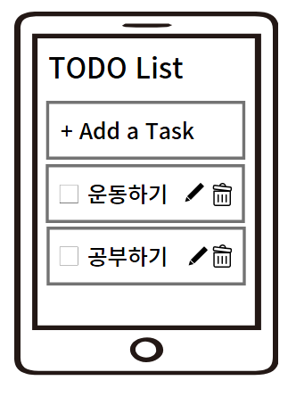

# 할일 관리 어플리케이션
- Todo 어플리케이션을 만들면서 지금까지 공부한 내용을 활용해보자



## 학습목표
- **등록** : 할 일 항목을 추가하는 기능
- **수정** : 완료되지 않은 할 일 항목을 수정하는 기능
- **삭제** : 할 일 항목을 삭제하는 기능
- **완료** : 할 일 항목의 완료 상태를 관리하는 기능
## 프로젝트 준비하기
```
expo init react-native-todo
```
- 프로젝트 생성이 완료되면 프로젝트에서 사용할 스타일드 컴포넌트 라이브러리와 prop-types라이브러리도 설치하자
```
cd react-native-todo
npm install styled-components@5.3 --legacy-peer-deps

npm install prop-types
```
- 라이브러리 설치가 완료되면 프로젝트에서 작성하는 코드를 관리할 src폴더를 생성하자
- 가정먼저 src폴더에 theme.js파일을 생성하고 프로젝트에서 사용할 색을 정의한다.

```js
export const theme = {
    background: '#101010',
    itemBackground: '#313131',
    main: '#778bdd',
    text: '#cfcfcf',
    done: '#616161',
  };
```

- src 폴더에 App.js파일을 생성하고 App 컴포넌트를 작성한다.
```js
import React from "react";
import styled, {ThemeProvider} from "styled-components";
import { theme } from "./theme";

const Container = styled.View`
  flex: 1;
  background-color: ${({ theme }) => theme.background};
  align-items: center;
  justify-content: center;
`;

export default function App(){
    return(
        <ThemeProvider theme={theme}>
            <Container></Container>
        </ThemeProvider>
    )
}
```
- 스타일드 컴포넌트의 ThemeProvider를 이용해 theme을 지정하고, 스타일을 작성할 때 미리 정의한 색을 사용하도록 작성했다.
- 이제 App 컴포넌트가 프로젝트의 메인 파일이 되도록 프로젝트 루트 디렉터리에 있는 App.js파일을 변경하자.
```js
import App from "./src/App";
export default App;
```
- 프로젝트를 진행하면서 만들어지는 컴포넌트를 관리할 components 폴더를 src 폴더 아래에 만든다.

## 타이틀 만들기
- 가장 먼저 화면 상단에 TODO List라는 문구가 렌더링 되도록 타이틀을 만들어보자
- App 컴포넌트에 스타일드 컴포넌트를 이용해 Title 컴포넌트를 만들어보자
```js
import React from "react";
import styled, {ThemeProvider} from "styled-components";
import { theme } from "./theme";

const Container = styled.View`
  flex: 1;
  background-color: ${({ theme }) => theme.background};
  align-items: center;
  justify-content: flex-start;
`;

const Title = styled.Text`
  font-size: 40px;
  font-weight: 600;
  color: ${({ theme }) => theme.main};
  align-self: flex-start;
  margin: 20px;
`;

export default function App(){
    return(
        <ThemeProvider theme={theme}>
            <Container>
                <Title>TODO List</Title>
            </Container>
        </ThemeProvider>
    )
}
```
- 작성된 Title 컴포넌트가 화면 가장 위에 나타나고, 앞으로 추가되는 항목들도 위에서부터 정렬되도록 justify-content의 값을 flex-start로 변경했다.

### SafeAreaView
- iOS에서 아이폰11처럼 노치 디자인이 있는 기기는 Title 컴포넌트의 일부가 가려지는 것을 볼 수 있다.
- 리액트 네이티브에서는 자동으로 padding값이 적용되어 노치 디자인 문제를 해결할 수 있는 SafeAreaView 컴포넌트를 제공한다.
```js
const Container = styled.SafeAreaView`
  flex: 1;
  background-color: ${({ theme }) => theme.background};
  align-items: center;
  justify-content: flex-start;
```
- Container 컴포넌트가 View 컴포넌트가 아닌 SafeAreaView 컴포넌트를 사용하도록 변경하면 iOS에서 노치 디자인 문제가 해결된 것을 볼 수 있다.

### Status Bar 컴포넌트
- iOS에서 노치 디자인 문제를 해결했지만, 안드로이드 Title 컴포넌트가 상태 바에 가려진 것을 볼 수 있다.
- 배경색을 어두운 색으로 설정하면서 상태 바의 내용도 눈에 잘 들어오지 않는다는 문제가 있다.
- 이번에는 상태바를 변경해 안드로이드에서 Title 컴포넌트가 가려지는 문제를 해결하고 어두운 배경에서 잘 보이도록 스타일을 수정해보자.
```js
import React from "react";
import styled, {ThemeProvider} from "styled-components";
import { theme } from "./theme";
import { StatusBar } from "react-native";


const Container = styled.SafeAreaView`
  flex: 1;
  background-color: ${({ theme }) => theme.background};
  align-items: center;
  justify-content: flex-start;
`;

const Title = styled.Text`
  font-size: 40px;
  font-weight: 600;
  color: ${({ theme }) => theme.main};
  align-self: flex-start;
  margin: 20px;
`;

export default function App(){
    return(
        <ThemeProvider theme={theme}>
                <Container>
                <Title>TODO List</Title>
                    <StatusBar
                        barStyle="light-content"
                        backgroundColor={theme.background}
                    />
                </Container>
        </ThemeProvider>
    )
}
```
## Input 컴포넌트 만들기
- TextInput 컴포넌트를 이용해 Input 컴포넌트를 만들어보자
- Input 컴포넌트는 할 일 항목을 추가할 때뿐만 아니라, 등록된 할 일 항목을 수정할 때도 사용할 예정이다.
- components에 Input.js를 만든다.
```js
import React from 'react';
import styled from 'styled-components/native';

const StyledInput = styled.TextInput`
width: 100%;
height: 60px;
margin: 3px 0;
padding: 15px 20px;
border-radius: 10px;
background-color: ${({ theme }) => theme.itemBackground};
font-size: 25px;
color: ${({ theme }) => theme.text};
`;

const Input = () => {
return (
    <StyledInput />
);
};

export default Input;
```

- Input 컴포넌트 작성이 완료되면 App 컴포넌트에서 작성된 Input 컴포넌트를 사용한다.

```js
...
import Input from "./Input";

...
export default function App(){
    return(
        <ThemeProvider theme={theme}>
                <Container>
                <StatusBar>
                    ...
                <Input/>
                </Container>
        </ThemeProvider>
    )
}
```
### Dimensions
- 기기의 화면 크기나 요소의 크기를 가져오기 위해 사용하는 모듈이다.
- 앱을 개발할 때 화면 크기를 기준으로 요소를 배치하거나 스타일을 설정해야 할 때가 많다.
- Dimensions를 사용하면 화면 크기에 따라 동적으로 레이아웃을 구성할 수 있다.

### 개념
- 모든 기기는 화면 크기가 다르다. 
- 앱이 실행되는 기기의 화면 크기에 맞춰 레이아웃을 조정해야 한다. 
- 예를 들어, 큰 태블릿 화면과 작은 스마트폰 화면에 똑같은 크기의 요소를 배치하면 UI가 비정상적으로 보일 수 있다. 
- 이때 Dimensions 모듈을 사용해 현재 기기의 화면 너비와 높이를 가져와 화면 크기에 따라 적절한 크기와 위치를 설정할 수 있다.

### 사용법
```js
import { Dimensions } from 'react-native';

// 화면 너비와 높이를 가져오기
const { width, height } = Dimensions.get('window');

console.log(`화면 너비: ${width}`);
console.log(`화면 높이: ${height}`);
```
- `Dimensions.get('window')`를 호출하면 현재 기기의 화면 크기를 반환한다. 
- 여기서 width는 화면의 너비, height는 화면의 높이 값이 된다.
- `window`는 상태 표시줄과 하단 네비게이션 바를 제외한 순수한 앱 화면의 크기를 의미한다.

### useWindowDimensions
-  React Native에서 제공하는 화면 크기를 동적으로 가져올 수 있는 훅이다.
-  이 훅을 사용하면 현재 기기의 화면 크기(너비와 높이)를 쉽게 가져와 다양한 화면 크기에 맞춰 레이아웃을 조정할 수 있다.
-  Dimensions 모듈과 비슷한 역할을 하지만, 화면 크기가 바뀔 때 자동으로 업데이트된다는 차이점이 있다.

### 개념
- 앱을 만들 때, 스마트폰이나 태블릿 같은 다양한 기기 화면 크기에 맞게 레이아웃을 동적으로 조정할 필요가 있다.
- useWindowDimensions 훅은 현재 화면 크기를 항상 최신 상태로 유지해 주기 때문에, 기기가 회전하거나 화면 크기가 바뀌어도 자동으로 변경된 너비와 높이를 가져올 수 있다.

### 사용법
- `useWindowDimensions`는 훅이기 때문에 컴포넌트 안에서만 사용할 수 있다.
- 이 훅을 호출하면 `{ width, height }` 객체를 반환하며, 이 객체를 사용해 현재 화면 너비와 높이를 바로 확인할 수 있다.
```js
const { width, height } = useWindowDimensions();
```
- 화면 크기가 바뀌면(예: 기기를 회전하거나, 창 크기를 조정할 때) width와 height 값이 자동으로 업데이트된다.

### Input.js 수정하기
- Dimensions를 사용해 화면 크기를 확인하고 스타일을 변경해보자.
```js
import React from 'react';
import styled from 'styled-components/native';
import { Dimensions } from 'react-native';

const StyledInput = styled.TextInput`
    width: ${({width}) => width - 40}px;
    height: 60px;
    margin: 3px 0;
    padding: 15px 20px;
    border-radius: 10px;
    background-color: ${({ theme }) => theme.itemBackground};
    font-size: 25px;
    color: ${({ theme }) => theme.text};
  `;

  const Input = () => {
    const width = Dimensions.get('window').width;
    return (
      <StyledInput width={width}/>
    );
  };

  export default Input;
```
- Dimensions를 활용해 화면의 너비를 구하고, props로 전달해서 스타일을 작성할 때 화면의 너비를 이용할 수 있도록 수정했다.
- 크기가 다른 기기에서 항상 동일한 좌우 공백이 나올것이다.
- useWindowDimensions를 사용하면 다음과 같이 작성한다.
```js
import React from 'react';
import styled from 'styled-components/native';
import { Dimensions } from 'react-native';
import { useWindowDimensions } from 'react-native';

const StyledInput = styled.TextInput`
    width: ${({width}) => width - 40}px;
    ...
  `;

  const Input = () => {
    const width = useWindowDimensions().width;
    return (
      <StyledInput width={width}/>
    );
  };

  export default Input;
```

### Input 컴포넌트
- Input 컴포넌트에 다양한 속성을 설정해보자.
- placeholder에 적용할 문자열은 props로 받아 설정하고 placeholder의 색은 타이틀과 같은 색상으로 설정한다.
- 그리고 너무 긴 항목을 입력하지 못하도록 입력 가능한 글자의 수를 50자로 제한한다.
```js
<ThemeProvider theme={theme}>
        <Container>
            ...
        <Input placeholder="+ Add Task"/>
        </Container>
</ThemeProvider>
```
- App 컴포넌트에서 Input 컴포넌트에 placeholder를 전달하도록 수정했다.
- 이제 Input컴포넌트에서 props로 전달된 값을 이용하도록 수정하자
```jsx
import React from 'react';
import styled from 'styled-components/native';
import { Dimensions } from 'react-native';
import { useWindowDimensions } from 'react-native';

const StyledInput = styled.TextInput.attrs(({theme}) =>({
    placeholderTextColor: theme.main,
}))`
    ...
   `;

  const Input = ({placeholder}) => {
    const width = useWindowDimensions().width;
    return (
      <StyledInput width={width} placeholder={placeholder} maxLength={50}/>
    );
  };

  export default Input;
```
- props로 전달된 placeholder를 설정하고, 스타일드 컴포넌트의 attrs를 이용해서 theme에 정의된 색상을 placeholder의 색으로 설정했다.
- 글자도 최대 50자까지만 입력되는지 확인해보자.
- TextInput 컴포넌트는 기본값으로 첫 글자가 대문자로 나타나고 오타 입력 시 자동으로 수정하는 기능이 켜져있다.
- iOS의 경우 키보드의 완료 버튼이 return으로 되어있다.

### TextInput의 속성
- `placeholderTextColor` : placeholder의 색상을 설정한다.
- `maxLength` : 입력할 수 있는 최대 문자 수
- `autoCapitalize` : 자동으로 대문자로 전환하는 속성
- `autoCorrect` : 자동 수정 기능
- `returnKeyType` : 키보드의 완료 버튼을 설정하는 returnKeyType

`TextInput 컴포넌트에서 제공하는 속성을 이용해 키보드의 설정을 바꿔보자.`
```xml
<StyledInput
    width={width}
    placeholder={placeholder}
    maxLength={50}
    autoCapitalize="none"
    autoCorrect={false}
    returnKeyType="done"
/>
```
- TextInput 컴포넌트에는 이외에도 다양한 속성들이 존재하며 그 중에는 특정 플랫폼에만 적용되는 속성이나 값도 있다.
- 예를 들어 앞서 설정한 returnKeyType에 설정할 수 있는 값 중에는 done이나 next처럼 두 플랫폼 모두 적용되는 값도 있지만 iOS에만 적용되는 none이나 안드로이드에만 적용되는 join같은 값도 있다.
- 특정 플랫폼에만 적용되는 속성 중에는 아이폰의 키보드 색상을 변경하는 keyboardAppearance가 있다.
- 우리는 배경색을 어둡게 사용하고 있으므로 keyboardAppearance를 이용해 아이폰의 키보드 색상을 어둡게 설정해보자.

```xml
<StyledInput
    width={width}
    placeholder={placeholder}
    maxLength={50}
    autoCapitalize="none"
    autoCorrect={false}
    returnKeyType="done"
    keyboardAppearance="dark" // iOS only
/>
```

### 이벤트
- 입력되는 값을 이용할 수 있도록 Input 컴포넌트에 이벤트를 등록하자.
```js
import React ,{useState} from "react";
...

중략
...

export default function App(){
    const[newTask, setNewTask] = useState('');

    const _addTask = () => {
        alert(`Add: ${newTask}`);
        setNewTask('');
    }

    const _handleTextChange = text =>{
        setNewTask(text);
    }

    return(
        <ThemeProvider theme={theme}>
                <Container>
                ...
                <Input 
                    placeholder="+ Add Task"
                    value={newTask}
                    onChangeText={_handleTextChange}
                    onSubmitEditing={_addTask}/>
                </Container>
        </ThemeProvider>
    )
}
```

- useState를 이용하여 newTask 상태 변수와 세터 함수를 생성하고 Input 컴포넌트에서 값이 변할 때마다 newTask에 저장하도록 작성했다.
- 완료 버튼을 누르면 입력된 내용을 확인하고 Input 컴포넌트를 초기화하도록 만들었다.
- Input 컴포넌트에서 props로 전달된 값들을 이용해서 수정해보자.
```js
import PropTypes from 'prop-types';

...

const Input = ({placeholder, value, onChangeText, onSubmitEditing}) => {
const width = useWindowDimensions().width;
return (
    <StyledInput 
    width={width}
    placeholder={placeholder}
    maxLength={50}
    autoCapitalize="none"
    autoCorrect={false}
    returnKeyType="done"
    keyboardAppearance="dark" // iOS only
    value={value}
    onChangeText={onChangeText}
    onSubmitEditing={onSubmitEditing}
    />
);
};

Input.propTypes = {
placeholder: PropTypes.string,
value: PropTypes.string.isRequired,
onChangeText: PropTypes.func.isRequired,
onSubmitEditing: PropTypes.func.isRequired,
onBlur: PropTypes.func.isRequired,
};
```
- props로 전달되는 값들을 설정하고 PropsTypes를 이용해 전달되는 값들의 타입과 필수 여부를 지정했다.

## 할일 목록 만들기
- Input 컴포넌트를 통해 입력받은 내용을 목록으로 출력하는 기능을 만들어보자.
- 할 일 목록을 만들기 위해서는 2개의 컴포넌트를 만들어야 한다.
  - IconButton : 완료, 수정, 삭제 버튼으로 사용할 컴포넌트
  - Task : 목록의 각 항목으로 사용할 컴포넌트

### 이미지 준비
- IconButton 컴포넌트를 만들기 전에 프로젝트에서 사용할 아이콘 이미지를 다운로드 받자.
- Google Material Design에서 iOS용 흰색 PNG 파일로 총 4개의 아이콘을 다운받자

https://material.io/resources/icons/?style=baseline

- 다운로드가 완료된 3개의 이미지의 이름을 각각 다음과 같이 변경한다.
  - 파일명.png, 파일명@2x.png, 파일명@3x.png
- 프로젝트의 assets 폴더 밑에 icon 폴더를 만들고 이미지를 복사하여 넣는다.
- 파일명을 동일한 이름으로 사용하면서 뒤에 @2x,@3x를 붙이면 리액트 네이티브에서 화면 사이즈에 알맞은 크기의 이미지를 자동으로 불러와 사용한다.

### IconButton 컴포넌트
- 리액트 네이티브에서 제공하는 Image 컴포넌트는 프로젝트에 있는 이미지 파일의 경로나 URL을 이용하여 원격에 있는 이미지를 렌더링 할 수 있다.
- 앞에서 준비한 아이콘의 경로를 이용해 Image 컴포넌트를 사용한다.
- src아래에 아이콘 이미지를 관리할 image.js를 만든다.
```js
import CheckBoxOutline from '../assets/icons/check_box_outline.png';
import CheckBox from '../assets/icons/check_box.png';
import DeleteForever from '../assets/icons/delete_forever.png';
import Edit from '../assets/icons/edit.png';

export const images = {
  uncompleted: CheckBoxOutline,
  completed: CheckBox,
  delete: DeleteForever,
  update: Edit,
};
```
- 준비한 이미지를 이용해 images.js파일 작성이 완료되면 components폴더 안에 IconButton컴포넌트를 만들자
```js
import React from 'react';
import { Pressable } from 'react-native';
import styled from 'styled-components/native';
import PropTypes from 'prop-types';
import { images } from '../images';

const Icon = styled.Image`
  tint-color: ${({ theme}) => theme.text};
  width: 30px;
  height: 30px;
  margin: 10px;
`;

const IconButton = ({ type, onPressOut}) => {
    return (
      <Pressable onPressOut={onPressOut}>
        <Icon source={type} />
      </Pressable>
    );
  };

  IconButton.propTypes = {
    type: PropTypes.oneOf(Object.values(images)).isRequired,
    onPressOut: PropTypes.func,
  };
  
  export default IconButton;
```
- 이미지 종류별로 컴포넌트를 만들지 않고 IconButton 컴포넌트를 호출할 때 원하는 이미지의 종류를 props에 type으로 전달하도록 작성했으며, 아이콘의 색은 입력되는 텍스트와 동일한 색을 사용하도록 스타일을 적용했다.
- 사람의 손가락이 버튼을 정확하게 클릭하지 못하는 경우가 많기 때문에, 사용자 편의를 위해 버튼 주변을 클릭해도 정확히 클릭된 것으로 인식하도록 일정 수준의 margin을 주어 여유공간을 확보했다.
- 완성된 IconButton 컴포넌트를 App컴포넌트에서 사용해보자
```js
<Input 
    placeholder="+ Add Task"
    value={newTask}
    onChangeText={_handleTextChange}
    onSubmitEditing={_addTask}/>
<IconButton type={images.uncompleted} />
<IconButton type={images.completed} />
<IconButton type={images.delete} />
<IconButton type={images.update} />
</Container>
```

### Task컴포넌트
- 완성된 IconButton 컴포넌트를 이용해 Task 컴포넌트를 만들어보자
- Task 컴포넌트는 완료 여부를 확인하는 버튼과 입력된 할 일 내용, 항목 삭제 버튼, 수정 버튼으로 구성된다.

```js
import React from 'react';
import styled from 'styled-components/native';
import PropTypes from 'prop-types';
import IconButton from './IconButton';
import { images } from '../images';

const Container = styled.View`
  flex-direction: row;
  align-items: center;
  background-color: ${({ theme }) => theme.itemBackground};
  border-radius: 10px;
  padding: 5px;
  margin: 3px 0px;
`;

const Contents = styled.Text`
  flex: 1;
  font-size: 24px;
  color: ${({ theme}) => theme.text};
`;

const Task = ({text}) => {
    return(
        <Container>
            <IconButton type={images.uncompleted} />
            <Contents>{text}</Contents>
            <IconButton type={images.update}/>
            <IconButton type={images.delete}/>
        </Container>
    )
}

Task.PropTypes = {
    text: PropTypes.string.isRequired,
}

export default Task;
```
- 할 일 내용은 props로 전달되어 오는 값을 활용했으며, 완료 여부를 나타내는 체크 박스와 수정, 삭제 버튼을 IconButton 컴포넌트를 이용해 만들었다.
- 이제 App 컴포넌트에서 Task 컴포넌트를 이용해 할일 목록을 만들어보자.
```js

```