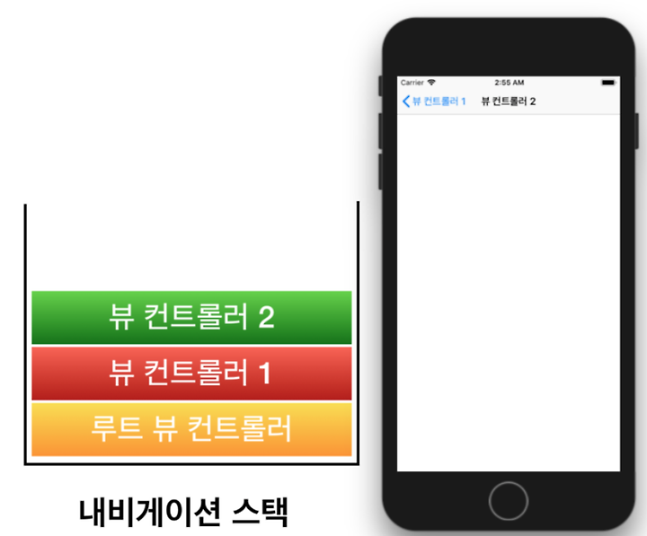

# 네비게이션
- 모바일 애플리케이션은 하나의 화면으로 구성되는 경우가 거의 없으며, 일반적으로 다양한 화면이 상황에 맞게 전환되면서 나타난다.
- 그렇기 때문에 내비게이션은 모바일 애플리케이션에서 가장 중요한 기능 중 하나라고 할 수 있다.
- 리액트 네이티브에서는 내비게이션 기능을 지원하지 않으므로 외부 라이브러리를 이용해야한다.
- 리액트 네이티브 네비게이션 라이브러리를 사용해 네비게이션을 적용하는 방법에 대해 알아보자

## 프로젝트 생성하기
```js
expo init react-native-navigation
npm install styled-components --froce
```

## 리액트 네비게이션
- 리액트 네비게이션은 라이브러리는 리액트 네이티브 애플리케이션의 네비게이션을 쉽고 간단하게 관리할 수 있도록 도와준다.
- 지원하는 네비게이션의 종류는 Stack, Tab, Drawer 네비게이션 세 종류이다.

### 네비게이션의 구조
- 리액트 네비게이션에는 NavigationContainer 컴포넌트, Navigator 컴포넌트, Screen 컴포넌트가 있다.

### `Screen 컴포넌트`
- 네비게이터(Navigator) 안에서 각각의 화면을 정의하는 데 사용되는 기본 단위다.
- Screen은 네비게이션 구조에서 이동할 수 있는 독립적인 화면을 의미하며, 각 Screen은 하나의 컴포넌트를 가리킨다.
#### 속성
- `name` : Screen 컴포넌트의 식별자 이름이다. 이 이름을 통해 다른 화면에서 해당 화면으로 네비게이션할 수 있다.
- `component` : Screen에 할당된 컴포넌트로, 이 속성에 지정된 컴포넌트가 화면에 렌더링된다.

#### 특징
- 화면으로 사용되는 컴포넌트에는 항상 navigation과 route가 props로 전달된다는 특징이 있다.
- 리액트 네이티브에서 특정 컴포넌트를 네비게이터(Stack.Navigator, Tab.Navigator, Drawer.Navigator 등)에 Screen으로 등록하면, 그 컴포넌트는 네비게이션에 의해 관리되는 "화면" 역할을 한다.
- 리액트 네비게이션은 이러한 "화면" 컴포넌트에 네비게이션 관련 기능을 자동으로 제공하기 위해 navigation과 route 객체를 props로 전달해준다. 
- 이 두 객체는 리액트 네비게이션에서 화면 간 전환 및 데이터 전달을 관리하는 데 필요한 핵심 도구들이다.

#### navigation과 route가 props로 자동 전달되는 이유
1. navigation 객체
    - navigation 객체는 화면 간의 이동을 제어할 수 있는 다양한 메서드(e.g., navigate, goBack, push 등)를 제공한다.
    - 화면이 다른 화면으로 전환할 때, 이 객체가 없으면 화면 전환 기능을 직접 구현해야 하므로 불편하다.
    - 리액트 네비게이션은 이러한 불편함을 해결하기 위해 navigation 객체를 화면 컴포넌트에 자동으로 전달한다.
2. route 객체
    - route 객체는 현재 화면으로 전달된 매개변수(params)와 관련된 정보를 포함한다.
    - 다른 화면에서 특정 데이터를 이 화면으로 전달했다면, 그 데이터는 route.params에 저장된다.
    - 네비게이션 시스템을 통해 전달된 모든 경로 정보와 매개변수에 쉽게 접근할 수 있도록 route 객체가 자동으로 제공된다.

### `Navigator컴포넌트`
- 화면을 관리하는 중간 관리자 역할로 네비게이션을 구성하며, 여러 개의 Screen컴포넌트를 자식 컴포넌트로 가지고 있다.

### `NavigationContainer컴포넌트`
- 네비게이션의 계층 구조와 상태를 관리하는 컨테이너 역할을 하며, 모든 네비게이션 구성 요소를 감싼 최상위 컴포넌트이다.

### 설정 우선 순위
- 리액트 네비게이션에서 설정할 수 있는 다양한 속성을 수정하는 방법은 Navigator 컴포넌트의 속성으로 수정하는 방법, Screen 컴포넌트의 속성으로 수정하는 방법, 화면으로 사용되는 컴포넌트의 props로 전달되는 navigation을 이용해 수정하는 방법과 같이 크게 세 가지로 나뉜다.
- 화면으로 사용되는 컴포넌트에서 설정하는 방법과 Screen 컴포넌트에서 설정하는 방법은 해당 화면에만 적용되지만, Navigator 컴포넌트에서 속성을 지정하는 방법을 사용하면 자식 컴포넌트로 존재하는 모든 컴포넌트에 적용된다는 특징이 있다.
- 이런 특징을 이용해서 모든 화면에 공통적으로 적용하고 싶은 속성인 경우 Navigator컴포넌트를 이용하고, 개별 화면에만 적용되는 속성인 경우 Screen컴포넌트 혹은 화면으로 사용되는 컴포넌트에서 설정하는 것이 좋다.
- 작은 범위의 설정일수록 우선순위가 높으므로 만약 Screen 컴포넌트와 화면으로 사용되는 컴포넌트에 동일한 옵션이 적용되었다면 화면 컴포넌트의 설정이 우선시 한다는 것을 기억해두자.

### 폴더 구조와 라이브러리
- 리액트 네비게이션 라이브러리를 사용하기 전에 지금까지처럼 폴더 구조를 만들어보자.
- 먼저 src폴더를 만들고 App 컴포넌트를 다음과 같이 작성한다.
```js
import React from 'react';
import styled from 'styled-components';

const Container = styled.View`
    flex : 1;
    background-color : #ffffff;
    justify-content : center;
    align-items ; center;
`

const App = () => {
  return (
    <Container>
        
    </Container>
  );
};

export default App;
```
- App 컴포넌트의 작성이 완료되면 루트 디렉터리에 있는 App.js파일을 다음과 같이 수정한다.
```js
import App from "./src/App";

export default App;
```

- 이번에는 src 폴더 밑에 화면으로 사용하는 컴포넌트를 관리할 screens 폴더와 작성되는 네비게이션 코드를 관리할 navigations 폴더를 생성
- 폴더 생성이 완료되면 리액트 네비게이션 실습을 위해 라이브러리를 설치하자.
```js
npm install --save @react-navigation/native --force
```
- 리액트 네비게이션은 각 기능별로 모듈이 분리되어 있어, 이후에도 사용하는 내비게이션의 종류에 따라 개별적으로 추가 라이브러리를 설치해야 한다.
- 이번에는 대부분의 내비게이션에서 반드시 필요한 종속성을 설치해보자.
```js
npx expo install react-native-gesture-handler react-native-reanimated react-native-screens react-native-safe-area-context @react-native-community/masked-view -- --force 
```

## 스택 네비게이션
- 가장 기본적인 네비게이션인 스택에 대해 알아보자.
- 먼저 명령어를 이용해 스택 네비게이션 활용에 필요한 라이브러리를 설치하자
```js
npm install @react-navigation/stack@6.4.1 --force`
```
- 스택 네비게이션은 일반적으로 가장 많이 사용되는 네비게이션으로, 현재 화면 위에 다른 화면을 쌓으면서 화면을 이동하는 것이 특징이다.
- 예를 들면 채팅 어플리케이션에서 채팅방에 입장하는 상황이나 여러 목록 중에서 특정 항목의 상세 화면으로 이동할 때 많이 사용한다.
- 스택 네비게이션은 화면위에 새로운 화면을 쌓으면서(push) 이동하기 때문에 이전 화면을 계속 유지한다.
- 이런 구조 때문에 가장 위에 있는 화면을 들어내면(pop)이전화면으로 돌아갈 수 있다는 특징이 있다.



### 화면 구성
- 스택 네비게이션을 이용해서 화면을 구성하고 이동시켜보자.

#### screens 폴더에 Home.js만들기 
- 스택 네비게이션의 화면으로 사용할 화면을 만든다.
```js
import React from 'react';
import { Button } from 'react-native';
import styled from 'styled-components';

const Container = styled.View`
  align-items: center;
`;
const StyledText = styled.Text`
  font-size: 30px;
  margin-bottom: 10px;
`;

const Home = ({ navigation }) => {
  return (
    <Container>
      <StyledText>Home</StyledText>
      <Button title="go to the list screen"/>
    </Container>
  );
};

export default Home;
```
- 첫 화면으로 사용할 Home 화면을 작성했다.
- 화면을 확인하기 위한 텍스트와 다음 화면인 List 화면으로 이동하기 위한 버튼 화면으로 구성했다.

#### screens폴더에 List.js 만들기
```js
import React from 'react';
import { Button } from 'react-native';
import styled from 'styled-components';

const Container = styled.View`
  flex: 1;
  justify-content: center;
  align-items: center;
`;
const StyledText = styled.Text`
  font-size: 30px;
  margin-bottom: 10px;
`;

const items = [
  { _id: 1, name: 'React Native' },
  { _id: 2, name: 'React Navigation' },
  { _id: 3, name: 'Hanbit' },
];

const List = () => {
  const _onPress = item => {};

  return (
    <Container>
      <StyledText>List</StyledText>
      {items.map(item => (
        <Button
          key={item._id}
          title={item.name}
          onPress={() => _onPress(item)}
        />
      ))}
    </Container>
  );
};

export default List;
```
- List 화면으로 사용될 컴포넌트를 작성했다.
- 화면에서 사용할 임시 목록을 만들고 항목 수 만큼 버튼을 생성하도록 만들었다.
- 각자의 임시 데이터를 만들면서 진행을 해보자.

#### screens 폴더에 Item.js만들기
- 목록의 상세 정보를 보여주는 컴포넌트 만들기
```js
import React, { useLayoutEffect } from 'react';
import styled from 'styled-components/native';
import { MaterialCommunityIcons } from '@expo/vector-icons';

const Container = styled.View`
  flex: 1;
  justify-content: center;
  align-items: center;
`;
const StyledText = styled.Text`
  font-size: 30px;
  margin-bottom: 10px;
`;

const Item = () => {
  return (
    <Container>
      <StyledText>Item</StyledText>
    </Container>
  );
};

export default Item;
```
- 이제 navigation 폴더 안에 Stack.js 파일을 생성하고 생성된 컴포넌트를 이용해 스택 네비게이션을 구성해보자.

```js
import React from "react";
import { createStackNavigator } from "@react-navigation/stack";
import Home from "../screens/Home";
import List from "../screens/List";
import Item from "../screens/Item";

const Stack = createStackNavigator();

const StackNavigation = () => {
    return(
        <Stack.Navigator>
            <Stack.Screen name="Home" component={Home} />
            <Stack.Screen name="List" component={List} />
            <Stack.Screen name="Item" component={Item} />
        </Stack.Navigator>
    )
}
export default StackNavigation;
```
- 가장 먼저 createStackNavigator함수를 이용해서 스택 네비게이션을 생성했다.
- 생성된 스택 네비게이션에는 화면을 구성하는 Screen 컴포넌트와 Screen 컴포넌트를 관리하는 Navigator 컴포넌트가 있다.
- Navigator 컴포넌트 안에 Screen 컴포넌트를 자식 컴포넌트로 작성하고, 앞에서 만든 컴포넌트를 Screen 컴포넌트의 component로 지정했다.
- name에는 화면의 이름을 작성하는데, Screen 컴포넌트의 name은 반드시 서로 다른 값을 가져야 한다는 점에서 유의해야 한다.
- 이제 App 컴포넌트에서 완성된 스택 네비게이션을 사용해보자.
```js
import React from 'react';
import { NavigationContainer } from '@react-navigation/native';
import StackNavigation from './navigations'

const App = () => {
  return (
    <NavigationContainer>
        <StackNavigation />
    </NavigationContainer>
  );
};

export default App;
```

- 스택 네비게이션으니 첫 번째 화면으로 나오는 화면은 Navigator 컴포넌트의 첫 번째 자식 Screen 컴포넌트이다.
- 만약 다음과 같이 순서를 바꾸면 List 화면이 첫 화면으로 나온다.
```js
<Stack.Navigator>
    <Stack.Screen name="List" component={List} />
    <Stack.Screen name="Home" component={Home} />
    <Stack.Screen name="Item" component={Item} />
</Stack.Navigator>
```
- 컴포넌트의 순서를 변경하는 방법 외에도 initialRouteName 속성을 이용해 첫 번째 화면을 지정하는 방법이 있다.
```js
<Stack.Navigator initialRouteName="List">
    <Stack.Screen name="Home" component={Home} />
    <Stack.Screen name="List" component={List} />
    <Stack.Screen name="Item" component={Item} />
</Stack.Navigator>
```

### 화면이동
- Screen 컴포넌트의 component로 지정된 컴포넌트는 화면으로 이용되고 navigation이 props로 전달된다.
- navigation에는 다양한 기능이 있는데 그중 navigate 함수는 원하는 화면으로 이동하는데 사용되는 함수이다.
- Home화면에서 props로 전달되는 navigation을 사용해서 버튼을 클릭하면 List화면으로 이동시켜보자.

```js
...
const Home = ({ navigation }) => {
  return (
    <Container>
      <StyledText>Home</StyledText>
      <Button title="go to the list screen" onPress={() => {navigation.navigate('List')}}/>
    </Container>
  );
};

export default Home;
```
- navigation에 있는 navigate함수를 이용해서 원하는 화면의 이름을 전달하면 해당 화면으로 이동한다.
- 단, 전달되는 화면의 이름은 Screen 컴포넌트의 name값 중 하나를 입력해야 한다.
- 만약 이동하는 화면이 이전 화면의 상세 화면이라면, 상세 화면은 어떤 내용을 렌더링해야 하는지 전달받아야 한다.
- navigate 함수를 이용할 때 두번 째 매개변수에 객체를 전달해서 이동하는 화면에 필요한 정보를 전달하는 기능이 있다.
- navigate함수를 이용하여 List 화면에서 목록을 클릭하면 해당 항목의 정보와 함께 Item 화면으로 이동하도록 수정해보자.

```js
...
const List = ({navigation}) => {
  const _onPress = item => {
    navigation.navigate('Item',{id:item._id, name: item.name})
  };
...
```
- Item 화면으로 이동하면서 화면의 id와 name을 함께 전달하도록 작성했다.
- 전달된 내용은 컴포넌트의 props로 전달되는 route의 params를 통해 확인할 수 있다.
- 이번에는 Item 화면에서 전달되는 params를 이용하여 화면에 id와 name을 출력해보자
```js
...
const Item = ({route}) => {
  return (
    <Container>
      <StyledText>Item</StyledText>
      <StyledText>ID : {route.params.id}</StyledText>
      <StyledText>Name : {route.params.name}</StyledText>
    </Container>
  );
};

export default Item;
```
### 화면 배경 수정하기
- 지금까지 사용한 화면은 배경색이 지정되지 않아 회색으로 나왔다.
- 이제 화면의 배경색을 지정해보자
- Home.js의 Container에 색을 지정한다.
```js
const Container = styled.View`
  align-items: center;
  background-color : #ffffff;
`;
```
- 네비게이션은 화면 전체를 차지하고 있지만 화면으로 사용되는 컴포넌트의 영역이 전체를 차지하고 있지 않아 아래는 회색으로 나오는 모습을 볼 수 있다.
- flex : 1을 설정하면 문제를 해결할 수 있다.
- 하지만 상황에 따라 화면 전체를 차지하지 못하는 경우도 있는데, 이런 상황에서는 리액트 네비게이션의 설정을 수정하여 해결할 수 있다.
- Stack.js의 Stack.Navigator수정하기
```js
<Stack.Navigator 
    initialRouteName="Home"
    screenOptions={{cardStyle:{backgroundColor:'#ffffff'}}}
>
    ...
</Stack.Navigator>
```
- cardStyle을 이용하면 스택 네비게이션의 화면 배경색을 수정할 수 있다.
- 화면의 배경색은 일반적으로 동일하게 사용하므로, 화면마다 설정하기보다 Navigator 컴포넌트의 screenOptions에 설정해서 화면 전체에 적용되도록 하는 것이 편하다.

### 헤더 수정하기
- 스택 네비게이션의 헤더는 뒤로 가기 버튼을 제공하거나 타이틀을 통해 현재 화면을 알려주는 역할을 한다.
- 리액트 네비게이션에서 제공하는 다양한 속성들을 이용해 스택 네비게이션의 헤더를 변경하는 방법에 대해 알아보자

#### 타이틀 수정하기
- 헤더의 타이틀은 Screen 컴포넌트의 name속성을 기본값으로 사용한다.
- 헤더의 타이틀을 변경하는 가장 쉬운 방법은 name을 원하는 값으로 수정하는 것이다.

```js
...
const StackNavigation = () => {
    return(
        <Stack.Navigator 
            initialRouteName="Home"
            screenOptions={{cardStyle:{backgroundColor:'#ffffff'}}}
        >
            <Stack.Screen name="Home" component={Home} />
            <Stack.Screen name="List" component={List} />
            <Stack.Screen name="Detail" component={Item} />
        </Stack.Navigator>
    )
}
export default StackNavigation;
```
- Item 화면을 나타내는 Screen 컴포넌트의 name 속성을 Detail로 변경했다.
- name의 값이 변경되었으므로 Item 화면으로 이동할 때 navigate 함수에 전달하는 첫 번째 파라미터 값도 변경되어야 한다.

```js
const List = ({navigation}) => {
const _onPress = item => {
  navigation.navigate('Detail',{id:item._id, name: item.name})
};
```
- name 속성을 변경하는 것은 간편하지만, name속성을 이용하는 곳을 찾아다니며 모두 수정해야 한다는 단점이 있다.
- name 속성을 변경했을 때의 단점을 피하면서 화면 타이틀을 변경하는 방법은 headerTitle속성을 이용하는 것이다.
- Stack.js의 코드 추가하기
```js
<Stack.Screen 
    name="List" 
    component={List}
    options={{headerTitle : 'List Screen'}} />
```
- List 화면의 타이틀을 List Screen으로 변경했다.
- 이렇게 개별 화면 설정을 수정하고 싶은 경우 Screen 컴포넌트의 options를 이용하면된다.
- 모든 화면에서 같은 타이틀이 나타나도록 수정하고 싶다면 Navigator 컴포넌트의 screenOptions 속성에 headerTitle을 지정하면 된다.

#### 스타일 수정하기
- `headerStyle` : 헤더의 배경색 수정
- `headerTitleStyle` : 헤더와 타이틀 컴포넌트의 스타일을 수정
- Stack.js의 Navigator 수정하기
```js
<Stack.Navigator 
    initialRouteName="Home"
    screenOptions={{
        cardStyle:{backgroundColor:'#ffffff'},
        headerStyle:{
            hegiht:110,
            backgroundColor:'#95a5a6',
            borderBottomWidth: 5,
            borderBottomColor : '#34495e',
        },
        headerTitleStyle : {color:'#ffffff', fontSize: 24},
    }}
>
```
- headerStyle을 이용해 헤더의 스타일을 변경하고, headerTitleStyle을 이용해 타이틀의 스타일을 변경했다.
- 안드로이드에서는 iOS와 달리 타이틀이 중앙으로 정렬되지 않은것을 볼 수 있다.
- 타이틀 정렬은 두 플랫폼에서 동일하게 하려면 headerTitleAlign 속성을 이용한다.
- headerTitleAlign에는 left와 center 두 가지 값 중 한 가지만 설정할 수 있고 iOS는 center,안드로이드는 left가 기본값으로 설정되어있다.
```js
<Stack.Navigator 
    initialRouteName="Home"
    screenOptions={{
        cardStyle:{backgroundColor:'#ffffff'},
        headerStyle:{
            hegiht:110,
            backgroundColor:'#95a5a6',
            borderBottomWidth: 5,
            borderBottomColor : '#34495e',
        },
        headerTitleStyle : {color:'#ffffff', fontSize: 24},
        headerTitleAlign: 'center',
    }}
>
```

#### 타이틀 컴포넌트 변경
- 헤더의 타이틀을 변경하기 위해 문자열을 저장했던 headerTitle속성에 컴포넌트를 반환하는 함수를 지정하면 타이틀 컴포넌트를 반환하는 컴포넌트로 변경할 수 있다.
- headerTitle에 함수가 설정되면 해당 함수의 파라미터로 style과 tintColor등이 포함된 객체가 전달된다.
- 그중 style은 headerTitleStyle에 설정된 값이고, tintColor는 headerTintColor에 지정된 값이 전달된다.
```js
import {MaterialCommunityIcons} from '@expo/vector-icons'

<Stack.Navigator 
    initialRouteName="Home"
    screenOptions={{
        cardStyle:{backgroundColor:'#ffffff'},
        headerStyle:{
            hegiht:110,
            backgroundColor:'#95a5a6',
            borderBottomWidth: 5,
            borderBottomColor : '#34495e',
        },
        headerTitleStyle : {color:'#ffffff', fontSize: 24},
        headerTitleAlign: 'center',
        headerTitle : ({style}) => (
            <MaterialCommunityIcons name="react" style={style} />
        ),
    }}
>
```