# 채팅프로그램 만들기
- 지금까지 공부한 내용을 바탕으로 간단한 채팅 어플리케이션을 만들어보자.

## 구현할 기능 
- 로그인/회원가입 : 이메일과 비밀번호를 이용한 로그인과 회원가입
- 프로필 : 나의 정보 확인 및 변경
- 채널 생성 : 채널 생성 기능
- 채널 목록 : 생성된 채널들의 목록 조회
- 채널 : 실시간으로 메시지를 송수신하는 공간

## 프로젝트 생성하기
```js
expo init react-native-simple-chat
```

## 네비게이션
- 채팅 어플리케이션은 크게 세 부분으로 나눌것이다.
- 로그인 등 인증하는 화면
- 채팅방의 목록 등을 확인할 수 있는 화면
- 메시지를 주고받는 화면
- 화면은 유기적으로 연결되어 있으며 화면 간 이동이 잦다.

### 라이브러리 설치

#### @react-navigation/native
- 앱에서 화면간 네비게이션을 관리해줄 수있는 라이브러리
```
npm install @react-navigation/native@6.1.18
```
#### 주요기능
- NavigationContainer 제공
- 네비게이션 상태 관리
  - 앱의 현재 위치나 화면 전환과 같은 네비게이션 상태를 관리한다.
  - 이를 통해 사용자가 특정 화면에서 나가더라도 다시 돌아왔을 때 동일한 상태를 유지할 수 있게 하며, 히스토리 기반으로 백스택을 관리할 수 있다.
- 네비게이터와의 통합
  -  Stack, Tab, Drawer와 같은 네비게이터와 결합해 네비게이션 구조를 형성할 수 있다.

#### 기능관련 라이브러리 다운로드
```
expo install react-native-gesture-handler react-native-reanimated react-native-screens react-native-safe-area-context @react-native-community/masked-view
```

#### react-native-gesture-handler 
- 더 향상된 제스처 처리를 가능하게 해주는 라이브러리다.
- 기본적으로 React Native는 터치 이벤트를 제공하지만, 제스처를 복잡하게 사용할 때는 성능이나 일관성에서 제한이 있을 수 있다.
- 이 라이브러리는 그러한 한계를 극복하고 부드럽고 효율적인 제스처 인식을 제공한다.

#### 주요 기능
1. 복잡한 제스처 지원
     - 기본 제스처뿐 아니라 스와이프, 드래그, 핀치 줌 등 고급 제스처를 쉽게 인식하고 사용할 수 있다.
     - 여러 제스처를 동시에 인식하거나, 특정 제스처가 끝난 후 다른 제스처를 인식하는 방식으로 제스처 간의 우선순위와 조합을 설정할 수 있다.
2. 성능 개선
     - 네이티브에서 제스처를 처리하여 JS와 네이티브 간의 통신을 줄이기 때문에, React Native의 기본 터치 이벤트 시스템보다 부드럽고 빠르게 작동한다.
     - 네이티브에서 직접 제스처를 처리하므로, 스크롤 리스트나 드래그 앤 드롭과 같은 복잡한 UI에서도 성능이 뛰어나다.
3. react-navigation과의 통합
     - react-navigation과 완벽하게 호환되어 화면 전환, Drawer 네비게이션, 스택 네비게이션 등의 제스처 기반 네비게이션 동작을 구현하는 데 적합하다.
     - DrawerNavigation이나 StackNavigation에서 화면 전환을 제스처로 구현하는 경우, 이 라이브러리가 있어야 원활한 사용이 가능하다.

#### eact-native-screens
- 화면 전환 성능을 최적화하기 위한 라이브러리다. 
- 이 라이브러리는 iOS와 Android의 네이티브 화면 관리 기능을 활용하여 화면 간 전환을 더 부드럽게 하고, 메모리 사용을 줄여 성능을 향상시킨다. 
- 특히 `react-navigation`과 함께 사용할 때 효과적이다.

#### 주요 기능
1. **네이티브 스크린 관리**
   - `react-native-screens`는 네이티브 화면 관리 기능을 사용해 각 화면의 라이프사이클을 더 효과적으로 관리한다.
   - 각 화면이 메모리에 완전히 남아있지 않고, 비활성화되거나 숨겨진 화면은 메모리에서 제거하여 앱의 메모리 사용량을 줄인다.

2. **react-navigation과의 통합**
   - `react-native-screens`는 `react-navigation`의 Stack Navigator와 함께 사용할 때 성능 향상 효과가 크다.
   - Stack Navigator의 화면 전환이 네이티브 방식으로 처리되어, 화면 간 전환이 부드럽고 빠르게 동작한다.

3. **메모리 사용 최적화**
   - `react-native-screens`는 비활성 상태의 화면을 메모리에서 제거하거나, 네이티브 레벨에서 관리하여 전체적인 메모리 사용량을 줄인다.
   - 이를 통해 더 복잡한 네비게이션 구조에서도 성능 저하 없이 화면을 전환할 수 있다.

#### @react-native-community/masked-view
- 특정 영역을 가리거나 마스크 효과를 줄 때 사용하는 라이브러리다. 
- 이 라이브러리는 주로 화면 전환 애니메이션에서 화면이 겹쳐 보이지 않도록 마스크 처리를 하거나 특정 부분만 보이게 할 때 활용된다.

#### 주요 기능
1. **화면 마스킹**
   - 화면의 특정 영역만 보이도록 제한하여, 원하는 부분에만 마스크 효과를 줄 수 있다.
   - 예를 들어, 둥근 모서리를 가진 이미지나 특정 영역만 표시되는 UI를 구현할 때 유용하다.

2. **react-navigation과의 통합**
   - `@react-native-community/masked-view`는 `react-navigation`의 Stack Navigator와 함께 자주 사용된다.
   - Stack Navigator의 화면 전환 애니메이션을 사용할 때, 이전 화면이 겹쳐 보이지 않도록 마스킹 효과를 적용하여 깔끔한 화면 전환을 구현할 수 있다.

### 바텀탭바 라이브러리 설치
```
npm install @react-navigation/bottom-tabs@6.5.20
```

### styled components와 props-types 설치
```js
npm install styled-components prop-types
```

<p>$\normalsize{\color{#DD6565}※ styled-components를\ 설치할\ 때\ 주의할 점}$</p>
<p>$\normalsize{\color{#DD6565} react와\ react-dom의\ 버전이\ 맞지\ 않아\ 에러가\ 날\ 수\ 있다.}$</p>
<p>$\normalsize{\color{#6580DD} npm install react-dom@18.3.1을}$ $\normalsize{\color{#DD6565}\ 해서\ 버전을\ 맞추고\ 다시\ 설치해보자}$</p>


#### prop-types
- `prop-types`는 React 컴포넌트에서 전달받는 `props`의 타입을 검증해주는 라이브러리다. 
- 컴포넌트에 전달되는 `props`의 타입과 값이 예상한 형태인지 확인할 수 있으며, 개발 중 잘못된 `props`가 전달될 경우 경고 메시지를 출력해 디버깅에 도움을 준다.

#### 주요기능
1. **타입 검증**
   - `prop-types`를 사용하여 `props`의 데이터 타입을 미리 정의할 수 있다. 
   - 잘못된 타입의 `props`가 전달되면 콘솔에 경고 메시지가 출력된다.
   
2. **기본값 설정**
   - 컴포넌트에 `defaultProps`를 설정해 `props`가 전달되지 않았을 때 기본값을 사용할 수 있다.

3. **유연한 타입 설정**
   - 다양한 데이터 타입을 검증할 수 있으며, 특정 조건을 만족하는 타입도 정의할 수 있다. `number`, `string`, `array`, `object` 등 다양한 타입 검증을 지원한다.

### 추가적인 라이브러리
- 위의 라이브러리 외에도 프로젝트를 진행하면서 다음과 같은 라이브러리를 사용할 예정이다.
- 추가적인 라이브러리는 사용되는 곳을 명확하게 알기 위해 필요한 상황이 오면 설치하고 사용하자.
- expo-image-picker
  - 기기의 사진이나 영상을 가져올 수 있도록 시스템 UI에 접근할 수 있는 기능을 제공한다.
  - 이번 프로젝트에서 기기의 사진을 선택해 사용자의 사진을 설정 혹은 변경하기 위해 사용할 예정이다.
- moment
  - 시간을 다양한 형태로 변경하는 등 시간과 관련된 많은 기능을 제공하는 라이브러리로, 날짜와 관련된 라이브러리 중 가장 널리 알려져 있고 많이 사용되고 있다.
  - 여기서는 타밍스탬프를 사용자가 보기 편한 형태로 변경하기 위해 사용할 예정이다.
- react-native-keyboard-aware-scroll-view
  - 키보드가 화면을 가리면서 생기는 불편한 점을 해결하기 위해 사용되는 라이브러리이다.
- react-native-gifted-chat
  - 메시지를 주고받는 채팅 화면을 쉽게 구현할 수 있도록 돕는 라이브러리이다.

### 프로젝트 파일 구조
- 모든 소스 파일을 관리할 src폴더를 생성한 후 theme.js파일을 생성하고 다음과 같이 작성하자.
```js
const colors = {
    white : '#ffffff',
    black : '#000000',
    grey_0 : '#d5d5d5',
    grey_1 : '#a6a6a6',
    red : '#e84118',
    blue : '#3679fe',
};

export const theme = {
    background : colors.white,
    text : colors.black,
}
```
- 공통으로 사용할 색을 적의하고 배경색과 글자의 색을 미리 정했다.
- 이번에는 최상위 컴포넌트가 사용될 App 컴포넌트를 src폴더 안에 작성해보자.
```js
import React from 'react'
import {StatusBar} from 'react-native'
import {ThemeProvider} from 'styled-components'
import {theme} from './theme'

const App = () => {
    return(
        <ThemeProvider theme={theme}>
            <StatusBar barStyle='dark-content' />
        </ThemeProvider>
    )
}

export default App;
```
- 스타일드 컴포넌트의 ThemeProvider 컴포넌트를 사용해 스타일드 컴포넌트에서 정의된 theme을 사용할 수 있도록 작성했다.
- 이번에는 루트 디렉터리에 있는 App.js파일을 수정해서 우리가 만든 App 컴포넌트가 메인 파일이 되도록 수정해보자.
```js
import App from "./src/App";

export default App;
```

#### 그 외 폴더
- src폴더 밑에 각 역할에 맞는 파일을 관리할 폴더를 다음과 같이 생성하자
- components : 컴포넌트 파일 관리
- contexts : Context API 파일 관리
- navigations : 네비게이션 파일 관리
- screens : 화면 파일 관리
- utils : 프로젝트에서 이용할 기타 기능 관리

# 파이어베이스
- 구글에서 제공하는 **클라우드 기반 개발 플랫폼**으로, 서버리스 애플리케이션을 쉽게 개발하고 배포할 수 있도록 다양한 백엔드 서비스를 제공한다. 
- 주로 모바일 앱과 웹 애플리케이션 개발에 사용되며, 실시간 데이터베이스, 인증, 클라우드 저장소, 푸시 알림 등의 기능을 손쉽게 구현할 수 있다.
- 파이어베이스가 제공하는 기능을 이용하면 대부분의 서비스에서 필요한 서버와 데이터베이스를 직접 구축하지 않아도 개발이 가능하다는 장점이 있다.

## 주요 기능과 서비스
1. **Firebase Authentication**
   - 다양한 인증 방식을 지원하여 사용자의 로그인과 회원가입을 간편하게 구현할 수 있다.
   - 이메일/비밀번호, 전화번호, 소셜 로그인(Google, Facebook, Twitter 등), 익명 인증 등을 제공한다.

2. **Firebase Realtime Database**
   - 클라우드 기반의 NoSQL 데이터베이스로, 데이터가 실시간으로 동기화된다.
   - 사용자가 데이터베이스의 업데이트를 즉시 받을 수 있어, 실시간 채팅, 라이브 업데이트 기능 등을 구현할 때 유용하다.

3. **Cloud Firestore**
   - 확장성과 유연성을 갖춘 NoSQL 문서형 데이터베이스로, Realtime Database와 유사하지만 더 강력하고 복잡한 쿼리를 지원한다.
   - 서버리스 아키텍처로, 데이터베이스를 서버에 배포하지 않고도 대규모 데이터베이스를 관리할 수 있다.

4. **Firebase Storage**
   - 이미지, 동영상, 파일 등을 저장하고 관리할 수 있는 클라우드 스토리지 서비스다.
   - 대용량 파일을 안전하게 저장하고, 업로드 및 다운로드 기능을 손쉽게 구현할 수 있다.

5. **Firebase Cloud Messaging (FCM)**
   - 푸시 알림을 전송할 수 있는 무료 메시징 서비스다.
   - 기기 간의 푸시 알림이나 주제별 메시지를 손쉽게 전송할 수 있어, 사용자에게 실시간 알림을 보낼 때 유용하다.

6. **Firebase Hosting**
   - 정적 웹사이트나 단일 페이지 애플리케이션(SPA)을 위한 빠르고 안전한 호스팅 서비스다.
   - Firebase CLI를 통해 빠르게 배포할 수 있으며, SSL 인증서가 자동으로 적용되어 안전한 HTTPS 통신을 제공한다.

7. **Firebase Analytics**
   - 앱 사용자 행동을 분석하여 사용자 인터랙션에 대한 인사이트를 제공하는 분석 도구다.
   - Google Analytics 기반으로, 실시간 사용자 정보, 사용자 속성, 이벤트 추적 등을 지원한다.

8. **Firebase Cloud Functions**
   - 서버리스 환경에서 백엔드 코드를 실행할 수 있는 기능이다.
   - 이벤트 기반으로 트리거되는 함수로, 데이터베이스 변경, 인증, FCM 등을 활용하여 백엔드 로직을 처리할 수 있다.

## 파이어베이스 사용하기
- 파이어베이스를 이용하려면 파이어베이스 콘솔에서 프로젝트를 생성해야 한다.
https://console.firebase.google.com/


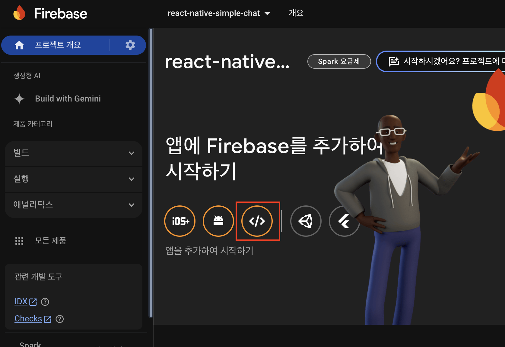

- 앱을 추가하는 과정에서 입력해야 하는 앱의 닉네임은 편의상 지정하는 내부용 식별자이므로 여러분이 지정하고 싶은 이름을 입력하면 된다.(simplechat)

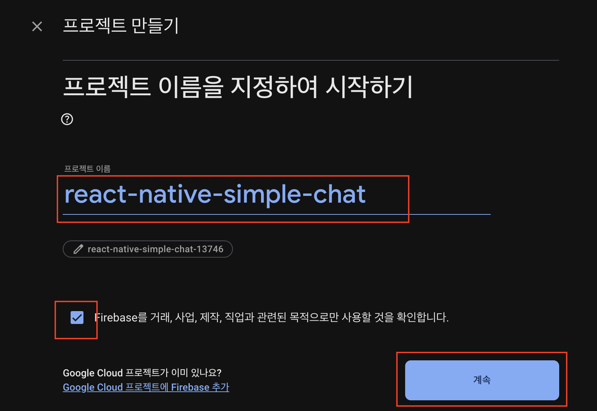

- 파이어베이스를 사용하기 위한 설정갑들을 확인할 수 있다.
- 이 값들은 외부에 노출되면 안되는 중요한 값들이므로 잘 관리해야 한다.
- 이제 프로젝트의 루트 디렉터리에 firebase.json 파일을 생성한 후 이 코드를 다음과 같은 형태로 복사하고 .gitignore파일에 firebase.json을 추가해주자.
```json
{
  "apiKey": "...",
  "authDomain": "...",
  "projectId": "...",
  "storageBucket": "...",
  "messagingSenderId": "...",
  "appId": "...",
  "measurementId": "..."
}
```
- .gitignore에 추가하기
```
...
# firebase
firebase.json
```
- 이제 프로젝트에서 파이어베이스를 사용하기위한 준비가 완료되었다.
- 채팅 어플리케이션을 만들기 위해 알아야 할 인증, 데이터베이스, 스토리지 기능에 대해서 알아보자.

### 인증
- 파이어베이스 인증 기능에서는 다양한 인증 방법을 제공한다.
- 우리는 이메일과 비밀번호를 이용하여 인증할 수 있는 기능을 만들 예정이므로 "이메일/비밀번호"부분만 활성화 하고 진행한다.

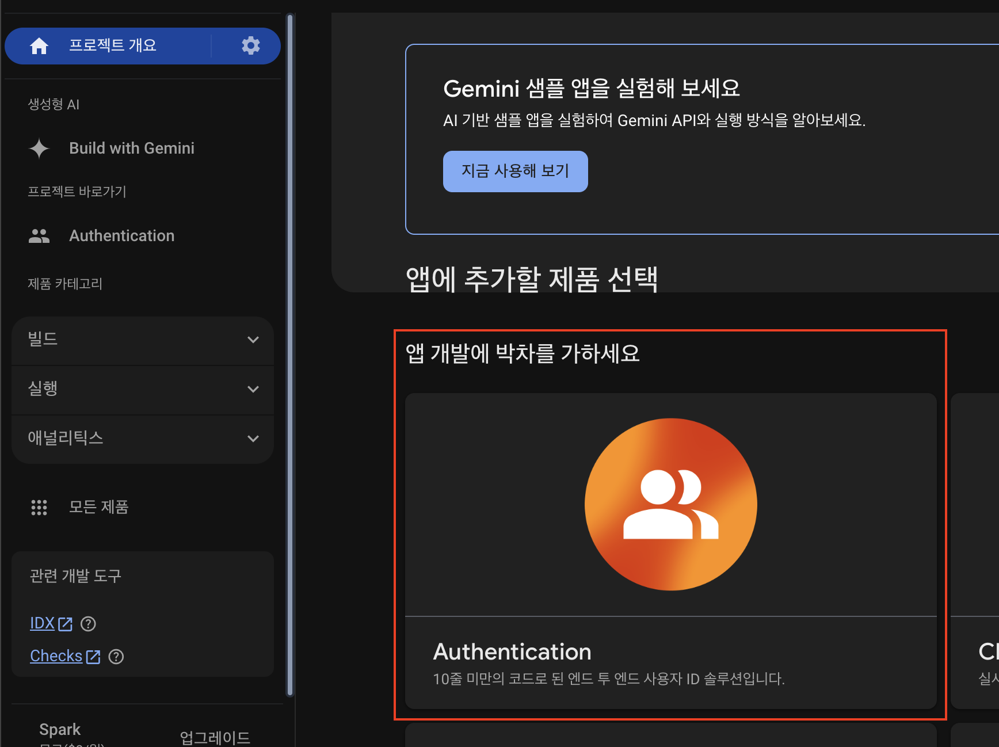

- 로그인 방법 설정 버튼을 누른다.
- 이메일/비밀번호 버튼을 누른다.

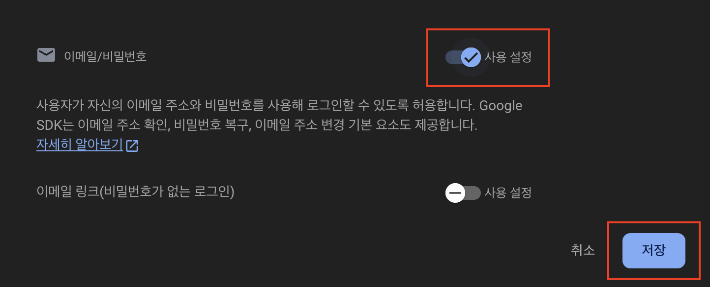

- 토글을 활성화하고 저장버튼을 누른다.

### 데이터베이스
- 생성되는 채널과 각 채널에서 발생하는 메시지를, 파이어베이스의 데이터베이스를 이용하여 관리한다.
- 데이터베이스의 경우 파이어스토어와 실시간 데이터베이스 두 가지 종류를 제공하는데, 우리는 파이어스토어를 이용할 것이다.
- 데이터베이스를 사용하려면 데이터베이스 메뉴에서 데이터베이스 만들기를 진행해야 한다.
- 데이터베이스 만들기의 첫 번째 단계인 보안 규칙은 뒤에서 조금 더 다루고, 두번째 단계인 위치를 선택하는 화면에서는 여러분이 서비스하는 지역과 가장 가까운 지역을 선택하는 것이 좋다.

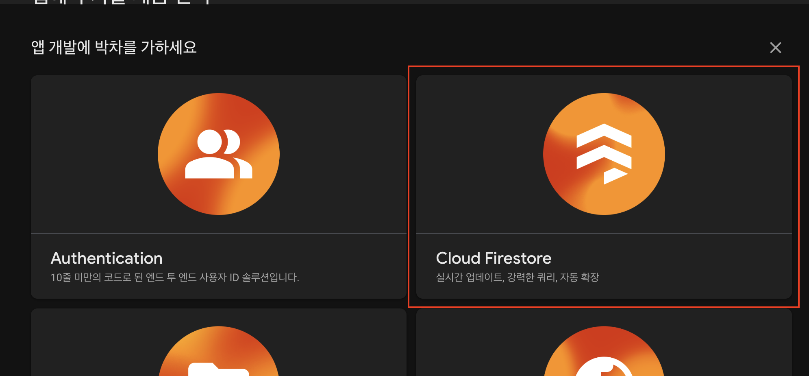

- 지역만 asia-northeast3(서울)을 선택하고 다른것은 건드리지말고 넘어갑니다.

### 스토리지
- 서버 코드 없이 사용자의 사진, 동영상 등을 저장할 수 있는 기능을 쉽게 개발할 수 있도록 기능을 제공한다.
- 여기서는 스토리지를 이용해 채팅 어플리케이션에 가입한 사용자의 사진을 저장하고 가져오는 기능을 만들어볼 것이다.
- 2024년 부터 블레이즈 요금제로 바꿔야 스토리지를 사용가능하다.
- 무료 사용량이 있고 그 이후에 과금이 된다.
- 모든 위치에서 서울로 바꾸자

### 라이브러리 설치
- 리액트 네이티브에서 파이어베이스를 사용하기 위해 라이브러리를 설치하자
```
npm install firebase --legacy-peer-deps
```
- 라이브러리 설치가 완료되면 utils폴더 아래에 firebase.js파일을 생성하고 다음과 같이 작성한다.
```js
import { initializeApp } from 'firebase/app';
import config from '../../firebase.json'

const app = firebase.initializeApp(config);
```

## 앱 아이콘과 로딩화면
- 프로젝트의 기능과 화면 개발에 앞서 앱의 아이콘과 로딩 화면을 먼저 변경해보자.
- assets 폴더에 아이콘으로 사용할 1024x1024크기의 이미지를 icon.png로, 로딩화면에 사용할 1242x2436크기의 이미지를 splash.png파일로 교체해 넣는다.
- 그리고 src폴더에 App.js를 수정한다.

### expo-splash-screen
- expo-app-loading패키지는 expo sdk 46부터 더이상 사용되지 않으며, expo-splash-screen을 사용하도록 권장된다.
### 설치
```js
npm install expo-splash-screen
```

```js
import React, { useState, useEffect } from 'react';
import { StatusBar, Image } from 'react-native';
import { Asset } from 'expo-asset';
import * as Font from 'expo-font';
import * as SplashScreen from 'expo-splash-screen'; // expo-splash-screen을 불러옴
import { ThemeProvider } from 'styled-components/native';
import { theme } from './theme';

// 스플래시 화면이 자동으로 숨겨지지 않도록 설정하여 초기화 작업이 완료될 때까지 유지함
SplashScreen.preventAutoHideAsync();

const cacheImages = images => {
    // 이미지 캐싱 함수: 문자열로 전달된 URL 이미지와 로컬 파일 이미지에 따라 각각 적절한 캐싱 방식으로 처리
    return images.map(image => {
        if (typeof image === 'string') {
            return Image.prefetch(image); // URL로 제공된 이미지의 경우, Image.prefetch로 캐싱
        } else {
            return Asset.fromModule(image).downloadAsync(); // 로컬 파일의 경우, expo-asset에서 제공하는 다운로드 방식으로 캐싱
        }
    });
};
```
- `prefetch()`는 원격 URL의 이미지를 캐싱하기 위해 사용된다. 주로 웹에서 이미지를 가져올 때 사용하며, 이미지가 앱 내에서 사용되기 전에 미리 로드해두어 로딩 속도를 높인다.
- `fromModule()`는 로컬 파일을 Asset 모듈로 가져와 관리한다. 주로 require()로 가져온 로컬 파일을 expo-asset의 Asset 객체로 변환할 때 사용된다.
- `downloadAsync()`는 로컬 리소스(이미지, 동영상 등)를 미리 캐싱하는 기능을 제공한다. 이 함수는 Asset 객체에서 사용할 수 있으며, 로컬 파일을 캐싱하고 디바이스에 다운로드해 빠르게 접근할 수 있게 한다.

```js
const cacheFonts = fonts => {
    // 폰트 캐싱 함수: 폰트 배열을 받아 각 폰트를 로드
    return fonts.map(font => Font.loadAsync(font));
};

const App = () => {
    const [isReady, setIsReady] = useState(false); // 초기화 여부를 추적하는 상태 변수

    useEffect(() => {
        // useEffect에서 비동기 함수 호출하여 리소스를 로드
        const prepareResources = async () => {
            try {
                await _loadAssets(); // 리소스를 로드하는 비동기 함수 호출
            } catch (error) {
                console.warn(error); // 오류 발생 시 경고 메시지 출력
            } finally {
                setIsReady(true); // 로딩이 완료되면 isReady를 true로 설정
                await SplashScreen.hideAsync(); // 스플래시 화면 숨김
            }
        };

        prepareResources(); // 준비 함수 호출
    }, []); // 빈 의존성 배열을 전달하여 컴포넌트가 마운트될 때 한 번만 실행

    const _loadAssets = async () => {
        // 이미지와 폰트를 캐싱하여 리소스를 로드
        const imageAssets = cacheImages([require('../assets/splash.png')]); // 로컬 스플래시 이미지 캐싱
        const fontAssets = cacheFonts([]); // 추가적인 폰트가 있다면 이 배열에 추가 가능

        await Promise.all([...imageAssets, ...fontAssets]); // 모든 비동기 작업이 완료될 때까지 기다림
    };
```
#### require()
- 로컬 파일 리소스(이미지, 동영상, 사운드 파일 등)를 가져오는 데 사용된다. 
- React Native에서는 앱 내부의 파일 경로나 네트워크에서 동적으로 가져오는 파일을 사용하기 어렵기 때문에, 정적인 파일을 불러오는 방식으로 require()가 자주 사용된다.

#### 사용방식
1. 정적 파일 경로 요구
    - React Native에서 require()는 정적 경로로 파일을 가져와야 한다. 즉, 경로가 런타임에서 동적으로 결정될 수 없다.
    - ```const image = require('./assets/icon.png');```


```js
    if (!isReady) {
        return null; // 로딩이 완료되지 않은 경우 화면을 빈 상태로 유지
    }

    return (
        // 로딩 완료 시 앱의 실제 UI를 렌더링
        <ThemeProvider theme={theme}>
            <StatusBar barStyle="dark-content" /> {/* 상태 바 스타일 설정 */}
        </ThemeProvider>
    );
};

export default App;
```
- 앞으로 프로젝트에서 사용할 이미지와 폰트를 미리 불러와서 사용할 수 있도록 cacheImages와 cacheFonts함수를 작성하고 이를 이용해 _loadAssets함수를 구성했다.
- 이미지나 폰트를 미리 불러오면 애플리케이션을 사용하는 환경에 따라 이미지나 폰트가 느리게 적용되는 문제를 개선할 수 있다.
- 어플리케이션은 미리 불러와야 하는 항목들을 모두 불러오고 완료되었을 때 isReady상태를 변경해서 렌더링되도록한다.

## 인증 화면
- 파이어베이스의 인증 기능을 이용해서 로그인 화면과 회원가입 화면을 만들어보자.
- 인증을 위해 이메일과 비밀번호가 필요하므로 로그인 및 회원가입 화면에서는 이메일과 비밀번호를 필수로 입력받고, 회원가입 시 사용자가 서비스에서 사용할 이름과 프로필 사진을 받도록 화면을 구성하도록 하자.

### Stack네비게이션 설치
```js
npm install @react-navigation/stack@6.4.1
```

### 네비게이션
- 먼저 로그인 화면과 회원가입 화면으로 사용할 컴포넌트를 screens 폴더 밑에 만든다.

### Login.js
```js
import React from 'react';
import styled from 'styled-components';
import { Text,Button } from 'react-native';

const Container = styled.View`
  flex: 1;
  justify-content: center;
  align-items: center;
  background-color: ${({ theme }) => theme.background};
`;

const Login = ({ navigation }) => {
    return (
        <Container>
          <Text style={{fontSize: 30}}>Login Screen</Text>
          <Button title="Signup" onPress={() => navigation.navigate('Signup')}/>
        </Container>
    );
};
  
export default Login;
```
- 회원가입 화면으로 이동할 수 있는 버튼이 있는 간단한 로그인 화면을 만들었다.
- 이번에는 회원가입 화면을 만들어보자.

### Signup.js
```js
import React from 'react';
import styled from 'styled-components';
import { Text } from 'react-native';

const Container = styled.View`
  flex: 1;
  justify-content: center;
  align-items: center;
  background-color: ${({ theme }) => theme.background};
`;

const Signup = () => {
  return (
      <Container>
        <Text style={{fontSize : 30}}>Signup Screen</Text>
      </Container>
    
  );
};

export default Signup;
```
- 회원가입 화면도 로그인 화면과 마찬가지로 화면을 확인할 수 있는 텍스트가 있는 간단한 화면으로 구성했다.
- 두 화면이 완성되면 screens폴더에 index.js파일을 생성하고 다음과 같이 작성한다.
```js
import Login from "./Login";
import Signup from "./Signup";

export {Login,Signup}
```
- 이제 화면 준비가 완료되었으므로 네비게이션 파일을 작성해보자.
- 네비게이션 파일을 관리하는 navigations폴더에 스택 네비게이션을 이용해서 다음과 같이 작성하자.

### AuthStack.js
```js
import React, { useContext } from 'react';
import { ThemeContext } from 'styled-components/native';
import { createStackNavigator } from '@react-navigation/stack';
import { Login, Signup } from '../screens';

const Stack = createStackNavigator();

const AuthStack = () => {
  const theme = useContext(ThemeContext);
  return (
    <Stack.Navigator
      initialRouteName="Login"
      screenOptions={{
        headerTitleAlign: 'center',
        cardStyle: { backgroundColor: theme.background },
      }}
    >
      <Stack.Screen
        name="Login"
        component={Login}
      />
      <Stack.Screen
        name="Signup"
        component={Signup}
      />
    </Stack.Navigator>
  );
};

export default AuthStack;
```
- 첫 화면을 로그인 화면으로 하고 로그인 화면과 회원가입 화면을 가진 네비게이션을 만들었다.
- 스타일드 컴포넌트에서 제공하는 ThemeContext와 useContext Hook 함수를 이용해 theme을 받아오고, 네비게이션 화면의 배경색을 theme에 정의된 배경색으로 설정했다.
- 마지막으로 헤더의 타이틀 위치를 안드로이드와 iOS에서 동일한 위치에 렌더링하기 위해 headerTitleAlign의 값을 center로 설정했다.
- AuthStack 네비게이션 작성이 완료되면 navigation 폴더 안에 index.js파일을 생성하고 다음과 같이 작성한다.
```js
import React from "react";
import { NavigationContainer } from "@react-navigation/native";
import AuthStack from "./AuthStack";

const Navigation = () => {
    return(
        <NavigationContainer>
            <AuthStack />
        </NavigationContainer>
    )
}

export default Navigation;
```
- NavigationContainer 컴포넌트를 사용하고 자식 컴포넌트로 AuthStack 네비게이션을 사용했다.
- 이제 작성된 네비게이션이 렌더링되도록 App컴포넌트를 다음과 같이 수정하자.
```js
...
import Navigation from './navigations'

...

return (
    <ThemeProvider theme={theme}>
        <StatusBar barStyle="dark-content" />
        <Navigation />
    </ThemeProvider>
);


```

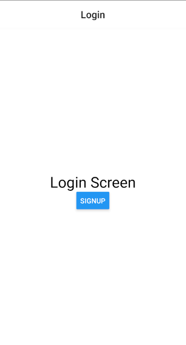 


### 로그인 화면
- 로그인 화면에서 사용자의 이메일과 비밀번호를 입력받을 수 있도록 화면을 만들어보자.
- 로그인 화면에서는 로고를 렌더링하는 컴포넌트와 사용자의 입력을 받는 컴포넌트, 그리고 클릭과 그에 따른 이벤트가 발생하는 컴포넌트가 필요하다.

#### Image 컴포넌트
- 먼저 url을 전달받아 원격에 있는 이미지를 렌더링하는 Image컴포넌트를 만들어보자.
- 로그인 화면에서는 Image 컴포넌트를 이용해 어플리케이션의 로고를 렌더링한다.
- 우선 Image 컴포넌트의 배경색으로 사용할 값을 theme.js에 정의한다.

```js
export const theme = {
    background : colors.white,
    text : colors.black,
    ImageBackground: colors.grey_0,
}
```
- Image 컴포넌트를 작성할 Image.js파일을 components폴더 안에 만든다.
```js
import React from 'react';
import styled from 'styled-components/native';
import PropTypes from 'prop-types';

const Container = styled.View`
  align-self: center;
  margin-bottom: 30px;
`;
const StyledImage = styled.Image`
  background-color: ${({ theme }) => theme.imageBackground};
  width: 100px;
  height: 100px;
`;

const Image = ({ url, imageStyle}) => {
    return (
      <Container>
        <StyledImage source={{uri:url }} style={imageStyle} />      
      </Container>
    );
  };
  
  Image.propTypes = {
    uri: PropTypes.string,
    imageStyle: PropTypes.object,
  };
  
  export default Image;
```
- props로 전달되는 url을 렌더링하고 imageStyle을 전달받아 컴포넌트의 스타일을 수정할 수 있는 Image 컴포넌트를 만들었다.
- Image 컴포넌트 작성이 완료되면 components 폴더에 index.js파일을 생성하고 다음과 같이 작성한다.

```js
import Image from "./Image";

export {Image};
```
- 이제 Image 컴포넌트를 사용해서 Login 화면을 수정해보자.

```js
...
import { Image } from '../components';

...
<Container>
    <Image />
    <Button title="Signup" onPress={() => navigation.navigate('Signup')}/>
</Container>
```

#### 로고 적용하기
- 이번에는 어플리케이션의 로고를 파이어베이스 스토리지에 업로드하고 로그인 화면에서 사용하도록 만들어보자.
- 앞에서 작성한 Image 컴포넌트의 크기인 100x100보다 큰 사이즈 로고 이미지를 준비하고, 파일을 파이어베이스의 스토리지에 업로드한다.

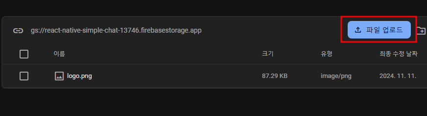

- 스토리지에 파일을 업로드하고 파일 정보에서 이름을 클릭하면 해당 파일의 url을 얻을 수 있다.

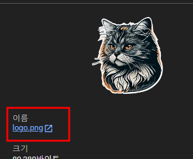

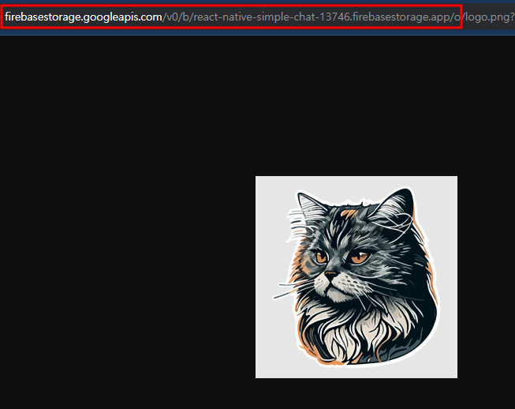

- 스토리지에 업로드된 이미지의 url을 관리하기 위해 utils폴더에 images.js파일을 생성하고 앞에서 얻은 url을 이용해 다음과 같이 생성한다.
- 복사된 주소의 쿼리 스트링에서 token 부분을 제외하고 사용해야 한다.
- 쿼리 스트링에 있는 token은 현재 로그인된 사용자에게 발급된 값이다.
- 실제 사용할 때는 token이 변경될 뿐만 아니라, 로그인 화면에서는 아직 로그인 전이므로 token이 없는 상태로 접근이 가능해야 한다.

```js
const prefix = 'url경로'

export const images = {
    logo : `${prefix}/logo.png?alt=media`;
}
```

- 이제 로고 이미지도 로딩 과정에서 미리 불러오도록 App컴포넌트를 수정하자.
```js
...
import { images } from './utils/images';
...
const _loadAssets = async () => {
    const imageAssets = cacheImages([
        require('../assets/splash.png'),
        ...Object.values(images),
    ]);
    const fontAssets = cacheFonts([]);

    await Promise.all([...imageAssets, ...fontAssets]);
};
```
- 마지막으로 로그인 화면에서 준비된 로고 이미지를 불러오자
```js
...
import { images } from '../utils/images';

...
<Container>
    <Image url={images.logo}/>
    <Button title="Signup" onPress={() => navigation.navigate('Signup')}/>
</Container>
```
- 결과를 보면 업로드한 이미지가 나타나지 않고 다음과 같은 경고 메시지가 뜬다.
```
[Error: Unexpected HTTP code Response{protocol=h2, code=403, message=, url=https://firebasestorage.googleapis.com/v0/b/react-native-simple-chat-13746.firebasestorage.app/o/logo.png?alt=media}]
```
- 이 문제는 스토리지의 파일 접근 권한 문제로, 보안 규칙을 수정해서 해결해야 한다.
- 스토리지 메뉴의 "Rules"탭에서 로그인하지 않아도 파일을 읽을 수 있도록 다음과 같이 규칙을 수정해주자.

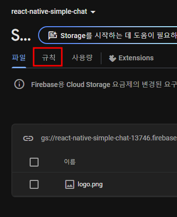

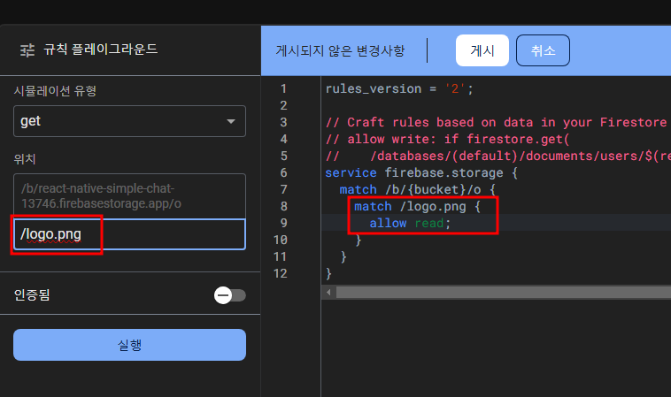

- 규칙을 적용시키고 화면을 다시 확인하면 스토리지에 업로드한 로고가 잘 나타나는 것을 볼 수 있다.
- 마지막으로 로그인 화면에서 Image 컴포넌트에 imageStyle을 전달해 렌더링되는 로고의 모습을 조금만 변경하자.

```js
const Login = ({ navigation }) => {
    
    return (
        <Container>
          <Image url={images.logo} style={{borderRadius : 8}}/>
          <Button title="Signup" onPress={() => navigation.navigate('Signup')}/>
        </Container>

    );
  };

```

#### Input 컴포넌트
- 아이디와 비밀번호를 입력받을 수 있도록 Input 컴포넌트를 만들어보자.
- theme.js에 먼저 Input컴포넌트에서 placeholder등에 사용할 색을 정의하자.
```js
export const theme = {
    ...
    label : colors.grey_1,
    inputPlaceholder : colors.grey_1,
    inputBorder : colors.grey_1,
}
```
- 동일한 색을 사용했지만 이후 유지보수를 위해 적용되는 부분을 명확하게 알 수 있도록 정의했다.
- 이제 components 폴더에 Input.js파일을 생성하고 Input 컴포넌트를 만들자.
```js
import React, { useState, forwardRef } from 'react';
import styled from 'styled-components/native';
import PropTypes from 'prop-types';

const Container = styled.View`
  flex-direction: column;
  width: 100%;
  margin: 10px 0;
`;
const Label = styled.Text`
  font-size: 14px;
  font-weight: 600;
  margin-bottom: 6px;
  color: ${({ theme, isFocused }) => (isFocused ? theme.text : theme.label)};
`;

const StyledTextInput = styled.TextInput.attrs(({ theme }) => ({
  placeholderTextColor: theme.inputPlaceholder,
}))`
  background-color: ${({theme}) => theme.background};
  color: ${({ theme }) => theme.text};
  padding: 20px 10px;
  font-size: 16px;
  border: 1px solid
    ${({ theme, isFocused }) => (isFocused ? theme.text : theme.inputBorder)};
  border-radius: 4px;
`;

const Input = ({
    label,
    value,
    onChangeText,
    onSubmitEditing,
    onBlur,
    placeholder,
    isPassword,
    returnKeyType,
    maxLength
}) => {
    const [isFocused, setIsFocused] = useState(false);
    return (
      <Container>
        <Label isFocused={isFocused}>{label}</Label>
        <StyledTextInput
          isFocused={isFocused}
          value={value}
          onChangeText={onChangeText}
          onSubmitEditing={onSubmitEditing}
          onFocus={() => setIsFocused(true)}
          onBlur={() => {
            setIsFocused(false);
            onBlur();
          }}
          placeholder={placeholder}
          secureTextEntry={isPassword}
          returnKeyType={returnKeyType}
          maxLength={maxLength}
          autoCapitalize="none"
          autoCorrect={false}
          textContentType="none" // iOS only
          underlineColorAndroid="transparent" // Android only
        />
      </Container>
    );
  }

Input.defaultProps = {
  onBlur: () => {},
};

Input.propTypes = {
  label: PropTypes.string.isRequired,
  value: PropTypes.string.isRequired,
  onChangeText: PropTypes.func,
  onSubmitEditing: PropTypes.func,
  onBlur: PropTypes.func,
  placeholder: PropTypes.string,
  isPassword: PropTypes.bool,
  returnKeyType: PropTypes.oneOf(['done', 'next']),
  maxLength: PropTypes.number,
};

export default Input;
```
- 라벨을 TextInput 컴포넌트 위에 렌더링하고 포커스 여부에 따라 스타일이 변경되는 Input 컴포넌트를 만들었다.
- secureTextEntry 속성은 입력되는 문자를 감추는 기능으로 비밀번호를 입력하는 곳에서 많이 사용된다.
- Input 컴포넌트 작성이 완료되면 components 폴더의 index.js를 수정한다.
```js
import Image from "./Image";
import Input from "./Input";

export {Image, Input};
```
- 이제 사용자의 이메일과 비밀번호를 입력받을 수 있도록 Input 컴포넌트를 이용해 로그인 화면을 다음과 같이 수정하자.
```js
import React, {useState} from 'react';
...
import { Image,Input } from '../components';
...

const Container = styled.View`
  flex: 1;
  justify-content: center;
  align-items: center;
  background-color: ${({ theme }) => theme.background};
  padding : 20px;
`;

const Login = ({ navigation }) => {
    const[email, setEmail] = useState('');
    const[password,setPassword] = useState('');
    
    return (
        <Container>
          <Image url={images.logo} style={{borderRadius : 8}}/>
          <Input
          label="Email"
          value={email}
          onChangeText={text => setEmail(text)}
          onSubmitEditing={() => {}}
          placeholder="Email"
          returnKeyType="next"
        />
        <Input
          label="Password"
          value={password}
          onChangeText={text=>setPassword(text)}
          onSubmitEditing={() => {}}
          placeholder="Password"
          returnKeyType="done"
          isPassword
        />
        </Container>

    );
  };
  
  export default Login;
```

- 입력되는 이메일과 비밀번호를 관리할 email과 password를 useState 함수로 생성하고 각각 이메일과 비밀번호를 입력받는 Input 컴포넌트의 value로 지정했다.
- 비밀번호를 입력받는 Input 컴포넌트는 입력되는 값이 보이지 않도록 isPassword 속성을 추가했다.

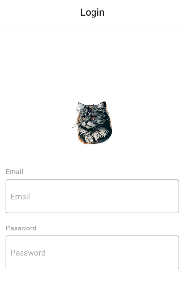

- 로그인 화면에서 이메일을 입력받는 Input 컴포넌트의 returnKeyType을 next로 설정하고 비밀번호를 입력받는 Input 컴포넌트는 done으로 설정했다.
- 이번에는 useRef를 이용해 이메일을 입력받는 Input컴포넌트에서 키보드의 next버튼을 클릭하면 비밀번호를 입력하는 Input 컴포넌트로 포커스가 이동하는 기능을 추가해보자.

```js
import React, {useState,useRef} from 'react';
...
const Login = ({ navigation }) => {
    const[email, setEmail] = useState('');
    const[password,setPassword] = useState('');
    const passwordRef = useRef();

...

<Input
        label="Email"
        value={email}
        onChangeText={text => setEmail(text)}
        onSubmitEditing={() => passwordRef.current.focus()}
        placeholder="Email"
        returnKeyType="next"
    />
    <Input
        ref={passwordRef}
...
```

- useRef를 이용하여 passwordRef를 만들고 비밀번호를 입력하는 Input 컴포넌트의 ref로 지정했다.
- 이메일을 입력하는 Input 컴포넌트의 onSubmitEditing함수를 passwordRef를 이용해서 비밀번호를 입력하는 Input 컴포넌트로 포커스가 이동되도록 수정했다.
- 이제 Input 컴포넌트에 전달된 ref를 이용해 TextInput 컴포넌트의 ref로 지정해야한다.
- 하지만 ref는 key처럼 리액트에서 특별히 관리도기 때문에 자식 컴포넌트의 props로 전달되지 않는다.
- 이런 상황에서 forwardRef함수를 이용하면 ref를 전달받을 수 있다.
- Input.js 수정하기
```js
import React, { useState, forwardRef } from 'react';
...

const Input = forwardRef(
    (
      {
        label,
        value,
        onChangeText,
        onSubmitEditing,
        onBlur,
        placeholder,
        isPassword,
        returnKeyType,
        maxLength,
      },
      ref
    ) => {
    const [isFocused, setIsFocused] = useState(false);
    return (
      <Container>
        <Label isFocused={isFocused}>{label}</Label>
        <StyledTextInput
          ref={ref}
          isFocused={isFocused}
          value={value}
          onChangeText={onChangeText}
          onSubmitEditing={onSubmitEditing}
          onFocus={() => setIsFocused(true)}
          onBlur={() => {
            setIsFocused(false);
            onBlur();
          }}
          placeholder={placeholder}
          secureTextEntry={isPassword}
          returnKeyType={returnKeyType}
          maxLength={maxLength}
          autoCapitalize="none"
          autoCorrect={false}
          textContentType="none" // iOS only
          underlineColorAndroid="transparent" // Android only
        />
      </Container>
    );
  }
);
```

#### 키보드 감추기
- 키보드가 Input태그를 가리는 문제와 다른곳을 클릭했을 때 키보드가 사라지게 만들어보자.
```js
npm install react-native-keyboard-aware-scroll-view
```
- react-native-keyboard-aware-scroll-view 라이브러리는 포커스가 있는 TextInput 컴포넌트의 위치로 자동 스크롤되는 기능 등 Input 컴포넌트에 필요한 기능들을 제공한다.

- Login.js 코드 수정하기
```js
...

import { KeyboardAwareScrollView } from 'react-native-keyboard-aware-scroll-view';

 <KeyboardAwareScrollView
        contentContainerStyle={{flex:1}}
        extraScrollHeight={20}
      >
      <Container>
        ...
        
      </Container>
 </KeyboardAwareScrollView>
```

### 오류 메시지
- Input 컴포넌트에 입력되는 값이 올바른 형태로 입력되었는지 확인하고, 잘못된 값이 입력되면 오류 메시지를 보여주는 기능을 만들어보자.
- 먼저 오류 메시지에서 사용할 색을 theme.js파일에 정의하고 진행하자.
```js
export const theme = {
    ...
    errorText : colors.red,
}

```
- 색의 정의가 완료되면 utils 폴더에 common.js파일을 생성하고 올바른 이메일 형식인지 확인하는 함수와 입력된 문자열에서 공배을 모두 제거하는 함수를 만들자.

```js
export const validateEmail = email => {
  const regex = /^[0-9?A-z0-9?]+(\.)?[0-9?A-z0-9?]+@[0-9?A-z]+\.[A-z]{2}.?[A-z]{0,3}$/;
  return regex.test(email);
};

export const removeWhitespace = text => {
  const regex = /\s/g; //문자열 전체에서 공백을 찾는다.
  return text.replace(regex, '');
};
```

### 정규표현식
#### 대괄호 : 괄호 안의 하나의 문자와 일치
- [abc] : a또는 b 또는 c 중 하나와 일치
- [a-z] : 소문자 알파벳중 하나
- [A-Z] : 대문자 알파벳중 하나
- [0-9] : 숫자 중 하나와 일치
- [a-zA-Z0-9]: 알파벳 대소문자, 숫자 중 하나와 일치
- [^abc] : a,b,c가 아닌 문자

- . : 모든 문자 하나와 일치
- \d : [0-9]
- \D : [^0-9]
- \w : [A-Za-z_]
- \W : [^A-Za-z_]
- \s : 공백을 찾는다.

#### 반복

- \* : 앞의 패턴이 0번이상 반복
  - ex) a* : a가 없거나 여러번 반복되는 경우와 일치

- \+ : 앞의 패턴이 1번 이상 반복
  - ex) a+ : a가 한번 이상 나타나는 경우와 일치

- ? : 앞의 패턴이 0번 또는 1번 나타나는 경우와 일치
  - ex) a? : a가 없거나 1번 나타나는 경우와 일치

- {n} : 정확히 n번 반복
  - ex) a{3} : a가 정확히 3번 나오는 경우와 일치

- {n,} : 최소 n번 반복
  - ex) a{2,} : a가 최소 2번 나타나는 경우와 일치

- {n,m} : n번에서 m번 사이 반복
  - ex) a{1,3} : a가 1번 이상 3번 이하로 나타나는 경우와 일치

#### Login.js 코드 수정하기
```js
import {validateEmail, removeWhitespace} from '../utils/common'

const ErrorText = styled.Text`
  align-items : flex-start;
  width: 100%;
  height: 20px;
  margin-bottom: 10px;
  line-height: 20px;
  color: ${({theme}) => theme.errorText};
`

const Login = ({ navigation }) => {
    ...

    const [errorMessage, setErrorMessage] = useState('');

    const _handleEmailChange = email => {
      const changedEmail = removeWhitespace(email);
      setEmail(changedEmail);
      setErrorMessage(
        validateEmail(changedEmail) ? '' : 'Please verify your email.'
      );
    };

    const _handlePasswordChange = password => {
      setPassword(removeWhitespace(password));
    };
    return(
      ...
       <Input
          label="Email"
          value={email}
          onChangeText={_handleEmailChange}
          ...
        />
        <Input
          ref={passwordRef}
          label="Password"
          value={password}
          onChangeText={_handlePasswordChange}
          ...
        />
        <ErrorText>{errorMessage}</ErrorText>
        ...
    )
```
- 이메일에는 공백이 존재하지 않으므로 email의 값이 변경될 때마다 공백을 제고하도록 수정하고 validateEmail 함수를 이용해 공백이 제거된 이메일이 올바른 형식인지 검사했다.
- 마지막으로 검사 결과에 따라 오류 메시지가 나타나도록 로그인 화면을 수정했다.
- 비밀번호도 공백을 허용하지 않기 위해 제거하는 코드가 추가됐다.

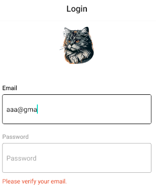

### Button 컴포넌트
- 로그인 버튼 등으로 활용될 Button 컴포넌트를 만들어보자.
- 먼저 버튼에서 사용할 색을 theme.js파일에 정의한다.
```js
export const theme = {
    ...
    buttonBackground : colors.blue,
    buttonTitle : colors.white,
    buttonUnfilledTitle : colors.blue,
}
```
- 내부가 채워지지 않은 버튼은 버튼의 타이틀 색을 다르게 사용하기 위한 값을 정의했다.
- 이제 정의된 색을 이용해 Button 컴포넌트를 만들어보자.
- components폴더에 Button.js만들기
```js
import React from 'react';
import styled from 'styled-components/native';
import PropTypes from 'prop-types';

const TRANSPARENT = 'transparent';

const Container = styled.TouchableOpacity`
  background-color: ${({ theme, isFilled }) =>
    isFilled ? theme.buttonBackground : TRANSPARENT};
  align-items: center;
  border-radius: 4px;
  width: 100%;
  padding: 10px;
`;
const Title = styled.Text`
  height: 30px;
  line-height: 30px;
  font-size: 16px;
  color: ${({ theme, isFilled }) =>
    isFilled ? theme.buttonTitle : theme.buttonUnfilledTitle};
`;

const Button = ({ containerStyle, title, onPress, isFilled}) => {
  return (
    <Container
      style={containerStyle}
      onPress={onPress}
      isFilled={isFilled}
    >
      <Title isFilled={isFilled}>{title}</Title>
    </Container>
  );
};

Button.defaultProps = {
  isFilled: true,
};

Button.propTypes = {
  containerStyle: PropTypes.object,
  title: PropTypes.string,
  onPress: PropTypes.func.isRequired,
  isFilled: PropTypes.bool,
};

export default Button;
```
- props로 전달된 isFilled의 값에 따라 버튼 내부를 채우거나 투명하게 처리하는 Button 컴포넌트를 만들었다.
- isFilled의 기본값을 true로 지정해서 색이 채워진 상태가 기본 상태로 되도록 하고, 버튼 내부가 채워지지 않았을 경우 props로 전달된 title의 색이 변경되도록 작성했다.
- 사용되는 곳에 따라 버튼의 스타일을 수정하기 위해 containerStyle을 props로 전달받아 적용하도록 작성했다.
- Button 컴포넌트의 작성이 완료되면 components 폴더의 index.js파일에 컴포넌트를 추가하자.
```js
import Image from "./Image";
import Input from "./Input";
import Button from "./Button";

export {Image, Input,Button};
```
- 이제 로그인 화면에서 Button 컴포넌트를 사용해보자.
```js
...
import { Image,Input,Button } from '../components';
...

const _handleLoginButtonPress = () => {};

...

<Input
  ref={passwordRef}
  label="Password"
  value={password}
  onChangeText={_handlePasswordChange}
  onSubmitEditing={_handleLoginButtonPress}
  placeholder="Password"
  returnKeyType="done"
  isPassword
/>
<ErrorText>{errorMessage}</ErrorText>
  <Button title="Login" onPress={_handleLoginButtonPress} />
  <Button 
    title="Sign up with email"
    onPress={() => navigation.navigate('Signup')}
    isFilled={false}
  />
  </Container>
```
- Button 컴포넌트를 사용해서 로그인 버튼과 회원가입 화면으로 이동하는 버튼을 만들었다
- 로그인 버튼을 클릭했을 때 해야 하는 작업과 비밀번호를 입력받는 Input 컴포넌트의 onSubmitEditing 함수가 하는 역할이 같으므로 동일한 작업이 수행되도록 수정했다.

## 버튼 활성/비활성화
- 이메일과 비밀번호가 입력되지 않으면 Button 컴포넌트가 동작하지 않도록 수정해보자.
- Button 컴포넌트의 onPress에 전달하는 함수에서 버튼의 클릭 가능 여부를 확인하는 방법이 있지만, 사용자에게 버튼 동작 여부를 시각적으로 명확하게 알려주자.

### Button.js에 코드 추가하기
- Button 컴포넌트에서 props를 통해 전달되는 disabled의 값에 따라 버튼 스타일이 변경되도록 수정해보자.
- Button 컴포넌트를 구성하는 TouchableOpacity 컴포넌트에 disabled속성을 전달하면 값에 따라 클릭 등의 상호 작용이 동작하지 않기 때문에 disabled 값을 props로 전달하는 것으로 버튼 비활성화 기능을 추가했다.
```js
import React from 'react';
import styled from 'styled-components/native';
import PropTypes from 'prop-types';

const TRANSPARENT = 'transparent';

const Container = styled.TouchableOpacity`
  ...

  opacity: ${({disabled}) => (disabled ? 0.5 : 1)};
`;


const Button = ({ containerStyle, title, onPress, isFilled}) => {
  return (
    <Container
      style={containerStyle}
      onPress={onPress}
      isFilled={isFilled}
      disabled={disabled}
    >
      <Title isFilled={isFilled}>{title}</Title>
    </Container>
  );
};

Button.defaultProps = {
  isFilled: true,
};

Button.propTypes = {
  ...
  disabled: PropTypes.bool,
};

export default Button;
```

### Login.js에 코드 추가하기
- 로그인 화면에서 입력되는 값을 확인하고 버튼의 활성화 여부를 결정하도록 하자
```js
import React,{useRef, useState, useEffect} from 'react';
import styled from 'styled-components';
import { Text,Button } from 'react-native';
import {Image,Input,Button} from '../components'
import { images } from '../utils/images';
import { KeyboardAwareScrollView } from 'react-native-keyboard-aware-scroll-view';
import {validateEmail, removeWhitespace} from '../utils/commons'

...

const Login = ({ navigation }) => {

    ...

    //버튼의 활성화 상태를 관리하는 state
    const [disabled, setDisabled] = useState(true);

    //email, password, errorMessage의 state가 변할때마다 조건에 맞게 disabled의 state에 값을 세팅한다.
    useEffect(() => {
      //로그인 버튼은 이메일과 비밀번호가 입력되어 있어야 하고, 오류 메시지가 없어야 활성화된다.
      setDisabled(!(email && password && !errorMessage));
    }, [email, password, errorMessage])

    return (
      <KeyboardAwareScrollView
        contentContainerStyle={{flex:1}}
        extraScrollHeight={20}
        >
        <Container>
          ...

          <ErrorText>{errorMessage}</ErrorText>
          // 버튼에 disabled를 전달해서 값에 따라 버튼의 활성화 여부가 결정되도록 하기
          <Button 
            title="Login" 
            onPress={_handleLoginButtonPress} 
            disabled={disabled}/>
          <Button 
            title="Sign up with email"
            onPress={() => navigation.navigate('Signup')}
            isFilled={false}
          />
        </Container>
        </KeyboardAwareScrollView>
    );
};
  
export default Login;
```

## 헤더 수정하기
- 현재 화면은 스택 내비게이션을 사용해서 로그인 화면과 회원가입 화면 모두에 헤더가 있다.
- 애플리케이션의 첫 화면인 로그인 화면에는 헤더가 굳이 필요하지 않으므로 헤더를 없애자.

### AuthStack.js 코드 수정하기
```js
...
const AuthStack = () => {
  const theme = useContext(ThemeContext);
  return (
    <Stack.Navigator
      initialRouteName="Login"
      screenOptions={{
        headerTitleAlign: 'center',
        cardStyle: { backgroundColor: theme.background },
      }}
    >
      <Stack.Screen
        name="Login"
        component={Login}
        options={{headerShown: false}}
      />
      <Stack.Screen
        name="Signup"
        component={Signup}
      />
    </Stack.Navigator>
  );
};

export default AuthStack;
```


- 회원가입 화면의 헤더에 나타나는 뒤로가기 버튼의 타이틀을 감추고, 버튼과 타이틀의 색이 일치되도록 수정하자.

### theme.js 코드 추가하기
```js
...

export const theme = {
    ...

    headerTintColor : colors.black,
}
```

### AuthStack.js 수정하기
```js
...

const AuthStack = () => {
  const theme = useContext(ThemeContext);
  return (
    <Stack.Navigator
      initialRouteName="Login"
      screenOptions={{
        headerTitleAlign: 'center',
        cardStyle: { backgroundColor: theme.background },
        headerTintColor: theme.headerTintColor,
      }}
    >
      ...

      <Stack.Screen
        name="Signup"
        component={Signup}
        options={{
          headerBackTitle:'',
        }}
      />
    </Stack.Navigator>
  );
};

export default AuthStack;
```

## 회원가입 화면
- 회원가입 화면은 로그인 화면 제작 과정에서 만든 컴포넌트를 재사용하면 굉장히 쉽고 빠르게 만들 수 있다.

### 사용자 사진 설정
- 회원가입 화면에서 사용자의 사진을 원형으로 렌더링 하기 위해 Image 컴포넌트에서 props를 통해 전달되는 값에 따라 이미지가 원형으로 렌더링되도록 수정하자

### Image.js
```js
...

const StyledImage = styled.Image`
  background-color: ${({ theme }) => theme.imageBackground};
  width: 100px;
  height: 100px;
  border-radius: ${({rounded}) => (rounded ? 50 : 0)}px;
`;

const Image = ({ url, imageStyle, rounded}) => {
    return (
      <Container>
        <StyledImage source={{uri:url }} style={imageStyle} rounded={rounded} />      
      </Container>
    );
  };
  
  Image.propTypes = {
    uri: PropTypes.string,
    imageStyle: PropTypes.object,
    rounded : PropTypes.bool,
  };
  
  export default Image;
```
### Signup.js 코드 작성하기
```js
import React,{useEffect,useRef, useState} from 'react';
import styled from 'styled-components';
import { Image,Input, Button} from '../components'
import { KeyboardAwareScrollView } from 'react-native-keyboard-aware-scroll-view';
import { validateEmail, removeWhitespace } from '../utils/commons';

const Container = styled.View`
  flex: 1;
  justify-content: center;
  align-items: center;
  background-color: ${({ theme }) => theme.background};
  padding: 0 20px;
`;
const ErrorText = styled.Text`
  align-items: flex-start;
  width: 100%;
  height: 20px;
  margin-bottom: 10px;
  line-height: 20px;
  color: ${({theme}) => theme.errorText};
`


const Signup = () => {
  //이름
  const [name,setName] = useState('');
  //이메일
  const [email, setEmail] = useState('');
  //비밀번호
  const [password, setPassword] = useState('');
  //비밀번호 확인
  const [passwordConfirm, setPasswordConfirm] = useState('');
  //에러 메시지
  const [errorMessage, setErrorMessage] = useState('');
  //버튼 활성/비활성화
  const [disabled, setDisabled] = useState(true);

  const emailRef = useRef();
  const passwordRef = useRef();
  const passwordConfirmRef = useRef();

  //조건에 맞지 않을 때 에러문구 렌더링
  useEffect(() => {
    let _errorMessage = '';
    if(!name) {
      _errorMessage = 'Please enter your name.';
    } else if(!validateEmail(email)){
      _errorMessage = 'Please verify your email.';
    } else if(password.length < 6) {
      _errorMessage = 'The password must contain 6 characters at least.';
    } else if(password !== passwordConfirm){
      _errorMessage = 'Passwords need to match';
    } else {
      _errorMessage = '';
    }
    setErrorMessage(_errorMessage);
  },[name,email,password,passwordConfirm])

  //조건에 따라 버튼 활성화/비활성화하기
  useEffect(() => {
    setDisabled(
      !(name && email && password && passwordConfirm && !errorMessage)
    )
  },[name,email,password,passwordConfirm, errorMessage]);

  const _handleSignupButtonPress = () => {};

  return (
    <KeyboardAwareScrollView
      contentContainerStyle={{flex:1}}
      extraHeight={20}>
      <Container>
        {/* 프로필 사진 */}
        <Image rounded />

        {/* 이름 입력 */}
        <Input
          label="name"
          value={name}
          onChangeText={text => setName(text)}
          onSubmitEditing = {() => {
            setName(name.trim());
            emailRef.current.focus();
          }}
          onBlur={() => setName(name.trim())}
          placeholder="Name"
          returnKeyType="next"
       />

       {/* 이메일(아이디)입력 */}
       <Input
        ref={emailRef}
        label="Email"
        value={email}
        onChangeText={text => setEmail(removeWhitespace(text))}
        onSubmitEditing={() => passwordRef.current.focus()}
        placeholder="Email"
        returnKeyType="next"
      />

      {/* 비밀번호 입력 */}
      <Input
          ref={passwordRef}
          label="Password"
          value={password}
          onChangeText={text => setPassword(removeWhitespace(text))}
          onSubmitEditing={() => passwordConfirm.current.focus()}
          placeholder="Password"
          returnKeyType="done"
          isPassword
      />
      {/* 비밀번호일치 여부를 작성하는 Input */}
      <Input
          ref={passwordConfirmRef}
          label="Password Confirm"
          value={passwordConfirm}
          onChangeText={text => setPasswordConfirm(removeWhitespace(text))}
          onSubmitEditing={_handleSignupButtonPress}
          placeholder="Password"
          returnKeyType="done"
          isPassword
            />

      {/* 에러메시지 출력 */}
      <ErrorText>{errorMessage}</ErrorText>
      <Button
        title="Signup"
        onPress={_handleSignupButtonPress}
        disabled={disabled}
      />
      </Container>
      </KeyboardAwareScrollView>
  );
};

export default Signup;
```
- 회원가입 화면은 사용자에게 입력받아야 하는 내용이 많아진 것을 제외하면 로그인 화면과 거의 같은 모습이다.
- 입력받아야 하는 값이 많은 만큼 유효성 검사와 오류 메시지의 종류가 많아지므로 useEffect를 이용해 관련된 값이 변할 때마다 적절한 오류 메시지가 렌더링되도록 만들었다.

## 화면 스크롤
- 현재 안드로이드에서는 기기의 크기에 따라 화면의 위아래가 잘려보이는 문제가 있다.
- KeyboardAwareScrollView 컴포넌트에 contentContainerStyle을 이용하여 flex : 1을 스타일에 적용시키면서 발생한 문제다.
- flex:1을 설정하면 컴포넌트가 차지하는 영역이 부모 컴포넌트 영역만큼 한정되므로, 컴포넌트의 크기에 따라 화면을 넘어가서 스크롤이 생성되도록 flex:1을 삭제한다.

### Signup.js
```js
...
const Container = styled.View`
  ...
  padding: 40px 20px;
`;
...
const Signup = () => {
  
  ...

  return (
    <KeyboardAwareScrollView
      extraHeight={20}>
      <Container>
        ...
      </Container>
      </KeyboardAwareScrollView>
  );
};
```

## 오류메시지
- 회원가입 화면에서 입력되는 값에 따라 오류 메시지의 변화가 많아, useEffect를 이용해 오류 메시지를 한곳에서 관리하도록 작성했다.
- 하지만 회원가입이 처음 렌더링 될  때도 오류 메시지가 나타난다는 문제가 있다.

### Signup.js
```js
const Signup = () => {
  ...

const didMountRef = useRef();

//조건에 맞지 않을 때 에러문구 렌더링
  useEffect(() => {
    if(didMountRef.current){
        let _errorMessage = '';
      if(!name) {
        _errorMessage = 'Please enter your name.';
      } else if(!validateEmail(email)){
        _errorMessage = 'Please verify your email.';
      } else if(password.length < 6) {
        _errorMessage = 'The password must contain 6 characters at least.';
      } else if(password !== passwordConfirm){
        _errorMessage = 'Passwords need to match';
      } else {
        _errorMessage = '';
      }
      setErrorMessage(_errorMessage);
    } else {
      didMountRef.current = true;
    }
  },[name,email,password,passwordConfirm])
```
- useRef에 어떤 값도 대입하지 않다가, 컴포넌트가 마운트 되었을 때 실행되는 useEffect함수에서 didMountRef에 값을 대입하는 방법으로 컴포넌트의 마운트 여부를 확인하도록 수정했다.

## 사진 입력받기
- 회원가입 화면에서 사용자에게 자신의 이미지를 입력받는 기능을 만들어보자.
- 먼저 사진이 선택되지 않았을 때 보여줄 기본 이미지를 스토리지에 업로드하고 규칙을 수정해서 로그인 하지 않아도 접근이 가능하도록 하자.
- 파일명을 photo.png로 업로드하고 규칙을 수정하자.
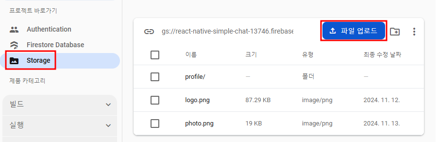

```js
rules_version = '2';

// Craft rules based on data in your Firestore database
// allow write: if firestore.get(
//    /databases/(default)/documents/users/$(request.auth.uid)).data.isAdmin;
service firebase.storage {
  match /b/{bucket}/o {
    match /logo.png {
      allow read; 
    }
    
    match /photo.png {
    	allow read;
    }
  }
}
```
- 이미지 업로드와 규칙 수정이 완료되면 로고 이미지와 마찬가지로 utils 폴더에 있는 images.js파일에 기본 이미지의 url을 추가한다.

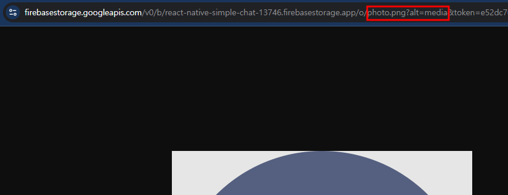

### images.js
- 로고 이미지와 마찬가지로 쿼리 스트링의 token부분을 제외하고 기본 이미지의 주소를 추가하자.
```js
const prefix = 'https://firebasestorage.googleapis.com/v0/b/react-native-simple-chat-13746.firebasestorage.app/o'

export const images = {
    logo : `${prefix}/logo.png?alt=media`,
    photo : `${prefix}/photo.png?alt=media`
}
```

### Signup.js
- 회원가입 화면에서 추가된 기본 이미지를 이용하도록 수정하자.
- Image 컴포넌트를 이용해 렌더링할 주소를 관리하는 photoUrl을 useState로 생성하고, 앞에서 준비한 기본 이미지를 초깃값으로 설정했다.
```jsx
...

import { images } from '../utils/images';

const Signup = () => {

 ...

  //프로필사진 이미지 URL
  const [photoUrl, setPhotoUrl] = useState(images.photo);

...

return (
    <KeyboardAwareScrollView
      extraHeight={20}>
      <Container>
        {/* 프로필 사진 */}
        <Image rounded url={photoUrl} />

...

```
- Image 컴포넌트에 버튼을 추가하여 기기의 사진을 이용하는 기능을 만들어보자.
- 추가 버튼에 사용할 버튼 색을 theme.js파일에 정의하자.

```js
export const theme = {
    background : colors.white,
    text : colors.black,
    imageBackground: colors.grey_0,
    imageButtonBackground: colors.grey_1,
    imageButtonIcon : colors.white,

    ...

}
```
### Image.js
```js
...
import {MaterialIcons} from '@expo/vector-icons'

...

const ButtonContainer = styled.TouchableOpacity`
  background-color : ${({theme}) => theme.imageButtonBackground};
  position : absolute;
  bottom : 0;
  right: 0;
  width : 30px;
  border-radius : 15px;
  justify-content : center;
  align-items: center;
`

const ButtonIcon = styled(MaterialIcons).attrs({
  name: 'photo-camera',
  size: 22,
})`
  color: ${({theme})=> theme.imageButtonIcon}
`;

const PhotoButton = ({onPress}) => {
  return(
    <ButtonContainer onPress={onPress}>
      <ButtonIcon />
    </ButtonContainer>
  )
}

const Image = ({ url, imageStyle, rounded, showButton}) => {
    return (
      <Container>
        <StyledImage source={{uri:url }} style={imageStyle} rounded={rounded} />      
        {showButton && <PhotoButton />}
      </Container>
    );
  };

  Image.defaultProps = {
    rounded: false,
    showButton: false,
  }
  
  Image.propTypes = {
    uri: PropTypes.string,
    imageStyle: PropTypes.object,
    rounded : PropTypes.bool,
    showButton: PropTypes.bool,
  };
  
  export default Image;
```
- Image컴포넌트에서 사진 변경하기 버튼으로 사용할 PhotoButton컴포넌트를 만들었다.
- 추가된 버튼은 Image 컴포넌트의 props로 전달되는 showButton의 값에 따라 렌더링 여부를 결정했다.
- 이제 버튼을 클릭하면 기기의 사진첩에 접근해서 사진의 정보를 가져오는 기능을 추가해보자.
- 다음의 라이브러리를 설치하고 사진첩 접근 기능을 구현한다.
```js
expo install expo-image-picker
```

### Image.js
```js
import React,{useEffect} from 'react';
...
import { Platform,Alert } from 'react-native';
import * as ImagePicker from 'expo-image-picker'
//Expo SDK 52에서는 권한 요청 기능 자체는 당연히 지원되지만, 더 이상 별도의 expo-permissions 모듈을 사용하지 않는다.
//import * as Permissions from 'expo-permissions'

...
const Image = ({ url, imageStyle, rounded, showButton, onChangeImage }) => {
  // 컴포넌트가 마운트될 때, 한 번만 실행되는 useEffect
  // iOS 기기에서 미디어 라이브러리(사진첩) 접근 권한을 요청합니다.
  useEffect(() => {
    (async () => {
      try {
        // 플랫폼이 iOS일 때만 권한 요청 (Android는 별도의 권한 요청이 필요 없을 수 있음)
        if (Platform.OS === 'ios') {
          // 미디어 라이브러리 접근 권한을 비동기적으로 요청합니다.
          const { status } = await ImagePicker.requestMediaLibraryPermissionsAsync();
          // 권한이 부여되지 않았다면, 사용자에게 경고 메시지 출력
          if (status !== 'granted') {
            Alert.alert(
              'Photo Permission', // 경고창 제목
              'Please turn on the camera roll permissions' // 경고 메시지
            );
          }
        }
      } catch (e) {
        // 권한 요청 중 에러 발생 시, 에러 메시지를 포함한 경고창 출력
        Alert.alert('Photo Permission Error', e.message);
      }
    })();
  }, []);

  // 사용자가 "이미지 선택" 버튼을 눌렀을 때 호출되는 함수
  const _handleEditButton = async () => {
    try {
      // 이미지 라이브러리(갤러리)에서 이미지를 선택할 수 있는 인터페이스를 띄웁니다.
      const result = await ImagePicker.launchImageLibraryAsync({
        // 이미지 타입만 선택할 수 있도록 설정 (비디오 등은 선택 불가)
        mediaTypes: ImagePicker.MediaTypeOptions.Images,
        // 선택 후 사용자가 이미지를 편집할 수 있도록 허용 (크롭 등)
        allowsEditing: true,
        // 편집 시 고정될 비율 (여기서는 정사각형: 1:1)
        aspect: [1, 1],
        // 이미지의 품질 설정 (1은 최고 품질)
        quality: 1,
      });

      // 사용자가 이미지 선택을 취소하지 않았다면(result.canceled가 false라면)
      if (!result.canceled) {
        // 선택된 이미지 정보가 담긴 배열의 첫 번째 항목에서 URI를 추출합니다.
        const imageUri = result.assets[0].uri;
        // 추출한 이미지 URI를 부모 컴포넌트에 전달하여 이미지 변경을 알립니다.
        onChangeImage(imageUri);
      }
    } catch (e) {
      // 이미지 선택 또는 처리 중 에러 발생 시, 에러 메시지를 포함한 경고창 출력
      Alert.alert('Photo Error', e.message);
    }
  };
  return (
    <Container>
      <StyledImage source={{uri:url }} style={imageStyle} rounded={rounded} />      
      {showButton && <PhotoButton onPress={_handleEditButton}/>}
    </Container>
  );
};

  Image.defaultProps = {
    ...
    onChangeImage: () => {},
  }
  
  Image.propTypes = {
   ...
    onChangeImage: PropTypes.func,
  };
```

- iOS에서는 사진첩에 접근하기 위해 사용자에게 권한을 요청하는 과정이 필요하므로 권한을 요청하는 부분을 추가했다.
- 안드로이드는 특별한 설정 없이 사진에 접근할 수 있기 때문에 iOS에서만 동작하도록 작성했다.

#### 함수의 실행 결과
- 기기의 사진에 접근하는 함수는 결과를 반환하는데, 반환된 결과의 canceled값을 통해 선택 여부를 확인할 수 있다.
```js
{
  canceled: boolean,  // 사용자가 선택을 취소했는지 여부를 나타내는 불리언 값
  assets: [           // 사용자가 선택한 이미지(들)에 대한 정보를 담은 배열
    {
      uri: string,    // 선택한 이미지의 위치(파일 경로 또는 URL)
      width: number,  // 이미지의 가로 길이 (픽셀 단위)
      height: number, // 이미지의 세로 길이 (픽셀 단위)
      type?: string,  // (선택적) 이미지의 MIME 타입 등 추가 정보
      // 그 외 추가적인 메타데이터가 포함될 수 있음
    }
    // 만약 여러 장의 이미지를 선택할 수 있는 옵션을 활성화했다면, assets 배열에는 여러 객체가 들어갈 수 있습니다.
  ]
}
```

### Signup.js
- 이제 회원가입 화면을 수정해서 선택된 사진이 Image 컴포넌트에 렌더링되도록 수정하자
```js
return (
    <KeyboardAwareScrollView
      extraHeight={20}>
      <Container>
        {/* 프로필 사진 */}
        <Image 
          rounded 
          url={photoUrl} 
          showButton 
          onChangeImage={url => setPhotoUrl(url)}/>

          ...

      </Container>
    </KeyboardAwareScrollView>

```

## 로그인
- 아직 생성된 사용자가 없으므로 파이어베이스 콘솔에서 사용자를 추가하고 로그인 기능을 만들어보자.

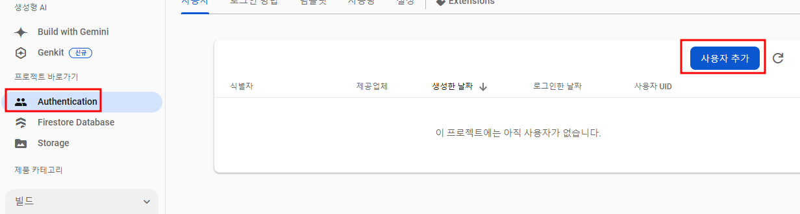

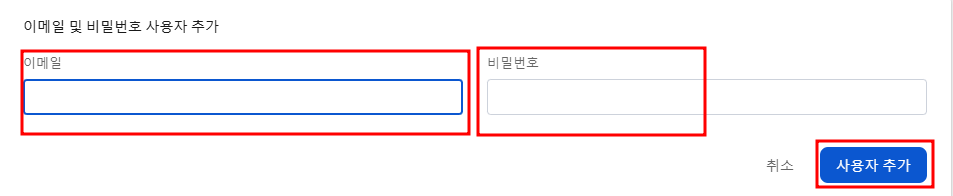

### firebase.js
- 이메일과 비밀번호를 이용해서 인증받는 함수를 signInWithAndPassword이다.
- 사용자 추가를 완료했다면 로그인기능을 가지는 함수를 만들어보자

```js
// firebase/app과 firebase/auth에서 필요한 함수만 임포트
import { initializeApp } from 'firebase/app';
import { getAuth, signInWithEmailAndPassword } from 'firebase/auth';
import config from '../../firebase.json';

// Firebase 앱 초기화
export const app = initializeApp(config);

// 인증 모듈 가져오기
const auth = getAuth(app);

// (1) 이메일/비밀번호 로그인
export const login = async ({ email, password }) => {
  try {
    // Firebase Auth 함수 signInWithEmailAndPassword로 로그인
    const userCredential = await signInWithEmailAndPassword(auth, email, password);
    // userCredential 객체 안에는 로그인된 사용자 정보가 들어 있음
    return userCredential.user;
  } catch (error) {
    console.error('Login error:', error);
    // 에러 발생 시 상위(호출부)로 에러를 던짐
    throw error;
  }
};


```

### Login.js
```js
...
import { Alert } from 'react-native';
import { login } from '../utils/firebase';

...
const Login = ({ navigation }) => {

    ...

    const _handleLoginButtonPress = async() => {
      try {
        const user = await login({email, password});
        Alert.alert('Login Success', user.email);
      } catch (error) {
        Alert.alert('Login Error', error.message);
      }
    };
```
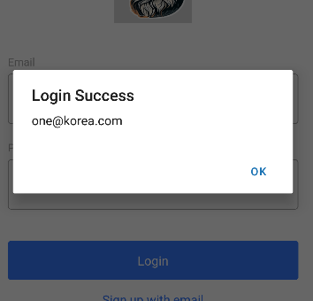

## 회원가입
- 파이어베이스에서 제공하는 함수 중 이메일과 비밀번호를 이용해서 사용자를 생성하는 함수는 createUserWithEmailAndPassword이다.
- 이 함수를 이용해 firebase.js에 회원가입 기능을 만들어보자.

### firebase.js
```js
// firebase/app과 firebase/auth에서 필요한 함수만 임포트
import { initializeApp } from 'firebase/app';
import { 
  getAuth, 
  signInWithEmailAndPassword, 
  createUserWithEmailAndPassword 
} from 'firebase/auth';
import config from '../../firebase.json';

...

// (5) 회원가입 함수
export const signup = async ({email, password}) => {
    // 이메일/비밀번호 기반으로 Firebase Auth에 사용자 등록
    const {user} = await createUserWithEmailAndPassword(auth, email,password);
    return user;
}
```

### Signup.js
```js
...
import { Alert } from 'react-native';
import { signup } from '../utils/firebase';

...

const Signup = () => {

  ...

  const _handleSignupButtonPress = async () => {
    try {
      const user = await signup({email, password});
      console.log(user);
      Alert.alert('Signup Success',user.email);
    } catch (error) {
      Alert.alert('Signup Error', error.message);
    }
  };

  return (
    ...
  );
};

export default Signup;
```
- 사용자는 정상적으로 추가되지만, 우리는 사용자의 사진과 이름을 이용하지 않고 이메일과 비밀번호만으로 사용자를 생성했다.
- 파이어베이스에서 제공하는 사용자 생성 함수는 이메일과 비밀번호만 파라미터로 받는데 어떻게 사용자의 사진과 이름을 지정할 수 있을까?
- signup 함수에서 반환되는 user객체를 보면 우리가 입력한 이메일과 함께 다음과 같은 내용을 확인할 수 있다.

```js
{
  "displayName":null,
  "email":"one@korea.com",
  "photoURL":null,
  "uid":"...",
}
```
- email은 우리가 입력한 사용자의 이메일 주소
- uid는 사용자마다 갖고 있는 유일한 키 값으로 사용자를 식별하는 데 사용된다.
- displayName에 사용자의 이름을 입력한다.
- photoURL에 사용자 사진의 URL을 입력한다.
- 사용자 이름은 문자열로 입력할 수 있지만, 사진을 선택해서 받은 경로는 'file://...'로 시작하는 값을 가지고 있어 바로 사용할 수 없다.
- 사용자에 의해 선택한 사진을 firebase의 스토리지에 업로드하여 해결할 수 있다.

### firebase.js
```js
import { 
  getAuth, 
  updateProfile, 
  signInWithEmailAndPassword, 
  createUserWithEmailAndPassword 
} from 'firebase/auth';
import { 
  getStorage, 
  ref, 
  uploadBytes, 
  getDownloadURL 
} from 'firebase/storage';

...

const storage = getStorage(app);

const uploadImage = async uri => {
// 주어진 URI에서 Blob(바이너리 큰 객체)을 얻기 위해 Promise를 생성하고, 비동기적으로 실행합니다.
const blob = await new Promise((resolve, reject) => {
    // 새로운 XMLHttpRequest 인스턴스 생성
    const xhr = new XMLHttpRequest();

    // 요청이 성공적으로 완료되었을 때 실행되는 콜백 함수
    xhr.onload = () => {
        // xhr.response는 xhr.responseType으로 설정한 'blob' 형태의 데이터를 반환합니다.
        // 요청이 성공하면 Promise를 resolve하여 blob 데이터를 반환합니다.
        resolve(xhr.response);
    };

    // 요청이 실패할 경우 실행되는 콜백 함수
    xhr.onerror = () => {
        // 네트워크 요청에 실패하면 Promise를 reject하여 에러를 발생시킵니다.
        reject(new TypeError('Network request failed'));
    };

    // 응답 데이터를 Blob 형식으로 받도록 지정합니다.
    xhr.responseType = 'blob';

    // 비동기 GET 요청을 초기화합니다.
    // uri: 요청을 보낼 URL, true: 비동기 방식으로 요청을 처리함
    xhr.open('GET', uri, true);

    // 요청을 전송합니다. GET 요청에서는 body 데이터가 필요 없으므로 null을 전달합니다.
    xhr.send(null);
});

    // 현재 로그인한 사용자 확인
    const user = auth.currentUser;

    // Firebase Storage의 경로 참조 생성
    const storageRef = ref(storage,`/profile/${user.uid}/photo.png`) ;

    // Blob을 Firebase Storage에 업로드 (업로드 결과는 여기서는 사용하지 않으므로 변수에 할당하지 않습니다.)
    await uploadBytes(storageRef, blob, { contentType: 'image/png' });

    // Blob 객체 닫기 (메모리 해제)
    blob.close();

    // 업로드한 파일의 다운로드 URL을 반환
    return await getDownloadURL(storageRef);
}

export const signup = async ({email, password, name, photoUrl}) => {
    // 이메일/비밀번호 기반으로 Firebase Auth에 사용자 등록
    const {user} = await createUserWithEmailAndPassword(auth, email,password);

    // 프로필 사진 URL 처리
    // 이미 https로 시작하면 그대로 사용, 아니면 Storage에 업로드 후 URL 획득
    const storageUrl = photoUrl.startsWith('https')
        ? photoUrl 
        : await uploadImage(photoUrl);

    // 생성된 사용자 객체(user)에 프로필 업데이트(이름, 사진)
    await updateProfile(user,{
        displayName: name,
        photoURL: storageUrl,
    })

    // 가입한 사용자 정보 반환
    return user;
}
```

### Signup.js
```js
...

const Signup = () => {
  const _handleSignupButtonPress = async () => {
    try {
      const user = await signup({email, password,name, photoUrl});
      console.log(user);
      Alert.alert('Signup Success',user.email);
    } catch (error) {
      Alert.alert('Signup Error', error.message);
    }
  };

...

```
- 회원가입 화면 수정이 완료되면 쓰기 권한은 본인만 가능하도록 하고 읽기 권한은 누구나 가능하도록 보안규칙을 수정하자.

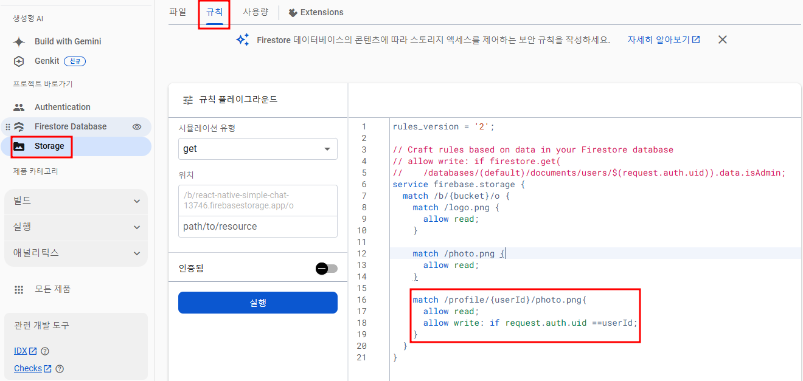

- 규칙 수정이 완료되면 회원가입 화면에서 선택한 사진과 입력된 이름이 생성되는 사용자의 정보에 추가된 것을 확인할 수 있습니다.

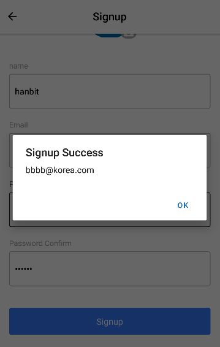

```
{
  "displayName": "hanbit", 
  "email": "bbbb@korea.com",
  "photoURL": "https://firebasestorage.googleapis.com/v0/b/..."
  "uid": "..."
  ...
}
```

## Spinner 컴포넌트
- 로그인 혹은 회원가입이 진행되는 동안 데이터를 수정하거나 버튼을 추가로 클릭하는 일이 발생하지 않도록 Spinner 컴포넌트를 만들어 사용자의 잘못된 입력이나 클릭을 방지하는 기능을 만들어보자.

### theme.js
- 먼저 Spinner 컴포넌트에서 사용할 색을 정의하자.
```js
export const theme = {
    ...
    spinnerBackground : colors.black,
    spinnerIndicator : colors.white,
}
```

### Spinner.js
- components 폴더에 Spinner 컴포넌트를 만든다.
- Spinner 컴포넌트는 리액트 네이티브에서 제공하는 ActivityIndicator 컴포넌트를 이용해서 쉽게 만들 수 있다.

```js
import React,{useContext} from 'react'
import { ActivityIndicator } from 'react-native'
import styled, {ThemeContext} from 'styled-components'

const Container = styled.View`
    position: absolute;
    z-index : 2;
    opacity : 0.3;
    width: 100%;
    height : 100%;
    justify-content : center;
    background-color : ${({theme}) => theme.spinnerBackground}
`

const Spinner = () => {
    const theme = useContext(ThemeContext);
    return(
        <Container>
            <ActivityIndicator size={'large'} color={theme.spinnerIndicator} />
        </Container>
    )
}

export default Spinner
```
- Spinner 컴포넌트는 화면 전체를 차지하면서 사용자가 다른 행동을 취할 수 없도록 다른 컴포넌트보다 위에 있게 작성했다.
- Spinner 컴포넌트 작성이 완료되면 components 폴더의 index.js에 추가한다.

### index.js

```js
...
import Spinner from "./Spinner";

export {Image, Input,Button, Spinner};
```

### navigations/index.js
- Spinner 컴포넌트를 AuthStack 네비게이션의 하위 컴포넌트로 사용하면 내비게이션을 포함한 화면 전첼르 차지할 수 없다.
- 내비게이션을 포함한 화면 전체를 감싸기 위해 navigations 폴더의 index.js에서 AuthStack 내비게이션과 같은 위치에 Spinner 컴포넌트를 사용하자.
```js
import React from "react";
import { NavigationContainer } from "@react-navigation/native";
import AuthStack from "./AuthStack";
import { Spinner } from "../components";

const Navigation = () => {
    return(
        <NavigationContainer>
            <AuthStack />
            <Spinner />
        </NavigationContainer>
    )
}

export default Navigation;
```
- Spinner 컴포넌트가 화면 전체를 감싸서 어떤 행동도 할 수 없는 상태가 된 것을 볼 수 있다.
- Spinner 컴포넌트는 로그인 버튼을 클릭했을 때나 회원가입 버튼을 클릭했을 때 처럼 여러 화면에서 발생하는 특정 상황에서만 렌더링되어야 한다.

### context/Progress.js
- Context API를 이용해 Spinner 컴포넌트의 상태를 전역적으로 관리하자
- contexts폴더 안에 Progress.js파일을 생성하고 코드를 작성하자
```js
import React, { useState, createContext } from 'react';

// ProgressContext를 생성합니다.
// 기본값으로 inProgress는 false, spinner는 빈 함수(dummy function)를 제공합니다.
const ProgressContext = createContext({
    inProgress: false,
    spinner: () => {},
});

// ProgressProvider 컴포넌트는 하위 컴포넌트에게 진행 상태와 spinner 제어 함수를 제공하는 역할을 합니다.
const ProgressProvider = ({ children }) => {
    // inProgress 상태 변수와 이를 업데이트할 setInProgress 함수를 선언합니다.
    // 초기값은 false입니다.
    const [inProgress, setInProgress] = useState(false);

    // spinner 객체를 생성하여 start와 stop 메서드를 정의합니다.
    // start: 호출 시 inProgress를 true로 변경하여 진행 중임을 나타냅니다.
    // stop: 호출 시 inProgress를 false로 변경하여 진행 중이 아님을 나타냅니다.
    const spinner = {
        start: () => setInProgress(true),
        stop: () => setInProgress(false),
    };

    // Context Provider로 전달할 값을 객체로 만듭니다.
    // 여기에는 현재 진행 상태와 spinner 객체가 포함됩니다.
    const value = { inProgress, spinner };

    // ProgressContext.Provider로 children(하위 컴포넌트들)을 감싸서
    // 하위 컴포넌트들이 value 객체를 구독할 수 있게 합니다.
    return (
        <ProgressContext.Provider value={value}>
            {children}
        </ProgressContext.Provider>
    );
};

// 다른 파일에서 사용할 수 있도록 ProgressContext와 ProgressProvider를 export 합니다.
export { ProgressContext, ProgressProvider };
```

### contexts/index.js
```js
import {ProgressContext, ProgressProvider} from './Progress'

export {ProgressContext,ProgressProvider};
```

### src/App.js
- App 컴포넌트에서 ProgressProvider컴포넌트를 이용해 애플리케이션 전체를 감싸도록 수정하자.
```js
...
import { ProgressProvider } from './contexts';

...

const App = () => {
   ...

    return (
        // 로딩 완료 시 앱의 실제 UI를 렌더링
        <ThemeProvider theme={theme}>
            <ProgressProvider>
            <StatusBar barStyle="dark-content" /> 
            <Navigation />
            </ProgressProvider>
        </ThemeProvider>
    )
};

export default App;
```

### navigations/index.js
- 이제 Spinner 컴포넌트가 ProgressContext의 inProgress 상태에 따라 렌더링되도록 navigations의 index.js를 수정하자.
```js
import React,{useContext} from "react";
import { NavigationContainer } from "@react-navigation/native";
import AuthStack from "./AuthStack";
import { Spinner } from "../components";
import { ProgressContext } from "../contexts";

const Navigation = () => {
    const {inProgress} = useContext(ProgressContext);
    return(
        <NavigationContainer>
            <AuthStack />
            {inProgress && <Spinner />}
        </NavigationContainer>
    )
}

export default Navigation;
```
- inProgress의 초기값이 false이므로 Spinner 컴포넌트가 나타나지 않는다.

### Login.js
- 로그인 버튼을 눌렀을 때 inProgress 상태를 변경하여 Spinner 컴포넌트가 렌더링되도록 수정하자
```js
import React,{useRef, useState, useEffect, useContext} from 'react';
import { ProgressContext } from '../contexts';
...


const Login = ({ navigation }) => {
    const {spinner} = useContext(ProgressContext);
    ...

    const _handleLoginButtonPress = async() => {
      try {
        spinner.start();
        const user = await login({email, password});
        Alert.alert('Login Success', user.email);
      } catch (error) {
        Alert.alert('Login Error', error.message);
      } finally{
        spinner.stop();
      }
    };
```

### Signup.js
- 회원가입 화면에서도 signup 함수를 호출하기 전에 Spinner컴포넌트가 렌더링되도록 수정하자
```js
import React,{useEffect,useRef, useState, useContext} from 'react';
import { ProgressContext } from '../contexts';
...

const Signup = () => {

  const {spinner} = useContext(ProgressContext);

  ...

  const _handleSignupButtonPress = async () => {
    try {
      spinner.start();
      const user = await signup({email, password, name, photoUrl});
      console.log(user);
      Alert.alert('Signup Success',user.email);
    } catch (error) {
      Alert.alert('Signup Error', error.message);
    } finally{
      spinner.stop();
    }
  };
```

## 메인화면
- 대부분의 애플리케이션에서 사용자의 데이터 혹은 서비스의 데이터를 이용하려면 데이터에 접근할 수 있는 유효한 사용자라는 것을 증명해야 하므로 어떤 방법으로든 인증해야 한다.
- 인증 후에는 서비스를 이용할 수 있는 화면이 렌더링되고, 로그아웃 등으로 인증 상태를 해제하면 다시 인증을 위한 화면으로 이동한다.
- 우리가 지금까지 만든 AuthStack 내비게이션에서 사용되는 화면들은 인증 이전에 사용되는, 인증을 위한 화면이었다.
- 이제 인증 후 사용될 화면과 화면들을 관리하는 내비게이션을 만들어보자.

### screens/ChannelCreation.js
- 채널화면으로 이동할 수 있는 버튼을 가진 간단한 채널 생성 화면을 만들었다.
```js
import React from 'react'
import styled from 'styled-components'
import { Text, Button} from 'react-native'

const Container = styled.View`
    flex : 1;
    background-color: ${({theme}) => theme.background}
`;

const ChannelCreation = ({navigation}) => {
    return(
        <Container>
            <Text style={{ fontSize: 24}}>ChannelCreation</Text>
            <Button title="Channel" onPress={() => navigation.navigate('Channel')} />
        </Container>
    )
}

export default ChannelCreation;
```

### screens/Channel.js
```js
// React와 필요한 훅들을 가져옵니다.
import React from "react";
// styled-components를 가져온다
import styled from "styled-components";
import {Text} from 'react-native'

// Container 컴포넌트: 채팅 화면 전체를 감싸는 View로, 테마의 background 색상을 적용합니다.
const Container = styled.View`
    flex: 1;
    background-color: ${({theme})=> theme.background};
`;

// Channel 컴포넌트: 채팅 채널 화면을 렌더링합니다.
const Channel = () => {
    return(
        <Container>
            <Text style={{ fontSize: 24 }}>Channel</Text>
        </Container>
    )
}

export default Channel;
```

### screens/index.js
```js
import Login from "./Login";
import Signup from "./Signup";
import Channel from "./Channel";
import ChannelCreation from "./ChannelCreation";

export {Login,Signup,Channel,ChannelCreation}
```

### navigations/MainStack.js
```js
import React,{useContext} from 'react'
import {ThemeContext} from 'styled-components'
import { createStackNavigator } from '@react-navigation/stack'
import { Channel, ChannelCreation } from '../screens'

const Stack = createStackNavigator();

const MainStack = () => {
    const theme = useContext(Themecontext);

    return(
        <Stack.Navigator
            screenOptions={{
                headerTitleAlign: 'center',
                headerTintColor : theme.headerTintColor,
                cardStyle : {backgroundColor: theme.backgroundColor},
                headerBackTitleVisible: false,
            }}
        >
            <Stack.Screen name="Channel Creation" component={ChannelCreation} />
            <Stack.Screen name="Channel" component={Channel} />
        </Stack.Navigator>
    )
}

export default MainStack;
```

### navigations/index.js
- index.js파일을 수정해서 MainStack 내비게이션이 잘 작동하는지 확인하자.
```js
import React,{useContext} from "react";
import { NavigationContainer } from "@react-navigation/native";
import AuthStack from "./AuthStack";
import { Spinner } from "../components";
import { ProgressContext } from "../contexts";
import MainStack from "./MainStack";

const Navigation = () => {
    const {inProgress} = useContext(ProgressContext);
    return(
        <NavigationContainer>
            <MainStack />
            {inProgress && <Spinner />}
        </NavigationContainer>
    )
}

export default Navigation;
```

## MainTab 내비게이션
- 일반적으로 Screen 컴포넌트에는 화면으로 사용될 컴포넌트를 지정하지만, 내비게이션도 결국 컴포넌트이기 때문에 화면으로 사용할 수 있다.
- 이번에는 MainStack 내비게이션에서 화면으로 사용되는 MainTab 내비게이션을 만들어보자.
- 먼저 MainTab 내비게이션을 구성하는 채널 목록 화면과 프로필 화면을 작성하자

### screens/ChannelList.js
```js
import React from "react";
import styled from "styled-components";
import {Text, Button} from 'react-native'

const Container = styled.View`
    flex : 1;
    background-color : ${({ theme}) => theme.background};
`

const ChannelList = ({navigation}) => {
    return(
        <Container>
            <Text style={{ fontSize: 24}}>ChannelList</Text>
            <Button
                title="Channel Creation"
                onPress={()=> navigation.navigate('Channel Creation')}
            />
        </Container>
    )
}

export default ChannelList;
```

### screens/Profile.js
- 채널 목록 화면과 함께 MainTab 내비게이션의 화면으로 사용될 프로필 화면
```js
import React from "react";
import styled from "styled-components";
import { Text } from "react-native";

const Container = styled.View`
    flex : 1;
    background-color : ${({ theme}) => theme.background};
`

const Profile = () => {
    return(
            <Container>
                <Text style={{ fontSize: 24}}>Profile</Text>
            </Container>
        )
}

export default Profile;
```

### screens/index.js
```js
...
import ChannelList from "./ChannelList";
import Profile from "./Profile";

export {Login,Signup,Channel,ChannelCreation, ChannelList,Profile}
```

### navigations/MainTab.js
- navigations폴더에 MainTab.js파일을 생성하고 앞에서 작성한 두 화면을 사용하자
```js
import React from "react";
import { createBottomTabNavigator } from "@react-navigation/bottom-tabs";
import { Profile, ChannelList } from "../screens";

const Tab = createBottomTabNavigator();

const MainTab = () => {
    return(
        <Tab.Navigator>
            <Tab.Screen name="Channel List" component={ChannelList} />
            <Tab.Screen name="Profile" component={Profile}/>
        </Tab.Navigator>
    )
}

export default MainTab;
```

### navigations/MainStack.js
- MainTab 내비게이션을 MainStack 내비게이션에서 사용할 수 있도록 만들자
```js
import React,{useContext} from 'react'
import {ThemeContext} from 'styled-components'
import { createStackNavigator } from '@react-navigation/stack'
import { Channel, ChannelCreation } from '../screens'
import MainTab from './MainTab'

const Stack = createStackNavigator();

const MainStack = () => {
    const theme = useContext(ThemeContext);

    return(
        <Stack.Navigator
            initialRouteName="Main"
            screenOptions={{
                headerTitleAlign: 'center',
                headerTintColor : theme.headerTintColor,
                cardStyle : {backgroundColor: theme.backgroundColor},
                headerBackTitleVisible: false,
            }}
        >
            <Stack.Screen 
                name="Main" 
                component={MainTab}
                options={{
                    headerShown: false, //헤더를 숨긴다.
                }}/>
            <Stack.Screen name="Channel Creation" component={ChannelCreation} />
            <Stack.Screen name="Channel" component={Channel} />
        </Stack.Navigator>
    )
}

export default MainStack;
```

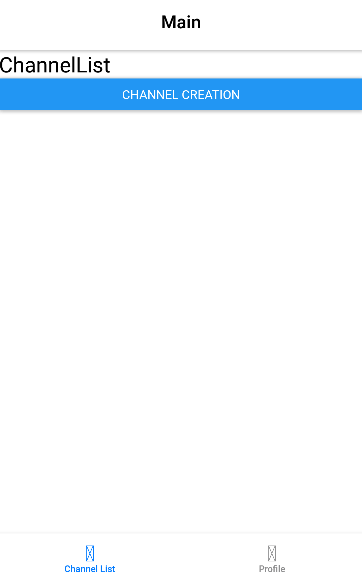

- 화면 이동이 잘 되는지 테스트 해보자.

## 인증과 화면 전환
- 인증상태에 따라 MainStack 내비게이션과 AuthStack 내비게이션을 렌더링을 해보자.
- 애플리케이션이 시작되면 AuthStack 내비게이션이 렌더링되어야 한다.
- 로그인 혹은 회원가입을 통해 인증에 성공하면 MainStack 내비게이션이 렌더링되어야 한다.
- 인증 후 로그아웃을 통해 인증 상태가 사라지면 다시 AuthStack내비게이션이 렌더링되어야 한다.

### 인증상태의 관리
- 여러 곳에서 상태를 변경해야 하는 경우 Spinner 컴포넌트 처럼 Context API를 이용하면 수월하게 전역적으로 관리할 수 있다.
- UserContext를 만들고 인증 상태에 따라 적절한 내비게이션이 렌더링되도록 하자.

### context/User.js

```js
import React,{useState, createContext} from "react";

const UserContext = createContext({
    user: { email:null, uid:null},
    dispatch: () => {},
});

const UserProvider = ({ children}) => {
    const [user, setUser] = useState({});
    const dispatch = ({email, uid}) => {
        setUser({email,uid})
    };
    const value={ user, dispatch};
    return <UserContext.Provider value={value}>
        {children}
    </UserContext.Provider>
}

export {UserContext, UserProvider}
```

### contexts/index.js
```js
import {ProgressContext, ProgressProvider} from './Progress'
import { UserContext, UserProvider } from './User';

export {ProgressContext,ProgressProvider, UserContext, UserProvider};
```

### src/App.js
```js
...
import { ProgressProvider, UserProvider } from './contexts';

...

const App = () => {
...

    return (
        // 로딩 완료 시 앱의 실제 UI를 렌더링
        <ThemeProvider theme={theme}>
            <UserProvider>
                <ProgressProvider>
                    <StatusBar barStyle="dark-content" /> 
                    <Navigation />
                </ProgressProvider>
            </UserProvider>
        </ThemeProvider>
    )
};

export default App;
```

### navigations/index.js
```js
...
import { ProgressContext, UserContext } from "../contexts";
import MainStack from "./MainStack";

const Navigation = () => {
    const {inProgress} = useContext(ProgressContext);
    const {user} = useContext(UserContext);

    return(
        <NavigationContainer>
            {user?.uid && user?.email ? <MainStack /> : <AuthStack />}
            {inProgress && <Spinner />}
        </NavigationContainer>
    )
}

export default Navigation;
```
- user의 uid와 email값이 존재하면 인증된 것으로 판단하고 MainStack 내비게이션을 렌더링하도록 작성했다.

### screens/Login.js
```js
import React,{useRef, useState, useEffect, useContext} from 'react';
import { ProgressContext,UserContext } from '../contexts';
...

const Login = ({ navigation }) => {
    const {spinner} = useContext(ProgressContext);
    const {dispatch} = useContext(UserContext);

    ...

    const _handleLoginButtonPress = async() => {
      try {
        spinner.start();
        const user = await login({email, password});
        //UserContext의 dispatch함수를 통해 user의 상태가 인증된 사용자 정보로 변경된다.
        dispatch(user);
        Alert.alert('Login Success', user.email);
      } catch (error) {
        Alert.alert('Login Error', error.message);
      } finally{
        spinner.stop();
      }
    };

    ...
```

### screens/Signup.js
- 회원가입 화면에서도 회원가입 성공 시 UserContext의 user 상태가 변경되도록 수정하자
```js
import React,{useEffect,useRef, useState, useContext} from 'react';
import { ProgressContext,UserContext } from '../contexts';
...

const Signup = () => {

  const {spinner} = useContext(ProgressContext);

  const {dispatch} = useContext(UserContext);

  ...

  const _handleSignupButtonPress = async () => {
    try {
      spinner.start();
      const user = await signup({email, password, name, photoUrl});
      dispatch(user);
      console.log(user);
      Alert.alert('Signup Success',user.email);
    } catch (error) {
      Alert.alert('Signup Error', error.message);
    } finally{
      spinner.stop();
    }
  };

  return (...);
};

export default Signup;
```

## 로그아웃
- 로그아웃을 통해 인증 상태를 해제하고 다시 AuthStack 내비게이션이 렌더링되도록 만들어보자.

### firebase.js
```js
...

// (2) 로그아웃
export const logout = async () => {
  // 현재 로그인된 사용자 세션을 종료 (Promise 반환)
  return await auth.signOut();
};
```

### screens/Profile.js
```js
import React,{useContext} from "react";
import styled from "styled-components";
import { Button } from "../components";
import { logout } from "../utils/firebase";
import { UserContext } from "../contexts";

const Container = styled.View`
    flex : 1;
    background-color : ${({ theme}) => theme.background};
`

const Profile = () => {
    const {dispatch} = useContext(UserContext);

    const _handleLogoutButtonPress = async () => {
        try {
            await logout();
        } catch (e) {
            console.log('[Profile] logout: ',e.message);
        } finally{
            dispatch({});
        }
    }
    return(
            <Container>
                <Button title="logout" onPress={_handleLogoutButtonPress} />
            </Container>
        )
}

export default Profile;
```
- 프로필 화면에 로그아웃 버튼을 추가하고 firebase.js에 있는 logout함수가 호출되도록 작성했다.
- logout함수가 완료되면 UserContext의 dispatch함수를 이용해 user의 상태를 변경하고 AuthStack 내비게이션이 렌도링되도록 만들었다.

## 프로필 화면
- 탭버튼에 아이콘을 추가하고 프로필 화면에서는 사용자의 사진을 변경할 수 있는 기능을 추가해보자.

### theme.js
```js
export const theme = {
    ...
    headerTintColor : colors.black,
    tabActiveColor: colors.blue,
    tabInactiveColor : colors.grey_1,
    ...
}
```

### MainTab.js
- 탭 버튼에 아이콘을 추가하고 활성화 상태에서 사용하는 색을 변경하자
```js
import React,{useContext} from "react";
import { createBottomTabNavigator } from "@react-navigation/bottom-tabs";
import { Profile, ChannelList } from "../screens";
import {MaterialIcons} from '@expo/vector-icons'
import { ThemeContext } from "styled-components";

const Tab = createBottomTabNavigator();

const TabBarIcon = ({ focused, name}) => {
    const theme = useContext(ThemeContext);
    return(
        <MaterialIcons
            name={name}
            size={26}
            color={focused ? theme.tabActiveColor : theme.tabInactiveColor}
        />
    )
}

const MainTab = () => {
    const theme = useContext(ThemeContext);
    return(
        <Tab.Navigator
            screenOptions={{
                headerShown: false,
                tabBarActiveTintColor: theme.tabActiveColor,
                tabInactiveColor: theme.tabInactiveColor,
            }}>
            <Tab.Screen 
                name="Channel List" 
                component={ChannelList} 
                options={{
                    tabBarIcon: ({focused}) =>
                        TabBarIcon({
                            focused,
                            name: focused ? 'chat-bubble' : 'chat-bubble-outline',
                        }),
                }}
            />
            <Tab.Screen 
                name="Profile" 
                component={Profile}
                options={{
                    tabBarIcon: ({focused}) =>
                        TabBarIcon({
                            focused,
                            name: focused ? 'person' : 'person-outline',
                        }),
                }}
            />
        </Tab.Navigator>
    )
}

export default MainTab;
```

## 프로필화면
- 사용자의 정보를 확인할 수 있고, 사진을 변경할 수 있는 기능과 로그아웃 기능을 구현할 것이다.

### theme.js
- 로그아웃 버튼의 배경색으로 사용할 값을 지정한다.
```js
export const theme = {
    ...
    buttonBackground : colors.blue,
    buttonTitle : colors.white,
    buttonUnfilledTitle : colors.blue,
    buttonLogout: colors.red,
    ...
}
```

### firebase.js
- 현재 접속한 사용자의 정보를 반환하는 함수와 사용자의 사진을 수정하는 함수를 작성한다.
```js
...

// (3) 현재 로그인한 사용자 정보 가져오기
export const getCurrentUser = () => {
  // auth.currentUser가 로그인된 사용자 객체를 반환
  const { uid, displayName, email, photoURL } = auth.currentUser;
  console.log(`displayName: ${displayName}`);
  // 우리가 원하는 형태로 가공해서 반환
  return {
    uid,
    name: displayName,
    email,
    photoUrl: photoURL,
  };
};

// (4) 사용자 프로필 사진 업데이트
export const updateUserPhoto = async photoUrl => {
  // 현재 로그인한 사용자 객체
  const user = auth.currentUser;
  // 만약 photoUrl이 HTTPS로 시작하면 이미 URL이므로 그대로 사용
  // 그렇지 않으면 업로드 과정을 거친 뒤 Firebase Storage URL 획득
  const storageUrl = photoUrl.startsWith('https')
    ? photoUrl
    : await uploadImage(photoUrl);

  // Firebase Auth의 updateProfile로 프로필 사진 주소 수정
  await updateProfile(user, { photoURL: storageUrl });

  // 업데이트된 사용자 정보 반환
  return {
    name: user.displayName,
    email: user.email,
    photoUrl: user.photoURL,
  };
};
```

### Profile.js
- 위에서 작성한 함수를 이용해 프로필 화면을 구현해보자
```js
import React,{useContext,useState} from "react";
import styled,{ThemeContext} from "styled-components";
import { Button,Image,Input } from "../components";
import { logout, getCurrentUser, updateUserPhoto } from "../utils/firebase";
import { UserContext, ProgressContext } from "../contexts";
import { Alert } from "react-native";

const Container = styled.View`
    flex : 1;
    background-color : ${({ theme}) => theme.background};
    justify-content : center;
    align-items : center;
    padding : 0 20px;
`

const Profile = () => {
    const {dispatch} = useContext(UserContext);
    const {spinner} = useContext(ProgressContext);
    const theme = useContext(ThemeContext);

    const user = getCurrentUser();
    const [photoUrl, setPhotoUrl] = useState(user.photoUrl);

    const _handleLogoutButtonPress = async () => {
        try {
            spinner.start();
            await logout();
        } catch (e) {
            console.log('[Profile] logout: ',e.message);
        } finally{
            dispatch({});
            spinner.stop();
        }
    }

    const _handlePhotoChange = async url=> {
        try {
            spinner.start();
            const updateUser = await updateUserPhoto(url);
            setPhotoUrl(updateUser.photoUrl);
        } catch (e) {
            Alert.alert('Photo Error', e.message);
        } finally{
            spinner.stop();
        }
    }


    return(
            <Container>
                <Image
                    url={photoUrl}
                    onChangeImage={_handlePhotoChange}
                    showButton
                    rounded
                />
                <Input label="Name" value={user.name} />
                <Input label="Email" value={user.email} />
                <Button
                    title="logout"
                    onPress={_handleLogoutButtonPress}
                    containerStyle={{ marginTop:30, backgroundColor: theme.buttonLogout}}
                />
            </Container>
        )
}

export default Profile;
```
- 프로필 화면에서는 사용자의 이름이나 이메일을 수정하는 기능을 제공하지 않으므로 Input 컴포넌트에서 입력이 불가능하게 해야한다.

### theme.js
```js
export const theme = {
    ...
    inputPlaceholder : colors.grey_1,
    inputBorder : colors.grey_1,
    inputDisabledBackground: colors.grey_0,
    ... 
}
```

### components/Input.js
```js
...

const StyledTextInput = styled.TextInput.attrs(({ theme }) => ({
  placeholderTextColor: theme.inputPlaceholder,
}))`
  background-color: ${({theme, editable }) =>
    editable? theme.background : theme.inputDisabledBackground};
  color: ${({ theme }) => theme.text};
  padding: 20px 10px;
  font-size: 16px;
  border: 1px solid
    ${({ theme, isFocused }) => (isFocused ? theme.text : theme.inputBorder)};
  border-radius: 4px;
`;

const Input = forwardRef(
    (
      {
       ...
       disabled
      },
      ref
    ) => {
        const [isFocused, setIsFocused] = useState(false);
        return (
          <Container>
            <Label isFocused={isFocused}>{label}</Label>
            <StyledTextInput
              ...

              editable={!disabled}
            />
          </Container>
        );
    }
);

Input.defaultProps = {
  onBlur: () => {},
  onChangeText: () => {},
  onSubmitEditing: () => {},
};

Input.propTypes = {
  label: PropTypes.string.isRequired,
  value: PropTypes.string.isRequired,
  onChangeText: PropTypes.func,
  onSubmitEditing: PropTypes.func,
  ...
  disabled: PropTypes.bool,
};

export default Input;
```

### Profile.js
```js
const Profile = () => {
    
    ...

    return(
            <Container>
                ...

                <Input label="Name" value={user.name} disabled />
                <Input label="Email" value={user.email} disabled/>
                
                ...

            </Container>
        )
}

export default Profile;
```

## 헤더 변경
- MainStack 내비게이션에서 MainTab 내비게이션이 화면으로 사용되는 Screen 컴포넌트의 name은 "Main"으로 설정되어 있다.
- 헤더의 타이틀과 관려해 특별히 설정하지 않으면 Screen 컴포넌트의 name에 설정된 값이 헤더의 타이틀로 되기 때문에, 프로필 화면과 채널 목록 화면 모두 "Main"으로 타이틀이 나타나는것을 볼 수 있다.

### navigations/MainTab.js
```js
import React,{useContext, useEffect} from 'react'

...

//route
//state
//{"index":0, "routeName":["Channel List","Profile",],"type":"tab"...}

const MainTab = ({navigation,route}) => {
    const theme = useContext(ThemeContext);

    useEffect(() => {
        const titles = route.state?.routeNames || ['Channels'];
        const index = route.state?.index || 0;
        navigation.setOptions({
            headerTitle:titles[index],
        });
    },[route])
    return(
        <Tab.Navigator
            screenOptions={{
                tabBarActiveTintColor : theme.tabActiveColor,
                tabBarInactiveTintColor : theme.tabInactiveColor,
                headerTitleAlign: 'center',
            }}
        >
            <Tab.Screen 
                name="Channels"
                ...
            />
            <Tab.Screen 
                name="Profile" 
                component={Profile}
                options={{
                    tabBarIcon:({focused}) => TabBarIcon({focused, name:focused ? 'person' : 'person-outline'})
                }}
            />
        </Tab.Navigator>
    )
}

export default MainTab;
```

## 채널 생성 화면
- 채널 생성 화면을 만들고 생성된 채널을 파이어베이스로 관리해보자

## 데이터베이스
- 현재 서버를 구축하지 않았기 때문에 채널 데이터를 관리하기 위해 파이어베이스의 데이터베이스를 활용할 것이다.
- 파이어베이스에서 제공하는 파이어스토어는 NoSQL 문서 중심의 데이터베이스로 SQL 데이터베이스와 달리 테이블이나 행이 없고 컬렉션, 문서, 필드로 구성되어 있다.

### NoSQL
#### 1. 개념
- 다양하고 유연한 데이터 모델을 활용하는 데이터베이스 기술들을 총칭하는 용어입니다. 
- "Not Only SQL"이라는 의미를 가진다.
- 관계형 DB의 단점을 보완하거나 특정 요구 사항을 효율적으로 처리하기 위해 탄생했습니다.

#### 2. 탄생배경
1. **빅데이터 및 대규모 트래픽 처리 요구**
  - 인터넷 서비스가 폭발적으로 성장하면서, 데이터 양과 트랜잭션이 방대해짐.
  - 전통적 RDBMS를 대규모로 확장하려면 비용이 많이 들고, 스키마(테이블 구조) 변경도 까다로움.

2. **유연한 스키마의 필요성**
  - 웹/모바일 애플리케이션에서 데이터 형태가 자주 변하거나, 구조가 불규칙적인 경우가 늘어남.
  - RDBMS는 스키마 변경 시 마이그레이션이 필수이나, 개발 속도가 중요한 스타트업 환경 등에서는 비효율적.

3. **분산 시스템 설계**
  - 규모가 커질수록 수평 확장(Scale-out) 방식이 유리한데, RDBMS는 공유 저장소나 쿼리 복잡성 때문에 분산에 한계가 있음.
  - NoSQL은 애초에 분산 환경을 염두에 두어 설계된 경우가 많음.

#### 3. 주요특성
1. **수평 확장성(Scalability)**
  - 여러 노드(서버)로 데이터를 샤딩(Sharding)해 저장하고 트래픽을 분산 처리함.
  - 대규모 시스템에서 확장 비용이 낮아지고, 성능이 향상될 수 있음.

2. **유연한 스키마(Flexible Schema)**
  - RDB의 테이블-행-열 구조와 달리, 컬렉션-문서 구조나 키-값 구조 등 다양한 형태를 지원.
  - 구조를 사전에 엄격히 정의하지 않아도 되므로 애플리케이션 요구사항 변동에 빠르게 대응 가능.

3. **고성능 처리(High Performance)**
  - 단순 키-값 접근, 인덱스 최적화, 메모리 기반 저장 등 다양한 기법으로 빠른 읽기/쓰기를 제공.
  - 일부 NoSQL DB는 ACID 트랜잭션을 부분적으로만 지원하거나 eventually consistent(최종적 일관성) 모델을 사용해 성능을 극대화하기도 함.

3. **CAP 이론과 Trade-off**
  - CAP 이론(Consistency, Availability, Partition tolerance)에서, NoSQL DB는 일반적으로 AP 또는 CP를 지향하는 경우가 많음.
  - 분산 환경에서 완벽한 일관성과 높은 가용성을 동시에 만족하기는 어려워, 시스템 요구사항에 따라 우선순위를 정함.

#### 3. NoSQL의 유형
- NoSQL 데이터베이스는 크게 4가지 유형으로 분류할 수 있습니다.

1. **Key-Value 스토어**
  - 단순한 (키, 값) 쌍으로 데이터를 저장.
  - 예) Redis, Riak, Amazon DynamoDB
  - 특징: 빠른 읽기/쓰기 속도, 단순한 쿼리 모델, 대규모 캐싱이나 세션 저장 등에 활용.

2. **문서(Document) 기반**
  - JSON, BSON 등 문서 형태로 데이터를 저장 (필드, 중첩 객체, 배열 등을 자유롭게 포함).
  - 예) MongoDB, CouchDB, Firestore, Cosmos DB
  - 특징: 동적 스키마, 개발 언어와 자연스러운 매핑(특히 JS 환경), 쿼리 기능 다양.

3. **컬럼(Column) 기반** (Wide-Column Store)
  - 테이블처럼 보이지만, 각 행(row)이 매우 많은 컬럼들을 동적으로 갖거나, 특정 컬럼 패밀리(Column Family)로 묶어 관리.
  - 예) Apache Cassandra, HBase, ScyllaDB
  - 특징: 수평 확장성 뛰어남, 대규모 쓰기/조회에 강함, 통신/로그/IoT 데이터 같은 시계열 처리에 많이 사용.

4. **그래프(Graph) 기반**
  - 노드(Node)와 엣지(Edge) 구조로, 관계를 1차적인 데이터 모델로 삼음.
  - 예) Neo4j, JanusGraph, ArangoDB(멀티 모델)
  - 특징: 그래프 탐색, 추천 알고리즘, 소셜 네트워크 분석, 경로 찾기 등에 최적화.

#### 4. 장단점
**장점**
- 높은 확장성: 여러 노드에 데이터를 분산하여 대규모 데이터와 트래픽을 처리 가능.
- 유연한 스키마: 개발 초기 구조가 확정되지 않아도 빠르게 시작해, 변경 시에도 부담이 적음.
- 높은 성능: 키-값 접근, 단순 쿼리 구조 등으로 읽기/쓰기 성능이 뛰어남.

**단점**
- 관계 연산의 어려움: RDB의 JOIN 같은 복잡한 관계 쿼리에 불리할 수 있음(별도 설계 필요).
- 일관성 문제: 분산 시스템에서 완벽한 ACID 트랜잭션 보장이 어려운 경우가 있음(점차 개선 추세).
- 표준화 부족: SQL처럼 표준화된 쿼리 언어가 없어, DB 제품별로 API/쿼리 문법이 상이함.

### 문서기반 NoSQL
- 각 데이터를 독립적인 ‘문서’(Document) 형태로 저장하는 비관계형 데이터베이스 유형 중 하나다.
- 문서(Document) 기반 NoSQL 데이터베이스에서는 컬렉션(Collection), 문서(Document), 필드(Field)라는 개념이 핵심을 이룬다.
- 관계형 데이터베이스(RDBMS)의 테이블, 행(Row), 열(Column) 개념과 비슷하게 대응될 수 있지만, 훨씬 유연하고 동적인 구조를 지닌다.

### 1. 컬렉션
#### 1. 정의
- 컬렉션은 여러 문서를 담는 논리적 그룹이다.
- 관계형 DB의 ‘테이블’(Table)과 유사한 개념으로, 특정 주제나 목적에 따라 문서들을 묶어서 보관하는 역할을 한다.
- 예를 들어 사용자 관련 정보를 저장하는 users 컬렉션, 제품 정보를 저장하는 products 컬렉션과 같이 구분할 수 있다.

#### 2. 특징
- 컬렉션에는 일정한 스키마(컬럼 구조)가 강제되지 않는다.
- 예: users 컬렉션 안에 있는 각각의 문서가 서로 다른 필드를 가질 수 있음.
- 일반적으로 컬렉션 이름만 지정하면 별도의 스키마 정의 없이도 문서를 생성/저장할 수 있다.
- 각 컬렉션별로 인덱스를 설정할 수 있으며, 효율적인 쿼리(검색)를 위해 필드에 인덱스를 걸 수 있다.

### 2. 문서(Document)
#### 1. 정의
- 문서는 컬렉션 내에 저장되는 데이터의 실제 단위로, 각 문서는 독립적인 객체(오브젝트) 형태다.
- JSON 형식(또는 그 변형인 BSON 등)을 사용하여 데이터를 구조화한다.
- 관계형 DB에서 행(Row)에 대응되지만, 훨씬 유연한 구조(배열, 중첩 객체 등)를 담을 수 있다.
#### 2. 문서의 구조
- 문서는 일반적으로 필드(Field)와 값(Value) 쌍을 여러 개 포함하는 JSON 형태다.
- 값에는 문자열, 숫자, 불리언, 배열, 객체(중첩 문서) 등 다양한 형태가 올 수 있다.

### 3. 필드(Field)
#### 1. 정의
- 필드는 문서 안에 있는 데이터 속성(키-값 쌍의 키)을 의미한다.
- 예: 이름, 이메일, 나이, 주소 등 문서가 담고 있는 각각의 속성이 필드다.
#### 2. 자료형(타입)
- 문서 기반 DB는 다양한 자료형을 지원한다.
- 기본 타입: 문자열(String), 숫자(Number), 불리언(Boolean), 날짜(Date), Null 등
- 복합 타입: 배열(Array), 중첩 객체(Object), 이진 데이터(Binary) 등
특정 필드는 한 문서에서는 문자열, 다른 문서에서는 숫자로 쓰이는 식으로도 가능하나(권장되진 않음), DB 레벨에서 제약을 두지 않는 경우가 많다.
#### 3. 인덱스(Index)
- 자주 검색되는(또는 정렬, 범위 조회가 필요한) 필드에 인덱스를 설정할 수 있다.
- 인덱스를 제대로 구성하면 대량의 문서 중에서도 빠른 조회가 가능하지만, 쓰기 성능이 약간 떨어질 수 있다는 점을 고려해야 한다.


### Firestore
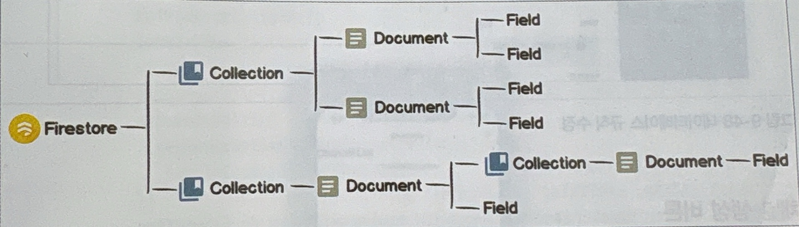
- Firebase의 NoSQL 클라우드 데이터베이스로,  일반적인 데이터베이스와 달리 데이터베이스의 내용이 수정되면 실시간으로 변경된 내용을 알 수 있다는 특징을 갖고 있다.
- 컬렉션과 문서는 항상 유일한 ID를 갖고 있어야 한다는 규칙이 있다.
- 여기서는 channels라는 ID를 가진 하나의 컬렉션을 만들고 생성되는 채널들을 channels 컬렉션에 문서로 저장할 것이다.
- 파이어스토어는 채널 생성 시 ID를 지정하지 않으면 자동으로 중복되지 않는 ID를 생성해서 문서의 ID로 이용한다.
- 따라서 자동으로 생성되는 문서의 ID를 이용해 채널의 문서 ID가 중복되지 않도록 관리 할 것이다.
- 마지막으로 인증에 성공한 사용자만 데이터베이스를 읽거나 쓸 수 있도록 데이터베이스의 보안 규칙을 수정하자
```
rules_version = '2';

service cloud.firestore {
  match /databases/{database}/documents {
    match /channels/{channel} {
      allow read, write: if request.auth.uid != null;
    }
  }
}
```
### Firestore의 주요 함수 정리
**1. 컬렉션 문서 참조**
- Firestore에서 데이터를 다루려면 collection()과 doc()를 사용해 컬렉션 또는 문서를 참조해야 한다.
#### collection(db,path)
- 특정 컬렉션을 참조하는 객체를 반환
```js
import { collection } from "firebase/firestore";
const usersRef = collection(db, "users");
```

#### doc(db,path,documentId)
- 특정 문서를 참조하는 객체를 반환함
```js
import { doc } from "firebase/firestore";
const userRef = doc(db, "users", "user123"); // "users" 컬렉션의 "user123" 문서
```

**2. 데이터 추가 및 수정**
- Firestore에 데이터를 추가하거나 수정할 때 사용되는 함수
#### setDoc(docRef,data,options?)
- 문서가 없으면 새로운 문서를 추가한다.
- 문서가 존재하면 덮어쓰기(기본값)
- ```merge:true``` 옵션을 주면 기존 데이터를 유지하면서 일부 필드만 업데이트가 가능하다
```js
import { setDoc, doc } from "firebase/firestore";

//1. 문서를 참조해온다.
const userRef = doc(db, "users", "user123");

//2. 참조한 문서에 
await setDoc(userRef, {
  name: "Alice",
  age: 25
});
```

#### addDoc(collectionRef, data)
- 문서를 추가하고 자동으로 ID를 생성한다
```js
import { addDoc, collection } from "firebase/firestore";

const usersRef = collection(db, "users");

const docRef = await addDoc(usersRef, {
  name: "Bob",
  age: 30
});

console.log("Document added with ID:", docRef.id);
```

#### updateDoc(docRef, data)
- 기존 문서의 일부 필드만 업데이트한다.
- 문서가 없으면 에러 발생
```js
import { updateDoc, doc } from "firebase/firestore";

const userRef = doc(db, "users", "user123");

await updateDoc(userRef, {
  age: 27
});
```

#### deleteField()
- 문서의 특정 필드를 삭제한다
```js
import { updateDoc, doc, deleteField } from "firebase/firestore";

await updateDoc(userRef, {
  age: deleteField()
});
```

**3. 데이터 읽기**
- FireStore에서 데이터를 가져올 때 사용하는 함수들이다

#### getDoc(docRef)
- 특정 문서를 한번 가져온다.
```js
import { getDoc, doc } from "firebase/firestore";

const userRef = doc(db, "users", "user123");
const docSnap = await getDoc(userRef);

if (docSnap.exists()) {
  console.log("User Data:", docSnap.data());
} else {
  console.log("No such document!");
}
```

#### getDocs(collectionRef)
- 특정 컬렉션의 모든 문서를 가져온다
- 해당 컬렉션의 직속 문서들만 가져오고 하위 컬렉션은 포함되지 않는다.
```
users (컬렉션)
 ├── user1 (문서)
 │    ├── posts (컬렉션) ❌ getDocs()에서 가져오지 않음
 │    ├── messages (컬렉션) ❌ getDocs()에서 가져오지 않음
 ├── user2 (문서)
 │    ├── posts (컬렉션) ❌ getDocs()에서 가져오지 않음
```
```js
import { getDocs, collection } from "firebase/firestore";

const usersRef = collection(db, "users");
const querySnapshot = await getDocs(usersRef);

querySnapshot.forEach(doc => {
  console.log(doc.id, "=>", doc.data());
});
```

**4. 실시간 데이터 구독**
- Firestore는 실시간 데이터를 구독할 수 있도록 제공한다.

#### onSnapshot(docRef, callback)
- 문서가 변경될 때마다 자동으로 호출되는 실시간 리스너
```js
import { doc, onSnapshot } from "firebase/firestore";

const userRef = doc(db, "users", "user123");

onSnapshot(userRef, (docSnap) => {
  if (docSnap.exists()) {
    console.log("Real-time data:", docSnap.data());
  } else {
    console.log("Document does not exist");
  }
});
```

#### onSnapshot(query, callback)
- 특정 조건을 만족하는 문서들의 변화를 실시간으로 감지
```js
import { collection, query, onSnapshot, orderBy } from "firebase/firestore";

const usersRef = collection(db, "users");
const q = query(usersRef, orderBy("age"));

onSnapshot(q, (querySnapshot) => {
  querySnapshot.forEach(doc => {
    console.log("Real-time collection update:", doc.data());
  });
});
```

**5. 쿼리(Query)**
- Firestore에서 데이터를 특정 조건으로 필터링할 때 사용한다.

#### query(collectionRef, where(...))
- 특정 조건을 만족하는 문서를 가져올 때 사용
```js
import { collection, query, where, getDocs } from "firebase/firestore";

const usersRef = collection(db, "users");
const q = query(usersRef, where("age", ">", 20));

const querySnapshot = await getDocs(q);
querySnapshot.forEach(doc => {
  console.log("Filtered data:", doc.data());
});
```


## 채널 생성 버튼
- 채널 목록 화면의 헤더에 채널 생성 화면으로 이동할 수 있는 버튼을 만들자

### MainTab.js
```js
...

const MainTab = ({navigation, route}) => {
    ...

    return(
        <Tab.Navigator
            screenOptions={{
                tabBarActiveTintColor: theme.tabActiveColor,
                tabInactiveColor: theme.tabInactiveColor,
                headerTitleAlign: 'center',
            }}>
            <Tab.Screen 
                ...
                headerRight: () =>
                    (
                        <MaterialIcons
                            name="add"
                            size={26}
                            style={{margin:10}}
                            onPress={() => navigation.navigate('Channel Creation')}
                        />
                    )
                }}
            />
          ...
        </Tab.Navigator>
    )
}

export default MainTab;
```

## 채널 생성
- 채널 생성 화면을 수정하고 데이터베이스에 채널 문서를 생성하는 기능을 만들어보자.
- 채널 생성 화면의 구성은 앞서 만든 컴포넌트를 활용하자

### screens/ChannelCreation.js
```js
import React, { useState, useRef, useEffect } from 'react';
// 필요 없는 import는 정리할 수 있습니다. (예: useContext가 사용되지 않음)
import styled from 'styled-components';
import { Input, Button } from '../components';
import { KeyboardAwareScrollView } from 'react-native-keyboard-aware-scroll-view';

// 화면 전체를 감싸는 컨테이너
const Container = styled.View`
  flex: 1;
  background-color: ${({ theme }) => theme.background};
  justify-content: center;
  align-items: center;
  padding: 0 20px;
`;

// 에러 메시지를 표시할 텍스트
const ErrorText = styled.Text`
  align-items: flex-start;
  width: 100%;
  height: 20px;
  margin-bottom: 10px;
  line-height: 20px;
  color: ${({ theme }) => theme.errorText};
`;

const ChannelCreation = ({ navigation }) => {
  // 타이틀과 설명을 관리하는 상태 변수
  const [title, setTitle] = useState('');
  const [description, setDescription] = useState('');

  // 입력창 중에서 'description' 인풋에 포커스를 주기 위해 useRef 활용
  const descriptionRef = useRef();

  // 타이틀이 비었을 때 표시할 에러 메시지 상태
  const [errorMessage, setErrorMessage] = useState('');

  // “Create” 버튼 활성/비활성 관리를 위한 상태
  const [disabled, setDisabled] = useState(true);

  // title, description, errorMessage 상태가 바뀔 때마다 disabled 여부를 갱신
  // 현재 로직상 'title'이 없거나 에러가 있으면 버튼이 disabled 상태가 됨
  useEffect(() => {
    setDisabled(!(title && !errorMessage));
  }, [title, description, errorMessage]);

  // 타이틀이 변경될 때 호출되는 함수
  // 공백만 입력되었는지 체크 후 에러 메시지를 업데이트
  const _handleTitleChange = (title) => {
    setTitle(title);
    setErrorMessage(title.trim() ? '' : 'Please enter the title.');
  };

  // “Create” 버튼을 눌렀을 때 동작할 함수
  // 실제 채널 생성 로직(예: 서버 API 호출 등)을 작성할 수 있음
  const _handleCreateButtonPress = () => {
    // 예: API를 호출하거나, Redux action dispatch 등
    console.log('Channel created with:', { title, description });
  };

  return (
    <KeyboardAwareScrollView
      contentContainerStyle={{ flex: 1 }}
      extraScrollHeight={20}
    >
      <Container>
        {/* 타이틀 입력 */}
        <Input
          label="Title"
          value={title}
          onChangeText={_handleTitleChange}
          onSubmitEditing={() => {
            // 타이틀 양끝 공백 제거 후 description 입력창으로 이동
            setTitle(title.trim());
            descriptionRef.current.focus();
          }}
          onBlur={() => setTitle(title.trim())}
          placeholder="Title"
          returnKeyType="next"
          maxLength={20}
        />
        {/* 설명 입력 */}
        <Input
          ref={descriptionRef}
          label="Description"
          value={description}
          onChangeText={(text) => setDescription(text)}
          onSubmitEditing={() => {
            setDescription(description.trim());
            _handleCreateButtonPress();
          }}
          onBlur={() => setDescription(description.trim())}
          placeholder="Description"
          returnKeyType="done"
          maxLength={40}
        />
        {/* 에러 메시지 표시 영역 */}
        <ErrorText>{errorMessage}</ErrorText>
        {/* 채널 생성 버튼 (비활성화 여부는 disabled 상태로 제어) */}
        <Button
          title="Create"
          onPress={_handleCreateButtonPress}
          disabled={disabled}
        />
      </Container>
    </KeyboardAwareScrollView>
  );
};

export default ChannelCreation;
```

### firebase.js
- 데이터베이스에 채널을 생성하는 함수를 만들자.
```js
// 필요한 Firebase 함수만 선택적으로 임포트
import { initializeApp } from 'firebase/app';
import {
  getAuth,
  updateProfile,
  signInWithEmailAndPassword,
  createUserWithEmailAndPassword,
} from 'firebase/auth';
import {
  getStorage,
  ref,
  uploadBytes,
  getDownloadURL,
} from 'firebase/storage';
import {
  getFirestore,
  collection,
  doc,
  setDoc,
} from 'firebase/firestore';
// Firebase 설정 정보 가져오기 (firebase.json을 통해 설정)
import config from '../../firebase.json';

// ------------------
// 1) Firebase 초기화
// ------------------

// Firebase 앱 초기화 (firebase.json 파일에 담긴 config 사용)
export const app = initializeApp(config);

// 인증 모듈 가져오기
const auth = getAuth(app);

// 스토리지 모듈 가져오기
const storage = getStorage(app);

// 파이어스토어 DB 모듈 가져오기
export const db = getFirestore(app);

...

// 문서(채널) 생성하기
export const createChannel = async ({ title, description }) => {
  // 1) 'channels' 컬렉션 참조 가져오기
  const channelCollection = collection(db, 'channels');

  // 2) 새 문서에 대한 참조 생성 (자동으로 ID가 부여됨)
  const newChannelRef = doc(channelCollection);

  // 3) 채널에 할당될 고유 ID
  const id = newChannelRef.id;

  // 4) 새 채널에 들어갈 필드값 구성
  const newChannel = {
    id,
    title,
    description,
    createdAt: Date.now(), // 타임스탬프 (epoch) 사용
  };

  // 5) setDoc으로 해당 문서 경로에 데이터 쓰기
  //    doc() 참조에서 setDoc()을 호출
  await setDoc(newChannelRef, newChannel);

  // 6) 생성된 문서 ID 반환
  return id;
};
```

### ChannelCreation.js
```js
import React, { useState, useRef, useEffect, useContext } from 'react';
import { Alert } from 'react-native';
// 로딩 스피너 컨텍스트 (프로젝트 전역에서 스피너 상태를 관리할 수 있는 Context)
import { ProgressContext } from '../contexts';
// Firebase Firestore에서 채널을 생성하는 유틸 함수
import { createChannel } from '../utils/firebase';

...

// 실제 화면 컴포넌트
const ChannelCreation = ({ navigation }) => {
  // ProgressContext에서 스피너 객체 가져오기
  const { spinner } = useContext(ProgressContext);

  ...
  // 채널 생성 버튼을 눌렀을 때 실행되는 함수 (비동기)
  const _handleCreateButtonPress = async () => {
    try {
      // 스피너 표시 시작
      spinner.start();
      // Firebase에 채널 생성 후, 생성된 문서의 id 반환
      const id = await createChannel({ title, description });
      // 생성된 채널 화면으로 이동하며, id와 title 정보를 함께 전달
      // replace를 사용해 현재 스택을 교체(뒤로 가기 시 이전 화면이 아닌 다른 화면으로 돌아갈 때 사용)
      navigation.replace('Channel', { id, title });
    } catch (e) {
      // 만약 에러가 발생하면 Alert로 사용자에게 표시
      Alert.alert('Creation Error', e.message);
    } finally {
      // 에러 발생 여부와 무관하게 스피너 중단
      spinner.stop();
    }
  };

  return (...);
};

export default ChannelCreation;
```
- 채널 생성이 완료되면 채널 생성 화면을 남겨놓은 상태에서 생성된 채널로 이동하는 것이 아니라, 채널 생성 화면을 제거하고 새로 생성된 채널로 이동하는것이 일반적이다.
- 채널 생성 화면에서도 동일하게 동작하도록 navigation의 replace함수를 사용했다.
- replace함수는 navigate 함수처럼 화면을 이동하지만, 현재 화면을 스택에 유지하지 않고 새로운 화면과 교체하면서 화면을 이동한다는 특징이 있다.

### Channels.js
- 채널 생성이 완료되고 채널 화면으로 이동하면서 현재 입장하는 채널의 ID와 제목을 params로 전달해 화면에 출력해보자.
```js
import React from "react";
import styled from "styled-components";
import {Text} from 'react-native'

const Container = styled.View`
    flex: 1;
    background-color: ${({theme})=> theme.background};
`;

const Channel = ({route}) => {
    return(
        <Container>
            <Text style={{fontSize : 24}}>{route.params?.id}</Text>
            <Text style={{fontSize : 24}}>{route.params?.title}</Text>
        </Container>
    )
}

export default Channel;
```


- 채널을 생성하면 생성된 채널의 정보와 함께 채널 화면으로 이동하고, 뒤로 가기 버튼을 클릭하면 채널 생성 화면이 아니라 채널 목록 화면으로 이동하는 것을 확인할 수 있다.
- 파이어베이스 콘솔에서도 생성된 채널 문서와 내용을 확인할 수 있다.

## 채널 목록 화면
- 생성된 채널을 보여주는 채널 목록 화면을 만들어보자
- 많은 양의 채널을 목록으로 사용자에게 보여줄 수 있으며, 채널이 새로 생성되면 자동으로 채널 목록에 추가되도록 화면을 만들어보자

### theme.js
- 채널 목록 화면에서 FlatList 컴포넌트를 이용해 생성된 채널들을 렌더링하도록 만들어보자.
- 채널 목록 화면에서 사용할 색을 theme.js파일에 정의한다.
```js
export const theme = {
   ...
    listTime: colors.grey_1,
    listDescription: colors.grey_1,
    listIcon: colors.black,
}
```

### FlatList 컴포넌트
- 화면에 적절한 양의 데이터만 렌더링하고 스크롤의 이동에 맞춰 필요한 부분을 추가적으로 렌더링하는 특징이 있다.
- 덕분에 데이터의 길이가 가변적이고 양을 예측할 수 없는 상황에서 사용하기 좋다.

### ChannelList.js
```js
import React,{useContext} from "react";
import styled,{ThemeContext} from "styled-components";
import {FlatList} from 'react-native'
import {MaterialIcons} from '@expo/vector-icons'


const Container = styled.View`
    flex : 1;
    background-color : ${({ theme}) => theme.background};
`

const ItemContainer = styled.TouchableOpacity`
  flex-direction: row;
  align-items: center;
  border-bottom-width: 1px;
  border-color: ${({ theme }) => theme.listBorder};
  padding: 15px 20px;
`;
const ItemTextContainer = styled.View`
  flex: 1;
  flex-direction: column;
`;
const ItemTitle = styled.Text`
  font-size: 20px;
  font-weight: 600;
`;
const ItemDescription = styled.Text`
  font-size: 16px;
  margin-top: 5px;
  color: ${({ theme }) => theme.listDescription};
`;
const ItemTime = styled.Text`
  font-size: 12px;
  color: ${({ theme }) => theme.listTime};
`;

const channels = [];
for(let idx = 0; idx<100; idx++){
    channels.push({
        id:idx,
        title: `title ${idx}`,
        description: `description ${idx}`,
        createAt: idx,
    })
}

const Item = ({ item: { id, title, description, createdAt }, onPress }) => {
      const theme = useContext(ThemeContext);
      console.log(`Item: ${id}`);
      
      return (
        <ItemContainer onPress={() => onPress({ id, title })}>
          <ItemTextContainer>
            <ItemTitle>{title}</ItemTitle>
            <ItemDescription>{description}</ItemDescription>
          </ItemTextContainer>
          <ItemTime>{createdAt}</ItemTime>
          <MaterialIcons
            name="keyboard-arrow-right"
            size={24}
            color={theme.listIcon}
          />
        </ItemContainer>
      );
    }

const ChannelList = ({navigation}) => {
    const _handleItemPress = params => {
        navigation.navigate('Channel',params);
    }
    return(
        <Container>
           <FlatList
                keyExtractor={item => item['id']}
                data={channels}
                renderItem={({ item }) => (
                <Item item={item} onPress={_handleItemPress} />
                )}
            />
        </Container>
    )
}

export default ChannelList;
```
- 생성한 임의의 데이터를 FlatList 컴포넌트에 항목으로 사용할 데이터로 설정했다.
- renderItem에 작성되는 함수는 파라미터로 항목의 데이터를 가진 item이 포함된 객체가 전달된다.

### windowSize
- FlatList 컴포넌트에서 렌더링되는 데이터의 수는 windowSize 속성에 의해 결정된다.
  windowSize의 기본값은 21이고, 이 값은 현재 화면(1)과 현재 화면보다 앞쪽에 있는 데이터(10), 그리고 현재 화면보다 뒤쪽에 있는 데이터(10)을 의미한다.
- 예를 들어 한 화면에 7개가 렌더링되고 windowSize가 3이라면 이전화면(7) + 현재화면(7) + 다음화면(7) 해서 최대 21개가 렌더링 된다.
- widnowSize의 값을 작은 값으로 변경하면 렌더링 되는 데이터가 줄어들어 메모리의 소비를 줄이고 성능을 향상시킬 수 있지만, 빠르게 스크롤 하는 상황에서 미리 렌더링되지 않은 부분은 순간적으로 빈 내용이 나타날 수 있는 단점이 있다.

### ChannelList.js
```js
<Container>
    <FlatList
        keyExtractor={item => item['id']}
        data={channels}
        renderItem={({ item }) => (
        <Item item={item} onPress={_handleItemPress} />
        )}
        windowSize={3}
    />
</Container>
```

## React.memo
- windowSize를 수정해서 렌더링되는 양을 줄였지만 스크롤을 이동해보면 비효율적인 부분이 보인다.
- 스크롤이 이동하면 windowSize 값에 맞춰 현재 화면과 이전 및 이후 데이터를 렌더링하는 것이 맞지만, 이미 렌더링 된 항목도 다시 렌더링되는것을 확인할 수 있다.
- React.memo는 불필요한 함수의 재연산을 방지하는 useMemo와는 달리 컴포넌트의 리렌더링을 방지하는 차이가 있다.

### ChannelList.js
```js
const Item = React.memo(({ item: { id, title, description, createdAt }, onPress }) => {
      const theme = useContext(ThemeContext);
      console.log(`Item: ${id}`);

      return (
        <ItemContainer onPress={() => onPress({ id, title })}>
          <ItemTextContainer>
            <ItemTitle>{title}</ItemTitle>
            <ItemDescription>{description}</ItemDescription>
          </ItemTextContainer>
          <ItemTime>{createdAt}</ItemTime>
          <MaterialIcons
            name="keyboard-arrow-right"
            size={24}
            color={theme.listIcon}
          />
        </ItemContainer>
      );
    }
)
```

## 채널 데이터 수신
- 파이어베이스의 데이터베이스로부터 데이터를 받아 채널 목록을 렌더링해보자

### ChannelList.js
```js
import React,{useContext,useState,useEffect} from "react";
...
import { collection, query, orderBy, onSnapshot } from 'firebase/firestore';
import { db } from "../utils/firebase";

...

const ChannelList = ({navigation}) => {

    const [channels, setChannels] = useState([]);

    useEffect(() => {
        // 1) Firestore 'channels' 컬렉션에 대한 쿼리 생성
        //    orderBy('createdAt', 'desc') -> createdAt 필드를 기준으로 내림차순 정렬
        const collectionQuery = query(
          collection(db, 'channels'),
          orderBy('createdAt', 'desc')
        );
      
        // 2) onSnapshot: 실시간 리스너(구독) 등록
        // onSnapshot함수는 수신 대기 상태로 있다가 데이터베이스에 문서가 추가되거나 수정될 때마다 지정된 함수가 호출된다.
        // - collectionQuery 결과가 변경될 때마다 snapshot 콜백이 실행
        const unsubscribe = onSnapshot(collectionQuery, snapshot => {
          const list = [];
      
          // 3) snapshot.forEach: 쿼리 결과로 돌아온 모든 문서를 순회
          snapshot.forEach(doc => {
            // doc.data()를 통해 문서의 실제 데이터(객체)를 추출
            list.push(doc.data());
          });
      
          // 4) setChannels를 통해 state에 업데이트
          //    -> 화면이 해당 channels 배열로 다시 렌더링됨
          setChannels(list);
        });
      
        // 5) useEffect의 Cleanup 함수
        //    컴포넌트가 언마운트되거나, 리렌더링으로 이 이펙트가 재실행될 때
        //    기존의 구독을 해제(unsubscribe)한다.
        //수신 대기 상태를 해제하지 않으면 다시 채널 목록 화면이 마운트 될 때 수신 대기 이벤트가 추가되면서 데이터를 중복으로 받는 문제가 발생하기 때문이다.
        return () => unsubscribe();
      
        // 6) 의존성 배열이 비어 있으므로 ([]),
        //    이 이펙트는 컴포넌트 마운트 시 한 번만 실행된다.
      }, []);
      

    const _handleItemPress = params => {
        navigation.navigate('Channel',params);
    }
    return(
        <Container>
           <FlatList
                keyExtractor={item => item['id']}
                ...
            />
        </Container>
    )
}

export default ChannelList;
```
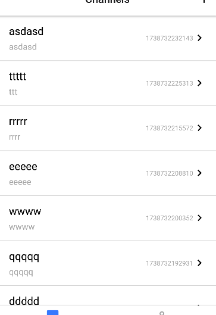

## moment 라이브러리
- 렌더링이 된 채널 목록을 보면 생성된 시간이 타임스탬프로 나타나 정확한 시간을 알아볼 수 없다.
- 자바스크립트에 내장된 함수를 이용하면 타임스탬프를 우리에게 익숙한 시간이나 날자 형태로 변경할 수 있다.
- 하지만 자바스크립트에서 제공하는 기능만으로 기능을 구현하다 보면 조건에 따라 굉장히 복잡해지고 생각하지 못한 버그들도 많이 생긴다.
- moment라이브러리를 사용하면 시간 및 날짜와 관련된 함수를 쉽게 작성할 수 있다.

```
npm install moment
```
### ChannelList.js
- moment라이브러리를 이용해 createdAt필드에 저장된 타임스탬프를 보기좋은 형식으로 변경한다.
```js
...
import moment from "moment";
...

const getDateOrTime = ts => {
    const now = moment().startOf('day');
    const target = moment(ts).startOf('day');
    return moment(ts).format(now.diff(target, 'days') > 0 ? 'MM/DD' : 'HH:mm');
}
...
return (
    <ItemContainer onPress={() => onPress({ id, title })}>
      <ItemTextContainer>
        <ItemTitle>{title}</ItemTitle>
        <ItemDescription>{description}</ItemDescription>
      </ItemTextContainer>
      <ItemTime>{getDateOrTime(createdAt)}</ItemTime>
```

## 채널 화면
- 사용자가 메시지를 주고받을 수 있는 채널 화면을 만들어보자
- channels 컬렉션 아래에서 채널들을 문서로 관리하고 있다.
- 문서 아래에 messages컬렉션을 만들어 메시지 데이터를 관리해보자.
- 이렇게 채널별로 발생한 메시지를 모아서 관리하면 채널에서 주고 받는 메시지를 편하게 저장하고 불러올 수 있다.

### 보안 규칙 수정하기
```
rules_version = '2';

service cloud.firestore {
  match /databases/{database}/documents {
    match /channels/{channel} {
      allow read, write: if request.auth.uid != null;
      match /messages/{message} {
      	allow read, write: if request.auth.uid != null;
      }
    }
  }
}
```

## 메시지 데이터
- 채널 화면도 채널 목록 화면처럼 메시지 데이터의 변화를 실시간으로 전달받기 위해 onSnapshot 함수를 이용하여 수신 대기 상태가 되도록 수정하자.
- 그리고 채널 화면으로 이동할 때 route의 params를 통해 전달된 채널의 문서 ID를 이용하여 채널 문서에 있는 messages 컬렉션의 문서 변화에 대해 수신 대기 상태가 되도록 작성하자

### Channels.js
```js
import React,{useState,useEffect,useLayoutEffect} from "react";
import { db } from "../utils/firebase";
import styled from "styled-components";
import {Text, FlatList} from 'react-native'
import {
    collection,
    onSnapshot,
    query,
    doc,
    orderBy,
  } from 'firebase/firestore';

const Container = styled.View`
    flex: 1;
    background-color: ${({theme})=> theme.background};
`;

const Channel = ({navigation, route}) => {
    console.log(route);
    const {params} = route;
    const [messages, setMessages] = useState([]);

    useEffect(() => {
        const docRef = doc(db, 'channels', params.id);
        const collectionQuery = query(
          collection(db, `${docRef.path}/messages`),
          orderBy('createdAt', 'desc')
        );
        const unsubscribe = onSnapshot(collectionQuery, snapshot => {
          const list = [];
          snapshot.forEach(doc => {
            list.push(doc.data());
          });
          setMessages(list);
        });
        return () => unsubscribe();
      }, []);

      useLayoutEffect(() => {
        navigation.setOptions({headerTitle: params.title || 'Channel'})
      },[])
    return(
        <Container>
           <FlatList
                keyExtractor={item=>item['id']}
                data={messages}
                renderItem={({item}) => (
                    <Text style={{ fontSize: 24}}>{item.text}</Text>
                )}
            />
        </Container>
    )
}

export default Channel;

```
### useLayoutEffect
- **개념** : React에서 제공하는 훅(Hook)중 하나로, 컴포넌트가 렌더링 된 후 DOM 업데이트가 완료된 직후(브라우저가 화면에 그리기 전에) 동기적으로 실행된다는 점이 useEffect와 다른점이다.
- **주요특징**
  1. 동기적 실행
      - useLayoutEffect는 렌더링 결과가 실제 화면에 나타나기 전에 동기적으로 실행된다.
      - 때문에 이 훅 내에서 DOM 조작이나 레이아웃 관련작업을 할 때 유용하다.
  2. 화면 깜빡임 방지
      - 렌더링 후 바로 DOM 변경이 반영되기 때문에, 화면이 업데이트된 후에 발생할 수 있는 깜빡임을 예방할 수 있다.

## 메시지 전송

### firebase.js
```js
...

export const createMessage = async ({ channelId, text }) => {
  console.log("Sending message to channel:", channelId, text);

  try {
    const collectionRef = collection(db, `channels/${channelId}/messages`);
    await addDoc(collectionRef, { 
      text,
      createdAt: serverTimestamp() // Firestore 서버 시간 사용
    });
    console.log("Message added successfully!");
  } catch (error) {
    console.error("Error adding message: ", error);
  }
};

```

### Channel.js
```js
// 필요한 React 훅과 컴포넌트들을 임포트
import React, { useState, useEffect, useLayoutEffect } from "react";
// Firestore 데이터베이스와 메시지 생성 함수를 가져옵니다.
import { db, createMessage } from "../utils/firebase";
// 커스텀 Input 컴포넌트 임포트
import { Input } from "../components";
// styled-components와 ThemeContext를 가져옵니다.
import styled from "styled-components";
// React Native 기본 컴포넌트 임포트
import { Text, FlatList } from 'react-native'
// Firestore에서 사용할 collection, onSnapshot, query, orderBy 함수를 가져옵니다.
import {
    collection,
    onSnapshot,
    query,
    doc,
    orderBy,
} from 'firebase/firestore';

// styled-components를 사용하여 컨테이너 스타일링
// theme에서 background 색상을 가져와 적용
const Container = styled.View`
    flex: 1;
    background-color: ${({theme})=> theme.background};
`;

// Channel 컴포넌트 정의
// navigation과 route는 React Navigation에서 제공하는 props
const Channel = ({navigation, route}) => {
    // route.params에서 채널 정보 추출
    const {params} = route;
    
    // 메시지 목록과 입력 텍스트를 위한 상태 관리
    const [messages, setMessages] = useState([]);
    const [text, setText] = useState("");
    
    // 메시지 실시간 동기화를 위한 useEffect
    useEffect(() => {
        // 채널 ID가 없으면 실행하지 않음
        if (!params.id) return;
        
        // Firestore에서 해당 채널의 메시지 컬렉션 참조 생성
        const messagesRef = collection(db, "channels", params.id, "messages");
        // 생성 시간 기준 내림차순으로 정렬하는 쿼리 생성
        const collectionQuery = query(messagesRef, orderBy("createdAt", "desc"));
        
        // 실시간 업데이트를 위한 리스너 설정
        const unsubscribe = onSnapshot(collectionQuery, (snapshot) => {
            // 문서들을 배열로 변환하여 상태 업데이트
            const list = snapshot.docs.map(doc => ({
                id: doc.id,
                ...doc.data(),
            }));
            setMessages(list);
        });
        
        // 컴포넌트 언마운트 시 리스너 제거
        return () => unsubscribe();
    }, [params.id]); // params.id가 변경될 때마다 실행

    // 네비게이션 헤더 제목 설정을 위한 useLayoutEffect
    useLayoutEffect(() => {
        navigation.setOptions({headerTitle: params.title || 'Channel'})
    },[params.title])

    return(
        <Container>
            {/* 메시지 목록을 표시하는 FlatList */}
            <FlatList
                keyExtractor={item=>item['id']}
                data={messages}
                renderItem={({item}) => (
                    <Text style={{ fontSize: 24}}>{item.text}</Text>
                )}
            />
            {/* 메시지 입력을 위한 Input 컴포넌트 */}
            <Input
                value={text}
                onChangeText={text => setText(text)}
                onSubmitEditing={() => createMessage({ 
                    channelId: params.id,
                    text
                })}
            />
        </Container>
    )
}

export default Channel;
```
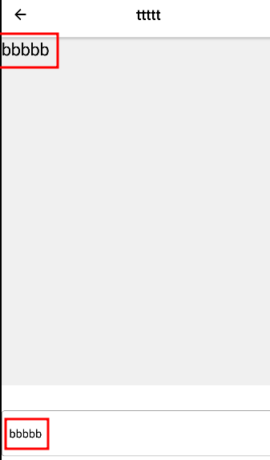

## GiftedChat 컴포넌트
- 메시지를 주고받는 화면은 일반적인 모바일 화면과 스크롤 방향이 반대입니다.
- 페이스북,인스타그램 등 스크롤 기능이 있는 대부분의 애플리케이션은 최신 데이터가 가장 위에 나오고 스크롤은 아래로 내려가도록 구성되어 있다.
- 하지만 채팅 어플리케이션에서 메시지를 주고받는 화면은 최신 데이터가 가장 아래에 나타나고 스크롤의 방향은 위로 올라가도록 구성이 되어있다.
- FlatList 컴포넌트에는 inverted 속성이 있는데, 이 값에 따라 FlatList 컴포넌트를 뒤집은 것처럼 스크롤 방향이 변경된다.

### Channel.js
```js
<FlatList
    keyExtractor={item=>item['id']}
    data={messages}
    renderItem={({item}) => (
        <Text style={{ fontSize: 24}}>{item.text}</Text>
    )}
    inverted={true}
/>
```
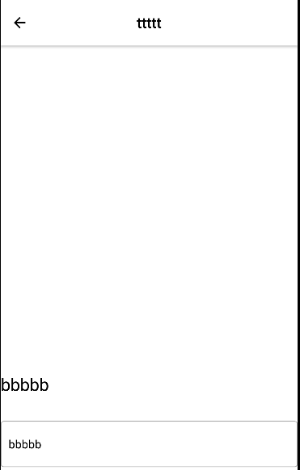

- 기획이나 디자인에 따라 메시지를 주고받는 화면에는 스크롤 방향 외에도 많은 것들이 필요하다.
- 예를 들어 본인이 보낸 메시지는 오른쪽에 이미지 없이 나타나고, 다른 사람이 보낸 메시지는 이미지 및 사용자 이름과 함께 왼쪽에 나타나는 것이 우리가 흔히 사용하는 채팅 애플리케이션의 모습이다.
- 우리가 직접 다양한 컴포넌트를 생성해서 언급된 화면의 모습을 만들 수도 있지만 많은 시간과 노력이 필요하다.
- 그래서 채팅 화면에서 사용할 수 있는 기능을 다양하게 제공하는 react-native-gifted-chat라이브러리를 사용해서 화면을 구성해보자
```
npm install react-native-gifted-chat
```

### theme.js
```js
export const theme = {
    ...
    sendButtonActivate: colors.blue,
    sendButtonInactivate: colors.grey_1
}
```

### Channel.js
```js
// React와 필요한 훅들을 가져옵니다.
import React,{useState,useEffect,useLayoutEffect} from "react";
// Firestore 데이터베이스와 메시지 생성 함수를 가져옵니다.
import { db, createMessage } from "../utils/firebase";
// Input 컴포넌트를 가져옵니다.
import { Input } from "../components";
// styled-components와 ThemeContext를 가져옵니다.
import styled,{ThemeContext} from "styled-components";
// Alert 컴포넌트를 react-native에서 가져옵니다.
import { Alert } from "react-native";
// GiftedChat 및 Send 컴포넌트를 react-native-gifted-chat에서 가져옵니다.
import { GiftedChat, Send } from "react-native-gifted-chat";
// Expo에서 MaterialIcons 아이콘을 가져옵니다.
import { MaterialIcons} from '@expo/vector-icons'
// Firestore에서 사용할 collection, onSnapshot, query, orderBy 함수를 가져옵니다.
import {
    collection,
    onSnapshot,
    query,
    orderBy,
  } from 'firebase/firestore';
// 현재 사용자 정보를 가져오는 유틸 함수를 가져옵니다.
import { getCurrentUser } from "../utils/firebase";

// Container 컴포넌트: 채팅 화면 전체를 감싸는 View로, 테마의 background 색상을 적용합니다.
const Container = styled.View`
    flex: 1;
    background-color: ${({theme})=> theme.background};
`;

// SendButton 컴포넌트: 메시지 전송 버튼 커스텀 컴포넌트
const sendButton = props => {

    // ThemeContext를 사용하여 현재 테마 정보를 가져옵니다.
    const theme = useContext(ThemeContext);

    return(
        // GiftedChat의 Send 컴포넌트를 사용하여 전송 버튼 렌더링
        <Send
            {...props}
            disabled={!props.text}
            containerStyle={{
                width:44,
                height:44,
                alignItems: 'center',
                justifyContent: 'center',
                marginHorizontal: 4,
            }}
        >
             {/* MaterialIcons를 사용하여 'send' 아이콘 표시 */}
            <MaterialIcons
                name="send"
                size={24}
                color={
                    // 텍스트가 있을 경우 활성화 색상, 없으면 비활성화 색상 적용
                    props.text ? theme.sendButtonActivate : theme.sendButtonInactivate
                }
            />
        </Send>
    )
}

// Channel 컴포넌트: 채팅 채널 화면을 렌더링합니다.
const Channel = ({navigation, route}) => {

    // route 객체에서 params를 추출합니다.
    const {params} = route;
    // ThemeContext를 사용하여 현재 테마 정보를 가져옵니다.
    const theme = useContext(ThemeContext);
   // 현재 사용자의 uid, 이름, 프로필 사진 URL을 가져옵니다.
    const { uid, name, photoUrl } = getCurrentUser();
    // 메시지 배열 상태를 선언합니다.
    const [messages, setMessages] = useState([]);

    // Firestore에서 메시지 데이터를 실시간 구독하여 가져옵니다.
    useEffect(() => {
        // params.id가 없으면 아래 코드 실행 방지
        if (!params.id) return;

        // "channels" 컬렉션 아래에 있는 특정 채널의 "messages" 서브컬렉션 참조 생성
        const messagesRef = collection(db, "channels", params.id, "messages");

        // createdAt 필드를 기준으로 내림차순 정렬한 쿼리 생성
        const collectionQuery = query(messagesRef, orderBy("createdAt", "desc"));

        // onSnapshot을 사용해 실시간 데이터 구독 및 업데이트
        const unsubscribe = onSnapshot(collectionQuery, (snapshot) => {
          // 각 문서 데이터를 배열로 변환, 문서 id를 포함시킴
          const list = snapshot.docs.map(doc => ({
            id: doc.id,
            ...doc.data(),
          }));
          // 상태 업데이트
          setMessages(list);
        });
        // 컴포넌트 언마운트 시 구독 해제
        return () => unsubscribe();
      }, []);// 의존성 배열이 비어 있으므로 처음 렌더링 시 한 번 실행

      // useLayoutEffect를 사용해 네비게이션 옵션(헤더 제목)을 설정합니다.
      useLayoutEffect(() => {
        navigation.setOptions({headerTitle: params.title || 'Channel'})
      },[])

      // 메시지 전송 시 호출되는 함수
    const _handleMessageSend = async messageList => { 
        // GiftedChat에서 전달받은 메시지 배열의 첫 번째 메시지를 추출
        const newMessage = messageList[0];
        console.log(newMessage);
        try {
            // createMessage 함수를 통해 새로운 메시지를 Firestore에 저장
            await createMessage({ channelId: params.id, message: newMessage });
        } catch (e) {
            // 오류 발생 시 Alert를 통해 에러 메시지 표시
            Alert.alert('Send Message Error', e.message);
        }
    };

    // 채팅 화면 렌더링
    return (
        <Container>
            <GiftedChat
                // 리스트 뷰의 스타일을 테마의 background 색상으로 지정
                listViewProps={{
                    style: { backgroundColor: theme.background },
                }}
                placeholder="Enter a message..."  // 입력창에 표시할 플레이스홀더
                messages={messages}  // 채팅 메시지 배열 전달
                user={{ _id: uid, name, avatar: photoUrl }}  // 현재 사용자 정보 전달
                onSend={_handleMessageSend}  // 메시지 전송 시 호출되는 함수 지정
                alwaysShowSend={true}  // 항상 전송 버튼 표시
                textInputProps={{
                    autoCapitalize: 'none', // 자동 대문자 변환 해제
                    autoCorrect: false,     // 자동 수정 기능 해제
                    textContentType: 'none', // iOS에서 텍스트 컨텐츠 타입 지정 안함
                    underlineColorAndroid: 'transparent', // Android에서 밑줄 제거
                }}
                multiline={false}  // 입력창에서 다중 행 입력 허용 여부(false로 단일 행 입력)
                renderUsernameOnMessage={true}  // 메시지에 사용자 이름 표시
                scrollToBottom={true}  // 새 메시지 추가 시 스크롤 아래로 이동
                renderSend={props => <SendButton {...props} />}  // 커스텀 전송 버튼 렌더링
            />
        </Container>
    );
};

// Channel 컴포넌트를 기본 내보내기 합니다.
export default Channel;
```
- **주요포인트**
  - 실시간 데이터 구독: onSnapshot을 사용해 FireStore에서 채팅 메시지를 실시간으로 받아와 상태를 업데이트합니다.
  - 메시지 전송: 메시지를 전송할 때 createMessage함수를 호출하여 Firestore에 저장하고, 전송 실패시 Alert로 에러 메시지를 보여준다.
  - UI 구성: GiftedChat컴포넌트를 사용해 채팅 UI를 구성하며, 테마에 따라 스타일을 적용하고, 사용자 정보 및 커스텀 전송버튼을 설정한다.
